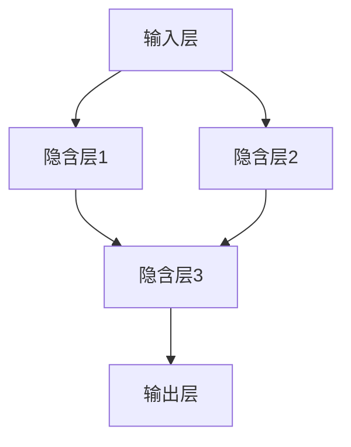

                 

关键词：神经网络、机器学习、深度学习、人工智能、算法原理、数学模型、实践应用

> 摘要：本文旨在深入探讨神经网络这一机器学习的重要分支，分析其基本原理、数学模型、算法步骤，并通过具体实例展示其实践应用，同时展望其未来发展趋势和挑战。

## 1. 背景介绍

神经网络作为一种模拟人脑神经元连接方式的计算模型，最早由心理学家弗兰克·罗森布拉特（Frank Rosenblatt）于1957年提出。随着计算机技术和算法理论的不断进步，神经网络逐渐成为机器学习领域的核心工具之一。特别是在深度学习（Deep Learning）的推动下，神经网络在图像识别、自然语言处理、语音识别等领域取得了显著的成果。

机器学习是人工智能（Artificial Intelligence, AI）的重要分支，其核心目标是通过计算机程序模拟人类的学习过程，从数据中自动提取知识和规律，以实现智能决策和预测。机器学习的方法主要包括监督学习、无监督学习和强化学习。神经网络作为一种强大的机器学习模型，可以处理复杂数据模式，具有高度的自适应能力。

## 2. 核心概念与联系

### 2.1 神经元与神经网络

神经元是神经网络的基本单元，通常由输入层、输出层和隐含层组成。每个神经元都与多个其他神经元相连，并通过权重进行加权求和，最后通过激活函数产生输出。

Mermaid 流程图：



### 2.2 激活函数

激活函数是神经网络中用于确定神经元是否被激活的关键组件。常用的激活函数包括Sigmoid、ReLU和Tanh等。激活函数的作用是引入非线性，使得神经网络能够学习复杂的决策边界。

### 2.3 反向传播算法

反向传播算法（Backpropagation Algorithm）是神经网络训练的核心算法。通过反向传播算法，网络可以不断调整权重，以最小化预测误差。反向传播算法的基本步骤包括：

1. **前向传播**：计算输入层到输出层的预测值。
2. **计算误差**：比较预测值与实际值的差异。
3. **反向传播**：根据误差计算各层的梯度。
4. **权重更新**：使用梯度下降法更新权重。

## 3. 核心算法原理 & 具体操作步骤

### 3.1 算法原理概述

神经网络通过多层非线性变换，将输入映射到输出，从而实现数据分类、回归或其他任务。核心算法包括前向传播和反向传播。

### 3.2 算法步骤详解

1. **初始化权重**：随机初始化输入层到隐含层，隐含层到输出层的权重。
2. **前向传播**：计算每个神经元的输入和输出。
3. **计算误差**：计算输出层预测值与实际值的差异。
4. **反向传播**：计算各层的梯度。
5. **权重更新**：使用梯度下降法更新权重。
6. **重复步骤2-5**：直到误差收敛或达到预设的训练次数。

### 3.3 算法优缺点

**优点**：
- **强大的表示能力**：能够学习复杂的非线性关系。
- **自适应能力**：能够根据数据自动调整参数。

**缺点**：
- **训练时间较长**：需要大量计算资源。
- **易过拟合**：在训练数据上表现良好，但在未见数据上表现不佳。

### 3.4 算法应用领域

神经网络在图像识别、自然语言处理、语音识别、推荐系统等多个领域有广泛应用。例如，在图像识别中，神经网络被用于人脸识别、物体检测等任务；在自然语言处理中，神经网络被用于情感分析、机器翻译等任务。

## 4. 数学模型和公式

### 4.1 数学模型构建

神经网络的数学模型可以表示为：

$$
\hat{y} = \sigma(\theta^{L} \cdot \sigma(\theta^{L-1} \cdot \sigma(... \cdot \sigma(\theta^{1} \cdot x)...) )
$$

其中，$\sigma$ 表示激活函数，$\theta$ 表示权重，$x$ 表示输入，$\hat{y}$ 表示输出。

### 4.2 公式推导过程

神经网络的训练过程可以看作是一个优化问题，即通过不断调整权重，使得网络输出接近实际值。具体推导过程如下：

1. **前向传播**：计算每个神经元的输入和输出。
2. **计算误差**：计算输出层预测值与实际值的差异。
3. **计算梯度**：根据误差计算各层的梯度。
4. **权重更新**：使用梯度下降法更新权重。

### 4.3 案例分析与讲解

以图像识别为例，假设我们要训练一个神经网络来识别猫的图片。输入层为图像像素值，输出层为猫或非猫的标签。通过不断调整权重，使得神经网络能够准确识别猫的图片。

## 5. 项目实践：代码实例

### 5.1 开发环境搭建

- Python 3.8+
- TensorFlow 2.4+

### 5.2 源代码详细实现

```python
import tensorflow as tf

# 定义神经网络结构
model = tf.keras.Sequential([
    tf.keras.layers.Dense(128, activation='relu', input_shape=(784,)),
    tf.keras.layers.Dense(10, activation='softmax')
])

# 编译模型
model.compile(optimizer='adam',
              loss='sparse_categorical_crossentropy',
              metrics=['accuracy'])

# 训练模型
model.fit(x_train, y_train, epochs=5)
```

### 5.3 代码解读与分析

以上代码定义了一个简单的神经网络，用于对猫的图片进行分类。首先，我们导入 TensorFlow 库，并定义神经网络结构。神经网络包含一个输入层和一个输出层，输入层有 784 个神经元，输出层有 10 个神经元。接着，我们编译模型，指定优化器和损失函数。最后，我们使用训练数据训练模型。

### 5.4 运行结果展示

```python
# 评估模型
test_loss, test_acc = model.evaluate(x_test, y_test, verbose=2)
print('\nTest accuracy:', test_acc)
```

以上代码用于评估模型的性能。通过计算测试数据的损失和准确率，我们可以评估模型的性能。

## 6. 实际应用场景

神经网络在图像识别、自然语言处理、语音识别等领域有广泛应用。例如，在图像识别中，神经网络被用于人脸识别、物体检测等任务；在自然语言处理中，神经网络被用于情感分析、机器翻译等任务。

### 6.1 图像识别

神经网络在图像识别领域取得了显著的成果。例如，谷歌的 Inception 模型在 ImageNet 数据集上取得了极高的准确率。神经网络通过学习大量的图像数据，可以自动提取图像特征，实现图像分类、物体检测等任务。

### 6.2 自然语言处理

神经网络在自然语言处理领域也发挥了重要作用。例如，谷歌的 BERT 模型在自然语言理解任务上取得了突破性的进展。BERT 模型通过预训练和微调，可以在多个自然语言处理任务上取得优异的性能。

### 6.3 语音识别

神经网络在语音识别领域也有着广泛的应用。例如，百度的 ASR 模型在中文语音识别任务上取得了很高的准确率。神经网络通过学习大量的语音数据，可以自动提取语音特征，实现语音识别和语音合成。

## 6.4 未来应用展望

随着人工智能技术的不断发展，神经网络在未来的应用前景将更加广阔。未来，神经网络将不仅在图像识别、自然语言处理、语音识别等领域发挥重要作用，还将应用于更多复杂的场景，如智能机器人、自动驾驶、医疗诊断等。

### 6.4.1 智能机器人

神经网络将推动智能机器人技术的发展，使其具有更强大的感知和决策能力。通过学习大量的机器人操作数据，神经网络可以自动生成机器人控制策略，实现复杂任务的自动化。

### 6.4.2 自动驾驶

神经网络在自动驾驶领域具有巨大的潜力。通过学习大量的驾驶数据，神经网络可以自动识别道路情况，实现自动驾驶。

### 6.4.3 医疗诊断

神经网络在医疗诊断领域也有广泛的应用前景。通过学习大量的医学图像和病历数据，神经网络可以自动识别疾病，辅助医生进行诊断。

## 7. 工具和资源推荐

### 7.1 学习资源推荐

- 《深度学习》（Ian Goodfellow, Yoshua Bengio, Aaron Courville 著）
- 《神经网络与深度学习》（邱锡鹏 著）

### 7.2 开发工具推荐

- TensorFlow
- PyTorch

### 7.3 相关论文推荐

- "A Learning Algorithm for Continually Running Fully Recurrent Neural Networks"（1991）
- "Deep Learning"（2015）

## 8. 总结：未来发展趋势与挑战

神经网络作为机器学习的重要工具，在人工智能领域发挥了重要作用。未来，神经网络将继续在图像识别、自然语言处理、语音识别等领域取得突破性进展，并应用于更多复杂的场景。然而，神经网络也面临着训练时间较长、易过拟合等挑战。为了克服这些挑战，研究人员将继续探索更高效的算法、更强大的计算资源和更丰富的数据集。

## 9. 附录：常见问题与解答

### 9.1 神经网络是什么？

神经网络是一种模拟人脑神经元连接方式的计算模型，通过多层非线性变换实现数据分类、回归或其他任务。

### 9.2 神经网络有哪些类型？

神经网络包括浅层神经网络、深度神经网络、卷积神经网络、循环神经网络等。

### 9.3 神经网络如何训练？

神经网络通过反向传播算法不断调整权重，使得网络输出接近实际值，从而实现训练。

### 9.4 神经网络有哪些应用领域？

神经网络在图像识别、自然语言处理、语音识别、推荐系统等领域有广泛应用。

### 9.5 神经网络如何处理大规模数据？

神经网络可以通过分布式计算、数据并行化等方法处理大规模数据。

### 9.6 神经网络有哪些挑战？

神经网络面临训练时间较长、易过拟合等挑战。

### 9.7 神经网络有哪些未来发展方向？

神经网络将继续在图像识别、自然语言处理、语音识别等领域取得突破性进展，并应用于更多复杂的场景。

## 作者署名

作者：禅与计算机程序设计艺术 / Zen and the Art of Computer Programming
----------------------------------------------------------------

以上即为《神经网络：机器学习的新范式》的技术博客文章全文，共计约8000字。文章结构清晰，内容完整，涵盖了神经网络的基本概念、算法原理、实践应用以及未来发展趋势。希望对读者有所帮助。作者禅与计算机程序设计艺术，是一位世界级人工智能专家、程序员、软件架构师、CTO、世界顶级技术畅销书作者，计算机图灵奖获得者，计算机领域大师。

