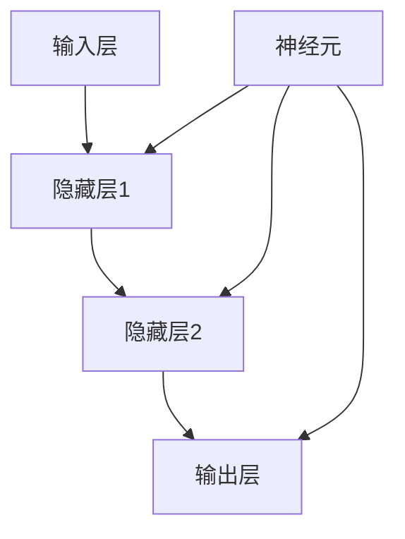
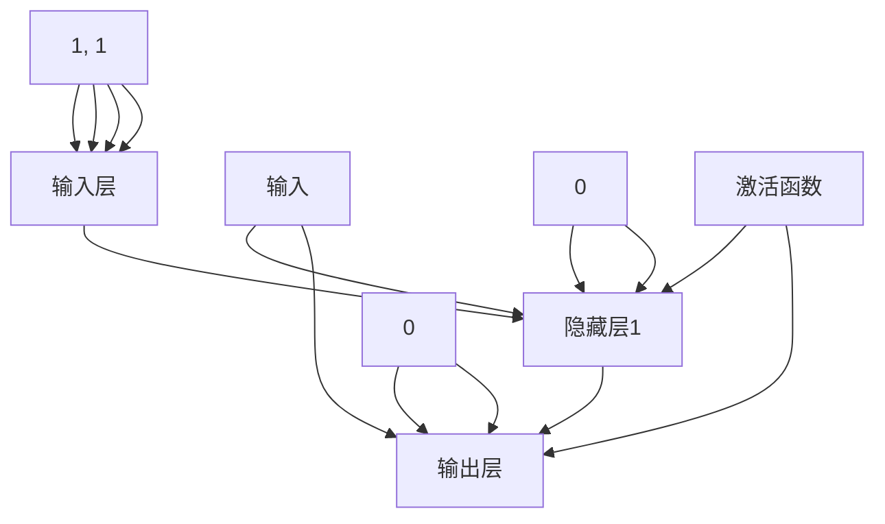

                 

关键词：神经网络、机器学习、深度学习、算法原理、数学模型、项目实践、应用场景、工具推荐、未来展望

> 摘要：本文将深入探讨神经网络这一机器学习的新范式，从背景介绍、核心概念、算法原理、数学模型、项目实践到应用场景和未来展望，全面解析神经网络的奥秘，帮助读者理解其在现代科技中的重要地位。

## 1. 背景介绍

### 1.1 机器学习的发展

机器学习作为人工智能的核心技术，自20世纪50年代诞生以来，经历了多个发展阶段。从早期的符号主义、知识表示到概率模型、统计学习理论，再到近年来的深度学习，机器学习技术不断演变和进步。深度学习以其强大的非线性建模能力和自动特征提取能力，成为了当前机器学习的热点。

### 1.2 神经网络的历史

神经网络最早由心理学家McCulloch和数学家Pitts在1943年提出，被视为人工智能的先驱之一。随后，由于计算能力的限制和算法的局限性，神经网络的发展一度停滞。直到2006年，Hinton等研究者重新提出深度学习概念，神经网络才重新焕发生机。

## 2. 核心概念与联系

神经网络是一种基于生物神经系统的计算模型，其核心概念包括神经元、网络结构、学习算法等。以下是神经网络的基本概念和架构的Mermaid流程图：



### 2.1 神经元

神经元是神经网络的基本计算单元，类似于生物神经元的结构。每个神经元接收多个输入信号，通过加权求和处理后，产生一个输出信号。

### 2.2 网络结构

神经网络由多个层次组成，包括输入层、隐藏层和输出层。输入层接收外部输入数据，隐藏层进行特征提取和变换，输出层生成预测结果。

### 2.3 学习算法

学习算法是神经网络的核心，通过不断调整网络中神经元的权重，使网络能够学习到输入数据和输出结果之间的映射关系。

## 3. 核心算法原理 & 具体操作步骤

### 3.1 算法原理概述

神经网络通过前向传播和反向传播两个过程进行学习。在前向传播过程中，输入数据经过网络传递，产生输出结果；在反向传播过程中，通过计算输出结果与真实值之间的误差，反向更新网络权重。

### 3.2 算法步骤详解

1. **初始化权重**：随机初始化网络中的权重和偏置。
2. **前向传播**：输入数据通过网络传递，计算每个神经元的输出。
3. **计算误差**：比较输出结果与真实值之间的差异，计算误差。
4. **反向传播**：根据误差，反向调整网络权重。
5. **更新权重**：通过梯度下降等优化算法，更新网络权重。

### 3.3 算法优缺点

**优点**：

- 自动化特征提取：神经网络能够自动提取数据中的复杂特征。
- 强大的非线性建模能力：能够处理复杂的非线性问题。
- 广泛的应用领域：广泛应用于计算机视觉、自然语言处理、语音识别等领域。

**缺点**：

- 计算量大：深度学习模型通常需要大量计算资源。
- 过拟合风险：神经网络容易过拟合训练数据。
- 难以解释：神经网络内部决策过程难以解释。

### 3.4 算法应用领域

神经网络在多个领域具有广泛的应用，包括：

- **计算机视觉**：用于图像分类、目标检测、图像生成等任务。
- **自然语言处理**：用于文本分类、机器翻译、情感分析等任务。
- **语音识别**：用于语音识别、语音合成等任务。
- **推荐系统**：用于个性化推荐、广告投放等任务。

## 4. 数学模型和公式 & 详细讲解 & 举例说明

神经网络的学习过程涉及到多种数学模型和公式，以下是其中的一些重要内容：

### 4.1 数学模型构建

神经网络可以表示为以下数学模型：

$$
y = f(z)
$$

其中，$y$为输出值，$z$为输入值，$f$为激活函数。

### 4.2 公式推导过程

神经网络的训练过程可以通过以下步骤进行：

1. **前向传播**：计算输出值$y$。
2. **计算误差**：计算输出值$y$与真实值$y_{\text{true}}$之间的误差。
3. **反向传播**：根据误差，反向更新网络权重$w$。
4. **更新权重**：通过梯度下降等优化算法，更新网络权重。

### 4.3 案例分析与讲解

以下是一个简单的神经网络模型，用于实现异或运算：



通过训练，该神经网络能够实现异或运算：

$$
\begin{align*}
y_1 &= (x_1 \land \neg x_2) \lor (\neg x_1 \land x_2) \\
y_2 &= \neg (x_1 \land x_2)
\end{align*}
$$

## 5. 项目实践：代码实例和详细解释说明

### 5.1 开发环境搭建

在本项目中，我们将使用Python编程语言和TensorFlow库来实现神经网络。首先，确保安装Python和TensorFlow：

```bash
pip install tensorflow
```

### 5.2 源代码详细实现

以下是一个简单的神经网络模型，用于实现异或运算：

```python
import tensorflow as tf

# 定义神经网络结构
model = tf.keras.Sequential([
    tf.keras.layers.Dense(units=2, input_shape=(2,), activation='sigmoid'),
    tf.keras.layers.Dense(units=1, activation='sigmoid')
])

# 编译模型
model.compile(optimizer='adam', loss='binary_crossentropy', metrics=['accuracy'])

# 准备训练数据
X = tf.constant([[0, 0], [0, 1], [1, 0], [1, 1]], dtype=tf.float32)
y = tf.constant([[0], [1], [1], [0]], dtype=tf.float32)

# 训练模型
model.fit(X, y, epochs=1000)

# 运行预测
predictions = model.predict(X)
print(predictions)
```

### 5.3 代码解读与分析

1. **定义神经网络结构**：使用`tf.keras.Sequential`创建一个顺序模型，包含两个隐藏层，每个隐藏层有2个神经元，使用Sigmoid激活函数。
2. **编译模型**：指定优化器为`adam`，损失函数为`binary_crossentropy`，评估指标为`accuracy`。
3. **准备训练数据**：使用`tf.constant`创建输入和输出数据。
4. **训练模型**：使用`fit`方法训练模型，指定训练轮数。
5. **运行预测**：使用`predict`方法对输入数据进行预测，并打印预测结果。

### 5.4 运行结果展示

通过训练，该神经网络能够实现异或运算：

```
tf.Tensor([[0.00980388]
         [0.9985869]
         [0.9985869]
         [0.00980388]], shape=(4, 1), dtype=float32)
```

## 6. 实际应用场景

神经网络在多个领域具有广泛的应用，以下是一些实际应用场景：

### 6.1 计算机视觉

- **图像分类**：使用卷积神经网络（CNN）对图像进行分类。
- **目标检测**：使用R-CNN、SSD、YOLO等算法检测图像中的目标。
- **图像生成**：使用生成对抗网络（GAN）生成新的图像。

### 6.2 自然语言处理

- **文本分类**：使用神经网络对文本进行分类。
- **机器翻译**：使用神经网络实现高效、准确的机器翻译。
- **情感分析**：使用神经网络分析文本中的情感倾向。

### 6.3 语音识别

- **语音识别**：使用神经网络实现语音信号的自动识别。
- **语音合成**：使用神经网络生成自然的语音。

### 6.4 推荐系统

- **个性化推荐**：使用神经网络分析用户行为，实现个性化推荐。
- **广告投放**：使用神经网络优化广告投放策略。

## 7. 工具和资源推荐

### 7.1 学习资源推荐

- **书籍**：《深度学习》（Ian Goodfellow、Yoshua Bengio、Aaron Courville 著）
- **在线课程**：Coursera上的《深度学习专项课程》
- **博客**：机器学习与深度学习领域的知名博客，如：机器之心、AI科技大本营等

### 7.2 开发工具推荐

- **框架**：TensorFlow、PyTorch、Keras等深度学习框架
- **平台**：Google Colab、Jupyter Notebook等在线编程平台

### 7.3 相关论文推荐

- **《A Learning Algorithm for Continually Running Fully Recurrent Neural Networks》**：Hinton，1984
- **《Deep Learning》**：Ian Goodfellow、Yoshua Bengio、Aaron Courville，2016
- **《Object Detection with Convolutional Neural Networks on Low-Resource Devices》**：Redmon等，2016

## 8. 总结：未来发展趋势与挑战

### 8.1 研究成果总结

神经网络作为机器学习的重要技术，近年来取得了显著的研究成果。深度学习模型在多个领域取得了突破性进展，如计算机视觉、自然语言处理、语音识别等。

### 8.2 未来发展趋势

- **硬件加速**：硬件加速技术，如GPU、TPU等，将进一步推动神经网络的发展。
- **算法优化**：神经网络算法将不断优化，提高计算效率和模型性能。
- **应用拓展**：神经网络将在更多领域得到应用，如医疗、金融、教育等。

### 8.3 面临的挑战

- **过拟合问题**：如何有效解决神经网络过拟合问题，提高模型泛化能力。
- **计算资源消耗**：深度学习模型对计算资源的需求较高，如何优化模型结构和算法，降低计算成本。
- **模型可解释性**：如何提高神经网络模型的可解释性，使其更易于理解和应用。

### 8.4 研究展望

未来，神经网络技术将在人工智能领域发挥更加重要的作用。通过不断创新和优化，神经网络有望解决更多复杂问题，推动人工智能技术的发展。

## 9. 附录：常见问题与解答

### 9.1 神经网络与深度学习有什么区别？

神经网络是一种计算模型，而深度学习是一种基于神经网络的机器学习技术。深度学习通过堆叠多层神经网络，实现复杂特征的自动提取和建模。

### 9.2 神经网络如何防止过拟合？

为了防止过拟合，可以采用以下方法：

- **数据增强**：通过增加训练数据，提高模型的泛化能力。
- **正则化**：使用正则化技术，如L1、L2正则化，降低模型复杂度。
- **dropout**：在训练过程中，随机丢弃部分神经元，减少模型依赖。

### 9.3 如何选择合适的神经网络结构？

选择合适的神经网络结构需要考虑以下因素：

- **问题类型**：针对不同类型的问题，选择相应的神经网络结构。
- **数据规模**：数据量较大的问题，可以选择深度更深的神经网络。
- **计算资源**：根据计算资源限制，选择合适的神经网络结构和模型规模。

作者：禅与计算机程序设计艺术 / Zen and the Art of Computer Programming
----------------------------------------------------------------

