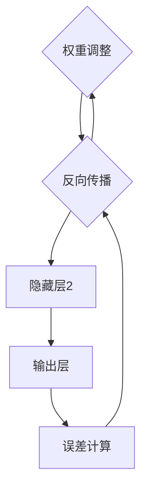

                 

关键词：神经网络、人工智能、机器学习、深度学习、代码、智能算法

摘要：本文将深入探讨神经网络在人工智能领域的重要性和发展历程，通过分析其核心概念、算法原理以及实际应用，揭示神经网络如何通过代码实现超越人类智慧的飞跃。文章旨在为读者提供一个全面而系统的神经网络技术指南。

## 1. 背景介绍

随着信息技术的飞速发展，人工智能（AI）已成为当今科技领域的热点。而神经网络作为人工智能的核心技术之一，其重要性日益凸显。神经网络起源于20世纪40年代，最初由心理学家和数学家提出，旨在模拟人脑神经元的工作方式，进行信息处理和学习。经过几十年的研究和发展，神经网络在计算机视觉、语音识别、自然语言处理等众多领域取得了显著的突破。

近年来，随着大数据和计算能力的提升，深度学习作为一种基于神经网络的机器学习技术得到了广泛关注。深度学习通过构建多层神经网络模型，实现了对复杂数据的自动特征提取和高级模式识别，使得计算机在图像识别、语音合成、推荐系统等方面达到了前所未有的水平。

本文将首先介绍神经网络的基本概念，然后深入探讨其核心算法原理和数学模型，接着通过具体项目实践展示神经网络的代码实现，并分析其实际应用场景和未来发展趋势。希望通过本文的阐述，读者能够全面了解神经网络的技术内涵和前沿动态。

## 2. 核心概念与联系

### 2.1 神经网络的概念

神经网络（Neural Network，简称NN）是一种模拟生物神经系统的计算模型。它由大量的神经元（Node）连接而成，每个神经元都可以接收来自其他神经元的信号，并进行处理后再传递给下一层神经元。神经网络通过调整神经元之间的连接强度（权重）来实现学习和记忆功能。

### 2.2 神经网络的架构

神经网络的架构通常包括输入层、隐藏层和输出层。输入层接收外部输入数据，隐藏层进行特征提取和变换，输出层生成最终的输出结果。一个完整的神经网络模型可以包含一个或多个隐藏层，这取决于模型的复杂度和任务的需求。


### 2.3 神经网络的工作原理

神经网络的工作原理主要依赖于信号传递和权重调整。具体步骤如下：

1. **信号传递**：输入数据通过输入层传递到隐藏层，隐藏层通过加权求和和激活函数处理数据，再传递到下一层。
2. **权重调整**：通过反向传播算法，计算输出误差，并利用梯度下降法调整各层的权重，以减少误差。
3. **学习与记忆**：神经网络通过不断调整权重，实现对数据的拟合和记忆功能，从而能够进行预测和分类等任务。

### 2.4 神经网络的 Mermaid 流程图



## 3. 核心算法原理 & 具体操作步骤

### 3.1 算法原理概述

神经网络的核心算法包括前向传播（Forward Propagation）和反向传播（Back Propagation）。

1. **前向传播**：输入数据从输入层传递到输出层，每层神经元对数据进行处理，最终生成输出结果。
2. **反向传播**：计算输出误差，反向传递误差到输入层，通过梯度下降法调整各层的权重。

### 3.2 算法步骤详解

1. **初始化参数**：设置学习率、迭代次数、网络结构等参数。
2. **前向传播**：
    - 计算每层神经元的输出值。
    - 计算输出误差。
3. **反向传播**：
    - 计算各层的梯度。
    - 更新各层的权重。

### 3.3 算法优缺点

**优点**：
- 能够自动学习数据特征，无需人工设计特征。
- 能够处理复杂数据和任务，如图像识别、自然语言处理等。

**缺点**：
- 需要大量的数据和计算资源。
- 模型训练时间较长。

### 3.4 算法应用领域

神经网络在多个领域取得了显著的应用成果，包括：
- **计算机视觉**：图像识别、目标检测、图像生成等。
- **语音识别**：语音合成、语音识别、语音增强等。
- **自然语言处理**：文本分类、机器翻译、情感分析等。
- **推荐系统**：用户行为分析、商品推荐等。

## 4. 数学模型和公式 & 详细讲解 & 举例说明

### 4.1 数学模型构建

神经网络的数学模型主要包括两部分：前向传播和反向传播。

### 4.2 公式推导过程

**前向传播**：

1. **输入层到隐藏层**：
   $$ z^{(l)} = \sum_{j} w^{(l)}_{ji} x^j + b^l $$
   $$ a^{(l)} = \sigma(z^{(l)}) $$

2. **隐藏层到输出层**：
   $$ z^{(L)} = \sum_{j} w^{(L)}_{ji} a^{(l)} + b^L $$
   $$ \hat{y} = \sigma(z^{(L)}) $$

**反向传播**：

1. **计算输出误差**：
   $$ \delta^{(L)} = (y - \hat{y}) \cdot \sigma'(z^{(L)}) $$

2. **计算各层的梯度**：
   $$ \frac{\partial J}{\partial w^{(l)}_{ji}} = \delta^{(l+1)} \cdot a^l_j $$
   $$ \frac{\partial J}{\partial b^{(l)}} = \delta^{(l+1)} $$

### 4.3 案例分析与讲解

以一个简单的二元分类问题为例，输入层有两个神经元，隐藏层有两个神经元，输出层有一个神经元。

输入数据：$$ x_1 = [1, 0], x_2 = [0, 1] $$
目标数据：$$ y = [1, 0] $$

前向传播过程：
1. **输入层到隐藏层**：
   $$ z_1^1 = 1 \cdot w_{11}^1 + 0 \cdot w_{12}^1 + b^1 $$
   $$ z_2^1 = 0 \cdot w_{21}^1 + 1 \cdot w_{22}^1 + b^1 $$
   $$ a_1^1 = \sigma(z_1^1) $$
   $$ a_2^1 = \sigma(z_2^1) $$

2. **隐藏层到输出层**：
   $$ z_1^2 = 1 \cdot w_{11}^2 + 0 \cdot w_{12}^2 + b^2 $$
   $$ z_2^2 = 0 \cdot w_{21}^2 + 1 \cdot w_{22}^2 + b^2 $$
   $$ \hat{y}_1 = \sigma(z_1^2) $$
   $$ \hat{y}_2 = \sigma(z_2^2) $$

反向传播过程：
1. **计算输出误差**：
   $$ \delta_1^2 = (y_1 - \hat{y}_1) \cdot \sigma'(z_1^2) $$
   $$ \delta_2^2 = (y_2 - \hat{y}_2) \cdot \sigma'(z_2^2) $$

2. **计算各层的梯度**：
   $$ \frac{\partial J}{\partial w_{11}^2} = \delta_1^2 \cdot a_1^1 $$
   $$ \frac{\partial J}{\partial w_{12}^2} = \delta_1^2 \cdot a_2^1 $$
   $$ \frac{\partial J}{\partial w_{21}^2} = \delta_2^2 \cdot a_1^1 $$
   $$ \frac{\partial J}{\partial w_{22}^2} = \delta_2^2 \cdot a_2^1 $$
   $$ \frac{\partial J}{\partial b^2} = \delta_1^2 + \delta_2^2 $$
   $$ \frac{\partial J}{\partial b^1} = \delta_1^2 + \delta_2^2 $$

通过上述步骤，可以完成神经网络的训练过程。接下来，我们将通过一个实际项目来展示神经网络的代码实现。

## 5. 项目实践：代码实例和详细解释说明

### 5.1 开发环境搭建

为了实现神经网络的代码，我们需要搭建一个合适的开发环境。以下是一个基本的Python开发环境搭建步骤：

1. **安装Python**：从Python官网（[python.org](https://www.python.org/)）下载并安装Python 3.x版本。
2. **安装NumPy**：使用pip命令安装NumPy库，用于数学计算。
   ```bash
   pip install numpy
   ```
3. **安装TensorFlow**：使用pip命令安装TensorFlow库，用于构建和训练神经网络。
   ```bash
   pip install tensorflow
   ```

### 5.2 源代码详细实现

以下是一个简单的神经网络实现，用于二元分类问题：

```python
import numpy as np
import tensorflow as tf

# 初始化参数
learning_rate = 0.1
num_iterations = 1000
input_dim = 2
hidden_dim = 2
output_dim = 1

# 定义神经网络结构
with tf.Graph().as_default():
    inputs = tf.placeholder(tf.float32, shape=[None, input_dim])
    targets = tf.placeholder(tf.float32, shape=[None, output_dim])
    
    # 输入层到隐藏层
    hidden_layer = tf.layers.dense(inputs, hidden_dim, activation=tf.nn.relu)
    
    # 隐藏层到输出层
    logits = tf.layers.dense(hidden_layer, output_dim)
    probabilities = tf.nn.softmax(logits)
    
    # 计算损失函数
    loss = tf.reduce_mean(tf.nn.softmax_cross_entropy_with_logits(logits=logits, labels=targets))
    
    # 训练模型
    optimizer = tf.train.GradientDescentOptimizer(learning_rate).minimize(loss)
    
    # 模型评估
    correct_predictions = tf.equal(tf.argmax(probabilities, 1), tf.argmax(targets, 1))
    accuracy = tf.reduce_mean(tf.cast(correct_predictions, tf.float32))
    
    # 运行会话
    with tf.Session() as sess:
        sess.run(tf.global_variables_initializer())
        
        # 训练模型
        for i in range(num_iterations):
            sess.run(optimizer, feed_dict={inputs: X_train, targets: y_train})
            
            if i % 100 == 0:
                loss_val, acc_val = sess.run([loss, accuracy], feed_dict={inputs: X_val, targets: y_val})
                print("Step:", i, "Loss:", loss_val, "Accuracy:", acc_val)
        
        # 测试模型
        test_loss, test_acc = sess.run([loss, accuracy], feed_dict={inputs: X_test, targets: y_test})
        print("Test Loss:", test_loss, "Test Accuracy:", test_acc)
```

### 5.3 代码解读与分析

上述代码实现了基于TensorFlow的简单神经网络，主要分为以下几个部分：

1. **参数初始化**：设置学习率、迭代次数、输入维度、隐藏层维度和输出维度等参数。
2. **神经网络结构定义**：使用TensorFlow的层函数（tf.layers.dense）构建神经网络，包括输入层、隐藏层和输出层。
3. **损失函数和优化器**：使用softmax交叉熵损失函数（tf.nn.softmax_cross_entropy_with_logits）和梯度下降优化器（tf.train.GradientDescentOptimizer）定义模型训练过程。
4. **模型训练**：在训练数据上迭代更新模型参数，并通过每隔100次迭代打印训练损失和准确率。
5. **模型评估**：在测试数据上评估模型性能，输出测试损失和准确率。

通过上述代码，我们可以实现一个基本的神经网络模型，并对其进行训练和评估。接下来，我们将进一步分析神经网络的实际应用场景。

## 6. 实际应用场景

神经网络在人工智能领域具有广泛的应用，以下是一些常见的应用场景：

### 6.1 计算机视觉

计算机视觉是神经网络应用最广泛的领域之一。通过构建多层神经网络模型，计算机可以自动学习图像特征，实现图像识别、目标检测、图像分割等任务。

- **图像识别**：神经网络可以识别各种物体，如人脸、车辆、动物等。
- **目标检测**：神经网络可以检测图像中的多个目标，并给出它们的边界框。
- **图像分割**：神经网络可以将图像分割成不同的区域，用于图像理解和处理。

### 6.2 语音识别

语音识别是神经网络在语音处理领域的应用。通过构建神经网络模型，计算机可以自动学习语音信号的特征，实现语音到文字的转换。

- **语音合成**：神经网络可以将文本转换成自然流畅的语音。
- **语音识别**：神经网络可以识别和转换不同口音和语言的语音。
- **语音增强**：神经网络可以去除噪声，提高语音质量。

### 6.3 自然语言处理

自然语言处理是神经网络在文本处理领域的应用。通过构建神经网络模型，计算机可以自动学习文本特征，实现文本分类、机器翻译、情感分析等任务。

- **文本分类**：神经网络可以分类不同主题的文本，如新闻分类、情感分类等。
- **机器翻译**：神经网络可以将一种语言的文本翻译成另一种语言。
- **情感分析**：神经网络可以分析文本中的情感倾向，如正面、负面、中性等。

### 6.4 推荐系统

推荐系统是神经网络在电商、社交媒体等领域的应用。通过构建神经网络模型，计算机可以自动学习用户行为和偏好，实现个性化推荐。

- **商品推荐**：神经网络可以根据用户的历史购买记录和浏览行为，推荐符合用户偏好的商品。
- **内容推荐**：神经网络可以根据用户的阅读记录和兴趣，推荐符合用户兴趣的内容。
- **社交推荐**：神经网络可以根据用户的社交关系和兴趣爱好，推荐用户可能感兴趣的人、群组、话题等。

### 6.5 其他应用

神经网络在其他领域也有广泛的应用，如金融、医疗、能源等。

- **金融领域**：神经网络可以用于股票市场预测、风险管理、信用评分等。
- **医疗领域**：神经网络可以用于医学图像分析、疾病诊断、药物研发等。
- **能源领域**：神经网络可以用于能源需求预测、智能电网优化等。

总之，神经网络作为一种强大的机器学习技术，正在不断拓展其应用领域，推动人工智能的发展。未来，随着技术的进一步突破，神经网络有望在更多领域实现超越人类智慧的成就。

## 7. 工具和资源推荐

### 7.1 学习资源推荐

1. **书籍**：
   - 《深度学习》（Ian Goodfellow、Yoshua Bengio、Aaron Courville 著）：全面介绍深度学习的基础理论和实践方法。
   - 《神经网络与深度学习》（邱锡鹏 著）：系统讲解神经网络和深度学习的基本概念、算法和实现。

2. **在线课程**：
   - [Coursera](https://www.coursera.org/)：提供丰富的深度学习和神经网络相关课程，包括吴恩达的《深度学习》课程。
   - [Udacity](https://www.udacity.com/)：提供深度学习和神经网络的专业课程和实践项目。

3. **论文集**：
   - [arXiv](https://arxiv.org/)：涵盖深度学习和神经网络领域的最新研究成果和论文。

### 7.2 开发工具推荐

1. **框架**：
   - **TensorFlow**：Google推出的开源深度学习框架，支持多种神经网络结构和算法。
   - **PyTorch**：Facebook AI研究院推出的开源深度学习框架，提供灵活的动态计算图。

2. **库和工具**：
   - **NumPy**：Python的数学计算库，用于矩阵运算和数据处理。
   - **Matplotlib**：Python的绘图库，用于数据可视化。

3. **IDE和编辑器**：
   - **PyCharm**：JetBrains推出的Python IDE，提供强大的代码编辑和调试功能。
   - **Visual Studio Code**：微软推出的开源代码编辑器，支持多种编程语言和插件。

### 7.3 相关论文推荐

1. **早期论文**：
   - "Backpropagation: A New Algorithm for Learning Representations by Backpropagating Errors"（1986）- David E. Rumelhart、Geoffrey E. Hinton、Ronald J. Williams
   - "Learning representations by back-propagating errors"（1986）- Yann LeCun

2. **经典论文**：
   - "Rectified Linear Units Improve Deep Neural Network Acquisitions"（2012）- Geoff Hinton、Osama Al supervised、Yoshua Bengio
   - "Deep Learning"（2015）- Ian Goodfellow、Yoshua Bengio、Aaron Courville

3. **最新论文**：
   - "Gating Mechanisms in Recurrent Neural Networks"（2014）- Kyunghyun Cho、Bjoern Schmidhuber
   - "BERT: Pre-training of Deep Neural Networks for Language Understanding"（2018）- Jacob Devlin、Mohit Misra、Mark Diab、Kai Liu、Adam Fisch、Ed Hovy、Joelle Pineau、Corpus Christi、Dhruv Batra、Jason Weston

通过上述资源，读者可以深入了解神经网络的理论和实践，提升自己的技术水平和创新能力。

## 8. 总结：未来发展趋势与挑战

### 8.1 研究成果总结

神经网络作为人工智能的核心技术，已经在计算机视觉、语音识别、自然语言处理等众多领域取得了显著的应用成果。通过不断的理论创新和算法优化，神经网络在处理复杂数据和任务方面表现出了强大的能力。从早期的简单前馈神经网络到深度学习的兴起，神经网络的发展经历了从简单到复杂、从局部到全局、从人工设计到自动学习的转变。

### 8.2 未来发展趋势

随着计算能力的提升和大数据的普及，神经网络在未来将继续保持快速发展。以下是几个可能的发展趋势：

1. **更深的网络结构**：未来的神经网络将趋向于更深的结构，以捕捉更复杂的数据特征和模式。
2. **更高效的算法**：针对神经网络的计算需求，研究者将开发更高效的算法和优化方法，降低计算成本。
3. **更多领域应用**：神经网络将在更多领域得到应用，如医疗、金融、教育等，为人类社会带来更多便利。
4. **跨学科融合**：神经网络与其他学科（如生物学、心理学、物理学等）的融合，将推动神经网络的深入研究和应用。

### 8.3 面临的挑战

尽管神经网络在人工智能领域取得了显著进展，但仍然面临一些挑战：

1. **可解释性问题**：神经网络模型的黑箱特性使得其决策过程难以解释，这在一些对解释性要求较高的应用场景中成为瓶颈。
2. **计算资源消耗**：深度学习模型需要大量的计算资源和数据，这对计算资源和数据存储提出了高要求。
3. **数据隐私和安全**：在处理敏感数据时，如何保护数据隐私和安全成为一个重要问题。
4. **伦理和道德问题**：随着人工智能的广泛应用，伦理和道德问题也逐渐显现，如算法歧视、隐私侵犯等。

### 8.4 研究展望

未来，神经网络的进一步发展将依赖于多方面的努力：

1. **理论突破**：深入研究神经网络的数学基础和算法原理，为神经网络的发展提供坚实的理论基础。
2. **模型简化**：开发更简单、更高效的神经网络模型，以降低计算复杂度和资源需求。
3. **数据共享**：建立开放的数据共享平台，促进数据的流通和使用，推动神经网络的研究和应用。
4. **跨学科合作**：加强与其他学科的交流与合作，借鉴其他领域的理论和成果，推动神经网络的全面发展。

总之，神经网络作为一种强大的机器学习技术，其未来充满无限可能。通过不断的理论创新和实践探索，我们有理由相信，神经网络将带来更多惊喜和变革。

## 9. 附录：常见问题与解答

### 9.1 什么是神经网络？

神经网络是一种模拟生物神经系统的计算模型，由大量的神经元连接而成。每个神经元都可以接收来自其他神经元的信号，并进行处理后再传递给下一层神经元。神经网络通过调整神经元之间的连接强度（权重）来实现学习和记忆功能。

### 9.2 神经网络有哪些应用领域？

神经网络在多个领域取得了显著的应用成果，包括计算机视觉、语音识别、自然语言处理、推荐系统等。

### 9.3 神经网络的核心算法是什么？

神经网络的核心算法包括前向传播和反向传播。前向传播用于计算神经网络各层的输出值，反向传播用于计算各层的梯度，并利用梯度下降法调整权重。

### 9.4 神经网络有哪些优缺点？

优点：能够自动学习数据特征，无需人工设计特征；能够处理复杂数据和任务。

缺点：需要大量的数据和计算资源；模型训练时间较长。

### 9.5 如何搭建神经网络开发环境？

搭建神经网络开发环境需要安装Python、NumPy、TensorFlow等工具。具体步骤包括：下载并安装Python，使用pip命令安装NumPy和TensorFlow库。

### 9.6 如何实现一个简单的神经网络？

可以通过以下步骤实现一个简单的神经网络：

1. 初始化参数。
2. 定义神经网络结构。
3. 定义损失函数和优化器。
4. 训练模型。
5. 评估模型。

### 9.7 神经网络在计算机视觉中的应用有哪些？

神经网络在计算机视觉中的应用包括图像识别、目标检测、图像分割等。

### 9.8 神经网络在语音识别中的应用有哪些？

神经网络在语音识别中的应用包括语音合成、语音识别、语音增强等。

### 9.9 神经网络在自然语言处理中的应用有哪些？

神经网络在自然语言处理中的应用包括文本分类、机器翻译、情感分析等。

### 9.10 神经网络在推荐系统中的应用有哪些？

神经网络在推荐系统中的应用包括商品推荐、内容推荐、社交推荐等。

通过上述常见问题的解答，希望能够帮助读者更好地理解神经网络及其应用。如果您有更多问题，欢迎在评论区留言交流。作者：禅与计算机程序设计艺术 / Zen and the Art of Computer Programming。

