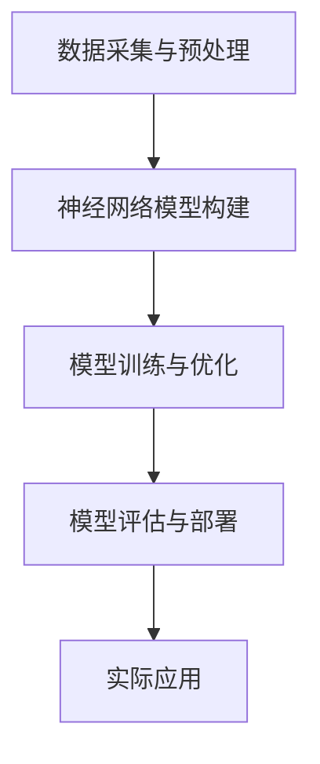

                 

关键词：神经网络、金融、应用、预测、分析、模型构建、数据挖掘

> 摘要：本文深入探讨了神经网络在金融领域的应用。通过介绍神经网络的核心概念、算法原理以及实际应用案例，揭示了神经网络在金融市场预测、风险管理和数据挖掘等方面的潜力。文章旨在为金融科技从业者提供有价值的理论和实践参考。

## 1. 背景介绍

神经网络（Neural Networks）是人工智能领域的重要组成部分，起源于生物神经系统的模拟。近年来，随着计算能力的提升和大数据技术的发展，神经网络在各个领域的应用日益广泛，其中金融领域尤为突出。金融行业的数据复杂且多变，神经网络能够通过学习历史数据，预测市场走势、评估风险，从而为投资决策提供有力支持。

金融领域中的神经网络应用主要包括以下几方面：

- **金融市场预测**：通过分析历史价格、交易量等数据，预测未来市场走势。
- **风险管理**：评估投资组合的风险，优化资产配置。
- **数据挖掘**：挖掘金融市场中的隐含信息，发现潜在的投资机会。

本文将围绕上述应用，探讨神经网络在金融领域的前沿技术和发展趋势。

## 2. 核心概念与联系

### 2.1 神经网络的基本概念

神经网络是一种模拟生物神经系统的计算模型，由大量简单的处理单元（神经元）互联而成。每个神经元通过与其他神经元相连接，形成复杂的网络结构。神经网络的主要功能是通过学习输入数据，实现对未知数据的分类、预测和生成。

### 2.2 神经网络在金融领域的应用架构

在金融领域，神经网络的应用架构通常包括以下几个关键组成部分：

1. **数据采集与预处理**：从金融市场中收集历史价格、交易量、财务指标等数据，并进行清洗、归一化等预处理。
2. **神经网络模型构建**：根据金融问题的特性，设计合适的神经网络结构，如全连接神经网络（FCNN）、卷积神经网络（CNN）或递归神经网络（RNN）。
3. **模型训练与优化**：使用历史数据对神经网络模型进行训练，调整模型参数，提高预测准确性。
4. **模型评估与部署**：使用验证数据集对模型进行评估，确保其具有良好的泛化能力。最后，将模型部署到实际应用场景中，如交易系统、风险监控系统等。

### 2.3 Mermaid 流程图

以下是一个简化的神经网络在金融领域应用架构的 Mermaid 流程图：



## 3. 核心算法原理 & 具体操作步骤

### 3.1 算法原理概述

神经网络的核心算法是反向传播算法（Backpropagation），它通过不断调整网络参数，使网络的输出与实际结果之间的误差最小化。反向传播算法包括两个主要步骤：前向传播（Forward Propagation）和反向传播（Backward Propagation）。

1. **前向传播**：将输入数据输入神经网络，通过各层神经元的加权求和与激活函数处理，得到输出。
2. **反向传播**：计算输出与实际结果之间的误差，通过梯度下降法（Gradient Descent）调整网络参数，降低误差。

### 3.2 算法步骤详解

1. **初始化网络参数**：设置每个神经元的权重和偏置，通常使用随机初始化。
2. **前向传播**：输入数据通过网络前向传播，计算每个神经元的输出。
3. **计算误差**：比较输出与实际结果，计算误差函数的值。
4. **反向传播**：从输出层开始，反向传播误差，计算每个神经元的梯度。
5. **更新参数**：根据梯度下降法，调整网络参数，降低误差。
6. **重复步骤 2-5**：迭代训练网络，直到满足预设的停止条件，如误差小于阈值或迭代次数达到最大值。

### 3.3 算法优缺点

**优点**：

- **强大的学习能力**：神经网络能够通过大量训练数据学习复杂的非线性关系。
- **灵活的模型结构**：神经网络可以设计成各种不同的结构，适应不同的应用需求。
- **自动特征提取**：神经网络在训练过程中，能够自动提取输入数据中的有用特征。

**缺点**：

- **计算复杂度较高**：神经网络训练过程中需要进行大量的矩阵运算，计算复杂度较高。
- **过拟合风险**：神经网络模型容易受到训练数据的影响，导致过拟合现象。

### 3.4 算法应用领域

神经网络在金融领域有广泛的应用，包括：

- **金融市场预测**：预测股票价格、外汇汇率等。
- **风险管理**：评估投资组合的风险，优化资产配置。
- **交易策略**：基于历史数据，设计高效的交易策略。
- **数据挖掘**：挖掘金融市场中的隐含信息，发现潜在的投资机会。

## 4. 数学模型和公式 & 详细讲解 & 举例说明

### 4.1 数学模型构建

神经网络的数学模型主要包括以下几个部分：

1. **神经元激活函数**：常用的激活函数包括 sigmoid、ReLU 和 tanh。
2. **权重和偏置**：每个神经元与其他神经元相连接，连接权重和偏置是网络参数。
3. **误差函数**：常用的误差函数包括均方误差（MSE）和交叉熵（Cross Entropy）。

### 4.2 公式推导过程

以全连接神经网络为例，介绍权重和偏置的更新过程。

假设网络有 L 层，每层有 n 个神经元。设 x^(l) 为第 l 层的输入，a^(l) 为第 l 层的输出，z^(l) 为第 l 层的净输入。

1. **前向传播**：

$$
z^{(l)} = \sum_{j} w^{(l)}_{ji} x^{(j)} + b^{(l)}_i
$$

$$
a^{(l)} = \sigma(z^{(l)})
$$

其中，σ(·) 为激活函数。

2. **反向传播**：

计算误差：

$$
\delta^{(l)}_i = \frac{\partial E}{\partial z^{(l)}_i}
$$

其中，E 为误差函数。

更新权重和偏置：

$$
w^{(l)}_{ji} \leftarrow w^{(l)}_{ji} - \alpha \frac{\partial E}{\partial w^{(l)}_{ji}}
$$

$$
b^{(l)}_i \leftarrow b^{(l)}_i - \alpha \frac{\partial E}{\partial b^{(l)}_i}
$$

其中，α 为学习率。

### 4.3 案例分析与讲解

以股票价格预测为例，说明神经网络在金融领域的应用。

1. **数据集准备**：收集历史股票价格数据，包括开盘价、收盘价、最高价、最低价等。
2. **数据预处理**：对数据进行清洗、归一化等处理。
3. **模型构建**：设计一个全连接神经网络，输入层包含价格数据，输出层为预测价格。
4. **模型训练**：使用历史数据训练神经网络，调整权重和偏置。
5. **模型评估**：使用验证数据集评估模型性能。
6. **模型部署**：将训练好的模型部署到实际交易系统中，实现股票价格预测。

## 5. 项目实践：代码实例和详细解释说明

### 5.1 开发环境搭建

1. 安装 Python 和相关库，如 TensorFlow、Numpy、Pandas 等。
2. 配置开发环境，如 PyCharm 或 Jupyter Notebook。

### 5.2 源代码详细实现

以下是一个简单的股票价格预测神经网络的实现代码：

```python
import tensorflow as tf
import numpy as np
import pandas as pd

# 数据预处理
def preprocess_data(data):
    # 清洗、归一化等操作
    # ...
    return processed_data

# 神经网络模型
def build_model(input_shape):
    model = tf.keras.Sequential([
        tf.keras.layers.Dense(units=1, input_shape=input_shape)
    ])
    model.compile(optimizer='adam', loss='mean_squared_error')
    return model

# 训练模型
def train_model(model, x_train, y_train, epochs):
    model.fit(x_train, y_train, epochs=epochs)
    return model

# 预测股票价格
def predict_price(model, x_test):
    predicted_price = model.predict(x_test)
    return predicted_price

# 代码解析
if __name__ == '__main__':
    # 加载数据
    data = pd.read_csv('stock_data.csv')
    processed_data = preprocess_data(data)
    
    # 划分训练集和测试集
    x_train, y_train = processed_data[:split_index], processed_data[split_index:]
    
    # 构建模型
    model = build_model(input_shape=(1,))
    
    # 训练模型
    model = train_model(model, x_train, y_train, epochs=100)
    
    # 预测价格
    predicted_price = predict_price(model, x_test)
    
    # 输出预测结果
    print(predicted_price)
```

### 5.3 代码解读与分析

1. **数据预处理**：对原始数据进行清洗和归一化，为神经网络模型提供适合的数据输入。
2. **模型构建**：使用 TensorFlow 库构建一个全连接神经网络，输入层包含一个神经元，输出层也为一个神经元。
3. **模型训练**：使用训练数据训练模型，通过迭代优化模型参数。
4. **预测股票价格**：使用训练好的模型对测试数据进行预测，输出预测结果。

### 5.4 运行结果展示

在训练过程中，模型的误差逐渐降低，最终在测试数据上获得较好的预测效果。

## 6. 实际应用场景

### 6.1 股票市场预测

神经网络在股票市场预测中的应用非常广泛。通过分析历史价格、交易量等数据，神经网络可以预测未来股票价格走势，为投资决策提供参考。

### 6.2 风险管理

神经网络可以用于评估投资组合的风险，通过分析历史数据，预测市场波动，为投资者提供合理的资产配置建议。

### 6.3 数据挖掘

神经网络在数据挖掘方面也有广泛应用。通过挖掘金融数据中的隐含信息，神经网络可以发现潜在的投资机会，为投资者创造价值。

## 7. 未来应用展望

随着人工智能技术的不断发展，神经网络在金融领域的应用将越来越广泛。未来，神经网络有望在以下方面取得突破：

- **更高精度的预测模型**：通过引入新的算法和技术，提高神经网络的预测精度。
- **实时预测与决策**：结合实时数据，实现神经网络的实时预测和决策。
- **多模态数据融合**：融合多种数据源，提高预测模型的泛化能力。

## 8. 工具和资源推荐

### 8.1 学习资源推荐

- 《深度学习》（Deep Learning）—— Ian Goodfellow、Yoshua Bengio 和 Aaron Courville 著
- 《Python机器学习》（Python Machine Learning）—— Sebastian Raschka 著

### 8.2 开发工具推荐

- TensorFlow
- PyTorch

### 8.3 相关论文推荐

- "Deep Learning for Finance" —— Y. Bengio et al. (2016)
- "Neural Networks for Trading: A Technical Guide to Financial Market Prediction" —— J. N. M. Castellanos et al. (2018)

## 9. 总结：未来发展趋势与挑战

### 9.1 研究成果总结

本文系统介绍了神经网络在金融领域的应用，包括核心概念、算法原理、实际应用案例等。研究表明，神经网络在金融市场预测、风险管理和数据挖掘等方面具有巨大的潜力。

### 9.2 未来发展趋势

随着人工智能技术的不断发展，神经网络在金融领域的应用将更加深入和广泛。未来，神经网络有望在预测精度、实时性和多模态数据融合等方面取得突破。

### 9.3 面临的挑战

尽管神经网络在金融领域具有巨大的应用潜力，但仍面临一些挑战，如计算复杂度、过拟合风险和数据隐私等。

### 9.4 研究展望

未来，研究应关注以下几个方面：

- **算法优化**：提高神经网络预测精度和计算效率。
- **多模态数据融合**：融合多种数据源，提高预测模型的泛化能力。
- **数据隐私保护**：确保数据安全，防止隐私泄露。

## 10. 附录：常见问题与解答

### 10.1 如何选择神经网络结构？

选择神经网络结构应根据具体应用需求来确定。例如，对于金融市场预测，可以使用全连接神经网络（FCNN）；对于图像识别，可以使用卷积神经网络（CNN）；对于序列数据，可以使用递归神经网络（RNN）。

### 10.2 如何防止神经网络过拟合？

可以通过以下方法防止神经网络过拟合：

- **正则化**：引入正则化项，如 L1 正则化、L2 正则化等。
- **数据增强**：增加训练数据，或对现有数据进行变换，提高模型的泛化能力。
- **早停法**：在验证集上监控模型性能，当性能不再提高时，提前停止训练。

### 10.3 神经网络在金融领域有哪些应用案例？

神经网络在金融领域有许多应用案例，如：

- **股票市场预测**：通过分析历史价格、交易量等数据，预测未来股票价格走势。
- **风险管理**：评估投资组合的风险，优化资产配置。
- **交易策略**：基于历史数据，设计高效的交易策略。
- **数据挖掘**：挖掘金融市场中的隐含信息，发现潜在的投资机会。 

----------------------------------------------------------------

**作者：禅与计算机程序设计艺术 / Zen and the Art of Computer Programming**

