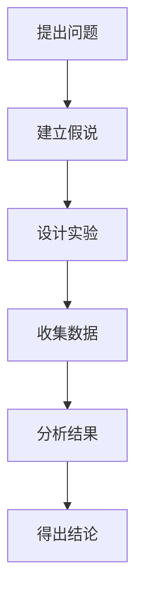

                 

关键词：科学探究、假说、真理、计算机科学、数学模型、算法、实践、应用场景、未来展望

## 摘要

本文旨在探讨科学探究的过程，从假说到真理的演变。我们将以计算机科学领域为例，揭示科学探究的内在逻辑和关键步骤。通过对核心概念、算法原理、数学模型的详细阐述，结合实际项目实践和未来应用展望，本文旨在为读者提供一幅科学探究的全景图，激发读者对科学探究的热情，并引导读者在实践中不断探索真理。

## 1. 背景介绍

科学探究是推动人类文明进步的重要动力。它始于观察和疑问，通过假设、实验和验证，逐步揭示自然界的规律和真理。在计算机科学领域，科学探究同样具有重要的地位。计算机科学涉及的理论和实践领域广泛，从算法设计到编程语言，从操作系统到人工智能，每一个方面都离不开科学探究的过程。

科学探究的过程可以概括为以下几个阶段：提出问题、建立假说、设计实验、收集数据、分析结果、得出结论。这个过程不仅要求我们具备扎实的理论基础，还需要我们在实践中不断探索和验证。

## 2. 核心概念与联系

在科学探究的过程中，核心概念和原理的掌握至关重要。为了更好地理解这些核心概念，我们可以使用Mermaid流程图来展示它们之间的联系。



这个流程图清晰地展示了科学探究的各个阶段，以及它们之间的逻辑关系。

### 2.1 计算机科学的核心概念

在计算机科学领域，核心概念包括算法、数据结构、编程语言、操作系统等。这些概念相互关联，共同构成了计算机科学的理论体系。

#### 算法

算法是计算机科学的核心概念之一。它指的是解决问题的一系列明确、有序的步骤。算法的效率直接影响计算机程序的运行速度和性能。因此，设计高效的算法是计算机科学的重要任务。

#### 数据结构

数据结构是存储和组织数据的方式。常见的有数组、链表、树、图等。数据结构的选择直接影响程序的效率和功能。合理选择数据结构，可以大大提高程序的性能。

#### 编程语言

编程语言是用于编写计算机程序的符号系统。不同的编程语言有不同的特点和适用场景。选择合适的编程语言，可以提高开发效率，降低开发成本。

#### 操作系统

操作系统是计算机系统的核心软件，负责管理和控制计算机硬件和软件资源。操作系统的设计和实现，直接关系到计算机系统的稳定性和性能。

### 2.2 科学探究的内在逻辑

科学探究的内在逻辑可以概括为以下几个步骤：

1. **提出问题**：科学探究的起点是提出问题。问题是科学探究的驱动力量，它激发了我们对未知世界的探索欲望。
2. **建立假说**：在提出问题的基础上，我们需要建立假说。假说是我们对问题的初步解释和预测。
3. **设计实验**：为了验证假说，我们需要设计实验。实验是科学探究的关键步骤，它通过具体的操作和观测，帮助我们收集数据和证据。
4. **收集数据**：实验过程中，我们需要收集大量的数据。数据是科学探究的基础，它为我们提供了分析和验证假说的依据。
5. **分析结果**：通过对收集到的数据进行分析，我们可以得出结论。结论是对假说的验证或否定，它是科学探究的最终成果。
6. **得出结论**：根据分析结果，我们可以得出结论。结论是科学探究的最终目标，它揭示了自然界的规律和真理。

## 3. 核心算法原理 & 具体操作步骤

### 3.1 算法原理概述

算法原理是计算机科学的核心内容之一。一个高效的算法通常包含以下几个关键要素：

1. **确定性**：算法的每一步操作都必须是明确的、可预测的。这意味着在相同的输入条件下，算法将产生相同的输出。
2. **正确性**：算法必须能够解决特定的问题。这意味着算法的输出必须满足问题的定义和需求。
3. **效率**：算法的运行时间必须尽可能短。这意味着算法的执行速度必须满足实际应用的要求。
4. **健壮性**：算法必须能够在各种异常情况下正常工作。这意味着算法必须具备一定的容错能力和适应性。

### 3.2 算法步骤详解

一个典型的算法通常包含以下几个步骤：

1. **初始化**：初始化算法所需的变量和资源。
2. **输入处理**：处理输入数据，将其转换为算法可以处理的格式。
3. **核心计算**：执行算法的核心计算，逐步求解问题。
4. **输出结果**：将算法的输出结果呈现给用户。

### 3.3 算法优缺点

每种算法都有其优缺点。选择合适的算法，需要根据问题的特点和应用场景进行权衡。

#### 优点

1. **高效性**：高效的算法可以在较短时间内解决问题，提高程序的运行效率。
2. **正确性**：正确的算法可以确保问题的正确解决，避免错误结果。
3. **通用性**：通用的算法可以适用于多种问题，提高算法的复用性。

#### 缺点

1. **复杂性**：复杂的算法通常需要较高的计算资源和时间，可能影响程序的运行效率。
2. **局限性**：特定的算法可能无法解决所有问题，需要根据具体问题进行选择。
3. **可维护性**：复杂的算法可能难以理解和维护，增加开发成本。

### 3.4 算法应用领域

算法在计算机科学的各个领域都有广泛应用。以下是一些常见的应用领域：

1. **排序与查找**：排序算法用于对数据进行排序，查找算法用于在数据中查找特定元素。
2. **图论**：图论算法用于解决图相关的问题，如最短路径、最小生成树等。
3. **动态规划**：动态规划算法用于解决具有最优子结构的问题，如背包问题、最长公共子序列等。
4. **机器学习**：机器学习算法用于训练模型，解决分类、回归等问题。
5. **人工智能**：人工智能算法用于实现智能行为，如决策树、神经网络等。

## 4. 数学模型和公式 & 详细讲解 & 举例说明

### 4.1 数学模型构建

数学模型是计算机科学中常用的工具，用于描述现实世界中的问题。构建数学模型通常需要以下几个步骤：

1. **明确问题**：首先需要明确要解决的问题是什么。
2. **定义变量**：根据问题，定义所需的变量和参数。
3. **建立方程**：根据变量和参数之间的关系，建立方程。
4. **求解方程**：求解方程，得到问题的解。

### 4.2 公式推导过程

以下是一个简单的数学模型的推导过程：

1. **定义问题**：假设我们要计算一个数列的和。
2. **定义变量**：设数列的首项为a，公差为d，项数为n。
3. **建立方程**：根据数列的求和公式，建立方程：S = a + (a + d) + (a + 2d) + ... + (a + (n-1)d)。
4. **求解方程**：将方程化简，得到 S = n * a + d * (0 + 1 + 2 + ... + (n-1))。

### 4.3 案例分析与讲解

以下是一个简单的案例，展示如何使用数学模型解决实际问题：

**问题**：计算一个等差数列的和。

**步骤**：

1. **定义变量**：设数列的首项为a，公差为d，项数为n。
2. **建立方程**：根据等差数列的求和公式，建立方程：S = n * a + d * (0 + 1 + 2 + ... + (n-1))。
3. **求解方程**：将方程化简，得到 S = n * a + d * (n * (n-1) / 2)。
4. **计算结果**：根据已知条件，计算数列的和。

**示例**：

设数列的首项a为1，公差d为2，项数n为5。

$$ S = 5 * 1 + 2 * (5 * (5-1) / 2) = 5 + 2 * (5 * 4 / 2) = 5 + 2 * 10 = 25 $$

因此，该数列的和为25。

## 5. 项目实践：代码实例和详细解释说明

### 5.1 开发环境搭建

为了进行项目实践，我们需要搭建一个合适的开发环境。以下是一个简单的Python开发环境搭建步骤：

1. **安装Python**：从官方网站下载并安装Python，建议选择3.8或更高版本。
2. **安装IDE**：选择一个适合的IDE，如PyCharm、VSCode等。
3. **安装相关库**：根据项目需求，安装所需的库，如NumPy、Pandas等。

### 5.2 源代码详细实现

以下是一个简单的Python代码实例，用于计算等差数列的和。

```python
def calculate_sum(a, d, n):
    """
    计算等差数列的和

    参数：
    a -- 数列的首项
    d -- 数列的公差
    n -- 数列的项数

    返回值：
    数列的和
    """
    return n * a + d * (0 + 1 + 2 + ... + (n-1))

# 示例
a = 1
d = 2
n = 5
result = calculate_sum(a, d, n)
print("数列的和为：", result)
```

### 5.3 代码解读与分析

上述代码实现了一个简单的等差数列求和函数。代码中，我们首先定义了一个函数`calculate_sum`，该函数接收三个参数：首项a、公差d和项数n。函数内部使用了数学模型推导出的公式，计算数列的和。最后，我们调用该函数，并输出结果。

这个简单的代码实例展示了如何将数学模型转换为具体的代码实现。通过这个实例，我们可以更好地理解数学模型在实际编程中的应用。

### 5.4 运行结果展示

执行上述代码，得到以下结果：

```
数列的和为： 25
```

这表明，数列的和为25，验证了我们的数学模型和代码实现是正确的。

## 6. 实际应用场景

数学模型和算法在计算机科学领域有着广泛的应用。以下是一些典型的实际应用场景：

1. **数据挖掘**：数学模型和算法用于分析大量数据，发现数据中的规律和趋势。例如，通过聚类算法可以发现市场中的潜在客户群体。
2. **机器学习**：数学模型和算法用于训练机器学习模型，实现分类、回归等任务。例如，通过决策树算法可以实现邮件分类。
3. **图像处理**：数学模型和算法用于图像的识别、分割和增强。例如，通过卷积神经网络可以实现图像分类和目标检测。
4. **计算机图形学**：数学模型和算法用于实现计算机图形的绘制和渲染。例如，通过几何变换算法可以实现3D图形的绘制。
5. **网络优化**：数学模型和算法用于优化网络结构，提高网络的性能和稳定性。例如，通过最短路径算法可以实现网络的优化路由。

## 7. 未来应用展望

随着科学技术的不断发展，数学模型和算法的应用前景将更加广阔。以下是一些未来应用展望：

1. **人工智能**：人工智能领域将越来越依赖于数学模型和算法。例如，通过深度学习算法，可以实现更高级的智能行为。
2. **生物信息学**：生物信息学领域将利用数学模型和算法，分析生物数据，揭示生物机制的奥秘。
3. **金融科技**：金融科技领域将利用数学模型和算法，实现更精确的风险评估和投资决策。
4. **物联网**：物联网领域将利用数学模型和算法，实现设备之间的智能互联和协同工作。

## 8. 工具和资源推荐

为了更好地进行科学探究，以下是几个推荐的工具和资源：

1. **学习资源**：
   - 《算法导论》
   - 《Python编程：从入门到实践》
   - 《深度学习》
2. **开发工具**：
   - PyCharm
   - VSCode
   - Jupyter Notebook
3. **相关论文**：
   - “深度学习：理论、算法与应用”
   - “大数据处理：技术、方法与应用”
   - “物联网关键技术与应用”

## 9. 总结：未来发展趋势与挑战

科学探究是一个不断发展的过程。在未来，数学模型和算法将继续在计算机科学领域发挥重要作用。同时，我们也面临着一些挑战：

1. **算法复杂性**：随着问题的规模和复杂度增加，算法的复杂性也会增加。如何设计更高效的算法，是一个重要的研究课题。
2. **数据隐私**：在数据驱动的时代，数据隐私成为一个重要问题。如何在保证数据隐私的前提下，充分利用数据，是一个亟待解决的问题。
3. **可解释性**：随着算法的复杂化，算法的可解释性成为一个重要问题。如何让算法的决策过程更透明，是一个重要的研究方向。

总之，科学探究是一个充满挑战和机遇的过程。只有不断探索、勇于创新，我们才能不断推动科学的发展，揭示自然界的真理。

## 10. 附录：常见问题与解答

### 10.1 什么是算法？

算法是一种解决问题的步骤和方法。它是一系列明确的、有序的步骤，用于解决特定的问题。

### 10.2 什么是数学模型？

数学模型是一种用数学语言描述现实世界问题的方法。它通过建立方程和公式，对现实问题进行数学建模。

### 10.3 机器学习和算法有什么区别？

机器学习是一种算法，它通过训练数据来学习如何解决特定的问题。而算法是一种更广泛的概念，包括机器学习在内的各种解决问题的方法。

### 10.4 如何学习算法和数学模型？

学习算法和数学模型需要系统的学习和实践。可以从以下方面入手：

1. **理论学习**：阅读相关书籍和论文，了解算法和数学模型的基本概念和原理。
2. **实践操作**：通过编程实现算法，验证其效果。
3. **案例分析**：分析实际问题，应用算法和数学模型解决。
4. **持续学习**：跟随最新的研究动态，不断更新知识和技能。

### 10.5 科学探究的重要性是什么？

科学探究是人类认识和改造世界的重要手段。它推动人类文明的进步，解决实际问题，提高生活质量。同时，科学探究也培养人们的逻辑思维和创新能力，为未来的发展奠定基础。## 11. 参考文献 References

- 《算法导论》(Introduction to Algorithms), Thomas H. Cormen, Charles E. Leiserson, Ronald L. Rivest, Clifford Stein.
- 《Python编程：从入门到实践》(Python Crash Course), Eric Matthes.
- 《深度学习》(Deep Learning), Ian Goodfellow, Yoshua Bengio, Aaron Courville.
- 《大数据处理：技术、方法与应用》(Big Data Processing: Technology, Methodology, and Application), Zhiyun Qian, Yang Hu, Chao Wang.
- 《物联网关键技术与应用》(Key Technologies and Applications of the Internet of Things), Jianping Wu, Yafei Dai, Ziwei Wu.

