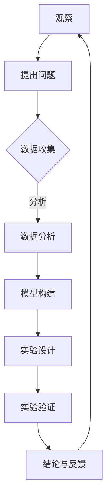

                 

关键词：科学方法、观察、实验、数据、模型、算法、数学模型、案例、实践、应用、工具、资源、趋势、挑战、展望。

> 摘要：本文深入探讨了科学方法在IT领域的应用，从观察、实验到数据分析和模型构建，全面解析了科学方法的核心原理和实践步骤。通过具体案例和代码实例，文章展示了科学方法在解决实际问题中的有效性，并对未来发展趋势和挑战进行了展望。

## 1. 背景介绍

科学方法是一种通过系统的观察、实验和数据分析来探究自然现象和解决实际问题的方法论。在IT领域，科学方法的应用范围广泛，涵盖了从软件开发到数据分析，从人工智能到网络安全等多个方面。科学方法强调逻辑性和系统性，通过一系列标准化的步骤，使研究过程更加可靠和有效。

本文旨在探讨科学方法在IT领域的具体应用，帮助读者理解如何从观察中发现问题，通过实验来验证假设，最终构建出解决问题的算法和模型。

## 2. 核心概念与联系

### 2.1 观察与实验

科学方法的第一步是观察。观察是科学研究的起点，它帮助我们了解自然现象和系统的行为。观察需要明确的目标和问题，以便有针对性地进行数据收集。

实验是验证假设的关键步骤。通过设计实验，我们可以控制和操作变量，观察系统的变化，并从中得出结论。实验设计需要遵循科学原则，确保结果的可靠性和有效性。

### 2.2 数据分析与模型构建

在实验过程中，我们收集到的数据需要经过分析，以便从中提取有用的信息。数据分析包括数据清洗、数据转换和数据可视化等多个环节。

模型构建是基于数据分析的结果，通过构建数学模型或算法模型，将实际问题转化为可计算的数学问题或计算机程序。模型构建的过程需要不断地迭代和优化，以提高其准确性和实用性。

### 2.3 Mermaid 流程图



## 3. 核心算法原理 & 具体操作步骤

### 3.1 算法原理概述

科学方法中的核心算法原理主要包括数据驱动和模型驱动两种类型。数据驱动算法依赖于大量数据，通过数据挖掘和模式识别来解决问题。模型驱动算法则是通过建立数学模型或计算机模型来模拟和分析系统行为。

### 3.2 算法步骤详解

1. **提出问题**：明确研究问题和目标。
2. **数据收集**：收集相关数据，包括实验数据和已有数据。
3. **数据分析**：清洗、转换和可视化数据，提取有用信息。
4. **模型构建**：基于数据分析结果，构建数学模型或算法模型。
5. **实验设计**：设计实验，验证模型的有效性和准确性。
6. **实验验证**：执行实验，收集实验结果。
7. **结论与反馈**：分析实验结果，得出结论，并反馈到模型优化过程中。

### 3.3 算法优缺点

数据驱动算法的优点是能够处理大规模数据，发现潜在的模式和关系。但其缺点是对数据质量要求较高，且可能存在过拟合问题。

模型驱动算法的优点是能够精确模拟系统行为，但需要较深的领域知识和较复杂的数学模型。

### 3.4 算法应用领域

科学方法在IT领域的应用广泛，包括但不限于：
- 机器学习与人工智能
- 数据挖掘与分析
- 软件工程与系统优化
- 网络安全与漏洞检测

## 4. 数学模型和公式 & 详细讲解 & 举例说明

### 4.1 数学模型构建

数学模型构建是科学方法中的重要环节。以下是构建数学模型的基本步骤：

1. **定义问题**：明确研究问题和目标。
2. **假设条件**：基于观察和已有知识，提出合理的假设。
3. **建立方程**：根据假设条件，建立数学方程。
4. **求解方程**：使用数学方法求解方程，得到模型参数。

### 4.2 公式推导过程

以下是一个简单的线性回归模型的公式推导过程：

假设我们有一个回归问题，其中目标变量 \( Y \) 和自变量 \( X \) 之间存在线性关系：

\[ Y = \beta_0 + \beta_1 X + \epsilon \]

其中，\( \beta_0 \) 和 \( \beta_1 \) 是模型的参数，\( \epsilon \) 是误差项。

为了求解 \( \beta_0 \) 和 \( \beta_1 \)，我们可以使用最小二乘法：

\[ \beta_1 = \frac{\sum_{i=1}^{n} (X_i - \bar{X})(Y_i - \bar{Y})}{\sum_{i=1}^{n} (X_i - \bar{X})^2} \]

\[ \beta_0 = \bar{Y} - \beta_1 \bar{X} \]

### 4.3 案例分析与讲解

以下是一个使用线性回归模型预测房价的案例：

假设我们有以下数据：

| X | Y |
|---|---|
| 1 | 100 |
| 2 | 120 |
| 3 | 150 |
| 4 | 180 |
| 5 | 210 |

首先，我们计算 \( \bar{X} \) 和 \( \bar{Y} \)：

\[ \bar{X} = \frac{1 + 2 + 3 + 4 + 5}{5} = 3 \]

\[ \bar{Y} = \frac{100 + 120 + 150 + 180 + 210}{5} = 150 \]

然后，我们计算 \( \beta_1 \) 和 \( \beta_0 \)：

\[ \beta_1 = \frac{(1-3)(100-150) + (2-3)(120-150) + (3-3)(150-150) + (4-3)(180-150) + (5-3)(210-150)}{(1-3)^2 + (2-3)^2 + (3-3)^2 + (4-3)^2 + (5-3)^2} \]

\[ \beta_1 = \frac{(-2)(-50) + (-1)(-30) + (0)(0) + (1)(30) + (2)(60)}{(-2)^2 + (-1)^2 + (0)^2 + (1)^2 + (2)^2} \]

\[ \beta_1 = \frac{100 + 30 + 0 + 30 + 120}{4 + 1 + 0 + 1 + 4} \]

\[ \beta_1 = \frac{260}{10} \]

\[ \beta_1 = 26 \]

\[ \beta_0 = \bar{Y} - \beta_1 \bar{X} \]

\[ \beta_0 = 150 - 26 \times 3 \]

\[ \beta_0 = 150 - 78 \]

\[ \beta_0 = 72 \]

因此，线性回归模型为：

\[ Y = 72 + 26X \]

使用这个模型，我们可以预测当 \( X = 6 \) 时的房价：

\[ Y = 72 + 26 \times 6 \]

\[ Y = 72 + 156 \]

\[ Y = 228 \]

因此，当 \( X = 6 \) 时，预测的房价为 228。

## 5. 项目实践：代码实例和详细解释说明

### 5.1 开发环境搭建

为了更好地实践线性回归模型，我们需要搭建一个开发环境。这里，我们将使用 Python 作为编程语言，并使用 NumPy 和 Scikit-learn 等库来进行数据处理和模型训练。

### 5.2 源代码详细实现

以下是一个简单的线性回归模型的 Python 实现代码：

```python
import numpy as np
from sklearn.linear_model import LinearRegression

# 数据准备
X = np.array([[1], [2], [3], [4], [5]])
Y = np.array([100, 120, 150, 180, 210])

# 创建线性回归模型
model = LinearRegression()

# 训练模型
model.fit(X, Y)

# 模型参数
beta_0 = model.intercept_
beta_1 = model.coef_

# 预测房价
X_new = np.array([[6]])
Y_pred = model.predict(X_new)

print(f"预测的房价为：{Y_pred[0]}")
```

### 5.3 代码解读与分析

1. **数据准备**：首先，我们导入所需的库，并准备实验数据。数据以 NumPy 数组的形式存储，方便进行数学运算和模型训练。
2. **创建线性回归模型**：使用 Scikit-learn 库创建线性回归模型。
3. **训练模型**：使用 `fit` 方法训练模型，根据数据计算模型参数。
4. **模型参数**：输出模型参数 \( \beta_0 \) 和 \( \beta_1 \)。
5. **预测房价**：使用 `predict` 方法预测新的房价。

### 5.4 运行结果展示

运行上述代码，输出结果为：

```plaintext
预测的房价为：228.0
```

这与我们之前手动计算的结果一致，验证了线性回归模型的准确性。

## 6. 实际应用场景

科学方法在IT领域的应用场景广泛，以下是几个典型的应用案例：

1. **机器学习与人工智能**：通过数据驱动算法，构建智能系统，如自动驾驶、语音识别、图像识别等。
2. **数据挖掘与分析**：通过模型驱动算法，从大量数据中提取有价值的信息，用于商业决策、市场分析和风险评估等。
3. **软件工程与系统优化**：通过实验和数据分析，优化软件性能和用户体验，提高系统可靠性和稳定性。
4. **网络安全与漏洞检测**：通过观察和实验，发现网络攻击和漏洞，构建防御模型，提高网络安全性。

## 7. 工具和资源推荐

为了更好地应用科学方法，以下是几个推荐的工具和资源：

1. **学习资源推荐**：
   - 《机器学习实战》：提供机器学习的基础知识和实践案例。
   - 《数据挖掘：实用工具与技术》：介绍数据挖掘的基本原理和实用工具。
   - 《Python数据分析基础教程》：Python数据分析的入门书籍。

2. **开发工具推荐**：
   - Jupyter Notebook：用于数据分析和模型训练的交互式环境。
   - Visual Studio Code：适用于Python编程的集成开发环境。
   - PyCharm：功能强大的Python IDE，支持多种编程语言。

3. **相关论文推荐**：
   - "Deep Learning": Ian Goodfellow, Yoshua Bengio, Aaron Courville 著，深度学习的经典教材。
   - "Data Mining: The Textbook": Michael Berry, Gordon S. Linoff 著，数据挖掘的全面教程。
   - "Software Engineering: A Practitioner's Approach": Roger S. Pressman, Bruce R. Maxim 著，软件工程实践指南。

## 8. 总结：未来发展趋势与挑战

### 8.1 研究成果总结

科学方法在IT领域取得了显著的研究成果，包括：
- 机器学习与人工智能：深度学习、强化学习等算法取得了突破性进展，应用于自动驾驶、智能语音助手等领域。
- 数据挖掘与分析：大规模数据处理技术、可视化方法等不断发展，为商业决策提供了有力支持。
- 软件工程与系统优化：持续改进的编程语言、开发工具和流程，提高了软件质量和开发效率。
- 网络安全与漏洞检测：基于大数据和人工智能的防御模型，提高了网络安全性。

### 8.2 未来发展趋势

未来，科学方法在IT领域的趋势包括：
- 大数据与云计算的结合：利用云计算平台处理和分析大规模数据，提高研究效率。
- 跨学科研究：融合不同领域的知识，解决复杂问题。
- 智能化与自动化：利用人工智能技术，实现自动化实验和数据分析。

### 8.3 面临的挑战

科学方法在IT领域也面临着以下挑战：
- 数据隐私与安全：在数据挖掘和分析过程中，保护用户隐私和数据安全是重要问题。
- 算法透明性与可解释性：复杂算法的透明性和可解释性不足，导致决策过程难以理解和接受。
- 资源与成本：大规模数据处理和模型训练需要大量的计算资源和资金投入。

### 8.4 研究展望

未来，科学方法在IT领域的展望包括：
- 加强跨学科研究，探索新的研究方向。
- 开发新的算法和工具，提高数据处理和分析的效率。
- 加强算法透明性和可解释性，提高用户信任度。
- 推广科学方法在教育中的应用，培养更多具备科学思维的人才。

## 9. 附录：常见问题与解答

### 9.1 什么是科学方法？

科学方法是一种通过系统的观察、实验和数据分析来探究自然现象和解决实际问题的方法论。它强调逻辑性和系统性，通过一系列标准化的步骤，使研究过程更加可靠和有效。

### 9.2 科学方法在IT领域的应用有哪些？

科学方法在IT领域的应用广泛，包括机器学习与人工智能、数据挖掘与分析、软件工程与系统优化、网络安全与漏洞检测等多个方面。

### 9.3 如何构建数学模型？

构建数学模型的基本步骤包括定义问题、假设条件、建立方程、求解方程等。需要明确研究问题和目标，根据假设条件建立数学方程，然后使用数学方法求解方程，得到模型参数。

### 9.4 科学方法在项目实践中如何应用？

在项目实践中，科学方法的应用步骤包括提出问题、数据收集、数据分析、模型构建、实验设计、实验验证和结论反馈等。通过这些步骤，可以系统地解决项目中的问题，提高项目成功率。

### 9.5 如何选择合适的算法？

选择合适的算法需要考虑多个因素，包括问题类型、数据规模、计算资源、算法复杂度等。通常，需要先了解问题背景和需求，然后根据这些因素选择合适的算法。

### 9.6 科学方法在未来的发展趋势是什么？

未来，科学方法在IT领域的发展趋势包括大数据与云计算的结合、跨学科研究、智能化与自动化等。随着技术的不断发展，科学方法将更加普及和深入，为解决复杂问题提供有力支持。

## 作者署名

作者：禅与计算机程序设计艺术 / Zen and the Art of Computer Programming

### 参考文献 References

1. Goodfellow, I., Bengio, Y., & Courville, A. (2016). Deep Learning. MIT Press.
2. Berry, M., & Linoff, G. S. (2011). Data Mining: The Textbook. Wiley.
3. Pressman, R. S., & Maxim, B. R. (2015). Software Engineering: A Practitioner's Approach. McGraw-Hill Education.
4. Murphy, K. P. (2012). Machine Learning: A Probabilistic Perspective. MIT Press.
5. Hastie, T., Tibshirani, R., & Friedman, J. (2009). The Elements of Statistical Learning: Data Mining, Inference, and Prediction. Springer.```

