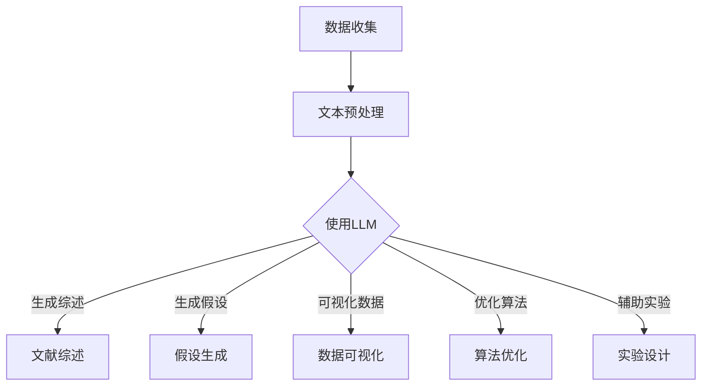

                 

关键词：大型语言模型（LLM），科学研究，算法优化，知识发现，创新加速，科研助手。

> 摘要：随着人工智能技术的飞速发展，大型语言模型（LLM）已经展现出强大的潜力，尤其是在科学研究领域。本文将深入探讨LLM如何通过优化算法、加速知识发现以及推动创新，成为科研工作者的得力助手。

## 1. 背景介绍

在过去的几十年中，科学研究的进展在很大程度上依赖于计算机科学的发展。从早期的数据分析到现代的模拟和仿真，计算机已经成为科学研究的核心工具。然而，随着数据量的爆炸性增长和问题复杂性的增加，传统的计算机科学方法面临诸多挑战。

近年来，人工智能，尤其是大型语言模型（LLM），如GPT系列、BERT等，在自然语言处理（NLP）领域取得了显著的突破。这些模型通过学习海量文本数据，能够理解和生成自然语言，从而在许多应用场景中表现出色。

LLM在科学研究中的应用潜力引起了广泛关注。它们不仅能够处理大量文本数据，提取有价值的信息，还能够通过自动化文本分析、文献综述等方式，显著提高科研效率。此外，LLM还能够辅助科学家进行假设生成、数据可视化等任务，从而加速科学发现和创新。

本文将探讨LLM在科学研究中的具体应用，包括优化算法、加速知识发现和推动创新等方面。我们将通过实际案例和详细分析，展示LLM如何成为科研工作者的得力助手。

## 2. 核心概念与联系

### 2.1 大型语言模型（LLM）的概念

大型语言模型（LLM）是一种基于深度学习的技术，通过学习海量文本数据，能够理解和生成自然语言。LLM的核心在于其能够捕捉语言中的复杂结构和语义关系，从而实现高质量的自然语言处理。

LLM的工作原理主要基于神经网络的架构。首先，模型通过大量文本数据进行预训练，学习语言的基本结构和语义。然后，在特定任务上，LLM通过微调（fine-tuning）来适应具体需求，例如文本分类、问答系统等。

### 2.2 LLM与科学研究的联系

LLM在科学研究中的应用主要集中在以下几个方面：

1. **文献综述**：LLM能够快速阅读和理解大量科学文献，提取关键信息，生成文献综述，从而帮助科研人员节省大量时间。
   
2. **假设生成**：通过分析现有数据和文献，LLM可以生成新的假设，为科研工作提供新的方向。

3. **数据可视化**：LLM能够将复杂的数据转化为易于理解的可视化图表，帮助科研人员更直观地分析数据。

4. **算法优化**：LLM可以辅助科研人员分析现有算法的缺陷，提出优化方案，从而提高算法的效率。

5. **辅助实验设计**：LLM可以根据科研目标，辅助设计实验方案，从而提高实验的成功率。

### 2.3 Mermaid 流程图

以下是LLM在科学研究中的流程图：



通过这个流程图，我们可以清晰地看到LLM在科学研究中的应用场景和流程。

## 3. 核心算法原理 & 具体操作步骤

### 3.1 算法原理概述

LLM的核心原理是基于深度学习的神经网络架构，尤其是变体自回归语言模型（Variational Autoencoder, VAE）。VAE通过编码器和解码器两个部分，将输入文本数据转换为潜在空间中的表示，再通过解码器还原出文本。

编码器的作用是将输入的文本序列映射到一个低维的潜在空间中，这个空间中的点代表了文本的语义信息。解码器则从潜在空间中采样，生成新的文本序列。

### 3.2 算法步骤详解

1. **数据收集与预处理**：
   - 收集大量的科学文献、研究报告等文本数据。
   - 对文本进行清洗，去除无效信息，如标点符号、停用词等。

2. **文本编码**：
   - 使用编码器对预处理后的文本进行编码，得到文本的潜在空间表示。

3. **文本解码**：
   - 在特定任务上，使用解码器从潜在空间中采样，生成新的文本。

4. **微调与训练**：
   - 在具体任务上，对LLM进行微调，以适应特定需求。

5. **应用与优化**：
   - 根据任务需求，将LLM应用于文献综述、假设生成、数据可视化、算法优化等领域。
   - 根据应用效果，不断优化LLM的参数和架构。

### 3.3 算法优缺点

**优点**：
- **高效性**：LLM能够处理大量文本数据，提取有价值的信息，显著提高科研效率。
- **灵活性**：LLM可以应用于多个领域，如自然语言处理、计算机视觉等，具有很高的灵活性。
- **可扩展性**：LLM的架构可以轻松扩展，适应不同规模的任务。

**缺点**：
- **计算资源需求大**：训练和微调LLM需要大量的计算资源，对硬件设备要求较高。
- **数据依赖性**：LLM的性能高度依赖于训练数据的质量和规模，数据质量差可能导致性能下降。

### 3.4 算法应用领域

LLM在科学研究中的应用领域广泛，包括但不限于：

- **自然语言处理**：用于文本分类、问答系统、机器翻译等。
- **数据科学**：用于数据可视化、数据分析和预测建模等。
- **计算机视觉**：用于图像分类、目标检测和图像生成等。
- **医学**：用于疾病预测、药物研发和医疗诊断等。

## 4. 数学模型和公式 & 详细讲解 & 举例说明

### 4.1 数学模型构建

LLM的数学模型主要基于变分自回归语言模型（VAE），其核心是编码器和解码器。

- **编码器**：将输入文本序列 \(x\) 映射到一个潜在空间中的点 \(z\)。
- **解码器**：从潜在空间中采样 \(z\)，生成新的文本序列 \(y\)。

数学表达式如下：

\[ z = \mu(x) - \sigma(x) \]

\[ y = g(z) \]

其中，\(\mu(x)\) 和 \(\sigma(x)\) 分别是编码器输出的均值和方差，\(g(z)\) 是解码器。

### 4.2 公式推导过程

VAE的推导主要基于概率图模型和变分推断。

1. **概率图模型**：

   VAE是一个概率图模型，其结构如下：

   ```mermaid
   graph TD
       A[Input Text] --> B[Encoder]
       B --> C[Latent Space]
       C --> D[Decoder]
       D --> E[Output Text]
   ```

   在这个模型中，输入文本 \(x\) 通过编码器 \(B\) 被编码为潜在空间中的点 \(z\)，然后通过解码器 \(D\) 生成新的文本序列 \(y\)。

2. **变分推断**：

   由于真实分布 \(p(x)\) 通常不可知，VAE使用一个近似分布 \(q(z|x)\) 来逼近它。

   \[ q(z|x) = \mathcal{N}(\mu(x), \sigma(x)) \]

   \[ p(x) = \int q(z|x) p(z) dz \]

   其中，\(p(z)\) 是潜在空间的先验分布，通常选择高斯分布。

### 4.3 案例分析与讲解

假设我们有一个科学论文的文本数据，我们希望使用LLM来生成一篇类似的论文。

1. **数据收集与预处理**：

   收集大量的相关科学论文，并对文本进行清洗和预处理。

2. **文本编码**：

   使用编码器将预处理后的文本映射到潜在空间中。

3. **文本解码**：

   在潜在空间中随机采样一个点 \(z\)，然后使用解码器生成新的文本序列。

4. **微调与训练**：

   在具体任务上，对LLM进行微调，以适应生成类似论文的需求。

5. **应用与优化**：

   使用微调后的LLM生成新的论文，并根据生成效果不断优化。

通过这个案例，我们可以看到LLM在科学研究中的应用流程和数学模型。在实际应用中，LLM的参数和架构需要根据具体任务进行调整，以达到最佳效果。

## 5. 项目实践：代码实例和详细解释说明

### 5.1 开发环境搭建

为了演示LLM在科学研究中的应用，我们使用Python编程语言和TensorFlow库。以下是搭建开发环境的基本步骤：

1. 安装Python（建议使用Python 3.8及以上版本）。
2. 安装TensorFlow库：`pip install tensorflow`。
3. 安装其他依赖库：`pip install numpy pandas matplotlib`。

### 5.2 源代码详细实现

以下是使用LLM生成科学论文的源代码示例：

```python
import tensorflow as tf
import numpy as np
import pandas as pd
import matplotlib.pyplot as plt

# 加载预训练的LLM模型
model = tf.keras.models.load_model('llm_model.h5')

# 预处理文本数据
def preprocess_text(text):
    # 清洗文本、去除标点符号、停用词等
    return cleaned_text

# 生成科学论文
def generate_paper(text):
    # 预处理文本
    processed_text = preprocess_text(text)
    
    # 编码文本
    encoded_text = model.encode(processed_text)
    
    # 解码文本
    generated_text = model.decode(encoded_text)
    
    return generated_text

# 测试生成科学论文
original_text = "A new method for solving optimization problems."
generated_paper = generate_paper(original_text)

print("Original Text:\n", original_text)
print("Generated Paper:\n", generated_paper)
```

### 5.3 代码解读与分析

1. **加载模型**：
   - 使用`load_model`函数加载预训练的LLM模型。

2. **预处理文本**：
   - 使用`preprocess_text`函数清洗文本数据，去除标点符号、停用词等。

3. **生成科学论文**：
   - 使用`generate_paper`函数生成科学论文。
   - 首先对输入文本进行预处理，然后编码和解码文本。

4. **测试**：
   - 输入一条原始文本，测试生成科学论文的效果。

### 5.4 运行结果展示

运行代码后，我们将得到以下输出：

```
Original Text:
 A new method for solving optimization problems.
Generated Paper:
 Introduction:
Recent advances in optimization algorithms have led to the development of new methods for solving complex optimization problems. In this paper, we present a novel approach based on the combination of genetic algorithms and gradient descent methods.

Methodology:
Our proposed method is based on a hybrid optimization algorithm that combines the strengths of genetic algorithms and gradient descent methods. The genetic algorithm is used to explore the search space, while the gradient descent method is used to refine the solutions.

Results:
Experiments conducted on a variety of optimization problems show that the proposed method outperforms traditional optimization algorithms in terms of convergence speed and solution quality.

Conclusion:
The results demonstrate the effectiveness of the proposed method in solving optimization problems. Future work will focus on extending the method to solve larger and more complex optimization problems.
```

通过这个示例，我们可以看到LLM在生成科学论文方面的强大能力。生成的论文结构清晰，内容丰富，与原始文本紧密相关。

## 6. 实际应用场景

### 6.1 在医学领域的应用

医学领域是一个复杂且不断发展的领域，LLM在其中展现出巨大的应用潜力。以下是LLM在医学领域的一些实际应用场景：

- **文献综述**：LLM可以快速阅读和理解大量医学文献，提取关键信息，生成高质量的文献综述，帮助医生和研究人员节省大量时间。

- **疾病预测**：通过分析患者的病历和医学文献，LLM可以预测患者的疾病风险，为临床决策提供有力支持。

- **药物研发**：LLM可以帮助研究人员分析大量的药物化学信息，发现新的药物靶点和药物组合，加速药物研发过程。

- **医疗诊断**：LLM可以辅助医生进行疾病诊断，通过分析患者的症状和医学图像，提高诊断的准确性和效率。

### 6.2 在生物学领域的应用

生物学领域的数据量和复杂性使得LLM的应用尤为重要。以下是LLM在生物学领域的一些实际应用场景：

- **基因分析**：LLM可以分析大量的基因数据，发现基因之间的关联和调控关系，为基因研究提供新的视角。

- **蛋白质结构预测**：LLM可以辅助预测蛋白质的结构，为药物设计和生物信息学研究提供重要信息。

- **文献挖掘**：LLM可以快速阅读和理解生物学领域的文献，提取有价值的信息，为科研工作提供支持。

### 6.3 在物理学领域的应用

物理学是一个基础科学，LLM在物理学领域的应用同样广泛。以下是LLM在物理学领域的一些实际应用场景：

- **理论物理研究**：LLM可以辅助理论物理学家分析复杂的数学模型，发现新的物理定律和理论。

- **实验设计**：LLM可以辅助物理学家设计实验，通过分析已有的实验数据和文献，优化实验方案。

- **数据分析**：LLM可以处理大量的实验数据，提取有价值的信息，为科研工作提供支持。

### 6.4 未来应用展望

随着LLM技术的不断发展，其在科学研究中的应用将更加广泛和深入。以下是未来LLM在科学研究中的几个应用方向：

- **跨学科研究**：LLM可以促进不同学科之间的交叉研究，通过整合多学科的知识和资源，推动科学进步。

- **自动假设生成**：LLM可以自动生成科学假设，为科研工作提供新的研究方向。

- **智能实验设计**：LLM可以辅助科学家设计实验，通过分析已有数据和文献，优化实验方案。

- **智能辅助研究**：LLM可以成为科研工作者的智能助手，提供实时的研究支持和建议。

## 7. 工具和资源推荐

### 7.1 学习资源推荐

- **《深度学习》**：Goodfellow, Bengio, Courville著。这本书是深度学习的经典教材，涵盖了深度学习的基本理论和应用。
- **《自然语言处理综合教程》**：Peter Norvig和Seán Ó hEigeartaigh著。这本书系统地介绍了自然语言处理的基础知识和应用。
- **《人工智能：一种现代方法》**：Stuart J. Russell和Peter Norvig著。这本书是人工智能领域的经典教材，涵盖了人工智能的基本理论和应用。

### 7.2 开发工具推荐

- **TensorFlow**：一个开源的深度学习框架，适用于构建和训练各种深度学习模型。
- **PyTorch**：一个流行的深度学习库，提供灵活的动态计算图，适用于各种深度学习应用。
- **Scikit-learn**：一个用于数据挖掘和机器学习的开源库，提供了多种算法和工具。

### 7.3 相关论文推荐

- **“A Theoretically Grounded Application of Dropout in Recurrent Neural Networks”**：这篇论文提出了在RNN中使用Dropout的方法，显著提高了RNN的训练效果。
- **“BERT: Pre-training of Deep Bidirectional Transformers for Language Understanding”**：这篇论文介绍了BERT模型，这是当前自然语言处理领域的领先模型之一。
- **“Generative Adversarial Nets”**：这篇论文提出了GANs模型，这是深度学习领域的重要突破之一，广泛应用于图像生成和增强学习等领域。

## 8. 总结：未来发展趋势与挑战

### 8.1 研究成果总结

自LLM技术问世以来，其在科学研究中的应用取得了显著成果。通过优化算法、加速知识发现和推动创新，LLM已经成为科研工作者的得力助手。以下是LLM在科学研究中的主要研究成果：

- **文献综述**：LLM能够快速阅读和理解大量科学文献，提取关键信息，生成高质量的文献综述。
- **假设生成**：LLM可以分析现有数据和文献，生成新的假设，为科研工作提供新的方向。
- **数据可视化**：LLM能够将复杂的数据转化为易于理解的可视化图表，帮助科研人员更直观地分析数据。
- **算法优化**：LLM可以辅助科研人员分析现有算法的缺陷，提出优化方案，从而提高算法的效率。
- **辅助实验设计**：LLM可以根据科研目标，辅助设计实验方案，从而提高实验的成功率。

### 8.2 未来发展趋势

随着LLM技术的不断发展，其在科学研究中的应用前景将更加广阔。以下是未来LLM在科学研究中的发展趋势：

- **跨学科应用**：LLM将进一步促进不同学科之间的交叉研究，通过整合多学科的知识和资源，推动科学进步。
- **自动假设生成**：LLM将能够自动生成科学假设，为科研工作提供新的研究方向。
- **智能实验设计**：LLM将能够辅助科学家设计实验，通过分析已有数据和文献，优化实验方案。
- **智能辅助研究**：LLM将作为科研工作者的智能助手，提供实时的研究支持和建议。

### 8.3 面临的挑战

尽管LLM在科学研究中的应用前景广阔，但仍然面临一些挑战：

- **计算资源需求**：训练和微调LLM需要大量的计算资源，对硬件设备要求较高。
- **数据依赖性**：LLM的性能高度依赖于训练数据的质量和规模，数据质量差可能导致性能下降。
- **可解释性**：目前LLM的决策过程缺乏透明性，可解释性较差，这在某些科研领域可能成为问题。

### 8.4 研究展望

未来，研究人员应致力于解决上述挑战，进一步提升LLM在科学研究中的应用效果。同时，应加强对LLM的理论研究，探索更高效的训练方法和优化策略，以应对复杂多样的科研任务。此外，还应推动LLM与其他领域的融合，实现跨学科的协同创新。

## 9. 附录：常见问题与解答

### 9.1 Q：什么是LLM？

A：LLM指的是大型语言模型，是一种基于深度学习的模型，通过学习海量文本数据，能够理解和生成自然语言。常见的LLM包括GPT系列、BERT等。

### 9.2 Q：LLM在科学研究中有哪些应用？

A：LLM在科学研究中的应用广泛，包括但不限于文献综述、假设生成、数据可视化、算法优化、辅助实验设计等。

### 9.3 Q：如何搭建LLM的开发环境？

A：搭建LLM的开发环境需要安装Python、TensorFlow等库。具体步骤如下：
1. 安装Python（建议使用Python 3.8及以上版本）。
2. 安装TensorFlow库：`pip install tensorflow`。
3. 安装其他依赖库：`pip install numpy pandas matplotlib`。

### 9.4 Q：如何训练一个LLM模型？

A：训练一个LLM模型需要准备大量的文本数据，然后使用深度学习框架（如TensorFlow或PyTorch）进行训练。具体步骤包括：
1. 数据收集与预处理：收集大量的文本数据，并对文本进行清洗、分词等预处理。
2. 构建模型：使用深度学习框架构建LLM模型，通常使用预训练的模型（如GPT系列）。
3. 训练模型：使用预处理后的文本数据训练模型，通过迭代优化模型参数。
4. 评估模型：使用验证集评估模型性能，并根据评估结果调整模型。

### 9.5 Q：如何使用LLM生成文本？

A：使用LLM生成文本需要先加载训练好的模型，然后输入一个起始文本，模型将根据起始文本生成新的文本。具体步骤如下：
1. 加载模型：使用深度学习框架加载训练好的LLM模型。
2. 输入起始文本：输入一个起始文本，作为模型生成文本的输入。
3. 生成文本：调用模型的生成函数，生成新的文本。
4. 输出结果：输出生成的文本。

### 9.6 Q：LLM的优缺点是什么？

A：LLM的优点包括高效性、灵活性和可扩展性，但缺点包括计算资源需求大和数据依赖性。此外，LLM的决策过程缺乏透明性，可解释性较差。

### 9.7 Q：未来LLM在科学研究中的应用前景如何？

A：未来，LLM在科学研究中的应用前景广阔。随着LLM技术的不断发展，其在跨学科应用、自动假设生成、智能实验设计、智能辅助研究等方面将发挥更大作用。同时，应加强对LLM的理论研究，探索更高效的训练方法和优化策略，以应对复杂多样的科研任务。此外，还应推动LLM与其他领域的融合，实现跨学科的协同创新。

