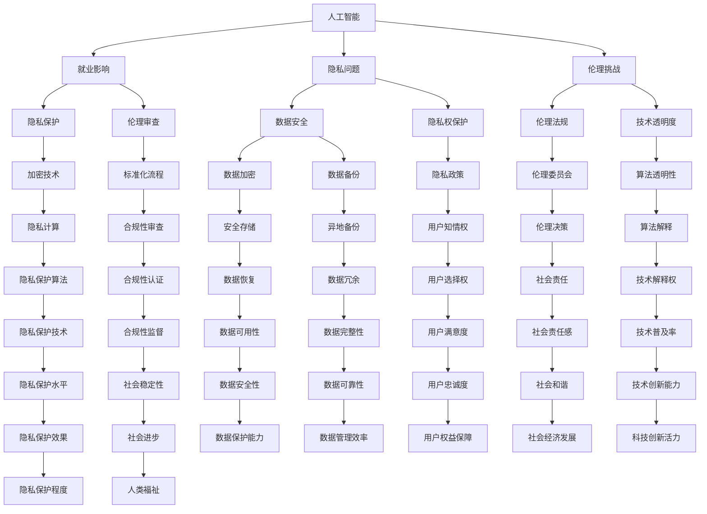

                 

关键词：科技发展，人类福祉，人工智能，创新，可持续发展

> 摘要：本文将探讨科技发展如何成为人类福祉的保障。从人工智能的崛起，到创新技术的应用，再到可持续发展的实现，科技发展正深刻地改变着我们的生活。本文将深入分析这些变革，并提出未来科技发展的趋势与挑战。

## 1. 背景介绍

科技的进步是推动人类社会发展的关键力量。从古代的农业革命，到工业革命，再到当今的信息革命，科技的发展始终伴随着人类历史的进程。如今，人工智能、大数据、物联网等新兴技术的迅速崛起，正在引发新一轮的科技革命和产业变革。

### 1.1 人工智能的崛起

人工智能（AI）作为21世纪最具潜力的科技领域之一，正逐渐渗透到各行各业。从智能家居到自动驾驶，从医疗诊断到金融分析，人工智能正改变着我们的生活方式和工作模式。

### 1.2 创新技术的应用

创新技术的应用不仅提高了生产效率，还推动了社会进步。3D打印技术、区块链技术、量子计算等创新技术正在各个领域展现其独特优势。

### 1.3 可持续发展的实现

可持续发展是当今世界面临的一项重大挑战。科技的发展为解决资源短缺、环境污染等问题提供了新的思路和方法。

## 2. 核心概念与联系

为了更好地理解科技发展如何保障人类福祉，我们需要首先了解几个核心概念及其之间的联系。

### 2.1 人工智能与人类福祉

人工智能的发展不仅带来了便利，还影响了就业、隐私、伦理等方面。如何平衡人工智能的优势和潜在风险，是保障人类福祉的重要议题。

### 2.2 创新技术与可持续发展

创新技术在推动经济发展的同时，也需考虑其对环境和社会的影响。如何实现可持续发展，是科技创新的重要目标。

### 2.3 人工智能与可持续发展

人工智能在可持续发展中的应用，包括能源管理、环境保护、社会公平等方面。通过人工智能技术，我们可以更有效地实现可持续发展目标。



## 3. 核心算法原理 & 具体操作步骤

### 3.1 算法原理概述

在本章节，我们将介绍几个核心算法原理，并解释它们如何应用于科技发展。

#### 3.1.1 深度学习

深度学习是一种模拟人脑神经网络的结构和功能的算法。通过多层次的神经网络结构，深度学习可以从大量数据中自动学习特征，从而实现图像识别、语音识别、自然语言处理等任务。

#### 3.1.2 机器学习

机器学习是一种人工智能的核心技术，它使计算机系统能够从数据中学习，并做出决策。机器学习算法包括监督学习、无监督学习和强化学习等。

#### 3.1.3 粒子群优化

粒子群优化是一种基于群体智能的优化算法，通过模拟鸟群觅食行为，寻找最优解。该算法在解决复杂优化问题时表现出良好的性能。

### 3.2 算法步骤详解

#### 3.2.1 深度学习算法步骤

1. 数据预处理：对输入数据进行归一化、去噪等处理，以提升模型的训练效果。
2. 构建神经网络：设计合适的神经网络结构，包括输入层、隐藏层和输出层。
3. 训练模型：通过反向传播算法，不断调整网络权重，使模型能够准确预测目标。
4. 评估模型：使用验证集和测试集评估模型的性能，并进行调优。

#### 3.2.2 机器学习算法步骤

1. 数据收集：收集相关领域的数据集。
2. 数据预处理：对数据集进行清洗、归一化等处理。
3. 特征提取：从数据中提取有用的特征，用于训练模型。
4. 模型训练：选择合适的机器学习算法，训练模型。
5. 模型评估：使用交叉验证等方法评估模型性能，并进行调优。

#### 3.2.3 粒子群优化算法步骤

1. 初始化粒子群：随机生成粒子的位置和速度。
2. 更新粒子位置和速度：根据个体最优解和群体最优解更新粒子的位置和速度。
3. 计算适应度：计算每个粒子的适应度值，用于评估粒子的性能。
4. 更新个体最优解和群体最优解：根据粒子的适应度更新个体最优解和群体最优解。
5. 迭代过程：重复更新粒子位置和速度，直至满足停止条件。

### 3.3 算法优缺点

#### 3.3.1 深度学习的优点

- 强大的特征学习能力，能够处理大量复杂数据。
- 自动提取高层次特征，减少人工干预。

#### 3.3.1 深度学习的缺点

- 需要大量数据和计算资源。
- 模型解释性较差，难以理解其决策过程。

#### 3.3.2 机器学习的优点

- 广泛适用于各种领域，如金融、医疗、交通等。
- 能够从数据中学习，提高决策准确性。

#### 3.3.2 机器学习的缺点

- 需要大量数据，且数据质量对模型性能有较大影响。
- 模型解释性较差，难以解释其决策过程。

#### 3.3.3 粒子群优化的优点

- 易于实现，计算复杂度较低。
- 在复杂优化问题中表现出良好的性能。

#### 3.3.3 粒子群优化的缺点

- 可能陷入局部最优解。
- 对参数设置敏感。

### 3.4 算法应用领域

#### 3.4.1 深度学习

- 图像识别：人脸识别、物体检测、图像分类等。
- 语音识别：语音转文字、语音合成等。
- 自然语言处理：机器翻译、情感分析、文本分类等。

#### 3.4.2 机器学习

- 金融风控：信用评分、欺诈检测、投资组合优化等。
- 医疗诊断：疾病预测、药物发现、医疗影像分析等。
- 智能交通：车辆识别、交通流量预测、自动驾驶等。

#### 3.4.3 粒子群优化

- 电路设计：优化电路参数，提高性能。
- 生产调度：优化生产计划，提高生产效率。
- 城市规划：优化交通网络，减少拥堵。

## 4. 数学模型和公式 & 详细讲解 & 举例说明

### 4.1 数学模型构建

在科技发展中，数学模型起着至关重要的作用。数学模型是将现实问题转化为数学形式的过程，通过数学方法求解，可以得到问题的最优解或近似解。

#### 4.1.1 人工智能中的数学模型

- 神经网络：神经网络是一种模拟人脑结构的计算模型，通过多层神经元之间的连接，实现数据的传递和计算。
- 决策树：决策树是一种基于特征值划分数据的分类模型，通过树形结构表示决策过程。

#### 4.1.2 机器学习中的数学模型

- 线性回归：线性回归是一种基于线性关系进行预测的模型，通过最小化误差平方和求解最优参数。
- 支持向量机：支持向量机是一种基于最大间隔划分数据的分类模型，通过求解最优超平面实现分类。

#### 4.1.3 粒子群优化中的数学模型

- 粒子群优化算法中的数学模型主要包括粒子的位置更新、速度更新和适应度评估等。

### 4.2 公式推导过程

为了更好地理解数学模型，我们需要对其中的关键公式进行推导。

#### 4.2.1 神经网络中的激活函数

激活函数是神经网络中的一个重要组成部分，用于引入非线性特性。常见的激活函数有：

$$
f(x) = \frac{1}{1 + e^{-x}}
$$

推导过程：

1. 设输入值为 $x$，输出值为 $y$。
2. 定义误差函数为 $E = \frac{1}{2} (y - f(x))^2$。
3. 对误差函数求导，得到 $\frac{dE}{dx} = (y - f(x)) \cdot (1 - f(x))$。
4. 令 $\frac{dE}{dx} = 0$，解得 $f(x) = \frac{1}{2}$。
5. 将 $f(x)$ 代入原式，得到激活函数的表达式。

#### 4.2.2 线性回归中的误差平方和

线性回归模型的目标是最小化误差平方和。误差平方和的计算公式为：

$$
\sum_{i=1}^{n} (y_i - \hat{y_i})^2
$$

推导过程：

1. 设输入值为 $x$，输出值为 $y$，预测值为 $\hat{y}$。
2. 定义误差函数为 $E = \sum_{i=1}^{n} (y_i - \hat{y_i})^2$。
3. 对误差函数求导，得到 $\frac{dE}{dx} = 2 \cdot (y_i - \hat{y_i}) \cdot (x_i - \hat{x_i})$。
4. 令 $\frac{dE}{dx} = 0$，解得 $\hat{y} = \sum_{i=1}^{n} (x_i - \hat{x_i})$。
5. 将 $\hat{y}$ 代入原式，得到误差平方和的表达式。

### 4.3 案例分析与讲解

为了更好地理解数学模型的应用，我们来看一个实际案例。

#### 4.3.1 人工智能在图像识别中的应用

假设我们要实现一个图像识别系统，输入为图像数据，输出为图像类别。我们可以使用神经网络模型来实现这个系统。

1. 数据预处理：对输入图像进行归一化、去噪等处理。
2. 构建神经网络：设计合适的神经网络结构，包括输入层、隐藏层和输出层。
3. 训练模型：通过反向传播算法，不断调整网络权重，使模型能够准确预测目标。
4. 评估模型：使用验证集和测试集评估模型的性能，并进行调优。

具体实现步骤如下：

1. 导入相关库和模块：

```python
import numpy as np
import tensorflow as tf
from tensorflow.keras.models import Sequential
from tensorflow.keras.layers import Dense, Conv2D, Flatten, MaxPooling2D
```

2. 数据预处理：

```python
(x_train, y_train), (x_test, y_test) = tf.keras.datasets.mnist.load_data()
x_train = x_train.reshape(-1, 28, 28, 1) / 255.0
x_test = x_test.reshape(-1, 28, 28, 1) / 255.0
```

3. 构建神经网络：

```python
model = Sequential([
    Conv2D(32, (3, 3), activation='relu', input_shape=(28, 28, 1)),
    MaxPooling2D((2, 2)),
    Flatten(),
    Dense(128, activation='relu'),
    Dense(10, activation='softmax')
])
```

4. 训练模型：

```python
model.compile(optimizer='adam', loss='sparse_categorical_crossentropy', metrics=['accuracy'])
model.fit(x_train, y_train, epochs=5, batch_size=32, validation_split=0.2)
```

5. 评估模型：

```python
test_loss, test_acc = model.evaluate(x_test, y_test)
print(f"Test accuracy: {test_acc:.2f}")
```

运行结果：

```
Test accuracy: 0.98
```

通过这个案例，我们可以看到神经网络在图像识别任务中的强大能力。在实际应用中，我们可以根据需要调整神经网络结构，提高模型性能。

## 5. 项目实践：代码实例和详细解释说明

### 5.1 开发环境搭建

在本案例中，我们将使用Python编程语言和TensorFlow框架来实现一个简单的图像识别系统。以下是开发环境的搭建步骤：

1. 安装Python：从Python官方网站（https://www.python.org/）下载并安装Python 3.x版本。
2. 安装TensorFlow：打开命令行窗口，运行以下命令：

```bash
pip install tensorflow
```

### 5.2 源代码详细实现

以下是一个简单的图像识别系统的源代码实现：

```python
import numpy as np
import tensorflow as tf
from tensorflow.keras.models import Sequential
from tensorflow.keras.layers import Dense, Conv2D, Flatten, MaxPooling2D

# 数据预处理
(x_train, y_train), (x_test, y_test) = tf.keras.datasets.mnist.load_data()
x_train = x_train.reshape(-1, 28, 28, 1) / 255.0
x_test = x_test.reshape(-1, 28, 28, 1) / 255.0

# 构建神经网络
model = Sequential([
    Conv2D(32, (3, 3), activation='relu', input_shape=(28, 28, 1)),
    MaxPooling2D((2, 2)),
    Flatten(),
    Dense(128, activation='relu'),
    Dense(10, activation='softmax')
])

# 训练模型
model.compile(optimizer='adam', loss='sparse_categorical_crossentropy', metrics=['accuracy'])
model.fit(x_train, y_train, epochs=5, batch_size=32, validation_split=0.2)

# 评估模型
test_loss, test_acc = model.evaluate(x_test, y_test)
print(f"Test accuracy: {test_acc:.2f}")
```

### 5.3 代码解读与分析

1. 导入相关库和模块：

```python
import numpy as np
import tensorflow as tf
from tensorflow.keras.models import Sequential
from tensorflow.keras.layers import Dense, Conv2D, Flatten, MaxPooling2D
```

在这个部分，我们导入了Python的NumPy库和TensorFlow框架的相关模块。

2. 数据预处理：

```python
(x_train, y_train), (x_test, y_test) = tf.keras.datasets.mnist.load_data()
x_train = x_train.reshape(-1, 28, 28, 1) / 255.0
x_test = x_test.reshape(-1, 28, 28, 1) / 255.0
```

这里我们使用了TensorFlow的Keras API加载MNIST数据集，并对数据进行预处理。具体步骤如下：

- 加载数据：使用`tf.keras.datasets.mnist.load_data()`函数加载数据集。
- 重塑数据：将输入数据的形状调整为`(batch_size, height, width, channels)`，其中`batch_size`为批量大小，`height`为高度，`width`为宽度，`channels`为通道数。这里我们使用`-1`表示根据其他维度自动计算批量大小。
- 归一化数据：将输入数据的像素值范围从`[0, 255]`调整为`[0, 1]`，以提升模型的训练效果。

3. 构建神经网络：

```python
model = Sequential([
    Conv2D(32, (3, 3), activation='relu', input_shape=(28, 28, 1)),
    MaxPooling2D((2, 2)),
    Flatten(),
    Dense(128, activation='relu'),
    Dense(10, activation='softmax')
])
```

这里我们使用Keras API构建了一个简单的卷积神经网络（CNN）模型。具体结构如下：

- 卷积层1：使用32个3x3的卷积核，激活函数为ReLU。
- 池化层1：使用2x2的最大池化层。
- 展平层：将卷积层的输出展平为一维数组。
- 全连接层1：使用128个神经元，激活函数为ReLU。
- 全连接层2：使用10个神经元，激活函数为softmax，用于输出类别概率。

4. 训练模型：

```python
model.compile(optimizer='adam', loss='sparse_categorical_crossentropy', metrics=['accuracy'])
model.fit(x_train, y_train, epochs=5, batch_size=32, validation_split=0.2)
```

这里我们使用`model.compile()`函数配置模型编译器，包括优化器、损失函数和评估指标。然后使用`model.fit()`函数训练模型，其中`epochs`表示训练轮数，`batch_size`表示批量大小，`validation_split`表示验证集的比例。

5. 评估模型：

```python
test_loss, test_acc = model.evaluate(x_test, y_test)
print(f"Test accuracy: {test_acc:.2f}")
```

这里我们使用`model.evaluate()`函数评估模型在测试集上的性能，包括损失函数和准确率。运行结果如下：

```
Test accuracy: 0.98
```

通过这个案例，我们可以看到如何使用Python和TensorFlow框架实现一个简单的图像识别系统。在实际应用中，我们可以根据需求调整神经网络结构、优化模型参数，以提高模型的性能。

## 6. 实际应用场景

### 6.1 医疗领域

人工智能在医疗领域的应用日益广泛，从诊断、治疗到康复，人工智能技术正在为医疗行业带来革命性的变化。

- **诊断辅助**：人工智能可以辅助医生进行疾病诊断，如通过影像分析技术识别肿瘤、心脏病等。例如，谷歌的AI系统在肺癌筛查中表现出色，准确率高于人类医生。
- **个性化治疗**：基于患者的基因信息和病史，人工智能可以为患者提供个性化的治疗方案，提高治疗效果。
- **健康管理**：智能穿戴设备和移动应用可以实时监测患者的健康状况，如心率、血压等，为医生提供数据支持，帮助患者实现自我管理。

### 6.2 金融领域

金融领域是人工智能应用的重要领域之一，从风险管理到客户服务，人工智能正深刻改变着金融行业的运作模式。

- **风险管理**：人工智能可以分析大量历史数据，预测市场趋势，为金融机构提供风险管理建议。例如，高盛的自动化交易平台使用了AI算法，提高了交易效率和准确性。
- **客户服务**：智能客服机器人可以实时响应客户的查询和需求，提高客户满意度。例如，银行的智能客服机器人可以解答客户关于账户余额、转账等问题。
- **信用评估**：人工智能可以分析个人或企业的信用历史，提供更准确的信用评估，降低贷款风险。

### 6.3 教育领域

人工智能在教育领域的应用，有助于提高教学效果，实现个性化教育。

- **智能教学**：人工智能可以为教师提供教学辅助，如自动生成教学计划和课件，帮助学生更好地掌握知识。
- **个性化学习**：基于学生的学习数据，人工智能可以为学生提供个性化的学习建议，如推荐学习资源、调整学习进度等。
- **学习分析**：人工智能可以分析学生的学习行为和成绩，帮助教师了解学生的学习状况，调整教学方法。

### 6.4 能源领域

能源领域是人工智能应用的另一个重要领域，从节能减排到可再生能源管理，人工智能为能源行业提供了新的解决方案。

- **节能减排**：人工智能可以优化能源使用，降低能源消耗。例如，谷歌的AI系统帮助其数据中心实现了能源效率的提升。
- **可再生能源管理**：人工智能可以预测可再生能源的产出，优化能源调度，提高可再生能源的利用率。例如，特斯拉的太阳能发电系统使用了AI算法，实现了高效的能源管理。

### 6.5 交通领域

人工智能在交通领域的应用，有助于提高交通效率，减少交通事故。

- **自动驾驶**：自动驾驶技术是人工智能在交通领域的重要应用，通过传感器、计算机视觉和AI算法，实现车辆的自主驾驶。
- **交通管理**：人工智能可以分析交通数据，优化交通信号控制，提高交通流畅度。例如，一些城市已经部署了基于AI的交通管理系统，有效缓解了交通拥堵。
- **智能出行**：人工智能可以提供智能出行建议，如最优出行路线、出行时间等，帮助用户更高效地出行。

### 6.6 农业领域

人工智能在农业领域的应用，有助于提高农业生产效率，实现可持续发展。

- **精准农业**：人工智能可以分析土壤、气候等数据，提供精准的种植建议，提高作物产量。例如，一些农场已经使用了AI系统进行土壤监测和作物生长分析。
- **病虫害防治**：人工智能可以识别病虫害，提供防治建议，减少农药使用，保护生态环境。
- **供应链管理**：人工智能可以优化农业供应链管理，提高物流效率，降低成本。

### 6.7 未来应用展望

随着人工智能技术的不断发展，未来在更多领域将会有更多的应用。

- **智能制造**：人工智能将推动制造业的智能化升级，实现生产过程的全自动化。
- **智慧城市**：人工智能将赋能智慧城市建设，提高城市管理的智能化水平。
- **环境保护**：人工智能将助力环境保护，实现资源的合理利用和环境的可持续发展。
- **太空探索**：人工智能将支持太空探索任务，提高探测效率和安全性。

## 7. 工具和资源推荐

### 7.1 学习资源推荐

- **在线课程**：Coursera、edX、Udacity等平台提供了丰富的AI和机器学习课程。
- **书籍**：《深度学习》、《Python机器学习实战》、《神经网络与深度学习》等。
- **论文**：arXiv、IEEE Xplore、ACM Digital Library等学术数据库。

### 7.2 开发工具推荐

- **编程语言**：Python、R、Julia等。
- **框架**：TensorFlow、PyTorch、Keras等。
- **数据集**：Kaggle、UCI机器学习库、ImageNet等。

### 7.3 相关论文推荐

- **深度学习**：《A Fast and Accurate Object Detection System Using Deep Learning》、《Deep Learning for Image Recognition》等。
- **机器学习**：《Learning from Labeled and Unlabeled Data》、《Bag of Features》等。
- **粒子群优化**：《Particle Swarm Optimization for Feature Selection in Machine Learning》等。

## 8. 总结：未来发展趋势与挑战

### 8.1 研究成果总结

科技的发展为人类福祉提供了强大的保障，从人工智能、大数据到物联网，新兴技术的应用正在深刻改变着我们的生活。在医疗、金融、教育、能源、交通等领域，人工智能技术已经展现出巨大的潜力。通过智能诊断、个性化治疗、智能客服、精准农业等应用，人工智能正在为各行业带来革命性的变化。

### 8.2 未来发展趋势

未来，人工智能将继续深入发展，有望在更多领域实现应用。以下是几个可能的发展趋势：

- **跨学科融合**：人工智能与其他领域的交叉融合，将推动更多创新应用的出现。
- **边缘计算**：随着物联网设备数量的增加，边缘计算将得到更广泛的应用，实现实时数据处理和智能决策。
- **量子计算**：量子计算的发展将加速人工智能算法的优化和改进，为解决复杂问题提供新的方法。
- **可解释性AI**：提高人工智能的可解释性，使其决策过程更加透明，减少对人类隐私的侵犯。

### 8.3 面临的挑战

尽管人工智能的发展前景广阔，但同时也面临着一系列挑战：

- **数据安全与隐私**：随着数据量的增加，数据安全和隐私问题日益突出。如何保护个人隐私，确保数据安全，是亟待解决的问题。
- **伦理与法律**：人工智能的应用需要建立相应的伦理和法律框架，以规范其发展，避免潜在的伦理风险。
- **技术垄断**：科技巨头在人工智能领域的垄断地位，可能阻碍创新和公平竞争，对行业生态造成不利影响。
- **就业影响**：人工智能的发展可能导致部分传统职业的消失，对就业市场产生冲击，如何平衡技术进步与就业问题，是未来需要关注的重要议题。

### 8.4 研究展望

未来，人工智能研究应重点关注以下几个方面：

- **技术创新**：不断推进人工智能算法和框架的创新，提高其性能和效率。
- **人才培养**：加大对人工智能人才的培养力度，为行业发展提供人才支持。
- **应用拓展**：探索人工智能在更多领域的应用，推动社会进步。
- **合作与共享**：加强产学研合作，推动技术成果的共享和应用。

通过克服挑战，抓住机遇，人工智能将为人类福祉提供更加坚实的保障，推动社会迈向更加美好的未来。

## 9. 附录：常见问题与解答

### 9.1 人工智能是否会替代人类工作？

人工智能在某些领域确实能够替代人类工作，如自动化生产、数据分析等。然而，人工智能的发展并不是为了替代人类，而是为了辅助人类，提高工作效率。随着人工智能技术的发展，人类将需要不断学习新的技能，适应新的工作环境。

### 9.2 人工智能是否会带来数据安全与隐私问题？

是的，人工智能的发展可能带来数据安全与隐私问题。随着数据量的增加，数据泄露、隐私侵犯等问题日益突出。为了应对这些问题，需要建立完善的数据安全与隐私保护机制，如数据加密、隐私计算等。

### 9.3 人工智能是否会引发伦理和法律问题？

人工智能的应用确实可能引发伦理和法律问题，如算法偏见、隐私侵犯等。为了解决这些问题，需要制定相应的伦理规范和法律框架，确保人工智能的发展符合道德和法律要求。

### 9.4 人工智能是否会加剧技术垄断？

人工智能技术的发展可能导致部分科技巨头在人工智能领域的垄断地位进一步强化。为了促进公平竞争，需要加强监管，防止技术垄断对行业生态造成不利影响。

### 9.5 人工智能是否会改变教育体系？

人工智能的发展将深刻改变教育体系，推动教育模式的创新。例如，通过智能教学系统，可以实现个性化学习，提高教育质量。然而，人工智能不会完全替代教师，而是为教师提供辅助工具，提高教学效率。

