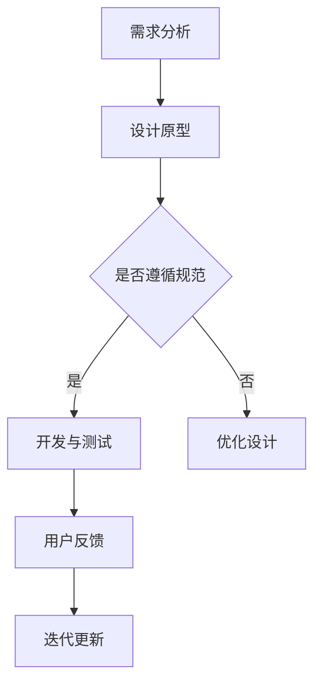

                 

关键词：移动应用，UI设计，UX设计，Material Design，iOS设计规范，用户体验，用户界面，设计原则，交互设计，移动开发，应用程序开发

> 摘要：本文将深入探讨移动应用UI/UX设计中的两大主流设计规范——Material Design与iOS设计规范。通过对这两个设计规范的对比分析，我们将了解各自的设计理念、特点以及在实际应用中的优缺点，帮助开发者更好地掌握移动应用的设计方法，提升用户体验。

## 1. 背景介绍

在移动应用飞速发展的今天，UI/UX设计成为影响用户留存率和满意度的重要因素。UI（用户界面设计）和UX（用户体验设计）不仅是设计的两个重要方面，更是决定产品成功与否的关键。Material Design与iOS设计规范作为当前移动应用UI/UX设计的两大主流规范，分别在谷歌和苹果的生态系统中有着广泛的应用。本文将围绕这两个设计规范，探讨其在设计理念、实践方法以及实际应用中的表现。

## 2. 核心概念与联系

### 2.1 设计规范定义

设计规范是指一系列关于用户界面和用户体验的设计指南、标准和方法，旨在指导开发者在设计过程中遵循一致的设计原则，提高应用的可访问性、可用性和用户满意度。

### 2.2 Material Design与iOS设计规范的联系

Material Design和iOS设计规范都旨在提升用户体验，但它们源于不同的设计哲学和理念。Material Design强调虚拟材料的物理特性，如阴影、光线和材质，以创造丰富的视觉层次感。iOS设计规范则注重简洁、清晰和一致性，通过严格的视觉元素和交互规则来提升用户操作的自然性和直观性。

### 2.3 Mermaid流程图

下面是一个简化的Mermaid流程图，展示了Material Design和iOS设计规范的设计流程：



## 3. 核心算法原理 & 具体操作步骤

### 3.1 算法原理概述

移动应用UI/UX设计中的算法原理主要涉及设计原则、用户研究、交互设计等方面。设计原则是指导设计的基本规则，如一致性、反馈、可见性等。用户研究则是了解用户需求、行为和偏好，为设计提供数据支持。交互设计则关注用户与界面元素的交互方式，如何提高交互的流畅性和自然性。

### 3.2 算法步骤详解

#### 3.2.1 需求分析

1. 分析用户需求：了解目标用户群体的需求、习惯和偏好。
2. 确定设计目标：基于用户需求，明确应用的功能和设计目标。

#### 3.2.2 设计原型

1. 创建低保真原型：用简单的线框图展示应用的基本结构和布局。
2. 高保真原型：在低保真原型的基础上，添加视觉元素和交互效果。

#### 3.2.3 遵循设计规范

1. 选择设计规范：根据应用类型和用户群体，选择合适的UI/UX设计规范。
2. 遵循规范：在设计过程中，严格遵循所选规范的设计原则和规则。

#### 3.2.4 开发与测试

1. 开发应用：根据设计原型，编写代码实现应用功能。
2. 测试应用：通过用户测试和性能测试，确保应用的质量和稳定性。

#### 3.2.5 用户反馈与迭代

1. 收集用户反馈：通过用户测试和用户反馈，了解用户对应用的满意度和改进意见。
2. 迭代更新：根据用户反馈，对应用进行优化和改进。

### 3.3 算法优缺点

#### 优点

- 提高用户体验：遵循设计规范，可以使应用界面更直观、更易用。
- 提高开发效率：设计规范提供了标准化的设计原则和方法，可以加快开发进度。
- 提高应用质量：通过测试和迭代，确保应用的质量和稳定性。

#### 缺点

- 限制创新：过于遵循规范，可能导致设计缺乏创新和个性化。
- 增加学习成本：新手开发者需要花费时间学习设计规范和设计工具。

### 3.4 算法应用领域

算法原理和步骤适用于各类移动应用的设计，包括社交媒体、电子商务、教育、娱乐等领域。不同领域在遵循设计规范的基础上，可以根据特定需求进行定制化设计。

## 4. 数学模型和公式 & 详细讲解 & 举例说明

### 4.1 数学模型构建

移动应用UI/UX设计的数学模型主要包括用户研究模型、交互模型和反馈模型。

#### 用户研究模型

用户研究模型主要涉及用户行为的数学描述，如用户访问频率、用户停留时间、用户操作路径等。

#### 交互模型

交互模型主要涉及用户与界面元素的交互过程，如点击、滑动、手势等。

#### 反馈模型

反馈模型主要涉及用户对交互结果的感知和评价，如满意度、留存率等。

### 4.2 公式推导过程

以下是一个简单的用户满意度公式推导过程：

用户满意度 = (功能满意度 + 交互满意度 + 视觉满意度) / 3

其中，功能满意度、交互满意度和视觉满意度分别表示用户对应用功能的满意度、交互过程的满意度和视觉效果的满意度。

### 4.3 案例分析与讲解

#### 案例一：社交媒体应用设计

在社交媒体应用设计中，用户满意度是一个重要的指标。通过用户调研和数据分析，我们可以构建一个用户满意度模型，并对其进行优化。

#### 案例二：电子商务应用设计

在电子商务应用设计中，用户体验直接影响用户的购物决策。通过分析用户行为数据和用户反馈，我们可以优化页面布局、优化搜索功能和改进支付流程。

## 5. 项目实践：代码实例和详细解释说明

### 5.1 开发环境搭建

为了更好地进行移动应用UI/UX设计，我们需要搭建一个开发环境。以下是一个基本的开发环境搭建流程：

1. 安装开发工具：如Android Studio或Xcode。
2. 创建应用项目：根据设计需求，创建新的应用项目。
3. 配置环境变量：确保开发工具和SDK的正确配置。

### 5.2 源代码详细实现

以下是一个简单的移动应用UI/UX设计的代码实例：

```java
// Android应用主界面布局代码
<?xml version="1.0" encoding="utf-8"?>
<LinearLayout xmlns:android="http://schemas.android.com/apk/res/android"
    android:layout_width="match_parent"
    android:layout_height="match_parent"
    android:orientation="vertical">

    <TextView
        android:layout_width="wrap_content"
        android:layout_height="wrap_content"
        android:text="欢迎使用我的应用"
        android:textSize="24sp"
        android:layout_margin="16dp"/>

    <Button
        android:layout_width="wrap_content"
        android:layout_height="wrap_content"
        android:text="点击开始"
        android:layout_margin="16dp"/>

</LinearLayout>
```

### 5.3 代码解读与分析

这个代码实例展示了Android应用的简单布局，包括一个文本视图和一个按钮。文本视图用于显示欢迎信息，按钮用于引导用户进行下一步操作。通过这个实例，我们可以了解到移动应用UI/UX设计的基本方法和技巧。

### 5.4 运行结果展示

运行上述代码，我们可以看到一个简单的Android应用界面，用户可以点击按钮进行下一步操作。这个实例展示了移动应用UI/UX设计的基本实现过程。

## 6. 实际应用场景

### 6.1 社交媒体应用

在社交媒体应用中，Material Design的丰富视觉效果和交互设计可以提高用户的操作体验，如滑动查看、弹出通知等。iOS设计规范则通过简洁的界面和一致的交互规则，确保用户能够快速上手和使用。

### 6.2 电子商务应用

电子商务应用中，Material Design的悬浮按钮（FAB）和底栏（Bottom Navigation）可以提高用户操作效率。iOS设计规范的顶部导航栏（Navigation Bar）和标签栏（Tab Bar）则提供了清晰的分类和导航功能。

### 6.3 教育应用

在教育应用中，Material Design的卡片布局（Card Layout）和交互效果可以展示丰富的学习内容。iOS设计规范的分段控件（Segmented Control）和开关（Switch）则提供了简单的学习管理和互动功能。

## 7. 工具和资源推荐

### 7.1 学习资源推荐

- 《移动应用UI/UX设计：从零开始》
- 《Material Design：设计指南》
- 《iOS Human Interface Guidelines》

### 7.2 开发工具推荐

- Android Studio
- Xcode
- Sketch
- Adobe XD

### 7.3 相关论文推荐

- "User Experience Design for Mobile Applications: Principles and Practices"
- "Material Design: A New Approach to Designing Digital Products"
- "The iOS Design Process: From Concept to App Store"

## 8. 总结：未来发展趋势与挑战

### 8.1 研究成果总结

本文通过对Material Design和iOS设计规范的分析，总结了它们的设计理念、特点和在实际应用中的优缺点。同时，介绍了移动应用UI/UX设计的数学模型、算法原理和项目实践。

### 8.2 未来发展趋势

随着人工智能和物联网技术的发展，移动应用UI/UX设计将更加注重智能交互和个性化体验。同时，跨平台设计工具和自动化设计流程将提高开发效率。

### 8.3 面临的挑战

移动应用UI/UX设计面临的主要挑战包括兼容性、性能优化和用户体验的个性化。如何在保证兼容性和性能的同时，提供优质的用户体验，是开发者需要解决的问题。

### 8.4 研究展望

未来研究可以关注智能交互设计、自适应设计、人机融合等方面。通过技术创新和设计实践，不断提升移动应用的UI/UX设计水平。

## 9. 附录：常见问题与解答

### 问题1：如何选择适合的设计规范？

解答：选择设计规范应考虑应用类型、用户群体和业务需求。Material Design适合需要丰富视觉层次感和交互效果的应用，如社交媒体和娱乐应用。iOS设计规范则适合注重简洁和一致性的应用，如电子商务和教育应用。

### 问题2：如何提高用户满意度？

解答：提高用户满意度可以从以下几个方面入手：

1. 优化用户体验：简化操作流程，提高交互效率。
2. 提供个性化服务：根据用户需求和偏好，提供定制化内容。
3. 及时反馈与改进：收集用户反馈，及时调整设计。

---

作者：禅与计算机程序设计艺术 / Zen and the Art of Computer Programming
----------------------------------------------------------------
本文从多个角度深入探讨了移动应用UI/UX设计中的两大主流规范——Material Design与iOS设计规范。通过对设计理念、实践方法和实际应用的详细分析，旨在帮助开发者更好地理解并掌握移动应用的设计技巧，提升用户体验。在未来，随着技术的不断进步，移动应用UI/UX设计将继续演变和优化，开发者需要不断学习和适应，以应对新的挑战。

