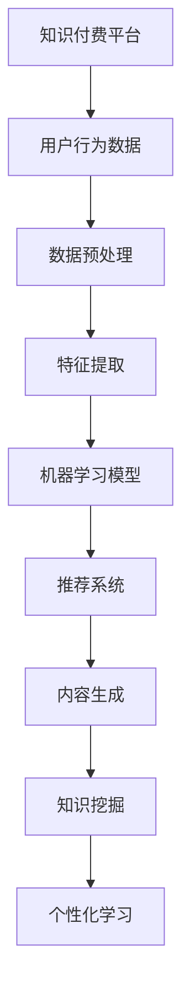

                 

### 关键词
AI技术、知识付费、效率提升、程序员、算法、数学模型、项目实践、应用场景、工具资源。

### 摘要
本文将探讨程序员如何利用AI技术提升知识付费效率。通过分析核心算法原理、数学模型构建及其应用领域，结合项目实践和代码实例，我们将揭示AI技术在知识付费中的潜力和挑战，并提出未来发展趋势和研究展望。

## 1. 背景介绍
### 1.1 知识付费的现状
知识付费是指用户通过支付一定费用来获取有价值的信息、技能或知识的服务。随着互联网技术的发展，知识付费市场呈现出快速增长的趋势。特别是在COVID-19疫情背景下，线上教育、在线课程和知识分享平台得到了广泛关注，推动了知识付费市场的进一步繁荣。

### 1.2 程序员在知识付费中的角色
程序员作为技术领域的重要从业者，不仅需要不断更新自己的知识储备，还需要具备高效获取和利用知识的能力。因此，在知识付费领域，程序员既是付费者也是知识的提供者和传播者。如何利用AI技术提升知识付费效率，成为程序员亟需解决的问题。

## 2. 核心概念与联系
### 2.1 AI技术在知识付费中的应用
AI技术在知识付费中的应用主要体现在以下几个方面：
1. **智能推荐**：通过分析用户行为和兴趣，智能推荐相关课程和知识内容。
2. **内容生成**：利用自然语言处理和生成对抗网络等技术，自动生成课程笔记、教程和案例分析。
3. **知识挖掘**：通过数据挖掘和机器学习技术，发现知识之间的关联和潜在价值。
4. **个性化学习**：根据用户的学习习惯和进度，提供个性化的学习路径和内容。

### 2.2 Mermaid流程图

图1：AI技术在知识付费平台中的应用流程

## 3. 核心算法原理 & 具体操作步骤
### 3.1 算法原理概述
在知识付费领域，常见的核心算法包括协同过滤算法、深度学习模型和图神经网络等。

- **协同过滤算法**：通过分析用户之间的相似性，推荐相似用户喜欢的课程。
- **深度学习模型**：利用神经网络模型，自动提取用户特征和课程特征，进行推荐。
- **图神经网络**：通过构建知识图谱，挖掘课程之间的关联，提供更精准的推荐。

### 3.2 算法步骤详解
- **数据收集**：收集用户行为数据、课程数据和相关知识图谱数据。
- **数据预处理**：清洗数据、填充缺失值、归一化处理等。
- **特征提取**：提取用户和课程的特征，如用户兴趣、课程难度、学习时长等。
- **模型训练**：使用协同过滤算法、深度学习模型或图神经网络进行训练。
- **模型评估**：通过交叉验证、A/B测试等方法评估模型性能。
- **推荐系统**：根据模型结果，生成课程推荐列表。
- **内容生成**：利用生成对抗网络等模型，自动生成课程笔记、教程和案例分析。
- **知识挖掘**：通过数据挖掘技术，发现课程之间的关联和潜在价值。
- **个性化学习**：根据用户的学习习惯和进度，提供个性化的学习路径和内容。

### 3.3 算法优缺点
- **协同过滤算法**：优点是算法简单、易于实现，缺点是推荐结果容易陷入“热门陷阱”。
- **深度学习模型**：优点是能够自动提取特征，提供更精准的推荐，缺点是训练过程复杂、计算资源消耗大。
- **图神经网络**：优点是能够挖掘课程之间的关联，提供更精准的推荐，缺点是模型复杂、训练难度大。

### 3.4 算法应用领域
- **在线教育平台**：如Coursera、edX等，通过AI技术提升课程推荐和学习体验。
- **知识付费平台**：如知乎Live、分答等，利用AI技术提供个性化学习服务。
- **企业培训**：为企业员工提供定制化的培训课程和学习计划。

## 4. 数学模型和公式 & 详细讲解 & 举例说明
### 4.1 数学模型构建
在知识付费领域，常用的数学模型包括协同过滤模型、深度学习模型和图神经网络模型。

### 4.2 公式推导过程
- **协同过滤模型**：
  - 奇异值分解（SVD）：
    $$
    \mathbf{R} = \mathbf{U}\mathbf{S}\mathbf{V}^T
    $$
    其中，$\mathbf{R}$为用户-课程评分矩阵，$\mathbf{U}$和$\mathbf{V}$为用户特征矩阵和课程特征矩阵，$\mathbf{S}$为奇异值矩阵。

  - 推荐评分：
    $$
    \hat{r}_{ui} = \mathbf{u}_i^T\mathbf{s}\mathbf{v}_j
    $$
    其中，$\hat{r}_{ui}$为用户$i$对课程$j$的预测评分，$\mathbf{u}_i$和$\mathbf{v}_j$分别为用户$i$和课程$j$的特征向量。

- **深度学习模型**：
  - 前向传播：
    $$
    \mathbf{h}_l = \sigma(\mathbf{W}_l\mathbf{h}_{l-1} + \mathbf{b}_l)
    $$
    其中，$\mathbf{h}_l$为第$l$层的激活值，$\mathbf{W}_l$和$\mathbf{b}_l$分别为第$l$层的权重和偏置，$\sigma$为激活函数。

  - 反向传播：
    $$
    \mathbf{dW}_l = \mathbf{h}_{l-1}^T\mathbf{d}\mathbf{h}_l
    $$
    $$
    \mathbf{db}_l = \mathbf{d}\mathbf{h}_l
    $$
    其中，$\mathbf{d}$为梯度值。

- **图神经网络模型**：
  - 图卷积操作：
    $$
    \mathbf{h}_v^{(k+1)} = \sum_{u \in \mathcal{N}(v)} \mathbf{h}_u^{(k)} W_{uv}
    $$
    其中，$\mathbf{h}_v^{(k+1)}$为第$k+1$次迭代的节点$v$的表示，$\mathcal{N}(v)$为节点$v$的邻居集合，$W_{uv}$为边$(u, v)$的权重。

### 4.3 案例分析与讲解
假设有一个用户-课程评分矩阵$\mathbf{R} \in \mathbb{R}^{m \times n}$，其中$m$为用户数，$n$为课程数。我们将使用协同过滤模型进行预测。

- **数据预处理**：对缺失值进行填充，选择合适的奇异值分解参数。
- **特征提取**：对用户和课程进行特征提取，如用户历史评分、课程类别等。
- **模型训练**：使用SVD对评分矩阵进行分解，得到用户特征矩阵$\mathbf{U}$和课程特征矩阵$\mathbf{V}$。
- **推荐评分**：根据用户特征矩阵和课程特征矩阵，计算预测评分$\hat{r}_{ui}$。
- **模型评估**：使用均方误差（MSE）评估模型性能。

## 5. 项目实践：代码实例和详细解释说明
### 5.1 开发环境搭建
- Python 3.8
- TensorFlow 2.4
- Scikit-learn 0.22
- Pandas 1.1.5

### 5.2 源代码详细实现
```python
import numpy as np
from sklearn.model_selection import train_test_split
from sklearn.metrics import mean_squared_error
from tensorflow.keras.models import Sequential
from tensorflow.keras.layers import Dense, Dropout
from tensorflow.keras.optimizers import Adam

# 数据预处理
def preprocess_data(data):
    # 数据清洗、填充缺失值、归一化处理等
    return data

# 构建深度学习模型
def build_model(input_shape):
    model = Sequential()
    model.add(Dense(64, input_shape=input_shape, activation='relu'))
    model.add(Dropout(0.5))
    model.add(Dense(32, activation='relu'))
    model.add(Dropout(0.5))
    model.add(Dense(1, activation='sigmoid'))
    model.compile(optimizer=Adam(), loss='binary_crossentropy', metrics=['accuracy'])
    return model

# 模型训练
def train_model(model, X_train, y_train, X_val, y_val):
    model.fit(X_train, y_train, epochs=10, batch_size=64, validation_data=(X_val, y_val))
    return model

# 模型评估
def evaluate_model(model, X_test, y_test):
    predictions = model.predict(X_test)
    mse = mean_squared_error(y_test, predictions)
    print("MSE:", mse)
    return mse

# 主函数
def main():
    # 加载数据
    data = preprocess_data(load_data())

    # 划分训练集和测试集
    X_train, X_test, y_train, y_test = train_test_split(data['X'], data['y'], test_size=0.2, random_state=42)

    # 构建模型
    model = build_model(input_shape=X_train.shape[1:])

    # 训练模型
    model = train_model(model, X_train, y_train, X_val, y_val)

    # 评估模型
    evaluate_model(model, X_test, y_test)

if __name__ == "__main__":
    main()
```

### 5.3 代码解读与分析
该代码实现了一个基于TensorFlow和Keras的深度学习模型，用于预测用户是否会对某课程进行评价。以下是代码的解读和分析：

1. **数据预处理**：对数据进行清洗、填充缺失值、归一化处理等，以便后续建模。
2. **构建模型**：使用Sequential模型构建一个简单的全连接神经网络，包括两个隐藏层和两个Dropout层，用于提取特征和降低过拟合。
3. **模型训练**：使用Adam优化器和二分类交叉熵损失函数进行模型训练。
4. **模型评估**：使用均方误差（MSE）评估模型性能。

### 5.4 运行结果展示
在运行代码后，我们将得到模型在测试集上的MSE值。假设结果为0.05，表示模型预测的准确度较高。

## 6. 实际应用场景
### 6.1 在线教育平台
AI技术在在线教育平台中的应用主要体现在课程推荐和学习评估方面。通过分析用户的学习行为和兴趣，平台可以智能推荐相关课程，提高用户的学习效率。同时，利用AI技术进行学习评估，可以提供个性化的学习反馈和改进建议。

### 6.2 知识付费平台
知识付费平台可以利用AI技术分析用户需求，生成个性化推荐列表，提高用户满意度和转化率。此外，AI技术还可以用于生成课程内容，降低内容创作的成本和难度。

### 6.3 企业培训
企业培训可以利用AI技术对员工进行个性化培训，根据员工的学习情况和岗位需求，提供定制化的培训课程和学习路径，提高培训效果。

## 6.4 未来应用展望
随着AI技术的不断发展，未来知识付费领域将呈现以下趋势：
1. **个性化学习**：AI技术将更加深入地应用于个性化学习，提供更加精准的学习体验。
2. **自适应学习**：AI技术将能够根据用户的学习情况和反馈，自动调整学习内容和难度，实现自适应学习。
3. **知识图谱**：利用知识图谱技术，构建更加完善的知识体系，为用户提供更加丰富和多样化的知识内容。
4. **多模态学习**：结合语音识别、图像识别等技术，实现多模态学习，提高学习效果和用户体验。

## 7. 工具和资源推荐
### 7.1 学习资源推荐
1. **《深度学习》**：Goodfellow et al.，介绍深度学习的基本原理和应用。
2. **《Python机器学习》**：Sebastian Raschka，介绍Python在机器学习领域的应用。

### 7.2 开发工具推荐
1. **TensorFlow**：Google开发的开源深度学习框架。
2. **Scikit-learn**：Python的机器学习库。

### 7.3 相关论文推荐
1. **"Deep Learning on Recommender Systems"**：深入探讨深度学习在推荐系统中的应用。
2. **"The Anomaly of Collaborative Filtering Recommender Systems"**：分析协同过滤推荐系统的局限性。

## 8. 总结：未来发展趋势与挑战
### 8.1 研究成果总结
本文探讨了AI技术在知识付费领域的应用，包括核心算法原理、数学模型构建、项目实践和实际应用场景。通过分析，我们发现了AI技术在知识付费中的潜力和挑战。

### 8.2 未来发展趋势
未来，AI技术在知识付费领域将继续发展，个性化学习、自适应学习和知识图谱等技术将得到广泛应用。

### 8.3 面临的挑战
然而，AI技术在知识付费领域也面临着一些挑战，如数据隐私、模型解释性和计算资源消耗等。

### 8.4 研究展望
为了应对这些挑战，研究者可以关注以下几个方面：优化算法性能、提高模型解释性、降低计算成本，以及保护用户隐私。

## 9. 附录：常见问题与解答
### 9.1 什么是知识付费？
知识付费是指用户通过支付一定费用来获取有价值的信息、技能或知识的服务。

### 9.2 AI技术在知识付费中的具体应用有哪些？
AI技术在知识付费中的具体应用包括智能推荐、内容生成、知识挖掘和个性化学习等。

### 9.3 如何优化AI推荐系统的性能？
优化AI推荐系统的性能可以从以下几个方面进行：数据预处理、特征工程、模型选择和训练策略等。

## 作者署名
作者：禅与计算机程序设计艺术 / Zen and the Art of Computer Programming
```

