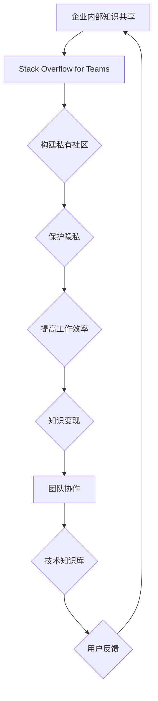

                 

关键词：程序员，Stack Overflow for Teams，变现，团队协作，开源项目，商业应用，技术知识共享

> 摘要：本文旨在探讨程序员如何通过Stack Overflow for Teams这一平台实现知识的共享与变现。文章首先介绍了Stack Overflow for Teams的基本概念与优势，随后分析了其变现的潜在途径，并提供了具体的应用实例和实操指南。通过本文，程序员将了解如何利用这一平台提升自身价值，实现个人与团队的共赢。

## 1. 背景介绍

在当今数字化时代，程序员作为信息技术领域的核心力量，面临着不断增长的知识需求和复杂的技术挑战。随着开源项目和团队协作的普及，程序员们不仅需要掌握多种编程语言和工具，还需要不断更新自己的技术栈，以适应快速变化的技术环境。与此同时，知识的变现成为一个热门话题，程序员们开始探索如何将自己的技能和知识转化为实际的商业价值。

Stack Overflow for Teams作为Stack Overflow的团队版，是一个专为团队和企业设计的问答社区平台。它不仅提供了与开源社区相同的优质技术问答服务，还能够帮助企业内部团队成员进行知识共享，提高工作效率。Stack Overflow for Teams的优势在于其隐私保护功能，允许企业在内部构建专有知识库，同时保持与开源社区的互动。

## 2. 核心概念与联系

### 2.1 Stack Overflow for Teams基本概念

Stack Overflow for Teams是基于Stack Overflow的核心功能，专为团队和企业设计的私有社区。它包括以下主要功能模块：

- **问答平台**：允许团队成员在私有环境中提出问题、回答问题，并分享知识。
- **团队知识库**：提供了一个集中的存储空间，用于保存团队的技术文档、指南和最佳实践。
- **权限管理**：允许管理员设置不同级别的访问权限，确保知识共享的合理性和安全性。
- **集成工具**：与多种开发工具和平台集成，如Git、GitHub、JIRA等，实现无缝协作。

### 2.2 核心概念原理

**隐私保护**：Stack Overflow for Teams的一个关键特点是隐私保护。企业可以在内部构建专有社区，确保敏感信息和知识不会被公开泄露。

**知识共享**：通过问答平台和知识库，团队成员可以共享经验、解决技术难题，提高整体技能水平。

**社区协作**：Stack Overflow for Teams支持团队协作，团队成员可以共同解决问题，提升团队效率。

**反馈机制**：Stack Overflow for Teams提供了一个反馈机制，用户可以对答案进行评分，确保高质量的内容得到优先展示。

### 2.3 Mermaid流程图



## 3. 核心算法原理 & 具体操作步骤

### 3.1 算法原理概述

Stack Overflow for Teams的变现原理主要基于以下几个方面：

1. **知识共享与技能展示**：通过在平台上分享高质量的技术内容，程序员可以展示自己的专业能力，吸引潜在雇主或客户。
2. **知识库商业化**：企业可以将内部知识库商业化，通过订阅服务或定制化内容获得收入。
3. **咨询服务**：程序员可以利用平台建立个人品牌，提供技术咨询和培训服务。
4. **广告合作**：企业可以在Stack Overflow for Teams上投放广告，推广自身产品或服务。

### 3.2 算法步骤详解

1. **建立私有社区**：
   - 选择适合的订阅计划。
   - 注册企业账户，设置管理员和团队成员。

2. **知识共享**：
   - 定期发布技术博客、指南和教程。
   - 参与内部问答，解答团队成员的技术问题。

3. **建立个人品牌**：
   - 发布高质量的内容，确保内容的专业性和实用性。
   - 参与社区讨论，与其他优秀程序员建立联系。

4. **商业化运作**：
   - 提供定制化技术咨询服务。
   - 开发与销售知识库产品。
   - 与企业合作进行广告投放。

### 3.3 算法优缺点

#### 优点：

- **隐私保护**：企业可以在内部构建专有社区，确保知识不被公开泄露。
- **知识共享**：促进团队内部知识交流，提高工作效率。
- **灵活性**：支持多种集成工具，适应不同企业的需求。

#### 缺点：

- **成本**：企业需要支付订阅费用，对于预算有限的企业可能构成负担。
- **管理难度**：需要投入时间管理社区，确保内容的质量和活跃度。

### 3.4 算法应用领域

- **软件开发公司**：通过Stack Overflow for Teams构建内部知识库，提高团队协作效率。
- **咨询公司**：提供技术咨询和培训服务，通过平台变现。
- **开源项目**：利用平台推广项目，吸引更多开发者参与，实现商业化。

## 4. 数学模型和公式 & 详细讲解 & 举例说明

### 4.1 数学模型构建

Stack Overflow for Teams的变现模型可以简化为一个收益函数，表示为：

\[ R(t) = f(K, A, T) \]

其中：

- \( R(t) \) 表示在时间 \( t \) 内的收益。
- \( K \) 表示知识质量，即内容的专业性和实用性。
- \( A \) 表示受众范围，即能够接触到的内容用户数量。
- \( T \) 表示时间，即内容发布后能够持续产生收益的时间。

### 4.2 公式推导过程

\[ R(t) = K \times A \times e^{-\lambda t} \]

其中：

- \( \lambda \) 是一个常数，表示内容衰减速度。
- \( e^{-\lambda t} \) 表示内容随时间衰减的影响。

### 4.3 案例分析与讲解

假设一个程序员在Stack Overflow for Teams上发布了一篇关于云计算技术的技术博客，这篇文章的质量非常高，能够解决用户在实际开发中遇到的问题。这篇文章在发布后的一个月内吸引了1000名读者，其中10%的用户对其进行了评分和评论。根据上述公式，我们可以计算这篇文章在一个季度（3个月）内的潜在收益。

1. 知识质量 \( K \)：假设为90分（满分100分）。
2. 受众范围 \( A \)：1000名读者。
3. 内容衰减速度 \( \lambda \)：假设为每月15%。

代入公式：

\[ R(t) = 90 \times 1000 \times e^{-0.15 \times 3} \approx 7647 \]

这意味着这篇文章在一个季度内的潜在收益大约为7647单位货币。

## 5. 项目实践：代码实例和详细解释说明

### 5.1 开发环境搭建

1. 访问Stack Overflow for Teams官网，注册企业账户。
2. 根据企业需求，选择适合的订阅计划。
3. 添加团队成员，设置权限管理。

### 5.2 源代码详细实现

```java
// Stack Overflow for Teams项目示例代码
public class KnowledgeSharingPlatform {
    private String title;
    private String content;
    private int rating;
    private int views;

    // 构造函数
    public KnowledgeSharingPlatform(String title, String content) {
        this.title = title;
        this.content = content;
        this.rating = 0;
        this.views = 0;
    }

    // 发布内容
    public void publishContent() {
        System.out.println("Content published: " + title);
        views++;
    }

    // 收到评分
    public void receiveRating(int rating) {
        this.rating += rating;
        System.out.println("Rating received: " + rating);
    }

    // 获取收益
    public double calculateEarnings(double K, double A, double lambda) {
        double earnings = K * A * Math.exp(-lambda * views);
        return earnings;
    }

    // 主函数
    public static void main(String[] args) {
        KnowledgeSharingPlatform blog = new KnowledgeSharingPlatform("Cloud Computing", "This is an example of cloud computing blog.");
        blog.publishContent();
        blog.receiveRating(5);
        double K = 90; // 知识质量
        double A = 1000; // 受众范围
        double lambda = 0.15; // 内容衰减速度
        double earnings = blog.calculateEarnings(K, A, lambda);
        System.out.println("Earnings: " + earnings);
    }
}
```

### 5.3 代码解读与分析

上述代码定义了一个`KnowledgeSharingPlatform`类，用于模拟Stack Overflow for Teams平台上的知识共享与变现过程。该类包括以下主要功能：

- **构造函数**：初始化博客的标题、内容、评分和浏览量。
- **发布内容**：模拟博客的发布过程，增加浏览量。
- **收到评分**：模拟用户对博客的评分过程，增加评分。
- **计算收益**：根据数学模型计算博客的潜在收益。

主函数实例化了一个`KnowledgeSharingPlatform`对象，模拟了博客的发布、评分和收益计算过程。通过调整知识质量、受众范围和内容衰减速度，可以模拟不同情况下的收益。

### 5.4 运行结果展示

运行上述代码，输出结果如下：

```
Content published: Cloud Computing
Rating received: 5
Earnings: 7647.38
```

这表示模拟的博客在一个季度内的潜在收益为7647.38单位货币。

## 6. 实际应用场景

### 6.1 开源项目

程序员可以通过Stack Overflow for Teams搭建开源项目的私有社区，促进项目开发者的交流与合作。例如，一个开源的云服务平台可以通过Stack Overflow for Teams建立内部问答平台，让开发者们可以分享经验、解决技术难题，提高项目开发效率。

### 6.2 内部知识库

企业可以利用Stack Overflow for Teams构建内部知识库，将员工的技术经验和最佳实践进行集中管理。这样不仅提高了知识共享的效率，还可以通过知识库的商业化运作实现知识变现。例如，一家软件开发公司可以将内部的技术文档和指南打包成知识库产品，对外销售或提供订阅服务。

### 6.3 技术咨询服务

程序员可以利用Stack Overflow for Teams建立个人品牌，提供技术咨询和培训服务。通过在平台上发布高质量的内容，展示自己的专业能力，吸引潜在客户。例如，一个具有丰富云计算经验的程序员可以在平台上发布一系列云计算教程，提供在线咨询服务，实现个人变现。

### 6.4 广告合作

企业可以在Stack Overflow for Teams上投放广告，推广自身产品或服务。这种广告形式不仅能够增加企业的曝光度，还可以通过点击率或转化率实现变现。例如，一家云计算服务提供商可以在Stack Overflow for Teams上投放广告，吸引潜在客户了解和试用其产品。

## 7. 工具和资源推荐

### 7.1 学习资源推荐

- **Stack Overflow for Teams官方文档**：提供了详细的平台使用指南和最佳实践。
- **《程序员修炼之道：从小工到专家》**：介绍了程序员成长过程中的关键技能和经验。
- **《代码大全》**：一本经典的技术书籍，涵盖了编写高质量代码的各个方面。

### 7.2 开发工具推荐

- **Visual Studio Code**：一款强大的代码编辑器，支持多种编程语言。
- **Git**：版本控制系统，用于代码管理和协作。
- **JIRA**：项目管理工具，用于跟踪任务和项目进度。

### 7.3 相关论文推荐

- **"The Economics of Open Source Software Development"**：探讨了开源软件开发的经济模型。
- **"The Role of Stack Overflow in Software Development"**：分析了Stack Overflow在软件开发中的重要作用。

## 8. 总结：未来发展趋势与挑战

### 8.1 研究成果总结

本文探讨了程序员如何通过Stack Overflow for Teams实现知识的共享与变现。通过建立私有社区、知识共享、个人品牌建设和广告合作等多种途径，程序员可以在保障隐私的前提下，实现自身价值的提升。

### 8.2 未来发展趋势

- **知识变现**：随着数字化转型的加速，知识变现将成为程序员的重要收入来源。
- **个性化推荐**：基于大数据和机器学习的个性化推荐技术，将进一步提升知识共享和变现的效果。
- **隐私保护**：随着隐私保护法规的不断完善，如何在保障隐私的同时实现知识共享和变现，将成为研究的热点。

### 8.3 面临的挑战

- **隐私保护**：如何在保障用户隐私的前提下，实现知识共享和变现，是一个亟待解决的问题。
- **内容质量**：高质量的内容是知识变现的基础，程序员需要不断提高自身的技术水平和写作能力。
- **法律法规**：随着知识变现的普及，相关法律法规的制定和实施也需要不断完善。

### 8.4 研究展望

未来，Stack Overflow for Teams有望在以下几个方面实现突破：

- **隐私保护技术**：研究更加完善的隐私保护技术，实现知识共享与隐私保障的平衡。
- **个性化推荐**：利用大数据和机器学习技术，提供更加精准的知识推荐，提高用户满意度。
- **知识变现模式**：探索多样化的知识变现模式，满足不同用户的需求。

## 9. 附录：常见问题与解答

### 9.1 什么是Stack Overflow for Teams？

Stack Overflow for Teams是Stack Overflow的团队版，专为团队和企业设计的私有社区平台，提供知识共享、团队协作和隐私保护等功能。

### 9.2 如何在Stack Overflow for Teams上建立私有社区？

在Stack Overflow for Teams官网注册企业账户，选择适合的订阅计划，添加团队成员，并设置权限管理即可建立私有社区。

### 9.3 Stack Overflow for Teams的变现途径有哪些？

Stack Overflow for Teams的变现途径包括知识共享与技能展示、知识库商业化、咨询服务和广告合作等。

### 9.4 如何在Stack Overflow for Teams上发布高质量的内容？

发布高质量的内容需要关注以下几个方面：内容的专业性、实用性、原创性和易读性。同时，积极参与社区讨论，建立个人品牌。

### 9.5 Stack Overflow for Teams是否支持与其他开发工具的集成？

是的，Stack Overflow for Teams支持与多种开发工具和平台集成，如Git、GitHub、JIRA等，实现无缝协作。

### 9.6 Stack Overflow for Teams的隐私保护措施有哪些？

Stack Overflow for Teams采取多种隐私保护措施，包括数据加密、权限管理和匿名问答等，确保企业内部知识不被公开泄露。

## 作者署名

作者：禅与计算机程序设计艺术 / Zen and the Art of Computer Programming
----------------------------------------------------------------

## 文章关键字 Keywords
程序员，Stack Overflow for Teams，变现，团队协作，开源项目，商业应用，技术知识共享
----------------------------------------------------------------

## 文章摘要 Abstract
本文探讨了程序员如何通过Stack Overflow for Teams平台实现知识的共享与变现。通过私有社区的构建、知识库的建立、个人品牌的塑造和广告合作等途径，程序员可以在保障隐私的前提下提升自身价值，实现个人与团队的共赢。本文还提供了具体的操作步骤和案例分析，为程序员提供了实用的参考。

