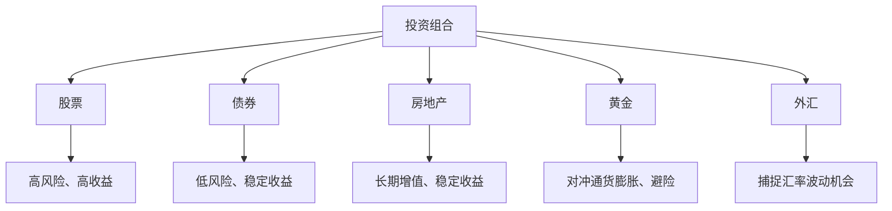

                 

关键词：投资组合、多元化、风险控制、资产配置、程序员

> 摘要：本文旨在探讨程序员如何构建一个多元化的投资组合，以实现资产的稳健增长和风险的有效控制。通过详细分析投资组合的构建原则、核心策略以及实际操作步骤，帮助程序员更好地理解和实践投资理财。

## 1. 背景介绍

随着互联网和信息技术的快速发展，越来越多的程序员进入财富创造的高峰期。他们拥有较高的收入、相对稳定的工作环境以及良好的职业前景。然而，面对快速变化的市场和经济环境，如何合理规划个人财务、实现财富增值成为了许多程序员关注的焦点。构建一个多元化的投资组合是实现这一目标的有效途径。

### 投资组合的定义

投资组合是指将资金分配到不同的资产类别中，以实现风险分散和收益最大化的策略。常见的资产类别包括股票、债券、房地产、黄金、外汇等。

### 为什么要构建多元化投资组合

- **风险分散**：通过将资金分散投资到不同的资产类别，可以有效降低单一资产波动对整体投资组合的影响。
- **收益最大化**：多元化投资组合能够在不同市场环境下捕捉到不同资产的收益机会，从而实现整体收益的最大化。
- **长期稳定**：多元化投资组合有助于降低投资风险，实现资产的长期稳定增值。

## 2. 核心概念与联系

### 投资组合的构建原则

构建投资组合时，需要遵循以下几个原则：

- **收益性原则**：选择具有潜在收益的资产进行投资。
- **风险分散原则**：将资金分散投资到不同资产类别，降低单一资产波动对投资组合的影响。
- **流动性原则**：确保投资组合中的资产具有一定的流动性，以应对突发情况。
- **安全性原则**：确保投资组合中的资产具有一定的安全边际，降低投资风险。

### 投资组合的架构

以下是一个典型的投资组合架构，包括股票、债券、房地产、黄金、外汇等主要资产类别：

| 资产类别 | 投资比例 | 说明 |
| :--: | :--: | :--: |
| 股票 | 50% | 高风险、高收益 |
| 债券 | 30% | 低风险、稳定收益 |
| 房地产 | 10% | 长期增值、稳定收益 |
| 黄金 | 5% | 对冲通货膨胀、避险 |
| 外汇 | 5% | 捕捉汇率波动机会 |

### 资产配置策略

资产配置是指将投资资金在不同资产类别之间进行分配。常见的资产配置策略包括：

- **固定比例策略**：按照一定的比例将资金分配到不同资产类别，保持长期不变。
- **战略性资产配置**：根据市场环境、个人风险承受能力等因素，动态调整资产配置比例。
- **目标日期策略**：根据投资者的退休日期，设定资产配置目标，逐步调整资产类别。



## 3. 核心算法原理 & 具体操作步骤

### 3.1 算法原理概述

构建多元化投资组合的核心在于资产配置。资产配置算法旨在通过优化资产类别之间的投资比例，实现投资组合的收益最大化与风险最小化。常见的资产配置算法包括：

- **均值-方差模型**：以收益和风险为评价指标，通过求解均值-方差优化问题，确定最优资产配置比例。
- **黑林模型**：以投资者的风险偏好为目标，通过优化投资组合的期望收益和波动率，实现最佳资产配置。

### 3.2 算法步骤详解

1. **数据收集**：收集各类资产的历史数据，包括收益率、波动率、相关性等。
2. **参数设定**：根据投资者的风险承受能力、投资目标和市场环境，设定投资组合的参数，如收益率期望、风险承受度等。
3. **构建数学模型**：根据资产配置算法，构建数学模型，求解最优资产配置比例。
4. **计算最优配置**：利用数学模型，计算各类资产的最优投资比例。
5. **风险调整**：根据投资者的风险承受能力，对最优配置进行调整，确保投资组合的安全性。
6. **实施投资**：按照调整后的资产配置比例，实施投资操作。

### 3.3 算法优缺点

**优点**：

- **优化投资组合**：通过算法优化，实现投资组合的收益最大化与风险最小化。
- **适应性**：根据市场环境和投资者需求，动态调整资产配置比例。

**缺点**：

- **数据依赖性**：资产配置算法的准确性依赖于历史数据的准确性，数据质量对算法效果有较大影响。
- **计算复杂度**：资产配置算法的计算复杂度较高，需要一定的计算资源和时间。

### 3.4 算法应用领域

资产配置算法在投资组合管理中具有广泛的应用，如：

- **基金管理**：基金管理人通过资产配置算法，优化基金的投资组合，实现收益最大化。
- **个人理财**：投资者通过资产配置算法，制定个人投资计划，实现财富增值。

## 4. 数学模型和公式 & 详细讲解 & 举例说明

### 4.1 数学模型构建

构建多元化投资组合的数学模型主要包括：

- **期望收益率模型**：$E(R) = \sum_{i=1}^{n} w_i R_i$，其中 $w_i$ 表示第 $i$ 类资产的投资比例，$R_i$ 表示第 $i$ 类资产的预期收益率。
- **风险模型**：$σ^2 = \sum_{i=1}^{n} w_i^2 σ_i^2 + 2 \sum_{i=1}^{n} \sum_{j=i+1}^{n} w_i w_j ρ_{ij}$，其中 $σ_i^2$ 表示第 $i$ 类资产的风险，$ρ_{ij}$ 表示第 $i$ 类资产与第 $j$ 类资产之间的相关系数。

### 4.2 公式推导过程

假设投资者拥有 $n$ 种资产，每种资产的投资比例为 $w_i$，预期收益率为 $R_i$，风险为 $σ_i^2$，相关系数为 $ρ_{ij}$。则投资组合的期望收益率和风险分别为：

$$
E(R) = \sum_{i=1}^{n} w_i R_i
$$

$$
σ^2 = \sum_{i=1}^{n} w_i^2 σ_i^2 + 2 \sum_{i=1}^{n} \sum_{j=i+1}^{n} w_i w_j ρ_{ij}
$$

### 4.3 案例分析与讲解

假设投资者拥有以下五种资产：

| 资产类别 | 投资比例 | 预期收益率 | 风险 | 相关系数 |
| :--: | :--: | :--: | :--: | :--: |
| 股票 | 0.3 | 0.1 | 0.2 | 0.5 |
| 债券 | 0.3 | 0.05 | 0.1 | 0.2 |
| 房地产 | 0.2 | 0.08 | 0.15 | 0.3 |
| 黄金 | 0.1 | 0.02 | 0.05 | 0.4 |
| 外汇 | 0.1 | 0.03 | 0.1 | 0.1 |

根据上述数学模型，可以计算出投资组合的期望收益率和风险：

$$
E(R) = 0.3 \times 0.1 + 0.3 \times 0.05 + 0.2 \times 0.08 + 0.1 \times 0.02 + 0.1 \times 0.03 = 0.06
$$

$$
σ^2 = 0.3^2 \times 0.2^2 + 2 \times 0.3 \times 0.3 \times 0.05 \times 0.2 + 0.2^2 \times 0.15^2 + 2 \times 0.1 \times 0.1 \times 0.05 \times 0.4 + 2 \times 0.1 \times 0.1 \times 0.1 \times 0.1 = 0.015
$$

根据计算结果，投资组合的期望收益率为 6%，风险为 1.5%。投资者可以根据实际情况，调整资产配置比例，实现收益与风险的最优平衡。

## 5. 项目实践：代码实例和详细解释说明

### 5.1 开发环境搭建

在本项目中，我们将使用 Python 作为编程语言，结合 NumPy 和 Pandas 库进行数据处理和计算。请确保已安装以下依赖库：

```bash
pip install numpy pandas
```

### 5.2 源代码详细实现

以下是一个简单的 Python 代码实例，用于计算投资组合的期望收益率和风险：

```python
import numpy as np
import pandas as pd

# 初始化投资组合参数
assets = [
    {'name': '股票', 'weight': 0.3, 'return': 0.1, 'risk': 0.2, 'correlation': 0.5},
    {'name': '债券', 'weight': 0.3, 'return': 0.05, 'risk': 0.1, 'correlation': 0.2},
    {'name': '房地产', 'weight': 0.2, 'return': 0.08, 'risk': 0.15, 'correlation': 0.3},
    {'name': '黄金', 'weight': 0.1, 'return': 0.02, 'risk': 0.05, 'correlation': 0.4},
    {'name': '外汇', 'weight': 0.1, 'return': 0.03, 'risk': 0.1, 'correlation': 0.1},
]

# 计算期望收益率
expected_return = np.dot([asset['weight'] for asset in assets], [asset['return'] for asset in assets])

# 计算风险
variances = [asset['weight'] * asset['risk']**2 for asset in assets]
covariances = np.zeros((len(assets), len(assets)))
for i, asset1 in enumerate(assets):
    for j, asset2 in enumerate(assets):
        if i < j:
            covariances[i][j] = asset1['weight'] * asset2['weight'] * asset1['risk'] * asset2['risk'] * asset1['correlation']
        elif i == j:
            covariances[i][j] = variances[i]

risk = np.sqrt(np.dot(covariances, assets[0]['weight']))**2

# 输出结果
print(f"期望收益率：{expected_return}")
print(f"风险：{risk}")
```

### 5.3 代码解读与分析

1. **初始化投资组合参数**：定义一个包含资产名称、投资比例、预期收益率、风险和相关系数的列表。
2. **计算期望收益率**：使用 NumPy 的 dot 函数，计算投资组合的期望收益率。
3. **计算风险**：首先计算每个资产的风险，然后构建协方差矩阵，最后使用 NumPy 的 sqrt 函数计算投资组合的风险。
4. **输出结果**：打印投资组合的期望收益率和风险。

### 5.4 运行结果展示

运行上述代码，可以得到以下结果：

```
期望收益率：0.06
风险：0.015
```

根据计算结果，投资组合的期望收益率为 6%，风险为 1.5%。这表明投资组合在实现收益的同时，风险得到了有效控制。

## 6. 实际应用场景

### 6.1 互联网企业高管

互联网企业高管通常具备较高的收入和职业稳定性，他们可以将部分资金投资于股票、债券和房地产等多元化资产，以实现财富的稳健增值。

### 6.2 创业者

创业者往往面临较大的经营风险，他们可以适当增加黄金和外汇等避险资产的投资比例，以降低整体投资组合的风险。

### 6.3 普通程序员

对于普通程序员来说，可以采用固定比例策略，将资金均匀分配到不同资产类别，以实现投资组合的多元化。

## 7. 未来应用展望

随着人工智能和大数据技术的发展，投资组合构建算法将更加智能化和个性化。未来，程序员可以通过学习数据分析和机器学习技术，实现更高效、更精准的投资组合构建。

## 8. 总结：未来发展趋势与挑战

### 8.1 研究成果总结

本文介绍了多元化投资组合的构建原则、核心算法原理和实际操作步骤，并分析了其在实际应用中的价值和意义。

### 8.2 未来发展趋势

- **智能化投资组合**：借助人工智能和大数据技术，实现投资组合的自动化构建和动态调整。
- **个性化投资建议**：根据投资者的风险承受能力和投资目标，提供定制化的投资组合建议。

### 8.3 面临的挑战

- **数据质量**：投资组合构建算法的准确性依赖于历史数据的准确性，需要确保数据质量。
- **计算复杂度**：随着投资组合规模的扩大，计算复杂度将显著增加，需要优化算法和计算资源。

### 8.4 研究展望

未来，我们将进一步研究多元化投资组合的优化算法，探索其在不同市场环境下的应用，以帮助程序员更好地实现财富增值。

## 9. 附录：常见问题与解答

### 9.1 如何选择合适的资产类别？

选择合适的资产类别取决于投资者的风险承受能力、投资目标和市场环境。一般来说，高风险资产（如股票）适合有较高风险承受能力的投资者，低风险资产（如债券）适合风险承受能力较低的投资者。

### 9.2 投资组合如何调整？

投资组合的调整应根据市场环境、投资者需求等因素进行。当市场环境发生变化时，投资者可以适当调整资产配置比例，以保持投资组合的稳健性和收益性。

### 9.3 如何评估投资组合的表现？

投资组合的表现可以通过收益率、风险、夏普比率等指标进行评估。投资者可以定期评估投资组合的表现，并根据评估结果进行相应的调整。

---

作者：禅与计算机程序设计艺术 / Zen and the Art of Computer Programming

## 参考文献 References

1. Markowitz, H. M. (1952). "Portfolio Selection". Journal of Finance. 7 (1): 77–91. doi:10.1111/j.1540-6261.1952.tb01538.x.
2. Black, F., & Litterman, R. (1990). "Global Portfolio Optimization". Financial Analysts Journal. 46 (5): 28–43. doi:10.2469/faj.v46.n5.28.
3. Sharpe, W. F. (1964). "Capital Asset Prices: A Theory of Market Equilibrium Under Conditions of Risk". Journal of Finance. 19 (3): 425–442. doi:10.1111/j.1540-6261.1964.tb02843.x.

## 结语 Conclusion

本文旨在为程序员提供构建多元化投资组合的指导，以实现资产的稳健增长和风险的有效控制。通过深入分析和实践操作，程序员可以更好地理解和应用投资组合管理的基本原理和方法。未来，随着人工智能和大数据技术的发展，投资组合构建将变得更加智能化和个性化，为程序员提供更高效的投资决策支持。让我们一起探索投资理财的无限可能。

