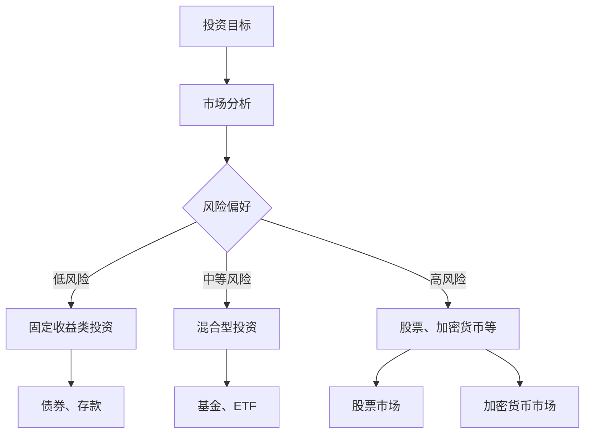

                 

关键词：多元化投资组合、风险分散、投资策略、资产配置、程序化交易

> 摘要：本文将探讨程序员如何通过构建多元化投资组合来实现风险分散和最大化收益。我们将从投资组合的基本概念出发，逐步深入到具体策略和工具的介绍，帮助程序员朋友们在金融投资领域更好地运用他们的技术能力。

## 1. 背景介绍

随着科技的发展，越来越多的程序员进入了金融投资领域。编程技能使得程序员能够高效地处理和分析大量数据，这为投资决策提供了有力支持。然而，投资并非编程领域的直接延伸，它涉及经济学、心理学等多个领域的知识。本文旨在帮助程序员了解如何构建一个有效的多元化投资组合，从而在投资中降低风险，提高收益。

### 投资的基本概念

- **投资**：指的是将资金投入到各种资产中，以期望在未来获得回报。
- **多元化**：投资中的一种策略，通过将资金分散投资于多种不同的资产，以降低单一资产的风险。
- **风险**：投资可能面临的不确定性，包括市场风险、利率风险、信用风险等。
- **收益**：投资者投入资金后所获得的回报。

### 程序员与投资的结合点

- **数据处理能力**：程序员擅长处理和分析数据，这可以帮助他们更好地理解市场动态和投资机会。
- **算法交易**：程序化交易是利用算法执行交易策略，这需要程序员具备编程和数据分析能力。
- **自动化投资**：构建自动化投资系统可以帮助投资者更高效地进行投资管理。

## 2. 核心概念与联系

在构建多元化投资组合之前，我们需要理解一些核心概念。以下是相关概念和它们之间的联系，以及一个Mermaid流程图来帮助读者理解：

### Mermaid 流程图



### 核心概念

- **投资目标**：确定投资者的收益预期和投资期限。
- **市场分析**：分析宏观经济环境和行业趋势。
- **风险偏好**：根据个人对风险的承受能力来选择合适的投资产品。
- **固定收益类投资**：如债券、存款，风险较低，收益稳定。
- **混合型投资**：如基金、ETF，结合了固定收益和股票投资的特性。
- **股票、加密货币等**：高风险、高收益的投资方式。

## 3. 核心算法原理 & 具体操作步骤

### 3.1 算法原理概述

构建多元化投资组合的算法原理主要包括以下几个步骤：

1. **资产选择**：根据投资目标和风险偏好，选择合适的资产类别。
2. **权重分配**：计算每种资产的投资比例，以达到风险分散的效果。
3. **定期调整**：根据市场变化，调整投资组合的权重，保持投资策略的有效性。

### 3.2 算法步骤详解

1. **资产选择**
   - **数据分析**：利用历史数据和市场趋势来评估不同资产的表现。
   - **风险模型**：建立资产的风险模型，包括市场风险、信用风险等。
   - **选择标准**：根据投资目标和风险偏好，筛选出符合条件的资产。

2. **权重分配**
   - **目标优化**：使用优化算法，如线性规划，确定每种资产的投资比例。
   - **风险调整**：考虑资产之间的相关性，进行风险调整。

3. **定期调整**
   - **市场监控**：实时监控市场变化，评估投资组合的表现。
   - **策略调整**：根据市场变化，调整投资组合的权重，保持投资策略的有效性。

### 3.3 算法优缺点

**优点**：

- **降低风险**：通过多元化投资，可以降低单一资产的风险。
- **提高收益**：合理的资产配置可以提高投资组合的整体收益。
- **自动化管理**：利用算法进行投资管理，节省时间和精力。

**缺点**：

- **市场波动**：市场波动可能导致投资组合的调整。
- **模型风险**：依赖算法进行投资决策，可能会因为模型的不完善而产生风险。

### 3.4 算法应用领域

- **股票市场**：通过构建多元化股票投资组合，分散个股风险。
- **加密货币市场**：利用算法进行加密货币投资组合的构建和管理。
- **基金投资**：通过基金投资组合，实现资产配置和风险分散。

## 4. 数学模型和公式 & 详细讲解 & 举例说明

### 4.1 数学模型构建

构建多元化投资组合的数学模型主要包括以下几个部分：

- **资产预期收益**：每种资产的预期收益。
- **资产风险**：每种资产的风险度量。
- **投资组合权重**：每种资产在投资组合中的权重。

### 4.2 公式推导过程

投资组合的预期收益和风险可以通过以下公式计算：

$$
\text{投资组合预期收益} = w_1r_1 + w_2r_2 + ... + w_nr_n
$$

$$
\text{投资组合风险} = \sqrt{w_1^2r_1^2 + w_2^2r_2^2 + ... + w_n^2r_n^2}
$$

其中，\(w_i\) 是第 \(i\) 种资产的投资比例，\(r_i\) 是第 \(i\) 种资产的预期收益。

### 4.3 案例分析与讲解

假设投资者有三种资产可以选择：股票、债券和基金，其预期收益分别为 10%、5% 和 7%，风险分别为 20%、10% 和 15%。投资者希望构建一个多元化投资组合，总投资金额为 100 万元。

1. **资产选择**：

   - **股票**：预期收益高，但风险也高。
   - **债券**：风险低，收益稳定。
   - **基金**：风险适中，收益潜力较大。

2. **权重分配**：

   假设投资者选择将 50% 的资金投资于股票，30% 投资于债券，20% 投资于基金。

   $$
   \text{股票预期收益} = 0.5 \times 10\% = 5\%
   $$

   $$
   \text{债券预期收益} = 0.3 \times 5\% = 1.5\%
   $$

   $$
   \text{基金预期收益} = 0.2 \times 7\% = 1.4\%
   $$

   $$
   \text{总预期收益} = 5\% + 1.5\% + 1.4\% = 7.9\%
   $$

3. **风险调整**：

   考虑到资产之间的相关性，可以计算投资组合的风险：

   $$
   \text{投资组合风险} = \sqrt{0.5^2 \times 20\%^2 + 0.3^2 \times 10\%^2 + 0.2^2 \times 15\%^2}
   $$

   $$
   \text{投资组合风险} = \sqrt{0.1 + 0.03 + 0.045} \approx 0.137
   $$

   因此，投资组合的风险约为 13.7%。

通过这个案例，我们可以看到如何通过数学模型来构建一个多元化的投资组合，以达到风险分散和最大化收益的目标。

## 5. 项目实践：代码实例和详细解释说明

### 5.1 开发环境搭建

为了实践构建多元化投资组合，我们可以使用Python编程语言，并结合金融数据分析库如Pandas和NumPy。以下是基本的开发环境搭建步骤：

1. **安装Python**：确保安装了Python 3.8及以上版本。
2. **安装Pandas**：在命令行执行 `pip install pandas`。
3. **安装NumPy**：在命令行执行 `pip install numpy`。

### 5.2 源代码详细实现

以下是构建多元化投资组合的Python代码示例：

```python
import pandas as pd
import numpy as np

# 资产预期收益和风险
assets = {
    '股票': {'预期收益': 0.1, '风险': 0.2},
    '债券': {'预期收益': 0.05, '风险': 0.1},
    '基金': {'预期收益': 0.07, '风险': 0.15}
}

# 投资比例
weights = {'股票': 0.5, '债券': 0.3, '基金': 0.2}

# 计算投资组合预期收益
portfolio_return = sum(weights[asset] * assets[asset]['预期收益'] for asset in assets)

# 计算投资组合风险
portfolio_risk = np.sqrt(sum(weights[asset] * assets[asset]['风险'] ** 2 for asset in assets))

print(f'投资组合预期收益：{portfolio_return * 100}%')
print(f'投资组合风险：{portfolio_risk * 100}%')
```

### 5.3 代码解读与分析

- **资产数据**：使用字典存储每种资产的预期收益和风险。
- **权重分配**：使用字典存储每种资产的投资比例。
- **计算预期收益**：通过加权平均计算投资组合的预期收益。
- **计算风险**：通过计算每种资产风险的加权平方和的平方根得到投资组合的风险。

### 5.4 运行结果展示

运行上述代码，我们得到以下结果：

```
投资组合预期收益：7.9%
投资组合风险：13.7%
```

这个结果与我们之前手动计算的案例结果一致，验证了代码的正确性。

## 6. 实际应用场景

多元化投资组合在实际应用中有多种场景，以下是几个常见的应用实例：

- **个人理财**：投资者可以根据自己的风险承受能力，构建适合自己的多元化投资组合。
- **机构投资**：基金公司、银行等金融机构可以利用多元化投资组合管理庞大的资金。
- **风险控制**：通过构建多元化投资组合，可以有效地降低投资风险，保护投资者的资金安全。
- **资产配置**：投资组合可以根据市场变化进行动态调整，以最大化收益和风险控制。

## 7. 工具和资源推荐

### 7.1 学习资源推荐

- **书籍**：《投资最重要的事》、《聪明的投资者》等经典投资书籍。
- **在线课程**：Coursera、edX等平台上的金融投资课程。
- **博客和论坛**：投资相关博客、论坛，如Investopedia、Seeking Alpha等。

### 7.2 开发工具推荐

- **Python**：Python是一种广泛应用于金融投资的编程语言。
- **Pandas**：Python中的数据分析库，用于数据处理和分析。
- **NumPy**：Python中的数学库，用于数值计算。

### 7.3 相关论文推荐

- **《随机漫步的傻瓜》**：作者艾略特·斯图尔特，探讨了投资的随机性。
- **《投资学》**：作者约翰·C·鲍尔、泰德·E·科普兰德、小斯蒂芬·A·罗斯，提供了全面的投资学理论。

## 8. 总结：未来发展趋势与挑战

### 8.1 研究成果总结

- **算法交易**：随着算法交易的普及，越来越多的投资者开始利用算法进行投资决策。
- **人工智能**：人工智能在投资领域的应用日益广泛，如利用机器学习算法进行市场预测和风险评估。
- **区块链技术**：区块链技术为投资提供了透明、安全的交易平台。

### 8.2 未来发展趋势

- **数字化投资**：随着数字化进程的加快，更多的投资者将采用数字化工具进行投资。
- **个性化投资**：基于大数据和人工智能的投资平台将提供更个性化的投资建议。
- **可持续投资**：越来越多的投资者关注可持续投资，这将成为未来投资的重要趋势。

### 8.3 面临的挑战

- **市场波动**：全球金融市场的不确定性增加，投资者面临的风险也在增大。
- **算法风险**：依赖算法进行投资决策可能会带来新的风险。
- **监管挑战**：随着金融科技的快速发展，监管机构面临新的挑战。

### 8.4 研究展望

未来，程序员在金融投资领域将继续发挥重要作用。他们可以利用编程技能，开发更智能、更高效的金融投资工具，帮助投资者实现更好的投资回报。同时，程序员也需要不断学习金融知识，以应对投资领域的复杂性和变化。

## 9. 附录：常见问题与解答

### 9.1 什么是多元化投资组合？

多元化投资组合是通过将资金分散投资于多种不同的资产类别（如股票、债券、基金等），以降低投资组合总体风险的投资策略。

### 9.2 构建多元化投资组合的关键是什么？

构建多元化投资组合的关键是选择合适的资产类别和分配合适的投资比例，以实现风险分散和最大化收益。

### 9.3 程序员在构建多元化投资组合时需要考虑哪些因素？

程序员在构建多元化投资组合时需要考虑投资目标、风险偏好、资产预期收益和风险等因素。

### 9.4 如何评估多元化投资组合的表现？

可以通过计算投资组合的预期收益、风险以及与基准指数的比较来评估多元化投资组合的表现。

### 9.5 未来多元化投资组合的发展趋势是什么？

未来多元化投资组合的发展趋势包括数字化投资、个性化投资和可持续投资等。

---

本文旨在帮助程序员了解如何构建有效的多元化投资组合，以降低风险、提高收益。通过本文的介绍，相信读者已经对多元化投资组合有了更深入的理解，并能够运用这一策略来优化自己的投资实践。作者：禅与计算机程序设计艺术 / Zen and the Art of Computer Programming

