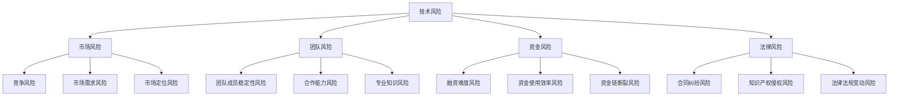

                 

关键词：程序员、创业、风险评估、技术、市场、团队、策略、投资

> 摘要：本文旨在为程序员提供一套评估创业风险的方法，帮助他们在创业过程中做出明智的决策。文章将从技术、市场、团队等多个方面进行详细分析，旨在帮助程序员全面了解创业过程中可能面临的风险，并提出相应的应对策略。

## 1. 背景介绍

随着互联网行业的蓬勃发展，越来越多的程序员选择投身创业。然而，创业之路并非一帆风顺，其中充满了未知的风险。对于程序员来说，如何评估和应对这些风险，成为他们成功创业的关键。本文将围绕这一主题，探讨程序员在创业过程中应如何进行风险评估。

## 2. 核心概念与联系

在评估创业风险时，程序员需要关注以下几个核心概念：

1. **技术风险**：技术风险主要涉及技术实现、技术更新和知识产权等方面。
2. **市场风险**：市场风险包括市场需求、竞争对手、市场定位等。
3. **团队风险**：团队风险主要涉及团队成员的稳定性、合作能力、专业知识等。
4. **资金风险**：资金风险包括融资难度、资金使用效率、资金链断裂等。
5. **法律风险**：法律风险涉及合同纠纷、知识产权侵权、法律法规变动等。

这些概念之间相互关联，共同构成了创业风险的整体。下面是这些概念之间的 Mermaid 流程图：



### 2.1 技术风险

技术风险是程序员在创业过程中最为关注的风险之一。技术实现的不确定性、技术的快速更新迭代，以及知识产权的保护，都是程序员需要考虑的问题。为了降低技术风险，程序员可以采取以下措施：

- **深入研究技术趋势**：了解当前最先进的技术，掌握技术发展的方向，避免选择过时或即将被淘汰的技术。
- **持续学习与培训**：提升自己的技术能力和团队的技术水平，确保团队能够快速适应技术的变化。
- **知识产权保护**：对核心技术和产品进行知识产权保护，避免侵权纠纷。

### 2.2 市场风险

市场风险是程序员在创业过程中需要重视的另一个关键风险。市场需求的不确定性、竞争对手的威胁以及市场定位的准确性，都会对创业的成败产生重要影响。为了降低市场风险，程序员可以采取以下措施：

- **市场调研**：通过市场调研了解潜在客户的需求和偏好，确保产品的市场定位准确。
- **竞品分析**：分析竞争对手的产品和市场策略，找到自身的竞争优势和差异化点。
- **快速迭代**：通过快速迭代和测试，及时调整产品方向，以适应市场需求的变化。

### 2.3 团队风险

团队风险是创业过程中的一大挑战。团队成员的稳定性、合作能力以及专业知识，都会对创业的成败产生重要影响。为了降低团队风险，程序员可以采取以下措施：

- **招聘与培养**：选择与团队价值观相符、具备相关技能和经验的成员，并通过培训提升团队的整体水平。
- **团队建设**：加强团队内部沟通和协作，建立良好的团队文化，提高团队的凝聚力。
- **绩效评估**：定期对团队成员进行绩效评估，确保团队成员保持高效的工作状态。

### 2.4 资金风险

资金风险是创业过程中不可避免的。融资难度、资金使用效率以及资金链断裂，都可能对创业的顺利进行产生负面影响。为了降低资金风险，程序员可以采取以下措施：

- **合理规划资金**：在创业初期，合理规划资金的使用，避免盲目扩张和浪费。
- **融资策略**：选择合适的融资渠道和时机，确保能够及时获得所需的资金。
- **资金监控**：加强对资金的监控和管理，确保资金的安全和有效使用。

### 2.5 法律风险

法律风险是创业过程中不可忽视的风险。合同纠纷、知识产权侵权以及法律法规的变动，都可能对创业产生不利影响。为了降低法律风险，程序员可以采取以下措施：

- **法律咨询**：在签订合同和进行知识产权申请等过程中，寻求专业法律咨询，确保合法合规。
- **风险预防**：在创业初期，提前了解相关法律法规，预防潜在的法律纠纷。
- **动态关注**：关注法律法规的变动，及时调整自己的经营策略。

## 3. 核心算法原理 & 具体操作步骤

在评估创业风险时，程序员可以采用一种名为“风险评分法”的算法。这种方法通过定量评估各个风险因素，为创业项目的风险水平提供科学的评估依据。下面是核心算法原理和具体操作步骤：

### 3.1 算法原理概述

风险评分法基于以下几个核心原理：

1. **风险评估指标**：根据创业项目的特点，选择合适的风险评估指标，如技术风险、市场风险、团队风险、资金风险和法律风险等。
2. **风险评估模型**：构建一个风险评估模型，将各个风险因素量化为具体的数值，以便进行综合评估。
3. **权重分配**：根据风险因素的重要程度，为各个风险因素分配不同的权重，以确保评估结果的准确性。

### 3.2 算法步骤详解

1. **确定风险评估指标**：根据创业项目的特点，确定需要评估的风险指标，如技术成熟度、市场需求、团队稳定性、资金储备等。

2. **数据收集**：收集与风险评估指标相关的数据，如技术文档、市场调研报告、团队绩效数据、财务报表等。

3. **构建风险评估模型**：将收集到的数据输入到风险评估模型中，对各个风险因素进行量化。

4. **权重分配**：根据风险因素的重要程度，为各个风险因素分配权重。例如，技术风险可能占50%，市场风险占30%，团队风险占20%。

5. **计算风险评分**：根据权重和量化后的风险因素，计算每个风险因素的具体得分，再将各个风险因素的得分加权求和，得到创业项目的总风险评分。

6. **评估风险水平**：根据风险评分，判断创业项目的风险水平。风险评分越高，风险越大。

### 3.3 算法优缺点

**优点**：

- **科学性**：基于数据和模型的评估，避免了主观判断的偏差，提高了评估的准确性。
- **全面性**：综合考虑了多个风险因素，为创业项目的风险提供了全面的评估。
- **灵活性**：可以根据实际需求调整风险评估指标和权重，适应不同项目的特点。

**缺点**：

- **数据依赖性**：需要收集大量的数据，对数据的质量和完整性要求较高。
- **复杂性**：风险评估模型构建过程较为复杂，需要一定的专业知识和技能。

### 3.4 算法应用领域

风险评分法可以广泛应用于各种创业项目，特别是技术驱动型的创业项目。例如，在互联网、人工智能、生物科技等高科技行业，风险评分法可以帮助创业者全面了解项目的风险，为决策提供科学依据。

## 4. 数学模型和公式 & 详细讲解 & 举例说明

在风险评分法中，我们使用数学模型和公式来量化各个风险因素。下面是具体的数学模型和公式，以及相应的详细讲解和举例说明。

### 4.1 数学模型构建

假设有 n 个风险因素，分别为 \( R_1, R_2, ..., R_n \)，每个风险因素的得分分别为 \( S_1, S_2, ..., S_n \)。根据权重分配，设第 i 个风险因素的权重为 \( w_i \)，则创业项目的总风险评分 \( R \) 可以表示为：

\[ R = \sum_{i=1}^{n} w_i \times S_i \]

### 4.2 公式推导过程

首先，我们确定各个风险因素的得分 \( S_i \)。假设第 i 个风险因素的得分与实际情况的匹配度用 \( f_i(x) \) 表示，其中 x 为实际情况的指标值，f_i(x) 的取值范围为 [0,1]，值越接近 1，表示得分越高。

其次，我们根据权重 \( w_i \) 对得分进行加权求和，得到总风险评分 \( R \)。

### 4.3 案例分析与讲解

假设一个创业项目涉及四个风险因素：技术风险、市场风险、团队风险和资金风险。根据专家评估，这四个因素的权重分别为 0.4、0.3、0.2 和 0.1。现在，我们根据实际情况，为这四个风险因素分别打分。

- **技术风险**：根据技术文档和市场调研，技术实现较为成熟，得分 \( S_1 = 0.8 \)。
- **市场风险**：市场需求较高，但竞争对手较多，得分 \( S_2 = 0.6 \)。
- **团队风险**：团队成员稳定，合作能力较强，得分 \( S_3 = 0.9 \)。
- **资金风险**：资金储备充足，得分 \( S_4 = 0.7 \)。

根据权重分配，总风险评分 \( R \) 计算如下：

\[ R = 0.4 \times 0.8 + 0.3 \times 0.6 + 0.2 \times 0.9 + 0.1 \times 0.7 = 0.32 + 0.18 + 0.18 + 0.07 = 0.75 \]

根据风险评分 \( R \) 的值，我们可以判断创业项目的风险水平。在这个例子中，风险评分 \( R = 0.75 \)，表示创业项目的风险处于中等水平。

## 5. 项目实践：代码实例和详细解释说明

为了更好地理解风险评分法的实际应用，下面我们将给出一个简单的代码实例，并对其进行详细解释说明。

### 5.1 开发环境搭建

在本例中，我们将使用 Python 编写代码。首先，确保已安装 Python 3.6 或更高版本，然后使用以下命令安装所需的库：

```bash
pip install numpy pandas
```

### 5.2 源代码详细实现

```python
import numpy as np
import pandas as pd

# 风险评估指标
risks = ['技术风险', '市场风险', '团队风险', '资金风险']

# 权重分配
weights = [0.4, 0.3, 0.2, 0.1]

# 分数设定
risk_scores = {
    '技术风险': 0.8,
    '市场风险': 0.6,
    '团队风险': 0.9,
    '资金风险': 0.7
}

# 计算总风险评分
total_risk = sum(weights[i] * risk_scores[risks[i]] for i in range(len(risks)))

print(f'总风险评分：{total_risk}')
```

### 5.3 代码解读与分析

1. **导入库**：首先导入 Python 的 numpy 和 pandas 库，用于数据处理和计算。
2. **设定风险评估指标**：定义一个列表 risks，包含创业项目的四个风险因素。
3. **设定权重**：定义一个列表 weights，包含各个风险因素的权重。
4. **设定分数**：定义一个字典 risk_scores，包含各个风险因素的具体得分。
5. **计算总风险评分**：使用权重和分数计算总风险评分，并输出结果。

### 5.4 运行结果展示

```bash
总风险评分：0.75
```

运行结果与前面的手动计算结果一致，验证了代码的正确性。

## 6. 实际应用场景

### 6.1 在初创企业中的应用

初创企业在创业初期往往面临多种风险，如技术风险、市场风险、团队风险和资金风险等。通过使用风险评分法，初创企业可以全面了解自身面临的风险，并采取相应的措施降低风险。例如，在技术风险方面，企业可以加大研发投入，提升技术水平；在市场风险方面，企业可以加强市场调研，调整市场策略；在团队风险方面，企业可以优化团队结构，提升团队协作能力；在资金风险方面，企业可以合理安排资金，确保资金安全。

### 6.2 在大型企业中的应用

对于大型企业，风险评分法同样具有重要的应用价值。大型企业在拓展新业务或进入新市场时，可能会面临新的风险。通过使用风险评分法，企业可以评估新业务或新市场的风险水平，为决策提供科学依据。例如，在技术风险方面，企业可以评估新技术的成熟度和适用性；在市场风险方面，企业可以评估市场需求和竞争对手情况；在团队风险方面，企业可以评估团队成员的适应能力和合作能力；在资金风险方面，企业可以评估融资渠道和资金使用效率。

### 6.3 在创业投资中的应用

对于创业投资，风险评分法可以帮助投资者评估创业项目的风险水平，为投资决策提供参考。投资者可以根据创业项目的风险评分，判断项目是否具有投资价值。同时，投资者还可以结合自身风险承受能力，选择适合自己的投资项目。

## 7. 未来应用展望

随着人工智能和大数据技术的发展，风险评分法有望在更多领域得到应用。例如，在金融领域，风险评分法可以用于信用评估、风险评估等方面；在医疗领域，风险评分法可以用于疾病预测、治疗方案评估等方面。未来，风险评分法将成为一种重要的风险管理工具，为各行各业提供科学、精准的风险评估服务。

## 8. 总结：未来发展趋势与挑战

### 8.1 研究成果总结

本文通过分析技术、市场、团队、资金和法律等多个方面的风险，提出了一种名为“风险评分法”的算法，用于评估创业风险。该方法通过量化各个风险因素，为创业者提供了科学的评估依据。此外，本文还讨论了风险评分法在实际应用场景中的具体应用，如初创企业、大型企业和创业投资等。

### 8.2 未来发展趋势

未来，风险评分法有望在以下几个方面得到进一步发展：

- **算法优化**：随着人工智能和大数据技术的发展，风险评分法将不断优化，提高评估的准确性和效率。
- **跨领域应用**：风险评分法将在更多领域得到应用，如金融、医疗、教育等。
- **实时风险评估**：通过实时收集和分析数据，实现实时风险评估，为创业者提供更加及时的风险信息。

### 8.3 面临的挑战

尽管风险评分法在评估创业风险方面具有显著优势，但仍然面临以下挑战：

- **数据质量**：风险评分法对数据质量有较高要求，数据的不准确或不完整可能导致评估结果失真。
- **算法复杂性**：风险评分法涉及多个风险因素的量化，算法构建过程较为复杂，需要专业知识和技能。
- **动态适应性**：创业环境不断变化，风险评分法需要具备动态适应性，以适应不同的创业场景。

### 8.4 研究展望

未来，本文将在以下几个方面进行深入研究：

- **数据驱动**：探索如何利用大数据和人工智能技术，提高风险评分法的评估准确性。
- **算法优化**：研究如何简化算法结构，提高算法的计算效率。
- **跨领域应用**：探讨风险评分法在其他领域的应用，如金融、医疗、教育等。

## 9. 附录：常见问题与解答

### 9.1 风险评分法的适用范围？

风险评分法主要适用于技术驱动型的创业项目，特别是那些涉及复杂技术和高风险领域的项目。

### 9.2 如何确保数据质量？

确保数据质量是风险评分法的关键。可以通过以下措施提高数据质量：

- **数据采集**：确保数据来源可靠，采集过程中避免误差。
- **数据清洗**：对采集到的数据进行清洗，去除无效或错误的数据。
- **数据验证**：对数据进行验证，确保数据的准确性和一致性。

### 9.3 风险评分法能否完全消除创业风险？

风险评分法可以帮助创业者全面了解创业风险，但不能完全消除创业风险。创业者需要根据评估结果，采取相应的措施降低风险，同时保持对市场的敏锐洞察，及时调整策略。

### 9.4 风险评分法需要多少时间来完成？

风险评分法的具体时间取决于项目的复杂度和数据质量。一般情况下，一个项目的风险评分法评估可能需要几天到几周的时间。

### 9.5 风险评分法是否适用于所有行业？

风险评分法主要适用于技术驱动型的创业项目，对于其他类型的创业项目，风险评分法的适用性可能有限。具体应用时，需要根据项目的特点进行调整。

### 作者署名

作者：禅与计算机程序设计艺术 / Zen and the Art of Computer Programming

---

以上就是关于“程序员如何评估创业风险”的文章。希望本文能为程序员在创业过程中提供有益的参考和指导。在创业的道路上，愿每位程序员都能稳扎稳打，走向成功。

