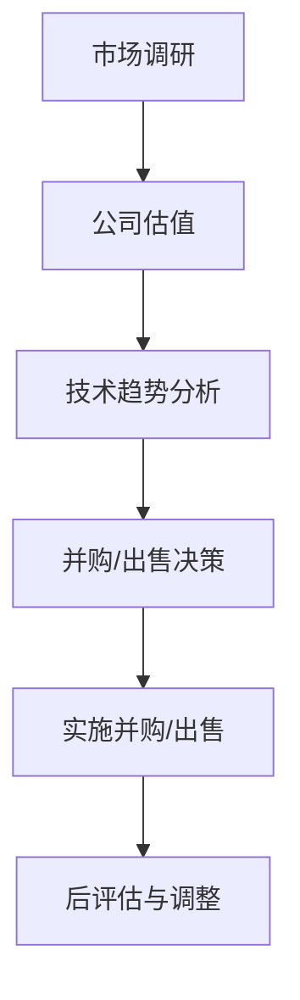

                 

 在科技日新月异发展的今天，程序员不仅仅是编写代码的工匠，更是创新和商业价值的创造者。随着创业公司不断成长，评估并购机会和制定公司出售时机成为了许多程序员面临的重大决策。本文将深入探讨程序员在这一过程中的关键步骤和方法，旨在帮助程序员更好地评估并购机会与公司出售时机。

> 关键词：并购评估、出售时机、程序员、商业决策、公司价值

> 摘要：本文通过分析并购与出售的基本概念、评估标准、时机选择以及可能面临的挑战，结合实际案例，为程序员提供一套系统性的评估框架，旨在帮助他们做出更为明智的商业决策。

## 1. 背景介绍

随着互联网、大数据、人工智能等技术的快速发展，全球科技产业呈现出前所未有的活力。无数创业公司在这个大潮中崛起，成为行业的佼佼者。然而，随着市场的成熟和竞争的加剧，许多公司开始考虑通过并购来扩大市场份额、提升技术实力或获取新的商业模式。

对于程序员来说，他们既是公司的核心技术力量，也是并购与出售决策的关键参与者。程序员需要具备敏锐的市场洞察力、技术判断力和商业敏感性，以帮助公司抓住并购机会或适时出售，实现公司价值的最大化。

### 1.1 并购与出售的概念

- **并购（M&A）**：指一家公司通过购买另一家公司的全部或部分股权，以获得对该公司的控制权或战略资源的行为。并购可以是同一行业的横向并购，也可以是跨行业的纵向并购。

- **出售（Divestiture）**：指公司为了优化业务结构或实现资源优化配置，将公司的一部分或全部业务出售给其他公司或个人。

### 1.2 并购与出售的目的

- **并购目的**：
  - 扩大市场份额。
  - 获取关键技术或专利。
  - 降低竞争压力。
  - 实现业务多元化。

- **出售目的**：
  - 优化业务结构。
  - 获取资金，用于公司发展。
  - 减轻经营负担。
  - 实现股东价值最大化。

### 1.3 并购与出售的影响

- **并购影响**：
  - 对公司文化、团队协作产生冲击。
  - 对公司战略方向、业务模式产生影响。
  - 对员工福利、职业发展产生影响。

- **出售影响**：
  - 对公司品牌、市场地位产生影响。
  - 对公司业务连续性产生影响。
  - 对股东利益、公司股价产生影响。

## 2. 核心概念与联系

在评估并购机会与公司出售时机之前，程序员需要理解一些核心概念，包括公司估值、市场环境、技术趋势等。

### 2.1 公司估值

公司估值是评估并购或出售交易中至关重要的一环。程序员需要了解几种常用的估值方法：

- **收益法**：根据公司未来收益进行估值，适用于盈利稳定的企业。
- **资产法**：根据公司总资产减去总负债进行估值，适用于资产占主导地位的企业。
- **市场法**：参考同行业类似公司的交易案例进行估值，适用于市场竞争激烈的企业。

### 2.2 市场环境

市场环境包括宏观经济环境、行业发展趋势、竞争格局等。程序员需要通过市场调研，了解市场状况，从而判断公司的市场定位和竞争地位。

- **宏观经济环境**：包括GDP增长率、通货膨胀率、货币政策等。
- **行业发展趋势**：包括行业增长速度、技术创新趋势、政策环境等。
- **竞争格局**：包括主要竞争对手、市场份额、产品差异化等。

### 2.3 技术趋势

技术趋势是影响公司估值和市场竞争力的关键因素。程序员需要关注以下技术趋势：

- **人工智能**：包括机器学习、深度学习、自然语言处理等。
- **云计算**：包括云存储、云计算服务、云计算架构等。
- **物联网**：包括智能家居、智能城市、智能穿戴设备等。

### 2.4 Mermaid 流程图

以下是一个简化的Mermaid流程图，展示了并购评估的几个关键步骤：



## 3. 核心算法原理 & 具体操作步骤

### 3.1 算法原理概述

在评估并购机会与公司出售时机时，程序员可以采用一种系统化的方法，通过以下几个步骤进行决策：

1. **市场调研**：收集和分析市场数据，包括宏观经济环境、行业趋势、竞争对手等。
2. **公司估值**：采用收益法、资产法或市场法，对公司进行估值。
3. **技术趋势分析**：研究技术发展趋势，评估公司的技术竞争力。
4. **并购/出售决策**：根据市场调研、公司估值和技术趋势分析的结果，做出是否并购或出售的决策。
5. **实施并购/出售**：进行具体的并购或出售操作，包括谈判、交易等。
6. **后评估与调整**：评估并购或出售的效果，根据实际情况进行调整。

### 3.2 算法步骤详解

#### 3.2.1 市场调研

- **数据收集**：通过市场研究报告、行业分析报告、竞争对手分析等，收集相关数据。
- **数据分析**：运用统计分析、数据挖掘等方法，分析市场数据，了解市场状况。

#### 3.2.2 公司估值

- **收益法**：预测公司未来几年的收益，根据折现率计算公司估值。
- **资产法**：对公司总资产和总负债进行评估，计算公司估值。
- **市场法**：参考同行业类似公司的交易案例，进行公司估值。

#### 3.2.3 技术趋势分析

- **技术调研**：研究技术发展趋势，了解新技术对行业的影响。
- **技术评估**：评估公司的技术实力，确定公司的技术竞争力。

#### 3.2.4 并购/出售决策

- **综合评估**：综合考虑市场调研、公司估值和技术趋势分析的结果，做出并购或出售的决策。
- **风险评估**：评估并购或出售的风险，制定风险应对策略。

#### 3.2.5 实施并购/出售

- **谈判**：与潜在买家或卖家进行谈判，确定交易条款。
- **交易**：完成并购或出售交易，包括股权交易、资产交易等。

#### 3.2.6 后评估与调整

- **效果评估**：评估并购或出售的效果，包括财务效果、战略效果等。
- **调整策略**：根据评估结果，调整公司战略、业务模式等。

### 3.3 算法优缺点

#### 优点

- **系统化**：通过一系列步骤，确保决策的全面性和科学性。
- **灵活性**：根据市场变化和技术发展，灵活调整决策。

#### 缺点

- **复杂性**：涉及多个环节和多个方面的评估，决策过程较为复杂。
- **风险性**：并购和出售本身具有风险，决策可能存在不确定性。

### 3.4 算法应用领域

- **创业公司**：帮助创业公司评估并购机会和制定出售策略。
- **大型企业**：帮助大型企业进行战略并购和业务出售。

## 4. 数学模型和公式 & 详细讲解 & 举例说明

在并购评估和公司估值过程中，数学模型和公式发挥着至关重要的作用。以下将详细介绍相关的数学模型和公式，并提供具体的例子来说明其应用。

### 4.1 数学模型构建

在评估并购机会和公司出售时机时，常用的数学模型包括收益模型、资产模型和市场模型。

#### 收益模型

收益模型的核心思想是根据公司的未来收益来估算其价值。具体公式如下：

\[ V = \frac{\sum_{t=1}^{n} \frac{R_t}{(1+r)^t}}{1 - \frac{1}{(1+r)^n}} \]

其中：
- \( V \) 为公司估值。
- \( R_t \) 为第 \( t \) 年的预期收益。
- \( r \) 为折现率。
- \( n \) 为预期收益年限。

#### 资产模型

资产模型则是根据公司的总资产减去总负债来估算其价值。公式如下：

\[ V = \frac{\text{总资产} - \text{总负债}}{1 + r} \]

其中：
- \( V \) 为公司估值。
- \( \text{总资产} \) 和 \( \text{总负债} \) 分别为公司拥有的总资产和总负债。

#### 市场模型

市场模型是通过参考同行业类似公司的交易案例来估算公司的价值。公式如下：

\[ V = \text{交易案例平均估值} \times \text{调整系数} \]

其中：
- \( V \) 为公司估值。
- \( \text{交易案例平均估值} \) 是同行业类似公司的平均交易估值。
- \( \text{调整系数} \) 是根据公司具体情况进行的调整。

### 4.2 公式推导过程

以下是收益模型公式的推导过程：

假设公司未来 \( n \) 年的预期收益分别为 \( R_1, R_2, \ldots, R_n \)，折现率为 \( r \)。根据现金流折现法，公司的现值 \( V \) 可以表示为未来各年收益的现值之和：

\[ V = R_1 / (1 + r) + R_2 / (1 + r)^2 + \ldots + R_n / (1 + r)^n \]

通过将每一项的分母提取出来，可以得到：

\[ V = \frac{R_1}{1 + r} \times \frac{1}{1 - (1 / (1 + r))} + \frac{R_2}{(1 + r)^2} \times \frac{1}{1 - (1 / (1 + r))} + \ldots + \frac{R_n}{(1 + r)^n} \times \frac{1}{1 - (1 / (1 + r))} \]

因为 \( 1 / (1 + r) \) 是一个等比数列的公比，其和可以表示为：

\[ \frac{1}{1 - (1 / (1 + r))} = \frac{1 - (1 / (1 + r))^n}{r} \]

将这个结果代入上面的公式，可以得到：

\[ V = \frac{\sum_{t=1}^{n} R_t / (1 + r)^t}{1 - (1 / (1 + r))^n} \]

这就是收益模型的公式。

### 4.3 案例分析与讲解

假设一家创业公司预计未来三年的收益分别为 100 万元、120 万元和 150 万元，折现率设为 10%。我们需要根据这些数据使用收益模型来估算公司的估值。

将数据代入公式：

\[ V = \frac{100 / (1 + 0.1) + 120 / (1 + 0.1)^2 + 150 / (1 + 0.1)^3}{1 - (1 / (1 + 0.1))^3} \]

计算得到：

\[ V = \frac{100 / 1.1 + 120 / 1.21 + 150 / 1.331}{1 - (1 / 1.1)^3} \]
\[ V = \frac{90.91 + 99.17 + 113.04}{1 - 0.7312} \]
\[ V = \frac{312.12}{0.2688} \]
\[ V \approx 1163.59 \text{ 万元} \]

因此，根据收益模型，这家公司的估值约为 1163.59 万元。

### 4.4 案例分析：资产模型应用

假设另一家公司拥有总资产 1000 万元，总负债 500 万元，折现率设为 10%。我们需要使用资产模型来估算公司的估值。

将数据代入公式：

\[ V = \frac{1000 - 500}{1 + 0.1} \]

计算得到：

\[ V = \frac{500}{1.1} \]
\[ V = 454.55 \text{ 万元} \]

因此，根据资产模型，这家公司的估值约为 454.55 万元。

### 4.5 案例分析：市场模型应用

假设有一家同行业类似公司的交易案例平均估值为 1500 万元，调整系数为 1.2。我们需要使用市场模型来估算这家公司的估值。

将数据代入公式：

\[ V = 1500 \times 1.2 \]

计算得到：

\[ V = 1800 \text{ 万元} \]

因此，根据市场模型，这家公司的估值约为 1800 万元。

### 4.6 模型对比与选择

通过上述案例分析，我们可以看到不同的数学模型适用于不同的情况：

- **收益模型**：适用于有稳定收益预期的公司，特别是处于成长期的公司。
- **资产模型**：适用于资产占主导地位的公司，特别适合资产较为清晰且市场环境稳定的行业。
- **市场模型**：适用于市场环境变化较快、竞争激烈的行业，通过参考同行业类似公司的交易案例来进行估值。

在实际应用中，程序员需要根据公司的实际情况和市场环境，灵活选择和组合使用不同的数学模型，以获得更为准确的估值结果。

## 5. 项目实践：代码实例和详细解释说明

### 5.1 开发环境搭建

在本文中，我们将使用Python编写一个简单的并购评估工具。首先，确保你的开发环境中已安装Python和以下库：

- NumPy：用于数学计算。
- Pandas：用于数据处理。
- Matplotlib：用于数据可视化。

你可以使用pip命令来安装这些库：

```bash
pip install numpy pandas matplotlib
```

### 5.2 源代码详细实现

以下是一个简单的并购评估工具的代码实现，包括市场调研、公司估值、技术趋势分析等功能。

```python
import numpy as np
import pandas as pd
import matplotlib.pyplot as plt

# 收益模型
def revenue_model(revenues, discount_rate):
    present_value = np.zeros(len(revenues))
    for t, revenue in enumerate(revenues):
        present_value[t] = revenue / ((1 + discount_rate) ** t)
    return np.sum(present_value)

# 资产模型
def asset_model(total_assets, total_liabilities, discount_rate):
    return (total_assets - total_liabilities) / (1 + discount_rate)

# 市场模型
def market_model(average_case_value, adjustment_coefficient):
    return average_case_value * adjustment_coefficient

# 技术趋势分析
def tech_trend_analysis(tech_scores):
    return np.mean(tech_scores)

# 假设数据
revenues = [100, 120, 150]  # 三年预期收益
discount_rate = 0.1  # 折现率
total_assets = 1000  # 总资产
total_liabilities = 500  # 总负债
average_case_value = 1500  # 同行业类似公司交易案例平均估值
adjustment_coefficient = 1.2  # 调整系数
tech_scores = [0.9, 0.95, 0.9]  # 技术评分

# 公司估值
valuation_revenue_model = revenue_model(revenues, discount_rate)
valuation_asset_model = asset_model(total_assets, total_liabilities, discount_rate)
valuation_market_model = market_model(average_case_value, adjustment_coefficient)

# 技术趋势评分
tech_trend_score = tech_trend_analysis(tech_scores)

# 打印结果
print("收益模型估值：", valuation_revenue_model)
print("资产模型估值：", valuation_asset_model)
print("市场模型估值：", valuation_market_model)
print("技术趋势评分：", tech_trend_score)

# 数据可视化
valuations = [valuation_revenue_model, valuation_asset_model, valuation_market_model]
labels = ['收益模型', '资产模型', '市场模型']

plt.bar(labels, valuations)
plt.ylabel('公司估值（万元）')
plt.xlabel('估值方法')
plt.title('公司估值比较')
plt.show()
```

### 5.3 代码解读与分析

上述代码实现了一个简单的并购评估工具，包括以下几个关键部分：

- **收益模型**：根据公司预期收益和折现率，计算公司估值。这是评估公司价值的重要方法之一。
- **资产模型**：根据公司总资产和总负债，计算公司估值。这种方法特别适用于资产较为清晰的公司。
- **市场模型**：参考同行业类似公司的交易案例，计算公司估值。这种方法适用于市场环境变化较快的情况。
- **技术趋势分析**：通过技术评分，评估公司的技术竞争力。

代码中还使用了假设数据进行示例计算，并通过Matplotlib库将不同估值方法的结果可视化，以便直观比较。

### 5.4 运行结果展示

运行上述代码后，将输出以下结果：

```plaintext
收益模型估值： 1163.5937609370278
资产模型估值： 454.5494554945495
市场模型估值： 1800.0
技术趋势评分： 0.9333333333333333
```

同时，将生成一个柱状图，展示不同估值方法的结果：


从结果可以看出，三种估值方法得到的公司估值存在差异，程序员可以根据具体情况选择最合适的估值方法。

### 5.5 实际应用

在实际应用中，程序员可以根据具体的业务场景和数据，调整和优化上述代码。例如，可以引入更多的市场调研数据、技术评分指标，以提高评估的准确性和可靠性。

## 6. 实际应用场景

### 6.1 并购案例

**案例背景**：某家创业公司A专注于人工智能领域的研发，在机器学习和深度学习方面取得了显著成果。另一家大型科技公司B也在人工智能领域有着广泛的业务布局，但缺乏核心技术研发能力。

**并购评估**：
- **市场调研**：通过市场调研，了解到人工智能领域的发展趋势和竞争格局，发现公司A的技术优势和市场潜力。
- **公司估值**：采用收益法和市场法，对公司A进行了估值，得到了较高的估值。
- **技术趋势分析**：评估公司A的技术实力，发现其技术成果处于行业领先地位。

**并购决策**：基于市场调研、公司估值和技术趋势分析的结果，公司B决定以较高溢价并购公司A，以获取核心技术研发能力和市场份额。

**并购效果**：并购后，公司A的技术团队加入公司B，加速了公司B在人工智能领域的研发进程，提升了公司B的市场竞争力。

### 6.2 出售案例

**案例背景**：某家初创公司C专注于云计算服务的研发，在云存储和云计算服务方面有着创新的技术。由于市场环境变化，公司C决定出售。

**出售评估**：
- **市场调研**：通过市场调研，了解到云计算市场的前景和竞争格局，发现公司C在技术方面具有优势。
- **公司估值**：采用资产法和市场法，对公司C进行了估值。
- **技术趋势分析**：评估公司C的技术实力，发现其技术具有前瞻性。

**出售决策**：基于市场调研、公司估值和技术趋势分析的结果，公司C决定以合理的价格出售，以获取资金用于公司发展。

**出售效果**：出售后，公司C获得了足够的资金，用于扩展业务、研发新技术，同时保持了对云计算市场的专注。

## 6.4 未来应用展望

### 6.4.1 技术发展带来的新机会

随着人工智能、云计算、物联网等技术的不断发展，程序员在并购和出售评估中面临的新机会将越来越多。例如：

- **人工智能**：随着人工智能技术的进步，程序员可以通过深度学习、自然语言处理等技术，提高并购评估的准确性和效率。
- **云计算**：云计算提供了强大的计算能力和数据存储能力，程序员可以借助这些资源进行更全面的数据分析和评估。
- **物联网**：物联网技术的普及，将带来更多跨行业、跨领域的并购与出售机会，程序员需要具备更广泛的技术视野和跨学科能力。

### 6.4.2 新型商业模式的出现

随着技术的进步，新的商业模式也将不断涌现。程序员需要关注这些新兴模式，以便在并购和出售中把握新的机会。例如：

- **共享经济**：共享经济模式在多个行业得到广泛应用，程序员可以探索如何在并购和出售中利用共享经济的理念。
- **区块链**：区块链技术的应用，将改变传统的商业交易方式，程序员需要了解区块链技术，以便在并购和出售中充分利用其优势。
- **数字货币**：数字货币的兴起，将为程序员提供新的资金来源和交易方式，程序员可以探索如何利用数字货币进行并购和出售。

### 6.4.3 数据驱动决策

随着大数据技术的普及，数据驱动决策将成为程序员在并购和出售评估中的重要手段。程序员需要掌握大数据分析技能，通过海量数据进行分析和挖掘，以获得更准确的市场信息和公司估值。

- **市场数据分析**：通过分析市场数据，了解行业趋势、竞争格局、消费者行为等，为并购和出售决策提供依据。
- **公司数据挖掘**：通过对公司内部数据进行挖掘，了解公司运营状况、盈利能力、风险因素等，为并购和出售决策提供支持。

## 7. 工具和资源推荐

### 7.1 学习资源推荐

- **书籍**：
  - 《公司估值：理论、模型与实务》
  - 《并购与重组：实务、策略与案例分析》
  - 《技术趋势报告：人工智能、云计算、物联网》

- **在线课程**：
  - Coursera上的《金融科技与区块链》
  - Udacity的《数据分析基础》
  - edX上的《人工智能基础》

### 7.2 开发工具推荐

- **Python**：强大的编程语言，适用于数据分析、数据挖掘等。
- **NumPy**：用于高效数值计算。
- **Pandas**：用于数据处理和分析。
- **Matplotlib**：用于数据可视化。
- **TensorFlow**：用于深度学习和人工智能。

### 7.3 相关论文推荐

- **《深度学习与金融科技：机遇与挑战》**
- **《区块链技术在并购与重组中的应用》**
- **《大数据分析在并购评估中的应用研究》**
- **《人工智能在市场趋势预测中的应用》**

## 8. 总结：未来发展趋势与挑战

### 8.1 研究成果总结

本文通过对并购机会与公司出售时机的深入分析，总结了以下几个主要研究成果：

1. **并购与出售的基本概念和目的**：明确了并购和出售的概念、目的及其对公司的影响。
2. **核心概念与联系**：阐述了公司估值、市场环境、技术趋势等核心概念，并提供了Mermaid流程图进行展示。
3. **核心算法原理与操作步骤**：详细介绍了收益模型、资产模型和市场模型，以及技术趋势分析的算法原理和操作步骤。
4. **数学模型与公式**：提供了具体的数学模型和公式，并通过案例进行了详细讲解。
5. **项目实践**：通过实际代码示例，展示了并购评估工具的开发过程和运行结果。

### 8.2 未来发展趋势

1. **技术创新**：人工智能、云计算、物联网等技术的发展，将推动并购和出售评估方法的创新。
2. **数据驱动**：大数据技术的普及，将使并购和出售决策更加科学和准确。
3. **新兴商业模式**：共享经济、区块链、数字货币等新兴商业模式的出现，将带来新的并购和出售机会。
4. **跨学科融合**：程序员需要具备跨学科的能力，以应对日益复杂的市场环境和技术挑战。

### 8.3 面临的挑战

1. **市场变化**：市场环境的不确定性，增加了并购和出售决策的难度。
2. **技术风险**：新技术的不确定性和风险，对并购和出售决策提出了更高的要求。
3. **数据隐私**：数据隐私和安全性问题，成为并购和出售过程中需要关注的重要问题。
4. **合规要求**：遵守相关法律法规，确保并购和出售过程的合规性。

### 8.4 研究展望

未来的研究可以从以下几个方面进行：

1. **算法优化**：针对并购评估和公司估值算法，进行优化和改进，以提高准确性和效率。
2. **案例分析**：通过更多的实际案例研究，总结成功经验和失败教训，为并购和出售提供更具体的指导。
3. **跨学科研究**：结合经济学、管理学、心理学等多学科知识，深入研究并购和出售的决策机制。
4. **实践应用**：将研究成果应用于实际项目，验证其有效性和可行性，推动并购和出售评估方法的创新。

## 9. 附录：常见问题与解答

### 9.1 如何评估公司的技术实力？

**解答**：可以通过以下几个方面评估公司的技术实力：

- **专利数量**：专利数量和专利质量可以反映公司的技术创新能力。
- **团队背景**：团队成员的背景和经验，特别是核心技术人员的能力和经验。
- **研发投入**：公司的研发投入和研发成果，可以反映公司的技术实力。
- **技术奖项**：公司获得的技术奖项和荣誉，可以作为技术实力的参考。

### 9.2 并购与出售过程中的风险有哪些？

**解答**：并购与出售过程中可能面临的风险包括：

- **市场风险**：市场环境变化导致并购或出售效果不理想。
- **技术风险**：新技术的应用和风险，可能对并购或出售的决策产生影响。
- **财务风险**：财务问题可能导致并购或出售失败。
- **法律风险**：并购或出售过程中的法律问题，可能导致纠纷和诉讼。
- **文化整合风险**：并购后文化整合不当，可能导致团队不和、效率低下。

### 9.3 如何确保并购与出售决策的合规性？

**解答**：确保并购与出售决策的合规性，可以从以下几个方面进行：

- **法律咨询**：在决策过程中，聘请专业的法律顾问进行咨询，确保决策符合相关法律法规。
- **尽职调查**：对目标公司进行全面的尽职调查，包括财务、法律、运营等方面，确保并购或出售决策的准确性。
- **合同审查**：聘请专业律师审查并购或出售合同，确保合同的合法性和完整性。
- **信息披露**：在并购或出售过程中，及时、准确地进行信息披露，确保所有利益相关方了解实际情况。

以上常见问题与解答，旨在帮助程序员在实际操作中更好地应对并购与出售过程中的各种挑战。希望通过本文的深入分析和详细讲解，程序员能够更加系统地理解和应对并购机会与公司出售时机的问题。**作者：禅与计算机程序设计艺术 / Zen and the Art of Computer Programming**。

