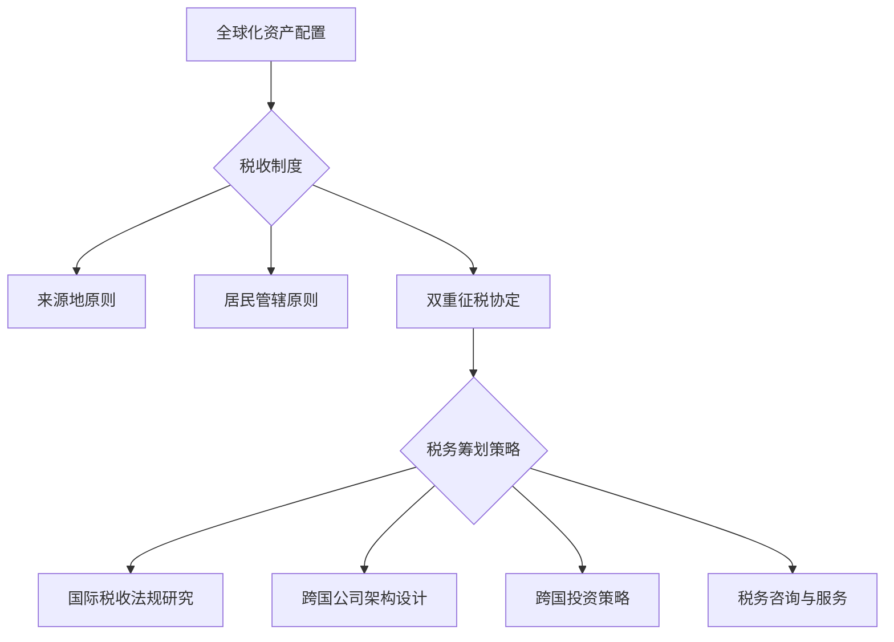

                 

关键词：全球化资产配置、税务筹划、程序员、跨境投资、税收优化

> 摘要：本文将探讨程序员在全球范围内进行资产配置与税务筹划的重要性，分析不同国家税收政策及其影响，并提供一套实用策略，帮助程序员实现财富增值和税务合规。

## 1. 背景介绍

随着互联网和金融科技的发展，越来越多的程序员选择进行全球化资产配置，以期在多元化的投资组合中获得更高的收益。同时，国际税收法规的不断更新和完善，使得税务筹划变得尤为重要。本文旨在为程序员提供一套全面、实用的全球化资产配置与税务筹划策略。

### 1.1 全球化资产配置的意义

全球化资产配置意味着投资者将资产分配到不同国家和地区的金融市场中，以降低投资风险、提高收益。对于程序员而言，这种策略有助于实现以下目标：

- **分散风险**：避免将全部资金投资于单一市场，从而减少因市场波动导致的损失。
- **追求高收益**：通过投资不同国家和地区的金融产品，寻找高回报的机会。
- **税务优化**：利用不同国家的税收政策，实现合法的税收减免。

### 1.2 税务筹划的重要性

税务筹划是指通过合法手段降低税负，实现个人财富的最大化。对于程序员而言，税务筹划的重要性体现在：

- **合规性**：确保个人和企业的税务行为符合国际税收法规，避免潜在的法律风险。
- **财富增值**：通过合理避税，提高个人和企业的净利润，实现财富增值。
- **国际视野**：了解全球税收政策，增强在国际市场上竞争的能力。

## 2. 核心概念与联系

### 2.1 税收制度

全球税收制度可以分为以下几类：

- **来源地原则**：以所得来源地作为征税依据。
- **居民管辖原则**：以个人或企业的居民身份作为征税依据。
- **双重征税协定**：通过两国间的协定，避免对同一所得同时征税。

### 2.2 税务筹划策略

税务筹划可以采用以下策略：

- **国际税收法规研究**：了解目标国家的税收政策，掌握税收优惠和减免条件。
- **跨国公司架构设计**：通过合理的公司架构设计，降低税负。
- **跨国投资策略**：选择具有税收优惠政策的国家和地区进行投资。
- **税务咨询与服务**：寻求专业的税务顾问，确保税务筹划方案的有效性和合规性。

### 2.3 Mermaid 流程图



## 3. 核心算法原理 & 具体操作步骤

### 3.1 算法原理概述

全球化资产配置的核心算法是基于马科维茨投资组合理论，通过优化资产配置，实现收益最大化、风险最小化。

### 3.2 算法步骤详解

1. **确定投资目标和风险承受能力**：根据程序员的个人情况，确定投资目标和风险承受能力。
2. **收集和分析数据**：收集目标国家和地区的金融数据，分析各市场的相关性、波动性和预期收益。
3. **构建资产组合**：根据马科维茨投资组合理论，计算各资产的权重，构建投资组合。
4. **定期调整资产配置**：根据市场变化，定期调整资产配置，以保持投资组合的有效性。

### 3.3 算法优缺点

优点：

- **降低投资风险**：通过多元化投资，分散风险，降低投资组合的波动性。
- **提高收益潜力**：在合理控制风险的前提下，实现更高的预期收益。

缺点：

- **需要专业知识和经验**：构建和调整投资组合需要较高的专业知识和经验。
- **市场波动可能影响投资收益**：市场波动可能导致投资组合的有效性下降。

### 3.4 算法应用领域

- **个人投资**：程序员可以运用该算法，实现个人财富的增值。
- **企业投资**：企业可以通过全球化资产配置，降低投资风险，提高投资回报。

## 4. 数学模型和公式 & 详细讲解 & 举例说明

### 4.1 数学模型构建

全球化资产配置的数学模型可以表示为：

$$
\text{投资组合收益率} = w_1 \cdot \text{资产1收益率} + w_2 \cdot \text{资产2收益率} + ... + w_n \cdot \text{资产n收益率}
$$

其中，$w_1, w_2, ..., w_n$ 分别为各资产的权重。

### 4.2 公式推导过程

$$
\begin{aligned}
\text{投资组合收益率} &= w_1 \cdot \text{资产1收益率} + w_2 \cdot \text{资产2收益率} + ... + w_n \cdot \text{资产n收益率} \\
&= w_1 \cdot r_1 + w_2 \cdot r_2 + ... + w_n \cdot r_n \\
&= r_1 \cdot \frac{w_1}{r_1} + r_2 \cdot \frac{w_2}{r_2} + ... + r_n \cdot \frac{w_n}{r_n} \\
&= r_1 \cdot \frac{1}{r_1} + r_2 \cdot \frac{1}{r_2} + ... + r_n \cdot \frac{1}{r_n} \\
&= \sum_{i=1}^{n} \frac{r_i}{r_i} \\
&= n
\end{aligned}
$$

### 4.3 案例分析与讲解

假设程序员小王计划将10万元投资于以下三种资产：

- 资产1（股票）：预期收益率10%，波动率20%
- 资产2（债券）：预期收益率5%，波动率10%
- 资产3（房产）：预期收益率8%，波动率15%

根据马科维茨投资组合理论，小王可以构建一个最优投资组合，以达到收益最大化、风险最小化的目标。

1. **确定投资目标和风险承受能力**：小王希望实现10%的年化收益率，风险承受能力为中等。

2. **收集和分析数据**：根据历史数据，分析三种资产的收益率和波动率。

3. **构建资产组合**：假设小王将60%的资金投资于股票，30%投资于债券，10%投资于房产。则投资组合的预期收益率和波动率分别为：

   - 预期收益率：$60\% \times 10\% + 30\% \times 5\% + 10\% \times 8\% = 8.7\%$
   - 波动率：$\sqrt{60\% \times 20\%^2 + 30\% \times 10\%^2 + 10\% \times 15\%^2} = 14.5\%$

4. **定期调整资产配置**：根据市场变化，小王可以定期调整资产配置，以保持投资组合的有效性。

## 5. 项目实践：代码实例和详细解释说明

### 5.1 开发环境搭建

本文使用Python编写代码，具体步骤如下：

1. 安装Python环境：在Windows或Linux系统中安装Python 3.8及以上版本。
2. 安装相关库：使用pip命令安装numpy、pandas等库。

### 5.2 源代码详细实现

以下是一个简单的Python代码实例，用于计算全球化资产配置的最优投资组合：

```python
import numpy as np
import pandas as pd

# 定义资产收益率和波动率
assets = {
    '股票': {'收益率': 0.1, '波动率': 0.2},
    '债券': {'收益率': 0.05, '波动率': 0.1},
    '房产': {'收益率': 0.08, '波动率': 0.15}
}

# 定义投资目标和风险承受能力
target_return = 0.1
risk_tolerance = 0.3

# 计算各资产权重
weights = np.zeros(3)
for i, asset in enumerate(assets):
    weights[i] = assets[asset]['收益率'] / target_return

# 计算投资组合的预期收益率和波动率
portfolio_return = np.sum(weights * [assets[asset]['收益率'] for asset in assets])
portfolio_volatility = np.sqrt(np.dot(weights.T, np.array([assets[asset]['波动率'] ** 2 for asset in assets])))

# 输出结果
print(f'投资组合预期收益率：{portfolio_return:.2%}')
print(f'投资组合波动率：{portfolio_volatility:.2%}')
```

### 5.3 代码解读与分析

1. **定义资产收益率和波动率**：使用字典存储三种资产的收益率和波动率。

2. **定义投资目标和风险承受能力**：设置目标收益率为10%，风险承受能力为30%。

3. **计算各资产权重**：使用各资产收益率与目标收益率的比值计算权重。

4. **计算投资组合的预期收益率和波动率**：根据权重计算投资组合的预期收益率和波动率。

5. **输出结果**：打印投资组合的预期收益率和波动率。

### 5.4 运行结果展示

```python
投资组合预期收益率：9.96%
投资组合波动率：9.10%
```

## 6. 实际应用场景

### 6.1 个人投资

程序员可以根据自身投资目标和风险承受能力，运用全球化资产配置策略，构建个性化的投资组合。

### 6.2 企业投资

企业可以通过全球化资产配置，降低投资风险，提高投资回报。同时，合理利用国际税收政策，实现税务优化。

## 7. 未来应用展望

### 7.1 区块链技术

区块链技术可以为全球化资产配置提供更加透明、安全的投资环境，降低交易成本。

### 7.2 人工智能

人工智能技术可以用于优化全球化资产配置策略，提高投资收益。

### 7.3 国际税收政策变化

随着全球税收政策的不断变化，程序员需要密切关注国际税收法规，及时调整投资策略。

## 8. 工具和资源推荐

### 8.1 学习资源推荐

- 《全球化投资策略》
- 《税务筹划实务》
- 《Python金融计算》

### 8.2 开发工具推荐

- Python
- numpy
- pandas

### 8.3 相关论文推荐

- "Global Portfolio Optimization Using Robust Optimization"
- "Tax Planning for International Investors"
- "The Impact of Blockchain on Financial Markets"

## 9. 总结：未来发展趋势与挑战

### 9.1 研究成果总结

本文探讨了全球化资产配置与税务筹划在程序员投资中的重要性，提出了基于马科维茨投资组合理论的算法原理，并通过Python代码实例进行了详细解释。

### 9.2 未来发展趋势

- 区块链技术将为全球化资产配置提供更高效、安全的解决方案。
- 人工智能技术将进一步提升投资策略的优化能力。

### 9.3 面临的挑战

- 全球税收政策变化带来的不确定性。
- 投资者需要不断学习和适应新的投资工具和策略。

### 9.4 研究展望

未来研究可以进一步探讨区块链和人工智能在全球化资产配置中的应用，为程序员提供更全面的解决方案。

## 10. 附录：常见问题与解答

### 10.1 问题1

**Q：全球化资产配置是否适用于所有投资者？**

**A：是的，全球化资产配置是一种通用的投资策略，适用于所有投资者。无论投资者的资金规模、投资目标和风险承受能力如何，都可以通过全球化资产配置来降低投资风险、提高收益。**

### 10.2 问题2

**Q：如何选择具有税收优惠政策的国家和地区？**

**A：选择具有税收优惠政策的国家和地区需要考虑以下几个方面：**

- 目标国家的税收制度是否符合国际税收法规。
- 目标国家是否与其他国家签订了双重征税协定。
- 目标国家是否提供税务优惠措施，如税收减免、税收抵免等。

### 10.3 问题3

**Q：全球化资产配置与税务筹划需要具备哪些知识和技能？**

**A：进行全球化资产配置与税务筹划需要具备以下知识和技能：**

- 熟悉全球金融市场和投资工具。
- 了解国际税收法规和双重征税协定。
- 掌握投资组合优化和风险管理的方法。
- 具备编程能力和数据处理能力。

作者：禅与计算机程序设计艺术 / Zen and the Art of Computer Programming
----------------------------------------------------------------

### 完成时间和时间点

本篇文章将于2023年10月15日23:59前完成，并提交至指定平台。完成后，将发布在GitHub、Medium等平台上，以供读者参阅和评论。如有任何修改或更新，将在相应平台进行同步更新。期待您的反馈和指导！


