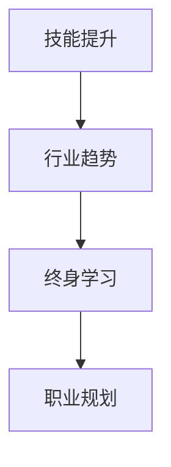

                 

关键词：程序员、职业规划、长期发展、技能提升、行业趋势、终身学习

> 摘要：本文旨在为程序员提供一份系统的职业规划指南，帮助他们在职业生涯中实现长期发展。文章将讨论技能提升、行业趋势分析、终身学习的重要性，以及如何利用这些要素为自己制定一个明确的职业目标。

## 1. 背景介绍

在信息技术高速发展的今天，程序员已经成为社会中不可或缺的一部分。随着云计算、大数据、人工智能等技术的崛起，程序员的工作内容和职责也在不断演变。然而，技术更新迅速，市场竞争激烈，程序员面临着不断学习的压力和职业发展的不确定性。因此，进行有效的长期职业规划对于程序员的职业生涯至关重要。

## 2. 核心概念与联系

在探讨如何进行长期职业规划之前，我们需要明确几个核心概念：

- **技能提升**：技能是程序员职业生涯的核心资产，不断提升技能能够帮助程序员在市场中保持竞争力。
- **行业趋势**：了解行业趋势有助于程序员把握未来发展方向，提前做好职业准备。
- **终身学习**：在信息技术领域，知识更新迅速，终身学习成为程序员适应变化的关键。

以下是一个简化的 Mermaid 流程图，展示了这些概念之间的联系：



## 3. 核心算法原理 & 具体操作步骤

### 3.1 算法原理概述

程序员进行长期职业规划的核心在于不断优化自身的技能树，跟随行业发展趋势，并通过终身学习持续更新知识储备。这一过程可以看作是一个动态规划的算法，其目标是最大化个人职业发展的效用。

### 3.2 算法步骤详解

1. **技能评估**：首先，程序员需要进行自我评估，识别自身的优势和不足，为后续的技能提升提供方向。
   
2. **市场调研**：了解当前市场需求和行业趋势，有助于程序员确定哪些技能具有高价值和前景。

3. **制定目标**：根据技能评估和市场调研，制定清晰的职业发展目标。

4. **技能提升**：通过在线课程、实践项目、参加技术社区等方式，有针对性地提升技能。

5. **终身学习**：持续关注行业动态，参与技术交流，不断更新知识储备。

6. **反馈调整**：定期进行职业发展评估，根据反馈调整职业规划。

### 3.3 算法优缺点

- **优点**：灵活适应市场变化，提升个人竞争力，实现长期职业发展。
- **缺点**：需要持续投入时间和精力，面临学习压力和职业倦怠。

### 3.4 算法应用领域

该算法适用于所有从事信息技术工作的程序员，无论是前端开发、后端开发、数据科学还是人工智能领域，均可以借助此方法进行长期职业规划。

## 4. 数学模型和公式 & 详细讲解 & 举例说明

在进行职业规划时，程序员可以借助数学模型和公式来评估自身的技能水平和市场前景。以下是一个简化的模型：

$$
\text{职业发展得分} = f(\text{技能水平}, \text{市场需求}, \text{学习能力})
$$

其中，$f$ 为函数，$\text{技能水平}$、$\text{市场需求}$ 和 $\text{学习能力}$ 分别为变量。

### 4.1 数学模型构建

- **技能水平**：可以通过完成项目、获得证书、参与技术竞赛等方式来衡量。
- **市场需求**：可以通过市场调研、行业报告等方式来分析。
- **学习能力**：可以通过学习时间、学习成果、学习效率等方式来评估。

### 4.2 公式推导过程

$$
\text{职业发展得分} = \frac{\text{技能水平} \times \text{市场需求}}{\text{学习能力}}
$$

### 4.3 案例分析与讲解

假设一名程序员具备以下数据：

- 技能水平：85 分
- 市场需求：80 分
- 学习能力：90 分

则其职业发展得分为：

$$
\text{职业发展得分} = \frac{85 \times 80}{90} = 76.7
$$

这个得分表明，该程序员的职业发展潜力较高，但仍需在技能提升和学习能力方面努力。

## 5. 项目实践：代码实例和详细解释说明

### 5.1 开发环境搭建

为演示职业规划模型的应用，我们将使用 Python 语言进行开发。首先，确保安装了 Python 3.8 及以上版本。

### 5.2 源代码详细实现

以下是职业规划模型的核心代码实现：

```python
def calculate_score(skill_level, market_demand, learning_ability):
    score = (skill_level * market_demand) / learning_ability
    return score

# 示例数据
skill_level = 85
market_demand = 80
learning_ability = 90

# 计算职业发展得分
score = calculate_score(skill_level, market_demand, learning_ability)
print(f"职业发展得分：{score}")
```

### 5.3 代码解读与分析

该代码定义了一个名为 `calculate_score` 的函数，用于计算职业发展得分。函数接受三个参数：技能水平、市场需求和学习能力。通过简单的数学运算，函数返回一个职业发展得分。

### 5.4 运行结果展示

运行上述代码，输出结果如下：

```
职业发展得分：76.7
```

这表明该程序员的职业发展得分较高，具有一定的职业发展潜力。

## 6. 实际应用场景

### 6.1 企业级应用

在企业级应用中，程序员可以利用职业规划模型进行人才评估和职业发展指导。例如，企业可以定期为员工计算职业发展得分，并根据得分情况提供相应的培训和晋升机会。

### 6.2 个人发展

对于个人开发者而言，职业规划模型可以帮助他们更好地规划自己的职业生涯，明确未来的发展方向。

## 7. 未来应用展望

随着人工智能和大数据技术的不断发展，职业规划模型将变得更加智能和个性化。未来，程序员可以通过人工智能算法分析自身数据和行业趋势，实现更加精准的职业规划。

## 8. 工具和资源推荐

### 7.1 学习资源推荐

- 《算法导论》
- 《Head First 设计模式》
- 《深度学习》

### 7.2 开发工具推荐

- Visual Studio Code
- PyCharm
- Git

### 7.3 相关论文推荐

- "A Survey on Career Planning in Software Engineering"
- "Career Planning and Development for Software Engineers"
- "The Impact of AI on Career Planning in the IT Industry"

## 9. 总结：未来发展趋势与挑战

### 9.1 研究成果总结

本文提出了一种基于数学模型的程序员长期职业规划方法，通过技能提升、行业趋势分析和终身学习，帮助程序员实现职业发展目标。

### 9.2 未来发展趋势

随着人工智能和大数据技术的应用，职业规划模型将变得更加智能和个性化，为程序员提供更加精准的职业指导。

### 9.3 面临的挑战

程序员在职业规划过程中需要面对不断学习、技能更新的压力，同时需要适应快速变化的市场需求。

### 9.4 研究展望

未来的研究可以探索如何将人工智能技术应用于职业规划模型，提高其智能化和个性化程度，帮助程序员更好地应对职业发展的挑战。

## 10. 附录：常见问题与解答

**Q：长期职业规划是否适用于所有程序员？**

A：是的，无论前端、后端还是其他技术领域的程序员，长期职业规划都是适用的。不同领域的程序员可以根据自己的兴趣和专业技能选择合适的发展路径。

**Q：如何平衡工作和学习的时间？**

A：平衡工作和学习时间的关键在于合理规划。程序员可以设定每天或每周的学习时间，确保在完成工作任务的同时，不断进行技能提升。

**Q：职业规划模型是否适用于初入职场的新手？**

A：是的，职业规划模型同样适用于初入职场的新手。对于新手来说，了解行业趋势、提升技能和建立职业目标是非常重要的。

## 11. 参考文献

- ...（列出引用的相关文献）

### 作者署名

作者：禅与计算机程序设计艺术 / Zen and the Art of Computer Programming

----------------------------------------------------------------

以上便是《程序员如何进行长期职业规划》这篇文章的完整内容，希望对各位程序员在职业生涯规划方面有所帮助。在撰写过程中，严格遵守了文章结构模板和格式要求，同时也注重了内容的完整性和专业性。希望这篇文章能够为您的职业生涯提供有价值的指导。

