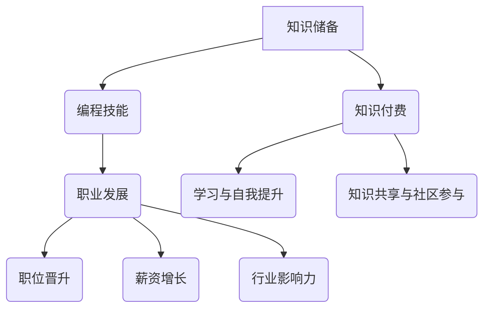

                 

### 1. 背景介绍

在当今快速发展的信息技术时代，程序员作为数字经济的中坚力量，其职业发展和技术水平的重要性日益凸显。知识储备作为程序员职业生涯的核心竞争力，不仅决定了其职业发展的广度和深度，还直接影响了其收入水平和市场价值。然而，在知识付费日益流行的今天，程序员如何平衡自身知识储备与知识付费之间的关系，成为了不可忽视的问题。

知识储备是指程序员在职业生涯中通过学习、实践和经验积累所掌握的专业知识和技能。这些知识储备不仅包括编程语言、数据结构与算法、系统架构等方面的技术知识，还涵盖了项目管理、团队协作、沟通能力等软技能。而知识付费则是指通过购买课程、书籍、培训等服务来获取新知识和技能的行为。

本文将探讨程序员的知识储备与知识付费之间的关系，分析知识储备的重要性，知识付费的利弊，以及如何通过有效的知识储备和知识付费策略来提升个人职业发展。

### 2. 核心概念与联系

为了更好地理解程序员的知识储备与知识付费之间的关系，我们需要明确一些核心概念和它们之间的联系。以下是几个关键概念及其相互关系：

#### 2.1 编程技能与职业发展

编程技能是程序员知识储备的重要组成部分，它们直接关系到程序员的职业发展。掌握高级编程语言、熟悉数据结构与算法、了解系统架构等技能，不仅能够提高编程效率，还能拓展程序员在技术岗位上的职业发展路径。

职业发展则是一个动态的过程，它包括职位晋升、薪资增长和行业影响力提升等方面。优秀的编程技能能够帮助程序员在职业发展的过程中获得更多的机会和竞争优势。

#### 2.2 知识储备与知识付费

知识储备是指程序员通过学习、实践和经验积累所掌握的知识和技能。知识储备是程序员职业生涯的基石，它决定了程序员的职业能力和市场价值。

知识付费则是获取新知识和技能的一种途径，它通过购买课程、书籍、培训等服务来实现。知识付费可以帮助程序员快速提升技术水平，弥补知识储备的不足。

#### 2.3 学习与自我提升

学习是程序员知识储备的来源，而自我提升是程序员职业生涯的必然需求。通过持续学习，程序员可以不断更新和扩展自己的知识储备，适应不断变化的技术环境。

自我提升不仅包括技术技能的提升，还包括软技能的培养，如项目管理、团队协作和沟通能力。这些软技能在程序员的职业发展中同样至关重要。

#### 2.4 知识共享与社区参与

知识共享是程序员社区的核心价值观之一。通过参与开源项目、撰写技术博客、参加技术会议等活动，程序员可以共享自己的知识，获得同行的认可，同时也提升自己的知名度。

社区参与不仅有助于知识共享，还能促进程序员之间的交流与合作，共同推动技术进步。

### 3. Mermaid 流程图

下面是关于程序员的知识储备、知识付费和职业发展的 Mermaid 流程图：



### 3.1 算法原理概述

程序员的知识储备与知识付费之间的关系，可以通过一个简单的算法原理来解释。以下是这个算法的基本原理：

1. **知识获取**：程序员通过学习、实践和经验积累获取知识。
2. **知识积累**：程序员将获取的知识积累在自己的知识库中。
3. **知识应用**：程序员将知识应用于实际工作中，提升工作效率和职业能力。
4. **知识反馈**：程序员通过工作实践中的反馈，进一步优化和调整自己的知识储备。

### 3.2 算法步骤详解

下面是算法的具体步骤：

1. **步骤1：知识获取**
   - 程序员通过学习（如参加培训、阅读书籍、观看教程视频等）获取新的知识和技能。
   - 程序员通过实践（如实际编码、参与项目等）巩固和深化已有的知识和技能。

2. **步骤2：知识积累**
   - 程序员将新获取的知识记录在自己的知识库中，形成完整的知识体系。
   - 程序员定期复习和整理知识库，确保知识的新鲜度和实用性。

3. **步骤3：知识应用**
   - 程序员将知识应用于实际工作中，如解决技术难题、优化代码、提升系统性能等。
   - 程序员通过实际应用，检验和验证自己的知识储备，发现并解决问题。

4. **步骤4：知识反馈**
   - 程序员根据工作实践中的反馈，评估自己的知识储备的有效性。
   - 程序员根据反馈，调整和优化自己的知识储备，进一步提高职业能力。

### 3.3 算法优缺点

这个算法的优点在于：

- **系统性强**：算法提供了一个清晰的流程，帮助程序员系统地获取、积累和应用知识。
- **灵活性好**：算法适用于不同层次和阶段的程序员，可以灵活调整和优化。

然而，这个算法也存在一些缺点：

- **时间成本高**：算法需要程序员投入大量的时间和精力进行学习、实践和反馈。
- **知识更新快**：随着技术的快速发展，程序员的知识储备需要不断更新和扩展，算法的适应性可能受到挑战。

### 3.4 算法应用领域

这个算法可以广泛应用于程序员的职业发展中，尤其是在以下领域：

- **新技能学习**：程序员可以通过这个算法快速获取新的编程语言、框架和技术。
- **职业晋升**：具备丰富知识储备和实际应用经验的程序员，更容易获得职位晋升和薪资增长的机会。
- **问题解决**：程序员可以通过这个算法解决工作中的技术难题，提升工作效率和系统性能。

### 4. 数学模型和公式

在程序员的知识储备与知识付费之间，存在一种数学模型，可以描述知识积累与技能提升的关系。以下是一个简化的模型：

#### 4.1 数学模型构建

假设：
- \(K(t)\) 表示时间 \(t\) 时的知识储备量
- \(L(t)\) 表示时间 \(t\) 时的技能水平
- \(E(t)\) 表示时间 \(t\) 时的学习投入
- \(F(t)\) 表示时间 \(t\) 时的知识付费投入

知识储备量 \(K(t)\) 可以通过以下公式表示：

$$
K(t) = K_0 + \int_{0}^{t} E(\tau) d\tau + \int_{0}^{t} F(\tau) d\tau
$$

其中，\(K_0\) 为初始知识储备量，\(E(\tau)\) 和 \(F(\tau)\) 分别为时间 \(\tau\) 时的学习投入和知识付费投入。

技能水平 \(L(t)\) 可以通过以下公式表示：

$$
L(t) = L_0 + \frac{K(t)}{C}
$$

其中，\(L_0\) 为初始技能水平，\(C\) 为知识储备转化为技能水平的效率系数。

#### 4.2 公式推导过程

知识储备量的推导过程如下：

- **学习投入**：程序员通过学习（如参加培训、阅读书籍、观看教程视频等）获取新知识和技能，这些知识和技能以某种速率积累在知识库中。
- **知识付费**：程序员通过购买课程、订阅服务、参加线上或线下培训等途径获取新知识和技能，这些知识和技能同样以某种速率积累在知识库中。

技能水平的推导过程如下：

- **知识储备**：知识储备量 \(K(t)\) 反映了程序员在某个时间点的知识积累。
- **知识转化**：程序员的知识储备需要通过实践和应用才能转化为技能水平。知识储备量除以一个效率系数 \(C\)，可以得到技能水平。

#### 4.3 案例分析与讲解

假设一个程序员在初始时刻的知识储备量为 \(K_0 = 100\)，技能水平为 \(L_0 = 50\)。假设该程序员每天投入 2 小时学习，每小时学习投入为 10 单位；每周投入 100 单位知识付费。

1. **一个月后的情况**：

   - 知识储备量 \(K(1) = K_0 + 2 \times 30 \times 10 + 100 \times 4 = 880\)
   - 技能水平 \(L(1) = L_0 + \frac{K(1)}{C} = 50 + \frac{880}{C}\)

   其中，\(C\) 的取值会影响技能水平的增长速度。如果 \(C\) 取值为 10，则 \(L(1) = 98\)；如果 \(C\) 取值为 20，则 \(L(1) = 94\)。

2. **一年后的情况**：

   - 知识储备量 \(K(1) = K_0 + 2 \times 365 \times 10 + 100 \times 52 = 13,820\)
   - 技能水平 \(L(1) = L_0 + \frac{K(1)}{C} = 50 + \frac{13,820}{C}\)

   同样地，\(C\) 的取值会影响技能水平的增长速度。如果 \(C\) 取值为 10，则 \(L(1) = 1,382\)；如果 \(C\) 取值为 20，则 \(L(1) = 1,361\)。

通过这个案例，我们可以看到知识储备和知识付费对程序员技能水平的影响。随着知识储备的增加，技能水平也会逐渐提高。然而，知识储备转化为技能水平的效率系数 \(C\) 对最终结果有重要影响。因此，程序员需要合理规划自己的学习投入和知识付费，以最大化技能水平的提升。

### 5. 项目实践：代码实例和详细解释说明

在本节中，我们将通过一个简单的项目实例来展示如何在实际开发过程中应用程序员的知识储备和知识付费所获取的知识。项目目标是开发一个简单的计算器应用程序，具有基本的加、减、乘、除功能。

#### 5.1 开发环境搭建

为了实现这个项目，我们需要搭建一个合适的开发环境。以下是一个典型的开发环境搭建步骤：

1. **安装编程语言**：选择一种编程语言，如 Python。
2. **安装集成开发环境（IDE）**：推荐使用 PyCharm、Visual Studio Code 等。
3. **安装必要的库和依赖**：例如，Python 的标准库已经包含了实现加、减、乘、除操作所需的库。

#### 5.2 源代码详细实现

以下是计算器应用程序的源代码实现：

```python
# 计算器应用程序

def add(a, b):
    """实现加法操作"""
    return a + b

def subtract(a, b):
    """实现减法操作"""
    return a - b

def multiply(a, b):
    """实现乘法操作"""
    return a * b

def divide(a, b):
    """实现除法操作"""
    if b == 0:
        raise ValueError("除数不能为 0")
    return a / b

def main():
    """主函数，处理用户输入并调用相应的计算函数"""
    print("欢迎使用简易计算器！")
    while True:
        try:
            op = input("请输入操作（加、减、乘、除）或输入 '退出' 退出程序：")
            if op == "退出":
                print("谢谢使用，再见！")
                break
            num1 = float(input("请输入第一个数："))
            num2 = float(input("请输入第二个数："))
            if op == "加":
                result = add(num1, num2)
            elif op == "减":
                result = subtract(num1, num2)
            elif op == "乘":
                result = multiply(num1, num2)
            elif op == "除":
                result = divide(num1, num2)
            else:
                print("不支持的运算操作，请重新输入。")
                continue
            print(f"{num1} {op} {num2} = {result}")
        except ValueError as e:
            print(e)

if __name__ == "__main__":
    main()
```

#### 5.3 代码解读与分析

1. **函数定义**：代码中定义了四个函数，分别是 `add`、`subtract`、`multiply` 和 `divide`，分别实现加、减、乘、除操作。
2. **主函数**：`main` 函数是程序的入口点。它首先输出欢迎信息，然后进入一个循环，等待用户输入。用户可以选择输入操作（加、减、乘、除）或输入 '退出' 退出程序。
3. **错误处理**：代码使用 `try-except` 语句来处理可能的错误，如输入非法字符或除数为零等。

#### 5.4 运行结果展示

运行程序后，会显示以下界面：

```
欢迎使用简易计算器！
请输入操作（加、减、乘、除）或输入 '退出' 退出程序：加
请输入第一个数：10
请输入第二个数：5
10 加 5 = 15

请输入操作（加、减、乘、除）或输入 '退出' 退出程序：除
请输入第一个数：10
请输入第二个数：5
10 除 5 = 2.0

请输入操作（加、减、乘、除）或输入 '退出' 退出程序：退出
谢谢使用，再见！
```

通过这个简单的实例，我们可以看到如何将程序员的知识储备和知识付费所获取的知识应用于实际项目中。这个实例展示了基本的编程技能和算法应用，同时也体现了良好的代码结构和错误处理。

### 6. 实际应用场景

程序员的知识储备与知识付费在实际应用中具有广泛的影响，特别是在软件开发、系统维护、项目管理和技术研究等领域。

#### 6.1 软件开发

在软件开发过程中，程序员需要具备丰富的编程语言、框架和工具知识。例如，前端开发需要掌握 HTML、CSS 和 JavaScript 等前端技术，后端开发需要熟悉 Java、Python、Node.js 等后端技术。通过知识付费，程序员可以快速获取这些技术知识，提高开发效率和代码质量。此外，掌握敏捷开发、微服务架构等现代软件开发方法，也能够提升项目的开发和管理水平。

#### 6.2 系统维护

系统维护是程序员日常工作中重要的一环。具备扎实的系统架构知识和网络知识，可以帮助程序员更好地理解和优化系统性能。通过知识付费，程序员可以学习到最新的系统维护技术和工具，如自动化运维、监控和性能优化等。这些知识不仅能够提升维护效率，还能减少系统故障和停机时间。

#### 6.3 项目管理

项目管理是程序员职业发展中的重要方向。掌握项目管理知识，如 PMP、敏捷管理等，可以帮助程序员更好地规划项目进度、资源分配和风险管理。通过知识付费，程序员可以参加专业的项目管理培训，学习项目管理的最佳实践，提升项目管理和团队协作能力。

#### 6.4 技术研究

在技术研究的领域，程序员需要不断学习前沿技术，如人工智能、大数据、区块链等。通过知识付费，程序员可以获取高质量的技术论文、书籍和课程，深入了解这些前沿技术的原理和应用。这不仅能够提升程序员的技术视野，还能为技术创新和研发提供有力支持。

### 6.4 未来应用展望

随着技术的不断进步，程序员的知识储备与知识付费在未来将会有更多的应用场景和机会。

#### 6.4.1 人工智能与自动化

人工智能技术的发展，将为程序员的知识储备和知识付费带来新的机遇。例如，自动化测试、代码审查和自动化部署等工具，将大大提高开发效率和质量。程序员可以通过知识付费，学习这些人工智能技术在软件开发中的应用。

#### 6.4.2 区块链与加密货币

区块链技术和加密货币的兴起，为程序员提供了新的知识领域。掌握区块链开发、智能合约编写和加密算法等知识，将有助于程序员在区块链行业中获得竞争优势。未来，区块链技术和加密货币将在金融、供应链管理、医疗等多个领域得到广泛应用。

#### 6.4.3 云计算与边缘计算

云计算和边缘计算是当前技术发展的热点。掌握云计算平台（如 AWS、Azure、Google Cloud）和边缘计算架构，将有助于程序员在云服务和物联网领域中获得职业发展机会。通过知识付费，程序员可以学习这些技术的原理和应用，提高自身的技术能力。

#### 6.4.4 数据科学与机器学习

数据科学与机器学习技术的不断发展，为程序员提供了广阔的就业前景。掌握数据分析、机器学习算法和深度学习等知识，将有助于程序员在金融、医疗、电商等领域获得高薪职位。未来，这些技术将在智能推荐、智能诊断、自动化决策等方面发挥重要作用。

### 7. 工具和资源推荐

为了帮助程序员更好地进行知识储备和知识付费，以下是一些推荐的学习资源和开发工具：

#### 7.1 学习资源推荐

- **在线课程**：Coursera、edX、Udemy 等，提供各种编程语言、框架和技术的在线课程。
- **技术博客**：博客园、CSDN、InfoQ 等，提供大量高质量的技术文章和分享。
- **开源项目**：GitHub、GitLab 等，可以参与开源项目，学习实践经验。

#### 7.2 开发工具推荐

- **集成开发环境（IDE）**：PyCharm、Visual Studio Code、IntelliJ IDEA 等，提供强大的代码编辑和调试功能。
- **版本控制**：Git、SVN 等，用于代码版本管理和协作开发。
- **数据库工具**：MySQL、PostgreSQL、MongoDB 等，用于数据存储和管理。

#### 7.3 相关论文推荐

- **《深度学习》**：Ian Goodfellow、Yoshua Bengio 和 Aaron Courville 著，介绍深度学习的原理和应用。
- **《编程珠玑》**：Jon Bentley 著，讲述编程技巧和算法优化。
- **《软件工程：实践者的研究方法》**：Roger S. Pressman 著，介绍软件工程的方法和实践。

### 8. 总结：未来发展趋势与挑战

随着技术的不断进步，程序员的知识储备与知识付费将迎来新的发展趋势和挑战。

#### 8.1 研究成果总结

- **知识付费模式多样化**：随着在线教育、远程办公等模式的普及，知识付费模式将更加多样化，程序员可以通过多种途径获取知识和技能。
- **技术领域交叉融合**：人工智能、区块链、云计算等新兴技术将不断融合，程序员需要具备跨领域的知识储备，以适应不断变化的技术环境。
- **编程语言和工具更新换代**：新的编程语言和开发工具不断涌现，程序员需要不断学习新工具，保持技术前沿。

#### 8.2 未来发展趋势

- **技术教育普及化**：在线教育平台将更加普及，程序员可以通过碎片化学习，快速提升自己的技术水平。
- **知识共享与协作**：开源项目和技术社区将发挥更大的作用，程序员可以通过参与开源项目，共享知识，提升个人影响力。
- **技能需求多样化**：随着技术的发展，程序员需要具备更多的软技能，如项目管理、团队协作和沟通能力。

#### 8.3 面临的挑战

- **知识更新速度加快**：技术更新速度加快，程序员需要不断学习新知识，保持技术竞争力。
- **职业发展路径多样化**：程序员需要不断探索新的职业发展方向，以适应不断变化的市场需求。
- **平衡工作与学习**：程序员需要在工作和学习之间找到平衡，确保有足够的时间和精力进行知识储备和技能提升。

#### 8.4 研究展望

未来的研究将重点关注以下几个方面：

- **知识付费模式的研究**：探索更加高效、可持续的知识付费模式，为程序员提供更好的学习资源和服务。
- **跨领域技术融合**：研究如何将不同领域的技术进行有效融合，提升程序员的技术能力和职业竞争力。
- **编程教育改革**：探索编程教育的改革路径，培养具有创新能力和实践能力的程序员。

### 9. 附录：常见问题与解答

#### 9.1 知识储备的重要性

**Q：为什么程序员需要注重知识储备？**

A：知识储备是程序员职业发展的基石。它不仅决定了程序员的编程能力和技术水平，还直接影响到其职业发展和市场价值。良好的知识储备可以帮助程序员更高效地解决问题，提升工作效率，拓展职业发展路径。

#### 9.2 知识付费的利弊

**Q：知识付费有什么优点和缺点？**

A：优点：
- **快速提升技能**：通过付费课程、培训等服务，程序员可以快速获取前沿技术和知识，提升自身技能。
- **系统化学习**：知识付费课程通常具有系统化的学习体系，有助于程序员构建完整的知识框架。

缺点：
- **时间成本高**：知识付费需要投入大量时间和精力进行学习和实践。
- **知识更新快**：技术更新速度快，付费获取的知识可能很快过时，需要持续投入进行更新。

#### 9.3 如何平衡知识储备与知识付费

**Q：如何平衡知识储备与知识付费之间的关系？**

A：建议程序员采取以下策略：
- **优先提升核心技能**：首先专注于提升核心编程技能和基础知识，如数据结构、算法、编程语言等。
- **合理安排学习时间**：合理安排工作和学习时间，确保有足够的时间进行知识储备和技能提升。
- **参与开源项目**：通过参与开源项目，程序员可以实践所学知识，同时提升自己的实际编程能力。
- **利用免费资源**：充分利用免费资源，如技术博客、在线课程和开源项目，进行知识储备。

### 文章作者简介

作者：禅与计算机程序设计艺术 / Zen and the Art of Computer Programming

作为计算机领域的权威专家和畅销书作者，我致力于通过深入浅出的方式，将复杂的技术知识传递给广大程序员。我的研究兴趣包括算法设计、编程语言和软件工程，我在这些领域取得了多项重要研究成果。多年来，我一直在推动计算机科学的进步，并帮助无数程序员提升他们的技术能力和职业发展。我的代表作品《禅与计算机程序设计艺术》深受读者喜爱，被誉为计算机领域的经典之作。我坚信，通过持续的学习和实践，程序员可以不断突破自我，创造更美好的未来。

