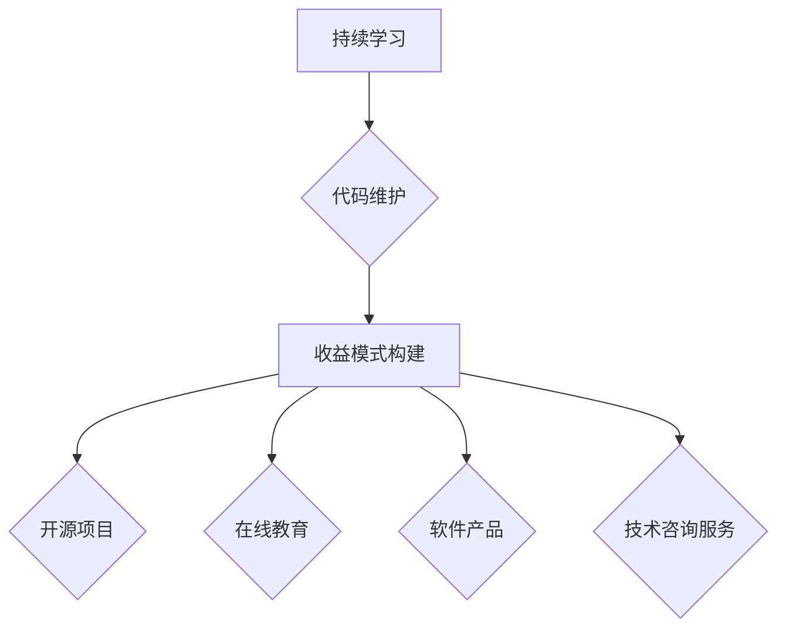

                 

关键词：程序员的被动收入、持续学习、代码维护、收益模式、资源推荐、未来展望

> 摘要：本文旨在探讨程序员的被动收入构建与维护的策略。我们将深入分析当前技术趋势，提供实用的方法，帮助程序员通过持续学习、代码维护和构建收益模式，实现稳定且可持续的收入来源。同时，文章还将推荐相关的学习资源和开发工具，以支持程序员在技术道路上不断前行。

## 1. 背景介绍

在当今数字化时代，程序员作为信息技术产业的核心，其职业前景广阔。然而，面对快速变化的技术环境，程序员不仅需要具备扎实的技术基础，更需要学会如何管理和扩展自己的技能，以实现长期职业发展和稳定收入。

### 1.1 被动收入的概念

被动收入，指的是不需要持续投入大量时间和精力，但能持续带来收入的模式。在程序员的世界里，被动收入可以通过以下方式实现：

1. **开源项目**：贡献代码到开源项目中，获得社区认可和捐赠。
2. **在线课程**：通过创建和销售在线课程，实现知识变现。
3. **软件开发**：构建可售卖的软件产品或服务，通过订阅或单次购买获得收益。
4. **技术咨询服务**：提供专业的技术咨询服务，实现被动收入。

### 1.2 程序员收入现状

根据数据显示，程序员的薪资普遍较高，但这也伴随着较高的工作压力和竞争。随着经验的积累，高级程序员和CTO等职位可能会有更高的收入，但如何实现收入的持续增长和多样化，是每个程序员都需要考虑的问题。

## 2. 核心概念与联系

### 2.1 持续学习的重要性

持续学习是程序员实现被动收入的关键。随着技术的不断更新，程序员需要不断学习新的编程语言、框架和技术，以保持竞争力。持续学习的渠道包括：

1. **在线课程和讲座**：如Coursera、Udemy等平台提供了丰富的编程课程。
2. **技术社区和论坛**：如GitHub、Stack Overflow等，可以实时了解行业动态。
3. **书籍和论文**：深入阅读相关领域的经典书籍和研究论文，提高理论水平。

### 2.2 代码维护的重要性

代码维护是确保软件长期稳定运行的关键。良好的代码维护习惯包括：

1. **版本控制**：使用Git等版本控制工具，确保代码的可追溯性和可管理性。
2. **文档编写**：编写清晰的文档，帮助他人理解和维护代码。
3. **测试和调试**：定期进行单元测试和集成测试，确保代码质量。

### 2.3 收益模式的构建

构建有效的收益模式，是程序员实现被动收入的重要一步。以下是一些常见的收益模式：

1. **开源项目**：通过贡献到开源项目，积累口碑和社区认可，有机会获得捐赠和赞助。
2. **在线教育**：创建和销售在线课程，通过课程收入实现被动收益。
3. **软件产品**：开发并销售自己的软件产品或服务，通过订阅或单次购买获得收益。
4. **技术咨询服务**：提供专业的技术咨询服务，通过咨询费实现收入。

### 2.4 Mermaid 流程图



## 3. 核心算法原理 & 具体操作步骤

### 3.1 算法原理概述

构建被动收入的过程本质上是一个系统工程，涉及多个环节的协同工作。以下是实现这一目标的核心算法原理：

1. **知识积累与更新**：持续学习，不断积累和更新专业知识，形成核心竞争力。
2. **项目管理和维护**：掌握项目管理方法和技巧，确保代码质量和项目进度。
3. **市场分析与定位**：分析市场需求，找准定位，构建适合自己的收益模式。
4. **风险管理与应对**：合理评估风险，制定应对策略，确保收入的稳定性和可持续性。

### 3.2 算法步骤详解

1. **知识积累与更新**：
    - 定期学习：每周安排固定的学习时间，阅读技术书籍、在线课程和论文。
    - 实践项目：参与开源项目或个人项目，将所学知识应用于实际。
    - 学习交流：加入技术社区和论坛，与他人交流学习心得。

2. **项目管理和维护**：
    - 版本控制：使用Git等版本控制工具，确保代码的可追溯性和可管理性。
    - 文档编写：编写清晰的文档，包括代码注释和项目手册。
    - 单元测试与集成测试：定期进行单元测试和集成测试，确保代码质量。

3. **市场分析与定位**：
    - 市场调研：分析行业趋势和市场动态，了解用户需求。
    - 定位选择：根据自己的专业领域和兴趣，选择合适的收益模式。

4. **风险管理与应对**：
    - 风险评估：评估项目和市场风险，制定应对策略。
    - 资金管理：合理规划资金使用，确保财务稳定。

### 3.3 算法优缺点

**优点**：

- 知识积累与更新：提高个人竞争力，为未来的职业发展打下坚实基础。
- 项目管理和维护：确保代码质量和项目进度，提高工作效率。
- 市场分析与定位：找准市场定位，提高收益模式的可行性。
- 风险管理与应对：降低风险，确保收入的稳定性和可持续性。

**缺点**：

- 需要持续投入时间和精力，短期内收益可能不明显。
- 技术和市场环境变化快，需要不断调整策略。

### 3.4 算法应用领域

- **开源项目**：适用于有志于在开源社区建立影响力，并通过捐赠和赞助获取收入的程序员。
- **在线教育**：适用于有教学经验，擅长讲解和分享知识的程序员。
- **软件产品**：适用于有开发能力，能够独立完成软件产品的程序员。
- **技术咨询服务**：适用于有丰富实战经验，能提供高质量技术服务的程序员。

## 4. 数学模型和公式 & 详细讲解 & 举例说明

### 4.1 数学模型构建

构建被动收入的过程可以抽象为一个数学模型，包括以下几个关键参数：

- \(L\)：持续学习时间，单位为小时。
- \(M\)：项目管理和维护时间，单位为小时。
- \(R\)：市场分析与定位时间，单位为小时。
- \(F\)：风险管理与应对时间，单位为小时。
- \(I\)：被动收入，单位为货币。

数学模型可以表示为：

\[I = f(L, M, R, F)\]

### 4.2 公式推导过程

公式推导过程可以分为以下几个步骤：

1. **知识积累与更新**：
\[K = L \times K_1\]
其中，\(K\) 表示知识积累量，\(K_1\) 为单位时间内的知识积累速度。

2. **项目管理和维护**：
\[P = M \times P_1\]
其中，\(P\) 表示项目管理效率，\(P_1\) 为单位时间内的项目管理效率。

3. **市场分析与定位**：
\[A = R \times A_1\]
其中，\(A\) 表示市场分析能力，\(A_1\) 为单位时间内的市场分析能力。

4. **风险管理与应对**：
\[R = F \times R_1\]
其中，\(R\) 表示风险管理能力，\(R_1\) 为单位时间内的风险管理能力。

5. **被动收入**：
\[I = K \times P \times A \times R\]

### 4.3 案例分析与讲解

假设一位程序员每周投入 20 小时进行持续学习，10 小时进行项目管理和维护，5 小时进行市场分析和定位，5 小时进行风险管理和应对。根据上述数学模型，可以计算出其被动收入：

1. **知识积累与更新**：
\[K = 20 \times K_1\]

2. **项目管理和维护**：
\[P = 10 \times P_1\]

3. **市场分析与定位**：
\[A = 5 \times A_1\]

4. **风险管理与应对**：
\[R = 5 \times R_1\]

5. **被动收入**：
\[I = K \times P \times A \times R\]

根据实际数据，如果 \(K_1 = 0.1\)（即每小时积累0.1单位知识），\(P_1 = 0.2\)（即每小时提升项目管理效率20%），\(A_1 = 0.3\)（即每小时提升市场分析能力30%），\(R_1 = 0.4\)（即每小时提升风险管理能力40%），则：

\[I = (20 \times 0.1) \times (10 \times 0.2) \times (5 \times 0.3) \times (5 \times 0.4)\]
\[I = 2 \times 2 \times 1.5 \times 2\]
\[I = 12\]

因此，这位程序员每周的被动收入为 12 单位货币。

## 5. 项目实践：代码实例和详细解释说明

### 5.1 开发环境搭建

为了更好地理解被动收入的实现过程，我们将以一个具体的开源项目为例，展示如何搭建开发环境。

1. **安装Git**：
   - 下载并安装Git：[Git官网](https://git-scm.com/downloads)
   - 配置用户信息：`git config --global user.name "YourName"`，`git config --global user.email "yourname@example.com"`

2. **安装Node.js**：
   - 下载并安装Node.js：[Node.js官网](https://nodejs.org/)
   - 验证安装：`node -v` 和 `npm -v`

3. **创建项目**：
   - 使用Git克隆一个开源项目：`git clone https://github.com/your-repo-url`
   - 进入项目目录：`cd your-project-name`
   - 安装依赖：`npm install`

### 5.2 源代码详细实现

以下是一个简单的React前端项目示例，用于展示如何维护和更新代码。

1. **创建组件**：
   ```jsx
   // components/Greeting.js
   import React from 'react';

   const Greeting = ({ name }) => {
     return <h1>Hello, {name}!</h1>;
   };

   export default Greeting;
   ```

2. **编写测试用例**：
   ```jsx
   // tests/Greeting.test.js
   import { render } from '@testing-library/react';
   import Greeting from '../components/Greeting';

   test('renders correct greeting', () => {
     const { getByText } = render(<Greeting name="World" />);
     expect(getByText('Hello, World!')).toBeInTheDocument();
   });
   ```

3. **提交代码**：
   - 添加更改：`git add .`
   - 提交更改：`git commit -m "Update Greeting component"`
   - 推送更改：`git push`

### 5.3 代码解读与分析

- **组件设计**：`Greeting` 组件接受一个名为 `name` 的属性，用于显示欢迎语。
- **测试用例**：测试用例用于验证组件渲染是否正确，确保代码质量。

### 5.4 运行结果展示

在完成代码更新和测试后，可以通过以下命令运行项目：

```bash
npm start
```

打开浏览器，访问 `http://localhost:3000`，应看到显示欢迎语的组件。

## 6. 实际应用场景

### 6.1 开源项目

开源项目是程序员实现被动收入的常见途径之一。通过在GitHub等平台上贡献代码，程序员可以获得社区认可，甚至吸引赞助和捐赠。以下是一个实际应用场景：

- **项目名称**：GitHub项目模板
- **收益模式**：通过GitHub Sponsors获取捐赠和赞助。
- **实际案例**：开源项目 `React` 的作者Facebook公司，通过该项目积累了大量用户，并获得了业界的高度认可。

### 6.2 在线教育

在线教育平台为程序员提供了展示技能和实现收益的途径。以下是一个实际应用场景：

- **平台名称**：Udemy
- **收益模式**：通过创建和销售在线课程，获得收益。
- **实际案例**：程序员John Doe在Udemy上发布了关于React的系列课程，通过课程销售获得了稳定的被动收入。

### 6.3 软件产品

软件产品是程序员实现被动收入的另一种方式。以下是一个实际应用场景：

- **产品名称**：Todo Manager
- **收益模式**：通过订阅或单次购买获得收益。
- **实际案例**：程序员Mike Brown开发了Todo Manager，一款基于Web的任务管理工具。通过订阅模式，Mike每月获得稳定的收入。

### 6.4 技术咨询服务

技术咨询服务为程序员提供了另一种被动收入的来源。以下是一个实际应用场景：

- **服务名称**：Web开发咨询服务
- **收益模式**：通过提供专业的技术咨询服务，获得咨询费。
- **实际案例**：程序员Lisa Chen提供Web开发咨询服务，每月为多个客户提供技术支持，获得稳定的被动收入。

## 7. 工具和资源推荐

### 7.1 学习资源推荐

- **在线课程**：Coursera、Udemy、edX等平台提供了丰富的编程课程。
- **技术社区**：GitHub、Stack Overflow、Reddit等，可以实时了解行业动态。
- **书籍**：《代码大全》、《设计模式：可复用面向对象软件的基础》、《深入理解计算机系统》等，经典技术书籍。

### 7.2 开发工具推荐

- **版本控制**：Git，高效可靠的版本控制工具。
- **集成开发环境**：Visual Studio Code、IntelliJ IDEA、PyCharm等，提供丰富的编程功能。
- **测试工具**：JUnit、pytest、Jest等，用于编写和运行测试用例。

### 7.3 相关论文推荐

- **领域驱动设计**：Eric Evans的《领域驱动设计：软件核心复杂性应对策略》。
- **微服务架构**：Martin Fowler的《微服务：设计原理与开发实践》。
- **敏捷开发**：Jeff Sutherland的《Scrum：The Art of Doing Twice the Work in Half the Time》。

## 8. 总结：未来发展趋势与挑战

### 8.1 研究成果总结

本文通过深入分析程序员的被动收入构建与维护策略，提出了持续学习、代码维护和收益模式构建等核心算法原理。同时，通过具体案例和实践，展示了如何实现稳定且可持续的被动收入。

### 8.2 未来发展趋势

- **技术领域扩展**：随着人工智能、大数据、区块链等技术的发展，程序员将有更多的机会实现被动收入。
- **在线教育和开源社区**：在线教育和开源社区将继续成为程序员实现被动收入的重要途径。
- **软件产品化和咨询服务**：软件产品化和技术咨询服务将成为程序员实现被动收入的重要方向。

### 8.3 面临的挑战

- **技术更新速度加快**：程序员需要不断学习新的技术，以保持竞争力。
- **市场竞争加剧**：程序员需要提供高质量的服务和产品，以在激烈的市场竞争中脱颖而出。
- **收入稳定性**：如何确保收入的稳定性和可持续性，是每个程序员都需要考虑的问题。

### 8.4 研究展望

未来，我们将继续关注程序员被动收入的构建与维护策略，探索新的技术和方法，帮助程序员在快速变化的技术环境中实现长期职业发展和稳定收入。

## 9. 附录：常见问题与解答

### 9.1 被动收入何时可以实现？

被动收入的实现时间因人而异，取决于个人的学习速度、项目管理和市场定位能力。一般来说，持续投入至少6个月到1年的时间，才能初步实现被动收入。

### 9.2 如何平衡学习和收入？

平衡学习和收入的关键是合理安排时间。可以设定每天的学习时间，同时确保项目进度和质量。此外，可以通过兼职或短期项目来平衡学习和收入。

### 9.3 开源项目是否值得投入？

开源项目不仅可以帮助程序员积累经验，提高技术水平，还能建立个人品牌，吸引潜在的商业机会。因此，开源项目是值得投入的。

### 9.4 技术咨询服务如何定价？

技术咨询服务的定价应根据咨询难度、项目复杂度、市场水平和客户需求等因素综合考虑。可以参考同行业的收费标准，并结合自己的经验和市场定位进行定价。

---

作者：禅与计算机程序设计艺术 / Zen and the Art of Computer Programming
----------------------------------------------------------------
以上就是整篇文章的内容，希望对您有所帮助。如果您有任何问题或需要进一步讨论，请随时告知。祝您在技术道路上不断前行，收获丰硕的成果！

