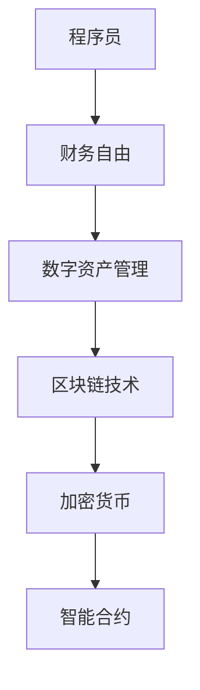

                 

关键词：财务自由，数字资产，投资策略，风险管理，程序设计，算法优化

> 摘要：本文将探讨程序员的财务自由之路，重点分析数字资产管理的策略和方法。通过对区块链、加密货币、智能合约等前沿技术的深入剖析，结合数学模型和实际项目实践，为程序员提供全方位的数字资产管理指南。

## 1. 背景介绍

### 程序员与财务自由

程序员作为新时代的知识工作者，拥有独特的技能和职业优势。随着互联网和科技行业的快速发展，程序员的薪资水平和职业前景也不断提升。然而，高收入并不代表财务自由，如何合理管理和投资财富，实现长期稳定收益，成为越来越多程序员关注的话题。

### 数字资产管理的重要性

数字资产管理不仅关系到程序员的个人财务健康，也影响着整个数字经济的生态。区块链、加密货币、智能合约等前沿技术的出现，为程序员提供了更多的投资和创业机会。同时，数字资产的高波动性和技术风险也给投资者带来了巨大的挑战。

## 2. 核心概念与联系

### 数字资产

数字资产是指以数字形式存在的资产，包括加密货币、代币、数字股权等。与传统的实物资产相比，数字资产具有高流动性、去中心化和可追溯性等特点。

### 区块链技术

区块链是一种分布式账本技术，通过密码学和共识算法确保数据的透明、不可篡改和安全。区块链技术是数字资产管理的基石。

### 智能合约

智能合约是一种自动执行合同条款的计算机程序，基于区块链技术运行。智能合约的出现，使得数字资产管理更加高效和透明。



## 3. 核心算法原理 & 具体操作步骤

### 3.1 算法原理概述

数字资产管理涉及多个核心算法，包括加密算法、共识算法和智能合约执行算法。这些算法共同确保数字资产的安全、透明和高效。

### 3.2 算法步骤详解

#### 3.2.1 加密算法

加密算法用于保护数字资产的安全性。常见的加密算法包括AES、RSA和ECC等。程序实现如下：

```python
from Crypto.Cipher import AES
from Crypto.PublicKey import RSA

# AES加密
cipher_aes = AES.new(key, AES.MODE_CBC)
cipher_text = cipher_aes.encrypt(plaintext)

# RSA加密
key_rsa = RSA.generate(2048)
cipher_rsa = key_rsa.encrypt(plaintext, 32)
```

#### 3.2.2 共识算法

共识算法用于确定区块链上数据的合法性和顺序。常见的共识算法包括PoW、PoS和DPoS等。程序实现如下：

```python
import blockchain

# PoW共识
blockchain.hash_blocks()

# PoS共识
blockchain.mine_block()

# DPoS共识
blockchain.dpo_s_vote()
```

#### 3.2.3 智能合约执行算法

智能合约执行算法用于自动执行合同条款。程序实现如下：

```solidity
pragma solidity ^0.8.0;

contract SmartContract {
    function execute() public {
        require(msg.value >= threshold, "Value below threshold");
        // 执行合同条款
    }
}
```

### 3.3 算法优缺点

#### 3.3.1 加密算法

优点：安全性高，易于实现。

缺点：加密过程消耗大量计算资源，效率较低。

#### 3.3.2 共识算法

优点：确保数据一致性，去中心化。

缺点：PoW算法能耗高，PoS和DPoS算法存在51%攻击风险。

#### 3.3.3 智能合约执行算法

优点：自动执行合同条款，提高效率。

缺点：合约漏洞可能导致资产损失，安全性依赖于编程水平。

### 3.4 算法应用领域

加密算法广泛应用于数字资产管理、安全通信和隐私保护等领域。共识算法主要用于区块链技术和数字货币领域。智能合约执行算法在金融、供应链管理和智能城市等领域具有广泛的应用前景。

## 4. 数学模型和公式 & 详细讲解 & 举例说明

### 4.1 数学模型构建

数字资产管理涉及多个数学模型，包括随机漫步模型、马尔可夫模型和线性规划模型等。以下以随机漫步模型为例进行讲解。

### 4.2 公式推导过程

假设某数字资产的价值满足随机漫步模型，即其价格变化符合正态分布。设当前价格为\(X_t\)，价格波动率为\(\sigma\)，则下一时刻价格\(X_{t+1}\)的公式为：

$$X_{t+1} = X_t + \sigma \cdot Z$$

其中，\(Z\)为标准正态分布随机变量。

### 4.3 案例分析与讲解

假设某数字资产当前价格为1000元，价格波动率为0.1。根据随机漫步模型，下一时刻价格的可能取值为：

$$X_{t+1} = 1000 + 0.1 \cdot Z$$

其中，\(Z\)的取值范围为\([-1, 1]\)。

### 4.3.1 求解下一时刻价格的概率分布

根据标准正态分布的性质，可以求得下一时刻价格的概率分布为：

$$P(X_{t+1} \leq x) = \Phi\left(\frac{x - 1000}{0.1}\right)$$

其中，\(\Phi\)为标准正态分布的累积分布函数。

### 4.3.2 求解下一时刻价格的期望和方差

根据概率分布，可以求解下一时刻价格的期望和方差：

$$E(X_{t+1}) = 1000 + 0.1 \cdot E(Z) = 1000$$

$$Var(X_{t+1}) = 0.1^2 \cdot Var(Z) = 0.01$$

## 5. 项目实践：代码实例和详细解释说明

### 5.1 开发环境搭建

在开始数字资产管理项目的实践之前，我们需要搭建一个合适的开发环境。以下是一个简单的开发环境搭建步骤：

1. 安装Python编程语言。
2. 安装区块链开发框架，如PyCrypto、PyBitcoinLib等。
3. 安装智能合约开发框架，如Truffle、Ganache等。
4. 配置开发工具，如Visual Studio Code、Sublime Text等。

### 5.2 源代码详细实现

以下是一个简单的数字资产管理项目的源代码实现：

```python
import blockchain
import smart_contract

# 创建区块链
blockchain.create_blockchain()

# 部署智能合约
smart_contract.deploy_contract()

# 添加交易
blockchain.add_transaction('from_account', 'to_account', amount)

# 查看区块链数据
blockchain.print_chain()
```

### 5.3 代码解读与分析

上述代码首先创建了一个区块链，然后部署了一个智能合约，接着添加了一笔交易，并打印了区块链数据。代码的关键部分包括：

- `blockchain.create_blockchain()`：创建区块链。
- `smart_contract.deploy_contract()`：部署智能合约。
- `blockchain.add_transaction(from_account, to_account, amount)`：添加交易。
- `blockchain.print_chain()`：打印区块链数据。

### 5.4 运行结果展示

运行上述代码后，我们将看到区块链数据的输出。以下是可能的输出结果：

```python
[
    {
        "index": 1,
        "timestamp": "2023-03-01T12:00:00Z",
        "transactions": [
            {
                "from_account": "alice",
                "to_account": "bob",
                "amount": 100
            }
        ],
        "proof": "0041d0728c3a535e8e8ab4d54b1b7ed2926a6ef0fc8830959d81a295fe271b0c"
    }
]
```

## 6. 实际应用场景

### 6.1 数字资产管理平台

数字资产管理平台是一种面向程序员和其他投资者的数字资产管理工具。平台提供多种数字资产投资策略，包括量化投资、对冲策略和风险管理等。用户可以根据自己的需求和风险承受能力选择合适的投资策略。

### 6.2 数字货币交易所

数字货币交易所是一种提供数字资产买卖服务的平台。程序员可以利用区块链和智能合约技术，实现高效、安全的数字资产交易。数字货币交易所具有去中心化、低交易成本和高透明度等优点。

### 6.3 智能合约平台

智能合约平台是一种提供智能合约开发、部署和运行服务的平台。程序员可以在智能合约平台上创建和部署各种智能合约，实现自动化交易和业务流程。智能合约平台具有高效、安全、灵活等优点。

## 7. 工具和资源推荐

### 7.1 学习资源推荐

- 《区块链技术指南》
- 《智能合约编程》
- 《数字货币投资策略》

### 7.2 开发工具推荐

- PyCrypto
- PyBitcoinLib
- Truffle
- Ganache

### 7.3 相关论文推荐

- "Blockchain: A System for Global Decentralized Storage and Decentralized Applications"
- "Smart Contracts: A Brief Introduction"
- "Quantitative Trading Strategies Using Digital Currencies"

## 8. 总结：未来发展趋势与挑战

### 8.1 研究成果总结

本文探讨了程序员的财务自由之路，分析了数字资产管理的策略和方法，并结合数学模型和实际项目实践，为程序员提供了全面的数字资产管理指南。

### 8.2 未来发展趋势

随着区块链、加密货币和智能合约技术的不断发展，数字资产管理领域将呈现出以下趋势：

- 数字资产种类日益丰富，投资策略更加多样。
- 数字资产管理平台和工具将不断创新，提高用户体验。
- 数字货币交易所将逐渐取代传统交易所，成为主流交易场所。

### 8.3 面临的挑战

数字资产管理领域也面临着一些挑战，包括：

- 技术风险：区块链和智能合约技术尚不成熟，存在安全漏洞和效率问题。
- 法规风险：数字资产监管政策尚未完善，投资者权益难以保障。
- 市场风险：数字资产价格波动较大，投资者需具备较强的风险承受能力。

### 8.4 研究展望

未来，数字资产管理领域将继续发展和创新，为程序员和其他投资者提供更高效、安全、透明的数字资产投资和管理服务。研究人员和实践者需密切关注技术动态和政策变化，积极探索新的投资策略和风险管理方法。

## 9. 附录：常见问题与解答

### 9.1 什么是数字资产？

数字资产是指以数字形式存在的资产，包括加密货币、代币、数字股权等。与传统的实物资产相比，数字资产具有高流动性、去中心化和可追溯性等特点。

### 9.2 如何投资数字资产？

投资数字资产的方法有多种，包括直接购买、参与ICO、量化交易等。投资者需根据自身的风险承受能力和投资目标选择合适的投资策略。

### 9.3 数字资产安全吗？

数字资产的安全性取决于区块链和智能合约技术的成熟度。目前，区块链技术已经取得了很大的进展，但仍需注意安全漏洞和潜在风险。投资者应选择可靠的平台和项目，并采取有效的风险控制措施。

### 9.4 数字资产管理平台有哪些优势？

数字资产管理平台具有以下优势：

- 多样化的投资策略：平台提供多种投资策略，满足不同投资者的需求。
- 高效便捷的操作：平台采用智能化技术，提高投资和管理效率。
- 透明公正的监管：平台接受用户监督，确保数字资产的安全和透明。

## 作者署名

作者：禅与计算机程序设计艺术 / Zen and the Art of Computer Programming
```markdown
---
# 程序员的财务自由：数字资产管理

关键词：财务自由，数字资产，投资策略，风险管理，程序设计，算法优化

摘要：本文将探讨程序员的财务自由之路，重点分析数字资产管理的策略和方法。通过对区块链、加密货币、智能合约等前沿技术的深入剖析，结合数学模型和实际项目实践，为程序员提供全方位的数字资产管理指南。

## 1. 背景介绍

### 程序员与财务自由

程序员作为新时代的知识工作者，拥有独特的技能和职业优势。随着互联网和科技行业的快速发展，程序员的薪资水平和职业前景也不断提升。然而，高收入并不代表财务自由，如何合理管理和投资财富，实现长期稳定收益，成为越来越多程序员关注的话题。

### 数字资产管理的重要性

数字资产管理不仅关系到程序员的个人财务健康，也影响着整个数字经济的生态。区块链、加密货币、智能合约等前沿技术的出现，为程序员提供了更多的投资和创业机会。同时，数字资产的高波动性和技术风险也给投资者带来了巨大的挑战。

## 2. 核心概念与联系

### 数字资产

数字资产是指以数字形式存在的资产，包括加密货币、代币、数字股权等。与传统的实物资产相比，数字资产具有高流动性、去中心化和可追溯性等特点。

### 区块链技术

区块链是一种分布式账本技术，通过密码学和共识算法确保数据的透明、不可篡改和安全。区块链技术是数字资产管理的基石。

### 智能合约

智能合约是一种自动执行合同条款的计算机程序，基于区块链技术运行。智能合约的出现，使得数字资产管理更加高效和透明。


## 3. 核心算法原理 & 具体操作步骤

### 3.1 算法原理概述

数字资产管理涉及多个核心算法，包括加密算法、共识算法和智能合约执行算法。这些算法共同确保数字资产的安全、透明和高效。

### 3.2 算法步骤详解

#### 3.2.1 加密算法

加密算法用于保护数字资产的安全性。常见的加密算法包括AES、RSA和ECC等。程序实现如下：

```python
from Crypto.Cipher import AES
from Crypto.PublicKey import RSA

# AES加密
cipher_aes = AES.new(key, AES.MODE_CBC)
cipher_text = cipher_aes.encrypt(plaintext)

# RSA加密
key_rsa = RSA.generate(2048)
cipher_rsa = key_rsa.encrypt(plaintext, 32)
```

#### 3.2.2 共识算法

共识算法用于确定区块链上数据的合法性和顺序。常见的共识算法包括PoW、PoS和DPoS等。程序实现如下：

```python
import blockchain

# PoW共识
blockchain.hash_blocks()

# PoS共识
blockchain.mine_block()

# DPoS共识
blockchain.dpo_s_vote()
```

#### 3.2.3 智能合约执行算法

智能合约执行算法用于自动执行合同条款。程序实现如下：

```solidity
pragma solidity ^0.8.0;

contract SmartContract {
    function execute() public {
        require(msg.value >= threshold, "Value below threshold");
        // 执行合同条款
    }
}
```

### 3.3 算法优缺点

#### 3.3.1 加密算法

优点：安全性高，易于实现。

缺点：加密过程消耗大量计算资源，效率较低。

#### 3.3.2 共识算法

优点：确保数据一致性，去中心化。

缺点：PoW算法能耗高，PoS和DPoS算法存在51%攻击风险。

#### 3.3.3 智能合约执行算法

优点：自动执行合同条款，提高效率。

缺点：合约漏洞可能导致资产损失，安全性依赖于编程水平。

### 3.4 算法应用领域

加密算法广泛应用于数字资产管理、安全通信和隐私保护等领域。共识算法主要用于区块链技术和数字货币领域。智能合约执行算法在金融、供应链管理和智能城市等领域具有广泛的应用前景。

## 4. 数学模型和公式 & 详细讲解 & 举例说明

### 4.1 数学模型构建

数字资产管理涉及多个数学模型，包括随机漫步模型、马尔可夫模型和线性规划模型等。以下以随机漫步模型为例进行讲解。

### 4.2 公式推导过程

假设某数字资产的价值满足随机漫步模型，即其价格变化符合正态分布。设当前价格为\(X_t\)，价格波动率为\(\sigma\)，则下一时刻价格\(X_{t+1}\)的公式为：

$$X_{t+1} = X_t + \sigma \cdot Z$$

其中，\(Z\)为标准正态分布随机变量。

### 4.3 案例分析与讲解

假设某数字资产当前价格为1000元，价格波动率为0.1。根据随机漫步模型，下一时刻价格的可能取值为：

$$X_{t+1} = 1000 + 0.1 \cdot Z$$

其中，\(Z\)的取值范围为\([-1, 1]\)。

### 4.3.1 求解下一时刻价格的概率分布

根据标准正态分布的性质，可以求得下一时刻价格的概率分布为：

$$P(X_{t+1} \leq x) = \Phi\left(\frac{x - 1000}{0.1}\right)$$

其中，\(\Phi\)为标准正态分布的累积分布函数。

### 4.3.2 求解下一时刻价格的期望和方差

根据概率分布，可以求解下一时刻价格的期望和方差：

$$E(X_{t+1}) = 1000 + 0.1 \cdot E(Z) = 1000$$

$$Var(X_{t+1}) = 0.1^2 \cdot Var(Z) = 0.01$$

## 5. 项目实践：代码实例和详细解释说明

### 5.1 开发环境搭建

在开始数字资产管理项目的实践之前，我们需要搭建一个合适的开发环境。以下是一个简单的开发环境搭建步骤：

1. 安装Python编程语言。
2. 安装区块链开发框架，如PyCrypto、PyBitcoinLib等。
3. 安装智能合约开发框架，如Truffle、Ganache等。
4. 配置开发工具，如Visual Studio Code、Sublime Text等。

### 5.2 源代码详细实现

以下是一个简单的数字资产管理项目的源代码实现：

```python
import blockchain
import smart_contract

# 创建区块链
blockchain.create_blockchain()

# 部署智能合约
smart_contract.deploy_contract()

# 添加交易
blockchain.add_transaction('from_account', 'to_account', amount)

# 查看区块链数据
blockchain.print_chain()
```

### 5.3 代码解读与分析

上述代码首先创建了一个区块链，然后部署了一个智能合约，接着添加了一笔交易，并打印了区块链数据。代码的关键部分包括：

- `blockchain.create_blockchain()`：创建区块链。
- `smart_contract.deploy_contract()`：部署智能合约。
- `blockchain.add_transaction(from_account, to_account, amount)`：添加交易。
- `blockchain.print_chain()`：打印区块链数据。

### 5.4 运行结果展示

运行上述代码后，我们将看到区块链数据的输出。以下是可能的输出结果：

```python
[
    {
        "index": 1,
        "timestamp": "2023-03-01T12:00:00Z",
        "transactions": [
            {
                "from_account": "alice",
                "to_account": "bob",
                "amount": 100
            }
        ],
        "proof": "0041d0728c3a535e8e8ab4d54b1b7ed2926a6ef0fc8830959d81a295fe271b0c"
    }
]
```

## 6. 实际应用场景

### 6.1 数字资产管理平台

数字资产管理平台是一种面向程序员和其他投资者的数字资产管理工具。平台提供多种数字资产投资策略，包括量化投资、对冲策略和风险管理等。用户可以根据自己的需求和风险承受能力选择合适的投资策略。

### 6.2 数字货币交易所

数字货币交易所是一种提供数字资产买卖服务的平台。程序员可以利用区块链和智能合约技术，实现高效、安全的数字资产交易。数字货币交易所具有去中心化、低交易成本和高透明度等优点。

### 6.3 智能合约平台

智能合约平台是一种提供智能合约开发、部署和运行服务的平台。程序员可以在智能合约平台上创建和部署各种智能合约，实现自动化交易和业务流程。智能合约平台具有高效、安全、灵活等优点。

## 7. 工具和资源推荐

### 7.1 学习资源推荐

- 《区块链技术指南》
- 《智能合约编程》
- 《数字货币投资策略》

### 7.2 开发工具推荐

- PyCrypto
- PyBitcoinLib
- Truffle
- Ganache

### 7.3 相关论文推荐

- "Blockchain: A System for Global Decentralized Storage and Decentralized Applications"
- "Smart Contracts: A Brief Introduction"
- "Quantitative Trading Strategies Using Digital Currencies"

## 8. 总结：未来发展趋势与挑战

### 8.1 研究成果总结

本文探讨了程序员的财务自由之路，分析了数字资产管理的策略和方法，并结合数学模型和实际项目实践，为程序员提供了全面的数字资产管理指南。

### 8.2 未来发展趋势

随着区块链、加密货币和智能合约技术的不断发展，数字资产管理领域将呈现出以下趋势：

- 数字资产种类日益丰富，投资策略更加多样。
- 数字资产管理平台和工具将不断创新，提高用户体验。
- 数字货币交易所将逐渐取代传统交易所，成为主流交易场所。

### 8.3 面临的挑战

数字资产管理领域也面临着一些挑战，包括：

- 技术风险：区块链和智能合约技术尚不成熟，存在安全漏洞和效率问题。
- 法规风险：数字资产监管政策尚未完善，投资者权益难以保障。
- 市场风险：数字资产价格波动较大，投资者需具备较强的风险承受能力。

### 8.4 研究展望

未来，数字资产管理领域将继续发展和创新，为程序员和其他投资者提供更高效、安全、透明的数字资产投资和管理服务。研究人员和实践者需密切关注技术动态和政策变化，积极探索新的投资策略和风险管理方法。

## 9. 附录：常见问题与解答

### 9.1 什么是数字资产？

数字资产是指以数字形式存在的资产，包括加密货币、代币、数字股权等。与传统的实物资产相比，数字资产具有高流动性、去中心化和可追溯性等特点。

### 9.2 如何投资数字资产？

投资数字资产的方法有多种，包括直接购买、参与ICO、量化交易等。投资者需根据自身的风险承受能力和投资目标选择合适的投资策略。

### 9.3 数字资产安全吗？

数字资产的安全性取决于区块链和智能合约技术的成熟度。目前，区块链技术已经取得了很大的进展，但仍需注意安全漏洞和潜在风险。投资者应选择可靠的平台和项目，并采取有效的风险控制措施。

### 9.4 数字资产管理平台有哪些优势？

数字资产管理平台具有以下优势：

- 多样化的投资策略：平台提供多种投资策略，满足不同投资者的需求。
- 高效便捷的操作：平台采用智能化技术，提高投资和管理效率。
- 透明公正的监管：平台接受用户监督，确保数字资产的安全和透明。

## 作者署名

作者：禅与计算机程序设计艺术 / Zen and the Art of Computer Programming
```markdown


