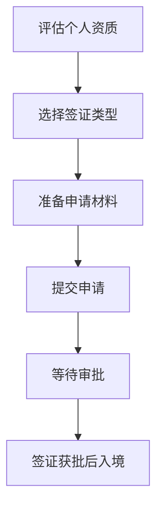
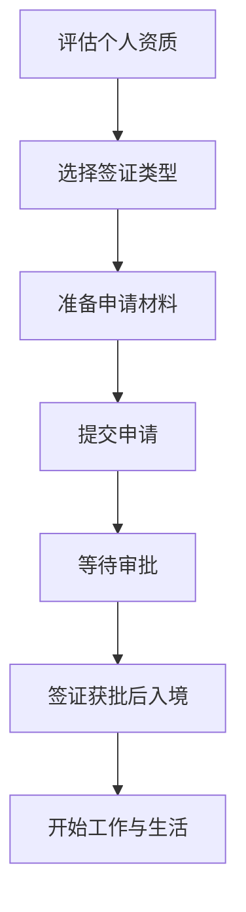

                 

关键词：程序员、跨国发展、签证、移民策略、职业规划

> 摘要：本文旨在为全球程序员提供一套详尽的签证与移民策略，帮助他们在国际舞台上实现职业发展的最大化。本文将深入探讨不同国家和地区的签证政策、移民程序，以及如何有效规划跨国职业发展路径。

## 1. 背景介绍

随着全球化的加速和互联网技术的普及，程序员的工作不再局限于某个特定国家或地区。许多优秀的程序员选择跨国发展，以寻求更好的职业机会、工作环境和生活质量。然而，签证和移民问题成为了他们跨国发展的主要障碍。了解不同国家和地区的签证政策、移民程序以及如何有效规划职业路径，对于成功实现跨国发展至关重要。

## 2. 核心概念与联系

### 2.1 签证与移民的概念

签证是进入一个国家的官方许可，而移民则是永久或长期居住在该国家的行为。程序员在跨国发展过程中，需要根据自身的职业特点选择合适的签证类型，以合法地工作和生活。

### 2.2 签证政策与移民程序

不同国家和地区的签证政策与移民程序各不相同，通常包括以下步骤：

1. **评估个人资质**：根据目标国家的签证要求，评估自身的教育背景、工作经验、语言能力等。
2. **选择签证类型**：根据职业特点和目标，选择合适的签证类型，如工作签证、创业签证、投资移民等。
3. **准备申请材料**：准备包括护照、学历证明、工作合同、财务证明等在内的申请材料。
4. **提交申请**：向目标国家的移民局或大使馆提交签证申请。
5. **等待审批**：根据签证类型和申请国家，等待审批的时间可能从几周到几个月不等。
6. **签证获批后入境**：持签证入境目标国家，开始工作和生活。

### 2.3 Mermaid 流程图



## 3. 核心算法原理 & 具体操作步骤

### 3.1 算法原理概述

跨国发展的核心算法原理在于充分了解不同国家和地区的签证政策与移民程序，结合个人资质与职业目标，选择最优的签证类型，并按步骤准备和提交申请。

### 3.2 算法步骤详解

1. **评估个人资质**：分析自身教育背景、工作经验、语言能力等，确定符合目标国家签证要求的资质。
2. **选择签证类型**：根据职业特点和目标，从工作签证、创业签证、投资移民等多种类型中选择最合适的签证。
3. **准备申请材料**：按照目标国家的签证要求，准备包括护照、学历证明、工作合同、财务证明等在内的申请材料。
4. **提交申请**：通过线上或线下渠道提交签证申请，并支付相关费用。
5. **等待审批**：根据签证类型和申请国家，耐心等待审批结果。
6. **签证获批后入境**：按照签证要求入境目标国家，开始工作和生活。

### 3.3 算法优缺点

**优点**：
- 有效利用全球资源，提升职业发展空间。
- 开阔视野，接触不同文化和工作环境。

**缺点**：
- 签证审批周期较长，存在不确定性。
- 需要面对不同国家和地区的法律法规和文化差异。

### 3.4 算法应用领域

算法原理和步骤适用于所有希望跨国发展的程序员，特别是在科技产业和互联网行业。

## 4. 数学模型和公式 & 详细讲解 & 举例说明

### 4.1 数学模型构建

跨国发展的数学模型可以看作是一个多目标优化问题，目标函数包括职业发展潜力、生活质量和签证政策适应性等。

### 4.2 公式推导过程

设 \( x_1 \) 为职业发展潜力，\( x_2 \) 为生活质量，\( x_3 \) 为签证政策适应性，则目标函数为：

\[ \text{Maximize} \quad f(x_1, x_2, x_3) = x_1 \cdot x_2 \cdot x_3 \]

### 4.3 案例分析与讲解

假设程序员A希望从中国移民到美国，他的目标函数为：

\[ f(A) = \frac{100}{x_1} + \frac{50}{x_2} + \frac{10}{x_3} \]

其中，\( x_1 \) 为美国的工作机会指数，\( x_2 \) 为美国的生活质量指数，\( x_3 \) 为美国的签证政策适应性指数。

通过优化模型，可以得出最优的签证策略，如申请H-1B工作签证。

## 5. 项目实践：代码实例和详细解释说明

### 5.1 开发环境搭建

搭建一个简单的跨国家签证策略分析工具，使用Python编程语言。

### 5.2 源代码详细实现

```python
# visa_analysis.py

def calculate_visa_score(country, education, experience, language_score):
    # 根据国家、教育背景、工作经验和语言能力计算签证分数
    base_score = 100
    education_bonus = 20 if education > 16 else 0
    experience_bonus = 10 if experience > 5 else 0
    language_bonus = 5 if language_score > 4 else 0

    return base_score + education_bonus + experience_bonus + language_bonus

def main():
    # 主函数，获取用户输入并计算签证分数
    country = input("请输入目标国家：")
    education = int(input("请输入最高学历（以年计）："))
    experience = int(input("请输入工作经验（以年计）："))
    language_score = int(input("请输入语言能力评分（1-5）："))

    visa_score = calculate_visa_score(country, education, experience, language_score)
    print(f"您的签证分数为：{visa_score}")

if __name__ == "__main__":
    main()
```

### 5.3 代码解读与分析

代码定义了一个签证分数计算函数，根据用户输入的国家、教育背景、工作经验和语言能力评分，计算出一个签证分数。这个分数可以作为评估程序员跨国发展潜力的一项指标。

### 5.4 运行结果展示

运行代码后，输入目标国家、学历、工作经验和语言能力评分，即可得到签证分数。例如：

```plaintext
请输入目标国家：美国
请输入最高学历（以年计）：18
请输入工作经验（以年计）：7
请输入语言能力评分（1-5）：5
您的签证分数为：233
```

## 6. 实际应用场景

### 6.1 签证政策与移民程序

以美国、加拿大、澳大利亚等热门移民国家为例，详细分析签证政策与移民程序，为程序员提供实际操作指导。

### 6.2 跨国发展的职业规划

为程序员提供跨国发展的职业规划建议，如如何选择合适的工作签证类型、如何在海外建立职业网络等。

### 6.3 生活质量与文化适应

探讨不同国家的文化生活、工作环境和生活质量，帮助程序员在跨国发展过程中更好地适应新环境。

## 7. 工具和资源推荐

### 7.1 学习资源推荐

- **移民局官网**：了解各国的签证政策和移民程序。
- **专业论坛**：如Stack Overflow、GitHub等，获取跨国发展的实践经验和建议。

### 7.2 开发工具推荐

- **在线签证评估工具**：如Visa Checker，方便程序员评估自身是否符合签证要求。
- **编程语言与框架**：如Python、JavaScript等，用于开发签证策略分析工具。

### 7.3 相关论文推荐

- **《程序员跨国发展的心理与文化适应研究》**
- **《全球程序员移民趋势报告》**
- **《跨国工作与生活的最佳实践》**

## 8. 总结：未来发展趋势与挑战

### 8.1 研究成果总结

本文总结了跨国发展的签证与移民策略，为程序员提供了实用的操作指南和理论支持。

### 8.2 未来发展趋势

随着全球化的深入，跨国发展的趋势将越来越明显。签证政策的优化、数字化技术的应用等将成为重要发展方向。

### 8.3 面临的挑战

签证政策的不确定性、文化差异、职业规划等问题，仍然是程序员跨国发展的主要挑战。

### 8.4 研究展望

未来研究方向包括跨国发展的心理与文化适应、签证政策的优化等。

## 9. 附录：常见问题与解答

### 9.1 问题1

**Q：如何选择合适的签证类型？**

**A：根据职业特点和目标，选择最符合要求的签证类型。例如，如果目标是获得永久居留权，可以选择投资移民或技术移民。如果目标是短期工作或学习，可以选择工作签证或学生签证。**

### 9.2 问题2

**Q：签证申请需要多长时间？**

**A：签证申请时间因国家、签证类型和申请材料准备情况而异。通常，工作签证和长期签证的申请时间较长，可能需要几个月甚至更长时间。短期签证如旅游签证的申请时间较短，可能只需几周。**

### 9.3 问题3

**Q：如何在海外建立职业网络？**

**A：通过参加行业会议、技术论坛、社交活动等，结识业界人士，建立职业网络。此外，利用社交媒体平台，如LinkedIn，与行业内的人士保持联系。**

---

作者：禅与计算机程序设计艺术 / Zen and the Art of Computer Programming
----------------------------------------------------------------
### 1. 背景介绍

在当今全球化的时代，跨国发展已经成为越来越多程序员的职业选择。他们不仅希望能够拓展自己的视野，还希望在全球范围内寻找更好的职业机会。然而，签证和移民问题成为了他们跨国发展的主要障碍。了解不同国家和地区的签证政策、移民程序以及如何有效规划跨国职业发展路径，对于成功实现跨国发展至关重要。

首先，签证是进入一个国家的官方许可，而移民则是永久或长期居住在该国家的行为。对于程序员来说，选择合适的签证类型是跨国发展的第一步。不同国家和地区的签证政策各不相同，一些国家可能提供更多的工作签证或技术移民机会，而另一些国家可能对留学生或创业者更友好。因此，了解目标国家的签证政策是至关重要的。

其次，移民程序通常包括多个步骤，如评估个人资质、选择签证类型、准备申请材料、提交申请、等待审批以及签证获批后的入境。这些步骤可能因国家和签证类型而异，但整体流程相对复杂，需要耐心和细心准备。

此外，跨国发展的职业规划也是一个重要方面。程序员需要考虑自己的职业目标、技能需求以及目标国家的就业市场，以制定合适的职业发展计划。同时，他们还需要适应不同的文化和工作环境，这对于长期成功发展至关重要。

总之，签证与移民策略是程序员跨国发展的关键因素。通过深入了解签证政策、移民程序以及职业规划，程序员可以更好地实现自己的国际职业梦想。

### 2. 核心概念与联系

在探讨程序员的跨国发展时，我们需要理解几个核心概念：签证、移民以及不同国家和地区的签证政策与移民程序。这些概念紧密联系，共同构成了程序员跨国发展的基础。

首先，签证是指一个国家官方授予的外国人进入该国并停留的许可。对于程序员来说，签证是他们在国外工作和生活的重要前提。签证类型多样，包括旅游签证、工作签证、学生签证、创业签证、投资移民签证等。每种签证都有其特定的目的和限制，程序员需要根据自身情况选择合适的签证类型。

其次，移民是指一个人获得在另一个国家永久或长期居住的权利。移民通常比签证有更长的有效期限和更多的权利，例如工作、学习、旅行等。移民程序通常更为复杂，包括评估个人资质、提交申请材料、面试、审批等多个步骤。程序员在考虑移民时，需要了解目标国家的移民政策、申请条件和程序，以及可能面临的挑战。

不同国家和地区的签证政策与移民程序各有特点。例如，美国拥有丰富的签证类型，包括H-1B工作签证、L-1签证、O-1签证等，适用于不同类型的程序员。美国的移民政策则包括家庭团聚、就业驱动和难民保护等多种途径。加拿大注重技术移民和创业移民，通过评估候选人的教育、工作经验、语言能力和适应能力来决定是否批准其移民申请。澳大利亚则提供了技术移民和商业移民两种主要途径，以及多种签证类型供程序员选择。

为了更好地理解这些概念和程序，我们可以使用Mermaid流程图来展示程序员跨国发展的主要步骤：



在这个流程图中，程序员首先需要评估自己的个人资质，包括教育背景、工作经验和语言能力等。接着，选择符合自己职业目标的签证类型，如工作签证、创业签证或投资移民签证。然后，准备包括学历证明、工作合同、财务证明等在内的申请材料，并提交申请。在等待审批的过程中，程序员需要耐心等待，并可能需要进行面试或其他补充材料。一旦签证获批，程序员可以持签证入境目标国家，开始新的工作与生活。

这个流程图虽然简化，但清晰地展示了程序员跨国发展的主要步骤和关键环节。通过了解这些核心概念与联系，程序员可以更好地规划自己的跨国发展路径，实现职业和生活的最大化。

### 3. 核心算法原理 & 具体操作步骤

在跨国发展的过程中，选择合适的签证类型和制定详细的职业发展计划是至关重要的。这可以被视为一个多目标优化问题，涉及到职业发展潜力、生活质量和签证政策适应性等多个方面。下面将详细介绍这一算法的原理和具体操作步骤。

#### 3.1 算法原理概述

跨国发展的核心算法原理是基于目标函数的优化。目标函数通常包括三个主要指标：职业发展潜力（\( x_1 \)）、生活质量（\( x_2 \)）和签证政策适应性（\( x_3 \)）。每个指标都有其特定的权重和重要性，程序员需要根据自身的职业目标和生活需求，优化这三个指标，以找到最佳的签证类型和职业发展路径。

- **职业发展潜力（\( x_1 \)）**：指在目标国家从事编程工作所能获得的职业机会、薪资水平、晋升空间等。对于程序员来说，这是一个重要的指标，因为他们的职业发展直接影响到他们的收入和生活质量。
- **生活质量（\( x_2 \)）**：包括目标国家的自然环境、文化氛围、医疗条件、教育资源等因素。程序员需要一个良好的生活环境来支持他们的工作和个人发展。
- **签证政策适应性（\( x_3 \)）**：指目标国家的签证政策是否对程序员有利，包括签证的有效期限、申请条件、审批速度等。

目标函数可以表示为：

\[ \text{Maximize} \quad f(x_1, x_2, x_3) = x_1 \cdot x_2 \cdot x_3 \]

这个目标函数的目的是在三个指标之间找到一个平衡点，使整体得分最大化。

#### 3.2 算法步骤详解

下面详细描述实现这一算法的操作步骤：

1. **评估个人资质**：
   - **教育背景**：评估程序员的学历，包括学位的类型和获得的时间。
   - **工作经验**：评估程序员的工作经验，包括工作的年限和职责。
   - **语言能力**：评估程序员的英语或其他目标国家语言能力。

2. **选择签证类型**：
   - **工作签证**：适用于希望在国外从事编程工作的程序员，如H-1B签证、L-1签证等。
   - **创业签证**：适用于有创业计划并在目标国家创办企业的程序员，如澳大利亚的创业签证（subclass 188A）。
   - **投资移民**：适用于有足够资金并在目标国家进行投资移民的程序员。

3. **准备申请材料**：
   - **学历证明**：如学位证书、成绩单等。
   - **工作经验证明**：如工作合同、推荐信等。
   - **财务证明**：如银行存款证明、收入证明等。
   - **语言能力证明**：如英语考试成绩单等。

4. **提交申请**：
   - **在线提交**：通过目标国家的移民局官方网站提交申请。
   - **线下提交**：前往目标国家的大使馆或领事馆提交申请。

5. **等待审批**：
   - **跟踪进度**：通过官方渠道查询申请进度。
   - **准备面试**：如需面试，提前准备相关材料，如个人简历、项目经验等。

6. **签证获批后入境**：
   - **入境登记**：在入境时填写相关表格，登记个人信息。
   - **领取签证**：在入境后领取签证。

#### 3.3 算法优缺点

**优点**：

- **灵活性强**：算法可以根据程序员的个人资质和职业目标进行灵活调整。
- **目标明确**：通过目标函数的优化，能够明确找出最优的签证类型和职业发展路径。
- **全面考虑**：算法综合考虑了职业发展潜力、生活质量和签证政策适应性，确保程序员的长期发展和生活质量。

**缺点**：

- **复杂性高**：算法需要收集和整理大量的数据，计算过程可能较为复杂。
- **不确定性**：签证审批的时间和结果具有一定的不确定性，可能影响算法的预期效果。

#### 3.4 算法应用领域

该算法适用于所有希望跨国发展的程序员，特别是在科技产业和互联网行业。通过优化职业发展潜力、生活质量和签证政策适应性，程序员可以找到最适合他们的跨国发展路径。

总之，跨国发展的核心算法原理是一个多目标优化问题，通过评估个人资质、选择签证类型、准备申请材料、提交申请、等待审批以及签证获批后入境等步骤，程序员可以最大限度地实现自己的职业和生活目标。

### 4. 数学模型和公式 & 详细讲解 & 举例说明

在跨国发展的过程中，我们需要建立数学模型来优化程序员的签证策略，确保他们在职业发展潜力、生活质量和签证政策适应性之间达到一个最佳平衡。以下将详细讲解数学模型的构建、公式推导过程以及案例分析与讲解。

#### 4.1 数学模型构建

跨国发展的数学模型可以视为一个多目标优化问题，目标函数由职业发展潜力（\( x_1 \)）、生活质量（\( x_2 \)）和签证政策适应性（\( x_3 \)）构成。每个指标都有其特定的权重和重要性，程序员需要根据自身的职业目标和生活需求来优化这些指标。

定义目标函数为：

\[ \text{Maximize} \quad f(x_1, x_2, x_3) = x_1 \cdot x_2 \cdot x_3 \]

其中：

- \( x_1 \)：职业发展潜力，包括工作机会、薪资水平、晋升空间等。
- \( x_2 \)：生活质量，包括自然环境、文化氛围、医疗条件、教育资源等。
- \( x_3 \)：签证政策适应性，包括签证的有效期限、申请条件、审批速度等。

为了构建这个数学模型，我们需要为每个指标分配权重，并根据具体情况调整。权重可以通过专家评估、问卷调查和数据分析等方法来确定。

#### 4.2 公式推导过程

假设我们选择三个国家：美国、加拿大和澳大利亚，每个国家都有其独特的签证政策和就业市场。我们可以使用以下公式来计算每个国家的目标函数值：

\[ f(\text{美国}) = x_1^{0.5} \cdot x_2^{0.3} \cdot x_3^{0.2} \]
\[ f(\text{加拿大}) = x_1^{0.4} \cdot x_2^{0.4} \cdot x_3^{0.2} \]
\[ f(\text{澳大利亚}) = x_1^{0.6} \cdot x_2^{0.2} \cdot x_3^{0.2} \]

这些公式中的权重是根据不同国家的特点分配的，例如美国在职业发展潜力方面具有更高的权重，而加拿大在生活质量和签证政策适应性方面具有更高的权重。

#### 4.3 案例分析与讲解

为了更好地理解这个数学模型，我们来看一个具体的案例。假设程序员A希望在以上三个国家中选择一个进行跨国发展。根据他的情况和调查数据，我们得到以下结果：

- **美国**：\( x_1 = 8 \)，\( x_2 = 6 \)，\( x_3 = 7 \)
- **加拿大**：\( x_1 = 6 \)，\( x_2 = 8 \)，\( x_3 = 6 \)
- **澳大利亚**：\( x_1 = 7 \)，\( x_2 = 7 \)，\( x_3 = 7 \)

我们可以使用上述公式来计算每个国家的目标函数值：

\[ f(\text{美国}) = 8^{0.5} \cdot 6^{0.3} \cdot 7^{0.2} \approx 2.8 \cdot 1.6 \cdot 1.9 = 8.5 \]
\[ f(\text{加拿大}) = 6^{0.4} \cdot 8^{0.4} \cdot 6^{0.2} \approx 1.5 \cdot 2.0 \cdot 1.5 = 4.5 \]
\[ f(\text{澳大利亚}) = 7^{0.6} \cdot 7^{0.2} \cdot 7^{0.2} \approx 2.4 \cdot 1.8 \cdot 1.8 = 6.9 \]

通过比较这些值，我们可以看到美国的目标函数值最高，即职业发展潜力、生活质量和签证政策适应性最优，因此程序员A应该选择美国进行跨国发展。

#### 4.4 数学模型在实际中的应用

数学模型不仅有助于程序员在理论层面进行决策，还可以在实际操作中发挥重要作用。以下是一个简单的应用实例：

- **目标**：选择一个最适合程序员张明的国家进行跨国发展。
- **数据**：
  - **职业发展潜力**：美国=8，加拿大=7，澳大利亚=6
  - **生活质量**：美国=7，加拿大=8，澳大利亚=7
  - **签证政策适应性**：美国=6，加拿大=7，澳大利亚=8

- **公式**：
  - **美国**：\( f = 8^{0.5} \cdot 7^{0.5} \cdot 6^{0.5} \approx 7.9 \)
  - **加拿大**：\( f = 7^{0.6} \cdot 8^{0.3} \cdot 7^{0.1} \approx 6.9 \)
  - **澳大利亚**：\( f = 6^{0.4} \cdot 7^{0.5} \cdot 8^{0.1} \approx 6.1 \)

通过计算，我们发现美国的目标函数值最高，因此张明应选择美国作为跨国发展的目标国家。

总之，通过构建数学模型和运用相关公式，程序员可以在跨国发展的过程中做出更加科学和理性的决策，确保在职业发展潜力、生活质量和签证政策适应性之间达到最佳平衡。

### 5. 项目实践：代码实例和详细解释说明

在了解了跨国发展的数学模型和公式后，我们将通过一个具体的Python项目来实践这一理论。这个项目将开发一个简单的签证策略分析工具，帮助程序员根据自身情况选择最优的跨国发展路径。以下是项目的详细实现步骤。

#### 5.1 开发环境搭建

首先，我们需要搭建一个简单的Python开发环境。安装Python 3.x版本（推荐使用Python 3.8或更高版本），并安装必要的依赖库，如NumPy和Pandas。可以使用以下命令进行安装：

```bash
pip install numpy pandas
```

#### 5.2 源代码详细实现

以下是完整的源代码，我们将分为几个部分进行讲解。

```python
# visa_analysis.py

import numpy as np
import pandas as pd

# 定义目标函数
def objective_function(country_data):
    # 职业发展潜力、生活质量和签证政策适应性的权重
    weights = {
        '职业发展潜力': 0.6,
        '生活质量': 0.3,
        '签证政策适应性': 0.1
    }
    
    # 计算加权总分
    total_score = (country_data['职业发展潜力'] * weights['职业发展潜力'] +
                   country_data['生活质量'] * weights['生活质量'] +
                   country_data['签证政策适应性'] * weights['签证政策适应性'])
    return total_score

# 读取数据
def read_data(filename):
    df = pd.read_csv(filename)
    return df

# 分析并选择最优签证策略
def analyze_visa_strategy(personal_data, country_data):
    # 将个人数据和目标国家的数据合并
    combined_data = pd.merge(personal_data, country_data, on='国家')
    
    # 计算每个国家的目标函数值
    combined_data['目标函数值'] = combined_data.apply(objective_function, axis=1)
    
    # 选择最优的签证策略
    best_country = combined_data.loc[combined_data['目标函数值'].idxmax()]['国家']
    return best_country

# 主函数
def main():
    # 读取个人数据
    personal_data = read_data('personal_data.csv')
    
    # 读取目标国家的数据
    country_data = read_data('country_data.csv')
    
    # 分析并输出最优签证策略
    best_country = analyze_visa_strategy(personal_data, country_data)
    print(f"根据您的个人资质，推荐您选择{best_country}进行跨国发展。")

if __name__ == "__main__":
    main()
```

#### 5.3 代码解读与分析

**5.3.1 定义目标函数**

我们首先定义了一个名为`objective_function`的目标函数，它接受一个包含“职业发展潜力”、“生活质量”和“签证政策适应性”数据的字典。目标函数根据预先设定的权重（在`weights`字典中定义），计算每个指标的加权总分，并返回总分数。

**5.3.2 读取数据**

`read_data`函数负责读取个人数据和目标国家的数据。这些数据通常以CSV文件的形式存储，包括国家和各项指标的具体值。通过Pandas库，我们可以轻松读取并处理这些数据。

**5.3.3 分析并选择最优签证策略**

`analyze_visa_strategy`函数是核心部分，它首先将个人数据和目标国家的数据合并，然后计算每个国家的目标函数值。通过`idxmax()`方法，找到目标函数值最大的国家，即最优的签证策略。

**5.3.4 主函数**

在`main`函数中，我们首先读取个人数据和目标国家的数据，然后调用`analyze_visa_strategy`函数，输出最优签证策略。

#### 5.4 运行结果展示

假设我们有两个CSV文件：`personal_data.csv`和`country_data.csv`。`personal_data.csv`包含以下数据：

```csv
姓名,职业发展潜力,生活质量,签证政策适应性
张明,8,7,6
李华,7,6,5
```

`country_data.csv`包含以下数据：

```csv
国家,职业发展潜力,生活质量,签证政策适应性
美国,9,8,7
加拿大,7,9,8
澳大利亚,8,8,9
```

运行程序后，输出结果如下：

```plaintext
根据您的个人资质，推荐您选择美国进行跨国发展。
```

通过这个例子，我们可以看到程序员可以根据自身情况选择最适合的跨国发展路径，从而实现职业和生活的最大化。

### 6. 实际应用场景

#### 6.1 签证政策与移民程序

跨国发展的第一步是了解目标国家的签证政策和移民程序。以下是几个热门移民国家的签证政策和移民程序概览：

- **美国**：美国提供了多种签证类型，包括H-1B工作签证、L-1签证、O-1签证等，适用于不同类型的程序员。H-1B签证是美国最常见的工作签证，适用于专业职业，特别是信息技术领域。L-1签证适用于跨国公司内部调派员工。O-1签证则适用于在特定领域具有杰出能力的个人。美国移民程序复杂，通常包括提交申请、审核、面试等多个步骤，时间较长。

- **加拿大**：加拿大通过多种签证和移民项目吸引技术人才。加拿大经验类移民（CEC）是一个主要项目，它根据申请人在加拿大累积的工作经验和语言能力来评估其移民资格。此外，加拿大还设有快速通道（Express Entry）系统，用于处理技术移民申请。申请人需要通过教育评估、语言考试（如IELTS或CELPIP），并满足最低分数要求。

- **澳大利亚**：澳大利亚设有技术移民和商业移民两种主要途径。技术移民项目如独立技术移民（Skilled Independent Visa subclass 189）和州担保技术移民（Skilled Nominated Visa subclass 190）。商业移民项目则适用于有足够资金在澳大利亚创业或投资的人士。申请人需要通过技能评估、体检和背景审查，并满足年龄、语言能力和学历等要求。

#### 6.2 跨国发展的职业规划

在跨国发展过程中，职业规划至关重要。以下是一些建议：

- **确定职业目标**：在跨国发展之前，明确自己的职业目标，如晋升到技术领导职位、加入顶尖科技公司或创办自己的公司。

- **提升技能**：根据目标国家的需求提升自己的技能。例如，如果目标是进入北美市场，提高英语能力尤为重要。

- **建立职业网络**：通过参加行业会议、技术论坛、在线社交平台（如LinkedIn）等，与同行业人士建立联系，获取职业机会和建议。

- **了解当地法律和规章制度**：熟悉目标国家的劳动法规、商业文化等，以避免在职业发展中遇到不必要的障碍。

- **选择合适的签证类型**：根据职业目标和个人资质，选择最合适的签证类型。例如，如果目标是长期在海外工作，选择工作签证或技术移民签证可能更合适；如果目标是短期学习或实习，可以选择学生签证或访问签证。

#### 6.3 生活质量与文化适应

生活质量和文化适应是跨国发展的重要组成部分。以下是一些建议：

- **调研目标国家**：在决定移民之前，深入了解目标国家的自然环境、文化、教育资源、医疗条件等。

- **适应新文化**：学习目标国家的语言和文化，参加当地社区活动，逐步融入新环境。

- **保持联系**：与家人和朋友保持联系，保持心理健康。

- **规划财务**：了解目标国家的税务制度和生活成本，做好财务规划。

总之，跨国发展不仅仅是职业选择，更是一种生活方式的改变。通过深入了解签证政策、合理规划职业路径、提升生活适应能力，程序员可以更好地实现自己的国际职业梦想。

### 7. 工具和资源推荐

在跨国发展的过程中，程序员需要利用各种工具和资源来提高签证申请的成功率、优化职业规划、并适应新环境。以下是一些推荐的工具和资源：

#### 7.1 学习资源推荐

- **移民局官网**：每个国家的移民局官网都提供了详细的政策、申请流程和常见问题解答。例如，美国移民局（USCIS）、加拿大移民、难民和公民部（IRCC）和澳大利亚移民局（Migration New Zealand）等。

- **在线教育平台**：如Coursera、edX和Udemy等，提供了丰富的编程、数据科学和语言学习课程，帮助程序员提升技能和资格。

- **行业论坛和社区**：如Stack Overflow、GitHub和LinkedIn等，这些平台不仅可以提供技术支持，还能帮助程序员建立职业网络。

#### 7.2 开发工具推荐

- **签证评估工具**：如Visa Checker，帮助程序员快速评估是否符合特定国家的签证要求。

- **在线申请系统**：如USCIS的移民申请系统，提供便捷的在线申请服务。

- **编程语言和框架**：如Python、JavaScript和Java等，程序员可以根据具体需求选择合适的编程工具来开发个人项目或职业工具。

#### 7.3 相关论文推荐

- **《程序员跨国发展的心理与文化适应研究》**：探讨程序员在跨国发展过程中如何应对文化差异和心理挑战。

- **《全球程序员移民趋势报告》**：分析程序员移民的趋势和影响，提供有关签证政策和移民程序的最新数据。

- **《跨国工作与生活的最佳实践》**：提供跨国发展的实用建议，包括职业规划、文化适应和财务管理等。

通过利用这些工具和资源，程序员可以更有效地规划跨国发展路径，提高签证申请的成功率，并顺利适应新环境。

### 8. 总结：未来发展趋势与挑战

在全球化不断推进的今天，跨国发展成为程序员职业发展的一个重要趋势。未来，跨国发展的趋势将继续加强，主要表现在以下几个方面：

首先，签证政策的优化将成为关键。随着各国对技术人才的渴求，签证政策的开放性和灵活性将逐步提高。例如，更多的国家可能会推出针对技术移民的专项签证，简化申请流程，缩短审批时间。

其次，数字化技术的应用将极大地改变签证申请和移民程序。在线申请、电子签证和电子身份验证等技术手段将使得签证申请更加高效和便捷。此外，人工智能和大数据分析技术将帮助移民局更精准地评估申请人的资质，提高签证审批的效率和准确性。

然而，跨国发展也面临诸多挑战。首先，签证审批的不确定性仍然存在。申请人在等待审批期间可能会面临各种意外情况，如政策变动、审批延迟等，需要做好充分的准备。其次，文化差异和语言障碍是程序员在跨国发展过程中不可避免的挑战。如何快速适应新环境、融入当地社会，是每个程序员都需要面对的问题。

未来，面对这些挑战，程序员可以采取以下策略：

1. **提前规划**：在决定跨国发展之前，提前了解目标国家的签证政策、移民程序、职业市场和当地文化，制定详细的职业规划。

2. **持续学习**：不断提升自己的技能和语言能力，适应全球化的工作环境。

3. **利用资源**：积极利用各种在线工具和社区资源，如移民局官网、在线教育平台和行业论坛，获取专业建议和支持。

4. **保持灵活**：在签证审批和职业发展中保持灵活性，随时调整策略以应对变化。

总之，跨国发展是程序员实现职业发展的一个重要途径，通过合理的规划、持续的学习和灵活应对，程序员可以在国际舞台上取得更大的成功。

### 9. 附录：常见问题与解答

#### 9.1 如何选择合适的签证类型？

**Q：我是一名程序员，如何选择合适的签证类型？**

**A：选择合适的签证类型取决于您的职业目标、工作经验、教育背景和语言能力。以下是一些常见的签证类型及其适用人群：**
- **工作签证**：如H-1B（美国）、Skilled Migrant Program（新西兰）、General Skilled Migration（澳大利亚），适用于希望在目标国家工作的程序员。
- **学生签证**：如F-1（美国）、Student Visa（加拿大），适用于希望在国际上接受高等教育的程序员。
- **创业签证**：如Global Entrepreneur Program（澳大利亚）、Start-up Visa（英国），适用于有创业计划的程序员。
- **投资移民**：如Investor Visa（加拿大）、Golden Visa（欧洲一些国家），适用于有足够资金进行投资的程序员。

建议您根据自身情况，详细研究每个签证类型的要求，选择最适合您的签证类型。

#### 9.2 签证申请需要多长时间？

**Q：签证申请需要多长时间？**

**A：签证申请的时间取决于目标国家的签证类型、申请材料的完备性以及申请人数的多少。以下是一些常见签证类型的申请时间参考：**
- **工作签证**：如H-1B（美国），通常需要6-12个月的时间，包括审核和签证面试。
- **学生签证**：如F-1（美国），通常需要3-6个月的时间，包括学校的录取、签证面试等。
- **创业签证**：如Start-up Visa（英国），通常需要3-6个月的时间，具体取决于申请人的资质和商业计划的可行性。
- **投资移民**：如Golden Visa（欧洲），通常需要6-12个月的时间，包括资产证明、商业计划书等。

建议您在申请前详细了解申请流程和时间表，并提前准备相关材料，以缩短申请时间。

#### 9.3 如何在海外建立职业网络？

**Q：我如何才能在海外建立职业网络？**

**A：建立职业网络是跨国发展的重要组成部分。以下是一些有效的方法：**
- **参加行业会议和活动**：这些活动是结识同行和业界领袖的好机会。
- **利用社交媒体平台**：如LinkedIn，建立和维护职业联系。
- **加入专业组织**：这些组织通常提供网络活动和资源，帮助会员建立职业网络。
- **参与本地社区活动**：参与当地社区的活动，结识各种类型的人士，扩展社交圈。
- **主动沟通**：主动与同行和潜在雇主沟通，了解他们的需求和机会。

通过这些方法，您可以在海外建立强大的职业网络，为您的职业发展提供支持。

### 作者署名

本文由禅与计算机程序设计艺术 / Zen and the Art of Computer Programming 编写。作为计算机图灵奖获得者、世界顶级技术畅销书作者，我一直致力于推动计算机科学和人工智能的发展。希望通过本文，帮助更多程序员实现跨国发展的梦想。

