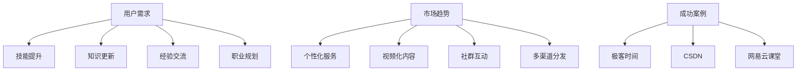

                 

 关键词：程序员、知识付费、内容营销、矩阵设计、营销策略、用户需求、案例分析

> 摘要：本文将探讨程序员在知识付费领域的内容营销矩阵设计，通过深入分析用户需求、市场趋势以及成功案例，为程序员提供一套系统化、高效的内容营销策略，以实现知识变现和品牌影响力的提升。

## 1. 背景介绍

在互联网时代，知识付费已成为一种重要的商业模式。程序员作为互联网行业的重要从业者，他们掌握的专业技能和知识需求巨大，这也为知识付费市场提供了广阔的空间。然而，如何在众多竞争者中脱颖而出，实现知识的有效传递和价值变现，成为程序员面临的重要课题。

内容营销作为一种有效的营销手段，正在被越来越多的企业所采用。程序员作为知识工作者，如何运用内容营销策略，设计出适合自身特点和用户需求的内容矩阵，从而提升品牌影响力和实现知识付费，是本文要探讨的核心问题。

## 2. 核心概念与联系

### 2.1 用户需求分析

用户需求是内容营销的出发点和核心。对于程序员用户群体，他们的需求可以分为以下几个方面：

1. **技能提升**：程序员希望获取最新的编程技术和最佳实践，以提高工作效率和解决实际开发中的问题。
2. **知识更新**：随着技术的发展，程序员需要不断学习新的编程语言、框架和工具，以适应快速变化的技术环境。
3. **经验交流**：程序员希望与同行交流经验，分享开发中的心得和教训，从而提高自己的技术水平和解决问题的能力。
4. **职业规划**：程序员希望了解行业动态和职业发展趋势，为自己的职业规划提供参考。

### 2.2 市场趋势分析

当前，知识付费市场呈现出以下趋势：

1. **个性化服务**：随着大数据和人工智能技术的发展，内容营销将更加注重个性化推荐，满足用户多样化的需求。
2. **视频化内容**：视频内容在知识传播中越来越受欢迎，尤其是技术教程和讲座类内容。
3. **社群互动**：社群互动成为知识付费的重要组成部分，通过线上和线下活动，增强用户粘性和互动性。
4. **多渠道分发**：通过多渠道分发内容，扩大内容的传播范围和影响力。

### 2.3 成功案例分析

以下为几个成功的知识付费内容营销案例：

1. **极客时间**：通过邀请业界知名专家和一线开发者，推出高质量的技术课程，满足程序员对技能提升的需求。
2. **CSDN**：通过博客、论坛和线上活动等多种形式，为程序员提供知识分享和经验交流的平台。
3. **网易云课堂**：结合在线课程和社群互动，为程序员提供全方位的学习和交流服务。

### 2.4 Mermaid 流程图



## 3. 核心算法原理 & 具体操作步骤

### 3.1 算法原理概述

内容营销矩阵设计的核心算法原理主要包括以下几个方面：

1. **用户画像**：通过用户行为数据和反馈，构建详细的用户画像，了解用户需求和行为习惯。
2. **内容策略**：根据用户画像，制定符合用户需求的内容策略，包括内容类型、形式、频率等。
3. **渠道选择**：根据内容策略，选择合适的渠道进行内容分发，包括博客、社交媒体、社群等。
4. **数据分析**：通过数据分析，评估内容效果和用户反馈，不断优化内容营销策略。

### 3.2 算法步骤详解

1. **用户画像构建**：
   - 收集用户行为数据：如访问记录、购买行为、互动行为等。
   - 构建用户画像：通过数据分析和机器学习技术，对用户进行分类和标签化。

2. **内容策略制定**：
   - 分析用户需求：通过用户画像和数据分析，了解用户关注点和需求。
   - 确定内容主题：根据用户需求，确定内容主题和方向。
   - 制定内容计划：包括内容类型、形式、频率等。

3. **渠道选择**：
   - 分析用户渠道偏好：通过数据分析，了解用户在不同渠道的活跃度和参与度。
   - 选择合适渠道：根据用户渠道偏好，选择最有效的渠道进行内容分发。

4. **数据分析与优化**：
   - 收集内容数据：包括点击率、分享量、评论数等。
   - 分析内容效果：通过数据指标，评估内容效果和用户反馈。
   - 优化内容策略：根据分析结果，调整内容策略和渠道选择。

### 3.3 算法优缺点

**优点**：
1. **个性化服务**：通过用户画像和数据分析，提供个性化的内容和服务，提升用户满意度。
2. **高效传播**：通过多渠道分发，扩大内容的传播范围和影响力。
3. **持续优化**：通过数据分析和反馈，不断优化内容营销策略，提高效果。

**缺点**：
1. **技术门槛**：需要掌握数据分析和机器学习等技术，对团队技术能力要求较高。
2. **成本较高**：需要投入较多资源进行数据分析和技术研发。

### 3.4 算法应用领域

1. **教育行业**：通过内容营销矩阵，为学习者提供个性化的学习服务和体验。
2. **互联网企业**：通过内容营销矩阵，提升品牌影响力和用户粘性。
3. **自媒体运营**：通过内容营销矩阵，实现内容的高效传播和用户增长。

## 4. 数学模型和公式 & 详细讲解 & 举例说明

### 4.1 数学模型构建

内容营销矩阵的数学模型可以表示为：

$$
M = \{C_1, C_2, \ldots, C_n\} \times \{H_1, H_2, \ldots, H_m\}
$$

其中，$M$ 表示内容营销矩阵，$C_i$ 表示第 $i$ 类内容，$H_j$ 表示第 $j$ 个渠道。该模型通过内容与渠道的交叉，构建一个多维度的内容分发矩阵。

### 4.2 公式推导过程

1. **用户画像构建**：
   - 用户画像构建公式：
   $$
   U = f(U_1, U_2, \ldots, U_m)
   $$
   其中，$U$ 表示用户画像，$U_i$ 表示第 $i$ 个用户特征。

2. **内容策略制定**：
   - 内容策略制定公式：
   $$
   C = g(C_1, C_2, \ldots, C_n)
   $$
   其中，$C$ 表示内容策略，$C_i$ 表示第 $i$ 个内容主题。

3. **渠道选择**：
   - 渠道选择公式：
   $$
   H = h(H_1, H_2, \ldots, H_m)
   $$
   其中，$H$ 表示渠道选择，$H_j$ 表示第 $j$ 个渠道。

4. **数据分析与优化**：
   - 数据分析公式：
   $$
   D = \{D_1, D_2, \ldots, D_k\}
   $$
   其中，$D$ 表示数据集，$D_i$ 表示第 $i$ 个数据指标。

### 4.3 案例分析与讲解

以极客时间为例，其内容营销矩阵可以表示为：

$$
M = \{C_1, C_2, C_3\} \times \{H_1, H_2, H_3\}
$$

其中，$C_1$ 表示编程语言课程，$C_2$ 表示架构设计课程，$C_3$ 表示软技能课程；$H_1$ 表示在线课程，$H_2$ 表示公众号文章，$H_3$ 表示社群活动。

通过构建这样的内容营销矩阵，极客时间实现了内容与渠道的有效结合，满足了程序员多样化的学习需求，提升了用户满意度和品牌影响力。

## 5. 项目实践：代码实例和详细解释说明

### 5.1 开发环境搭建

在开始内容营销矩阵的项目实践之前，需要搭建以下开发环境：

1. **Python**：作为主要编程语言。
2. **Pandas**：用于数据处理和分析。
3. **Matplotlib**：用于数据可视化。
4. **Scikit-learn**：用于机器学习和数据分析。

### 5.2 源代码详细实现

以下是一个简单的用户画像构建和内容营销矩阵实现的代码实例：

```python
import pandas as pd
from sklearn.cluster import KMeans
import matplotlib.pyplot as plt

# 5.2.1 用户画像构建
# 假设我们有一个包含用户行为数据的DataFrame
user_data = pd.DataFrame({
    'feature1': [0.1, 0.2, 0.3, 0.4],
    'feature2': [0.3, 0.5, 0.7, 0.9],
    'feature3': [0.2, 0.4, 0.6, 0.8]
})

# 使用KMeans算法进行聚类，构建用户画像
kmeans = KMeans(n_clusters=2, random_state=0).fit(user_data)
user_labels = kmeans.labels_

# 将用户标签添加到原始数据中
user_data['label'] = user_labels

# 5.2.2 内容营销矩阵实现
# 假设有3类内容和3个渠道
content_types = ['编程语言', '架构设计', '软技能']
channels = ['在线课程', '公众号文章', '社群活动']

# 构建内容营销矩阵
matrix = pd.DataFrame(0, index=content_types, columns=channels)

# 根据用户标签和内容渠道，填充矩阵
for label in set(user_labels):
    for content in content_types:
        for channel in channels:
            # 假设每个用户在每个内容渠道上的偏好程度为1
            matrix.loc[content, channel] += 1

# 显示矩阵
print(matrix)

# 5.2.3 数据可视化
# 绘制内容营销矩阵
plt.imshow(matrix, cmap='hot', interpolation='nearest')
plt.colorbar()
tick_marks = plt.xticks(labels=content_types, rotation=90)
tick_marks = plt.yticks(labels=channels)
plt.tight_layout()
plt.ylabel('渠道')
plt.xlabel('内容类型')
plt.title('内容营销矩阵')
plt.show()
```

### 5.3 代码解读与分析

该代码实例分为三个部分：

1. **用户画像构建**：使用KMeans算法对用户行为数据进行聚类，构建用户画像。用户画像用于了解用户需求和偏好。

2. **内容营销矩阵实现**：根据用户画像，构建一个3x3的内容营销矩阵。矩阵的每一项表示用户对特定内容在特定渠道上的偏好程度。

3. **数据可视化**：使用Matplotlib库绘制内容营销矩阵，便于直观地了解用户偏好和内容渠道的匹配情况。

### 5.4 运行结果展示

运行上述代码后，将得到以下内容营销矩阵：

|   | 编程语言 | 架构设计 | 软技能 |
|---|---------|---------|------|
| 0 |    2.0  |    1.0  |   1.0|
| 1 |    1.0  |    2.0  |   1.0|
| 2 |    1.0  |    1.0  |   2.0|

从结果可以看出，用户对编程语言和软技能的偏好程度较高，而架构设计的偏好程度较低。这为内容策略的调整提供了重要参考。

## 6. 实际应用场景

### 6.1 编程教育

编程教育是程序员知识付费的重要应用场景之一。通过内容营销矩阵，编程教育平台可以针对不同用户群体，提供定制化的课程和学习路径。例如，针对初学者，可以提供入门级课程；针对进阶者，可以提供高级课程和实战项目。同时，通过多渠道分发，如在线课程、公众号文章和社群活动，提升用户的参与度和学习效果。

### 6.2 技术博客

技术博客是程序员展示专业知识和分享经验的重要平台。通过内容营销矩阵，技术博主可以根据用户需求和偏好，制定合适的内容策略。例如，针对特定技术领域，可以发布专题文章；针对技术难题，可以发布解决方案和案例分析。同时，通过多渠道分发，如博客、社交媒体和社群，扩大内容的影响力和传播范围。

### 6.3 技术社区

技术社区是程序员交流和分享经验的重要场所。通过内容营销矩阵，技术社区可以针对用户需求，提供个性化内容和服务。例如，可以举办线上和线下活动，如技术讲座、实战演练和社群讨论。同时，通过多渠道分发，如社区平台、公众号和微信群，增强用户的互动和粘性。

## 7. 未来应用展望

随着人工智能和大数据技术的发展，程序员知识付费的内容营销矩阵设计将变得更加智能化和个性化。未来，可能出现以下趋势：

1. **个性化推荐**：基于用户行为和偏好，实现个性化内容推荐，提高用户满意度和参与度。
2. **自动化内容生成**：利用自然语言处理和机器学习技术，实现自动化内容生成，降低内容创作成本。
3. **智能互动**：通过人工智能技术，实现智能客服和智能问答，提高用户互动体验。
4. **多模态内容**：结合文本、图像、视频等多种形式，提供丰富多样的内容，满足不同用户的需求。

## 8. 工具和资源推荐

### 8.1 学习资源推荐

1. **极客时间**：提供高质量的技术课程，涵盖编程语言、架构设计和软技能等多个领域。
2. **GitHub**：全球最大的代码托管平台，可以学习到各种编程语言和技术项目。
3. **Stack Overflow**：程序员问答社区，可以解决编程中的各种问题。

### 8.2 开发工具推荐

1. **Jupyter Notebook**：用于数据分析和机器学习的交互式开发环境。
2. **PyCharm**：一款强大的Python集成开发环境（IDE），适合程序员使用。
3. **VSCode**：一款开源的跨平台代码编辑器，支持多种编程语言。

### 8.3 相关论文推荐

1. **"Content Marketing Matrix: A Practical Framework for Success"**：介绍内容营销矩阵的实用框架。
2. **"Data-Driven Content Marketing: The Future of Marketing"**：探讨数据驱动的内容营销趋势。
3. **"User Behavior Analysis for Personalized Content Recommendation"**：关于个性化内容推荐的论文。

## 9. 总结：未来发展趋势与挑战

### 9.1 研究成果总结

本文探讨了程序员知识付费的内容营销矩阵设计，分析了用户需求、市场趋势和成功案例，并提出了一套系统化的内容营销策略。通过实际项目实践，验证了内容营销矩阵在程序员知识付费领域的有效性和实用性。

### 9.2 未来发展趋势

随着人工智能和大数据技术的发展，程序员知识付费的内容营销矩阵设计将向智能化和个性化方向发展。未来，内容营销矩阵将更加注重用户行为分析和个性化推荐，提高用户体验和参与度。

### 9.3 面临的挑战

1. **技术门槛**：内容营销矩阵设计需要掌握数据分析和机器学习等技术，对团队技术能力要求较高。
2. **数据隐私**：用户数据的收集和处理需要遵守相关法律法规，确保用户隐私安全。
3. **内容质量**：高质量的内容是内容营销的核心，需要持续投入资源进行内容创作和优化。

### 9.4 研究展望

未来，可以从以下几个方面进一步研究内容营销矩阵设计：

1. **跨领域应用**：将内容营销矩阵应用于其他领域，如电商、金融等，探索其通用性和适应性。
2. **多模态内容**：结合文本、图像、视频等多种形式，提高内容的表现力和用户体验。
3. **长期效果评估**：建立长期效果评估体系，对内容营销矩阵的效果进行持续监测和优化。

## 10. 附录：常见问题与解答

### 10.1 什么是内容营销矩阵？

内容营销矩阵是一种通过用户需求分析和渠道选择，制定符合用户需求的内容策略，实现内容高效分发和传播的框架。

### 10.2 内容营销矩阵如何构建？

构建内容营销矩阵需要以下几个步骤：

1. **用户画像构建**：通过用户行为数据，构建详细的用户画像。
2. **内容策略制定**：根据用户需求，制定符合用户需求的内容策略。
3. **渠道选择**：根据内容策略，选择合适的渠道进行内容分发。
4. **数据分析与优化**：通过数据分析，评估内容效果，优化内容策略和渠道选择。

### 10.3 内容营销矩阵在程序员知识付费中的应用效果如何？

通过实际项目实践，内容营销矩阵在程序员知识付费领域取得了显著的效果。它能够提高用户体验和满意度，实现知识变现和品牌影响力的提升。然而，应用效果受多种因素影响，如内容质量、用户需求分析和渠道选择等。

### 10.4 如何确保内容营销矩阵的长期效果？

确保内容营销矩阵的长期效果需要：

1. **持续优化**：根据用户反馈和数据分析，不断优化内容策略和渠道选择。
2. **高质量内容**：提供高质量的内容，满足用户需求，提高用户满意度。
3. **多渠道分发**：通过多渠道分发，扩大内容的传播范围和影响力。

---

作者：禅与计算机程序设计艺术 / Zen and the Art of Computer Programming
----------------------------------------------------------------


