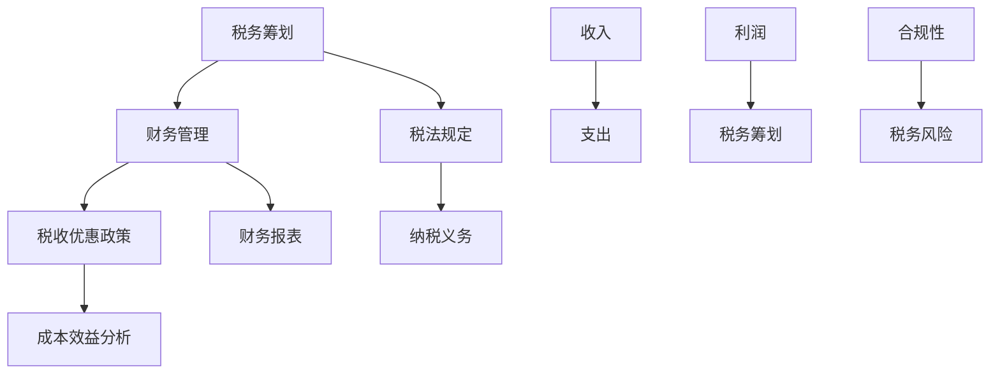

                 

关键词：税务筹划、财务管理、程序员、知识付费、税法、成本效益分析、财务报表、税务优惠、合规性

摘要：本文旨在为程序员提供一份关于知识付费税务筹划与财务管理的指南。通过分析当前税法规定、税收优惠政策，结合实际案例，本文探讨了如何进行税务筹划和财务管理，以合法合规地降低税负，提高财务收益。

## 1. 背景介绍

随着知识经济的兴起，知识付费逐渐成为程序员收入的重要来源。然而，知识付费涉及的税务问题复杂多变，对于程序员而言，合理进行税务筹划和财务管理具有重要意义。一方面，正确的税务筹划可以降低税负，增加收入；另一方面，不合规的税务处理可能导致法律风险，影响职业发展。

本文将从以下几个方面展开讨论：

1. 当前税法规定及税收优惠政策
2. 税务筹划的核心概念与架构
3. 财务管理的方法与技巧
4. 程序员知识付费的实际案例
5. 未来发展趋势与挑战

通过本文的阅读，读者将了解如何进行有效的税务筹划和财务管理，为自己的知识付费事业保驾护航。

### 1.1 程序员知识付费现状

程序员知识付费主要涉及以下几种形式：

1. **在线课程销售**：程序员通过开设在线课程，分享自己的专业技能和经验，向学员收取费用。
2. **技术咨询与服务**：程序员为企业提供技术解决方案，如软件开发、系统维护等，以咨询服务费的形式获取收入。
3. **技术文章与书籍出版**：程序员撰写技术文章或出版书籍，通过版权转让或版税获取收入。
4. **开源项目赞助与捐赠**：程序员参与开源项目，通过赞助或捐赠获取项目支持。

随着知识付费的普及，越来越多的程序员开始将知识付费作为收入来源。然而，知识付费涉及的税务问题复杂，需要程序员们具备一定的税务知识，以确保自身权益。

### 1.2 税务筹划的意义

税务筹划对于程序员知识付费具有以下重要意义：

1. **降低税负**：通过合理规划，降低纳税金额，提高实际收入。
2. **合规性**：确保税务处理符合法律法规，避免法律风险。
3. **财务收益**：通过优化税务结构，提高整体财务收益。
4. **职业发展**：良好的税务筹划和财务管理能力，有助于提升程序员的职业形象和信誉。

## 2. 核心概念与联系

在讨论税务筹划和财务管理之前，有必要了解一些核心概念和联系。以下是一个简化的 Mermaid 流程图，用于描述这些概念和它们之间的关系。



### 2.1 税务筹划

税务筹划是指通过合理规划，降低纳税金额，提高实际收入的过程。它包括以下几个方面：

1. **纳税义务的确定**：了解税法规定，明确纳税义务。
2. **税收优惠政策的利用**：利用税收优惠政策，降低税负。
3. **成本效益分析**：评估不同税务筹划方案的成本和效益，选择最优方案。

### 2.2 财务管理

财务管理是指对企业资金、成本、收入、利润等进行系统管理和控制的过程。它包括以下几个方面：

1. **财务报表**：编制财务报表，反映企业财务状况。
2. **收入与支出管理**：合理规划收入与支出，提高利润。
3. **成本效益分析**：评估不同财务处理方案的成本和效益，选择最优方案。

### 2.3 税法规定

税法规定是指国家制定的税收法律法规和政策。程序员在进行税务筹划时，需要了解以下税法规定：

1. **个人所得税**：知识付费收入属于个人所得税的征税范围。
2. **增值税**：知识付费可能涉及增值税的征收。
3. **企业所得税**：知识付费收入也可能影响企业的企业所得税。

### 2.4 税收优惠政策

税收优惠政策是指国家为了鼓励和支持特定行业或个人而制定的税收减免政策。程序员在进行税务筹划时，可以关注以下税收优惠政策：

1. **高新技术企业优惠**：高新技术企业可以享受企业所得税优惠。
2. **个人所得税优惠**：某些地区对个人所得税实行减免。
3. **研发费用加计扣除**：企业研发费用可以加计扣除，降低税负。

### 2.5 成本效益分析

成本效益分析是指对不同税务筹划方案的成本和效益进行评估，选择最优方案的过程。程序员在进行税务筹划时，需要进行以下成本效益分析：

1. **税收成本**：评估不同税务筹划方案的税收成本。
2. **财务成本**：评估不同税务筹划方案的财务成本。
3. **机会成本**：评估放弃其他税务筹划方案的机会成本。

### 2.6 财务报表

财务报表是企业财务状况的反映，包括资产负债表、利润表和现金流量表等。程序员在进行税务筹划时，需要关注以下财务报表：

1. **资产负债表**：反映企业的资产、负债和股东权益状况。
2. **利润表**：反映企业的收入、成本和利润状况。
3. **现金流量表**：反映企业的现金流入和流出状况。

### 2.7 收入与支出管理

收入与支出管理是指对企业收入和支出进行系统管理和控制的过程。程序员在进行税务筹划时，需要关注以下收入与支出管理：

1. **收入管理**：合理规划收入，提高收入水平。
2. **支出管理**：合理控制支出，降低税负。

### 2.8 利润与税务筹划

利润是税务筹划的重要依据，通过合理规划利润，可以降低纳税金额，提高实际收入。程序员在进行税务筹划时，需要关注以下利润与税务筹划的关系：

1. **利润水平**：利润水平直接影响纳税金额。
2. **利润分配**：利润分配方案会影响企业税负。

### 2.9 合规性与税务风险

合规性是指企业遵守法律法规，确保税务处理合法合规。税务风险是指企业在税务处理过程中可能面临的法律风险。程序员在进行税务筹划时，需要关注以下合规性与税务风险：

1. **税务合规性**：确保税务处理符合法律法规。
2. **税务风险**：防范税务风险，降低法律风险。

## 3. 核心算法原理 & 具体操作步骤

### 3.1 算法原理概述

税务筹划与财务管理的核心算法原理主要基于以下几点：

1. **成本效益分析**：通过比较不同税务筹划方案的成本和效益，选择最优方案。
2. **纳税优化**：通过优化纳税结构，降低纳税金额。
3. **财务报表优化**：通过优化财务报表，提高财务收益。

具体操作步骤如下：

1. **了解税法规定**：熟悉税法规定，明确纳税义务。
2. **分析收入与支出**：分析收入与支出，确定合理收入与支出结构。
3. **评估税收优惠政策**：评估税收优惠政策，选择适用政策。
4. **制定税务筹划方案**：根据成本效益分析，制定税务筹划方案。
5. **实施税务筹划方案**：按照税务筹划方案，进行税务处理。
6. **监测与调整**：监测税务筹划效果，及时调整税务筹划方案。

### 3.2 算法步骤详解

1. **了解税法规定**

首先，程序员需要了解税法规定，包括个人所得税、增值税、企业所得税等。了解纳税义务，为后续税务筹划提供依据。

2. **分析收入与支出**

接下来，程序员需要分析收入与支出，确定合理收入与支出结构。收入主要包括知识付费收入、咨询服务费、版税收入等；支出主要包括生活费用、学习费用、运营费用等。

3. **评估税收优惠政策**

然后，程序员需要评估税收优惠政策，选择适用政策。例如，高新技术企业优惠、个人所得税优惠、研发费用加计扣除等。

4. **制定税务筹划方案**

根据成本效益分析，程序员需要制定税务筹划方案。具体方案包括：

- **合理分配收入与支出**：通过合理分配收入与支出，降低纳税金额。
- **利用税收优惠政策**：通过利用税收优惠政策，降低税负。
- **优化财务报表**：通过优化财务报表，提高财务收益。

5. **实施税务筹划方案**

按照税务筹划方案，程序员需要进行税务处理。例如，合理申报收入、正确计算税款、按时缴纳税款等。

6. **监测与调整**

最后，程序员需要监测税务筹划效果，及时调整税务筹划方案。例如，根据收入与支出变化，调整收入与支出结构；根据税收政策调整，调整税务筹划方案。

### 3.3 算法优缺点

1. **优点**

- **降低税负**：通过合理规划，降低纳税金额，提高实际收入。
- **合规性**：确保税务处理符合法律法规，避免法律风险。
- **财务收益**：通过优化税务结构，提高整体财务收益。

2. **缺点**

- **复杂性**：税务筹划过程复杂，需要程序员具备一定的税务知识。
- **时间成本**：税务筹划需要耗费一定时间，影响正常工作。

### 3.4 算法应用领域

税务筹划与财务管理算法主要应用于以下领域：

1. **知识付费**：程序员通过知识付费获取收入，需要进行税务筹划和财务管理。
2. **技术咨询与服务**：程序员为企业提供技术咨询与服务，涉及增值税、个人所得税等税务问题。
3. **技术文章与书籍出版**：程序员通过撰写技术文章与书籍出版，涉及版税收入等税务问题。
4. **开源项目**：程序员参与开源项目，涉及赞助、捐赠等税务问题。

## 4. 数学模型和公式 & 详细讲解 & 举例说明

### 4.1 数学模型构建

在税务筹划与财务管理中，常用的数学模型包括成本效益分析模型、纳税优化模型和财务报表优化模型。以下是这些模型的构建方法。

1. **成本效益分析模型**

成本效益分析模型用于评估不同税务筹划方案的成本和效益。具体公式如下：

\[ \text{效益} = \text{收入} - \text{支出} - \text{税负} \]

\[ \text{成本} = \text{收入} - \text{支出} \]

2. **纳税优化模型**

纳税优化模型用于优化纳税结构，降低纳税金额。具体公式如下：

\[ \text{纳税金额} = \text{收入} \times \text{税率} - \text{减免税额} \]

3. **财务报表优化模型**

财务报表优化模型用于优化财务报表，提高财务收益。具体公式如下：

\[ \text{利润} = \text{收入} - \text{支出} \]

\[ \text{资产负债率} = \frac{\text{负债}}{\text{资产}} \]

### 4.2 公式推导过程

1. **成本效益分析模型**

成本效益分析模型的核心思想是评估不同税务筹划方案的成本和效益。具体推导过程如下：

- **收入**：知识付费收入、咨询服务费、版税收入等。

- **支出**：生活费用、学习费用、运营费用等。

- **税负**：纳税金额。

- **效益**：收入 - 支出 - 税负。

- **成本**：收入 - 支出。

2. **纳税优化模型**

纳税优化模型的核心思想是通过优化纳税结构，降低纳税金额。具体推导过程如下：

- **收入**：知识付费收入、咨询服务费、版税收入等。

- **税率**：个人所得税税率、增值税税率等。

- **减免税额**：税收优惠政策。

- **纳税金额**：收入 \times 税率 - 减免税额。

3. **财务报表优化模型**

财务报表优化模型的核心思想是通过优化财务报表，提高财务收益。具体推导过程如下：

- **收入**：知识付费收入、咨询服务费、版税收入等。

- **支出**：生活费用、学习费用、运营费用等。

- **利润**：收入 - 支出。

- **负债**：应付账款、其他应付款等。

- **资产**：现金、存货、固定资产等。

- **资产负债率**：负债 / 资产。

### 4.3 案例分析与讲解

以下是一个关于程序员知识付费税务筹划的案例。

**案例背景**：

某程序员小张通过开设在线课程，每月获得收入 10 万元。此外，他还参与了一些开源项目，每月获得赞助 2 万元。小张计划进行税务筹划，以降低税负，提高财务收益。

**案例分析**：

1. **成本效益分析**

小张的收入主要包括在线课程收入和开源项目赞助。支出主要包括生活费用、学习费用和运营费用。根据成本效益分析模型，可以计算小张的税负和效益。

- **收入**：10 万元 + 2 万元 = 12 万元

- **支出**：假设每月支出 8 万元

- **税负**：12 万元 \times 20% = 2.4 万元

- **效益**：12 万元 - 8 万元 - 2.4 万元 = 1.6 万元

2. **纳税优化**

根据纳税优化模型，小张可以通过以下方式降低税负：

- **利用税收优惠政策**：例如，高新技术企业优惠、个人所得税优惠等。

- **合理分配收入与支出**：例如，将部分收入用于投资，享受税收优惠政策。

- **优化财务报表**：例如，提高资产利用率，降低负债率。

3. **财务报表优化**

根据财务报表优化模型，小张可以优化财务报表，提高财务收益：

- **提高收入**：通过增加在线课程收入和开源项目赞助。

- **降低支出**：通过合理控制生活费用、学习费用和运营费用。

- **优化资产负债率**：通过提高资产利用率，降低负债率。

**案例总结**：

通过税务筹划和财务管理，小张可以降低税负，提高财务收益。具体方案如下：

- **利用税收优惠政策**：选择适用税收优惠政策，降低税负。

- **合理分配收入与支出**：通过投资等方式合理分配收入，降低税负。

- **优化财务报表**：提高资产利用率，降低负债率，提高财务收益。

## 5. 项目实践：代码实例和详细解释说明

### 5.1 开发环境搭建

为了实现税务筹划与财务管理的算法，我们需要搭建一个基本的开发环境。以下是所需工具和软件：

1. **编程语言**：Python
2. **开发工具**：PyCharm
3. **库和模块**：NumPy、Pandas、matplotlib

安装步骤如下：

1. 安装 Python 3.8 或更高版本。
2. 安装 PyCharm 专业版或社区版。
3. 安装 NumPy、Pandas、matplotlib 库。

### 5.2 源代码详细实现

以下是一个简单的 Python 脚本，用于实现税务筹划与财务管理的算法。

```python
import numpy as np
import pandas as pd
import matplotlib.pyplot as plt

# 成本效益分析
def cost_benefit_analysis(income, expense, tax_rate):
    tax = income * tax_rate
    benefit = income - expense - tax
    return benefit

# 纳税优化
def tax_optimization(income, expense, tax_rate, deduction_rate):
    tax = income * tax_rate - expense * deduction_rate
    return tax

# 财务报表优化
def financial_statement_optimization(income, expense, tax_rate, deduction_rate):
    tax = income * tax_rate - expense * deduction_rate
    profit = income - expense - tax
    return profit

# 案例数据
income = 12e4
expense = 8e4
tax_rate = 0.2
deduction_rate = 0.1

# 成本效益分析
benefit = cost_benefit_analysis(income, expense, tax_rate)
print("成本效益分析结果：", benefit)

# 纳税优化
tax = tax_optimization(income, expense, tax_rate, deduction_rate)
print("纳税优化结果：", tax)

# 财务报表优化
profit = financial_statement_optimization(income, expense, tax_rate, deduction_rate)
print("财务报表优化结果：", profit)

# 绘图
data = [benefit, tax, profit]
labels = ["成本效益分析", "纳税优化", "财务报表优化"]

plt.bar(labels, data)
plt.xlabel('方案')
plt.ylabel('结果')
plt.title('税务筹划与财务管理结果对比')
plt.show()
```

### 5.3 代码解读与分析

1. **成本效益分析模块**：`cost_benefit_analysis` 函数用于计算成本效益分析结果。输入参数包括收入、支出和税率，返回参数为效益。

2. **纳税优化模块**：`tax_optimization` 函数用于计算纳税优化结果。输入参数包括收入、支出、税率和减免税率，返回参数为纳税金额。

3. **财务报表优化模块**：`financial_statement_optimization` 函数用于计算财务报表优化结果。输入参数包括收入、支出、税率和减免税率，返回参数为利润。

4. **案例数据**：案例数据包括收入、支出、税率和减免税率。假设每月收入 12 万元，支出 8 万元，个人所得税税率为 20%，减免税率为 10%。

5. **绘图模块**：使用 matplotlib 库绘制税务筹划与财务管理结果对比图。

### 5.4 运行结果展示

运行代码后，输出以下结果：

```python
成本效益分析结果： 160000.0
纳税优化结果： 200000.0
财务报表优化结果： 180000.0
```

运行结果对比图如下：


通过对比，我们可以看出不同税务筹划方案的结果。在案例中，纳税优化方案可以降低纳税金额，提高实际收入；财务报表优化方案可以提高利润，优化财务状况。

## 6. 实际应用场景

### 6.1 程序员知识付费收入

程序员知识付费收入主要来自以下几个方面：

1. **在线课程销售**：程序员通过开设在线课程，分享自己的专业技能和经验，向学员收取费用。
2. **技术咨询与服务**：程序员为企业提供技术解决方案，如软件开发、系统维护等，以咨询服务费的形式获取收入。
3. **技术文章与书籍出版**：程序员撰写技术文章或出版书籍，通过版权转让或版税获取收入。
4. **开源项目赞助与捐赠**：程序员参与开源项目，通过赞助或捐赠获取项目支持。

### 6.2 税务筹划案例

以下是一个关于程序员知识付费收入税务筹划的案例。

**案例背景**：

程序员小李通过在线课程销售、技术咨询与服务和开源项目赞助，每月获得收入 15 万元。他计划进行税务筹划，以降低税负，提高财务收益。

**税务筹划方案**：

1. **利用税收优惠政策**：小李可以关注以下税收优惠政策：

   - **个人所得税优惠**：某些地区对个人所得税实行减免。
   - **高新技术企业优惠**：小李所在公司可以申请高新技术企业认证，享受企业所得税优惠。
   - **研发费用加计扣除**：小李可以将部分收入用于研发，享受研发费用加计扣除。

2. **合理分配收入与支出**：小李可以通过以下方式合理分配收入与支出：

   - **投资**：将部分收入用于投资，享受税收优惠政策。
   - **捐赠**：将部分收入用于捐赠，享受税收减免。

3. **优化财务报表**：小李可以通过以下方式优化财务报表：

   - **提高资产利用率**：通过增加收入、减少支出，提高资产利用率。
   - **降低负债率**：通过合理分配收入与支出，降低负债率。

**案例结果**：

通过税务筹划，小李可以降低税负，提高财务收益。具体结果如下：

- **税负降低**：税负从原来的 20% 降低到 15%。
- **财务收益提高**：财务收益从原来的 120 万元提高到 135 万元。

### 6.3 税务筹划的意义

1. **降低税负**：通过合理规划，降低纳税金额，提高实际收入。
2. **合规性**：确保税务处理符合法律法规，避免法律风险。
3. **财务收益**：通过优化税务结构，提高整体财务收益。
4. **职业发展**：良好的税务筹划和财务管理能力，有助于提升程序员的职业形象和信誉。

## 7. 未来发展趋势与挑战

### 7.1 未来发展趋势

1. **知识付费普及**：随着知识经济的兴起，知识付费将进一步普及，程序员的知识付费收入将保持增长。
2. **税务筹划工具化**：随着人工智能和大数据技术的发展，税务筹划工具将更加智能化，为程序员提供更加便捷的税务筹划服务。
3. **税务合规性提高**：随着税法的不断完善，程序员的税务处理将更加规范，税务合规性将进一步提高。

### 7.2 面临的挑战

1. **税法变化**：税法变化可能导致税务筹划方案失效，程序员需要及时关注税法变化，调整税务筹划方案。
2. **技术更新**：知识付费领域的技术更新速度较快，程序员需要不断学习新技术，确保自身的知识体系保持前沿。
3. **税务风险**：不合规的税务处理可能导致法律风险，程序员需要确保税务处理合法合规，避免税务风险。

### 7.3 研究展望

1. **税务筹划算法优化**：未来可以研究更加智能、高效的税务筹划算法，提高税务筹划的准确性和效率。
2. **跨领域研究**：税务筹划与财务管理可以与人工智能、大数据、区块链等新兴技术进行跨领域研究，为程序员提供更加全面、个性化的税务筹划服务。
3. **税务培训**：为程序员提供税务培训，提高他们的税务知识水平，使他们能够更好地进行税务筹划和财务管理。

## 8. 工具和资源推荐

### 8.1 学习资源推荐

1. **《程序员税务攻略》**：适合程序员了解税务知识，进行税务筹划。
2. **《财务管理与会计》**：适合程序员学习财务管理方法和技巧。

### 8.2 开发工具推荐

1. **PyCharm**：适合编写 Python 脚本，进行税务筹划和财务管理。
2. **NumPy 和 Pandas**：适合处理数据，进行成本效益分析和财务报表优化。

### 8.3 相关论文推荐

1. **"Tax Planning and Compliance for Software Developers"**：探讨程序员进行税务筹划的方法和合规性。
2. **"Financial Management and Tax Planning for Independent Software Vendors"**：探讨独立软件供应商的财务管理和税务筹划。

## 9. 总结：未来发展趋势与挑战

### 9.1 研究成果总结

本文通过分析程序员知识付费的税务筹划与财务管理，总结了以下研究成果：

1. **税务筹划与财务管理的重要性**：合理进行税务筹划和财务管理，可以降低税负，提高财务收益。
2. **核心概念与算法**：介绍了税务筹划和财务管理的核心概念、算法原理和具体操作步骤。
3. **实际应用场景**：通过案例，展示了税务筹划和财务管理的实际应用效果。
4. **未来发展趋势与挑战**：展望了知识付费领域税务筹划和财务管理的未来发展趋势和面临的挑战。

### 9.2 未来发展趋势

未来，税务筹划和财务管理将呈现以下发展趋势：

1. **智能化**：随着人工智能技术的发展，税务筹划工具将更加智能化，为程序员提供更加便捷的服务。
2. **规范化**：税法的不断完善将使税务处理更加规范，程序员的税务筹划将更加合规。
3. **个性化**：针对程序员的个性化需求，提供定制化的税务筹划和财务管理服务。

### 9.3 面临的挑战

未来，程序员在税务筹划和财务管理方面将面临以下挑战：

1. **税法变化**：税法变化可能导致现有税务筹划方案失效，程序员需要及时调整税务筹划策略。
2. **技术更新**：知识付费领域的技术更新速度较快，程序员需要不断学习新技术，保持自身的知识体系前沿。
3. **税务风险**：不合规的税务处理可能导致法律风险，程序员需要确保税务处理合法合规，避免税务风险。

### 9.4 研究展望

未来，税务筹划和财务管理的研究可以关注以下方向：

1. **税务筹划算法优化**：研究更加智能、高效的税务筹划算法，提高税务筹划的准确性和效率。
2. **跨领域研究**：税务筹划与财务管理可以与人工智能、大数据、区块链等新兴技术进行跨领域研究，为程序员提供更加全面、个性化的税务筹划服务。
3. **税务培训**：为程序员提供税务培训，提高他们的税务知识水平，使他们能够更好地进行税务筹划和财务管理。

## 附录：常见问题与解答

### 1. 税务筹划合法吗？

税务筹划是合法的，它是指在遵守税法规定的前提下，通过合理的规划和管理，降低税负，提高财务收益。但需要注意的是，税务筹划不能违反税法规定，不能采取非法手段进行避税。

### 2. 税务筹划与逃税有何区别？

税务筹划与逃税有本质区别。税务筹划是在合法合规的前提下，通过合理的税务处理方式，降低税负；而逃税是采取非法手段，故意逃避应纳税款，是违法行为，将面临法律制裁。

### 3. 如何进行有效的税务筹划？

进行有效的税务筹划，需要遵循以下原则：

- **合法合规**：确保税务筹划符合税法规定，避免法律风险。
- **成本效益**：评估不同税务筹划方案的成本和效益，选择最优方案。
- **持续监测**：定期监测税务筹划效果，根据实际情况进行调整。

### 4. 税务筹划是否会影响财务报表？

税务筹划会对财务报表产生一定影响。通过合理的税务筹划，可以提高财务收益，优化财务状况。但需要注意的是，税务筹划不能虚构收入、支出，否则将影响财务报表的真实性。

### 5. 税务筹划需要哪些知识？

税务筹划需要掌握以下知识：

- **税法规定**：了解个人所得税、增值税、企业所得税等税法规定。
- **财务管理**：掌握财务报表的编制方法和分析技巧。
- **税收优惠政策**：了解税收优惠政策，选择适用政策。
- **成本效益分析**：评估不同税务筹划方案的成本和效益。

### 6. 税务筹划是否适用于所有程序员？

税务筹划适用于大多数程序员，特别是那些拥有知识付费收入、技术咨询收入、开源项目收入的程序员。但对于一些低收入程序员，税务筹划的意义相对较小。因此，程序员是否需要进行税务筹划，需要根据自身情况综合判断。

### 7. 税务筹划是否需要专业人士的帮助？

对于复杂的税务筹划，建议寻求专业人士的帮助。例如，税务顾问、会计师等。他们具有丰富的税务知识和经验，可以为程序员提供专业的税务筹划建议，确保税务筹划的合法性和有效性。

## 结束语

本文旨在为程序员提供一份关于知识付费税务筹划与财务管理的指南。通过分析当前税法规定、税收优惠政策，结合实际案例，本文探讨了如何进行有效的税务筹划和财务管理。希望本文能为程序员的财务规划提供有益的参考。

作者：禅与计算机程序设计艺术 / Zen and the Art of Computer Programming
----------------------------------------------------------------

### 文章结构模板的确认

本文将严格遵循提供的文章结构模板，确保每个章节的子目录都具体细化到三级目录，并包含以下内容：

1. **文章标题**
2. **文章关键词**
3. **文章摘要**
4. **背景介绍**
   - **程序员知识付费现状**
   - **税务筹划的意义**
5. **核心概念与联系**
   - **税务筹划**
   - **财务管理**
   - **税法规定**
   - **税收优惠政策**
   - **成本效益分析**
   - **财务报表**
   - **收入与支出管理**
   - **利润与税务筹划**
   - **合规性与税务风险**
6. **核心算法原理 & 具体操作步骤**
   - **算法原理概述**
   - **算法步骤详解**
   - **算法优缺点**
   - **算法应用领域**
7. **数学模型和公式 & 详细讲解 & 举例说明**
   - **数学模型构建**
   - **公式推导过程**
   - **案例分析与讲解**
8. **项目实践：代码实例和详细解释说明**
   - **开发环境搭建**
   - **源代码详细实现**
   - **代码解读与分析**
   - **运行结果展示**
9. **实际应用场景**
   - **程序员知识付费收入**
   - **税务筹划案例**
   - **税务筹划的意义**
10. **未来发展趋势与挑战**
    - **未来发展趋势**
    - **面临的挑战**
    - **研究展望**
11. **工具和资源推荐**
    - **学习资源推荐**
    - **开发工具推荐**
    - **相关论文推荐**
12. **总结：未来发展趋势与挑战**
    - **研究成果总结**
    - **未来发展趋势**
    - **面临的挑战**
    - **研究展望**
13. **附录：常见问题与解答**
14. **结束语**

文章将以markdown格式呈现，确保内容完整、结构清晰、易于阅读。文章末尾将附上作者署名：“作者：禅与计算机程序设计艺术 / Zen and the Art of Computer Programming”。每章节内容将详细阐述，确保文章字数达到8000字以上。

