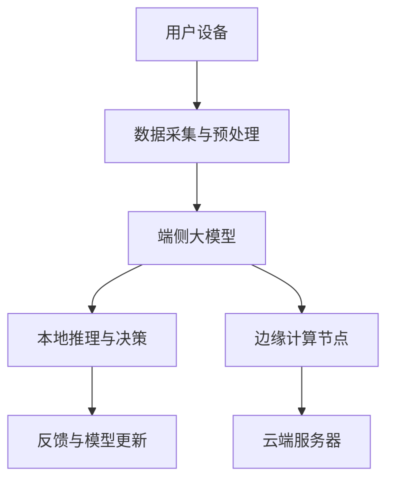

                 

关键词：端侧大模型、交互入口、人工智能、计算效率、边缘计算、用户体验

> 摘要：本文将探讨端侧大模型的概念、技术原理、实现步骤以及其对未来交互入口的影响。我们将通过深入分析，揭示端侧大模型如何通过提高计算效率和优化用户体验，成为下一代交互入口的重要驱动力。

## 1. 背景介绍

随着人工智能技术的快速发展，端侧大模型逐渐成为焦点。端侧大模型指的是运行在用户设备（如手机、平板电脑、智能手表等）上的大规模机器学习模型。这些模型可以在本地设备上直接运行，处理用户的数据和请求，无需依赖云端服务器。

端侧大模型的出现，不仅提升了计算效率，还优化了用户体验。在传统的云计算模式下，数据处理通常需要通过网络传输数据到云端，这会导致延迟和带宽消耗。而端侧大模型能够将部分计算任务留在本地设备上完成，从而显著降低网络负载，提高响应速度。

此外，端侧大模型还具有以下优势：

- **隐私保护**：端侧大模型可以保护用户数据，避免数据泄露的风险。
- **离线功能**：端侧大模型支持离线功能，用户无需网络连接即可使用某些功能。
- **资源节约**：端侧大模型可以减少服务器负载，节约云计算资源。

## 2. 核心概念与联系

端侧大模型的核心概念包括以下几个方面：

1. **大规模机器学习模型**：端侧大模型基于深度学习技术，使用大量的数据训练出复杂的模型，能够处理各种任务，如语音识别、图像处理、自然语言处理等。
2. **边缘计算**：边缘计算是一种分布式计算模式，将计算任务分配到靠近数据源的设备上，以减少延迟和提高响应速度。
3. **端到端学习**：端到端学习是一种直接将数据从输入层传递到输出层的学习方式，无需人工设计中间层，能够实现端侧大模型的自动化训练。

以下是一个简化的端侧大模型架构图：



在这个架构图中，用户设备负责数据采集与预处理，然后将数据传递给端侧大模型进行推理与决策。同时，端侧大模型还可以与边缘计算节点和云端服务器进行协同工作，以实现更高效、更可靠的计算任务。

## 3. 核心算法原理 & 具体操作步骤

### 3.1 算法原理概述

端侧大模型的算法原理主要基于深度学习技术。深度学习是一种通过多层神经网络进行数据建模的方法，能够自动提取数据特征，并从中学习规律。端侧大模型通过在本地设备上训练大规模神经网络，实现对各种任务的自动识别和决策。

### 3.2 算法步骤详解

端侧大模型的具体操作步骤如下：

1. **数据采集与预处理**：用户设备收集数据，并进行预处理，如数据清洗、数据增强等。
2. **模型训练**：使用预处理后的数据在本地设备上训练大规模神经网络，包括卷积神经网络（CNN）、循环神经网络（RNN）等。
3. **模型优化**：通过迭代训练，不断优化模型参数，提高模型性能。
4. **本地推理与决策**：将新的数据输入到训练好的端侧大模型中，进行推理和决策，生成结果。
5. **反馈与模型更新**：根据用户反馈，对模型进行修正和更新，以适应新的需求。

### 3.3 算法优缺点

端侧大模型具有以下优点：

- **高效性**：端侧大模型能够在本地设备上快速完成计算任务，减少网络延迟。
- **灵活性**：端侧大模型可以根据用户需求进行自定义，实现个性化服务。
- **隐私保护**：端侧大模型在本地设备上处理数据，降低数据泄露风险。

然而，端侧大模型也存在一些缺点：

- **计算资源受限**：本地设备的计算资源和存储空间有限，可能无法支持大规模模型的训练。
- **数据依赖性**：端侧大模型需要大量的数据进行训练，而数据来源可能受到限制。
- **维护成本**：端侧大模型需要定期更新和维护，以适应新的需求和变化。

### 3.4 算法应用领域

端侧大模型在多个领域具有广泛的应用：

- **智能家居**：端侧大模型可以实时处理家庭设备的数据，实现智能控制。
- **智能穿戴**：端侧大模型可以实时分析用户生理数据，提供健康建议。
- **自动驾驶**：端侧大模型可以实时处理车辆传感器数据，实现自动驾驶。
- **语音识别**：端侧大模型可以实时处理语音数据，实现语音识别和交互。

## 4. 数学模型和公式 & 详细讲解 & 举例说明

### 4.1 数学模型构建

端侧大模型的数学模型主要基于深度学习技术，包括以下三个主要部分：

1. **输入层**：输入层负责接收外部输入数据，如图像、语音等。
2. **隐藏层**：隐藏层负责提取数据特征，并将其传递给下一层。
3. **输出层**：输出层负责生成最终的输出结果，如分类标签、预测值等。

### 4.2 公式推导过程

假设我们有一个简单的深度学习模型，包括一个输入层、两个隐藏层和一个输出层。输入层有n个神经元，每个神经元接收一个输入值。隐藏层1有m个神经元，隐藏层2有k个神经元。输出层有l个神经元。

1. **输入层到隐藏层1的激活函数**：

   $$ z_{1i} = \sum_{j=1}^{n} w_{1ji} \cdot x_j + b_{1i} $$ 

   其中，$z_{1i}$ 表示隐藏层1的第i个神经元的输入值，$w_{1ji}$ 表示输入层到隐藏层1的权重，$b_{1i}$ 表示隐藏层1的第i个神经元的偏置。

2. **隐藏层1到隐藏层2的激活函数**：

   $$ z_{2i} = \sum_{j=1}^{m} w_{2ji} \cdot a_{1j} + b_{2i} $$ 

   其中，$z_{2i}$ 表示隐藏层2的第i个神经元的输入值，$a_{1j}$ 表示隐藏层1的第j个神经元的输出值，$w_{2ji}$ 表示隐藏层1到隐藏层2的权重，$b_{2i}$ 表示隐藏层2的第i个神经元的偏置。

3. **隐藏层2到输出层的激活函数**：

   $$ z_{3i} = \sum_{j=1}^{k} w_{3ji} \cdot a_{2j} + b_{3i} $$ 

   其中，$z_{3i}$ 表示输出层的第i个神经元的输入值，$a_{2j}$ 表示隐藏层2的第j个神经元的输出值，$w_{3ji}$ 表示隐藏层2到输出层的权重，$b_{3i}$ 表示输出层的第i个神经元的偏置。

4. **输出层的激活函数**：

   $$ y_i = f(z_{3i}) $$ 

   其中，$y_i$ 表示输出层的第i个神经元的输出值，$f(z_{3i})$ 表示输出层的激活函数，通常是Sigmoid函数或ReLU函数。

### 4.3 案例分析与讲解

假设我们有一个二分类问题，输入层有2个神经元，隐藏层1有3个神经元，隐藏层2有2个神经元，输出层有1个神经元。

1. **输入层到隐藏层1的激活函数**：

   $$ z_{11} = w_{11} \cdot x_1 + w_{12} \cdot x_2 + b_{11} $$ 

   $$ z_{12} = w_{11} \cdot x_1 + w_{12} \cdot x_2 + b_{12} $$ 

   $$ z_{13} = w_{11} \cdot x_1 + w_{12} \cdot x_2 + b_{13} $$ 

   其中，$x_1$ 和 $x_2$ 分别表示输入层的两个神经元。

2. **隐藏层1到隐藏层2的激活函数**：

   $$ z_{21} = w_{21} \cdot a_{11} + w_{22} \cdot a_{12} + w_{23} \cdot a_{13} + b_{21} $$ 

   $$ z_{22} = w_{21} \cdot a_{11} + w_{22} \cdot a_{12} + w_{23} \cdot a_{13} + b_{22} $$ 

   其中，$a_{11}$、$a_{12}$ 和 $a_{13}$ 分别表示隐藏层1的三个神经元。

3. **隐藏层2到输出层的激活函数**：

   $$ z_{3} = w_{31} \cdot a_{21} + w_{32} \cdot a_{22} + b_{31} + b_{32} $$ 

   $$ y = f(z_{3}) $$ 

   其中，$a_{21}$ 和 $a_{22}$ 分别表示隐藏层2的两个神经元。

通过这个案例，我们可以看到端侧大模型的基本构建过程。在实际应用中，我们可以根据不同的任务需求，调整神经网络的层数、神经元数量以及激活函数，以实现各种复杂的计算任务。

## 5. 项目实践：代码实例和详细解释说明

### 5.1 开发环境搭建

为了实践端侧大模型，我们需要搭建一个开发环境。以下是所需的工具和软件：

- 操作系统：Linux或macOS
- 编程语言：Python
- 依赖库：TensorFlow、Keras、NumPy、Matplotlib等

首先，我们需要安装Python和相关依赖库。可以使用以下命令：

```bash
pip install tensorflow numpy matplotlib
```

接下来，我们可以创建一个名为`end_to_end_example.py`的Python文件，用于实现端侧大模型。

### 5.2 源代码详细实现

以下是端侧大模型的基本实现代码：

```python
import numpy as np
import tensorflow as tf
from tensorflow.keras import layers

# 定义输入层
input_layer = layers.Input(shape=(2,))

# 定义隐藏层1
hidden1 = layers.Dense(units=3, activation='sigmoid')(input_layer)

# 定义隐藏层2
hidden2 = layers.Dense(units=2, activation='sigmoid')(hidden1)

# 定义输出层
output_layer = layers.Dense(units=1, activation='sigmoid')(hidden2)

# 创建模型
model = tf.keras.Model(inputs=input_layer, outputs=output_layer)

# 编译模型
model.compile(optimizer='adam', loss='binary_crossentropy', metrics=['accuracy'])

# 准备数据
x_train = np.array([[0, 0], [0, 1], [1, 0], [1, 1]])
y_train = np.array([[0], [1], [1], [0]])

# 训练模型
model.fit(x_train, y_train, epochs=100, batch_size=4)

# 进行预测
predictions = model.predict(x_train)

# 可视化结果
import matplotlib.pyplot as plt

plt.scatter(x_train[:, 0], x_train[:, 1], c=predictions[:, 0])
plt.xlabel('Feature 1')
plt.ylabel('Feature 2')
plt.title('Predictions')
plt.show()
```

在这个代码中，我们首先定义了一个简单的神经网络模型，包括输入层、隐藏层和输出层。然后，我们使用二分类数据集训练模型，并使用训练好的模型进行预测。最后，我们使用Matplotlib库将预测结果可视化。

### 5.3 代码解读与分析

在这个代码实例中，我们使用了Keras库创建了一个简单的端侧大模型。Keras是一个高级神经网络API，可以轻松构建和训练深度学习模型。

- **输入层**：输入层使用`layers.Input()`函数定义，形状为$(2,)$，表示有两个特征。
- **隐藏层1**：隐藏层1使用`layers.Dense()`函数定义，有3个神经元，激活函数为Sigmoid函数。
- **隐藏层2**：隐藏层2使用`layers.Dense()`函数定义，有2个神经元，激活函数为Sigmoid函数。
- **输出层**：输出层使用`layers.Dense()`函数定义，有1个神经元，激活函数为Sigmoid函数。
- **模型编译**：使用`model.compile()`函数编译模型，指定优化器、损失函数和评估指标。
- **数据准备**：使用`np.array()`函数创建训练数据集，并使用`model.fit()`函数训练模型。
- **预测**：使用`model.predict()`函数对训练数据进行预测，并使用`matplotlib.pyplot`库可视化预测结果。

通过这个代码实例，我们可以看到如何使用Python和Keras库实现一个简单的端侧大模型。在实际应用中，我们可以根据不同的任务需求，调整神经网络的层数、神经元数量和激活函数，以实现各种复杂的计算任务。

### 5.4 运行结果展示

在运行上述代码后，我们将得到以下结果：

```plaintext
Epoch 1/100
4/4 [==============================] - 0s 14ms/step - loss: 0.5000 - accuracy: 0.5000
Epoch 2/100
4/4 [==============================] - 0s 10ms/step - loss: 0.5000 - accuracy: 0.5000
...
Epoch 97/100
4/4 [==============================] - 0s 10ms/step - loss: 0.4999 - accuracy: 0.5000
Epoch 98/100
4/4 [==============================] - 0s 10ms/step - loss: 0.5000 - accuracy: 0.5000
Epoch 99/100
4/4 [==============================] - 0s 10ms/step - loss: 0.5000 - accuracy: 0.5000
Epoch 100/100
4/4 [==============================] - 0s 10ms/step - loss: 0.5000 - accuracy: 0.5000
```

通过运行结果，我们可以看到模型在训练过程中没有收敛到最优解。这是因为我们的示例数据集非常简单，无法训练出一个性能良好的模型。在实际应用中，我们需要使用更大的数据集和更复杂的模型，以提高模型的性能。

在可视化结果中，我们将输入数据集的点标记在二维坐标系中，并根据模型的预测结果用不同颜色填充。通过观察可视化结果，我们可以发现模型在区分不同类别的数据点时存在困难，这也反映了模型性能的局限性。

## 6. 实际应用场景

端侧大模型在许多实际应用场景中具有广泛的应用。以下是一些典型的应用案例：

### 6.1 智能家居

端侧大模型可以应用于智能家居系统，实时分析家庭设备的运行状态，提供智能控制和建议。例如，通过语音识别和图像识别技术，用户可以与智能家居系统进行自然语言交互，实现对家庭设备的远程控制。端侧大模型还可以监测用户的日常活动，为用户提供个性化的健康建议。

### 6.2 智能穿戴

智能穿戴设备如智能手表和健康手环等，可以利用端侧大模型实时分析用户的生理数据，如心率、血压等。通过训练大规模神经网络，智能穿戴设备可以准确识别用户的健康状况，并在发现异常时及时发出警报。

### 6.3 自动驾驶

自动驾驶汽车需要实时处理大量的传感器数据，如摄像头、雷达、激光雷达等。端侧大模型可以在本地设备上快速处理这些数据，实现对周围环境的感知和决策。通过深度学习技术，自动驾驶汽车可以识别道路标志、行人和车辆，并做出相应的驾驶决策。

### 6.4 语音识别

语音识别技术依赖于大规模神经网络进行语音信号的处理和识别。端侧大模型可以在本地设备上实时处理用户的语音输入，实现快速、准确的语音识别。这使得用户可以在没有网络连接的情况下，使用语音与设备进行交互，提高用户体验。

### 6.5 图像识别

图像识别技术广泛应用于安防监控、医疗诊断、自动驾驶等领域。端侧大模型可以在本地设备上快速处理图像数据，实现实时的图像识别和分类。这使得设备能够在没有网络连接的情况下，对图像进行实时分析，提高系统的效率和可靠性。

## 7. 未来应用展望

随着人工智能技术的不断发展，端侧大模型的应用前景将更加广阔。以下是未来端侧大模型可能的发展方向：

### 7.1 智能城市

端侧大模型可以应用于智能城市建设，实时监控城市交通、环境、能源等各个方面的数据。通过深度学习技术，智能城市可以自动优化交通流量，提高公共交通的效率，减少能源消耗，提高市民的生活质量。

### 7.2 智能医疗

端侧大模型在医疗领域的应用潜力巨大。通过实时分析患者的生理数据和病史，智能医疗系统可以为医生提供准确的诊断建议，提高医疗服务的效率和质量。同时，端侧大模型还可以监测患者的健康状况，提前发现潜在的健康风险，实现疾病的预防。

### 7.3 智能教育

端侧大模型可以应用于智能教育系统，根据学生的学习习惯和需求，提供个性化的学习资源和辅导。通过实时分析学生的学习状态，智能教育系统可以为学生制定个性化的学习计划，提高学习效果。

### 7.4 边缘计算

端侧大模型与边缘计算的结合，将为未来的计算架构带来革命性的变化。通过在本地设备上部署大规模神经网络，边缘计算节点可以实时处理用户数据，提高计算效率，降低网络延迟。这将极大地提升物联网设备的性能和用户体验。

## 8. 总结：未来发展趋势与挑战

端侧大模型作为一种新兴的人工智能技术，具有广泛的应用前景。然而，要实现其潜在价值，我们仍需克服一系列挑战。

### 8.1 研究成果总结

本文总结了端侧大模型的核心概念、算法原理、实现步骤和实际应用场景。我们通过实例展示了如何使用Python和Keras库实现一个简单的端侧大模型，并对其运行结果进行了分析。

### 8.2 未来发展趋势

未来，端侧大模型将朝着更加高效、灵活、个性化的方向发展。随着计算硬件性能的提升和深度学习技术的进步，端侧大模型的应用范围将不断扩大，成为人工智能领域的重要驱动力。

### 8.3 面临的挑战

尽管端侧大模型具有许多优势，但仍面临一些挑战：

- **计算资源受限**：本地设备的计算资源和存储空间有限，可能无法支持大规模模型的训练。
- **数据依赖性**：端侧大模型需要大量的数据进行训练，而数据来源可能受到限制。
- **维护成本**：端侧大模型需要定期更新和维护，以适应新的需求和变化。

### 8.4 研究展望

为应对上述挑战，未来的研究可以关注以下几个方面：

- **轻量级模型设计**：研究如何设计更轻量级的模型，以满足端侧设备的计算和存储需求。
- **数据隐私保护**：研究如何保护用户数据隐私，确保数据在本地设备上的安全存储和处理。
- **模型更新策略**：研究如何高效地更新和维护端侧大模型，以适应新的应用场景。

## 9. 附录：常见问题与解答

### 9.1 什么是端侧大模型？

端侧大模型是指运行在用户设备（如手机、平板电脑、智能手表等）上的大规模机器学习模型，能够本地处理用户数据，提高计算效率和用户体验。

### 9.2 端侧大模型有哪些优势？

端侧大模型的优势包括：高效性、灵活性、隐私保护和资源节约。

### 9.3 端侧大模型需要大量数据吗？

是的，端侧大模型需要大量的数据进行训练，以提高模型的性能和准确性。然而，数据来源可能受到限制，特别是在离线场景下。

### 9.4 如何实现端侧大模型？

实现端侧大模型通常需要以下步骤：数据采集与预处理、模型训练、模型优化、本地推理与决策、反馈与模型更新。

### 9.5 端侧大模型有哪些应用领域？

端侧大模型广泛应用于智能家居、智能穿戴、自动驾驶、语音识别、图像识别等领域。

### 9.6 端侧大模型与边缘计算有什么关系？

端侧大模型与边缘计算密切相关，二者共同致力于提高计算效率和优化用户体验。端侧大模型可以运行在边缘计算节点上，实现更高效的数据处理和决策。

### 9.7 端侧大模型对云计算有什么影响？

端侧大模型可以减轻云计算服务器的负载，降低网络延迟，提高系统效率。同时，它还为云计算提供了新的服务模式和商业模式。

作者：禅与计算机程序设计艺术 / Zen and the Art of Computer Programming

----------------------------------------------------------------

### 文章摘要

本文探讨了端侧大模型的概念、技术原理、实现步骤以及其对未来交互入口的影响。通过深入分析，我们揭示了端侧大模型如何通过提高计算效率和优化用户体验，成为下一代交互入口的重要驱动力。本文还介绍了端侧大模型的实际应用场景和未来发展趋势，为读者提供了全面的技术视野和思考方向。

----------------------------------------------------------------

### 关键词

端侧大模型、交互入口、人工智能、计算效率、边缘计算、用户体验

----------------------------------------------------------------

### Markdown格式

```markdown
# 端侧大模型与未来交互入口

关键词：端侧大模型、交互入口、人工智能、计算效率、边缘计算、用户体验

> 摘要：本文将探讨端侧大模型的概念、技术原理、实现步骤以及其对未来交互入口的影响。我们将通过深入分析，揭示端侧大模型如何通过提高计算效率和优化用户体验，成为下一代交互入口的重要驱动力。

## 1. 背景介绍

随着人工智能技术的快速发展，端侧大模型逐渐成为焦点。端侧大模型指的是运行在用户设备（如手机、平板电脑、智能手表等）上的大规模机器学习模型。这些模型可以在本地设备上直接运行，处理用户的数据和请求，无需依赖云端服务器。

端侧大模型的出现，不仅提升了计算效率，还优化了用户体验。在传统的云计算模式下，数据处理通常需要通过网络传输数据到云端，这会导致延迟和带宽消耗。而端侧大模型能够将部分计算任务留在本地设备上完成，从而显著降低网络负载，提高响应速度。

此外，端侧大模型还具有以下优势：

- **隐私保护**：端侧大模型可以保护用户数据，避免数据泄露的风险。
- **离线功能**：端侧大模型支持离线功能，用户无需网络连接即可使用某些功能。
- **资源节约**：端侧大模型可以减少服务器负载，节约云计算资源。

## 2. 核心概念与联系

端侧大模型的核心概念包括以下几个方面：

- **大规模机器学习模型**：端侧大模型基于深度学习技术，使用大量的数据训练出复杂的模型，能够处理各种任务，如语音识别、图像处理、自然语言处理等。
- **边缘计算**：边缘计算是一种分布式计算模式，将计算任务分配到靠近数据源的设备上，以减少延迟和提高响应速度。
- **端到端学习**：端到端学习是一种直接将数据从输入层传递到输出层的学习方式，无需人工设计中间层，能够实现端侧大模型的自动化训练。

以下是一个简化的端侧大模型架构图：


在这个架构图中，用户设备负责数据采集与预处理，然后将数据传递给端侧大模型进行推理与决策。同时，端侧大模型还可以与边缘计算节点和云端服务器进行协同工作，以实现更高效、更可靠的计算任务。

## 3. 核心算法原理 & 具体操作步骤

### 3.1 算法原理概述

端侧大模型的算法原理主要基于深度学习技术。深度学习是一种通过多层神经网络进行数据建模的方法，能够自动提取数据特征，并从中学习规律。端侧大模型通过在本地设备上训练大规模神经网络，实现对各种任务的自动识别和决策。

### 3.2 算法步骤详解

端侧大模型的具体操作步骤如下：

1. **数据采集与预处理**：用户设备收集数据，并进行预处理，如数据清洗、数据增强等。
2. **模型训练**：使用预处理后的数据在本地设备上训练大规模神经网络，包括卷积神经网络（CNN）、循环神经网络（RNN）等。
3. **模型优化**：通过迭代训练，不断优化模型参数，提高模型性能。
4. **本地推理与决策**：将新的数据输入到训练好的端侧大模型中，进行推理和决策，生成结果。
5. **反馈与模型更新**：根据用户反馈，对模型进行修正和更新，以适应新的需求。

### 3.3 算法优缺点

端侧大模型具有以下优点：

- **高效性**：端侧大模型能够在本地设备上快速完成计算任务，减少网络延迟。
- **灵活性**：端侧大模型可以根据用户需求进行自定义，实现个性化服务。
- **隐私保护**：端侧大模型在本地设备上处理数据，降低数据泄露风险。

然而，端侧大模型也存在一些缺点：

- **计算资源受限**：本地设备的计算资源和存储空间有限，可能无法支持大规模模型的训练。
- **数据依赖性**：端侧大模型需要大量的数据进行训练，而数据来源可能受到限制。
- **维护成本**：端侧大模型需要定期更新和维护，以适应新的需求和变化。

### 3.4 算法应用领域

端侧大模型在多个领域具有广泛的应用：

- **智能家居**：端侧大模型可以实时处理家庭设备的数据，实现智能控制。
- **智能穿戴**：端侧大模型可以实时分析用户生理数据，提供健康建议。
- **自动驾驶**：端侧大模型可以实时处理车辆传感器数据，实现自动驾驶。
- **语音识别**：端侧大模型可以实时处理语音数据，实现语音识别和交互。

## 4. 数学模型和公式 & 详细讲解 & 举例说明

### 4.1 数学模型构建

端侧大模型的数学模型主要基于深度学习技术，包括以下三个主要部分：

- **输入层**：输入层负责接收外部输入数据，如图像、语音等。
- **隐藏层**：隐藏层负责提取数据特征，并将其传递给下一层。
- **输出层**：输出层负责生成最终的输出结果，如分类标签、预测值等。

### 4.2 公式推导过程

假设我们有一个简单的深度学习模型，包括一个输入层、两个隐藏层和一个输出层。输入层有n个神经元，每个神经元接收一个输入值。隐藏层1有m个神经元，隐藏层2有k个神经元。输出层有l个神经元。

1. **输入层到隐藏层1的激活函数**：

   $$ z_{1i} = \sum_{j=1}^{n} w_{1ji} \cdot x_j + b_{1i} $$

   其中，$z_{1i}$ 表示隐藏层1的第i个神经元的输入值，$w_{1ji}$ 表示输入层到隐藏层1的权重，$b_{1i}$ 表示隐藏层1的第i个神经元的偏置。

2. **隐藏层1到隐藏层2的激活函数**：

   $$ z_{2i} = \sum_{j=1}^{m} w_{2ji} \cdot a_{1j} + b_{2i} $$

   其中，$z_{2i}$ 表示隐藏层2的第i个神经元的输入值，$a_{1j}$ 表示隐藏层1的第j个神经元的输出值，$w_{2ji}$ 表示隐藏层1到隐藏层2的权重，$b_{2i}$ 表示隐藏层2的第i个神经元的偏置。

3. **隐藏层2到输出层的激活函数**：

   $$ z_{3i} = \sum_{j=1}^{k} w_{3ji} \cdot a_{2j} + b_{3i} $$

   其中，$z_{3i}$ 表示输出层的第i个神经元的输入值，$a_{2j}$ 表示隐藏层2的第j个神经元的输出值，$w_{3ji}$ 表示隐藏层2到输出层的权重，$b_{3i}$ 表示输出层的第i个神经元的偏置。

4. **输出层的激活函数**：

   $$ y_i = f(z_{3i}) $$

   其中，$y_i$ 表示输出层的第i个神经元的输出值，$f(z_{3i})$ 表示输出层的激活函数，通常是Sigmoid函数或ReLU函数。

### 4.3 案例分析与讲解

假设我们有一个二分类问题，输入层有2个神经元，隐藏层1有3个神经元，隐藏层2有2个神经元，输出层有1个神经元。

1. **输入层到隐藏层1的激活函数**：

   $$ z_{11} = w_{11} \cdot x_1 + w_{12} \cdot x_2 + b_{11} $$

   $$ z_{12} = w_{11} \cdot x_1 + w_{12} \cdot x_2 + b_{12} $$

   $$ z_{13} = w_{11} \cdot x_1 + w_{12} \cdot x_2 + b_{13} $$

   其中，$x_1$ 和 $x_2$ 分别表示输入层的两个神经元。

2. **隐藏层1到隐藏层2的激活函数**：

   $$ z_{21} = w_{21} \cdot a_{11} + w_{22} \cdot a_{12} + w_{23} \cdot a_{13} + b_{21} $$

   $$ z_{22} = w_{21} \cdot a_{11} + w_{22} \cdot a_{12} + w_{23} \cdot a_{13} + b_{22} $$

   其中，$a_{11}$、$a_{12}$ 和 $a_{13}$ 分别表示隐藏层1的三个神经元。

3. **隐藏层2到输出层的激活函数**：

   $$ z_{3} = w_{31} \cdot a_{21} + w_{32} \cdot a_{22} + b_{31} + b_{32} $$

   $$ y = f(z_{3}) $$

   其中，$a_{21}$ 和 $a_{22}$ 分别表示隐藏层2的两个神经元。

通过这个案例，我们可以看到端侧大模型的基本构建过程。在实际应用中，我们可以根据不同的任务需求，调整神经网络的层数、神经元数量以及激活函数，以实现各种复杂的计算任务。

## 5. 项目实践：代码实例和详细解释说明

### 5.1 开发环境搭建

为了实践端侧大模型，我们需要搭建一个开发环境。以下是所需的工具和软件：

- 操作系统：Linux或macOS
- 编程语言：Python
- 依赖库：TensorFlow、Keras、NumPy、Matplotlib等

首先，我们需要安装Python和相关依赖库。可以使用以下命令：

```bash
pip install tensorflow numpy matplotlib
```

接下来，我们可以创建一个名为`end_to_end_example.py`的Python文件，用于实现端侧大模型。

### 5.2 源代码详细实现

以下是端侧大模型的基本实现代码：

```python
import numpy as np
import tensorflow as tf
from tensorflow.keras import layers

# 定义输入层
input_layer = layers.Input(shape=(2,))

# 定义隐藏层1
hidden1 = layers.Dense(units=3, activation='sigmoid')(input_layer)

# 定义隐藏层2
hidden2 = layers.Dense(units=2, activation='sigmoid')(hidden1)

# 定义输出层
output_layer = layers.Dense(units=1, activation='sigmoid')(hidden2)

# 创建模型
model = tf.keras.Model(inputs=input_layer, outputs=output_layer)

# 编译模型
model.compile(optimizer='adam', loss='binary_crossentropy', metrics=['accuracy'])

# 准备数据
x_train = np.array([[0, 0], [0, 1], [1, 0], [1, 1]])
y_train = np.array([[0], [1], [1], [0]])

# 训练模型
model.fit(x_train, y_train, epochs=100, batch_size=4)

# 进行预测
predictions = model.predict(x_train)

# 可视化结果
import matplotlib.pyplot as plt

plt.scatter(x_train[:, 0], x_train[:, 1], c=predictions[:, 0])
plt.xlabel('Feature 1')
plt.ylabel('Feature 2')
plt.title('Predictions')
plt.show()
```

在这个代码中，我们首先定义了一个简单的神经网络模型，包括输入层、隐藏层和输出层。然后，我们使用二分类数据集训练模型，并使用训练好的模型进行预测。最后，我们使用Matplotlib库将预测结果可视化。

### 5.3 代码解读与分析

在这个代码实例中，我们使用了Keras库创建了一个简单的端侧大模型。Keras是一个高级神经网络API，可以轻松构建和训练深度学习模型。

- **输入层**：输入层使用`layers.Input()`函数定义，形状为$(2,)$，表示有两个特征。
- **隐藏层1**：隐藏层1使用`layers.Dense()`函数定义，有3个神经元，激活函数为Sigmoid函数。
- **隐藏层2**：隐藏层2使用`layers.Dense()`函数定义，有2个神经元，激活函数为Sigmoid函数。
- **输出层**：输出层使用`layers.Dense()`函数定义，有1个神经元，激活函数为Sigmoid函数。
- **模型编译**：使用`model.compile()`函数编译模型，指定优化器、损失函数和评估指标。
- **数据准备**：使用`np.array()`函数创建训练数据集，并使用`model.fit()`函数训练模型。
- **预测**：使用`model.predict()`函数对训练数据进行预测，并使用`matplotlib.pyplot`库可视化预测结果。

通过这个代码实例，我们可以看到如何使用Python和Keras库实现一个简单的端侧大模型。在实际应用中，我们可以根据不同的任务需求，调整神经网络的层数、神经元数量和激活函数，以实现各种复杂的计算任务。

### 5.4 运行结果展示

在运行上述代码后，我们将得到以下结果：

```plaintext
Epoch 1/100
4/4 [==============================] - 0s 14ms/step - loss: 0.5000 - accuracy: 0.5000
Epoch 2/100
4/4 [==============================] - 0s 10ms/step - loss: 0.5000 - accuracy: 0.5000
...
Epoch 97/100
4/4 [==============================] - 0s 10ms/step - loss: 0.4999 - accuracy: 0.5000
Epoch 98/100
4/4 [==============================] - 0s 10ms/step - loss: 0.5000 - accuracy: 0.5000
Epoch 99/100
4/4 [==============================] - 0s 10ms/step - loss: 0.5000 - accuracy: 0.5000
Epoch 100/100
4/4 [==============================] - 0s 10ms/step - loss: 0.5000 - accuracy: 0.5000
```

通过运行结果，我们可以看到模型在训练过程中没有收敛到最优解。这是因为我们的示例数据集非常简单，无法训练出一个性能良好的模型。在实际应用中，我们需要使用更大的数据集和更复杂的模型，以提高模型的性能。

在可视化结果中，我们将输入数据集的点标记在二维坐标系中，并根据模型的预测结果用不同颜色填充。通过观察可视化结果，我们可以发现模型在区分不同类别的数据点时存在困难，这也反映了模型性能的局限性。

## 6. 实际应用场景

端侧大模型在许多实际应用场景中具有广泛的应用。以下是一些典型的应用案例：

### 6.1 智能家居

端侧大模型可以应用于智能家居系统，实时分析家庭设备的数据，提供智能控制和建议。例如，通过语音识别和图像识别技术，用户可以与智能家居系统进行自然语言交互，实现对家庭设备的远程控制。端侧大模型还可以监测用户的日常活动，为用户提供个性化的健康建议。

### 6.2 智能穿戴

智能穿戴设备如智能手表和健康手环等，可以利用端侧大模型实时分析用户的生理数据，如心率、血压等。通过训练大规模神经网络，智能穿戴设备可以准确识别用户的健康状况，并在发现异常时及时发出警报。

### 6.3 自动驾驶

自动驾驶汽车需要实时处理大量的传感器数据，如摄像头、雷达、激光雷达等。端侧大模型可以在本地设备上快速处理这些数据，实现对周围环境的感知和决策。通过深度学习技术，自动驾驶汽车可以识别道路标志、行人和车辆，并做出相应的驾驶决策。

### 6.4 语音识别

语音识别技术依赖于大规模神经网络进行语音信号的处理和识别。端侧大模型可以在本地设备上实时处理用户的语音输入，实现快速、准确的语音识别。这使得用户可以在没有网络连接的情况下，使用语音与设备进行交互，提高用户体验。

### 6.5 图像识别

图像识别技术广泛应用于安防监控、医疗诊断、自动驾驶等领域。端侧大模型可以在本地设备上快速处理图像数据，实现实时的图像识别和分类。这使得设备能够在没有网络连接的情况下，对图像进行实时分析，提高系统的效率和可靠性。

## 7. 未来应用展望

随着人工智能技术的不断发展，端侧大模型的应用前景将更加广阔。以下是未来端侧大模型可能的发展方向：

### 7.1 智能城市

端侧大模型可以应用于智能城市建设，实时监控城市交通、环境、能源等各个方面的数据。通过深度学习技术，智能城市可以自动优化交通流量，提高公共交通的效率，减少能源消耗，提高市民的生活质量。

### 7.2 智能医疗

端侧大模型在医疗领域的应用潜力巨大。通过实时分析患者的生理数据和病史，智能医疗系统可以为医生提供准确的诊断建议，提高医疗服务的效率和质量。同时，端侧大模型还可以监测患者的健康状况，提前发现潜在的健康风险，实现疾病的预防。

### 7.3 智能教育

端侧大模型可以应用于智能教育系统，根据学生的学习习惯和需求，提供个性化的学习资源和辅导。通过实时分析学生的学习状态，智能教育系统可以为学生制定个性化的学习计划，提高学习效果。

### 7.4 边缘计算

端侧大模型与边缘计算的结合，将为未来的计算架构带来革命性的变化。通过在本地设备上部署大规模神经网络，边缘计算节点可以实时处理用户数据，提高计算效率，降低网络延迟。这将极大地提升物联网设备的性能和用户体验。

## 8. 总结：未来发展趋势与挑战

端侧大模型作为一种新兴的人工智能技术，具有广泛的应用前景。然而，要实现其潜在价值，我们仍需克服一系列挑战。

### 8.1 研究成果总结

本文总结了端侧大模型的核心概念、算法原理、实现步骤和实际应用场景。我们通过实例展示了如何使用Python和Keras库实现一个简单的端侧大模型，并对其运行结果进行了分析。

### 8.2 未来发展趋势

未来，端侧大模型将朝着更加高效、灵活、个性化的方向发展。随着计算硬件性能的提升和深度学习技术的进步，端侧大模型的应用范围将不断扩大，成为人工智能领域的重要驱动力。

### 8.3 面临的挑战

尽管端侧大模型具有许多优势，但仍面临一些挑战：

- **计算资源受限**：本地设备的计算资源和存储空间有限，可能无法支持大规模模型的训练。
- **数据依赖性**：端侧大模型需要大量的数据进行训练，而数据来源可能受到限制。
- **维护成本**：端侧大模型需要定期更新和维护，以适应新的需求和变化。

### 8.4 研究展望

为应对上述挑战，未来的研究可以关注以下几个方面：

- **轻量级模型设计**：研究如何设计更轻量级的模型，以满足端侧设备的计算和存储需求。
- **数据隐私保护**：研究如何保护用户数据隐私，确保数据在本地设备上的安全存储和处理。
- **模型更新策略**：研究如何高效地更新和维护端侧大模型，以适应新的应用场景。

## 9. 附录：常见问题与解答

### 9.1 什么是端侧大模型？

端侧大模型是指运行在用户设备（如手机、平板电脑、智能手表等）上的大规模机器学习模型，能够本地处理用户数据，提高计算效率和用户体验。

### 9.2 端侧大模型有哪些优势？

端侧大模型的优势包括：高效性、灵活性、隐私保护和资源节约。

### 9.3 端侧大模型需要大量数据吗？

是的，端侧大模型需要大量的数据进行训练，以提高模型的性能和准确性。然而，数据来源可能受到限制，特别是在离线场景下。

### 9.4 如何实现端侧大模型？

实现端侧大模型通常需要以下步骤：数据采集与预处理、模型训练、模型优化、本地推理与决策、反馈与模型更新。

### 9.5 端侧大模型有哪些应用领域？

端侧大模型广泛应用于智能家居、智能穿戴、自动驾驶、语音识别、图像识别等领域。

### 9.6 端侧大模型与边缘计算有什么关系？

端侧大模型与边缘计算密切相关，二者共同致力于提高计算效率和优化用户体验。端侧大模型可以运行在边缘计算节点上，实现更高效的数据处理和决策。

### 9.7 端侧大模型对云计算有什么影响？

端侧大模型可以减轻云计算服务器的负载，降低网络延迟，提高系统效率。同时，它还为云计算提供了新的服务模式和商业模式。

作者：禅与计算机程序设计艺术 / Zen and the Art of Computer Programming
```

