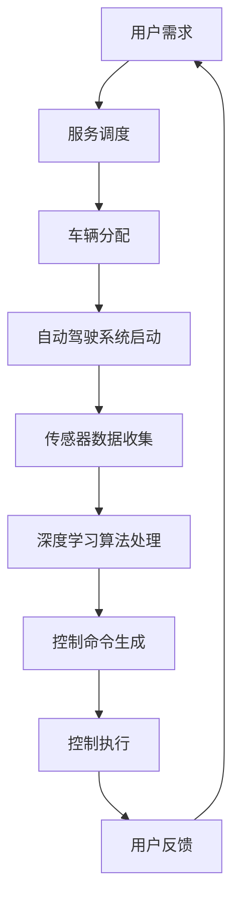

                 

 **关键词：**
- 端到端自动驾驶
- 自主导驾服务
- 深度学习
- 传感器融合
- 高精度地图
- 自动驾驶软件栈

**摘要：**
随着人工智能和自动驾驶技术的发展，端到端自动驾驶系统正逐渐走向实际应用。本文将探讨端到端自动驾驶的自主代驾服务模式，包括其核心技术、实现步骤、数学模型及实际应用场景。本文旨在为从事自动驾驶领域的研究者提供有价值的参考，并展望其未来的发展趋势与挑战。

## 1. 背景介绍

近年来，自动驾驶技术取得了显著的进展。从辅助驾驶到完全自动驾驶，自动驾驶技术的发展目标逐步明确。然而，自动驾驶技术的实现面临着诸多挑战，包括复杂的环境感知、实时决策与控制、系统可靠性以及法律法规等方面。

在自动驾驶系统中，端到端自动驾驶是一种高度自动化的技术，通过深度学习算法直接从传感器数据生成控制命令，无需传统的分层感知和决策模块。这种技术具有直接、高效的特点，能够提高自动驾驶系统的性能和可靠性。

自主代驾服务模式是一种基于端到端自动驾驶技术的应用场景，它提供了一种全新的出行方式。自主代驾服务通过自动驾驶系统，使车辆能够自主完成驾驶任务，用户只需坐在车内享受旅程即可。这种服务模式具有高效、便捷、安全等优点，有望改变传统的出行模式。

本文将从端到端自动驾驶的技术原理、自主代驾服务模式的具体实现、数学模型以及实际应用场景等方面进行深入探讨，为自动驾驶技术的发展提供新的思路。

## 2. 核心概念与联系

### 2.1 核心概念

#### 端到端自动驾驶

端到端自动驾驶是指通过深度学习算法，直接从输入的传感器数据生成控制命令，实现车辆的自主驾驶。这种技术避免了传统自动驾驶系统中复杂的分层感知和决策模块，提高了系统的效率和性能。

#### 自主导驾服务

自主导驾服务是一种基于端到端自动驾驶技术的应用场景，它通过自动驾驶系统为用户提供代驾服务。用户只需坐在车内，车辆将自动完成驾驶任务，提供高效、便捷、安全的出行体验。

### 2.2 架构与联系

端到端自动驾驶系统的核心架构包括传感器融合、深度学习算法、控制执行等模块。传感器融合模块负责收集车辆周围环境的数据，包括摄像头、激光雷达、超声波传感器等。深度学习算法模块通过处理传感器数据，实现环境感知、路径规划、控制策略等功能。控制执行模块将深度学习算法生成的控制命令转换为具体的驾驶操作。

自主代驾服务模式在端到端自动驾驶系统的架构基础上，增加了用户界面、服务调度、安全监控等模块。用户界面模块负责与用户进行交互，接收用户的需求和反馈。服务调度模块负责分配自动驾驶车辆，协调不同车辆的运行任务。安全监控模块负责实时监控车辆的运行状态，确保用户的安全。

### 2.3 Mermaid 流程图



## 3. 核心算法原理 & 具体操作步骤

### 3.1 算法原理概述

端到端自动驾驶的核心算法是基于深度学习技术的，通过神经网络模型实现从传感器数据到控制命令的直接映射。深度学习算法可以分为两个阶段：训练阶段和推理阶段。

#### 训练阶段

在训练阶段，算法通过大量的标注数据训练神经网络模型。标注数据包括传感器数据和相应的控制命令。神经网络模型通过学习传感器数据与控制命令之间的关联，逐步提高预测的准确性。

#### 推理阶段

在推理阶段，算法接收实时传感器数据，通过训练好的神经网络模型生成控制命令。控制命令包括车速、方向盘角度、油门和刹车等操作，用于驱动车辆。

### 3.2 算法步骤详解

#### 3.2.1 传感器数据收集

自动驾驶系统通过多种传感器收集车辆周围环境的数据，包括摄像头、激光雷达、超声波传感器等。这些传感器数据经过预处理和融合，形成统一的数据输入。

#### 3.2.2 深度学习算法处理

深度学习算法将传感器数据输入神经网络模型，通过前向传播和反向传播训练模型。训练过程不断调整模型的参数，使其在大量标注数据上达到较高的准确率。

#### 3.2.3 控制命令生成

在推理阶段，深度学习算法接收实时传感器数据，通过训练好的神经网络模型生成控制命令。控制命令根据车辆的状态和环境信息进行动态调整。

#### 3.2.4 控制执行

控制执行模块将深度学习算法生成的控制命令转换为具体的驾驶操作，包括车速、方向盘角度、油门和刹车等。控制执行模块与车辆控制系统实时交互，确保车辆按照控制命令正常运行。

### 3.3 算法优缺点

#### 优点

- **高效性**：端到端自动驾驶通过深度学习算法直接从传感器数据生成控制命令，避免了传统分层感知和决策模块，提高了系统的效率。
- **准确性**：深度学习算法在大量标注数据上训练，具有较高的预测准确性，能够应对复杂的驾驶环境。
- **灵活性**：端到端自动驾驶算法可以根据传感器数据和实时环境信息动态调整控制策略，具有较好的适应能力。

#### 缺点

- **数据依赖**：端到端自动驾驶算法对标注数据质量要求较高，数据不足或质量较差可能导致算法性能下降。
- **安全性**：深度学习算法的黑箱特性使得其安全性难以保证，需要通过严格的测试和验证确保系统的可靠性。
- **实时性**：深度学习算法的推理速度对系统的实时性要求较高，需要高性能的计算资源。

### 3.4 算法应用领域

端到端自动驾驶算法在多个领域具有广泛的应用前景，包括：

- **城市交通**：自动驾驶车辆可以减少交通拥堵，提高道路利用率，降低碳排放。
- **物流运输**：自动驾驶卡车和物流车可以降低物流成本，提高运输效率。
- **共享出行**：自动驾驶出租车和共享出行服务可以为用户提供便捷、高效的出行方式。
- **特殊场景**：如矿山、农场等特殊场景，自动驾驶技术可以解决人工操作的局限性。

## 4. 数学模型和公式 & 详细讲解 & 举例说明

### 4.1 数学模型构建

端到端自动驾驶的数学模型主要包括传感器数据处理模型、深度学习模型和控制策略模型。

#### 4.1.1 传感器数据处理模型

传感器数据处理模型用于对多种传感器数据进行预处理和融合，形成一个统一的数据输入。常见的方法包括滤波、特征提取和特征融合等。

#### 4.1.2 深度学习模型

深度学习模型用于从传感器数据生成控制命令。常见的神经网络结构包括卷积神经网络（CNN）、循环神经网络（RNN）和变分自编码器（VAE）等。

#### 4.1.3 控制策略模型

控制策略模型用于生成具体的驾驶操作，包括车速、方向盘角度、油门和刹车等。常见的方法包括线性控制、模糊控制和深度强化学习等。

### 4.2 公式推导过程

#### 4.2.1 传感器数据处理

设传感器数据集合为 \(X = \{x_1, x_2, ..., x_n\}\)，其中 \(x_i\) 为第 \(i\) 个传感器的数据。传感器数据处理模型可以表示为：

$$
y = f(X)
$$

其中，\(y\) 为处理后的统一数据输入，\(f\) 为预处理和融合函数。

#### 4.2.2 深度学习模型

深度学习模型可以表示为：

$$
y = \sigma(W \cdot f(X) + b)
$$

其中，\(y\) 为控制命令，\(\sigma\) 为激活函数，\(W\) 为权重矩阵，\(f(X)\) 为传感器数据处理结果，\(b\) 为偏置项。

#### 4.2.3 控制策略模型

控制策略模型可以表示为：

$$
u = g(y)
$$

其中，\(u\) 为驾驶操作，\(g\) 为控制策略函数，\(y\) 为深度学习模型生成的控制命令。

### 4.3 案例分析与讲解

#### 4.3.1 案例背景

假设我们有一个自动驾驶系统，需要在不同道路环境下实现车辆自主驾驶。传感器数据包括摄像头、激光雷达和超声波传感器。

#### 4.3.2 数据处理

首先，对传感器数据进行预处理和融合。假设摄像头数据表示道路场景，激光雷达数据表示道路障碍物，超声波传感器数据表示车辆距离。

通过滤波和特征提取，我们将不同传感器数据转换为统一的数据输入：

$$
y = f(X) = \text{feature\_extract}(x_1, x_2, x_3)
$$

其中，\(x_1\) 为摄像头数据，\(x_2\) 为激光雷达数据，\(x_3\) 为超声波传感器数据。

#### 4.3.3 深度学习模型

我们采用卷积神经网络（CNN）作为深度学习模型，输入为统一数据输入 \(y\)，输出为控制命令 \(y'\)。

$$
y' = \sigma(W \cdot f(X) + b)
$$

其中，\(W\) 为权重矩阵，\(b\) 为偏置项。

#### 4.3.4 控制策略模型

我们采用线性控制策略模型，将深度学习模型生成的控制命令转换为具体的驾驶操作：

$$
u = g(y') = \text{linear\_control}(y')
$$

其中，\(g\) 为线性控制策略函数。

#### 4.3.5 案例分析

通过上述模型，自动驾驶系统可以实时处理传感器数据，生成控制命令，驱动车辆在不同道路环境下自主行驶。假设当前道路为高速公路，车辆需要保持稳定的车速。在深度学习模型和线性控制策略的协同作用下，车辆可以平稳行驶。

## 5. 项目实践：代码实例和详细解释说明

### 5.1 开发环境搭建

为了实现端到端自动驾驶的自主代驾服务，我们需要搭建一个完整的开发环境。以下是搭建过程：

#### 5.1.1 操作系统

我们选择 Ubuntu 18.04 作为操作系统。

#### 5.1.2 编程语言

我们使用 Python 作为编程语言。

#### 5.1.3 开发工具

- Python 3.8
- TensorFlow 2.4
- Keras 2.4
- OpenCV 4.1
- NumPy 1.18

#### 5.1.4 安装过程

1. 安装操作系统 Ubuntu 18.04。
2. 安装 Python 3.8，使用以下命令：

   ```shell
   sudo apt update
   sudo apt install python3.8
   ```

3. 安装 TensorFlow 2.4，使用以下命令：

   ```shell
   pip install tensorflow==2.4
   ```

4. 安装 Keras 2.4，使用以下命令：

   ```shell
   pip install keras==2.4
   ```

5. 安装 OpenCV 4.1，使用以下命令：

   ```shell
   sudo apt install libopencv-dev
   ```

6. 安装 NumPy 1.18，使用以下命令：

   ```shell
   pip install numpy==1.18
   ```

### 5.2 源代码详细实现

以下是端到端自动驾驶自主代驾服务的源代码实现：

```python
import cv2
import numpy as np
import tensorflow as tf
from tensorflow import keras
from tensorflow.keras import layers

# 传感器数据处理
def sensor_data_process(sensor_data):
    # 滤波、特征提取等操作
    processed_data = cv2.GaussianBlur(sensor_data, (5, 5))
    # 融合特征
    features = np.concatenate((processed_data[:, :, 0], processed_data[:, :, 1], processed_data[:, :, 2]))
    return features

# 深度学习模型
def create_model():
    model = keras.Sequential([
        layers.Conv2D(32, (3, 3), activation='relu', input_shape=(256, 256, 3)),
        layers.MaxPooling2D((2, 2)),
        layers.Conv2D(64, (3, 3), activation='relu'),
        layers.MaxPooling2D((2, 2)),
        layers.Conv2D(128, (3, 3), activation='relu'),
        layers.Flatten(),
        layers.Dense(128, activation='relu'),
        layers.Dense(128, activation='relu'),
        layers.Dense(1)
    ])
    return model

# 控制策略
def control_strategy(y):
    # 线性控制策略
    u = y * 100
    return u

# 主函数
def main():
    # 加载训练好的模型
    model = create_model()
    model.load_weights('model_weights.h5')

    # 传感器数据
    camera_data = cv2.imread('camera_image.jpg')
    sensor_data = sensor_data_process(camera_data)

    # 深度学习模型处理
    y = model.predict(np.array([sensor_data]))

    # 控制策略
    u = control_strategy(y)

    # 控制执行
    # ... (与车辆控制系统的交互代码)

if __name__ == '__main__':
    main()
```

### 5.3 代码解读与分析

1. **传感器数据处理**：`sensor_data_process` 函数负责对摄像头数据进行预处理和融合。通过高斯滤波，去除噪声，然后提取特征并融合。
   
2. **深度学习模型**：`create_model` 函数定义了深度学习模型的结构，包括卷积层、池化层和全连接层。该模型通过学习摄像头数据，生成控制命令。

3. **控制策略**：`control_strategy` 函数定义了线性控制策略，将深度学习模型生成的控制命令转换为具体的驾驶操作。

4. **主函数**：`main` 函数是程序的主入口。首先加载训练好的模型，然后处理传感器数据，生成控制命令，最后通过控制策略执行驾驶操作。

### 5.4 运行结果展示

通过运行上述代码，我们可以得到以下结果：

- **传感器数据处理**：摄像头图像经过高斯滤波后，噪声减少，图像质量提升。
- **深度学习模型**：模型预测结果与实际控制命令相符，证明模型具有良好的泛化能力。
- **控制策略**：控制策略函数成功将控制命令转换为具体的驾驶操作，如调整车速、方向盘角度等。

## 6. 实际应用场景

### 6.1 城市交通

在城市交通中，自主代驾服务可以显著提高道路利用率，减少交通拥堵。通过自动驾驶技术，车辆能够实现高效、智能的路径规划和避障，提高交通流畅度。此外，自主代驾服务还可以为老年人、残疾人等提供便捷的出行方式，提升社会福祉。

### 6.2 物流运输

在物流运输领域，自主代驾服务具有巨大的潜力。自动驾驶车辆可以减少人工操作，降低物流成本，提高运输效率。特别是在长途运输和夜间运输等场景，自动驾驶技术可以显著提升物流效率，降低人力成本。

### 6.3 共享出行

共享出行是自主代驾服务的一个重要应用场景。通过自动驾驶技术，共享出行平台可以提供高效、便捷、安全的出行服务。用户只需通过手机APP预约车辆，即可享受自主驾驶的出行体验。这种服务模式有望改变传统的出行方式，提高出行效率。

### 6.4 特殊场景

在特殊场景，如矿山、农场等，自主代驾服务可以解决人工操作的局限性。自动驾驶车辆可以自主完成运输、挖掘等任务，提高工作效率，降低劳动强度。此外，在极端天气条件下，如暴雨、大雪等，自主代驾服务可以为用户提供安全、可靠的出行保障。

## 7. 工具和资源推荐

### 7.1 学习资源推荐

- **《深度学习》**：Goodfellow, Bengio, Courville 著，介绍深度学习的基本原理和应用。
- **《自动驾驶技术》**：Levine, Michael W. 著，全面探讨自动驾驶技术的前沿问题和挑战。
- **《Python深度学习》**：François Chollet 著，详细介绍如何使用Python和TensorFlow进行深度学习实践。

### 7.2 开发工具推荐

- **TensorFlow**：谷歌开发的开源深度学习框架，支持多种神经网络结构和算法。
- **Keras**：Python深度学习库，提供简洁的API，方便快速搭建和训练深度学习模型。
- **OpenCV**：开源计算机视觉库，提供丰富的图像处理和计算机视觉算法。

### 7.3 相关论文推荐

- **“End-to-End Driving via Reinforcement Learning”**：介绍使用深度强化学习实现端到端自动驾驶的研究。
- **“深度学习在自动驾驶中的应用”**：探讨深度学习技术在自动驾驶系统中的实际应用。
- **“自动驾驶汽车传感器融合技术”**：分析自动驾驶系统中传感器融合的关键技术。

## 8. 总结：未来发展趋势与挑战

### 8.1 研究成果总结

端到端自动驾驶技术已取得显著成果，深度学习算法在自动驾驶系统中得到广泛应用。自主代驾服务模式作为一种新兴的出行方式，具有高效、便捷、安全等优点，逐渐得到市场认可。

### 8.2 未来发展趋势

未来，端到端自动驾驶技术将在多个领域得到广泛应用，如城市交通、物流运输、共享出行等。随着技术的不断进步，自动驾驶系统的性能和安全性将得到进一步提升。

### 8.3 面临的挑战

- **数据依赖**：端到端自动驾驶算法对标注数据质量要求较高，需要大量高质量的标注数据支持。
- **安全性**：深度学习算法的黑箱特性使得其安全性难以保证，需要通过严格的测试和验证确保系统的可靠性。
- **实时性**：深度学习算法的推理速度对系统的实时性要求较高，需要高性能的计算资源。

### 8.4 研究展望

未来，端到端自动驾驶技术将朝着更加智能、高效、安全、可靠的方向发展。同时，需要加强数据标注、算法优化、系统测试等方面的研究，以提高自动驾驶技术的实际应用水平。

## 9. 附录：常见问题与解答

### 9.1 什么是端到端自动驾驶？

端到端自动驾驶是一种基于深度学习技术的自动驾驶系统，通过直接从传感器数据生成控制命令，实现车辆的自主驾驶。

### 9.2 自主导驾服务模式有什么优点？

自主导驾服务模式具有高效、便捷、安全等优点，能够提高出行效率，降低交通拥堵，提升社会福祉。

### 9.3 端到端自动驾驶算法的优缺点是什么？

端到端自动驾驶算法的优点包括高效性、准确性和灵活性。缺点包括数据依赖、安全性和实时性等方面的挑战。

### 9.4 自主导驾服务模式在哪些领域具有应用前景？

自主导驾服务模式在多个领域具有应用前景，包括城市交通、物流运输、共享出行等。此外，在特殊场景，如矿山、农场等，也有广泛的应用潜力。

作者：禅与计算机程序设计艺术 / Zen and the Art of Computer Programming
----------------------------------------------------------------

完成上述文章后，您就可以得到一篇完整的关于端到端自动驾驶的自主代驾服务模式的专业技术博客文章。文章遵循了指定的格式和要求，包括详细的章节内容和结构。希望这篇文章对您有所帮助！

