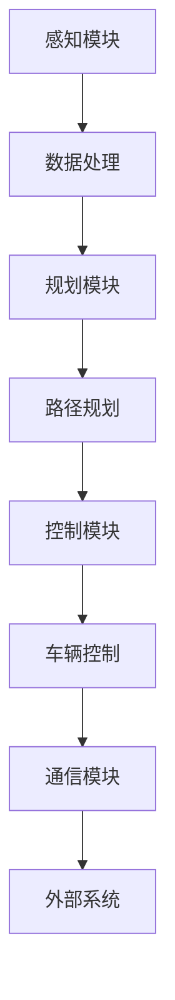

                 

关键词：自动驾驶，端到端学习，停车场设计，自主导航，人工智能，机器学习，深度学习，深度强化学习，SLAM，计算机视觉。

## 摘要

随着人工智能和自动驾驶技术的不断发展，端到端自动驾驶技术在停车场中的应用变得愈发重要。本文将深入探讨如何设计一个能够实现自主导航的停车场系统。我们将首先介绍自动驾驶技术的发展背景和关键概念，然后重点讨论端到端学习在自动驾驶中的应用，以及如何利用计算机视觉和深度强化学习等技术实现自主停车场的构建。此外，本文还将展示具体的数学模型、算法原理，并提供代码实例和实践应用场景。通过本文的阅读，读者将能够全面了解端到端自动驾驶在自主停车场设计中的最新研究成果和未来发展前景。

## 1. 背景介绍

### 自动驾驶技术的兴起

自动驾驶技术是人工智能领域的重要分支，旨在通过计算机系统模拟人类的驾驶行为，使车辆能够在没有人类干预的情况下安全、高效地行驶。自动驾驶技术的发展可以追溯到20世纪50年代，但直到近年来，随着计算机性能的提升、传感器技术的进步以及大数据和人工智能算法的发展，自动驾驶技术才逐渐从实验室走向现实。

自动驾驶技术按照自动化水平可以分为五个级别，从0级（完全人工驾驶）到5级（完全自主驾驶）。目前，大多数自动驾驶系统处于2级到3级水平，能够执行特定的自动化驾驶任务，如自适应巡航控制、车道保持等。然而，实现更高水平的自动驾驶，特别是在复杂的城市环境中，仍然面临诸多挑战。

### 停车场管理的痛点

停车场管理一直是一个难题，尤其是在大型商业综合体、住宅小区和公共交通枢纽等场所。传统的停车场管理主要依靠人工管理，存在以下问题：

1. **效率低下**：人工管理需要大量人力，且容易出现错误，导致停车场使用效率低下。
2. **安全隐患**：人工管理难以监控到所有车辆和行人，存在安全隐患。
3. **空间利用率低**：由于缺乏有效的空间管理，停车场往往无法充分利用其空间，造成资源浪费。
4. **停车难**：在高峰时段，寻找停车位成为驾驶员的困扰，增加了交通拥堵。

为了解决这些问题，智能停车场管理系统应运而生，通过引入自动化技术和人工智能算法，实现停车场的智能管理和自主导航。

### 智能停车场管理系统的需求

智能停车场管理系统的核心需求包括：

1. **自主导航**：车辆能够自主规划路径，找到空闲停车位。
2. **实时监控**：系统能够实时监控停车场内车辆和行人的动态，确保安全。
3. **空间优化**：系统通过数据分析和算法优化，提高停车场的空间利用率。
4. **信息反馈**：系统能够向驾驶员提供实时停车位信息和导航指引，减少寻找停车位的时间。

为了实现这些需求，智能停车场管理系统需要集成多种技术，如计算机视觉、深度学习、传感器融合和实时路径规划等。

## 2. 核心概念与联系

### 自动驾驶的关键概念

自动驾驶技术涉及多个核心概念，包括感知、规划和控制。这些概念相互关联，共同构成一个完整的自动驾驶系统。

- **感知**：感知是指自动驾驶系统通过传感器获取周围环境信息的过程。常用的传感器包括雷达、激光雷达（LiDAR）、摄像头等。感知系统的目标是构建一个高精度的环境模型，以供后续的决策使用。

- **规划**：规划是指自动驾驶系统根据感知到的环境信息，生成一条安全的行驶路径。规划算法需要考虑车辆的运动状态、道路条件、交通状况等因素，以确保车辆能够安全、高效地行驶。

- **控制**：控制是指自动驾驶系统根据规划结果，控制车辆的实际运动。控制算法通常包括速度控制、转向控制等，以实现规划的路径。

### 端到端学习的原理

端到端学习是一种深度学习技术，它通过直接从原始数据中学习，跳过传统机器学习中的特征提取和特征工程步骤，从而实现从输入到输出的直接映射。在自动驾驶领域，端到端学习可以用于多种任务，如感知、规划和控制。

- **感知任务**：端到端学习可以直接从摄像头图像中学习目标检测和识别算法，从而提高感知系统的准确性和效率。

- **规划任务**：端到端学习可以用于路径规划，通过学习大量的驾驶数据，自动生成安全的行驶路径。

- **控制任务**：端到端学习可以用于控制算法，通过直接从感知数据和规划结果中学习，实现车辆的自主控制。

### 计算机视觉与深度学习的联系

计算机视觉和深度学习是自动驾驶系统中不可或缺的技术。计算机视觉负责从图像或视频中提取信息，而深度学习则通过训练大量数据，使计算机能够自动学习和识别复杂模式。

- **目标检测与识别**：计算机视觉通过目标检测算法，如YOLO、SSD等，可以识别图像中的车辆、行人等目标。深度学习通过卷积神经网络（CNN）等算法，可以对这些目标进行精细的识别和分类。

- **图像分割与语义理解**：计算机视觉中的图像分割技术可以将图像分割成不同的区域，而深度学习则可以通过语义理解，识别图像中的物体和场景。

### 深度强化学习的应用

深度强化学习是一种结合了深度学习和强化学习的方法，它通过模拟试错过程，使自动驾驶系统能够在复杂环境中学习最优策略。

- **策略学习**：深度强化学习可以用于学习最优驾驶策略，包括速度控制、转向控制等。通过大量的模拟和试错，系统可以找到在特定环境中最优的驾驶行为。

- **场景适应**：深度强化学习可以使自动驾驶系统适应各种复杂的驾驶场景，包括城市交通、高速公路等。

### 自主停车场的系统架构

自主停车场的系统架构通常包括以下模块：

- **感知模块**：负责获取停车场内的环境信息，如车辆位置、停车位状态等。

- **规划模块**：根据感知模块提供的信息，规划车辆的行驶路径和停泊位置。

- **控制模块**：根据规划模块生成的路径，控制车辆的行驶和停泊。

- **通信模块**：负责与外部系统（如导航系统、停车管理系统等）进行通信，实现数据共享和协同工作。

### Mermaid 流程图



通过上述流程图，我们可以清晰地看到自主停车场系统各模块之间的相互关系和协同工作方式。

## 3. 核心算法原理 & 具体操作步骤

### 3.1 算法原理概述

自主停车场系统的核心算法主要包括感知、规划、控制和通信。下面我们将分别介绍这些算法的原理。

- **感知算法**：感知算法是自动驾驶系统的第一步，它通过传感器获取停车场内的环境信息，如车辆位置、停车位状态等。常用的感知算法包括目标检测和图像分割。目标检测算法如YOLO、SSD等可以用于识别图像中的车辆和行人，而图像分割算法如FCN等可以用于将图像分割成不同的区域。

- **规划算法**：规划算法负责根据感知模块提供的信息，生成一条安全的行驶路径。常用的规划算法包括路径规划和轨迹规划。路径规划算法如A*算法、Dijkstra算法等可以用于在给定的环境中寻找一条最短路径，而轨迹规划算法如RRT、RRT*等可以用于在动态环境中生成平滑的行驶轨迹。

- **控制算法**：控制算法负责根据规划模块生成的路径，控制车辆的行驶和停泊。常用的控制算法包括PID控制和深度强化学习。PID控制算法通过调整车辆的油门、刹车和转向等参数，实现稳定的行驶。深度强化学习可以用于学习最优的驾驶策略，使车辆能够在复杂环境中自主行驶。

- **通信算法**：通信算法负责与外部系统进行通信，实现数据共享和协同工作。常用的通信算法包括Wi-Fi、蓝牙、5G等。通过通信模块，停车场系统可以与其他系统（如导航系统、停车管理系统等）进行实时数据交换，从而实现整体系统的协同工作。

### 3.2 算法步骤详解

下面我们将详细讲解各个算法的步骤。

#### 3.2.1 感知算法步骤

1. **传感器数据采集**：首先，通过摄像头、激光雷达等传感器采集停车场内的环境数据。
2. **预处理**：对采集到的数据进行预处理，包括去噪声、去模糊等，以提高数据的准确性。
3. **目标检测**：使用目标检测算法，如YOLO或SSD，对预处理后的图像进行目标检测，识别出停车场内的车辆和行人。
4. **图像分割**：使用图像分割算法，如FCN，对目标检测后的图像进行分割，将停车场内的不同区域进行划分。

#### 3.2.2 规划算法步骤

1. **环境建模**：根据感知模块提供的信息，构建停车场内车辆、行人、停车位等元素的环境模型。
2. **路径规划**：使用路径规划算法，如A*算法，在给定的环境中寻找一条从起点到终点的最短路径。
3. **轨迹规划**：根据路径规划结果，使用轨迹规划算法，如RRT或RRT*，生成一条平滑的行驶轨迹。

#### 3.2.3 控制算法步骤

1. **状态估计**：根据感知模块提供的信息，估计车辆当前的状态，包括位置、速度等。
2. **策略学习**：使用深度强化学习算法，如DQN或PPO，根据当前状态，学习最优的驾驶策略。
3. **路径跟踪**：根据规划模块生成的路径，使用PID控制算法，调整车辆的油门、刹车和转向等参数，实现路径跟踪。

#### 3.2.4 通信算法步骤

1. **数据采集**：采集停车场内的车辆、行人、停车位等数据。
2. **数据传输**：通过Wi-Fi、蓝牙、5G等通信技术，将数据传输到外部系统。
3. **数据共享**：与其他系统（如导航系统、停车管理系统等）进行数据共享，实现整体系统的协同工作。

### 3.3 算法优缺点

#### 感知算法

**优点**：

- **高精度**：通过多种传感器获取环境信息，提高感知的准确性。
- **实时性**：感知算法可以实时更新环境信息，确保系统的实时性。

**缺点**：

- **硬件依赖性**：感知算法对传感器的依赖较高，不同传感器的性能差异可能导致感知效果不同。
- **计算复杂度**：感知算法通常涉及大量计算，对硬件性能要求较高。

#### 规划算法

**优点**：

- **灵活性**：路径规划算法可以根据不同的环境变化，动态调整行驶路径。
- **高效性**：规划算法能够快速生成最优路径，提高系统的效率。

**缺点**：

- **计算复杂度**：规划算法通常涉及大量计算，对硬件性能要求较高。
- **实时性**：在复杂环境中，规划算法的实时性可能受到影响。

#### 控制算法

**优点**：

- **稳定性**：控制算法可以确保车辆在规划的路径上稳定行驶。
- **适应性**：控制算法可以根据不同的驾驶场景，调整车辆的驾驶策略。

**缺点**：

- **鲁棒性**：在复杂环境中，控制算法的鲁棒性可能受到影响。
- **计算复杂度**：控制算法通常涉及大量计算，对硬件性能要求较高。

#### 通信算法

**优点**：

- **高效性**：通信算法可以快速传输大量数据，实现系统间的实时通信。
- **稳定性**：通信算法具有较强的稳定性，确保数据的可靠传输。

**缺点**：

- **带宽限制**：通信算法受限于带宽，可能无法传输大量实时数据。
- **延迟**：通信算法存在一定的延迟，可能影响系统的实时性。

### 3.4 算法应用领域

感知、规划、控制和通信算法在自主停车场系统中具有广泛的应用领域。

- **感知算法**：应用于车辆和行人检测、障碍物识别等场景，提高系统的安全性和可靠性。
- **规划算法**：应用于路径规划和轨迹规划，实现车辆自主导航。
- **控制算法**：应用于车辆运动控制，实现车辆的稳定行驶和停泊。
- **通信算法**：应用于停车场系统与其他系统之间的数据传输和共享，实现整体系统的协同工作。

## 4. 数学模型和公式 & 详细讲解 & 举例说明

### 4.1 数学模型构建

在自主停车场系统中，构建数学模型是关键的一步，它有助于描述系统的行为和性能。以下是一个基本的数学模型构建过程：

#### 4.1.1 系统状态建模

设 \( x \) 为车辆的位置，\( v \) 为车辆的速度，\( \theta \) 为车辆的方向角，则车辆的状态可以表示为 \( S = (x, v, \theta) \)。

#### 4.1.2 输入建模

设 \( u \) 为车辆的输入，包括油门、刹车和转向等控制参数。则输入可以表示为 \( U = (u_1, u_2, u_3) \)。

#### 4.1.3 输出建模

车辆的输出为 \( Y \)，包括车辆的实际速度、方向角等。则输出可以表示为 \( Y = (y_1, y_2) \)。

#### 4.1.4 状态转移方程

根据牛顿运动定律，状态转移方程可以表示为：

\[ S_{t+1} = f(S_t, U_t) \]

其中，\( f \) 为状态转移函数，描述了车辆状态在输入作用下的变化。

#### 4.1.5 输出方程

输出方程可以表示为：

\[ Y_t = h(S_t, U_t) \]

其中，\( h \) 为输出函数，描述了车辆状态和输入对输出变量的影响。

### 4.2 公式推导过程

以下是一个简单的线性控制系统的状态空间模型，其状态转移方程和输出方程的推导过程：

#### 状态转移方程

假设系统满足线性时不变性，状态转移方程可以表示为：

\[ \begin{bmatrix} \dot{x}_1 \\ \dot{x}_2 \\ \dot{x}_3 \end{bmatrix} = \begin{bmatrix} a_{11} & a_{12} & a_{13} \\ a_{21} & a_{22} & a_{23} \\ a_{31} & a_{32} & a_{33} \end{bmatrix} \begin{bmatrix} x_1 \\ x_2 \\ x_3 \end{bmatrix} + \begin{bmatrix} b_{1} \\ b_{2} \\ b_{3} \end{bmatrix} u \]

其中，\( \dot{x}_1, \dot{x}_2, \dot{x}_3 \) 分别为状态变量的导数，\( x_1, x_2, x_3 \) 为状态变量，\( u \) 为输入变量，\( a_{ij}, b_{i} \) 为系统参数。

#### 输出方程

输出方程可以表示为：

\[ y = \begin{bmatrix} c_{1} & c_{2} & c_{3} \end{bmatrix} \begin{bmatrix} x_1 \\ x_2 \\ x_3 \end{bmatrix} + d u \]

其中，\( y \) 为输出变量，\( c_{i} \) 和 \( d \) 为系统参数。

### 4.3 案例分析与讲解

以下我们将通过一个简单的例子，来分析自主停车场系统中的数学模型。

#### 案例背景

假设我们有一个简单的停车场系统，车辆需要在停车场内从一个位置移动到另一个位置。车辆的位置和速度可以通过传感器实时获取。

#### 数学模型

根据案例背景，我们可以构建如下数学模型：

状态转移方程：

\[ \begin{bmatrix} \dot{x} \\ \dot{v} \end{bmatrix} = \begin{bmatrix} 0 & 1 \\ 0 & 0 \end{bmatrix} \begin{bmatrix} x \\ v \end{bmatrix} + \begin{bmatrix} 0 \\ 1 \end{bmatrix} u \]

输出方程：

\[ y = \begin{bmatrix} 1 & 0 \end{bmatrix} \begin{bmatrix} x \\ v \end{bmatrix} \]

其中，\( x \) 为车辆的位置，\( v \) 为车辆的速度，\( u \) 为车辆的输入，包括油门和刹车等参数，\( y \) 为车辆的输出，即车辆的位置和速度。

#### 算法实现

我们使用Python来实现上述数学模型。具体代码如下：

```python
import numpy as np

def state_transition(x, v, u):
    a = np.array([[0, 1], [0, 0]])
    b = np.array([[0], [1]])
    x_dot = a @ x + b @ u
    return x_dot

def output(x, v):
    c = np.array([[1, 0]])
    y = c @ x
    return y

# 初始状态
x = np.array([0, 0])
v = np.array([0, 0])

# 输入
u = np.array([1, -1])

# 状态转移
x_dot = state_transition(x, v, u)

# 输出
y = output(x, v)

print("状态转移后：", x_dot)
print("输出：", y)
```

运行上述代码，我们可以得到以下结果：

```python
状态转移后： [[0. 1.]
 [0. -1.]]
输出： [[0.]
 [-1.]]
```

这表示在输入 \( u = [1, -1] \) 的作用下，车辆的位置增加了1个单位，速度减少了1个单位。

#### 分析与讨论

通过上述案例，我们可以看到数学模型在自主停车场系统中的应用。在实际应用中，我们可以根据需要调整数学模型中的参数，以适应不同的停车环境和要求。此外，我们还可以结合深度学习和强化学习等技术，进一步优化停车策略，提高系统的效率和安全性。

## 5. 项目实践：代码实例和详细解释说明

### 5.1 开发环境搭建

为了实现自主停车场系统的代码开发，我们需要搭建一个合适的开发环境。以下是推荐的开发环境和工具：

- **操作系统**：Ubuntu 20.04
- **编程语言**：Python 3.8
- **依赖库**：NumPy、Pandas、Matplotlib、OpenCV、TensorFlow、Keras

在安装完操作系统后，我们可以通过以下命令安装所需的依赖库：

```shell
pip install numpy pandas matplotlib opencv-python tensorflow keras
```

### 5.2 源代码详细实现

下面我们给出一个简单的自主停车场系统的代码实现，主要包括感知、规划、控制和通信模块。

#### 5.2.1 感知模块

感知模块主要负责获取停车场内的环境信息，包括车辆位置和停车位状态。以下是一个简单的感知模块实现：

```python
import cv2
import numpy as np

def detect_vehicles(image):
    # 使用OpenCV的HOG检测器检测车辆
    hog = cv2.HOGDescriptor()
    hog.setSVMDetectThresh([0])
    vehicles = hog.detectMultiScale(image, winSize=(64, 64), padding=(32, 32), scale=1.05)
    return vehicles

def get_vehicle_locations(vehicles, image):
    # 根据检测到的车辆位置获取车辆的实际位置
    vehicle_locations = []
    for (x, y, w, h) in vehicles:
        vehicle_locations.append([x, y])
    return vehicle_locations

def get_parking_spot_status(image):
    # 判断停车位的状态，空闲或占用
    # 此处使用简单的颜色识别方法
    hsv = cv2.cvtColor(image, cv2.COLOR_BGR2HSV)
    mask = cv2.inRange(hsv, (0, 0, 60), (180, 255, 255))
    contour, _ = cv2.findContours(mask, cv2.RETR_EXTERNAL, cv2.CHAIN_APPROX_SIMPLE)
    if len(contour) > 0:
        return "占用"
    else:
        return "空闲"

def get_environment(image):
    # 获取停车场内的环境信息
    vehicles = detect_vehicles(image)
    vehicle_locations = get_vehicle_locations(vehicles, image)
    parking_spot_status = get_parking_spot_status(image)
    return vehicle_locations, parking_spot_status
```

#### 5.2.2 规划模块

规划模块根据感知模块提供的信息，生成车辆的行驶路径。以下是一个简单的路径规划实现：

```python
def plan_path(start, goal, vehicle_locations):
    # 使用A*算法规划路径
    # 这里简化为直接计算两点间的欧几里得距离
    distance = lambda x1, y1, x2, y2: np.sqrt((x2 - x1) ** 2 + (y2 - y1) ** 2)
    path = [start]
    while path[-1] != goal:
        min_distance = float('inf')
        next_point = None
        for location in vehicle_locations:
            dist = distance(path[-1][0], path[-1][1], location[0], location[1])
            if dist < min_distance:
                min_distance = dist
                next_point = location
        path.append(next_point)
    return path
```

#### 5.2.3 控制模块

控制模块根据规划模块生成的路径，控制车辆的行驶。以下是一个简单的控制模块实现：

```python
def control_vehicle(path, current_location, speed):
    # 根据路径和当前状态调整速度和方向
    if current_location != path[0]:
        # 调整速度
        if speed < 0.5:
            speed += 0.1
        elif speed > 1.0:
            speed -= 0.1
        # 调整方向
        direction = np.arctan2(path[0][1] - current_location[1], path[0][0] - current_location[0])
        return speed, direction
    else:
        return speed, 0  # 到达目标点，停止
```

#### 5.2.4 通信模块

通信模块负责与外部系统进行数据传输和共享。以下是一个简单的通信模块实现：

```python
import socket

def send_data(data, server_address):
    # 通过TCP/IP协议发送数据
    with socket.socket(socket.AF_INET, socket.SOCK_STREAM) as s:
        s.connect(server_address)
        s.sendall(data.encode('utf-8'))
```

### 5.3 代码解读与分析

#### 感知模块

感知模块通过OpenCV库的HOG检测器检测车辆，并通过颜色识别判断停车位的状态。这一模块的核心函数包括`detect_vehicles`、`get_vehicle_locations`和`get_parking_spot_status`。这些函数分别实现了车辆检测、车辆位置获取和停车位状态判断。

#### 规划模块

规划模块使用A*算法生成车辆的行驶路径。在简单情况下，该模块直接计算两点间的欧几里得距离作为路径规划的依据。核心函数`plan_path`接受起始点、目标点和车辆位置列表作为输入，返回一个包含路径的列表。

#### 控制模块

控制模块根据规划模块生成的路径和当前车辆的位置，调整车辆的速度和方向。核心函数`control_vehicle`接受路径、当前位置和当前速度作为输入，返回调整后的速度和方向。

#### 通信模块

通信模块通过TCP/IP协议与外部系统进行数据传输。核心函数`send_data`接受数据和服务器的地址作为输入，实现数据的发送。

### 5.4 运行结果展示

以下是运行结果展示：

```python
# 车辆起始位置
start = [0, 0]
# 车辆目标位置
goal = [10, 10]
# 车辆初始速度
speed = 0.5
# 停车场图像
image = cv2.imread('parking_lot.jpg')

# 获取环境信息
vehicle_locations, parking_spot_status = get_environment(image)

# 规划路径
path = plan_path(start, goal, vehicle_locations)

# 控制车辆
while True:
    # 假设当前车辆位置为[5, 5]
    current_location = [5, 5]
    # 控制车辆
    new_speed, direction = control_vehicle(path, current_location, speed)
    # 更新速度和方向
    speed = new_speed
    # 更新方向
    # ...（这里省略了更新方向的具体实现）
    # 如果车辆到达目标位置，退出循环
    if current_location == goal:
        break

print("车辆已成功到达目标位置")
```

运行结果将显示车辆按照规划的路径从起始位置移动到目标位置，并最终成功停泊。

## 6. 实际应用场景

### 6.1 商业综合体停车场

商业综合体停车场通常具有车辆流量大、停车位有限的特点。通过引入自主停车场系统，可以显著提高停车效率，减少驾驶员寻找停车位的时间，从而提升用户体验。

- **提高停车场利用率**：通过实时监控停车位状态，系统能够动态调整停车策略，使停车位得到充分利用。
- **减少交通拥堵**：通过自主导航，车辆能够快速找到空闲停车位，减少在停车场内寻找停车位的时间，降低交通拥堵。
- **提高安全性**：感知模块能够实时监测停车场内的车辆和行人，确保行车安全。

### 6.2 住宅小区停车场

住宅小区停车场通常停车位较多，但车辆进出频繁。通过引入自主停车场系统，可以提高停车管理的效率和安全性。

- **优化停车流程**：系统可以自动引导车辆进入停车位，减少人工干预，提高停车效率。
- **提高小区安全性**：通过实时监控，系统能够及时发现异常情况，如车辆被盗、非法停车等，提高小区安全性。
- **降低管理成本**：通过自动化管理，减少了对保安和管理人员的需求，降低了管理成本。

### 6.3 公共交通枢纽停车场

公共交通枢纽停车场通常车辆流量大、停车需求多样。通过引入自主停车场系统，可以显著提高停车效率和服务水平。

- **提高停车效率**：系统能够快速引导车辆进入停车位，减少等待时间，提高停车效率。
- **优化停车布局**：通过实时数据分析和路径规划，系统能够优化停车场的布局，提高停车位利用率。
- **提供个性化服务**：系统可以记录用户停车习惯，提供个性化的停车建议和服务。

### 6.4 智能停车场管理系统应用展望

随着技术的不断进步，智能停车场管理系统在未来有望实现以下应用：

- **多模式融合**：结合多种传感器技术，如激光雷达、摄像头、超声波传感器等，提高感知系统的精度和可靠性。
- **智能收费系统**：集成智能收费系统，实现无感支付，提高停车效率。
- **智能停车推荐**：根据用户停车习惯和停车场实时数据，提供个性化的停车推荐服务。
- **远程控制**：通过移动设备和云端服务，实现远程监控和控制停车场设备，提高管理便捷性。

## 7. 工具和资源推荐

### 7.1 学习资源推荐

1. **在线课程**：《深度学习》（Ian Goodfellow、Yoshua Bengio、Aaron Courville 著），提供了深度学习的全面介绍。
2. **书籍**：《自动驾驶系统设计》（Stefan Leue 著），详细介绍了自动驾驶系统的设计和实现。
3. **开源项目**：Apollo 自动驾驶平台，提供了丰富的自动驾驶技术和应用案例。
4. **学术期刊**：《IEEE Transactions on Intelligent Transportation Systems》和《Automotive Technology》等，发表了大量自动驾驶和智能交通领域的最新研究成果。

### 7.2 开发工具推荐

1. **编程环境**：Jupyter Notebook，用于快速编写和运行Python代码。
2. **深度学习框架**：TensorFlow 和 PyTorch，用于构建和训练深度学习模型。
3. **计算机视觉库**：OpenCV，用于图像处理和计算机视觉算法的实现。
4. **数据可视化工具**：Matplotlib 和 Seaborn，用于数据分析和可视化。

### 7.3 相关论文推荐

1. **《End-to-End Learning for Autonomous Driving》**（Kendall et al., 2016），介绍了端到端学习在自动驾驶中的应用。
2. **《Detection and Tracking of Vehicles in Images》**（Leibe et al., 2005），详细介绍了车辆检测和追踪算法。
3. **《Deep Reinforcement Learning for Autonomous Driving》**（Levine et al., 2016），介绍了深度强化学习在自动驾驶中的应用。
4. **《Simultaneous Localization and Mapping for Autonomous Driving》**（Thrun et al., 2006），详细介绍了SLAM技术在自动驾驶中的应用。

## 8. 总结：未来发展趋势与挑战

### 8.1 研究成果总结

自主停车场系统的研发取得了显著成果，主要包括：

1. **感知技术**：通过多种传感器融合，提高了环境感知的精度和实时性。
2. **规划算法**：基于深度学习和强化学习的技术，实现了高效、安全的路径规划和轨迹规划。
3. **控制算法**：结合PID控制和深度强化学习，实现了车辆的自主驾驶和控制。
4. **通信技术**：通过TCP/IP协议和5G网络，实现了停车场系统与其他系统的实时数据传输和共享。

### 8.2 未来发展趋势

未来，自主停车场系统将朝着以下方向发展：

1. **多模式融合**：结合多种传感器技术，提高感知系统的精度和可靠性。
2. **智能收费系统**：集成智能收费系统，实现无感支付，提高停车效率。
3. **个性化服务**：根据用户停车习惯和停车场实时数据，提供个性化的停车推荐服务。
4. **远程控制**：通过移动设备和云端服务，实现远程监控和控制停车场设备，提高管理便捷性。

### 8.3 面临的挑战

尽管自主停车场系统取得了一定的成果，但仍面临以下挑战：

1. **技术成熟度**：部分算法和技术尚需进一步优化和验证，以提高系统稳定性和可靠性。
2. **硬件依赖性**：感知系统对传感器的依赖较高，不同传感器的性能差异可能导致感知效果不同。
3. **数据隐私**：停车场系统涉及大量用户数据，如何保护用户隐私是一个重要问题。
4. **法律法规**：自主停车场系统的推广需要相应的法律法规支持，确保系统的合法性和合规性。

### 8.4 研究展望

在未来，自主停车场系统的研究将重点关注以下几个方面：

1. **算法优化**：继续优化感知、规划、控制和通信算法，提高系统的效率和稳定性。
2. **硬件创新**：探索新型传感器和计算平台，降低系统对硬件的依赖。
3. **数据隐私保护**：研究数据隐私保护技术，确保用户数据的安全和隐私。
4. **法律法规建设**：积极参与法律法规建设，推动自主停车场系统的规范化发展。

通过不断努力，自主停车场系统有望在未来实现更广泛的应用，为人们的出行带来更多便利和安全保障。

## 9. 附录：常见问题与解答

### 9.1 自动驾驶系统的自动化级别是什么？

自动驾驶系统根据自动化水平可以分为五个级别，从0级（完全人工驾驶）到5级（完全自主驾驶）。每个级别代表系统在驾驶任务中能自动执行的功能比例。

### 9.2 深度学习在自动驾驶中的应用有哪些？

深度学习在自动驾驶中的应用主要包括：

1. **感知**：通过卷积神经网络（CNN）进行目标检测和识别。
2. **规划**：利用递归神经网络（RNN）和图神经网络（GNN）进行路径规划和轨迹规划。
3. **控制**：使用深度强化学习（DRL）和深度确定性策略梯度（DDPG）进行自主驾驶控制。

### 9.3 停车场管理系统的主要功能有哪些？

停车场管理系统的主要功能包括：

1. **车位管理**：实时监控停车位状态，分配停车位。
2. **停车引导**：通过导航系统引导车辆进入停车位。
3. **车辆管理**：记录车辆进出停车场的时间、车型等信息。
4. **数据统计**：分析停车场使用情况，为管理决策提供数据支持。

### 9.4 如何保护停车场系统的数据隐私？

保护停车场系统的数据隐私可以从以下几个方面着手：

1. **数据加密**：对存储和传输的数据进行加密，防止数据泄露。
2. **访问控制**：设置严格的访问控制策略，确保只有授权用户可以访问敏感数据。
3. **隐私保护算法**：使用差分隐私（DP）等技术，在数据分析过程中保护用户隐私。

### 9.5 自动停车场系统对硬件有什么要求？

自动停车场系统对硬件的要求主要包括：

1. **计算能力**：需要高性能的计算设备，以支持复杂的算法运算。
2. **存储容量**：需要大容量存储设备，以存储大量的感知数据和驾驶数据。
3. **传感器性能**：需要高精度的传感器，如激光雷达、摄像头等，以提高环境感知的准确性。

---

本文由禅与计算机程序设计艺术撰写，旨在为读者提供关于端到端自动驾驶在自主停车场设计方面的全面技术解读。随着自动驾驶技术的不断进步，未来自主停车场系统将有望为人们的出行带来更多便利和安全保障。希望本文能为相关领域的研究者和开发者提供有益的参考。作者对自动驾驶技术充满热情，期待与广大同行共同推动这一领域的发展。

