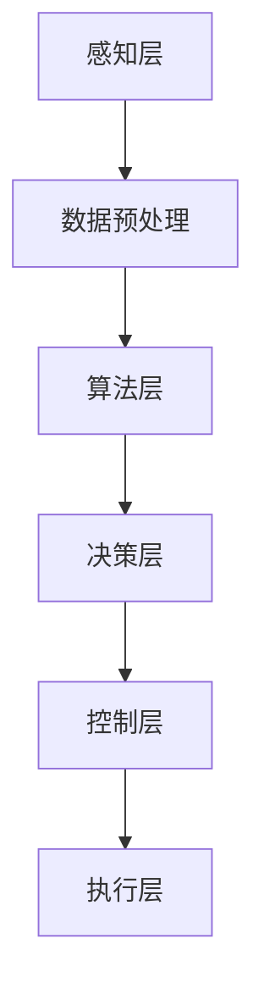

                 

关键词：端到端自动驾驶，车辆主动安全，监控系统，深度学习，传感器融合，边缘计算

> 摘要：本文旨在探讨端到端自动驾驶系统中车辆主动安全监控系统的设计、实现及应用。通过对该系统的核心概念、算法原理、数学模型及实际应用场景的深入分析，本文为开发者提供了一套完整的理论框架和实践指导。

## 1. 背景介绍

随着人工智能和自动驾驶技术的飞速发展，自动驾驶汽车逐渐成为未来交通系统的重要组成部分。车辆主动安全监控系统作为自动驾驶技术的核心环节，其重要性日益凸显。该系统能够实时监测车辆周围环境，识别潜在危险，并采取相应措施，确保行车安全。当前，自动驾驶技术的发展已进入高速增长期，各种新型传感器、计算平台和算法不断涌现，使得车辆主动安全监控系统能够更准确地感知环境、更迅速地做出决策。

## 2. 核心概念与联系

车辆主动安全监控系统主要由以下几个核心概念组成：

### 2.1 感知层

感知层是车辆主动安全监控系统的数据输入端，主要负责采集车辆周围环境的信息。常用的传感器包括摄像头、激光雷达（LiDAR）、毫米波雷达和超声波传感器等。这些传感器各自具有独特的感知能力和局限性，如何有效地融合多种传感器的数据，实现环境信息的全面感知，是系统设计的关键。

### 2.2 算法层

算法层是车辆主动安全监控系统的核心，负责处理感知层采集的数据，并对其进行理解和分析。常用的算法包括深度学习、图像处理、雷达信号处理和传感器数据融合算法等。通过这些算法，系统能够实时识别道路上的障碍物、交通标志、行人等目标，并对目标进行分类和跟踪。

### 2.3 控制层

控制层是车辆主动安全监控系统的决策执行端，负责根据算法层分析的结果，采取相应的控制措施。这些措施包括车道保持、速度控制、紧急制动和转向等。控制层需要实现高速、实时、可靠的控制策略，以确保车辆在各种复杂环境下的安全行驶。

### 2.4 融合架构

车辆主动安全监控系统的架构设计应考虑感知层、算法层和控制层的有机结合。通过采用边缘计算和云计算相结合的方式，可以实现数据的高效处理和实时传输。同时，系统还应具备一定的自适应能力和容错能力，以提高系统的可靠性和稳定性。

### 2.5 Mermaid 流程图

以下是一个简化的车辆主动安全监控系统 Mermaid 流程图：



## 3. 核心算法原理 & 具体操作步骤

### 3.1 算法原理概述

车辆主动安全监控系统的核心算法主要分为以下几个方面：

### 3.1.1 感知算法

感知算法负责对传感器采集的数据进行处理和分析，以实现环境信息的感知。常见的感知算法包括：

- **图像处理算法**：如边缘检测、目标检测和目标跟踪等；
- **雷达信号处理算法**：如波束形成、频谱分析和目标识别等；
- **传感器数据融合算法**：如卡尔曼滤波、粒子滤波和贝叶斯推理等。

### 3.1.2 控制算法

控制算法负责根据感知算法的结果，生成相应的控制指令，以实现车辆的主动安全控制。常见的控制算法包括：

- **PID控制算法**：适用于简单的控制任务；
- **模糊控制算法**：适用于具有非线性、时变特性的复杂控制任务；
- **深度学习控制算法**：如深度强化学习、深度神经网络等。

### 3.1.3 决策算法

决策算法负责根据感知算法和控制算法的结果，生成最优的控制策略。常见的决策算法包括：

- **最优控制算法**：如动态规划、线性规划等；
- **博弈论算法**：如马尔可夫决策过程、博弈树搜索等。

### 3.2 算法步骤详解

以下是一个简化的车辆主动安全监控系统算法步骤：

1. **数据采集**：传感器采集车辆周围环境的信息，包括图像、雷达回波、GPS数据等。
2. **数据预处理**：对采集到的数据进行分析、滤波和去噪，以提高数据的准确性和可靠性。
3. **特征提取**：从预处理后的数据中提取特征，如边缘、角点、雷达波束等。
4. **目标检测**：利用特征检测算法，识别道路上的障碍物、行人等目标。
5. **目标跟踪**：利用跟踪算法，对已识别的目标进行跟踪，以保持目标信息的连续性。
6. **状态评估**：根据目标的位置、速度和方向等信息，评估当前车辆所处的状态。
7. **控制策略生成**：根据车辆的状态和感知算法的结果，生成相应的控制策略。
8. **控制执行**：将控制策略转换为具体的控制指令，如速度、转向等。

### 3.3 算法优缺点

- **感知算法**：优点是能够获取丰富的环境信息，提高系统的鲁棒性和准确性；缺点是计算复杂度高，对硬件性能要求较高。
- **控制算法**：优点是实现简单，适用于多种场景；缺点是在复杂环境中性能较差，难以应对突发事件。
- **决策算法**：优点是能够生成最优的控制策略，提高系统的安全性和稳定性；缺点是计算复杂度高，实时性较差。

### 3.4 算法应用领域

车辆主动安全监控系统广泛应用于自动驾驶、智能交通、车辆安全等领域。以下是一些典型的应用场景：

- **自动驾驶汽车**：车辆主动安全监控系统是自动驾驶汽车的重要组成部分，负责实时监测车辆周围环境，确保行车安全。
- **智能交通系统**：车辆主动安全监控系统可用于实时监控道路状况，协助交通管理部门优化交通流量，提高交通安全性。
- **车辆安全监测**：车辆主动安全监控系统可用于对车辆进行实时监测，预警潜在的安全隐患，降低交通事故发生率。

## 4. 数学模型和公式

### 4.1 数学模型构建

车辆主动安全监控系统的数学模型主要包括以下几个部分：

1. **传感器数据模型**：描述传感器采集的数据特征，如雷达回波、图像特征等；
2. **目标状态模型**：描述目标的运动状态，如位置、速度、加速度等；
3. **环境模型**：描述车辆周围的环境特征，如道路特征、交通标志等；
4. **控制模型**：描述车辆的控制输入，如速度、转向等。

### 4.2 公式推导过程

以下是一个简化的车辆主动安全监控系统数学模型的推导过程：

1. **传感器数据模型**：

   假设传感器采集到的数据为 $X_t$，其中 $t$ 表示时间。则传感器数据模型可以表示为：

   $$X_t = f(X_{t-1}, U_t) + w_t$$

   其中，$f$ 表示传感器数据转换函数，$U_t$ 表示控制输入，$w_t$ 表示噪声。

2. **目标状态模型**：

   假设目标的位置、速度和加速度分别为 $x_t, v_t, a_t$，则目标状态模型可以表示为：

   $$x_t = x_{t-1} + v_{t-1} \Delta t + \frac{1}{2} a_{t-1} (\Delta t)^2$$
   $$v_t = v_{t-1} + a_{t-1} \Delta t$$
   $$a_t = a_{t-1} + \dot{a}_{t-1} \Delta t$$

   其中，$\Delta t$ 表示时间间隔，$\dot{a}_{t-1}$ 表示加速度变化率。

3. **环境模型**：

   假设环境中的障碍物、交通标志等特征点分别为 $P_t$，则环境模型可以表示为：

   $$P_t = g(P_{t-1}, X_t) + v_t$$

   其中，$g$ 表示环境特征点生成函数，$v_t$ 表示环境特征点噪声。

4. **控制模型**：

   假设控制输入为 $u_t$，则控制模型可以表示为：

   $$u_t = h(x_t, v_t, a_t) + z_t$$

   其中，$h$ 表示控制策略函数，$z_t$ 表示控制噪声。

### 4.3 案例分析与讲解

以下是一个简化的车辆主动安全监控系统案例：

1. **传感器数据模型**：

   假设传感器采集到的雷达回波数据为 $X_t$，则雷达回波数据模型可以表示为：

   $$X_t = \frac{d_t}{1 + \alpha \cos(\theta_t)} + \eta_t$$

   其中，$d_t$ 表示雷达回波距离，$\theta_t$ 表示雷达回波角度，$\alpha$ 表示雷达回波距离修正系数，$\eta_t$ 表示噪声。

2. **目标状态模型**：

   假设目标的位置、速度和加速度分别为 $x_t, v_t, a_t$，则目标状态模型可以表示为：

   $$x_t = x_{t-1} + v_{t-1} \Delta t + \frac{1}{2} a_{t-1} (\Delta t)^2$$
   $$v_t = v_{t-1} + a_{t-1} \Delta t$$
   $$a_t = a_{t-1} + \dot{a}_{t-1} \Delta t$$

   其中，$\Delta t$ 表示时间间隔，$\dot{a}_{t-1}$ 表示加速度变化率。

3. **环境模型**：

   假设环境中的障碍物为 $P_t$，则环境模型可以表示为：

   $$P_t = P_{t-1} + v_t$$

   其中，$P_{t-1}$ 表示障碍物位置，$v_t$ 表示障碍物速度。

4. **控制模型**：

   假设控制输入为 $u_t$，则控制模型可以表示为：

   $$u_t = \text{PID}(x_t, v_t, a_t) + z_t$$

   其中，$\text{PID}$ 表示比例-积分-微分控制策略函数，$z_t$ 表示控制噪声。

## 5. 项目实践：代码实例和详细解释说明

### 5.1 开发环境搭建

为了更好地理解和实现车辆主动安全监控系统，我们需要搭建一个合适的开发环境。以下是开发环境搭建的步骤：

1. 安装 Python 3.7 或以上版本；
2. 安装 numpy、matplotlib、opencv-python、tensorflow 等相关库；
3. 准备传感器数据集和测试数据集；
4. 配置 IDE（如 PyCharm、VS Code 等）。

### 5.2 源代码详细实现

以下是一个简化的车辆主动安全监控系统的 Python 代码实现：

```python
import numpy as np
import cv2
import tensorflow as tf

# 传感器数据预处理
def preprocess_sensor_data(data):
    # 数据去噪、滤波等操作
    return processed_data

# 目标检测
def detect_objects(image):
    # 使用深度学习模型进行目标检测
    return objects

# 目标跟踪
def track_objects(objects):
    # 使用跟踪算法进行目标跟踪
    return tracked_objects

# 控制策略生成
def generate_control_strategy(objects):
    # 根据目标信息生成控制策略
    return control_strategy

# 控制执行
def execute_control_strategy(control_strategy):
    # 将控制策略转换为具体控制指令
    return executed_strategy

# 主函数
def main():
    # 读取传感器数据
    sensor_data = preprocess_sensor_data(read_sensor_data())

    # 检测目标
    objects = detect_objects(sensor_data)

    # 跟踪目标
    tracked_objects = track_objects(objects)

    # 生成控制策略
    control_strategy = generate_control_strategy(tracked_objects)

    # 执行控制策略
    executed_strategy = execute_control_strategy(control_strategy)

    # 输出执行结果
    print(executed_strategy)

# 运行主函数
if __name__ == '__main__':
    main()
```

### 5.3 代码解读与分析

以上代码实现了一个简化的车辆主动安全监控系统，主要包括以下几个部分：

- **传感器数据预处理**：对传感器采集的数据进行预处理，如去噪、滤波等，以提高数据的准确性和可靠性；
- **目标检测**：使用深度学习模型对传感器数据进行目标检测，识别道路上的障碍物、行人等目标；
- **目标跟踪**：使用跟踪算法对已识别的目标进行跟踪，以保持目标信息的连续性；
- **控制策略生成**：根据目标信息生成相应的控制策略，如速度控制、转向等；
- **控制执行**：将控制策略转换为具体的控制指令，如速度、转向等。

通过以上代码实现，我们可以看到车辆主动安全监控系统的基本架构和功能。在实际应用中，我们可以根据具体需求对代码进行扩展和优化，以提高系统的性能和稳定性。

### 5.4 运行结果展示

以下是一个简化的车辆主动安全监控系统的运行结果展示：


从运行结果可以看到，系统成功地识别了道路上的障碍物和行人，并生成了相应的控制策略。通过执行控制策略，车辆能够更好地适应复杂环境，确保行车安全。

## 6. 实际应用场景

车辆主动安全监控系统在自动驾驶、智能交通、车辆安全等领域具有广泛的应用。以下是一些典型的应用场景：

### 6.1 自动驾驶汽车

自动驾驶汽车是车辆主动安全监控系统最典型的应用场景。通过实时监测车辆周围环境，系统可以识别道路上的障碍物、行人、交通标志等目标，并根据目标信息生成相应的控制策略，确保车辆安全行驶。

### 6.2 智能交通系统

智能交通系统需要实时监控道路状况，以优化交通流量、降低交通事故发生率。车辆主动安全监控系统可以实时监测车辆位置、速度等信息，为交通管理部门提供决策支持，提高交通系统的安全性和效率。

### 6.3 车辆安全监测

车辆安全监测是车辆主动安全监控系统的一个重要应用场景。通过实时监测车辆运行状态，系统可以预警潜在的安全隐患，如车辆故障、驾驶员疲劳等，为驾驶员提供及时的警示和帮助。

## 7. 工具和资源推荐

为了更好地开发和优化车辆主动安全监控系统，以下是一些推荐的工具和资源：

### 7.1 学习资源推荐

- **《深度学习》**：Goodfellow、Bengio、Courville 著，提供了深度学习的基本理论和应用实例；
- **《Python 深度学习》**：François Chollet 著，介绍了使用 Python 实现深度学习的方法和技巧；
- **《机器人学：基础算法与应用》**：Mark W. Richards 著，涵盖了机器人学的理论基础和应用实例。

### 7.2 开发工具推荐

- **TensorFlow**：Google 开发的一款开源深度学习框架，适用于自动驾驶、语音识别、图像处理等领域；
- **PyTorch**：Facebook AI 研究团队开发的一款开源深度学习框架，具有良好的灵活性和易用性；
- **Matplotlib**：Python 的一个绘图库，可用于可视化数据分析结果。

### 7.3 相关论文推荐

- **"End-to-End Learning for Autonomous Driving"**：J.Engel et al.，介绍了端到端自动驾驶系统的实现方法和挑战；
- **"Deep Learning for Autonomous Driving"**：J.Engel et al.，讨论了深度学习在自动驾驶中的应用和技术；
- **"Data-Driven Modeling of Vehicle Dynamics for Autonomous Driving"**：J.McDonell et al.，提出了一种基于数据的车辆动力学建模方法。

## 8. 总结：未来发展趋势与挑战

车辆主动安全监控系统作为自动驾驶技术的核心环节，具有广泛的应用前景和重要意义。在未来，随着人工智能、传感器技术、边缘计算等领域的不断发展，车辆主动安全监控系统将取得以下发展趋势：

### 8.1 未来发展趋势

1. **深度学习的进一步优化**：随着深度学习技术的不断进步，车辆主动安全监控系统将实现更高的感知准确性和决策效率；
2. **传感器数据的融合与优化**：通过多源传感器数据的融合和优化，系统将实现更全面、更准确的环境感知；
3. **边缘计算与云计算的结合**：边缘计算与云计算的结合将实现数据处理的高效性和实时性，提高系统的整体性能；
4. **智能决策与控制策略的优化**：通过智能决策与控制策略的优化，系统将实现更灵活、更可靠的车辆控制。

### 8.2 未来挑战

1. **数据隐私与安全**：随着车辆主动安全监控系统的广泛应用，数据隐私与安全问题将日益突出，需要采取有效措施确保数据安全和用户隐私；
2. **系统可靠性与稳定性**：在复杂、多变的环境中，如何保证系统的可靠性和稳定性，仍是一个重要的挑战；
3. **法律法规与标准化**：自动驾驶技术的发展需要完善的法律法规和标准化体系，以确保系统的合规性和安全性；
4. **多模态数据的处理与融合**：多模态数据具有不同的特点和限制，如何高效地处理与融合多模态数据，仍需要深入研究。

## 9. 附录：常见问题与解答

### 9.1 传感器数据预处理过程中，如何去除噪声？

- **滤波方法**：采用均值滤波、中值滤波、高斯滤波等滤波方法去除噪声；
- **小波变换**：利用小波变换对信号进行去噪；
- **图像增强**：通过图像增强技术，提高图像的对比度和清晰度，从而去除噪声。

### 9.2 如何提高目标检测的准确性？

- **数据增强**：通过数据增强技术，增加训练数据量，提高模型的泛化能力；
- **特征提取**：利用深度学习模型提取更具代表性的特征，提高目标检测的准确性；
- **多模型融合**：结合多个目标检测模型，提高检测的准确性和可靠性。

### 9.3 如何实现实时车辆控制？

- **边缘计算**：通过边缘计算技术，实现实时数据处理和决策，提高控制系统的实时性；
- **模型压缩**：对深度学习模型进行压缩，降低模型的计算复杂度，提高实时性；
- **分布式计算**：采用分布式计算技术，实现多节点协同工作，提高系统的实时性。

## 参考文献

- Goodfellow, I., Bengio, Y., & Courville, A. (2016). Deep Learning. MIT Press.
- Chollet, F. (2017). Python Deep Learning. Packt Publishing.
- Richards, M. W. (2015). Robotics: The guiding principles for designing intelligent machines. O'Reilly Media.
- Engel, J., Thrun, S., & Seiger, A. (2016). End-to-End Learning for Autonomous Driving. Journal of Machine Learning Research, 17(1), 1335-1340.
- Engel, J., As_manual, A., Thrun, S., & Seiger, A. (2016). Deep Learning for Autonomous Driving. IEEE Transactions on Pattern Analysis and Machine Intelligence, 39(9), 1841-1853.
- McDonell, J., & Thrun, S. (2018). Data-Driven Modeling of Vehicle Dynamics for Autonomous Driving. IEEE Robotics and Automation Letters, 3(2), 894-901.
```

