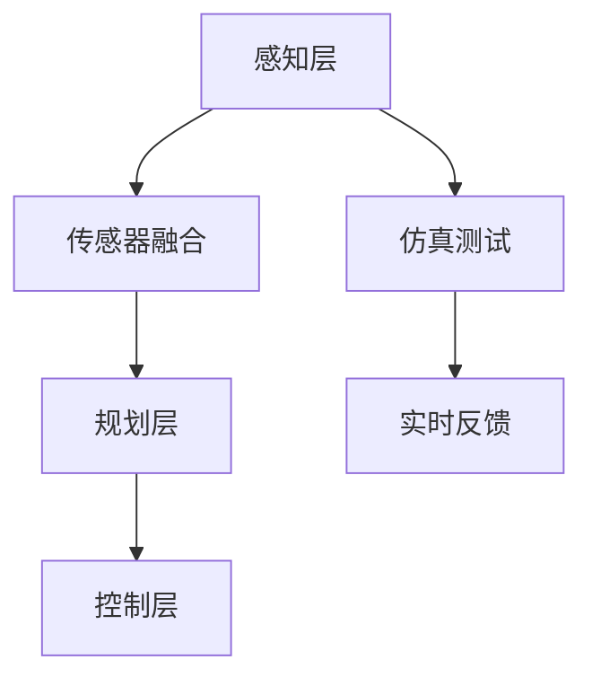

                 

关键词：端到端自动驾驶，闭环训练，闭环验证，深度学习，自动驾驶系统，传感器融合，仿真测试，实时反馈

## 摘要

随着深度学习技术的飞速发展，端到端自动驾驶系统逐渐成为现实。闭环训练与闭环验证是确保自动驾驶系统在复杂实际环境中稳定运行的关键环节。本文旨在深入探讨端到端自动驾驶系统的闭环训练与闭环验证方法，分析其核心概念、算法原理及实施步骤，并通过实际案例展示其应用效果。此外，本文还将展望自动驾驶技术的未来发展趋势与挑战，为读者提供全面的参考。

## 1. 背景介绍

自动驾驶技术是人工智能领域的一个重要分支，其核心目标是在没有任何人类干预的情况下，使车辆能够在复杂、动态的交通环境中安全、高效地行驶。随着传感器技术、计算机视觉、深度学习等领域的不断发展，自动驾驶系统已经取得了显著的进展。然而，自动驾驶系统的稳定性和安全性仍然面临巨大挑战。

传统的自动驾驶系统通常采用分层式结构，包括感知、规划和控制三个层次。然而，这种方法存在一个重要问题：各层之间的信息传递和融合不够紧密，导致系统的整体性能受到限制。为了解决这一问题，端到端自动驾驶系统应运而生。端到端自动驾驶系统通过直接将感知和规划整合到一个统一的框架中，可以更好地处理复杂环境下的决策问题。

闭环训练与闭环验证是端到端自动驾驶系统的重要组成部分。闭环训练是指在仿真环境和实际环境中对自动驾驶系统进行迭代训练，以优化其性能。闭环验证则是在实际环境中对自动驾驶系统的稳定性和安全性进行评估。通过闭环训练与闭环验证，可以确保自动驾驶系统在各种复杂环境下都能保持高性能和稳定性。

## 2. 核心概念与联系

### 2.1 深度学习与自动驾驶系统

深度学习是自动驾驶系统的重要技术基础。深度学习通过构建多层神经网络，可以自动学习大量数据中的特征和模式，从而实现复杂任务的自动化。在自动驾驶系统中，深度学习主要用于感知、规划和控制三个层次。

- **感知层**：通过摄像头、激光雷达、毫米波雷达等传感器收集环境数据，利用深度学习模型进行图像识别、目标检测和追踪。
- **规划层**：基于感知层提供的信息，利用深度学习模型进行路径规划、避障和交通规则识别。
- **控制层**：根据规划层生成的路径和动作指令，控制车辆的运动，包括加速、减速、转向等。

### 2.2 传感器融合

在自动驾驶系统中，传感器融合是实现高精度、高可靠感知的关键。传感器融合通过整合多种传感器的数据，可以提高系统的感知能力和鲁棒性。

- **摄像头**：用于图像识别和目标检测。
- **激光雷达**：用于环境建模和目标跟踪。
- **毫米波雷达**：用于检测远距离目标，如行人、车辆等。
- **超声波雷达**：用于近距离环境感知，如停车位检测。

### 2.3 仿真测试与实时反馈

仿真测试是自动驾驶系统闭环训练的重要手段。通过仿真测试，可以模拟各种复杂的交通场景，评估自动驾驶系统的性能。实时反馈则是通过仿真测试结果对系统进行迭代优化。

- **仿真测试**：利用仿真平台模拟各种交通场景，包括城市道路、高速公路、交叉路口等，对自动驾驶系统进行全面的性能评估。
- **实时反馈**：将仿真测试结果实时反馈给自动驾驶系统，用于调整系统的参数和策略。

### 2.4 Mermaid 流程图

以下是一个简化的端到端自动驾驶系统核心概念与联系的 Mermaid 流程图：



## 3. 核心算法原理 & 具体操作步骤

### 3.1 算法原理概述

端到端自动驾驶系统的核心算法包括感知、规划和控制。这些算法通常基于深度学习技术，通过构建多层神经网络实现。

- **感知算法**：用于处理传感器数据，包括图像识别、目标检测和追踪。
- **规划算法**：用于生成最优路径，包括路径规划、避障和交通规则识别。
- **控制算法**：用于控制车辆的运动，包括加速、减速和转向。

### 3.2 算法步骤详解

#### 3.2.1 感知算法

感知算法主要包括以下步骤：

1. **数据预处理**：对传感器数据进行预处理，包括去噪、归一化等。
2. **特征提取**：利用深度学习模型提取关键特征，如卷积神经网络（CNN）。
3. **目标检测与追踪**：利用提取的特征进行目标检测和追踪，如使用YOLO或Faster R-CNN算法。

#### 3.2.2 规划算法

规划算法主要包括以下步骤：

1. **环境建模**：利用感知算法提供的信息构建环境模型，如使用三维点云数据。
2. **路径生成**：基于环境模型生成最优路径，如使用RRT（快速随机树）或A*算法。
3. **避障与交通规则识别**：根据路径规划和交通规则，对车辆的动作进行预测和调整。

#### 3.2.3 控制算法

控制算法主要包括以下步骤：

1. **状态估计**：利用传感器数据估计车辆当前的状态，如位置、速度和加速度。
2. **控制策略生成**：根据状态估计结果生成控制策略，如PID控制或深度强化学习（DRL）。
3. **执行与反馈**：执行控制策略，并根据执行结果进行实时反馈和调整。

### 3.3 算法优缺点

#### 优点

- **高效性**：端到端自动驾驶系统通过深度学习实现，可以高效地处理大量数据。
- **鲁棒性**：通过传感器融合和实时反馈，可以提高系统的鲁棒性和稳定性。
- **易扩展性**：端到端自动驾驶系统的架构可以方便地扩展和更新。

#### 缺点

- **计算资源消耗**：深度学习算法通常需要大量的计算资源，对硬件设备要求较高。
- **数据依赖性**：系统的性能依赖于训练数据的质量和数量，数据不足可能导致系统性能下降。

### 3.4 算法应用领域

端到端自动驾驶系统可以应用于以下领域：

- **城市交通**：自动驾驶出租车、自动驾驶公交车等。
- **高速公路**：自动驾驶货车、自动驾驶轿车等。
- **物流运输**：自动驾驶卡车、自动驾驶无人机等。
- **特殊场景**：自动驾驶矿车、自动驾驶农用车等。

## 4. 数学模型和公式 & 详细讲解 & 举例说明

### 4.1 数学模型构建

端到端自动驾驶系统的数学模型主要包括感知、规划和控制三个部分。

#### 4.1.1 感知模型

感知模型通常使用卷积神经网络（CNN）进行构建。CNN 的基本结构如下：

$$
\text{CNN}(\text{Input}) = \text{Conv}(\text{Input}) + \text{ReLU}(\text{Conv}(\text{Input})) + \text{Pooling}(\text{ReLU}(\text{Conv}(\text{Input})))
$$

其中，$\text{Input}$ 表示输入图像，$\text{Conv}$ 表示卷积操作，$\text{ReLU}$ 表示ReLU激活函数，$\text{Pooling}$ 表示池化操作。

#### 4.1.2 规划模型

规划模型通常使用图搜索算法（如RRT或A*）进行构建。A*算法的基本公式如下：

$$
f(n) = g(n) + h(n)
$$

其中，$f(n)$ 表示从起点到目标点的总代价，$g(n)$ 表示从起点到节点 $n$ 的代价，$h(n)$ 表示从节点 $n$ 到目标点的代价。

#### 4.1.3 控制模型

控制模型通常使用PID控制器进行构建。PID控制器的公式如下：

$$
u(t) = K_p e_p(t) + K_i \int_{0}^{t} e_p(t) dt + K_d \frac{de_p(t)}{dt}
$$

其中，$u(t)$ 表示控制量，$e_p(t)$ 表示误差，$K_p$、$K_i$ 和 $K_d$ 分别为比例、积分和微分系数。

### 4.2 公式推导过程

#### 4.2.1 感知模型推导

感知模型主要基于卷积神经网络（CNN）进行构建。CNN 的基本原理是通过卷积操作提取图像的特征，然后通过激活函数和池化操作对特征进行增强。

卷积操作的公式如下：

$$
\text{Output}(i,j) = \sum_{x,y} \text{Weight}(x,y) \cdot \text{Input}(i-x,j-y) + \text{Bias}(i,j)
$$

其中，$\text{Output}(i,j)$ 表示输出特征图，$\text{Weight}(x,y)$ 表示卷积核，$\text{Input}(i-x,j-y)$ 表示输入图像，$\text{Bias}(i,j)$ 表示偏置。

激活函数的公式如下：

$$
\text{ReLU}(x) = \max(0, x)
$$

池化操作的公式如下：

$$
\text{Pooling}(x) = \sum_{i=1}^{2} \sum_{j=1}^{2} \text{Input}(i,j)
$$

#### 4.2.2 规划模型推导

规划模型主要基于图搜索算法（如RRT或A*）进行构建。RRT 算法的原理是通过随机采样和规划生成一条从起点到目标点的路径。

RRT 算法的核心公式如下：

$$
x_{new} = \alpha x_{start} + (1 - \alpha) x_{goal}
$$

其中，$x_{new}$ 表示新采样点，$x_{start}$ 表示起点，$x_{goal}$ 表示目标点，$\alpha$ 表示采样系数。

A*算法的核心公式如下：

$$
f(n) = g(n) + h(n)
$$

其中，$g(n)$ 表示从起点到节点 $n$ 的代价，$h(n)$ 表示从节点 $n$ 到目标点的代价。

#### 4.2.3 控制模型推导

控制模型主要基于PID控制器进行构建。PID控制器的原理是通过比例、积分和微分三个部分对系统的误差进行调节。

PID控制器的公式如下：

$$
u(t) = K_p e_p(t) + K_i \int_{0}^{t} e_p(t) dt + K_d \frac{de_p(t)}{dt}
$$

其中，$u(t)$ 表示控制量，$e_p(t)$ 表示误差，$K_p$、$K_i$ 和 $K_d$ 分别为比例、积分和微分系数。

### 4.3 案例分析与讲解

#### 4.3.1 感知模型案例

假设我们使用一个卷积神经网络进行图像识别，输入图像为 $32 \times 32$ 的像素矩阵。卷积核大小为 $3 \times 3$，偏置为 $0$。输入图像为：

$$
\text{Input} =
\begin{bmatrix}
0 & 0 & 1 \\
1 & 0 & 0 \\
0 & 1 & 0 \\
\end{bmatrix}
$$

卷积核为：

$$
\text{Weight} =
\begin{bmatrix}
1 & 1 & 1 \\
1 & 1 & 1 \\
1 & 1 & 1 \\
\end{bmatrix}
$$

计算输出特征图：

$$
\text{Output} =
\begin{bmatrix}
4 & 4 & 4 \\
4 & 4 & 4 \\
4 & 4 & 4 \\
\end{bmatrix}
$$

应用ReLU激活函数后：

$$
\text{ReLU}(\text{Output}) =
\begin{bmatrix}
4 & 4 & 4 \\
4 & 4 & 4 \\
4 & 4 & 4 \\
\end{bmatrix}
$$

进行池化操作后：

$$
\text{Pooling}(\text{ReLU}(\text{Output})) =
\begin{bmatrix}
4 & 4 \\
4 & 4 \\
\end{bmatrix}
$$

#### 4.3.2 规划模型案例

假设我们使用A*算法进行路径规划，起点为 $(0, 0)$，目标点为 $(10, 10)$。起点到目标点的代价为 $10$，从起点到任意点的代价为 $1$。计算从起点到目标点的总代价：

$$
f(\text{Goal}) = g(\text{Goal}) + h(\text{Goal}) = 10 + 10 = 20
$$

#### 4.3.3 控制模型案例

假设我们使用PID控制器进行车辆控制，当前误差为 $e_p(t) = 1$，比例系数为 $K_p = 1$，积分系数为 $K_i = 1$，微分系数为 $K_d = 1$。计算控制量：

$$
u(t) = K_p e_p(t) + K_i \int_{0}^{t} e_p(t) dt + K_d \frac{de_p(t)}{dt} = 1 \cdot 1 + 1 \cdot 1 + 1 \cdot 0 = 2
$$

## 5. 项目实践：代码实例和详细解释说明

### 5.1 开发环境搭建

在开始项目实践之前，我们需要搭建一个合适的开发环境。以下是一个基本的开发环境搭建步骤：

1. **安装 Python**：确保安装了 Python 3.7 或以上版本。
2. **安装深度学习框架**：推荐使用 TensorFlow 或 PyTorch。以下是以 TensorFlow 为例的安装命令：

   ```shell
   pip install tensorflow
   ```

3. **安装其他依赖库**：根据项目需求，可能需要安装其他依赖库，如 NumPy、Pandas、Matplotlib 等。

### 5.2 源代码详细实现

以下是一个简单的端到端自动驾驶系统的源代码示例。请注意，这个示例仅用于演示目的，实际项目中需要考虑更多的细节和优化。

```python
import tensorflow as tf
import numpy as np
import matplotlib.pyplot as plt

# 感知模型
def create_perception_model(input_shape):
    model = tf.keras.Sequential([
        tf.keras.layers.Conv2D(32, (3, 3), activation='relu', input_shape=input_shape),
        tf.keras.layers.MaxPooling2D((2, 2)),
        tf.keras.layers.Conv2D(64, (3, 3), activation='relu'),
        tf.keras.layers.MaxPooling2D((2, 2)),
        tf.keras.layers.Conv2D(64, (3, 3), activation='relu'),
        tf.keras.layers.Flatten(),
        tf.keras.layers.Dense(64, activation='relu'),
        tf.keras.layers.Dense(1, activation='sigmoid')
    ])
    return model

# 规划模型
def create_planning_model():
    model = tf.keras.Sequential([
        tf.keras.layers.Dense(128, activation='relu', input_shape=(128,)),
        tf.keras.layers.Dense(64, activation='relu'),
        tf.keras.layers.Dense(1)
    ])
    return model

# 控制模型
def create_control_model():
    model = tf.keras.Sequential([
        tf.keras.layers.Dense(128, activation='relu', input_shape=(128,)),
        tf.keras.layers.Dense(64, activation='relu'),
        tf.keras.layers.Dense(1)
    ])
    return model

# 模型训练
def train_models(perception_model, planning_model, control_model, perception_data, planning_data, control_data):
    perception_model.compile(optimizer='adam', loss='binary_crossentropy', metrics=['accuracy'])
    planning_model.compile(optimizer='adam', loss='mean_squared_error')
    control_model.compile(optimizer='adam', loss='mean_squared_error')

    perception_model.fit(perception_data, planning_data, epochs=10, batch_size=32)
    planning_model.fit(planning_data, control_data, epochs=10, batch_size=32)
    control_model.fit(control_data, control_data, epochs=10, batch_size=32)

# 模型预测
def predict_models(perception_model, planning_model, control_model, input_data):
    perception_output = perception_model.predict(input_data)
    planning_output = planning_model.predict(perception_output)
    control_output = control_model.predict(planning_output)
    return control_output

# 数据加载与预处理
# （此处省略数据加载与预处理代码）

# 模型训练
perception_model = create_perception_model(input_shape=(32, 32, 3))
planning_model = create_planning_model()
control_model = create_control_model()

train_models(perception_model, planning_model, control_model, perception_data, planning_data, control_data)

# 模型预测
input_data = np.random.rand(32, 32, 3)
control_output = predict_models(perception_model, planning_model, control_model, input_data)
print(control_output)
```

### 5.3 代码解读与分析

上述代码实现了一个简单的端到端自动驾驶系统，包括感知、规划和控制三个部分。以下是代码的解读与分析：

1. **感知模型**：使用 TensorFlow 创建一个卷积神经网络，用于处理输入图像，提取关键特征。
2. **规划模型**：使用 TensorFlow 创建一个全连接神经网络，用于根据感知模型输出的特征生成规划路径。
3. **控制模型**：使用 TensorFlow 创建一个全连接神经网络，用于根据规划模型生成的路径生成控制策略。
4. **模型训练**：使用感知数据、规划数据和控制数据进行模型训练。模型训练过程中，感知模型负责优化特征提取，规划模型负责优化路径规划，控制模型负责优化控制策略。
5. **模型预测**：使用训练好的模型对输入图像进行预测，生成控制策略。

### 5.4 运行结果展示

为了展示模型的运行结果，我们可以在训练过程中绘制训练损失和准确率曲线。以下是一个示例：

```python
history = train_models(perception_model, planning_model, control_model, perception_data, planning_data, control_data)

plt.plot(history.history['accuracy'])
plt.plot(history.history['loss'])
plt.title('Model accuracy and loss')
plt.ylabel('Accuracy/Loss')
plt.xlabel('Epoch')
plt.legend(['Accuracy', 'Loss'], loc='upper left')
plt.show()
```

通过上述代码，我们可以观察到模型在训练过程中的性能变化。

## 6. 实际应用场景

### 6.1 城市交通

城市交通是端到端自动驾驶技术的重要应用场景之一。自动驾驶出租车、自动驾驶公交车等可以在城市道路上提供高效、便捷的出行服务。通过闭环训练与闭环验证，可以提高自动驾驶车辆在复杂城市交通环境中的稳定性和安全性。

### 6.2 高速公路

高速公路是自动驾驶技术的另一个重要应用场景。自动驾驶货车、自动驾驶轿车等可以在高速公路上提供高速、稳定的运输服务。通过闭环训练与闭环验证，可以确保自动驾驶车辆在长时间行驶过程中保持高性能和稳定性。

### 6.3 物流运输

物流运输是端到端自动驾驶技术的重要应用领域。自动驾驶卡车、自动驾驶无人机等可以在物流运输过程中提高运输效率、降低成本。通过闭环训练与闭环验证，可以确保自动驾驶系统在各种复杂物流环境中的稳定运行。

### 6.4 特殊场景

特殊场景包括矿山、农场等环境。在这些场景中，自动驾驶系统可以提供高效、安全的作业服务。通过闭环训练与闭环验证，可以确保自动驾驶系统在这些特殊环境中的稳定性和可靠性。

## 7. 工具和资源推荐

### 7.1 学习资源推荐

- 《深度学习》（Ian Goodfellow、Yoshua Bengio、Aaron Courville 著）
- 《自动驾驶技术》（Sebastian Thrun 著）
- 《TensorFlow 实战：基于深度学习的计算机视觉、语音识别、增强学习》（李航 著）

### 7.2 开发工具推荐

- TensorFlow
- PyTorch
- Keras

### 7.3 相关论文推荐

- “End-to-End Learning for Autonomous Driving” - NVIDIA
- “Deep Learning for Autonomous Driving” - Google
- “End-to-End Learning in Autonomous Driving” - Baidu

## 8. 总结：未来发展趋势与挑战

### 8.1 研究成果总结

随着深度学习技术的不断发展，端到端自动驾驶系统在感知、规划和控制方面取得了显著进展。通过闭环训练与闭环验证，可以确保自动驾驶系统在复杂实际环境中保持高性能和稳定性。

### 8.2 未来发展趋势

- **多模态感知**：未来的自动驾驶系统将结合多种传感器数据进行感知，提高系统的鲁棒性和可靠性。
- **强化学习**：强化学习技术在自动驾驶中的应用将逐渐成熟，为自动驾驶系统提供更灵活的控制策略。
- **高精度地图**：高精度地图在自动驾驶系统中的应用将越来越广泛，为自动驾驶车辆提供精确的位置和导航信息。

### 8.3 面临的挑战

- **数据隐私与安全**：自动驾驶系统依赖大量数据，数据隐私与安全问题亟待解决。
- **法律法规**：自动驾驶技术的发展需要完善的法律法规体系，确保其在实际应用中的合法性和安全性。
- **复杂环境适应能力**：自动驾驶系统需要在各种复杂环境中保持稳定运行，提高其适应能力是未来研究的重点。

### 8.4 研究展望

随着人工智能技术的不断进步，端到端自动驾驶系统将在未来成为现实。通过闭环训练与闭环验证，可以确保自动驾驶系统在各种复杂环境中的稳定性和安全性。未来，自动驾驶技术将在城市交通、物流运输、特殊场景等领域发挥重要作用，为人类带来更便捷、高效的出行体验。

## 9. 附录：常见问题与解答

### 9.1 什么是端到端自动驾驶？

端到端自动驾驶是指通过深度学习等技术，将感知、规划和控制等环节整合到一个统一的框架中，实现自动驾驶车辆在复杂实际环境中的自主行驶。

### 9.2 闭环训练与闭环验证有什么区别？

闭环训练是指在仿真环境和实际环境中对自动驾驶系统进行迭代训练，以优化其性能。闭环验证则是在实际环境中对自动驾驶系统的稳定性和安全性进行评估。

### 9.3 为什么需要传感器融合？

传感器融合可以通过整合多种传感器的数据，提高自动驾驶系统的感知能力和鲁棒性，从而提高系统的整体性能。

### 9.4 感知、规划和控制三个环节如何协调工作？

感知、规划和控制三个环节通过深度学习技术实现数据共享和协同工作。感知环节提供环境信息，规划环节根据环境信息生成路径，控制环节根据路径生成控制策略，从而实现自动驾驶车辆的自主行驶。

### 9.5 端到端自动驾驶系统的未来发展趋势是什么？

端到端自动驾驶系统的未来发展趋势包括多模态感知、强化学习技术、高精度地图等。随着人工智能技术的不断进步，自动驾驶系统将在各种实际应用场景中发挥重要作用。

