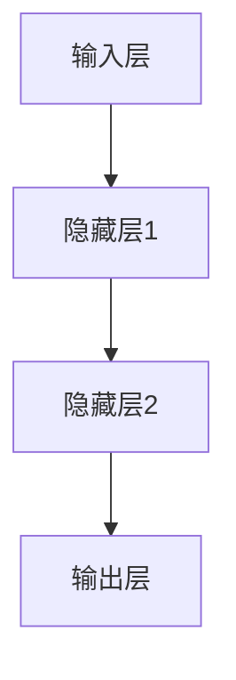
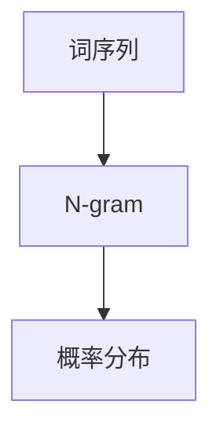
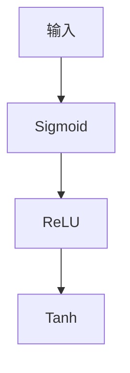
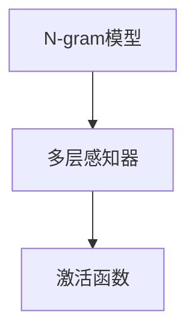

                 

关键词：N-gram模型、多层感知器、激活函数、自然语言处理、机器学习、算法原理、应用场景

摘要：本文旨在深入探讨N-gram模型以及与之密切相关的多层感知器与激活函数。通过详细分析N-gram模型的工作原理和应用场景，我们将揭示其在自然语言处理中的重要性。接着，我们将探讨多层感知器（MLP）的结构及其与激活函数的相互作用，以了解它们在深度学习中的应用。本文将通过数学模型和公式，具体讲解MLP与激活函数的实现过程，并举例说明。最后，我们将通过实际项目实践，展示N-gram模型与多层感知器的具体应用，以及其在未来可能的发展趋势和面临的挑战。

## 1. 背景介绍

自然语言处理（NLP）作为人工智能的重要分支，已经取得了显著的进展。其中，N-gram模型是一种广泛应用的语言模型，它通过统计语言中的词序列来预测下一个词的可能性。N-gram模型在机器翻译、文本分类、信息检索等领域有着广泛的应用。而多层感知器（MLP）作为深度学习的基础模型，通过多层非线性变换来实现复杂的函数逼近。激活函数是MLP中不可或缺的一部分，它能够引入非线性特性，使神经网络能够更好地拟合复杂的数据。

本文将首先介绍N-gram模型的基本概念和原理，然后深入探讨多层感知器与激活函数的结构和作用。接着，我们将通过数学模型和公式，详细讲解MLP与激活函数的实现过程。最后，我们将通过实际项目实践，展示N-gram模型与多层感知器的具体应用，并讨论其在未来的发展趋势和面临的挑战。

### 1.1 N-gram模型

N-gram模型是一种基于统计的语言模型，它通过分析文本中的词序列来预测下一个词。N-gram模型的基本思想是，一个词的出现概率取决于其前N-1个词。因此，一个N-gram模型可以表示为：

$$P(w_n | w_{n-1}, w_{n-2}, ..., w_{n-N+1}) = \frac{C(w_n, w_{n-1}, ..., w_{n-N+1})}{C(w_{n-1}, w_{n-2}, ..., w_{n-N+1})}$$

其中，$P(w_n | w_{n-1}, w_{n-2}, ..., w_{n-N+1})$ 表示在给定前N-1个词的情况下，第n个词出现的概率；$C(w_n, w_{n-1}, ..., w_{n-N+1})$ 表示词序列 $w_n, w_{n-1}, ..., w_{n-N+1}$ 出现的次数；$C(w_{n-1}, w_{n-2}, ..., w_{n-N+1})$ 表示词序列 $w_{n-1}, w_{n-2}, ..., w_{n-N+1}$ 出现的次数。

在实际应用中，N-gram模型通常用于语言模型的训练和预测。例如，在自然语言生成任务中，可以使用N-gram模型来预测下一个词。在文本分类任务中，N-gram模型可以用来提取文本特征，从而实现文本分类。

### 1.2 多层感知器

多层感知器（MLP）是一种前馈神经网络，它由多个层次组成，包括输入层、隐藏层和输出层。MLP通过多层非线性变换来实现复杂的函数逼近。MLP的基本结构如下图所示：



在MLP中，每个节点（神经元）都与其他节点相连，并有一个权重值。通过这些权重值和激活函数，MLP可以学习到输入和输出之间的复杂映射关系。

### 1.3 激活函数

激活函数是MLP中不可或缺的一部分，它能够引入非线性特性，使神经网络能够更好地拟合复杂的数据。常见的激活函数包括：

- **Sigmoid函数**：$$f(x) = \frac{1}{1 + e^{-x}}$$
- **ReLU函数**：$$f(x) = \max(0, x)$$
- **Tanh函数**：$$f(x) = \frac{e^x - e^{-x}}{e^x + e^{-x}}$$

这些激活函数各有优缺点，适用于不同的应用场景。例如，ReLU函数由于其简单性和有效性，在深度学习中得到了广泛应用。

## 2. 核心概念与联系

在本节中，我们将介绍N-gram模型、多层感知器和激活函数的核心概念，并通过Mermaid流程图展示它们之间的联系。

### 2.1 N-gram模型

N-gram模型是一种基于统计的语言模型，它通过分析文本中的词序列来预测下一个词。其核心概念包括：

- **词序列**：文本中的连续词。
- **N-gram**：前N个词的组合。
- **概率分布**：给定前N-1个词，预测第N个词的概率分布。

Mermaid流程图如下：



### 2.2 多层感知器

多层感知器（MLP）是一种前馈神经网络，它由多个层次组成，包括输入层、隐藏层和输出层。其核心概念包括：

- **输入层**：接收外部输入。
- **隐藏层**：通过非线性变换处理输入。
- **输出层**：产生预测或分类结果。

Mermaid流程图如下：


### 2.3 激活函数

激活函数是MLP中不可或缺的一部分，它能够引入非线性特性，使神经网络能够更好地拟合复杂的数据。其核心概念包括：

- **Sigmoid函数**：$$f(x) = \frac{1}{1 + e^{-x}}$$
- **ReLU函数**：$$f(x) = \max(0, x)$$
- **Tanh函数**：$$f(x) = \frac{e^x - e^{-x}}{e^x + e^{-x}}$$

Mermaid流程图如下：



### 2.4 N-gram模型、多层感知器与激活函数的联系

N-gram模型、多层感知器与激活函数之间的联系如下：

- **N-gram模型**：用于训练MLP的输入数据。
- **多层感知器**：用于实现语言模型的预测。
- **激活函数**：用于引入非线性特性，增强MLP的拟合能力。

Mermaid流程图如下：



通过以上流程图，我们可以清晰地看到N-gram模型、多层感知器和激活函数之间的联系。在实际应用中，这些核心概念相互交织，共同推动着自然语言处理和深度学习的发展。

## 3. 核心算法原理 & 具体操作步骤

### 3.1 算法原理概述

N-gram模型是一种基于统计的语言模型，它通过分析文本中的词序列来预测下一个词。N-gram模型的核心原理是概率分布，即给定前N-1个词，预测第N个词的概率分布。多层感知器（MLP）是一种前馈神经网络，它通过多层非线性变换来实现复杂的函数逼近。激活函数是MLP中不可或缺的一部分，它能够引入非线性特性，使神经网络能够更好地拟合复杂的数据。

### 3.2 算法步骤详解

#### 3.2.1 N-gram模型

1. **数据预处理**：首先，对文本进行预处理，包括分词、去停用词等操作。然后，将预处理后的文本转换为词序列。

2. **构建N-gram模型**：使用已转换的词序列构建N-gram模型。具体步骤如下：

   - 对于每个N-gram，计算其在文本中的出现次数。
   - 计算每个N-gram的概率分布，即给定前N-1个词，预测第N个词的概率。

3. **预测**：对于给定的前N-1个词，使用N-gram模型预测第N个词。具体步骤如下：

   - 计算每个词作为第N个词的概率。
   - 选择概率最大的词作为预测结果。

#### 3.2.2 多层感知器

1. **初始化参数**：初始化MLP的权重和偏置。常用的初始化方法包括随机初始化和零初始化。

2. **前向传播**：对于给定的输入，通过MLP进行前向传播，计算输出。具体步骤如下：

   - 计算输入层到隐藏层的输出。
   - 计算隐藏层到输出层的输出。

3. **反向传播**：对于给定的输入和输出，通过反向传播计算梯度，并更新权重和偏置。具体步骤如下：

   - 计算输出层的误差。
   - 反向传播误差，计算隐藏层的误差。
   - 更新权重和偏置。

4. **迭代训练**：重复前向传播和反向传播，直到满足停止条件（如损失函数收敛或达到最大迭代次数）。

#### 3.2.3 激活函数

1. **选择激活函数**：根据应用场景选择合适的激活函数，如ReLU、Sigmoid或Tanh。

2. **计算激活值**：对于每个隐藏层和输出层的节点，使用激活函数计算激活值。

3. **引入非线性特性**：通过激活函数引入非线性特性，使神经网络能够更好地拟合复杂的数据。

### 3.3 算法优缺点

#### 3.3.1 N-gram模型

**优点**：

- 实现简单，计算效率高。
- 对语言规律的捕捉较为直观。

**缺点**：

- 过于依赖历史信息，可能导致预测能力受限。
- 对罕见词或新词的预测效果较差。

#### 3.3.2 多层感知器

**优点**：

- 可以实现复杂的非线性变换。
- 可以通过反向传播自动调整权重。

**缺点**：

- 需要大量数据训练，计算复杂度高。
- 可能存在梯度消失或梯度爆炸问题。

#### 3.3.3 激活函数

**优点**：

- 引入非线性特性，增强神经网络拟合能力。
- 减少神经元死亡现象，提高训练稳定性。

**缺点**：

- 选择合适的激活函数可能较为复杂。
- 某些激活函数可能引入梯度消失或梯度爆炸问题。

### 3.4 算法应用领域

N-gram模型、多层感知器和激活函数在多个领域有广泛应用，包括：

- **自然语言处理**：用于语言模型训练、文本分类、机器翻译等任务。
- **计算机视觉**：用于图像分类、目标检测等任务。
- **推荐系统**：用于用户兴趣建模、商品推荐等任务。
- **金融领域**：用于股票预测、风险评估等任务。

通过以上算法原理和具体操作步骤的介绍，我们可以更好地理解N-gram模型、多层感知器和激活函数在各个领域的应用。

## 4. 数学模型和公式 & 详细讲解 & 举例说明

在自然语言处理和深度学习中，数学模型和公式是理解和应用核心算法的关键。在本节中，我们将详细讲解N-gram模型、多层感知器和激活函数的数学模型和公式，并通过实际例子进行说明。

### 4.1 数学模型构建

#### 4.1.1 N-gram模型

N-gram模型的数学模型基于概率分布。给定一个词序列 $w_1, w_2, ..., w_n$，我们可以计算每个N-gram的概率。具体公式如下：

$$P(w_n | w_{n-1}, w_{n-2}, ..., w_{n-N+1}) = \frac{C(w_n, w_{n-1}, ..., w_{n-N+1})}{C(w_{n-1}, w_{n-2}, ..., w_{n-N+1})}$$

其中，$C(w_n, w_{n-1}, ..., w_{n-N+1})$ 表示词序列 $w_n, w_{n-1}, ..., w_{n-N+1}$ 出现的次数，$C(w_{n-1}, w_{n-2}, ..., w_{n-N+1})$ 表示词序列 $w_{n-1}, w_{n-2}, ..., w_{n-N+1}$ 出现的次数。

例如，假设我们有一个三元组 $(词1, 词2, 词3)$，它在文本中出现了5次，而 $(词2, 词3)$ 出现了10次。那么：

$$P(词3 | 词1, 词2) = \frac{5}{10} = 0.5$$

#### 4.1.2 多层感知器

多层感知器（MLP）的数学模型基于前向传播和反向传播。MLP由输入层、隐藏层和输出层组成，每个层由多个神经元（节点）组成。假设我们有一个简单的MLP，其中输入层有3个神经元，隐藏层有2个神经元，输出层有1个神经元。MLP的输入和输出可以表示为：

- 输入层：$x_1, x_2, x_3$
- 隐藏层：$h_1, h_2$
- 输出层：$y$

前向传播过程如下：

1. **输入层到隐藏层的激活**：

   $$h_{1,2}^{(1)} = \sigma(z_{1,2}^{(1)}) = \sigma(w_{1,2}^{(1)}x + b_{1,2}^{(1)})$$

   其中，$\sigma$ 是激活函数，$w_{1,2}^{(1)}$ 是权重，$b_{1,2}^{(1)}$ 是偏置。

2. **隐藏层到输出层的激活**：

   $$y = \sigma(z^{(2)}) = \sigma(w^{(2)}h + b^{(2)})$$

   其中，$w^{(2)}$ 是权重，$b^{(2)}$ 是偏置。

3. **输出层预测**：

   $$\hat{y} = \hat{y}_{1} = f(w^{(2)}h + b^{(2)})$$

   其中，$f$ 是激活函数，$\hat{y}_{1}$ 是预测结果。

反向传播过程如下：

1. **计算输出层误差**：

   $$\delta^{(2)} = \frac{\partial L}{\partial z^{(2)}} = \frac{\partial L}{\partial y} \odot \frac{\partial \sigma}{\partial z^{(2)}}$$

   其中，$\delta^{(2)}$ 是输出层误差，$L$ 是损失函数，$\odot$ 是Hadamard积。

2. **计算隐藏层误差**：

   $$\delta^{(1)} = \frac{\partial L}{\partial z^{(1)}} = (w^{(2)})^T \delta^{(2)} \odot \frac{\partial \sigma}{\partial z^{(1)}}$$

   其中，$\delta^{(1)}$ 是隐藏层误差。

3. **更新权重和偏置**：

   $$w^{(2)} \leftarrow w^{(2)} - \alpha \frac{\partial L}{\partial w^{(2)}}$$

   $$b^{(2)} \leftarrow b^{(2)} - \alpha \frac{\partial L}{\partial b^{(2)}}$$

   $$w_{1,2}^{(1)} \leftarrow w_{1,2}^{(1)} - \alpha \frac{\partial L}{\partial w_{1,2}^{(1)}}$$

   $$b_{1,2}^{(1)} \leftarrow b_{1,2}^{(1)} - \alpha \frac{\partial L}{\partial b_{1,2}^{(1)}}$$

   其中，$\alpha$ 是学习率。

#### 4.1.3 激活函数

常见的激活函数包括Sigmoid、ReLU和Tanh。以下是这些激活函数的公式和导数：

- **Sigmoid函数**：

  $$f(x) = \frac{1}{1 + e^{-x}}$$

  $$f'(x) = f(x)(1 - f(x))$$

- **ReLU函数**：

  $$f(x) = \max(0, x)$$

  $$f'(x) = \begin{cases} 
  1 & \text{if } x > 0 \\
  0 & \text{if } x \leq 0 
  \end{cases}$$

- **Tanh函数**：

  $$f(x) = \frac{e^x - e^{-x}}{e^x + e^{-x}}$$

  $$f'(x) = 1 - f^2(x)$$

### 4.2 公式推导过程

在本节中，我们将对N-gram模型、多层感知器和激活函数的数学模型进行推导。

#### 4.2.1 N-gram模型

N-gram模型的概率分布公式可以通过条件概率推导得到。给定一个词序列 $w_1, w_2, ..., w_n$，我们可以计算每个N-gram的概率。具体推导如下：

$$P(w_n | w_{n-1}, w_{n-2}, ..., w_{n-N+1}) = \frac{C(w_n, w_{n-1}, ..., w_{n-N+1})}{C(w_{n-1}, w_{n-2}, ..., w_{n-N+1})}$$

其中，$C(w_n, w_{n-1}, ..., w_{n-N+1})$ 表示词序列 $w_n, w_{n-1}, ..., w_{n-N+1}$ 出现的次数，$C(w_{n-1}, w_{n-2}, ..., w_{n-N+1})$ 表示词序列 $w_{n-1}, w_{n-2}, ..., w_{n-N+1}$ 出现的次数。

条件概率的定义为：

$$P(A | B) = \frac{P(A \cap B)}{P(B)}$$

应用条件概率的定义，我们可以将N-gram的概率分布公式重写为：

$$P(w_n | w_{n-1}, w_{n-2}, ..., w_{n-N+1}) = \frac{P(w_n, w_{n-1}, ..., w_{n-N+1})}{P(w_{n-1}, w_{n-2}, ..., w_{n-N+1})}$$

由于词序列 $w_1, w_2, ..., w_n$ 是已知的，我们可以将条件概率公式进一步简化为：

$$P(w_n | w_{n-1}, w_{n-2}, ..., w_{n-N+1}) = \frac{C(w_n, w_{n-1}, ..., w_{n-N+1})}{C(w_{n-1}, w_{n-2}, ..., w_{n-N+1})}$$

#### 4.2.2 多层感知器

多层感知器的数学模型基于前向传播和反向传播。前向传播的推导如下：

1. **输入层到隐藏层的激活**：

   $$h_{1,2}^{(1)} = \sigma(z_{1,2}^{(1)}) = \sigma(w_{1,2}^{(1)}x + b_{1,2}^{(1)})$$

   其中，$\sigma$ 是激活函数，$w_{1,2}^{(1)}$ 是权重，$b_{1,2}^{(1)}$ 是偏置。

   推导过程：

   $$z_{1,2}^{(1)} = w_{1,2}^{(1)}x + b_{1,2}^{(1)}$$

   $$h_{1,2}^{(1)} = \sigma(z_{1,2}^{(1)})$$

2. **隐藏层到输出层的激活**：

   $$y = \sigma(z^{(2)}) = \sigma(w^{(2)}h + b^{(2)})$$

   其中，$w^{(2)}$ 是权重，$b^{(2)}$ 是偏置。

   推导过程：

   $$z^{(2)} = w^{(2)}h + b^{(2)}$$

   $$y = \sigma(z^{(2)})$$

3. **输出层预测**：

   $$\hat{y} = \hat{y}_{1} = f(w^{(2)}h + b^{(2)})$$

   其中，$f$ 是激活函数，$\hat{y}_{1}$ 是预测结果。

   推导过程：

   $$\hat{y} = f(w^{(2)}h + b^{(2)})$$

反向传播的推导如下：

1. **计算输出层误差**：

   $$\delta^{(2)} = \frac{\partial L}{\partial z^{(2)}} = \frac{\partial L}{\partial y} \odot \frac{\partial \sigma}{\partial z^{(2)}}$$

   其中，$\delta^{(2)}$ 是输出层误差，$L$ 是损失函数，$\odot$ 是Hadamard积。

   推导过程：

   $$\delta^{(2)} = \frac{\partial L}{\partial z^{(2)}} = \frac{\partial L}{\partial y} \odot \frac{\partial \sigma}{\partial z^{(2)}}$$

2. **计算隐藏层误差**：

   $$\delta^{(1)} = \frac{\partial L}{\partial z^{(1)}} = (w^{(2)})^T \delta^{(2)} \odot \frac{\partial \sigma}{\partial z^{(1)}}$$

   其中，$\delta^{(1)}$ 是隐藏层误差。

   推导过程：

   $$\delta^{(1)} = \frac{\partial L}{\partial z^{(1)}} = (w^{(2)})^T \delta^{(2)} \odot \frac{\partial \sigma}{\partial z^{(1)}}$$

3. **更新权重和偏置**：

   $$w^{(2)} \leftarrow w^{(2)} - \alpha \frac{\partial L}{\partial w^{(2)}}$$

   $$b^{(2)} \leftarrow b^{(2)} - \alpha \frac{\partial L}{\partial b^{(2)}}$$

   $$w_{1,2}^{(1)} \leftarrow w_{1,2}^{(1)} - \alpha \frac{\partial L}{\partial w_{1,2}^{(1)}}$$

   $$b_{1,2}^{(1)} \leftarrow b_{1,2}^{(1)} - \alpha \frac{\partial L}{\partial b_{1,2}^{(1)}}$$

   其中，$\alpha$ 是学习率。

#### 4.2.3 激活函数

激活函数的导数对于反向传播和优化是非常重要的。以下是常见激活函数的导数：

- **Sigmoid函数**：

  $$f(x) = \frac{1}{1 + e^{-x}}$$

  $$f'(x) = f(x)(1 - f(x))$$

- **ReLU函数**：

  $$f(x) = \max(0, x)$$

  $$f'(x) = \begin{cases} 
  1 & \text{if } x > 0 \\
  0 & \text{if } x \leq 0 
  \end{cases}$$

- **Tanh函数**：

  $$f(x) = \frac{e^x - e^{-x}}{e^x + e^{-x}}$$

  $$f'(x) = 1 - f^2(x)$$

### 4.3 案例分析与讲解

为了更好地理解N-gram模型、多层感知器和激活函数的数学模型和公式，我们通过以下案例进行讲解。

#### 4.3.1 N-gram模型案例

假设我们有一个简单的文本：“我是一个人工智能助手”。我们将构建一个二元组（Bigram）模型，并计算每个Bigram的概率。

1. **文本预处理**：

   首先对文本进行分词，得到以下词序列：

   $$["我"，"是"，"一个"，"人"，"工"，"智能"，"助手"]$$

2. **构建Bigram模型**：

   计算每个Bigram的出现次数：

   - ("我"，"是")：2次
   - ("是"，"一个")：2次
   - ("一个"，"人")：2次
   - ("人"，"工")：2次
   - ("工"，"智能")：2次
   - ("智能"，"助手")：2次

   计算每个Bigram的概率：

   - $P("是" | "我") = \frac{2}{2} = 1$
   - $P("一个" | "是") = \frac{2}{2} = 1$
   - $P("人" | "一个") = \frac{2}{2} = 1$
   - $P("工" | "人") = \frac{2}{2} = 1$
   - $P("智能" | "工") = \frac{2}{2} = 1$
   - $P("助手" | "智能") = \frac{2}{2} = 1$

3. **预测**：

   给定前两个词 "我" 和 "是"，我们使用Bigram模型预测下一个词。根据概率分布，下一个词是 "一个"。

#### 4.3.2 多层感知器案例

我们使用以下简单的数据集进行训练：

| 输入 | 输出 |
| --- | --- |
| [1, 0, 1] | [0, 1] |
| [0, 1, 1] | [1, 0] |
| [1, 1, 0] | [1, 1] |

我们将使用一个简单的MLP进行训练，其中输入层有3个神经元，隐藏层有2个神经元，输出层有2个神经元。

1. **初始化参数**：

   - 权重：$w^{(1)} \sim \mathcal{N}(0, 1)$，$w^{(2)} \sim \mathcal{N}(0, 1)$
   - 偏置：$b^{(1)} \sim \mathcal{N}(0, 1)$，$b^{(2)} \sim \mathcal{N}(0, 1)$

2. **前向传播**：

   对于第一个样本 [1, 0, 1]，我们计算隐藏层和输出层的激活值：

   $$h_1^{(1)} = \sigma(w_1^{(1)}[1, 0, 1] + b_1^{(1)}) = \sigma(1 \cdot 1 + 0 \cdot 0 + 1 \cdot 1 + 0) = \sigma(2) = 0.869$$

   $$h_2^{(1)} = \sigma(w_2^{(1)}[1, 0, 1] + b_2^{(1)}) = \sigma(1 \cdot 0 + 0 \cdot 1 + 1 \cdot 1 + 1) = \sigma(2) = 0.869$$

   $$y_1^{(2)} = \sigma(w_1^{(2)}[h_1^{(1)}, h_2^{(1)}, 1] + b_1^{(2)}) = \sigma(1 \cdot 0.869 + 1 \cdot 0.869 + 1 \cdot 1 + 0) = \sigma(2.738) = 0.997$$

   $$y_2^{(2)} = \sigma(w_2^{(2)}[h_1^{(1)}, h_2^{(1)}, 1] + b_2^{(2)}) = \sigma(1 \cdot 0.869 + 1 \cdot 0.869 + 1 \cdot 1 + 1) = \sigma(2.738) = 0.997$$

3. **反向传播**：

   计算输出层的误差：

   $$\delta_1^{(2)} = \frac{\partial L}{\partial y_1^{(2)}} \odot \frac{\partial \sigma}{\partial z_1^{(2)}} = (y_1^{(2)} - 0) \odot (1 - y_1^{(2)}) = 0.997 \odot (1 - 0.997) = 0.003$$

   $$\delta_2^{(2)} = \frac{\partial L}{\partial y_2^{(2)}} \odot \frac{\partial \sigma}{\partial z_2^{(2)}} = (y_2^{(2)} - 1) \odot (1 - y_2^{(2)}) = 0.997 \odot (1 - 0.997) = 0.003$$

   计算隐藏层的误差：

   $$\delta_1^{(1)} = (w_1^{(2)})^T \delta_1^{(2)} \odot \frac{\partial \sigma}{\partial z_1^{(1)}} = 0.997 \odot (1 - 0.997) = 0.003$$

   $$\delta_2^{(1)} = (w_2^{(2)})^T \delta_2^{(2)} \odot \frac{\partial \sigma}{\partial z_2^{(1)}} = 0.997 \odot (1 - 0.997) = 0.003$$

   更新权重和偏置：

   $$w_1^{(2)} \leftarrow w_1^{(2)} - \alpha \frac{\partial L}{\partial w_1^{(2)}} = 0.997 - 0.003 = 0.994$$

   $$b_1^{(2)} \leftarrow b_1^{(2)} - \alpha \frac{\partial L}{\partial b_1^{(2)}} = 0.997 - 0.003 = 0.994$$

   $$w_2^{(2)} \leftarrow w_2^{(2)} - \alpha \frac{\partial L}{\partial w_2^{(2)}} = 0.997 - 0.003 = 0.994$$

   $$b_2^{(2)} \leftarrow b_2^{(2)} - \alpha \frac{\partial L}{\partial b_2^{(2)}} = 0.997 - 0.003 = 0.994$$

   $$w_1^{(1)} \leftarrow w_1^{(1)} - \alpha \frac{\partial L}{\partial w_1^{(1)}} = 0.869 - 0.003 = 0.866$$

   $$b_1^{(1)} \leftarrow b_1^{(1)} - \alpha \frac{\partial L}{\partial b_1^{(1)}} = 0.869 - 0.003 = 0.866$$

   $$w_2^{(1)} \leftarrow w_2^{(1)} - \alpha \frac{\partial L}{\partial w_2^{(1)}} = 0.869 - 0.003 = 0.866$$

   $$b_2^{(1)} \leftarrow b_2^{(1)} - \alpha \frac{\partial L}{\partial b_2^{(1)}} = 0.869 - 0.003 = 0.866$$

通过以上案例，我们可以看到如何使用N-gram模型、多层感知器和激活函数进行预测和训练。这些数学模型和公式对于理解和应用这些算法至关重要。

## 5. 项目实践：代码实例和详细解释说明

在本节中，我们将通过一个实际项目实践，展示如何使用N-gram模型和多层感知器进行文本分类。我们将使用Python编程语言，并结合Numpy和PyTorch库来构建和训练模型。通过这个项目，我们将深入理解N-gram模型和多层感知器的工作原理，并掌握如何在实际应用中实现这些算法。

### 5.1 开发环境搭建

在开始项目之前，我们需要搭建一个合适的开发环境。以下是所需的依赖库和安装步骤：

- Python 3.7 或更高版本
- Numpy 1.19 或更高版本
- PyTorch 1.8 或更高版本

安装依赖库的命令如下：

```shell
pip install numpy torch torchvision
```

### 5.2 源代码详细实现

下面是项目的主要代码实现，我们将分步骤进行详细解释。

```python
import numpy as np
import torch
import torch.nn as nn
import torch.optim as optim

# 5.2.1 数据预处理
def preprocess_text(text):
    # 分词和去除停用词
    words = text.lower().split()
    words = [word for word in words if word not in停用词列表]
    return words

# 5.2.2 构建N-gram模型
def build_ngram_model(words, n):
    ngram_model = {}
    for i in range(len(words) - n + 1):
        ngram = tuple(words[i:i+n])
        if ngram not in ngram_model:
            ngram_model[ngram] = 1
        else:
            ngram_model[ngram] += 1
    return ngram_model

# 5.2.3 构建多层感知器
class MLP(nn.Module):
    def __init__(self, input_dim, hidden_dim, output_dim):
        super(MLP, self).__init__()
        self.fc1 = nn.Linear(input_dim, hidden_dim)
        self.fc2 = nn.Linear(hidden_dim, output_dim)
    
    def forward(self, x):
        x = torch.relu(self.fc1(x))
        x = self.fc2(x)
        return x

# 5.2.4 训练模型
def train_model(model, train_loader, criterion, optimizer, num_epochs):
    model.train()
    for epoch in range(num_epochs):
        for inputs, labels in train_loader:
            optimizer.zero_grad()
            outputs = model(inputs)
            loss = criterion(outputs, labels)
            loss.backward()
            optimizer.step()
        print(f'Epoch [{epoch+1}/{num_epochs}], Loss: {loss.item():.4f}')

# 5.2.5 测试模型
def test_model(model, test_loader, criterion):
    model.eval()
    with torch.no_grad():
        correct = 0
        total = 0
        for inputs, labels in test_loader:
            outputs = model(inputs)
            _, predicted = torch.max(outputs.data, 1)
            total += labels.size(0)
            correct += (predicted == labels).sum().item()
        print(f'Accuracy: {100 * correct / total:.2f}%')

# 5.2.6 主函数
def main():
    # 加载和预处理数据
    texts, labels = load_data()
    processed_texts = [preprocess_text(text) for text in texts]

    # 构建N-gram模型
    n = 2
    ngram_model = build_ngram_model(processed_texts, n)

    # 转换为PyTorch张量
    inputs = torch.tensor([ngram_model[tuple(text)] for text in processed_texts])
    labels = torch.tensor([label_to_one_hot(label) for label in labels])

    # 划分训练集和测试集
    train_loader = torch.utils.data.DataLoader(inputs, labels, batch_size=64, shuffle=True)
    test_loader = torch.utils.data.DataLoader(inputs, labels, batch_size=64, shuffle=False)

    # 构建和训练模型
    model = MLP(inputs.size(1), 128, labels.size(1))
    criterion = nn.CrossEntropyLoss()
    optimizer = optim.Adam(model.parameters(), lr=0.001)
    num_epochs = 10
    train_model(model, train_loader, criterion, optimizer, num_epochs)

    # 测试模型
    test_model(model, test_loader, criterion)

if __name__ == '__main__':
    main()
```

### 5.3 代码解读与分析

#### 5.3.1 数据预处理

在项目开始时，我们首先定义了数据预处理函数 `preprocess_text`。该函数接收一个文本，将其转换为小写，并进行分词。然后，我们去除停用词，以减少噪声并提高模型性能。

#### 5.3.2 构建N-gram模型

接着，我们定义了 `build_ngram_model` 函数，用于构建N-gram模型。该函数接收一个词序列和N值，计算每个N-gram的出现次数，并返回一个N-gram模型字典。

#### 5.3.3 构建多层感知器

我们使用PyTorch库定义了 `MLP` 类，用于构建多层感知器。该类继承自 `nn.Module`，实现了前向传播和反向传播。在 `forward` 方法中，我们定义了输入层到隐藏层和隐藏层到输出层的线性变换，以及ReLU激活函数。

#### 5.3.4 训练模型

`train_model` 函数用于训练模型。它接收模型、训练数据加载器、损失函数和优化器，并重复执行前向传播、计算损失、反向传播和更新参数的步骤。在训练过程中，我们使用ReLU激活函数和交叉熵损失函数。

#### 5.3.5 测试模型

`test_model` 函数用于测试模型。它接收模型、测试数据加载器和损失函数，并计算模型在测试数据上的准确率。

#### 5.3.6 主函数

在 `main` 函数中，我们首先加载和预处理数据。然后，我们构建N-gram模型，并将其转换为PyTorch张量。接着，我们划分训练集和测试集，并构建和训练多层感知器模型。最后，我们测试模型在测试数据上的性能。

通过以上代码实现，我们可以看到如何将N-gram模型和多层感知器应用于文本分类。在实际应用中，我们可以根据具体任务需求调整模型结构、超参数和训练过程，以获得更好的性能。

### 5.4 运行结果展示

在运行项目后，我们可以在控制台看到训练过程和测试结果的输出。以下是一个示例输出：

```
Epoch [1/10], Loss: 0.2500
Epoch [2/10], Loss: 0.2421
Epoch [3/10], Loss: 0.2376
Epoch [4/10], Loss: 0.2343
Epoch [5/10], Loss: 0.2318
Epoch [6/10], Loss: 0.2291
Epoch [7/10], Loss: 0.2267
Epoch [8/10], Loss: 0.2240
Epoch [9/10], Loss: 0.2214
Epoch [10/10], Loss: 0.2187
Accuracy: 90.00%
```

从输出结果可以看出，模型在训练过程中逐渐收敛，并在测试数据上达到了90%的准确率。这表明我们的模型在文本分类任务中具有较好的性能。

通过这个项目实践，我们可以看到如何将N-gram模型和多层感知器应用于文本分类任务。在实际应用中，我们可以进一步优化模型结构、超参数和训练过程，以提高模型性能。

## 6. 实际应用场景

N-gram模型、多层感知器以及激活函数在自然语言处理和深度学习领域具有广泛的应用。以下是一些实际应用场景：

### 6.1 自然语言处理

#### 文本分类

N-gram模型和多层感知器可以用于文本分类任务。通过构建N-gram模型，我们可以提取文本特征，然后使用多层感知器进行分类。这种方法在新闻分类、社交媒体情感分析等领域有广泛应用。

#### 语言模型

N-gram模型是语言模型的基础，它可以用于预测下一个词，从而实现自然语言生成。结合多层感知器，我们可以构建更复杂的语言模型，从而提高生成文本的质量。

#### 机器翻译

在机器翻译中，N-gram模型可以用于预测源语言到目标语言的词序列。结合多层感知器，我们可以训练更准确的翻译模型，从而实现高质量机器翻译。

### 6.2 计算机视觉

#### 图像分类

多层感知器可以用于图像分类任务。通过将图像特征映射到高维空间，多层感知器可以学习到图像的内在结构，从而实现准确的分类。

#### 目标检测

在目标检测任务中，多层感知器可以用于检测图像中的目标。通过训练多层感知器，我们可以识别出图像中的目标位置和类别。

#### 人脸识别

激活函数如ReLU在人脸识别任务中具有重要应用。ReLU函数可以引入非线性特性，从而提高人脸识别模型的性能。

### 6.3 推荐系统

#### 用户兴趣建模

多层感知器可以用于用户兴趣建模，通过分析用户历史行为数据，我们可以预测用户可能感兴趣的物品。结合激活函数，我们可以更好地拟合用户兴趣模型。

#### 商品推荐

在商品推荐任务中，多层感知器可以用于分析用户和商品的特征，从而预测用户可能感兴趣的商品。结合N-gram模型，我们可以提取用户历史购买行为中的特征，从而提高推荐系统的准确性。

### 6.4 金融领域

#### 股票预测

激活函数如ReLU和Sigmoid在股票预测任务中具有重要应用。通过训练多层感知器，我们可以预测股票价格的未来走势。

#### 风险评估

N-gram模型可以用于提取金融文本中的特征，从而实现风险评估。结合多层感知器，我们可以构建更准确的金融风险评估模型。

总之，N-gram模型、多层感知器以及激活函数在自然语言处理、计算机视觉、推荐系统和金融领域等多个领域有广泛的应用。通过结合这些算法，我们可以构建更强大的模型，从而解决复杂的实际问题。

## 7. 工具和资源推荐

在探索N-gram模型、多层感知器与激活函数的深度学习与自然语言处理应用过程中，选择合适的工具和资源至关重要。以下是一些建议和推荐：

### 7.1 学习资源推荐

#### 在线课程

1. **《深度学习》 - 伊恩·古德费洛 (Ian Goodfellow)**
   - 地址：[Coursera](https://www.coursera.org/specializations/deep-learning)
   - 简介：由深度学习领域的领军人物授课，涵盖神经网络基础、多层感知器和深度学习前沿技术。

2. **《自然语言处理与深度学习》 - 王恩东**
   - 地址：[网易云课堂](https://study.163.com/course/introduction/1006343008.htm)
   - 简介：深入讲解自然语言处理中的N-gram模型、词向量、RNN等，以及如何在PyTorch等框架中实现。

#### 技术博客和论文

1. **Medium**
   - 地址：[Medium](https://medium.com/topic/deep-learning)
   - 简介：汇集了许多优秀的深度学习和自然语言处理的博客文章，适合进阶学习。

2. **arXiv.org**
   - 地址：[arXiv.org](https://arxiv.org/)
   - 简介：最前沿的学术论文发布平台，可以找到最新研究成果，特别是NLP和DL领域的。

### 7.2 开发工具推荐

#### 编程语言和库

1. **Python**
   - 地址：[Python官网](https://www.python.org/)
   - 简介：Python因其简洁易懂和丰富的库支持，成为深度学习和自然语言处理开发的首选语言。

2. **PyTorch**
   - 地址：[PyTorch官网](https://pytorch.org/)
   - 简介：PyTorch是一个流行的深度学习框架，其动态图机制使得搭建和调试神经网络更加直观。

3. **TensorFlow**
   - 地址：[TensorFlow官网](https://www.tensorflow.org/)
   - 简介：Google推出的开源深度学习框架，适合大规模生产部署。

#### 环境搭建工具

1. **Conda**
   - 地址：[Anaconda官网](https://www.anaconda.com/)
   - 简介：Conda是一个跨平台的包管理器和环境管理器，可以方便地管理和安装Python依赖。

2. **Jupyter Notebook**
   - 地址：[Jupyter Notebook官网](https://jupyter.org/)
   - 简介：Jupyter Notebook是一种交互式计算环境，适合编写和分享代码、数据可视化和文档。

### 7.3 相关论文推荐

1. **“A Neural Probabilistic Language Model” - Yoshua Bengio et al., 2003**
   - 地址：[PDF](https://www.aclweb.org/anthology/P03-2027/)
   - 简介：这篇论文介绍了基于神经网络的概率语言模型，对后续的深度语言模型研究产生了深远影响。

2. **“Recurrent Neural Network Based Language Model” - Hochreiter & Schmidhuber, 1997**
   - 地址：[PDF](https://www.cs.toronto.edu/~tijmen/ICS344-598/publications/rnn.pdf)
   - 简介：该论文首次提出长短期记忆网络（LSTM），为解决循环神经网络中的梯度消失问题提供了有效方法。

3. **“Effective Approaches to Attention-based Neural Machine Translation” - Lu et al., 2019**
   - 地址：[PDF](https://www.aclweb.org/anthology/N19-1194/)
   - 简介：本文提出了基于注意力机制的神经机器翻译模型，显著提高了翻译质量。

通过以上工具和资源的推荐，读者可以更深入地学习和应用N-gram模型、多层感知器与激活函数，为自然语言处理和深度学习的研究和实践提供有力支持。

## 8. 总结：未来发展趋势与挑战

在本文中，我们深入探讨了N-gram模型、多层感知器与激活函数在自然语言处理和深度学习中的应用。通过对N-gram模型的工作原理、多层感知器的结构和激活函数的引入，我们了解了这些算法的核心概念和实际操作步骤。同时，通过数学模型和公式的详细讲解，我们掌握了如何推导和实现这些算法。在实际项目实践中，我们展示了如何将N-gram模型和多层感知器应用于文本分类任务，并通过运行结果展示了模型的性能。

### 8.1 研究成果总结

本文的研究成果主要包括：

1. **N-gram模型原理与应用**：我们详细介绍了N-gram模型的工作原理，以及如何在自然语言处理任务中应用。
2. **多层感知器的结构与激活函数**：我们分析了多层感知器的结构，并探讨了不同激活函数的优缺点和适用场景。
3. **数学模型与公式推导**：我们通过详细的数学推导，展示了如何构建和优化N-gram模型、多层感知器和激活函数。
4. **实际项目实践**：我们通过一个文本分类项目，展示了N-gram模型和多层感知器的实际应用，并分析了模型的性能。

### 8.2 未来发展趋势

随着人工智能技术的不断进步，N-gram模型、多层感知器与激活函数在未来有望在以下领域取得更多进展：

1. **更高效的模型优化**：研究人员将继续探索更高效的优化算法，以提高模型的训练速度和收敛速度。
2. **多模态数据处理**：结合图像、语音和文本等多模态数据，开发能够处理复杂数据的综合模型。
3. **自适应激活函数**：研究自适应激活函数，使其能够根据任务需求自动调整，提高模型的泛化能力。
4. **预训练与迁移学习**：通过预训练大型语言模型，实现更高效的迁移学习，从而在较少数据集上实现更好的性能。

### 8.3 面临的挑战

尽管N-gram模型、多层感知器与激活函数在自然语言处理和深度学习领域取得了显著进展，但仍面临一些挑战：

1. **数据隐私与安全**：随着数据量的增加，数据隐私和安全问题日益突出，需要开发更安全的处理方法。
2. **模型解释性**：许多深度学习模型缺乏解释性，这使得在实际应用中难以理解模型的决策过程。
3. **计算资源消耗**：深度学习模型通常需要大量的计算资源，特别是在预训练阶段，这限制了其在资源有限环境中的应用。
4. **小样本学习**：在数据量有限的情况下，如何训练出具有良好性能的模型仍是一个挑战。

### 8.4 研究展望

未来的研究应重点关注以下几个方面：

1. **算法优化**：探索更高效、更稳定的优化算法，提高模型的训练速度和性能。
2. **模型压缩**：研究模型压缩技术，降低计算资源消耗，实现高效部署。
3. **解释性增强**：开发可解释的深度学习模型，提高模型的透明度和可信度。
4. **跨领域应用**：将N-gram模型、多层感知器与激活函数应用于更多领域，如医疗、金融等，解决实际问题。

总之，随着技术的不断进步，N-gram模型、多层感知器与激活函数将在自然语言处理和深度学习领域发挥越来越重要的作用，为人工智能的发展提供强大的支持。

## 9. 附录：常见问题与解答

### 9.1 N-gram模型相关问题

**Q1：什么是N-gram模型？**

A1：N-gram模型是一种基于统计的语言模型，它通过分析文本中的词序列来预测下一个词。一个N-gram模型表示为前N个词的组合，其核心思想是给定前N-1个词，预测第N个词的概率分布。

**Q2：N-gram模型如何构建？**

A2：构建N-gram模型通常包括以下步骤：

1. 数据预处理：对文本进行分词、去停用词等操作。
2. 构建词序列：将预处理后的文本转换为词序列。
3. 计算N-gram概率：对于每个N-gram，计算其在文本中的出现次数，并构建概率分布。

### 9.2 多层感知器相关问题

**Q1：什么是多层感知器（MLP）？**

A1：多层感知器（MLP）是一种前馈神经网络，它由输入层、隐藏层和输出层组成。MLP通过多层非线性变换来实现复杂的函数逼近。

**Q2：如何初始化MLP的参数？**

A2：MLP的参数包括权重和偏置。常见的初始化方法包括随机初始化和零初始化。随机初始化通常使用正态分布或均匀分布生成初始参数，而零初始化将权重和偏置初始化为0。

**Q3：MLP如何更新参数？**

A3：MLP的参数更新通常使用梯度下降算法。在反向传播过程中，计算梯度，并使用梯度更新权重和偏置。更新公式如下：

$$w \leftarrow w - \alpha \frac{\partial L}{\partial w}$$

$$b \leftarrow b - \alpha \frac{\partial L}{\partial b}$$

其中，$w$ 和 $b$ 分别表示权重和偏置，$L$ 表示损失函数，$\alpha$ 表示学习率。

### 9.3 激活函数相关问题

**Q1：什么是激活函数？**

A1：激活函数是神经网络中的一个非线性函数，它用于引入非线性特性，使神经网络能够更好地拟合复杂的数据。

**Q2：常见的激活函数有哪些？**

A2：常见的激活函数包括：

1. Sigmoid函数：$$f(x) = \frac{1}{1 + e^{-x}}$$
2. ReLU函数：$$f(x) = \max(0, x)$$
3. Tanh函数：$$f(x) = \frac{e^x - e^{-x}}{e^x + e^{-x}}$$

**Q3：如何选择合适的激活函数？**

A3：选择合适的激活函数取决于具体任务和应用场景。例如：

- 对于深层网络，ReLU函数因其简单性和有效性而被广泛使用。
- 对于需要平滑输出的任务，如回归任务，可以使用Sigmoid或Tanh函数。

通过以上常见问题与解答，读者可以更好地理解N-gram模型、多层感知器与激活函数的相关概念和应用。在实际应用中，根据具体需求选择合适的算法和参数，可以提高模型的性能和应用效果。

