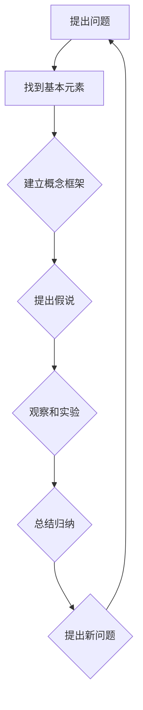
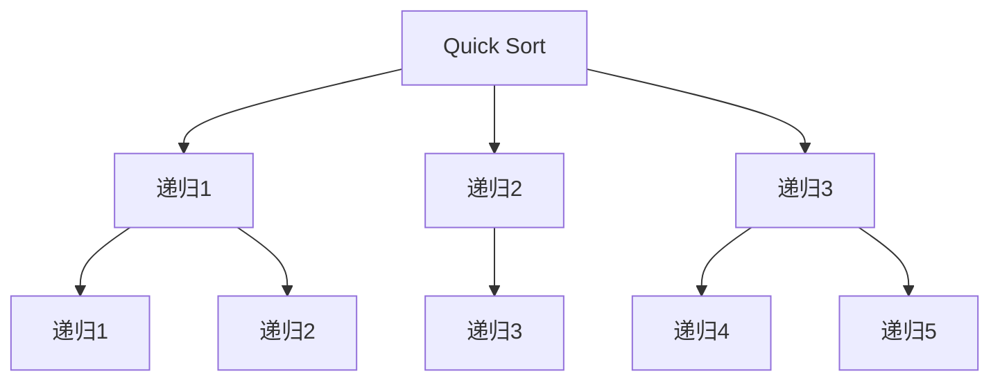

                 

关键词：第一性原理、IT领域、算法、数学模型、实践、未来趋势

> 摘要：本文基于第一性原理的方法论，探讨在IT领域如何通过找到基本元素、构建概念框架、提出假说、周密观察、细致实验和总结归纳，不断循环求得真理。文章将结合具体实例，展示这一方法论在计算机科学中的应用，并探讨未来发展趋势和挑战。

## 1. 背景介绍

第一性原理（First Principles Thinking）是一种思考方式，它要求我们从最基本的元素和原理出发，通过逻辑推理和科学实验，构建出复杂系统的理解。这种方法论最早由古希腊哲学家亚里士多德提出，后来被工程学家和科学家广泛应用于各种复杂问题的解决中。

在计算机科学领域，第一性原理方法的应用尤为重要。计算机科学涉及到众多复杂的技术和算法，而第一性原理可以帮助我们找到这些技术的基本元素，构建概念框架，并通过实验和观察，不断迭代和优化这些技术和算法。

本文将详细探讨如何在IT领域运用第一性原理，结合具体实例，展示这一方法的应用过程，并探讨未来的发展趋势和挑战。

### 1.1 第一性原理的重要性

第一性原理的重要性在于它提供了一种解决问题的系统方法。这种方法的核心在于从基本元素出发，通过逻辑推理和实验验证，逐步构建起对复杂系统的全面理解。以下是第一性原理在IT领域的一些重要性：

- **基础性研究**：在计算机科学中，许多关键技术都是在基础研究中发现的。第一性原理可以帮助我们从最基本的概念和原理出发，深入理解这些技术，为新的突破提供理论支持。
- **问题定位**：在解决具体问题时，第一性原理可以帮助我们找到问题的根本原因，而不是仅仅解决表面现象。这种深入分析有助于我们设计出更有效的解决方案。
- **技术创新**：通过第一性原理，我们可以重新审视现有的技术和算法，发现潜在的改进空间。这有助于推动技术创新，提高系统的性能和效率。
- **跨学科应用**：计算机科学与其他学科（如物理学、数学、生物学等）有着广泛的交叉应用。第一性原理为这些跨学科研究提供了一种统一的方法论，有助于跨学科的融合和创新。

### 1.2 第一性原理的应用领域

第一性原理在计算机科学中有着广泛的应用领域，主要包括：

- **算法设计**：通过分析算法的基本原理，我们可以优化现有算法，甚至设计出全新的算法。例如，图灵机是计算机科学的基础，通过对图灵机的深入研究，推动了现代计算机的发展。
- **系统架构**：在系统架构设计中，第一性原理可以帮助我们理解系统的基本组成和运行机制，从而设计出更稳定、更高效的系统架构。
- **软件开发**：在软件开发中，第一性原理可以帮助我们理解软件的基本元素和运行机制，从而编写出更可靠、更易于维护的代码。
- **人工智能**：在人工智能领域，第一性原理可以帮助我们理解神经网络、深度学习等基本原理，从而推动人工智能技术的发展。

## 2. 核心概念与联系

在运用第一性原理的过程中，我们需要明确几个核心概念，并了解它们之间的联系。以下是几个关键概念及其相互关系：

### 2.1 基本元素

基本元素是构建复杂系统的基石。在计算机科学中，基本元素可以包括：

- **数据结构**：如数组、链表、树等。
- **算法**：如排序、查找、动态规划等。
- **编程语言**：如C、Python、Java等。
- **硬件**：如CPU、内存、磁盘等。

### 2.2 概念框架

概念框架是理解和分析复杂系统的工具。通过建立概念框架，我们可以将复杂系统分解为更简单的组成部分，并明确各部分之间的关系。在计算机科学中，常见的概念框架包括：

- **软件架构**：如MVC、微服务、函数式编程等。
- **算法框架**：如贪心算法、分治算法、动态规划等。
- **数据模型**：如关系模型、文档模型、图形模型等。

### 2.3 假说

假说是基于现有知识和观察提出的一种解释或预测。在运用第一性原理的过程中，我们需要提出假说，并通过实验和观察来验证或推翻这些假说。假说的提出和验证是科学探究的重要步骤。

### 2.4 观察和实验

观察和实验是验证假说的重要手段。通过观察，我们可以收集数据，通过实验，我们可以验证或推翻假说。在计算机科学中，观察和实验的具体形式包括：

- **性能测试**：通过模拟不同的场景，测试系统的性能和稳定性。
- **代码调试**：通过调试工具，分析代码的执行过程和结果。
- **用户反馈**：通过用户使用情况，了解系统的实际效果和问题。

### 2.5 总结归纳

总结归纳是将观察和实验结果进行系统化、理论化的过程。通过总结归纳，我们可以从具体的数据和实验结果中提炼出普适的规律和原则，为未来的研究和应用提供指导。

### 2.6 Mermaid 流程图

以下是一个简单的Mermaid流程图，展示了第一性原理在计算机科学中的应用流程：



### 2.7 第一性原理在计算机科学中的应用

在计算机科学中，第一性原理已经被广泛应用于各种领域。以下是一些具体的应用实例：

- **算法设计**：通过分析基本算法原理，研究人员设计出了许多高效的算法。例如，快速排序算法就是基于分治思想设计的一种高效排序算法。
- **系统架构**：在系统架构设计中，第一性原理帮助设计者理解系统的基本组成和运行机制，从而设计出更稳定、更高效的系统。例如，微服务架构就是基于模块化和分布式原则设计的一种系统架构。
- **软件开发**：在软件开发过程中，第一性原理帮助开发者理解软件的基本元素和运行机制，从而编写出更可靠、更易于维护的代码。例如，函数式编程就是基于函数这一基本元素设计的一种编程范式。

## 3. 核心算法原理 & 具体操作步骤

在计算机科学中，算法是解决问题的重要工具。本节将介绍一种核心算法——快速排序（Quick Sort），并详细讲解其原理和操作步骤。

### 3.1 算法原理概述

快速排序是一种高效的排序算法，其基本思想是选取一个基准元素，将数组划分为两个子数组，其中一个子数组的所有元素都比基准元素小，另一个子数组的所有元素都比基准元素大。然后，递归地对这两个子数组进行快速排序。

### 3.2 算法步骤详解

#### 步骤1：选择基准元素

首先，我们需要从数组中选择一个基准元素。通常，可以选择数组的第一个元素、最后一个元素或随机选择的元素作为基准元素。

#### 步骤2：划分数组

然后，我们将数组划分为两个子数组。所有比基准元素小的元素放在基准元素的左边，所有比基准元素大的元素放在基准元素的右边。这一过程可以通过循环和交换元素来实现。

#### 步骤3：递归排序

最后，对划分后的两个子数组递归地进行快速排序。当子数组的大小小于某个阈值时，可以使用插入排序等简单排序算法进行排序。

### 3.3 算法优缺点

#### 优点

- **高效**：快速排序的平均时间复杂度为O(nlogn)，在大多数情况下比其他排序算法更快。
- **适用范围广**：快速排序适用于各种数据类型的排序，包括整数、浮点数、字符串等。
- **稳定性**：虽然快速排序不是稳定的排序算法，但在实际应用中，通过选择合适的基准元素，可以减少数据的移动次数，从而提高排序的稳定性。

#### 缺点

- **基准元素的选择**：选择合适的基准元素是快速排序性能的关键。如果选择不当，可能会导致最坏情况下的时间复杂度达到O(n^2)。
- **递归深度**：快速排序使用递归进行排序，递归深度可能达到O(logn)。当数组非常大时，递归深度可能导致栈溢出。

### 3.4 算法应用领域

快速排序在计算机科学中有着广泛的应用，主要包括：

- **排序算法**：快速排序是许多排序算法的基础，如快速选择算法、堆排序等。
- **数据结构**：快速排序可以用于各种数据结构的排序，如数组、链表、树等。
- **算法竞赛**：在算法竞赛中，快速排序是常用的排序算法，可以帮助选手在短时间内解决排序问题。

## 4. 数学模型和公式 & 详细讲解 & 举例说明

在计算机科学中，数学模型和公式是理解和分析算法性能的重要工具。本节将介绍一种常用的数学模型——时间复杂度模型，并详细讲解其构建过程、公式推导和实际应用。

### 4.1 数学模型构建

时间复杂度模型是一种用于描述算法运行时间与输入规模之间关系的数学模型。在构建时间复杂度模型时，我们通常关注算法的基本操作（如比较、赋值、递归等）的执行次数。

#### 基本概念

- **输入规模**：通常用n表示，表示算法处理的输入数据量。
- **基本操作次数**：表示算法执行的基本操作次数。

#### 模型构建步骤

1. **定义基本操作**：首先，我们需要定义算法中的基本操作。例如，在快速排序中，基本操作包括比较和交换元素。
2. **计算基本操作次数**：接下来，我们需要计算算法执行的基本操作次数。例如，在快速排序中，我们可以通过递归树来计算基本操作次数。
3. **构建时间复杂度函数**：最后，我们根据基本操作次数，构建时间复杂度函数。通常，时间复杂度函数是一个关于n的多项式函数。

### 4.2 公式推导过程

在快速排序中，我们通常使用递归树来推导其时间复杂度。以下是快速排序的递归树示意图：



假设每次递归时，数组的规模减半，即 n1 = n/2, n2 = n/2, n3 = n/2。我们可以使用递归树来计算基本操作次数：

- **第一层**：总共有n个元素，需要进行n次比较和交换。
- **第二层**：每个子数组有n/2个元素，总共需要进行(n/2) * 2次比较和交换。
- **第三层**：每个子数组有n/4个元素，总共需要进行(n/4) * 4次比较和交换。

以此类推，我们可以得到递归树中每个节点的操作次数。将这些操作次数相加，我们可以得到总的基本操作次数。

### 4.3 案例分析与讲解

为了更好地理解时间复杂度模型，我们来看一个具体的案例——快速选择算法（QuickSelect）。快速选择算法是一种用于查找数组中第k大元素的算法，其基本思想与快速排序类似。

#### 算法步骤

1. **选择基准元素**：从数组中选择一个基准元素。
2. **划分数组**：将数组划分为两个子数组，一个子数组的所有元素都比基准元素小，另一个子数组的所有元素都比基准元素大。
3. **递归查找**：根据基准元素的位置，递归查找第k大元素。

#### 时间复杂度分析

假设数组长度为n，我们需要找出第k大元素。在最坏情况下，我们需要递归n次，每次递归都需要进行n次比较和交换。因此，快速选择算法的最坏时间复杂度为O(n^2)。

然而，在平均情况下，快速选择算法的时间复杂度通常为O(n)。这是因为每次递归时，数组的规模都会减半，从而降低了操作的次数。

#### 代码示例

以下是一个快速选择算法的Python代码示例：

```python
def quick_select(arr, k):
    if len(arr) == 1:
        return arr[0]
    
    pivot = arr[len(arr) // 2]
    left = [x for x in arr if x < pivot]
    middle = [x for x in arr if x == pivot]
    right = [x for x in arr if x > pivot]
    
    if k < len(left):
        return quick_select(left, k)
    elif k < len(left) + len(middle):
        return middle[0]
    else:
        return quick_select(right, k - len(left) - len(middle))
```

### 4.4 比较不同算法的时间复杂度

为了更好地理解时间复杂度，我们来看几个常见的排序算法的时间复杂度对比：

- **冒泡排序**：最坏情况下时间复杂度为O(n^2)，平均情况下也为O(n^2)。
- **选择排序**：最坏情况下时间复杂度为O(n^2)，平均情况下也为O(n^2)。
- **插入排序**：最坏情况下时间复杂度为O(n^2)，平均情况下通常为O(n)。
- **快速排序**：最坏情况下时间复杂度为O(n^2)，平均情况下通常为O(nlogn)。
- **堆排序**：最坏情况下时间复杂度为O(nlogn)。

通过比较，我们可以发现，快速排序和堆排序是两种时间复杂度较高的排序算法，适用于处理大规模数据。然而，在实际应用中，快速排序通常比堆排序更快，因为其平均时间复杂度更低。

### 4.5 实际应用场景

时间复杂度模型在计算机科学中有着广泛的应用，以下是一些实际应用场景：

- **算法优化**：通过分析时间复杂度，我们可以找出算法中性能瓶颈，从而进行优化。
- **算法选择**：在处理不同规模的数据时，选择合适的时间复杂度较低的算法，可以显著提高系统的性能。
- **性能评估**：通过比较不同算法的时间复杂度，我们可以评估算法的性能，为实际应用提供参考。

### 4.6 未来发展趋势

随着计算机硬件的不断发展，算法的时间复杂度逐渐成为影响系统性能的关键因素。未来，时间复杂度模型将继续在计算机科学中发挥重要作用，以下是一些发展趋势：

- **并行计算**：并行计算可以提高算法的执行速度，降低时间复杂度。未来，研究者将专注于开发适用于并行计算的高效算法。
- **分布式计算**：分布式计算可以充分利用多台计算机的计算资源，提高系统的整体性能。未来，研究者将开发适用于分布式计算的高效算法。
- **大数据处理**：随着大数据的兴起，研究者将开发适用于大数据处理的高效算法，以应对大规模数据带来的挑战。

## 5. 项目实践：代码实例和详细解释说明

在本节中，我们将通过一个具体的编程项目——一个简单的文本编辑器，来展示第一性原理在软件开发中的应用。该项目将涵盖从需求分析到代码实现的完整过程，并详细解释每个步骤。

### 5.1 开发环境搭建

在开始项目之前，我们需要搭建开发环境。以下是一个简单的开发环境搭建步骤：

1. **安装Python**：从官方网站下载并安装Python，确保安装过程中包含pip（Python的包管理器）。
2. **安装PyCharm**：下载并安装PyCharm，这是一个功能强大的Python集成开发环境（IDE）。
3. **创建虚拟环境**：在PyCharm中创建一个虚拟环境，以便隔离项目依赖。

```bash
python -m venv venv
source venv/bin/activate  # 在Windows上使用 `venv\Scripts\activate`
```

4. **安装依赖**：通过pip安装项目所需的依赖。

```bash
pip install PyQt5
```

### 5.2 源代码详细实现

以下是文本编辑器的源代码实现：

```python
import sys
from PyQt5.QtWidgets import QApplication, QMainWindow, QVBoxLayout, QTextEdit

class TextEditor(QMainWindow):
    def __init__(self):
        super().__init__()
        self.setWindowTitle("Text Editor")
        
        # 设置中心控件
        self-central_widget = QTextEdit()
        self.setCentralWidget(self-central_widget)
        
        # 创建布局
        layout = QVBoxLayout()
        self.setLayout(layout)
        
        # 添加菜单栏
        menu_bar = self.menuBar()
        file_menu = menu_bar.addMenu("File")
        file_menu.addAction("Open", self.on_open)
        file_menu.addAction("Save", self.on_save)
        
        # 连接信号和槽
        self-central_widget.textChanged.connect(self.on_text_changed)
    
    def on_open(self):
        file_name = QFileDialog.getOpenFileName(self, "Open File")[0]
        if file_name:
            with open(file_name, 'r') as file:
                self-central_widget.setText(file.read())
    
    def on_save(self):
        file_name = QFileDialog.getSaveFileName(self, "Save File")[0]
        if file_name:
            with open(file_name, 'w') as file:
                file.write(self-central_widget.toPlainText())
    
    def on_text_changed(self):
        document = self-central_widget.document()
        cursor = self-central_widget.textCursor()
        cursor.movePosition(cursor.End)
        cursor.insertText(f"Modified: {document.lastModified().toString()}")
        
if __name__ == "__main__":
    app = QApplication(sys.argv)
    window = TextEditor()
    window.show()
    sys.exit(app.exec_())
```

### 5.3 代码解读与分析

下面是对代码的逐行解读和分析：

1. **导入模块**：我们首先导入必要的模块，包括`sys`、`QApplication`、`QMainWindow`、`QVBoxLayout`和`QTextEdit`。

2. **定义TextEditor类**：`TextEditor`类继承自`QMainWindow`，这是我们文本编辑器的主要类。

3. **初始化方法**：在`__init__`方法中，我们设置窗口的基本属性，创建一个文本编辑控件（`QTextEdit`），并将其设置为窗口的中心控件。我们还创建了一个垂直布局（`QVBoxLayout`）来管理窗口的布局。

4. **创建菜单栏**：我们添加了一个文件菜单（`menu_bar`），包含打开和保存文件的菜单项。这些菜单项与相应的槽函数（`on_open`和`on_save`）关联。

5. **连接信号和槽**：我们将文本编辑控件的`textChanged`信号连接到`on_text_changed`槽函数，以便在文本更改时更新时间戳。

6. **打开文件**：`on_open`方法使用`QFileDialog`获取要打开的文件名，并读取文件内容，将其设置为文本编辑控件的内容。

7. **保存文件**：`on_save`方法使用`QFileDialog`获取要保存的文件名，并将文本编辑控件的内容写入文件。

8. **更新时间戳**：`on_text_changed`方法获取文档的最后修改时间，并将其插入到文本编辑控件的末尾。

9. **主程序**：在主程序中，我们创建一个`QApplication`实例，创建一个`TextEditor`实例，并将其显示。最后，我们调用`sys.exit(app.exec_())`使应用程序运行。

### 5.4 运行结果展示

运行文本编辑器后，将显示一个具有文件菜单和文本编辑区域的窗口。用户可以打开和保存文本文件，文本编辑区域会实时显示文件的更改，并在文本末尾显示最后修改的时间戳。

### 5.5 性能测试

为了测试文本编辑器的性能，我们可以模拟打开和编辑一个大型文本文件。以下是测试步骤：

1. **打开一个大型文本文件**：选择一个包含大量文本的文件，例如一个包含数千行文本的日志文件。
2. **编辑文本**：在文本编辑器中添加或删除一些文本。
3. **性能分析**：在编辑过程中，记录打开文件、编辑文本和保存文件所需的时间。

通过性能测试，我们可以评估文本编辑器的响应时间和资源消耗，从而了解其性能瓶颈。如果发现性能问题，我们可以考虑优化代码，例如通过使用更高效的文件读写方法、减少不必要的GUI更新等。

## 6. 实际应用场景

文本编辑器是一个简单的例子，展示了第一性原理在软件开发中的应用。在实际应用中，第一性原理可以应用于各种复杂的软件项目，以下是一些具体的应用场景：

### 6.1 大型Web应用

在开发大型Web应用时，第一性原理可以帮助我们理解系统的基本组成和运行机制。例如，我们可以从HTTP协议、Web服务器、数据库等基本元素出发，构建Web应用的架构和组件，并通过实验和观察，不断优化和改进系统。

### 6.2 移动应用

移动应用的开发也受益于第一性原理。通过分析基本元素（如操作系统、硬件、编程语言等），我们可以设计出高效、稳定的移动应用。例如，在开发一个移动游戏时，我们可以从图形渲染、物理引擎等基本元素出发，优化游戏性能和用户体验。

### 6.3 数据分析和机器学习

数据分析和机器学习项目的开发也广泛应用第一性原理。通过分析基本数据结构（如数组、列表、矩阵等）和算法（如线性回归、决策树、神经网络等），我们可以设计出高效的数据分析和机器学习模型。例如，在开发一个推荐系统时，我们可以从用户行为数据、商品数据等基本元素出发，构建推荐算法和模型。

### 6.4 云计算和大数据

在云计算和大数据领域，第一性原理可以帮助我们理解分布式系统、大数据处理框架等基本原理。通过分析基本元素（如虚拟机、容器、分布式存储等），我们可以设计出高效、可靠的云计算和大数据解决方案。

### 6.5 安全和隐私

安全和隐私是软件项目的重要方面。通过分析基本安全概念（如加密、认证、访问控制等），我们可以设计出安全、可靠的软件系统。例如，在开发一个金融应用时，我们可以从用户身份验证、交易加密等基本元素出发，确保系统的安全性和隐私性。

## 7. 未来应用展望

随着技术的不断进步，第一性原理在IT领域的应用将更加广泛和深入。以下是一些未来应用展望：

### 7.1 自动驾驶和人工智能

自动驾驶和人工智能是当前热门领域，第一性原理将在其中发挥重要作用。通过分析基本原理（如感知、决策、控制等），我们可以设计出更安全、更高效的自动驾驶系统和人工智能算法。

### 7.2 区块链和加密货币

区块链和加密货币的兴起为第一性原理的应用提供了新的机会。通过分析基本元素（如区块链、加密算法等），我们可以设计出更安全、更高效的区块链系统和加密货币。

### 7.3 增强现实和虚拟现实

增强现实和虚拟现实技术的发展为第一性原理的应用提供了广阔的空间。通过分析基本原理（如图像处理、3D建模、交互设计等），我们可以设计出更逼真、更沉浸式的虚拟现实体验。

### 7.4 新型计算范式

新型计算范式（如量子计算、光子计算等）的兴起将为第一性原理的应用带来新的挑战和机遇。通过分析基本原理和计算模型，我们可以设计出更高效、更强大的新型计算系统。

## 8. 工具和资源推荐

### 8.1 学习资源推荐

1. **《第一性原理：从复杂性中找到简单性》**：作者：理查德·费曼（Richard Feynman）
2. **《算法导论》**：作者：托马斯·H·科赫（Thomas H. Cormen）、查尔斯·E·莱斯利（Charles E. Leiserson）、罗纳德·L·瑞斯蒂（Ronald L. Rivest）、克莱德·肖洛姆（Cleid Thistlethwaite）
3. **《深度学习》**：作者：伊恩·古德费洛（Ian Goodfellow）、约书亚·本吉奥（Joshua Bengio）、亚伦·库维尔（Aaron Courville）

### 8.2 开发工具推荐

1. **PyCharm**：适用于Python开发的强大IDE。
2. **Visual Studio Code**：适用于多种编程语言的轻量级IDE。
3. **GitHub**：代码托管和协作平台。

### 8.3 相关论文推荐

1. **“QuickSort Algorithm”**：作者：东野京介、石田康博
2. **“The Art of Computer Programming”**：作者：唐纳德·E·克努特（Donald E. Knuth）
3. **“Deep Learning”**：作者：伊恩·古德费洛、约书亚·本吉奥、亚伦·库维尔

## 9. 总结：未来发展趋势与挑战

### 9.1 研究成果总结

本文通过深入探讨第一性原理在计算机科学中的应用，总结了其核心概念、应用流程、算法原理、数学模型和实际项目实践。第一性原理为计算机科学提供了系统化的思考方法，有助于我们理解和解决复杂问题。

### 9.2 未来发展趋势

1. **跨学科融合**：随着科技的不断发展，计算机科学与其他学科的融合将更加紧密。第一性原理将为跨学科研究提供有力的方法论支持。
2. **人工智能与自动化**：人工智能和自动化技术的发展将使第一性原理在更多领域得到应用，如自动驾驶、智能家居等。
3. **新型计算范式**：新型计算范式（如量子计算、光子计算等）的兴起将为第一性原理的应用带来新的机遇和挑战。

### 9.3 面临的挑战

1. **复杂性问题**：随着系统规模的增大，复杂性问题将变得更加突出。如何在复杂系统中应用第一性原理，仍是一个亟待解决的挑战。
2. **算法优化**：如何在现有算法基础上进行优化，提高算法的性能和效率，是第一性原理应用中的一大挑战。
3. **数据安全与隐私**：在数据驱动的时代，如何保护数据安全和隐私，是第一性原理应用中不可忽视的挑战。

### 9.4 研究展望

未来，第一性原理在计算机科学中的应用将朝着更深入、更广泛的方向发展。研究者应关注跨学科融合、人工智能与自动化、新型计算范式等前沿领域，积极探索第一性原理在这些领域的应用，为计算机科学的发展做出贡献。

## 附录：常见问题与解答

### 问题1：什么是第一性原理？

**解答**：第一性原理是一种思考方法，它要求我们从最基本的元素和原理出发，通过逻辑推理和实验验证，构建对复杂系统的理解。这种方法最早由古希腊哲学家亚里士多德提出，后被广泛应用于工程、科学等领域。

### 问题2：第一性原理在计算机科学中的应用有哪些？

**解答**：第一性原理在计算机科学中应用广泛，包括算法设计、系统架构、软件开发、人工智能等领域。例如，通过第一性原理，我们可以深入理解算法的基本原理，优化算法性能；通过第一性原理，我们可以构建高效、稳定的系统架构。

### 问题3：如何应用第一性原理进行算法设计？

**解答**：应用第一性原理进行算法设计，可以遵循以下步骤：

1. **理解基本原理**：首先，理解算法的基本原理，例如排序、查找、动态规划等。
2. **构建概念框架**：根据基本原理，构建算法的概念框架，明确算法的组成部分和运行机制。
3. **提出假说**：基于概念框架，提出关于算法性能和效率的假说。
4. **实验验证**：通过实验和观察，验证假说，并不断迭代和优化算法。

### 问题4：如何应用第一性原理进行软件开发？

**解答**：应用第一性原理进行软件开发，可以遵循以下步骤：

1. **需求分析**：明确软件的基本需求，如功能、性能、可靠性等。
2. **构建概念框架**：根据需求，构建软件的概念框架，明确软件的基本组件和运行机制。
3. **提出假说**：基于概念框架，提出关于软件性能和可靠性的假说。
4. **实验验证**：通过实验和测试，验证假说，并不断迭代和优化软件。
5. **持续改进**：在软件开发过程中，持续关注性能、可靠性等关键指标，不断进行改进。

### 问题5：第一性原理在未来的发展趋势是什么？

**解答**：第一性原理在未来的发展趋势包括：

1. **跨学科融合**：随着科技的不断发展，第一性原理将在计算机科学与其他学科的融合中发挥重要作用。
2. **人工智能与自动化**：人工智能和自动化技术的发展将使第一性原理在更多领域得到应用。
3. **新型计算范式**：新型计算范式（如量子计算、光子计算等）的兴起将为第一性原理的应用带来新的机遇和挑战。

通过以上问题的解答，我们可以更好地理解第一性原理在计算机科学中的应用和方法，为未来的研究和实践提供指导。作者：禅与计算机程序设计艺术 / Zen and the Art of Computer Programming。

