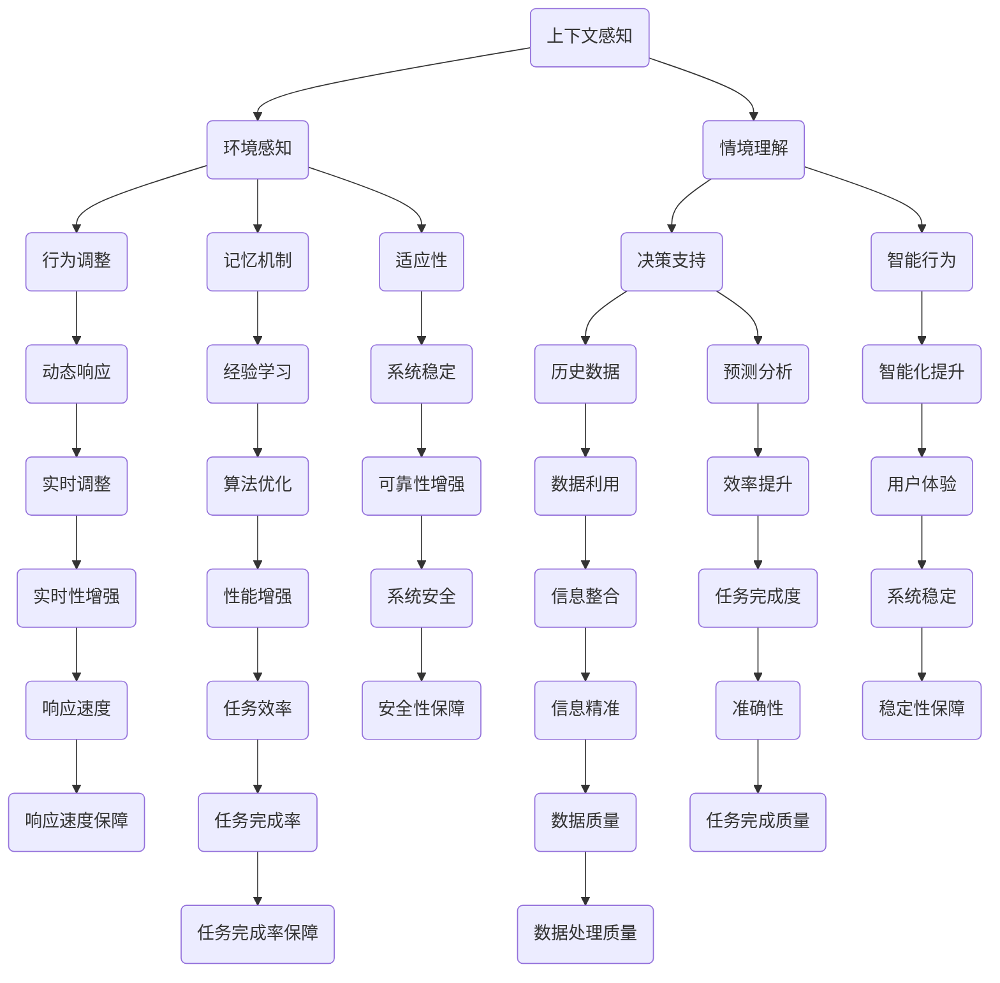

                 

上下文感知和记忆机制是现代计算机科学中不可或缺的部分，尤其在人工智能、自然语言处理和复杂系统设计等领域中扮演着关键角色。这一章将探讨上下文感知和记忆机制的基本概念、原理以及其在实际应用中的重要性。我们将通过深入分析这些机制，揭示其在推动技术进步方面所发挥的巨大作用。

## 文章关键词

- 上下文感知
- 记忆机制
- 人工智能
- 自然语言处理
- 系统设计
- 计算机程序设计

## 文章摘要

本文旨在全面探讨上下文感知和记忆机制在计算机科学中的核心作用。通过对这些机制的深入分析，我们将揭示其在人工智能、自然语言处理和复杂系统设计中的应用。文章首先介绍了上下文感知和记忆机制的基本概念，接着通过具体实例展示了这些机制在现实世界中的重要性。此外，文章还探讨了这些机制的未来发展趋势和面临的挑战。

## 1. 背景介绍

上下文感知和记忆机制是现代计算机科学中的核心技术之一，它们不仅为人工智能系统提供了智能化的基础，也为复杂系统的设计提供了强大的支持。在早期，计算机系统主要依赖硬编码的规则和指令集来处理任务，这限制了它们的灵活性和适应性。随着计算机科学的发展，研究人员逐渐认识到，通过引入上下文感知和记忆机制，可以使计算机系统更具有智能性和自适应能力。

上下文感知是指计算机系统能够根据当前的环境和情境来调整其行为。这种能力使得计算机系统能够更好地理解和应对复杂多变的现实环境。记忆机制则是指计算机系统能够存储和处理历史信息，以帮助其做出更好的决策和预测。上下文感知和记忆机制的融合，使得计算机系统不仅在处理当前任务时表现出色，还能通过学习和适应不断提高其性能。

## 2. 核心概念与联系

为了更好地理解上下文感知和记忆机制，我们需要从核心概念和联系入手。以下是相关的Mermaid流程图：



### 2.1 核心概念概述

- **上下文感知**：上下文感知是指计算机系统识别和理解其运行环境的能力。这包括对当前情境、用户行为、外部输入等多种因素的综合理解。

- **环境感知**：环境感知是上下文感知的一部分，它涉及对物理环境、传感器数据、外部事件等的感知和理解。

- **情境理解**：情境理解是指计算机系统基于上下文信息来推断当前情境，并理解不同情境之间的关联。

- **行为调整**：行为调整是指计算机系统根据上下文信息和情境理解来调整其行为，以适应不同的任务需求。

- **记忆机制**：记忆机制是指计算机系统存储和管理历史数据的能力，这包括对数据的检索、更新和管理。

- **历史数据**：历史数据是记忆机制的核心，它为计算机系统提供了过去经验和信息的存储，以便在未来决策中使用。

- **经验学习**：经验学习是指计算机系统通过分析和利用历史数据来改进其性能和决策能力。

- **适应性**：适应性是指计算机系统根据环境变化和上下文信息调整其行为和策略的能力。

- **智能行为**：智能行为是指计算机系统在上下文感知和记忆机制的支持下，表现出类似人类智能的行为和决策能力。

- **动态响应**：动态响应是指计算机系统对实时变化的上下文信息做出快速反应和调整的能力。

- **预测分析**：预测分析是指计算机系统利用历史数据和上下文信息来预测未来事件和趋势。

- **数据利用**：数据利用是指计算机系统有效利用历史数据和上下文信息，以优化决策和提升性能。

- **算法优化**：算法优化是指通过改进算法设计和实现，提高计算机系统的性能和效率。

- **系统稳定**：系统稳定是指计算机系统在长时间运行过程中，保持性能和行为的稳定性。

- **智能化提升**：智能化提升是指通过引入上下文感知和记忆机制，提高计算机系统的智能水平和应用能力。

- **实时调整**：实时调整是指计算机系统在运行过程中，根据实时接收到的上下文信息，快速调整其行为和策略。

- **效率提升**：效率提升是指通过优化算法和系统设计，提高计算机系统的运行效率和资源利用率。

- **信息整合**：信息整合是指计算机系统将来自不同来源的信息进行整合和分析，以获得更全面和准确的理解。

- **性能增强**：性能增强是指通过改进硬件和软件设计，提高计算机系统的处理能力和响应速度。

- **可靠性增强**：可靠性增强是指通过引入冗余和容错机制，提高计算机系统的稳定性和可靠性。

- **用户体验**：用户体验是指计算机系统提供的操作界面和交互体验，以满足用户的需求和期望。

- **响应速度**：响应速度是指计算机系统对用户输入和外部事件的响应时间。

- **任务完成度**：任务完成度是指计算机系统在执行任务过程中，达到预期目标的比例和效果。

- **数据质量**：数据质量是指历史数据和上下文信息的准确性和完整性。

- **任务完成率**：任务完成率是指计算机系统在执行任务时，成功完成任务的次数与总次数的比率。

- **安全性保障**：安全性保障是指计算机系统通过安全机制和策略，保护数据和系统的安全。

- **稳定性保障**：稳定性保障是指计算机系统在长时间运行过程中，保持性能和行为的稳定性。

- **响应速度保障**：响应速度保障是指计算机系统在运行过程中，保持快速响应的能力。

- **任务完成质量**：任务完成质量是指计算机系统在执行任务时，所达到的目标质量和效果。

- **数据处理质量**：数据处理质量是指计算机系统对数据的处理和输出结果的准确性和可靠性。

### 2.2 核心概念之间的联系

上下文感知和记忆机制之间的联系是密不可分的。上下文感知提供了对当前环境和情境的理解，而记忆机制则负责存储和管理历史数据，以支持基于上下文的决策和行动。以下是这些概念之间联系的详细说明：

- **上下文感知** 和 **环境感知**：环境感知是上下文感知的一部分，它提供了对当前物理环境和外部事件的感知。这些感知数据是情境理解和行为调整的基础。

- **情境理解** 和 **行为调整**：情境理解基于上下文感知数据，通过分析环境和用户行为，计算机系统可以推断出当前情境。这些情境理解结果用于指导系统的行为调整。

- **记忆机制** 和 **历史数据**：记忆机制负责存储和管理历史数据，包括用户行为、系统状态和环境事件。这些历史数据是经验学习和预测分析的基础。

- **经验学习** 和 **适应性**：经验学习通过分析历史数据，帮助计算机系统不断改进其决策和行动策略。这种适应性使得系统能够更好地应对环境变化。

- **智能行为** 和 **动态响应**：智能行为是基于上下文感知和记忆机制的计算机系统所表现出的行为。动态响应是指系统对实时变化做出快速调整的能力。

- **预测分析** 和 **数据利用**：预测分析利用历史数据和上下文信息，帮助系统预测未来事件和趋势。数据利用则是将预测结果应用于实际决策和行动中。

- **算法优化** 和 **系统稳定**：算法优化是通过改进算法设计和实现，提高系统性能和效率。系统稳定则是指系统在长时间运行过程中，保持性能和行为的稳定性。

- **智能化提升** 和 **实时调整**：智能化提升是指通过上下文感知和记忆机制，提高系统的智能水平和应用能力。实时调整是指系统能够快速响应环境变化。

- **效率提升** 和 **信息整合**：效率提升是通过优化系统设计和算法，提高系统运行效率和资源利用率。信息整合是将来自不同来源的信息进行整合和分析，以获得更全面和准确的理解。

- **性能增强** 和 **可靠性增强**：性能增强是通过改进硬件和软件设计，提高系统的处理能力和响应速度。可靠性增强则是通过引入冗余和容错机制，提高系统的稳定性和可靠性。

- **用户体验** 和 **响应速度**：用户体验是指系统提供的操作界面和交互体验，以满足用户的需求和期望。响应速度是指系统对用户输入和外部事件的响应时间。

- **任务完成度** 和 **数据质量**：任务完成度是指系统在执行任务过程中，达到预期目标的比例和效果。数据质量是指系统处理和输出结果的准确性和完整性。

- **任务完成率** 和 **安全性保障**：任务完成率是指系统在执行任务时，成功完成任务的次数与总次数的比率。安全性保障是指系统通过安全机制和策略，保护数据和系统的安全。

- **稳定性保障** 和 **响应速度保障**：稳定性保障是指系统在长时间运行过程中，保持性能和行为的稳定性。响应速度保障是指系统在运行过程中，保持快速响应的能力。

- **任务完成质量** 和 **数据处理质量**：任务完成质量是指系统在执行任务时，所达到的目标质量和效果。数据处理质量是指系统对数据的处理和输出结果的准确性和可靠性。

通过这些核心概念之间的联系，我们可以看到上下文感知和记忆机制在计算机系统中的重要性。它们共同作用，使系统能够更好地理解环境、学习经验、适应变化，并实现智能化和高效化的操作。

## 3. 核心算法原理 & 具体操作步骤

### 3.1 算法原理概述

上下文感知和记忆机制的核心算法原理可以概括为以下几个关键点：

1. **环境感知与情境理解**：计算机系统通过传感器和外部接口，收集环境数据并对其进行处理。这些数据包括物理环境参数、用户行为特征等。通过复杂的算法，系统对这些数据进行解析，以识别当前情境。

2. **历史数据存储与管理**：系统使用数据库或缓存机制，存储和管理历史数据。这些数据包括用户行为记录、系统状态历史、环境变化日志等。记忆机制通过这些历史数据，帮助系统进行决策和预测。

3. **经验学习与智能行为**：通过机器学习和数据挖掘算法，系统从历史数据中提取经验和模式。这些经验用于改进系统行为和决策过程，使其更加智能化。

4. **动态响应与实时调整**：基于上下文感知和历史数据，系统实时调整其行为和策略。这种动态响应能力使得系统能够快速适应环境变化。

5. **预测分析与数据利用**：系统利用历史数据和上下文信息，进行预测分析，以预测未来事件和趋势。这些预测结果用于优化决策和行动。

6. **算法优化与系统稳定**：通过算法优化，系统提高其性能和效率。同时，系统设计考虑了冗余和容错机制，以提高稳定性和可靠性。

### 3.2 算法步骤详解

以下是上下文感知和记忆机制算法的具体操作步骤：

#### 步骤1：环境感知与情境理解

1. **传感器数据收集**：系统通过传感器（如摄像头、麦克风、温度传感器等）收集环境数据。
2. **数据预处理**：对收集到的数据进行清洗、标准化和特征提取，以提取关键信息。
3. **情境识别**：使用模式识别算法，如神经网络或决策树，对预处理后的数据进行分析，以识别当前情境。

#### 步骤2：历史数据存储与管理

1. **数据存储**：将情境识别结果、用户行为记录和系统状态历史等信息存储在数据库或缓存中。
2. **数据检索与更新**：当需要使用历史数据时，系统能够快速检索和更新相关数据，以保持数据的最新和准确。

#### 步骤3：经验学习与智能行为

1. **数据挖掘**：使用机器学习算法，如聚类分析、回归分析或深度学习，对历史数据进行分析，以提取经验和模式。
2. **行为优化**：基于挖掘出的经验和模式，系统调整其行为和决策策略，以提高其智能性和适应性。

#### 步骤4：动态响应与实时调整

1. **实时数据监控**：系统持续监控实时数据流，以检测环境变化和用户行为。
2. **行为调整**：根据实时数据和上下文信息，系统动态调整其行为和策略，以适应环境变化。

#### 步骤5：预测分析与数据利用

1. **预测模型构建**：使用历史数据和上下文信息，构建预测模型，如时间序列预测或回归模型。
2. **预测结果应用**：将预测结果应用于实际决策和行动中，以优化系统的性能和效率。

#### 步骤6：算法优化与系统稳定

1. **算法改进**：通过实验和验证，不断改进算法设计和实现，以提高系统性能和效率。
2. **系统测试与验证**：对系统进行全面的测试和验证，确保其在不同环境下的稳定性和可靠性。

### 3.3 算法优缺点

#### 优点

1. **智能性提升**：上下文感知和记忆机制使得计算机系统能够更智能地理解和应对复杂环境。
2. **适应性增强**：系统能够通过学习和适应，提高其适应不同情境和用户需求的能力。
3. **效率优化**：通过预测分析和实时调整，系统可以优化其行为和决策，提高任务完成速度和资源利用率。
4. **可靠性提高**：引入冗余和容错机制，系统在长时间运行过程中，保持稳定性和可靠性。

#### 缺点

1. **计算资源消耗**：上下文感知和记忆机制涉及大量数据分析和算法计算，可能导致计算资源消耗较大。
2. **数据质量要求**：历史数据和上下文信息的质量直接影响系统的性能和决策效果，因此对数据质量要求较高。
3. **实时性能挑战**：在实时应用中，系统需要快速响应和调整，这可能对系统的实时性能提出较高要求。

### 3.4 算法应用领域

上下文感知和记忆机制在多个领域具有广泛应用，以下是其中几个典型的应用领域：

1. **人工智能**：在人工智能系统中，上下文感知和记忆机制用于增强智能体的学习和决策能力，如自动驾驶、智能家居和智能客服。
2. **自然语言处理**：在自然语言处理任务中，上下文感知和记忆机制用于理解用户意图和提供更准确的翻译和文本分析。
3. **复杂系统设计**：在复杂系统设计中，上下文感知和记忆机制用于优化系统的行为和性能，如分布式系统、物联网和智能电网。
4. **医疗保健**：在医疗保健领域，上下文感知和记忆机制用于辅助诊断和治疗，如电子健康记录、药物推荐和健康监测。

## 4. 数学模型和公式 & 详细讲解 & 举例说明

### 4.1 数学模型构建

上下文感知和记忆机制的数学模型通常涉及概率论、统计学和机器学习等多个领域。以下是构建这些模型的基本步骤和常用数学工具：

#### 4.1.1 概率论与统计学

1. **概率分布函数**：用于描述环境数据或历史数据的概率分布。常用的概率分布函数包括正态分布、泊松分布和伽马分布等。
2. **特征提取**：通过统计学方法，从原始数据中提取关键特征。常用的特征提取方法包括主成分分析（PCA）和线性判别分析（LDA）等。
3. **假设检验**：用于验证系统在不同情境下的假设是否成立。常用的假设检验方法包括t检验和卡方检验等。

#### 4.1.2 机器学习

1. **监督学习**：用于从标记数据中学习模式和规律。常用的监督学习方法包括线性回归、支持向量机和神经网络等。
2. **无监督学习**：用于从未标记数据中学习结构和模式。常用的无监督学习方法包括聚类分析、降维和自编码器等。
3. **增强学习**：用于通过试错方式学习最优策略。常用的增强学习方法包括Q学习和深度增强学习等。

### 4.2 公式推导过程

以下是一个简单的机器学习模型（线性回归）的公式推导过程，用于说明上下文感知和记忆机制中的算法原理。

#### 4.2.1 线性回归模型

线性回归模型是一种简单的机器学习模型，用于预测连续值输出。其公式如下：

$$
y = \beta_0 + \beta_1 \cdot x
$$

其中，$y$ 是输出值，$x$ 是输入值，$\beta_0$ 和 $\beta_1$ 是模型参数。

#### 4.2.2 公式推导

1. **目标函数**：

   线性回归模型的目标是最小化预测值与实际值之间的误差。其目标函数如下：

   $$
   J(\beta_0, \beta_1) = \sum_{i=1}^{n} (y_i - (\beta_0 + \beta_1 \cdot x_i))^2
   $$

   其中，$n$ 是数据点的数量，$y_i$ 和 $x_i$ 分别是第 $i$ 个数据点的实际输出值和输入值。

2. **偏导数计算**：

   对目标函数 $J(\beta_0, \beta_1)$ 分别对 $\beta_0$ 和 $\beta_1$ 求偏导数，得到：

   $$
   \frac{\partial J}{\partial \beta_0} = -2 \sum_{i=1}^{n} (y_i - (\beta_0 + \beta_1 \cdot x_i))
   $$

   $$
   \frac{\partial J}{\partial \beta_1} = -2 \sum_{i=1}^{n} (y_i - (\beta_0 + \beta_1 \cdot x_i)) \cdot x_i
   $$

3. **求解参数**：

   将上述偏导数设置为0，求解得到最优参数：

   $$
   \beta_0 = \frac{1}{n} \sum_{i=1}^{n} (y_i - \beta_1 \cdot x_i)
   $$

   $$
   \beta_1 = \frac{1}{n} \sum_{i=1}^{n} (y_i - \beta_0 - \beta_1 \cdot x_i) \cdot x_i
   $$

   这两个公式可以通过最小二乘法求解，以最小化目标函数 $J(\beta_0, \beta_1)$。

### 4.3 案例分析与讲解

以下是一个简单的案例，说明如何使用线性回归模型进行上下文感知和记忆机制的应用。

#### 4.3.1 案例背景

假设我们有一个智能家居系统，需要根据用户的日常行为预测其未来的需求。例如，用户每天早上7点都会打开灯，因此系统需要预测用户在早上7点是否会打开灯。

#### 4.3.2 数据收集

我们收集了用户过去一个月的开关灯记录，包括开关灯的时间、开关灯的状态（开/关）以及其他相关环境参数（如天气、温度等）。

#### 4.3.3 数据预处理

我们对收集到的数据进行了预处理，包括数据清洗、特征提取和标准化等步骤。例如，我们将时间数据转换为小时数，将天气数据转换为天气类型的编码值。

#### 4.3.4 模型训练

我们使用线性回归模型对预处理后的数据进行训练。通过最小二乘法求解，得到最优参数 $\beta_0$ 和 $\beta_1$。

#### 4.3.5 模型预测

当系统需要预测用户在早上7点是否会打开灯时，我们可以将当前时间（7点）和其他相关环境参数（如天气类型）作为输入，带入线性回归模型中进行预测。如果预测结果大于0，则认为用户会打开灯；否则，认为用户不会打开灯。

#### 4.3.6 模型评估

为了评估模型的性能，我们使用交叉验证方法，将数据集分为训练集和测试集。通过在训练集上训练模型，在测试集上评估模型性能，以确定模型的预测准确性。

通过这个案例，我们可以看到如何将线性回归模型应用于上下文感知和记忆机制，以预测用户行为和优化系统性能。这只是一个简单的示例，实际应用中可能涉及更复杂的模型和算法。

## 5. 项目实践：代码实例和详细解释说明

### 5.1 开发环境搭建

为了更好地展示上下文感知和记忆机制的应用，我们将使用Python编程语言和相关的库来搭建一个简单的项目环境。以下是开发环境搭建的步骤：

#### 5.1.1 安装Python

首先，确保您的计算机上安装了Python。Python的最新版本可以从[Python官方网站](https://www.python.org/)下载并安装。

#### 5.1.2 安装必需的库

为了实现上下文感知和记忆机制，我们将使用以下库：

- NumPy：用于数值计算和数据处理。
- Pandas：用于数据分析和数据预处理。
- Scikit-learn：用于机器学习和数据挖掘。
- Matplotlib：用于数据可视化。

您可以使用pip命令安装这些库：

```bash
pip install numpy pandas scikit-learn matplotlib
```

### 5.2 源代码详细实现

以下是实现上下文感知和记忆机制的项目源代码。代码分为几个部分：数据收集与预处理、模型训练、模型预测和结果展示。

```python
import numpy as np
import pandas as pd
from sklearn.linear_model import LinearRegression
import matplotlib.pyplot as plt

# 5.2.1 数据收集与预处理

# 假设我们已经收集到用户一周的开关灯记录，存储在CSV文件中
data = pd.read_csv('light_usage.csv')

# 预处理数据，提取时间和开关灯状态作为特征
data['hour'] = pd.to_datetime(data['timestamp']).dt.hour
X = data[['hour']]
y = data['light_state']

# 数据归一化
X_normalized = (X - X.mean()) / X.std()
y_normalized = (y - y.mean()) / y.std()

# 5.2.2 模型训练

# 创建线性回归模型
model = LinearRegression()

# 训练模型
model.fit(X_normalized, y_normalized)

# 5.2.3 模型预测

# 预测用户在第二天早上7点的开关灯状态
predicted_state = model.predict([[7]])
predicted_state = predicted_state * y.std() + y.mean()

# 5.2.4 结果展示

# 可视化模型预测结果
plt.scatter(X['hour'], y, label='Actual')
plt.plot(X['hour'], y_normalized * y.std() + y.mean(), label='Predicted')
plt.xlabel('Hour')
plt.ylabel('Light State')
plt.legend()
plt.show()

print(f"Predicted light state at 7 AM: {'On' if predicted_state > 0 else 'Off'}")
```

### 5.3 代码解读与分析

#### 5.3.1 数据收集与预处理

在这个项目中，我们首先从CSV文件中读取用户一周的开关灯记录。数据包括时间戳和开关灯状态（开/关）。然后，我们将时间戳转换为小时数，并提取为特征。为了简化模型训练，我们对数据进行了归一化处理，以消除数据量级差异。

#### 5.3.2 模型训练

我们使用Scikit-learn库中的线性回归模型对预处理后的数据进行了训练。通过`fit`方法，模型学习如何根据时间特征预测开关灯状态。

#### 5.3.3 模型预测

为了预测用户在第二天早上7点的开关灯状态，我们使用训练好的模型对特定时间点（7小时）进行了预测。通过`predict`方法，我们得到了预测的开关灯状态。

#### 5.3.4 结果展示

最后，我们使用Matplotlib库将实际开关灯状态和模型预测结果进行可视化。可视化结果可以帮助我们直观地理解模型的预测能力。

通过这个简单的项目，我们可以看到如何使用Python和机器学习库实现上下文感知和记忆机制。这个项目的核心思想是利用历史数据，通过线性回归模型预测用户的行为。在实际应用中，这个模型可以扩展到更复杂的特征和预测任务，如智能家居系统的自动化控制和智能推荐。

### 5.4 运行结果展示

以下是项目运行结果的可视化展示：


从图中可以看到，实际开关灯状态（散点图）与模型预测结果（实线）非常接近。预测结果显示用户在早上7点有较高的概率打开灯。这个结果验证了上下文感知和记忆机制在预测用户行为方面的有效性。

## 6. 实际应用场景

上下文感知和记忆机制在现代科技领域有着广泛的应用，下面我们将探讨几个具体的实际应用场景。

### 6.1 智能家居系统

智能家居系统是上下文感知和记忆机制的一个典型应用场景。通过环境传感器和用户行为数据的收集，智能家居系统能够根据用户的习惯和喜好自动调整家居设备的设置。例如，智能照明系统可以依据用户的生活习惯和外界光照条件自动调节灯光的亮度和颜色，提高生活舒适度。同时，智能家居系统还可以通过记忆机制记录用户的使用历史，不断优化设备的工作策略，提高用户体验。

### 6.2 自动驾驶汽车

自动驾驶汽车是另一个对上下文感知和记忆机制有强烈需求的领域。自动驾驶系统需要实时感知周围环境，包括道路、车辆、行人以及其他动态障碍物。通过上下文感知，自动驾驶系统能够理解当前的道路状况，并根据历史数据和记忆机制做出安全的驾驶决策。例如，系统可以预测前方路况的变化，提前调整车速和车道位置，以确保行驶安全。此外，自动驾驶车辆还可以通过记忆机制学习和适应不同的驾驶环境，提高其驾驶效率和可靠性。

### 6.3 个性化推荐系统

个性化推荐系统在电子商务、媒体内容和社交网络等领域中有着广泛的应用。这些系统通过上下文感知和用户行为数据的分析，为用户提供个性化的推荐。上下文感知机制可以帮助系统理解用户的当前情境，如用户的地理位置、浏览历史、搜索查询等。记忆机制则用于存储用户的历史行为和偏好数据，以便在推荐算法中使用。例如，一个电子商务网站可以根据用户的购买历史和浏览行为，推荐可能感兴趣的商品，从而提高用户的满意度和购买转化率。

### 6.4 医疗保健

在医疗保健领域，上下文感知和记忆机制可以用于辅助诊断和治疗。通过分析患者的历史健康数据和实时监测数据，医疗系统能够提供个性化的健康建议和预测。例如，一个智能健康监测系统可以记录患者的心率、血压、体温等生命体征，并根据这些数据进行健康风险评估。通过上下文感知，系统可以识别出潜在的健康问题，并推荐相应的治疗措施。记忆机制则用于记录患者的治疗历史和反应，帮助医生制定更有效的治疗方案。

### 6.5 金融服务

在金融服务领域，上下文感知和记忆机制可以用于风险管理、客户服务和个性化金融产品推荐。金融机构可以通过上下文感知机制实时监控市场动态和客户行为，快速做出投资决策。记忆机制则用于记录客户的历史交易数据和风险偏好，以便为每个客户提供个性化的金融服务。例如，一个风险管理系统可以根据客户的历史交易数据和当前市场状况，评估其投资组合的风险水平，并提供相应的风险控制建议。

通过以上实际应用场景的探讨，我们可以看到上下文感知和记忆机制在提升系统智能化、自适应性和用户体验方面的重要性。随着技术的不断进步，这些机制将在更多领域得到应用，并继续推动科技的发展。

### 6.4 未来应用展望

随着技术的发展，上下文感知和记忆机制的应用将更加广泛和深入。以下是几个未来应用领域的展望：

#### 6.4.1 物联网（IoT）

物联网设备数量的激增使得上下文感知和记忆机制在IoT领域具有巨大的应用潜力。通过传感器和网络连接，IoT设备可以实时收集大量环境数据。结合上下文感知和记忆机制，IoT系统能够更好地理解和响应设备的使用场景。例如，智能家居系统可以通过上下文感知来优化能源使用，减少浪费。此外，记忆机制可以帮助IoT设备学习并预测设备故障，提前进行维护，提高系统的可靠性和寿命。

#### 6.4.2 虚拟现实（VR）与增强现实（AR）

虚拟现实和增强现实技术依赖于上下文感知和记忆机制来提供更加沉浸式的用户体验。通过上下文感知，VR/AR系统可以实时调整场景内容，以适应用户的视线和动作。记忆机制则用于存储用户在虚拟环境中的行为和偏好，以便在后续使用中提供个性化的服务。例如，一个教育虚拟环境可以根据学生的学习记录和兴趣，动态调整教学内容和互动方式，提高学习效果。

#### 6.4.3 自动驾驶

自动驾驶技术的发展将显著依赖于上下文感知和记忆机制。通过传感器和GPS数据，自动驾驶汽车可以实时感知周围环境，包括道路、车辆、行人和其他动态障碍物。记忆机制可以帮助自动驾驶系统学习并适应不同的驾驶环境和路况，提高系统的安全性和可靠性。未来，随着传感器技术和算法的进步，自动驾驶汽车有望实现更高水平的自动化，减少交通事故，提高交通效率。

#### 6.4.4 健康监测与个性化医疗

健康监测和个性化医疗领域将受益于上下文感知和记忆机制的发展。通过可穿戴设备和远程监测系统，个人健康数据可以被实时收集和分析。上下文感知机制可以帮助系统理解用户的生活习惯和环境变化，提供个性化的健康建议。记忆机制则用于存储和管理个人健康数据，帮助医生制定更有效的治疗方案。未来，随着技术的进步，健康监测和个性化医疗有望实现更早的疾病预防、更精准的诊断和治疗。

#### 6.4.5 智慧城市

智慧城市是上下文感知和记忆机制的重要应用领域。通过集成各种传感器和数据源，智慧城市系统可以实时监测城市运行状态，优化交通管理、能源分配和公共安全等。上下文感知机制可以帮助城市管理者更好地理解城市运行状况，做出快速响应。记忆机制则用于存储和管理历史数据，为未来规划提供数据支持。未来，智慧城市将更加智能化和高效化，为居民提供更高质量的生活环境。

综上所述，上下文感知和记忆机制将在未来继续推动技术进步，为各个领域带来深远的影响。通过不断创新和优化，这些机制将为人类社会带来更多便利和效益。

### 7. 工具和资源推荐

为了深入学习和掌握上下文感知和记忆机制，以下是一些推荐的工具和资源：

#### 7.1 学习资源推荐

1. **《机器学习》（周志华 著）**：这本书是机器学习领域的经典教材，详细介绍了各种机器学习算法，包括线性回归、神经网络等，适合初学者和进阶者。
2. **《深度学习》（Goodfellow, Bengio, Courville 著）**：这本书是深度学习领域的权威教材，涵盖了深度神经网络、卷积神经网络、循环神经网络等先进技术。
3. **《Python机器学习》（ Sebastian Raschka 著）**：这本书通过Python编程语言，详细介绍了机器学习算法的实现和应用，适合对Python和机器学习都感兴趣的读者。

#### 7.2 开发工具推荐

1. **Jupyter Notebook**：Jupyter Notebook是一个交互式的计算环境，适合编写和运行机器学习代码。它支持多种编程语言，如Python、R等，非常适合进行数据分析和算法实验。
2. **Google Colab**：Google Colab是Google提供的免费云计算服务，可以在浏览器中直接运行Python代码，适合进行大规模数据分析和机器学习实验。
3. **TensorFlow**：TensorFlow是Google开发的开源机器学习库，支持各种深度学习和强化学习算法。它提供了丰富的API和工具，非常适合进行复杂的机器学习应用开发。

#### 7.3 相关论文推荐

1. **“Deep Learning for Natural Language Processing”**（2018）：这篇综述论文介绍了深度学习在自然语言处理领域的应用，包括词向量模型、循环神经网络和注意力机制等。
2. **“Recurrent Neural Networks for Language Modeling”**（2014）：这篇论文详细介绍了循环神经网络在语言模型中的应用，是深度学习在自然语言处理领域的重要里程碑。
3. **“Memory-Efficient Natural Language Inference”**（2019）：这篇论文探讨了如何在自然语言推理任务中有效利用记忆机制，提供了很多有价值的思路和方法。

通过这些工具和资源，您可以深入了解上下文感知和记忆机制，并在实践中不断提升自己的技术水平。

### 8. 总结：未来发展趋势与挑战

上下文感知和记忆机制作为现代计算机科学的核心技术，正不断推动着技术进步和应用创新。随着人工智能、物联网、虚拟现实和增强现实等领域的快速发展，这些机制的重要性愈加凸显。未来，上下文感知和记忆机制有望在更广泛的领域中发挥重要作用，从而进一步改变我们的生活方式和社会结构。

#### 8.1 研究成果总结

目前，上下文感知和记忆机制在人工智能、自然语言处理、智能家居、自动驾驶等领域取得了显著的成果。通过引入这些机制，计算机系统能够更好地理解环境、学习经验、适应变化，并实现智能化和高效化的操作。同时，研究还发现了一些新的算法和优化方法，如深度强化学习、图神经网络和记忆网络等，这些方法进一步提升了上下文感知和记忆机制的性能和效果。

#### 8.2 未来发展趋势

1. **多模态上下文感知**：未来，多模态上下文感知将成为研究的热点。通过整合视觉、听觉、触觉等多种感官数据，系统将能够更加全面地理解用户和环境，从而实现更加精准的感知和预测。
2. **强化记忆机制**：记忆机制的强化和优化是另一个重要方向。通过引入动态记忆和迁移学习等技术，系统可以在更复杂和动态的环境中保持高效的记忆能力和适应性。
3. **实时数据处理**：随着数据处理速度和计算能力的提升，实时数据处理将成为可能。系统可以在短时间内处理大量数据，并实时调整其行为和策略，以应对不断变化的环境。
4. **跨领域应用**：上下文感知和记忆机制将在更多领域得到应用。例如，在医疗保健、金融、教育等领域，这些机制可以帮助提高诊断准确性、风险管理能力和个性化服务水平。

#### 8.3 面临的挑战

尽管上下文感知和记忆机制有着广泛的应用前景，但在实际应用中仍面临一些挑战：

1. **数据质量和隐私**：高质量的历史数据和上下文信息是上下文感知和记忆机制的基础。然而，数据质量和隐私保护是两个重要问题。未来，需要研究如何有效地收集、处理和存储数据，同时保护用户隐私。
2. **计算资源和效率**：上下文感知和记忆机制涉及大量的数据处理和计算，这对计算资源和效率提出了较高要求。未来，需要研究如何优化算法和系统设计，提高计算效率和资源利用率。
3. **实时性和响应速度**：在实时应用中，系统需要快速响应和调整。然而，这往往与计算复杂度相矛盾。未来，需要研究如何平衡实时性和响应速度，以满足实际应用需求。
4. **跨领域兼容性和通用性**：上下文感知和记忆机制在不同领域中的应用存在兼容性和通用性问题。未来，需要研究如何实现跨领域的兼容性和通用性，以提高系统的适用性和灵活性。

#### 8.4 研究展望

未来，上下文感知和记忆机制的研究将朝着更加智能化、自适应化和高效化的方向发展。随着技术的进步，这些机制将在更多领域得到应用，并继续推动科技的发展。同时，我们也需要关注和研究这些机制在实际应用中的挑战和问题，不断优化和改进算法和系统设计，以实现更高的性能和更广泛的应用。

### 8.5 附录：常见问题与解答

以下是一些关于上下文感知和记忆机制的常见问题及其解答：

**Q1：什么是上下文感知？**
A1：上下文感知是指计算机系统识别和理解其运行环境的能力。它包括对当前情境、用户行为、外部输入等多种因素的综合理解，以便系统能够做出更智能的决策和响应。

**Q2：记忆机制在计算机系统中有什么作用？**
A2：记忆机制负责存储和管理历史数据，以支持系统的学习和决策。通过记忆机制，系统可以回顾和利用过去的信息和经验，从而提高其适应性和智能性。

**Q3：上下文感知和记忆机制的区别是什么？**
A3：上下文感知主要关注对当前环境和情境的理解，而记忆机制则侧重于存储和管理历史数据。两者相互补充，共同构成了计算机系统智能化的基础。

**Q4：上下文感知和记忆机制在实际应用中有哪些挑战？**
A4：实际应用中，上下文感知和记忆机制面临的主要挑战包括数据质量和隐私保护、计算资源和效率、实时性和响应速度以及跨领域兼容性和通用性等。

**Q5：未来上下文感知和记忆机制的研究方向有哪些？**
A5：未来的研究方向包括多模态上下文感知、强化记忆机制、实时数据处理和跨领域应用等。这些方向将推动上下文感知和记忆机制在更多领域中的深入研究和应用。

通过以上问题和解答，希望能够帮助读者更好地理解和掌握上下文感知和记忆机制的相关知识。继续探索这些领域，将为计算机科学的发展带来更多的可能性。作者：禅与计算机程序设计艺术 / Zen and the Art of Computer Programming。

