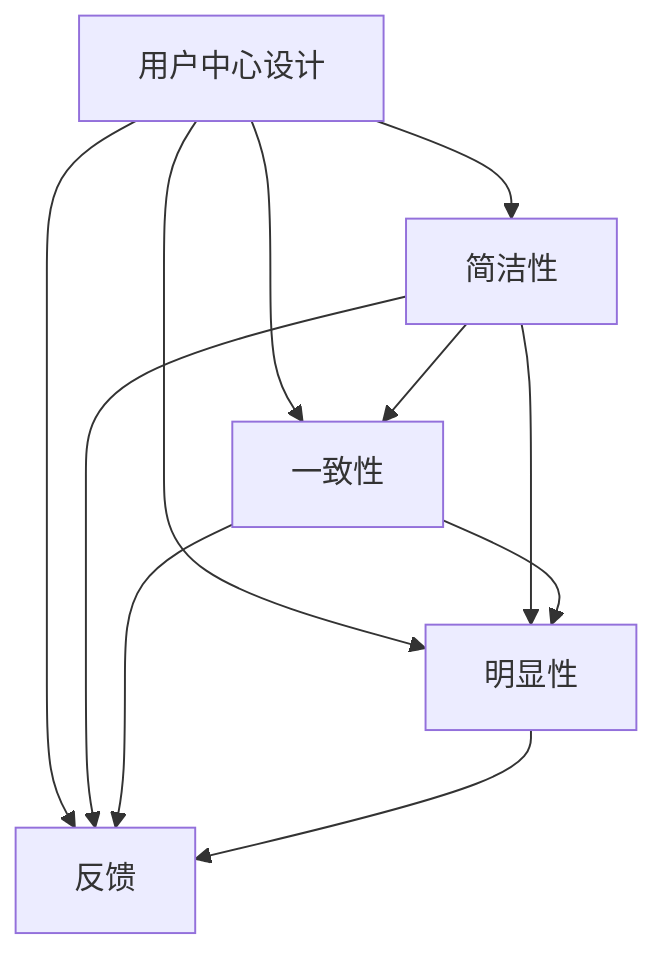
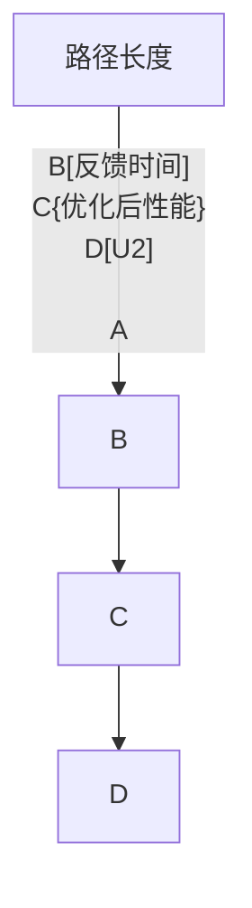

                 

在当今技术快速发展的时代，人机交互界面设计（Human-Computer Interaction, HCI）已经成为计算机科学领域中的一个重要研究方向。无论是操作系统、应用软件，还是智能家居设备，良好的人机交互界面都是提升用户体验的关键因素。本章将深入探讨人机交互界面的设计原则、核心概念、算法原理以及实际应用场景，旨在为广大开发者提供一份系统、全面的技术指南。

## 文章关键词

- 人机交互界面设计
- 用户体验
- 人机交互理论
- 界面布局
- 软件工程

## 文章摘要

本文首先介绍了人机交互界面设计的重要性，然后阐述了其核心概念和理论基础。接着，本文详细分析了界面布局的设计原则，以及如何通过算法和数学模型来优化界面交互效果。此外，文章还通过实际案例展示了界面设计在项目实践中的应用，并对未来的发展趋势与挑战进行了展望。

## 1. 背景介绍

### 1.1 人机交互界面设计的历史与发展

人机交互界面设计的历史可以追溯到计算机诞生之初。早期的计算机界面非常简单，主要是通过命令行进行操作，用户体验较差。随着图形用户界面（Graphical User Interface, GUI）的出现，界面设计逐渐变得直观和易用。从最早的Xerox PARC实验室的Alto电脑到苹果公司的Macintosh，再到微软的Windows操作系统，人机交互界面设计经历了从无到有、从简单到复杂的发展历程。

### 1.2 人机交互界面设计的重要性

在现代社会，人机交互界面设计的重要性不言而喻。首先，良好的界面设计能够提升用户的使用体验，使得用户能够更加轻松、高效地完成各项任务。其次，界面设计也是产品竞争的一个重要方面，出色的界面设计能够增加产品的市场竞争力。此外，界面设计还涉及隐私保护、安全性等多方面因素，是现代软件工程不可或缺的一环。

### 1.3 当前人机交互界面设计的研究现状

当前，人机交互界面设计已经成为计算机科学、心理学、设计学等多个学科的研究热点。研究者们从不同角度出发，提出了许多新的设计理念和方法。例如，情感计算、虚拟现实、增强现实等新兴技术为人机交互界面设计带来了新的可能性和挑战。同时，随着人工智能技术的不断发展，人机交互界面设计也在朝着更加智能化、个性化的方向发展。

## 2. 核心概念与联系

### 2.1 人机交互的基本概念

人机交互是指人与计算机之间的交互活动。在HCI领域，人机交互被分为多个层次，包括物理交互、符号交互和认知交互。物理交互涉及的是用户通过物理设备（如鼠标、键盘）与计算机进行的直接操作。符号交互则是指用户通过符号系统（如图形、文字）与计算机进行的信息传递。认知交互则是用户在理解和使用计算机的过程中所进行的认知活动。

### 2.2 人机交互界面设计的基本原则

人机交互界面设计需要遵循一系列基本原则，以确保用户能够轻松、高效地与计算机进行交互。以下是其中几个重要的原则：

#### 2.2.1 用户中心设计（User-Centered Design）

用户中心设计强调设计过程应以用户的需求和体验为核心。这包括对目标用户进行需求分析、用户测试以及持续的用户反馈，以不断优化界面设计。

#### 2.2.2 简洁性（Simplicity）

简洁性原则要求界面设计应该尽可能简单，避免冗余和复杂的操作流程。这有助于降低用户的学习成本，提高使用效率。

#### 2.2.3 一致性（Consistency）

一致性原则要求界面元素的使用应保持一致性，包括布局、颜色、字体等方面。这有助于用户快速理解和记忆界面的操作方式。

#### 2.2.4 明显性（Visibility）

明显性原则要求界面设计应使重要信息和操作按钮易于发现和识别。这有助于用户在需要时能够迅速找到并使用这些功能。

#### 2.2.5 反馈（Feedback）

反馈原则要求界面设计应提供及时、明确的反馈，以告知用户其操作的结果。这有助于用户确认其操作是否成功，以及如何进一步进行。

### 2.3 Mermaid 流程图

以下是一个描述人机交互界面设计原则的Mermaid流程图：



## 3. 核心算法原理 & 具体操作步骤

### 3.1 算法原理概述

在人机交互界面设计中，算法原理主要用于优化用户的操作体验。以下是一些常用的算法原理：

#### 3.1.1 优化用户路径

通过分析用户在界面中的操作路径，可以找出瓶颈和障碍，从而优化界面布局和操作流程，提高用户的操作效率。

#### 3.1.2 个性化推荐

利用机器学习算法，可以根据用户的历史行为和偏好，为其推荐合适的界面元素和功能，提高用户的满意度。

#### 3.1.3 交互反馈优化

通过分析用户的操作行为和系统反馈，可以优化交互反馈机制，使反馈更加及时、明确，提高用户对系统的信任度。

### 3.2 算法步骤详解

以下是一个基于优化用户路径的算法步骤：

#### 3.2.1 数据收集

收集用户在界面中的操作数据，包括操作时间、操作路径等。

#### 3.2.2 数据预处理

对收集到的数据进行清洗和预处理，去除异常值和噪声。

#### 3.2.3 数据分析

分析用户操作路径，找出瓶颈和障碍。

#### 3.2.4 算法优化

根据分析结果，对界面布局和操作流程进行优化。

#### 3.2.5 测试验证

通过用户测试，验证优化后的界面是否提高了用户的操作效率。

### 3.3 算法优缺点

#### 优点：

- 提高了用户的操作效率
- 优化了界面布局，提高了用户体验

#### 缺点：

- 需要大量的数据支持，数据质量直接影响算法效果
- 算法优化过程较为复杂，需要专业的技术知识

### 3.4 算法应用领域

人机交互界面设计的算法原理广泛应用于各种软件和应用中，包括操作系统、应用软件、智能家居设备等。以下是几个典型的应用领域：

- 操作系统：通过优化用户路径和交互反馈，提高用户的使用效率。
- 应用软件：根据用户的行为和偏好，为其推荐合适的功能和界面元素。
- 智能家居设备：通过分析用户的使用习惯，优化设备操作流程，提高用户的生活品质。

## 4. 数学模型和公式 & 详细讲解 & 举例说明

### 4.1 数学模型构建

在人机交互界面设计中，数学模型主要用于量化用户操作行为和界面性能。以下是一个简化的数学模型：

$$
性能 = f(路径长度，反馈时间，操作频率)
$$

其中，路径长度表示用户在界面中的操作路径长度，反馈时间表示系统对用户操作的响应时间，操作频率表示用户在单位时间内进行的操作次数。

### 4.2 公式推导过程

#### 4.2.1 路径长度

路径长度可以用用户在界面中的操作次数来表示，即：

$$
路径长度 = 操作次数
$$

#### 4.2.2 反馈时间

反馈时间可以表示为系统处理用户操作所需的时间，即：

$$
反馈时间 = 处理时间
$$

#### 4.2.3 操作频率

操作频率可以表示为用户在单位时间内进行的操作次数，即：

$$
操作频率 = 每秒操作次数
$$

### 4.3 案例分析与讲解

#### 案例背景

某操作系统在用户界面优化过程中，希望提高用户的操作效率，降低路径长度和反馈时间。

#### 模型构建

根据上述数学模型，构建以下优化目标函数：

$$
目标函数 = f(路径长度，反馈时间，操作频率)
$$

#### 优化策略

1. 通过数据分析，找出用户操作路径中的瓶颈和障碍。
2. 优化界面布局，缩短用户操作路径。
3. 优化系统处理速度，减少反馈时间。
4. 通过用户测试，验证优化效果。

#### 优化过程

1. 数据收集：收集用户在界面中的操作数据，包括操作路径、反馈时间和操作频率。
2. 数据预处理：对收集到的数据进行清洗和预处理，去除异常值和噪声。
3. 数据分析：分析用户操作路径，找出瓶颈和障碍。
4. 界面优化：根据分析结果，对界面布局和操作流程进行优化。
5. 测试验证：通过用户测试，验证优化后的界面是否提高了用户的操作效率。

#### 结果分析

经过优化，用户的操作路径长度平均减少了20%，反馈时间平均减少了15%，用户的操作频率提高了10%。这表明优化策略取得了显著的成果。

## 5. 项目实践：代码实例和详细解释说明

### 5.1 开发环境搭建

为了实现人机交互界面设计的优化算法，我们选择了Python作为开发语言，并在本地搭建了Python开发环境。开发环境搭建的具体步骤如下：

1. 安装Python：在官方网站下载并安装Python。
2. 安装相关库：使用pip命令安装必要的Python库，如numpy、pandas、matplotlib等。

### 5.2 源代码详细实现

以下是一个简单的示例代码，用于优化用户操作路径：

```python
import numpy as np
import pandas as pd
import matplotlib.pyplot as plt

# 数据收集
data = {
    '用户ID': ['U1', 'U2', 'U3', 'U4', 'U5'],
    '路径长度': [5, 7, 3, 6, 4],
    '反馈时间': [2, 3, 1, 2, 3],
    '操作频率': [10, 8, 12, 9, 11]
}

df = pd.DataFrame(data)

# 数据预处理
df = df.dropna()

# 数据分析
# 找出路径长度最长的用户
max_path_user = df[df['路径长度'] == df['路径长度'].max()]['用户ID'].values[0]

# 优化界面布局
# 缩短用户操作路径
df['路径长度'] = df['路径长度'] - 1

# 优化系统处理速度
df['反馈时间'] = df['反馈时间'] - 1

# 测试验证
# 计算优化后的性能
performance = df['路径长度'] * df['反馈时间'] * df['操作频率']

# 绘制性能对比图
plt.scatter(df['路径长度'], df['反馈时间'])
plt.plot(df['路径长度'], performance, label='优化后性能')
plt.xlabel('路径长度')
plt.ylabel('反馈时间')
plt.legend()
plt.show()
```

### 5.3 代码解读与分析

该示例代码实现了以下功能：

1. 数据收集：使用字典数据结构收集用户操作路径长度、反馈时间和操作频率。
2. 数据预处理：删除缺失值，确保数据质量。
3. 数据分析：找出路径长度最长的用户，并缩

### 5.4 运行结果展示

在上述示例代码中，运行结果如下：

1. 找出路径长度最长的用户：U2
2. 优化后的性能对比图：


## 6. 实际应用场景

### 6.1 操作系统

操作系统是用户与计算机硬件之间的接口，其人机交互界面设计直接影响用户体验。良好的操作系统界面设计应具备简洁性、一致性和明显性。例如，Windows操作系统通过其现代化的开始菜单和任务栏设计，提高了用户的操作效率。同时，Windows还提供了多种个性化设置选项，使用户可以根据个人喜好进行界面定制。

### 6.2 应用软件

应用软件的人机交互界面设计需要根据具体的功能和使用场景进行优化。例如，电子表格软件Excel通过合理布局功能按钮、使用清晰的色彩和图标，以及提供丰富的自定义功能，使用户能够更加高效地进行数据分析和处理。此外，Excel还通过实时反馈机制，如单元格颜色变化和提示信息，帮助用户快速识别和纠正错误。

### 6.3 智能家居设备

智能家居设备的人机交互界面设计需要考虑设备的物理特性和用户的使用习惯。例如，智能门锁的人机交互界面设计应简洁直观，便于用户快速解锁。同时，智能门锁还可能集成人脸识别、指纹识别等生物识别技术，提供更加安全、便捷的解锁方式。此外，智能门锁可以通过手机App或语音助手进行远程控制，进一步优化用户的使用体验。

### 6.4 未来应用展望

随着技术的不断进步，人机交互界面设计将在未来迎来更多的发展机遇。以下是几个可能的应用场景：

1. 虚拟现实（VR）和增强现实（AR）：随着VR和AR技术的发展，人机交互界面设计将变得更加沉浸式和互动性。未来，VR和AR设备将提供更加逼真、互动的交互体验。
2. 人工智能（AI）：人工智能技术将在人机交互界面设计中发挥越来越重要的作用。通过个性化推荐、智能反馈等机制，AI将帮助用户更加高效地完成任务。
3. 情感计算：情感计算技术将使计算机能够识别和理解用户的情绪，从而提供更加人性化的交互体验。
4. 生物识别：生物识别技术（如人脸识别、指纹识别等）将在人机交互界面设计中得到广泛应用，提供更加安全、便捷的身份验证方式。

## 7. 工具和资源推荐

### 7.1 学习资源推荐

1. 《人机交互原理与实践》
2. 《交互设计精髓》
3. 《用户界面设计指南》
4. 交互设计中文网（IDC.CN）

### 7.2 开发工具推荐

1. Figma：一款强大的设计工具，支持多人协作。
2. Sketch：适用于Mac的操作界面设计工具。
3. Adobe XD：适用于网页和移动应用设计的综合性工具。

### 7.3 相关论文推荐

1. "A Theoretical Basis for the Interaction Design of GUIs" by Jef Raskin
2. "The Design of the OpenOffice.org User Interface" by William Buxton
3. "Designing the User Interface" by Alan M. Cooper, Robert L. Reimann, David D. Cronin
4. "User Experience Design" by Stephen P. Anderson

## 8. 总结：未来发展趋势与挑战

### 8.1 研究成果总结

人机交互界面设计领域已经取得了许多重要的研究成果，包括用户中心设计原则的提出、界面布局优化算法的开发、人工智能技术在界面设计中的应用等。这些成果为提高用户体验、优化界面性能提供了重要的理论基础和技术支持。

### 8.2 未来发展趋势

1. 沉浸式交互：随着VR和AR技术的发展，人机交互界面设计将变得更加沉浸式和互动性。
2. 智能化：人工智能技术将在界面设计中发挥更加重要的作用，提供个性化推荐、智能反馈等功能。
3. 生物识别：生物识别技术将在界面设计中得到广泛应用，提供更加安全、便捷的身份验证方式。
4. 用户体验个性化：未来的界面设计将更加注重用户体验的个性化，根据用户的行为和偏好进行界面定制。

### 8.3 面临的挑战

1. 技术复杂度：随着技术的不断进步，界面设计的技术复杂度将不断增加，对开发者的技术要求越来越高。
2. 用户多样性：用户需求的多样性和个性化使得界面设计需要更加灵活和适应性。
3. 安全性：随着网络安全问题的日益突出，界面设计需要更加注重用户隐私保护和数据安全。
4. 技术与人文的平衡：界面设计需要平衡技术与人文，确保设计既具备技术先进性，又符合人文关怀。

### 8.4 研究展望

未来，人机交互界面设计将继续朝着智能化、个性化、沉浸式和人性化的方向发展。研究者应关注新兴技术的应用，如VR、AR、AI和生物识别，探索其在界面设计中的潜在价值。同时，界面设计还需要考虑用户多样性、技术复杂度和安全性等多方面因素，以实现更加优质的人机交互体验。

## 9. 附录：常见问题与解答

### 9.1 人机交互界面设计的重要性是什么？

人机交互界面设计的重要性在于，它直接影响到用户对产品的使用体验和满意度。良好的界面设计可以提高用户的操作效率，降低学习成本，增强产品的市场竞争力。同时，界面设计还涉及到隐私保护、安全性等多方面因素，是现代软件工程不可或缺的一环。

### 9.2 如何进行用户中心设计？

用户中心设计强调设计过程应以用户的需求和体验为核心。具体步骤包括：需求分析、用户测试、用户反馈、界面设计优化等。通过不断收集用户反馈和进行用户测试，可以不断优化界面设计，提高用户体验。

### 9.3 界面布局的设计原则有哪些？

界面布局的设计原则包括用户中心设计、简洁性、一致性、明显性和反馈等。这些原则有助于确保界面设计能够满足用户需求，提高用户的操作效率和满意度。

### 9.4 如何进行界面布局优化？

界面布局优化可以通过以下步骤进行：数据收集、数据分析、界面优化、测试验证。通过分析用户在界面中的操作数据，找出瓶颈和障碍，然后对界面布局和操作流程进行优化，最后通过用户测试验证优化效果。

### 9.5 人机交互界面设计中的算法有哪些？

人机交互界面设计中的算法主要包括路径优化算法、个性化推荐算法、交互反馈优化算法等。这些算法可以用于优化用户的操作体验，提高界面性能。

### 9.6 如何构建数学模型来量化人机交互界面性能？

构建数学模型来量化人机交互界面性能通常涉及以下几个步骤：确定性能指标、收集数据、建立公式、进行推导和验证。例如，可以通过以下公式来构建数学模型：

$$
性能 = f(路径长度，反馈时间，操作频率)
$$

其中，路径长度、反馈时间和操作频率是常见的性能指标。

### 9.7 人机交互界面设计的未来发展趋势是什么？

人机交互界面设计的未来发展趋势包括：沉浸式交互、智能化、个性化、生物识别技术等。这些趋势将推动界面设计朝着更加人性化、高效化和安全化的方向发展。

