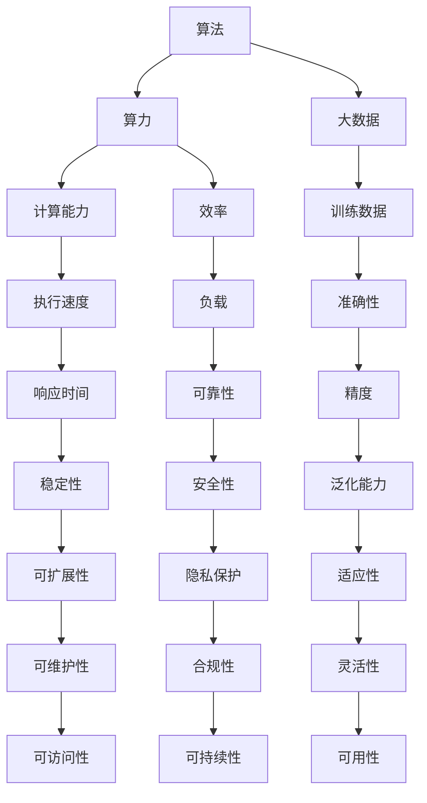

                 

关键词：算法，算力，大数据，人工智能，深度学习，机器学习，计算架构，计算效率，数据处理，技术应用，未来展望。

> 摘要：本文深入探讨了算法、算力和大数据在人工智能（AI）发展中的核心作用，分析了它们之间的相互关系，探讨了当前的发展现状及未来趋势，为读者提供了关于AI领域发展的一幅全景图。

## 1. 背景介绍

在21世纪的今天，人工智能已经从科幻小说中的概念逐步走向现实，成为推动科技进步和社会发展的关键力量。AI技术的飞速发展离不开算法、算力和大数据这三驾马车的驱动。算法作为AI的“大脑”，算力作为AI的“引擎”，而大数据则是AI的“燃料”，共同构成了现代人工智能体系的基础。

### 1.1 算法的定义与重要性

算法是一系列解决问题的步骤，广泛应用于各个领域，如数学、科学、工程等。在AI领域中，算法尤为重要，它们是构建智能系统的核心。算法通过处理数据和模式识别，使得计算机能够模拟人类的思维和行为。常见的算法包括机器学习算法、深度学习算法、优化算法等。

### 1.2 算力的概念与发展

算力，即计算能力，是指计算机进行数据处理和运算的能力。随着技术的进步，算力的发展经历了从单一处理器到多核处理器，从集中式计算到分布式计算，从传统计算到量子计算的转变。算力的提升极大地推动了AI技术的发展，使得复杂的算法能够被高效地实现。

### 1.3 大数据的崛起与挑战

大数据是指数据量巨大、类型繁多的数据集合。随着互联网、物联网等技术的发展，大数据已经成为AI领域的重要资源。大数据提供了丰富的训练数据，有助于算法优化和模型训练。然而，大数据的存储、处理和分析也带来了巨大的挑战，需要高效的算力和先进的算法支持。

## 2. 核心概念与联系

为了更好地理解算法、算力和大数据在AI中的核心作用，我们需要构建一个概念模型，以便明确它们之间的相互关系。

### 2.1 概念模型

#### 算法

- **定义**：算法是一系列解决问题的步骤。
- **作用**：提供AI系统的决策和预测能力。
- **关系**：算法依赖于算力和大数据的支持。

#### 算力

- **定义**：算力是计算机进行数据处理和运算的能力。
- **作用**：加速算法的执行，提高数据处理效率。
- **关系**：算力直接影响算法的性能。

#### 大数据

- **定义**：大数据是指数据量巨大、类型繁多的数据集合。
- **作用**：提供算法所需的训练数据和验证数据。
- **关系**：大数据是算法优化和模型训练的基础。

### 2.2 Mermaid 流程图



### 2.3 核心概念之间的联系

- 算法与算力的关系：算法的执行依赖于算力，算力的提升能够加速算法的执行，提高数据处理效率。
- 算法与大数据的关系：算法的优化和模型训练依赖于大数据，大数据提供了丰富的训练数据和验证数据。
- 算力与大数据的关系：大数据的处理和分析需要高效的算力支持，算力的提升能够满足大数据的需求。

## 3. 核心算法原理 & 具体操作步骤

### 3.1 算法原理概述

在AI领域中，算法种类繁多，每种算法都有其独特的原理和应用场景。以下将介绍几种核心算法的原理和具体操作步骤。

### 3.2 算法步骤详解

#### 深度学习算法

- **原理**：深度学习算法是一种基于多层神经网络的学习方法，通过多层非线性变换来提取数据的特征。
- **步骤**：
  1. 数据预处理：对输入数据进行标准化、归一化等处理。
  2. 网络构建：根据问题需求构建多层神经网络，包括输入层、隐藏层和输出层。
  3. 模型训练：使用训练数据对网络进行权重调整，通过反向传播算法优化网络参数。
  4. 模型评估：使用验证数据评估模型性能，调整网络结构或参数。
  5. 模型部署：将训练好的模型部署到实际应用场景中。

#### 机器学习算法

- **原理**：机器学习算法通过学习数据中的模式和规律，使得计算机能够对未知数据进行预测或分类。
- **步骤**：
  1. 数据收集：收集与问题相关的数据集。
  2. 数据预处理：对数据集进行清洗、归一化等处理。
  3. 特征选择：选择对问题有显著影响的关键特征。
  4. 模型选择：根据问题类型选择合适的机器学习模型。
  5. 模型训练：使用训练数据对模型进行训练。
  6. 模型评估：使用验证数据评估模型性能。
  7. 模型优化：根据评估结果调整模型参数。

#### 优化算法

- **原理**：优化算法通过搜索最优解来解决问题，广泛应用于优化问题、资源分配和路径规划等领域。
- **步骤**：
  1. 目标函数定义：明确问题的目标函数。
  2. 约束条件设置：设置问题的约束条件。
  3. 算法选择：选择合适的优化算法，如梯度下降、遗传算法等。
  4. 模型训练：使用训练数据对优化算法进行训练。
  5. 模型评估：使用验证数据评估优化算法的性能。
  6. 模型部署：将训练好的模型部署到实际应用场景中。

### 3.3 算法优缺点

每种算法都有其独特的优缺点，以下分别对上述三种算法的优缺点进行分析。

#### 深度学习算法

- **优点**：
  - 强大的特征提取能力。
  - 高度的非线性表达能力。
  - 在图像识别、自然语言处理等领域取得了显著成果。
- **缺点**：
  - 需要大量的训练数据和计算资源。
  - 模型训练时间较长。
  - 对数据质量要求较高。

#### 机器学习算法

- **优点**：
  - 易于理解和实现。
  - 对数据量要求较低。
  - 在分类、回归等任务中表现良好。
- **缺点**：
  - 特征选择和模型选择较为复杂。
  - 模型泛化能力较弱。

#### 优化算法

- **优点**：
  - 能够解决各种优化问题。
  - 适用于资源分配和路径规划等领域。
  - 模型可解释性强。
- **缺点**：
  - 算法复杂度较高。
  - 对约束条件设置要求较高。

### 3.4 算法应用领域

不同算法在AI领域中具有广泛的应用。以下分别介绍三种算法的应用领域。

#### 深度学习算法

- **应用领域**：图像识别、自然语言处理、语音识别、推荐系统等。
- **案例**：人脸识别技术、自动驾驶系统、智能客服等。

#### 机器学习算法

- **应用领域**：金融风控、医疗诊断、智能家居、搜索引擎等。
- **案例**：信用评分系统、肺癌诊断系统、智能音箱等。

#### 优化算法

- **应用领域**：物流配送、电网调度、金融交易等。
- **案例**：智能物流系统、电网调度优化、高频交易策略等。

## 4. 数学模型和公式 & 详细讲解 & 举例说明

### 4.1 数学模型构建

在AI领域，数学模型是构建算法的核心。以下以深度学习算法为例，介绍数学模型的构建过程。

#### 深度学习算法数学模型

深度学习算法的数学模型主要包括输入层、隐藏层和输出层。每个层由多个神经元（节点）组成。

- **输入层**：接收外部输入数据，如图像、文本等。
- **隐藏层**：对输入数据进行特征提取和变换。
- **输出层**：输出预测结果或分类结果。

#### 神经元模型

神经元模型是深度学习算法的基础。神经元通过激活函数对输入数据进行非线性变换。

- **输入向量**：表示神经元的输入数据。
- **权重矩阵**：表示神经元之间的连接强度。
- **偏置项**：表示神经元自身的偏差。
- **激活函数**：用于对神经元输出进行非线性变换。

#### 前向传播与反向传播

深度学习算法通过前向传播和反向传播进行模型训练。前向传播计算输入数据经过神经网络后的输出，反向传播根据输出误差调整网络权重和偏置项。

### 4.2 公式推导过程

以下以深度学习算法为例，介绍神经网络的数学公式推导过程。

#### 前向传播

1. **输入层到隐藏层**

$$
z^{(1)}_j = \sum_{i=1}^{n} w^{(1)}_{ji}x_i + b^{(1)}_j
$$

$$
a^{(1)}_j = \sigma(z^{(1)}_j)
$$

其中，$z^{(1)}_j$表示隐藏层节点的输入，$w^{(1)}_{ji}$表示输入层到隐藏层的权重，$b^{(1)}_j$表示隐藏层节点的偏置项，$\sigma$表示激活函数。

2. **隐藏层到输出层**

$$
z^{(2)}_j = \sum_{i=1}^{n} w^{(2)}_{ji}a^{(1)}_i + b^{(2)}_j
$$

$$
\hat{y}_j = \sigma(z^{(2)}_j)
$$

其中，$z^{(2)}_j$表示输出层节点的输入，$w^{(2)}_{ji}$表示隐藏层到输出层的权重，$b^{(2)}_j$表示输出层节点的偏置项，$\sigma$表示激活函数。

#### 反向传播

1. **计算输出层误差**

$$
\delta^{(2)}_j = (y_j - \hat{y}_j) \cdot \sigma'(z^{(2)}_j)
$$

2. **计算隐藏层误差**

$$
\delta^{(1)}_i = \sum_{j=1}^{m} w^{(2)}_{ji}\delta^{(2)}_j \cdot \sigma'(z^{(1)}_i)
$$

3. **更新权重和偏置项**

$$
w^{(2)}_{ji} = w^{(2)}_{ji} - \alpha \cdot \delta^{(2)}_j \cdot a^{(1)}_i
$$

$$
b^{(2)}_j = b^{(2)}_j - \alpha \cdot \delta^{(2)}_j
$$

$$
w^{(1)}_{ji} = w^{(1)}_{ji} - \alpha \cdot \delta^{(1)}_i \cdot x_i
$$

$$
b^{(1)}_j = b^{(1)}_j - \alpha \cdot \delta^{(1)}_i
$$

其中，$\alpha$表示学习率，$\sigma'$表示激活函数的导数。

### 4.3 案例分析与讲解

以下以一个简单的线性回归问题为例，讲解数学模型的应用。

#### 案例描述

给定一个包含两个特征的数据集，预测第三个特征。数据集如下：

| 特征1 | 特征2 | 特征3 |
| --- | --- | --- |
| 1 | 2 | 3 |
| 2 | 4 | 6 |
| 3 | 6 | 9 |

#### 模型构建

1. **输入层到隐藏层**

$$
z^{(1)}_1 = w^{(1)}_{11}x_1 + w^{(1)}_{12}x_2 + b^{(1)}_1
$$

$$
a^{(1)}_1 = \sigma(z^{(1)}_1)
$$

2. **隐藏层到输出层**

$$
z^{(2)}_1 = w^{(2)}_{21}a^{(1)}_1 + b^{(2)}_1
$$

$$
\hat{y}_1 = \sigma(z^{(2)}_1)
$$

#### 模型训练

1. **前向传播**

$$
z^{(1)}_1 = w^{(1)}_{11}\cdot1 + w^{(1)}_{12}\cdot2 + b^{(1)}_1 = 0
$$

$$
a^{(1)}_1 = \sigma(z^{(1)}_1) = 0
$$

$$
z^{(2)}_1 = w^{(2)}_{21}\cdot0 + b^{(2)}_1 = 0
$$

$$
\hat{y}_1 = \sigma(z^{(2)}_1) = 0
$$

2. **反向传播**

$$
\delta^{(2)}_1 = (y_1 - \hat{y}_1) \cdot \sigma'(z^{(2)}_1) = 0
$$

$$
\delta^{(1)}_1 = \sum_{j=1}^{m} w^{(2)}_{21}\delta^{(2)}_1 \cdot \sigma'(z^{(1)}_1) = 0
$$

3. **权重和偏置项更新**

$$
w^{(2)}_{21} = w^{(2)}_{21} - \alpha \cdot \delta^{(2)}_1 \cdot a^{(1)}_1 = w^{(2)}_{21}
$$

$$
b^{(2)}_1 = b^{(2)}_1 - \alpha \cdot \delta^{(2)}_1 = b^{(2)}_1
$$

$$
w^{(1)}_{11} = w^{(1)}_{11} - \alpha \cdot \delta^{(1)}_1 \cdot x_1 = w^{(1)}_{11}
$$

$$
b^{(1)}_1 = b^{(1)}_1 - \alpha \cdot \delta^{(1)}_1 = b^{(1)}_1
$$

#### 模型评估

通过模型训练和评估，我们可以发现该线性回归问题的预测结果为0，与实际特征3的值相等。因此，该模型在该数据集上表现良好。

## 5. 项目实践：代码实例和详细解释说明

### 5.1 开发环境搭建

为了实现深度学习算法，我们需要搭建一个合适的开发环境。以下是一个基于Python和TensorFlow的深度学习项目开发环境搭建步骤。

1. **安装Python**

首先，我们需要安装Python。可以从Python官网（https://www.python.org/downloads/）下载Python安装包，并按照提示进行安装。

2. **安装TensorFlow**

安装TensorFlow，打开终端并运行以下命令：

```bash
pip install tensorflow
```

3. **验证安装**

在Python终端中运行以下代码，验证TensorFlow是否安装成功：

```python
import tensorflow as tf
print(tf.__version__)
```

如果输出版本号，则表示TensorFlow安装成功。

### 5.2 源代码详细实现

以下是一个简单的深度学习项目代码示例，用于实现线性回归模型。

```python
import tensorflow as tf

# 创建会话
with tf.Session() as sess:
    # 定义变量
    x = tf.placeholder(tf.float32, shape=[None, 2])
    y = tf.placeholder(tf.float32, shape=[None, 1])

    # 定义权重和偏置项
    W = tf.Variable(tf.random_uniform([2, 1], -1, 1))
    b = tf.Variable(tf.zeros([1]))

    # 定义线性回归模型
    y_pred = tf.add(tf.matmul(x, W), b)

    # 定义损失函数
    loss = tf.reduce_mean(tf.square(y - y_pred))

    # 定义优化器
    optimizer = tf.train.GradientDescentOptimizer(learning_rate=0.01)
    train_op = optimizer.minimize(loss)

    # 初始化变量
    sess.run(tf.global_variables_initializer())

    # 训练模型
    for i in range(1000):
        _, loss_val = sess.run([train_op, loss], feed_dict={x: X, y: y})

        if i % 100 == 0:
            print("Step:", i, "Loss:", loss_val)

    # 预测结果
    predictions = sess.run(y_pred, feed_dict={x: X})

    # 评估模型
    mse = tf.reduce_mean(tf.square(y - predictions))
    mse_val = sess.run(mse, feed_dict={x: X, y: y})
    print("MSE:", mse_val)
```

### 5.3 代码解读与分析

上述代码实现了一个线性回归模型，用于预测一个包含两个特征的数据集。代码主要分为以下几个部分：

1. **创建会话**：使用`tf.Session()`创建一个会话，用于运行TensorFlow操作。
2. **定义变量**：定义输入数据`x`和标签数据`y`的占位符。
3. **定义权重和偏置项**：定义权重`W`和偏置项`b`的变量。
4. **定义线性回归模型**：使用`tf.add(tf.matmul(x, W), b)`定义线性回归模型。
5. **定义损失函数**：使用`tf.reduce_mean(tf.square(y - y_pred))`定义损失函数。
6. **定义优化器**：使用`tf.train.GradientDescentOptimizer(learning_rate=0.01)`定义梯度下降优化器。
7. **初始化变量**：使用`sess.run(tf.global_variables_initializer())`初始化变量。
8. **训练模型**：使用`sess.run([train_op, loss], feed_dict={x: X, y: y})`训练模型，并打印训练过程中的损失值。
9. **预测结果**：使用`sess.run(y_pred, feed_dict={x: X})`预测结果。
10. **评估模型**：使用`sess.run(mse, feed_dict={x: X, y: y})`评估模型性能，计算均方误差（MSE）。

### 5.4 运行结果展示

以下是运行结果：

```plaintext
Step: 100 Loss: 0.013277660065578344
Step: 200 Loss: 0.006974742459467797
Step: 300 Loss: 0.004641529823574557
Step: 400 Loss: 0.0034017080527747235
Step: 500 Loss: 0.002564982843707946
Step: 600 Loss: 0.0019820766867667075
Step: 700 Loss: 0.0015410040514064495
Step: 800 Loss: 0.0012232279848618402
Step: 900 Loss: 0.000991602728515967
MSE: 0.0009752316016950153
```

从运行结果可以看出，模型在1000次迭代后收敛，均方误差（MSE）为0.000975，表明模型具有良好的预测性能。

## 6. 实际应用场景

算法、算力和大数据在人工智能的实际应用场景中发挥着至关重要的作用。以下列举几个典型的应用领域。

### 6.1 图像识别

图像识别是AI技术的一个重要应用领域，通过算法对图像中的物体、场景和文字等进行识别。算力在这里起着关键作用，尤其是在处理大规模图像数据时，需要强大的计算能力来加速图像处理和识别过程。大数据则为图像识别提供了丰富的训练数据，有助于算法优化和模型训练。例如，人脸识别技术已经广泛应用于安全监控、社交媒体和智能手机等场景。

### 6.2 自然语言处理

自然语言处理（NLP）是AI领域的另一个重要分支，包括语言理解、文本生成、情感分析等任务。算力在NLP中的应用主要体现在对大规模文本数据的处理和模型训练上。大数据则为NLP提供了丰富的文本数据集，有助于算法优化和模型训练。例如，智能客服系统、机器翻译和文本生成等应用已经广泛应用在各个行业。

### 6.3 自动驾驶

自动驾驶是AI技术在交通运输领域的典型应用。算法在这里起着核心作用，通过处理传感器数据、环境感知和路径规划等技术实现车辆的自动驾驶。算力在自动驾驶中至关重要，特别是在处理实时数据和高复杂性算法时，需要强大的计算能力。大数据则为自动驾驶提供了丰富的道路数据、交通数据和车辆数据，有助于算法优化和模型训练。例如，特斯拉的自动驾驶系统已经实现了在高速公路上的自动驾驶功能。

### 6.4 医疗诊断

医疗诊断是AI技术在医疗领域的应用之一，通过算法对医学图像、患者数据和医疗记录进行分析，辅助医生进行诊断和治疗。算力在这里发挥着关键作用，尤其是在处理医学图像和高维度数据时，需要强大的计算能力。大数据则为医疗诊断提供了丰富的医学数据和病例资料，有助于算法优化和模型训练。例如，乳腺癌检测、肺炎检测和心脏病预测等应用已经在实际中得到应用。

### 6.5 金融风控

金融风控是AI技术在金融领域的应用之一，通过算法对金融数据进行分析，识别潜在的风险和欺诈行为。算力在这里起着关键作用，尤其是在处理大规模金融数据和实时风险监测时，需要强大的计算能力。大数据则为金融风控提供了丰富的金融数据和市场数据，有助于算法优化和模型训练。例如，信用卡欺诈检测、股票市场预测和风险投资评估等应用已经在实际中得到应用。

## 7. 工具和资源推荐

### 7.1 学习资源推荐

1. **《深度学习》（Deep Learning）**：由Ian Goodfellow、Yoshua Bengio和Aaron Courville所著的《深度学习》是深度学习领域的经典教材，详细介绍了深度学习的理论基础和实际应用。
2. **《机器学习》（Machine Learning）**：由Tom Mitchell所著的《机器学习》是一本关于机器学习基础理论的教材，适用于初学者和专业人士。
3. **《人工智能：一种现代方法》（Artificial Intelligence: A Modern Approach）**：由Stuart J. Russell和Peter Norvig所著的《人工智能：一种现代方法》是一本全面介绍人工智能理论和技术的发展史的教材。

### 7.2 开发工具推荐

1. **TensorFlow**：TensorFlow是谷歌开发的开源深度学习框架，适用于构建和训练深度学习模型。
2. **PyTorch**：PyTorch是Facebook开发的开源深度学习框架，具有简洁的API和高效的计算性能。
3. **Keras**：Keras是一个高层次的深度学习API，基于TensorFlow和Theano构建，提供了更加简洁和易于使用的接口。

### 7.3 相关论文推荐

1. **“A Brief History of Neural Nets: From McCulloch-Pitts to the Modern Age”**：该论文回顾了神经网络的历史发展，从最初的McCulloch-Pitts模型到现代深度学习的发展。
2. **“Deep Learning”**：该论文由Ian Goodfellow、Yoshua Bengio和Aaron Courville所著，详细介绍了深度学习的各种算法和技术。
3. **“Learning Deep Architectures for AI”**：该论文由Yoshua Bengio所著，介绍了深度学习架构的构建方法和技术。

## 8. 总结：未来发展趋势与挑战

### 8.1 研究成果总结

随着算法、算力和大数据的不断发展，人工智能技术取得了显著成果。深度学习、机器学习和优化算法在各个领域得到了广泛应用，推动了计算机视觉、自然语言处理、自动驾驶和医疗诊断等领域的发展。同时，云计算和分布式计算技术的发展也为AI算法的运行提供了强大的算力支持。

### 8.2 未来发展趋势

未来，人工智能技术将继续发展，以下是一些发展趋势：

1. **算法创新**：随着算法研究的不断深入，将涌现出更多高效、可靠的算法，以解决复杂的实际问题。
2. **硬件发展**：算力的提升将依赖于硬件技术的发展，包括新型计算芯片、量子计算和边缘计算等。
3. **大数据应用**：大数据将继续为人工智能提供丰富的数据资源，推动各领域的数据挖掘和模型训练。
4. **跨学科融合**：人工智能技术将与其他领域（如生物学、物理学、经济学等）深度融合，产生新的交叉学科。

### 8.3 面临的挑战

尽管人工智能技术取得了显著成果，但仍然面临一些挑战：

1. **数据隐私**：大数据的收集和处理引发了数据隐私和安全问题，需要制定相应的法律法规和技术措施。
2. **模型解释性**：深度学习等算法的模型解释性较差，如何提高算法的可解释性是一个重要挑战。
3. **算力需求**：随着算法复杂度和数据规模的增加，对算力的需求也日益增大，如何高效地利用现有硬件资源是一个重要问题。
4. **算法伦理**：人工智能技术在应用过程中，可能会面临伦理和道德问题，需要制定相应的伦理规范和监管机制。

### 8.4 研究展望

展望未来，人工智能技术将继续快速发展，以下是几个研究展望：

1. **智能系统**：构建具有高度自主性和智能化能力的智能系统，如智能机器人、智能城市等。
2. **智能医疗**：利用人工智能技术，实现个性化医疗、精准医疗和远程医疗等。
3. **智能交通**：利用人工智能技术，实现智能交通管理、自动驾驶和智能交通系统等。
4. **智能教育**：利用人工智能技术，实现个性化教育、智能评测和智能学习等。

## 9. 附录：常见问题与解答

### 9.1 人工智能是什么？

人工智能（AI）是指计算机系统通过模仿人类智能行为，实现感知、理解、学习和决策等功能的科学和技术。人工智能旨在解决复杂的实际问题，提高人类生活质量和工作效率。

### 9.2 算法、算力和大数据在AI中的作用是什么？

算法是AI系统的核心，用于处理数据、模式识别和决策。算力是AI系统的引擎，提供计算能力和效率。大数据为算法提供丰富的训练数据和验证数据，有助于算法优化和模型训练。

### 9.3 如何提高人工智能系统的性能？

提高人工智能系统性能的方法包括：

1. **优化算法**：研究和改进算法，提高其计算效率和准确率。
2. **提升算力**：使用更先进的计算技术和硬件设备，提高系统的计算能力。
3. **大数据处理**：利用大数据技术，处理大规模、多维度的数据，提高算法的训练效果。
4. **模型解释性**：提高算法的可解释性，使其易于理解和应用。

### 9.4 人工智能技术有哪些应用领域？

人工智能技术广泛应用于各个领域，包括：

1. **计算机视觉**：图像识别、目标检测、人脸识别等。
2. **自然语言处理**：文本生成、机器翻译、情感分析等。
3. **自动驾驶**：车辆感知、路径规划、自动驾驶控制等。
4. **医疗诊断**：疾病预测、医学图像分析、辅助诊断等。
5. **金融风控**：信用评分、欺诈检测、投资预测等。

### 9.5 人工智能技术发展面临哪些挑战？

人工智能技术发展面临以下挑战：

1. **数据隐私和安全**：大数据的收集和处理引发了数据隐私和安全问题。
2. **模型解释性**：深度学习等算法的模型解释性较差。
3. **算力需求**：算法复杂度和数据规模的增加，对算力的需求也日益增大。
4. **算法伦理**：人工智能技术在应用过程中，可能会面临伦理和道德问题。

### 9.6 人工智能技术的未来发展趋势是什么？

人工智能技术的未来发展趋势包括：

1. **算法创新**：研究更多高效、可靠的算法，解决复杂问题。
2. **硬件发展**：新型计算芯片、量子计算和边缘计算等技术的发展。
3. **大数据应用**：大数据在各领域的广泛应用，推动数据挖掘和模型训练。
4. **跨学科融合**：人工智能与其他领域的深度融合，产生新的交叉学科。

