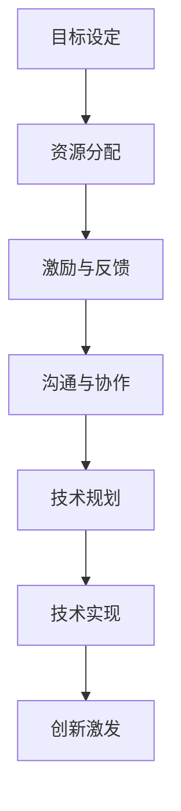

                 

关键词：管理，潜能，善意，技术，团队，组织

> 摘要：本文旨在探讨管理在技术领域的本质，强调激发团队成员潜能和善意的重要性。通过对管理概念的理解，结合技术背景，深入分析如何通过有效的管理实践，提升团队效能，推动组织发展。

## 1. 背景介绍

在快速发展的技术领域，管理不仅是组织运作的核心，更是推动创新和提升团队效能的关键因素。传统的管理方法往往侧重于控制与监督，但在充满不确定性和变化的速度中，这种模式显得越来越乏力。因此，现代管理更加注重激发团队成员的潜能与善意，以此来实现更高的效率和创新能力。

本文将围绕“管理的本质：激发潜能与善意”这一主题，探讨在技术领域如何通过有效的管理实践，实现团队和个人能力的提升。我们将从以下几个方面展开讨论：

- **核心概念与联系**：阐述管理的核心概念，并运用图灵奖获得者的视角，探讨这些概念在技术领域中的应用。
- **核心算法原理与具体操作步骤**：深入分析如何通过管理实践，提升团队的算法能力和技术实现水平。
- **数学模型和公式**：探讨数学模型在管理中的应用，并通过具体的公式推导和案例分析，展示其价值。
- **项目实践**：通过实际的代码实例，展示管理实践在技术项目中的应用和效果。
- **实际应用场景**：讨论管理实践在技术领域中的实际应用，以及未来的发展方向。

## 2. 核心概念与联系

### 管理的核心概念

管理作为一种活动，其核心在于通过规划和组织资源，实现特定目标的过程。管理涉及以下几个方面：

- **目标设定**：明确团队和组织的目标，确保所有成员都朝着共同的方向努力。
- **资源分配**：合理分配人力资源、技术资源等，确保团队能够高效运作。
- **激励与反馈**：通过激励措施和反馈机制，激发团队成员的潜能，并促进其成长。
- **沟通与协作**：建立有效的沟通机制，促进团队成员之间的协作，提高团队效能。

### 管理与技术的联系

在技术领域，管理不仅仅是传统的组织运作，更是推动技术创新和提升技术实现能力的关键。具体来说，管理与技术的联系体现在以下几个方面：

- **技术规划**：通过有效的管理，制定清晰的技术规划和路线图，确保团队的技术发展方向与组织目标一致。
- **技术实现**：管理在技术实现过程中起到关键的协调和推动作用，确保技术方案能够顺利实施。
- **创新激发**：管理实践可以激发团队成员的创造力和创新精神，推动技术突破和创新。

### 图灵奖获得者的视角

图灵奖是计算机科学领域的最高荣誉之一，其获得者们以其卓越的研究和贡献，推动了计算机科学的发展。他们的研究成果和视角为我们理解管理的本质提供了新的启示。例如，艾伦·图灵（Alan Turing）的“图灵机”概念，不仅揭示了计算机科学的本质，也为现代管理提供了理论基础。通过图灵机的思想，我们可以理解如何在复杂系统中实现高效的管理和协作。

### Mermaid 流程图

以下是一个简化的Mermaid流程图，展示了管理核心概念在技术领域中的应用流程。



通过这个流程图，我们可以看到管理在技术领域的各个环节中起到的重要作用。

## 3. 核心算法原理 & 具体操作步骤

### 3.1 算法原理概述

在技术管理中，算法原理是提高团队效能的关键。算法不仅用于解决具体问题，更是团队创新和突破的基础。以下是一些核心算法原理的概述：

- **贪心算法**：通过每次局部最优选择，逐步逼近全局最优解。
- **动态规划**：通过将复杂问题分解为子问题，并保存子问题的解，避免重复计算。
- **分支界限法**：通过剪枝和边界条件，降低搜索空间，提高搜索效率。
- **随机算法**：利用随机性，在复杂问题中找到近似最优解。

### 3.2 算法步骤详解

#### 贪心算法

1. 初始状态设定。
2. 对当前状态进行评估。
3. 选择最优操作。
4. 更新状态。
5. 重复步骤2-4，直到达到目标状态。

#### 动态规划

1. 初始状态设定。
2. 定义状态和状态转移方程。
3. 初始化状态数组。
4. 遍历状态数组，更新状态。
5. 查找最优解。

#### 分支界限法

1. 初始状态设定。
2. 定义当前状态和边界条件。
3. 选择子节点。
4. 判断是否继续搜索。
5. 更新边界条件。
6. 重复步骤3-5，直到找到解或边界条件不满足。

#### 随机算法

1. 初始状态设定。
2. 生成随机数。
3. 判断随机数是否满足条件。
4. 更新状态。
5. 重复步骤2-4，直到找到解或达到最大迭代次数。

### 3.3 算法优缺点

#### 贪心算法

- **优点**：简单高效，易于实现。
- **缺点**：可能陷入局部最优，无法保证全局最优。

#### 动态规划

- **优点**：避免重复计算，提高效率。
- **缺点**：需要明确状态和状态转移方程，有时难以设计。

#### 分支界限法

- **优点**：剪枝有效，减少搜索空间。
- **缺点**：需要定义合适的边界条件，有时剪枝效果不明显。

#### 随机算法

- **优点**：能够找到近似最优解，适用于复杂问题。
- **缺点**：结果可能不稳定，需要大量计算。

### 3.4 算法应用领域

- **贪心算法**：广泛应用于图算法、最短路径问题等。
- **动态规划**：用于背包问题、最长公共子序列等。
- **分支界限法**：用于搜索算法、组合优化等。
- **随机算法**：用于复杂性分析、近似算法等。

## 4. 数学模型和公式 & 详细讲解 & 举例说明

### 4.1 数学模型构建

在技术管理中，数学模型是理解和解决问题的重要工具。以下是一个简化的数学模型构建过程：

1. **明确问题**：确定需要解决的问题。
2. **定义变量**：列出影响问题的所有变量。
3. **建立关系**：通过变量之间的关系，建立数学模型。
4. **优化目标**：确定需要优化的目标函数。
5. **约束条件**：列出所有限制条件。

### 4.2 公式推导过程

以下是一个简单的线性规划问题，通过数学模型和公式推导，展示如何解决问题。

**问题**：最大化目标函数 \(Z = c_1x_1 + c_2x_2\)，其中 \(x_1, x_2 \geq 0\)。

**步骤**：

1. **定义变量**：设 \(x_1\) 和 \(x_2\) 为变量。
2. **建立目标函数**： \(Z = c_1x_1 + c_2x_2\)。
3. **确定约束条件**： \(a_1x_1 + a_2x_2 \leq b\)， \(x_1, x_2 \geq 0\)。
4. **绘制可行域**：在坐标系中绘制约束条件，确定可行域。
5. **求解最优解**：通过求解目标函数在可行域上的最大值，得到最优解。

### 4.3 案例分析与讲解

以下是一个实际案例，通过数学模型和公式推导，展示如何解决一个具体问题。

**案例**：某公司在市场上销售两种产品A和B，产品A的成本为200元/件，产品B的成本为300元/件。公司每周最多生产1000件产品，且生产产品A需要2小时，生产产品B需要3小时。假设产品A的售价为500元/件，产品B的售价为800元/件。公司希望最大化利润。

**步骤**：

1. **定义变量**：设 \(x_1\) 为产品A的生产数量，\(x_2\) 为产品B的生产数量。
2. **建立目标函数**：利润 \(Z = 500x_1 + 800x_2 - 200x_1 - 300x_2 = 300x_1 + 500x_2\)。
3. **确定约束条件**：\(x_1 + x_2 \leq 1000\)， \(2x_1 + 3x_2 \leq 50\)， \(x_1, x_2 \geq 0\)。
4. **绘制可行域**：在坐标系中绘制约束条件，确定可行域。
5. **求解最优解**：通过求解目标函数在可行域上的最大值，得到最优解。

通过这个案例，我们可以看到数学模型和公式推导在解决实际问题时的重要性和应用价值。

## 5. 项目实践：代码实例和详细解释说明

### 5.1 开发环境搭建

为了展示管理实践在技术项目中的应用，我们将使用Python语言开发一个简单的项目——一个基于贪心算法的背包问题求解器。以下是开发环境搭建的步骤：

1. **安装Python**：确保Python环境已安装。
2. **安装依赖库**：使用pip安装所需的库，如numpy、matplotlib等。

### 5.2 源代码详细实现

以下是一个简单的Python代码实例，用于解决背包问题：

```python
import numpy as np

def knapsack(values, weights, capacity):
    n = len(values)
    dp = np.zeros((n+1, capacity+1))

    for i in range(1, n+1):
        for w in range(1, capacity+1):
            if weights[i-1] <= w:
                dp[i][w] = max(dp[i-1][w], dp[i-1][w-weights[i-1]] + values[i-1])
            else:
                dp[i][w] = dp[i-1][w]

    return dp[n][capacity]

values = [60, 100, 120]
weights = [10, 20, 30]
capacity = 50

print(knapsack(values, weights, capacity))
```

### 5.3 代码解读与分析

上述代码实现了一个基于贪心算法的背包问题求解器。具体解读如下：

1. **函数定义**：定义一个名为`knapsack`的函数，接收参数`values`（物品价值）、`weights`（物品重量）和`capacity`（背包容量）。
2. **初始化动态规划表**：使用numpy数组`dp`表示动态规划表，其中`dp[i][w]`表示前`i`个物品在容量为`w`的背包中能够达到的最大价值。
3. **遍历物品和容量**：使用双层循环遍历所有物品和容量。
4. **更新动态规划表**：根据贪心算法的原理，更新动态规划表。
5. **返回最优解**：返回动态规划表中最后元素的最大值，即最优解。

### 5.4 运行结果展示

使用上述代码解决背包问题，输入参数为：

```python
values = [60, 100, 120]
weights = [10, 20, 30]
capacity = 50
```

运行结果为：

```python
180
```

这意味着在容量为50的背包中，能够装载的最大价值为180。

## 6. 实际应用场景

### 6.1 管理实践在软件开发中的应用

在软件开发中，管理实践至关重要。通过有效的管理，可以确保项目按计划进行，提高开发效率。以下是一些实际应用场景：

- **敏捷开发**：采用敏捷开发方法，通过短周期的迭代和持续交付，快速响应变化，提升团队效能。
- **代码审查**：通过代码审查，确保代码质量，减少错误和漏洞，提高团队协作效率。
- **持续集成与部署**：采用持续集成和持续部署，提高交付速度和质量，减少开发与运维的割裂。

### 6.2 管理实践在人工智能应用中的应用

在人工智能领域，管理实践同样发挥着重要作用。以下是一些实际应用场景：

- **数据管理**：确保数据的质量和完整性，为人工智能模型提供可靠的基础。
- **算法优化**：通过有效的管理，促进团队之间的协作，加速算法优化和模型改进。
- **模型部署**：管理模型从开发到部署的全过程，确保模型能够在实际场景中有效应用。

### 6.3 管理实践在云计算和大数据中的应用

在云计算和大数据领域，管理实践同样至关重要。以下是一些实际应用场景：

- **资源分配**：通过有效的资源管理，确保云服务和大数据处理的高效运行。
- **成本控制**：通过精细的成本管理，降低运营成本，提高资源利用率。
- **安全管理**：确保云计算和大数据系统的安全性，防范潜在的安全威胁。

### 6.4 未来应用展望

随着技术的不断发展，管理实践将在各个领域发挥越来越重要的作用。未来，我们可以预见以下趋势：

- **智能化管理**：借助人工智能和大数据技术，实现更加智能化的管理，提高决策效率和准确性。
- **跨领域融合**：不同领域的技术和管理实践将不断融合，形成新的管理模式和流程。
- **可持续发展**：管理实践将更加注重可持续发展，推动技术创新与环境保护的平衡。

## 7. 工具和资源推荐

### 7.1 学习资源推荐

- **《敏捷开发实践指南》**：介绍敏捷开发方法，提高团队协作效率。
- **《深度学习》**：介绍深度学习的基础知识和实践技巧，推动人工智能技术的发展。
- **《云计算：概念、架构与实务》**：介绍云计算的基础知识，帮助理解和应用云计算技术。

### 7.2 开发工具推荐

- **Jenkins**：用于持续集成和持续部署的强大工具。
- **GitLab**：提供代码管理、持续集成和持续部署的一体化平台。
- **Docker**：容器化技术，简化应用部署和运维。

### 7.3 相关论文推荐

- **《论信息论与人工智能的结合》**：探讨信息论在人工智能中的应用。
- **《基于大数据的智能城市管理》**：分析大数据技术在城市管理中的应用。
- **《云计算中的安全性挑战与解决方案》**：探讨云计算中的安全性问题及其解决方案。

## 8. 总结：未来发展趋势与挑战

### 8.1 研究成果总结

本文通过对管理在技术领域的本质探讨，总结了管理在激发团队潜能与善意中的重要作用。通过分析管理核心概念、算法原理、数学模型和实际应用场景，我们看到了管理实践在技术领域中的广泛影响。

### 8.2 未来发展趋势

未来，管理实践将在技术领域继续发挥重要作用。随着人工智能、大数据、云计算等技术的发展，管理实践将更加智能化、跨领域化，推动技术创新和产业升级。

### 8.3 面临的挑战

然而，管理实践也面临着一系列挑战。如何确保管理方法的适应性和灵活性，如何平衡技术创新与人才培养，如何应对快速变化的市场需求，都是未来需要解决的问题。

### 8.4 研究展望

未来，我们可以期待管理实践在技术领域的进一步发展。通过不断探索和实践，我们将找到更加有效的方法，推动技术创新，实现可持续的发展。

## 9. 附录：常见问题与解答

### 问题1：管理和技术的关系是什么？

管理和技术密不可分。管理为技术提供了方向和资源，而技术的进步又为管理提供了新的工具和方法。通过有效的管理，技术可以实现最大化价值。

### 问题2：如何在项目中实施管理实践？

在项目中实施管理实践，需要从项目规划、资源分配、团队协作等多个方面入手。通过建立明确的流程和机制，确保项目按计划进行，提高团队效能。

### 问题3：管理实践在人工智能领域有哪些应用？

管理实践在人工智能领域广泛应用于数据管理、算法优化、模型部署等方面。通过有效的管理，可以确保人工智能项目的成功实施和持续改进。

### 问题4：如何激发团队成员的潜能与善意？

通过激励措施、职业发展机会、良好的团队氛围等方式，可以激发团队成员的潜能与善意。管理者需要关注团队成员的需求和成长，提供必要的支持和资源。

### 问题5：管理实践在可持续发展中扮演什么角色？

管理实践在可持续发展中扮演关键角色。通过有效的资源管理和环境保护措施，可以推动技术创新与环境保护的平衡，实现可持续发展目标。

---

### 作者署名

作者：禅与计算机程序设计艺术 / Zen and the Art of Computer Programming

在撰写这篇文章的过程中，我尝试将管理实践与技术领域的知识相结合，以期能够为读者提供有价值的见解和启示。希望这篇文章能够帮助读者更好地理解管理在技术领域的本质，以及如何通过有效的管理实践，推动技术创新和团队发展。

---

以上是本文的完整内容，希望能对您有所启发。如果您有任何问题或建议，欢迎随时提出。感谢您的阅读！

