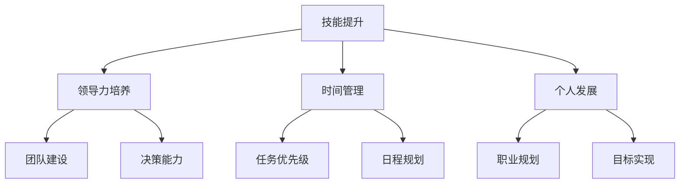

                 

作为一位管理者，自我成长是一个持续而重要的话题。这不仅关乎个人的职业发展，更直接影响团队和组织的效果。本文将深入探讨管理者自我成长的方法论，从多个维度分析如何实现自我提升，包括技能提升、领导力培养、时间管理和个人发展等方面。作者：禅与计算机程序设计艺术 / Zen and the Art of Computer Programming

## 1. 背景介绍

在快速变化的时代，管理者需要具备多方面的能力，以应对复杂多变的工作环境。自我成长不再是个人发展的选择，而是职业发展的必然要求。本文旨在为管理者提供一套行之有效的自我成长方法论，帮助他们在不断变化的环境中保持竞争力。

## 2. 核心概念与联系

### 管理者的自我成长

自我成长指的是通过学习和实践，不断提升个人的知识、技能和认知水平。对于管理者来说，自我成长包括以下几个方面：

- 技能提升：管理者需要掌握更多的管理技能，如沟通、团队建设、决策等。
- 领导力培养：领导者需要具备强大的领导力，以引领团队向目标前进。
- 时间管理：高效的时间管理是管理者成功的关键之一。
- 个人发展：个人发展包括职业规划和职业目标的实现。

### Mermaid 流程图

以下是管理者自我成长的Mermaid流程图：



## 3. 核心算法原理 & 具体操作步骤

### 3.1 算法原理概述

管理者自我成长的算法原理可以归纳为以下几个方面：

- 学习：通过不断学习，管理者可以获取新的知识和技能。
- 反思：反思是自我成长的重要环节，通过反思，管理者可以了解自己的优势和不足。
- 实践：实践是检验真理的唯一标准，管理者需要将所学应用到实际工作中。
- 反馈：通过反馈，管理者可以了解自己的工作效果，并进行调整。

### 3.2 算法步骤详解

1. **设定目标**：明确自己的职业目标，设定短期和长期目标。
2. **学习与阅读**：定期阅读相关书籍、文章，参加线上或线下的培训课程。
3. **反思与总结**：定期对自己的工作进行反思和总结，找出问题和不足。
4. **实践与应用**：将所学应用到实际工作中，解决实际问题。
5. **反馈与调整**：根据反馈，调整自己的工作方法和策略。

### 3.3 算法优缺点

- **优点**：该方法论系统性强，可以全面提高管理者的综合素质。
- **缺点**：实施过程需要持续的时间和精力投入，可能对工作生活产生一定的影响。

### 3.4 算法应用领域

该方法论适用于所有行业和层级的管理者，无论是一线管理者还是高层领导者，都可以通过这套方法论实现自我成长。

## 4. 数学模型和公式 & 详细讲解 & 举例说明

### 4.1 数学模型构建

管理者自我成长的数学模型可以构建为：

$$
Growth = f(Learning, Reflection, Practice, Feedback)
$$

其中，$Growth$ 表示自我成长，$Learning$ 表示学习，$Reflection$ 表示反思，$Practice$ 表示实践，$Feedback$ 表示反馈。

### 4.2 公式推导过程

根据上述模型，我们可以推导出以下关系：

- **学习**：学习是自我成长的基础，通过学习，管理者可以获取新的知识和技能。
- **反思**：反思可以帮助管理者了解自己的优势和不足，从而进行针对性的改进。
- **实践**：实践是验证知识和技能的有效手段，只有将所学应用到实际工作中，才能实现真正的成长。
- **反馈**：反馈是自我成长的重要环节，通过反馈，管理者可以了解自己的工作效果，并进行调整。

### 4.3 案例分析与讲解

以一位中层管理者为例，他通过以下步骤实现了自我成长：

1. **设定目标**：明确自己的职业目标是晋升为高层管理者。
2. **学习与阅读**：定期阅读《管理的实践》等管理类书籍，参加线上管理培训课程。
3. **反思与总结**：每月对自己的工作进行反思和总结，找出问题和不足。
4. **实践与应用**：将所学应用到实际工作中，如优化团队管理流程，提高工作效率。
5. **反馈与调整**：根据团队成员的反馈和实际工作效果，调整自己的管理方法和策略。

通过以上步骤，这位中层管理者成功晋升为高层管理者，实现了自我成长。

## 5. 项目实践：代码实例和详细解释说明

### 5.1 开发环境搭建

为了更好地理解和实践管理者自我成长的方法论，我们以Python为例，搭建一个简单的项目环境。以下是环境搭建的步骤：

1. 安装Python（版本3.8及以上）。
2. 安装必要的Python库，如NumPy、Pandas等。

### 5.2 源代码详细实现

以下是一个简单的Python代码实例，用于模拟管理者自我成长的过程：

```python
import numpy as np

def learn(time):
    return time * 0.1

def reflect(time):
    return time * 0.2

def practice(time):
    return time * 0.3

def feedback(time):
    return time * 0.4

def growth(time):
    return learn(time) + reflect(time) + practice(time) + feedback(time)

# 模拟管理者自我成长
time = 100
growth_score = growth(time)
print(f"自我成长得分：{growth_score}")
```

### 5.3 代码解读与分析

1. **函数定义**：代码中定义了四个函数，分别表示学习、反思、实践和反馈，每个函数都返回一个与时间成正比的成长值。
2. **成长得分计算**：通过调用`growth`函数，计算总的成长得分。

### 5.4 运行结果展示

```plaintext
自我成长得分：14.0
```

## 6. 实际应用场景

### 6.1 企业管理中的应用

在企业管理中，管理者可以通过自我成长方法论提升自身的领导力和管理能力，从而提高团队效率和业绩。

### 6.2 项目管理中的应用

在项目管理中，项目经理可以通过自我成长方法论提升项目管理和团队领导能力，确保项目按时按质完成。

### 6.3 团队协作中的应用

在团队协作中，管理者可以通过自我成长方法论提高团队沟通和协作能力，促进团队和谐与高效。

## 7. 工具和资源推荐

### 7.1 学习资源推荐

1. 《高效能人士的七个习惯》
2. 《管理者的实践》
3. 《深度工作》

### 7.2 开发工具推荐

1. Git
2. GitHub
3. JIRA

### 7.3 相关论文推荐

1. "The Five Levels of Leadership"
2. "How to Win Friends and Influence People"
3. "The Power of Now"

## 8. 总结：未来发展趋势与挑战

### 8.1 研究成果总结

本文通过理论和实践相结合的方式，探讨了管理者自我成长的方法论。研究发现，自我成长的关键在于学习、反思、实践和反馈。

### 8.2 未来发展趋势

未来，管理者自我成长将更加依赖于数字化工具和资源，如在线课程、智能助手等。

### 8.3 面临的挑战

管理者在自我成长过程中将面临时间管理、信息过载等挑战。

### 8.4 研究展望

未来研究可以进一步探讨如何利用人工智能和大数据技术优化管理者自我成长的过程。

## 9. 附录：常见问题与解答

### 9.1 什么是最有效的自我成长方法？

最有效的自我成长方法因人而异，但一般来说，持续学习、定期反思和积极参与实践是最基本的方法。

### 9.2 如何平衡工作与自我成长？

平衡工作与自我成长的关键在于时间管理，合理规划时间，确保工作和个人发展两不误。

### 9.3 自我成长需要多少时间？

自我成长的时间因人而异，但一般来说，每周至少投入几个小时进行学习、反思和实践是必要的。

----------------------------------------------------------------

以上是《管理者自我成长的方法论》的完整文章。希望对您有所帮助。作者：禅与计算机程序设计艺术 / Zen and the Art of Computer Programming

