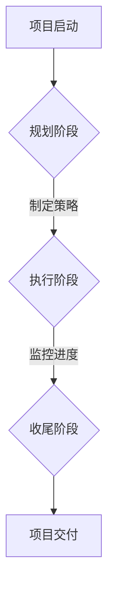

                 

关键词：策略执行、管理艺术、项目管理、IT管理、团队协作

摘要：本文旨在探讨在IT领域实施有效的策略和执行管理艺术的重要性。我们将深入分析策略制定的过程，如何通过合理的管理架构和团队协作来实现策略执行，并讨论面临的挑战及未来的发展趋势。

## 1. 背景介绍

在快速发展的IT行业中，成功的管理艺术成为确保项目按时完成、资源有效利用、团队高效协作的关键。随着技术的不断进步，IT项目变得越来越复杂，要求管理者不仅具备深厚的技术背景，还需要掌握先进的策略和执行管理技巧。

### 1.1 策略管理的重要性

策略管理是IT项目成功的基石。一个清晰、有效的策略可以帮助团队在项目启动之初就明确目标，规划资源，制定可行的执行计划，并跟踪进度，确保项目按预期完成。有效的策略管理有助于减少风险，提高资源利用率，并增强团队之间的协作。

### 1.2 IT项目的复杂性

IT项目的复杂性来源于多方面，包括不断变化的技术需求、快速演变的业务环境、庞大的系统架构和高度依赖的技术基础设施。这些因素使得IT项目管理面临巨大的挑战，需要管理者具备广泛的知识和深厚的实践经验。

## 2. 核心概念与联系

为了更好地理解策略执行的管理艺术，我们需要明确几个核心概念：

### 2.1 项目管理框架

项目管理框架是策略执行的基础。常见的项目管理框架包括但不限于PMBOK（项目管理知识体系）和敏捷方法。这些框架提供了系统的方法来规划和控制项目，确保项目目标的实现。

### 2.2 团队协作

团队协作是实现策略执行的关键。在现代IT项目中，多学科、跨部门的团队协作变得越来越重要。有效的沟通、协调和团队合作是确保项目顺利推进的关键因素。

### 2.3 项目生命周期

项目生命周期包括项目启动、规划、执行、监控和收尾阶段。每个阶段都有特定的目标和任务，需要管理者进行有效的策略规划和执行管理。

### 2.4 Mermaid 流程图



### 2.5 管理层次结构

管理层次结构包括战略层、战术层和执行层。战略层负责制定长期目标和规划，战术层负责制定中期计划和策略，执行层负责具体项目的执行和管理。

## 3. 核心算法原理 & 具体操作步骤

### 3.1 算法原理概述

在IT项目管理中，核心算法原理包括但不限于：

- 项目评估与选择算法
- 资源分配与调度算法
- 风险管理算法

这些算法帮助管理者在复杂的项目环境中做出最优决策。

### 3.2 算法步骤详解

#### 3.2.1 项目评估与选择

1. 收集项目信息
2. 评估项目可行性
3. 选择最优项目

#### 3.2.2 资源分配与调度

1. 确定项目需求
2. 分析资源可用性
3. 制定资源分配计划
4. 调度资源执行

#### 3.2.3 风险管理

1. 识别风险
2. 评估风险影响
3. 制定风险应对策略
4. 实施风险监控

### 3.3 算法优缺点

每种算法都有其优缺点，需要根据项目实际情况进行选择和调整。

### 3.4 算法应用领域

算法广泛应用于IT项目管理、软件开发、系统集成等领域。

## 4. 数学模型和公式 & 详细讲解 & 举例说明

### 4.1 数学模型构建

项目管理中的数学模型通常包括：

- 项目时间模型
- 资源模型
- 成本模型

### 4.2 公式推导过程

以项目时间模型为例，常见的推导公式包括：

- 工期公式
- 最早开始时间（ES）
- 最迟开始时间（LS）
- 最早完成时间（EF）
- 最迟完成时间（LF）

### 4.3 案例分析与讲解

#### 4.3.1 项目工期计算

假设一个项目包含5个任务，分别需要5天、3天、4天、2天和3天完成。使用关键路径法（CPM）计算项目的总工期。

#### 4.3.2 资源调度

假设项目需要使用3名工程师，分别擅长不同的技能。如何合理安排工程师的工时，以最大限度地提高项目效率？

## 5. 项目实践：代码实例和详细解释说明

### 5.1 开发环境搭建

在本文中，我们将使用Python作为示例语言，介绍如何搭建项目开发环境。

### 5.2 源代码详细实现

以下是使用Python实现的简单项目管理工具：

```python
import datetime

class ProjectTask:
    def __init__(self, name, duration):
        self.name = name
        self.duration = datetime.timedelta(days=duration)

class Project:
    def __init__(self, name):
        self.name = name
        self.tasks = []

    def add_task(self, task):
        self.tasks.append(task)

    def calculate_duration(self):
        total_duration = datetime.timedelta()
        for task in self.tasks:
            total_duration += task.duration
        return total_duration

# 创建项目实例
project = Project("软件开发项目")

# 添加任务
project.add_task(ProjectTask("需求分析", 5))
project.add_task(ProjectTask("设计", 3))
project.add_task(ProjectTask("编码", 4))
project.add_task(ProjectTask("测试", 2))
project.add_task(ProjectTask("部署", 3))

# 计算项目总工期
print(f"项目总工期：{project.calculate_duration()}")
```

### 5.3 代码解读与分析

这段代码实现了简单的项目管理功能，包括创建项目实例、添加任务和计算总工期。

### 5.4 运行结果展示

运行代码后，将输出项目总工期，帮助我们了解项目的时间进度。

## 6. 实际应用场景

在实际应用中，策略执行管理艺术广泛应用于：

- 软件开发
- 系统集成
- IT服务管理
- 项目咨询

## 7. 工具和资源推荐

### 7.1 学习资源推荐

- 《项目管理知识体系（PMBOK）》
- 《敏捷项目管理实践指南》
- 《Python编程：从入门到实践》

### 7.2 开发工具推荐

- JIRA
- Trello
- GitLab

### 7.3 相关论文推荐

- "Agile Project Management: Creating Successful Projects with Iterative Methodology"
- "The Practice of Systems and Software Engineering: A Guide to Modeling and Design for Systems and Software Engineers"

## 8. 总结：未来发展趋势与挑战

### 8.1 研究成果总结

近年来，IT项目管理领域取得了显著的研究成果，包括：

- 敏捷方法的应用
- 自动化工具的普及
- 智能算法在项目评估和风险控制中的应用

### 8.2 未来发展趋势

未来，IT项目管理将朝着更智能化、自动化和协作化的方向发展。新技术如人工智能、区块链和云计算将在项目管理中发挥更大作用。

### 8.3 面临的挑战

- 技术快速更新，要求管理者不断学习新技能
- 项目复杂度增加，需要更高效的策略和执行方法
- 团队协作困难，需要更好的沟通和协调工具

### 8.4 研究展望

未来，研究将重点关注以下几个方面：

- 智能化项目管理的应用
- 基于大数据的项目评估和风险预测
- 跨学科、跨部门的团队协作模式

## 9. 附录：常见问题与解答

### 9.1 问题1：如何确保项目按时完成？

解答：制定详细的计划和时间表，跟踪进度，及时调整资源分配，并确保团队高效协作。

### 9.2 问题2：如何管理项目风险？

解答：通过识别、评估和监控项目风险，制定相应的应对策略，并定期更新风险报告。

### 9.3 问题3：如何提高团队协作效率？

解答：建立有效的沟通机制，明确角色和职责，鼓励团队成员积极参与，并定期进行团队建设活动。

**作者：禅与计算机程序设计艺术 / Zen and the Art of Computer Programming**

