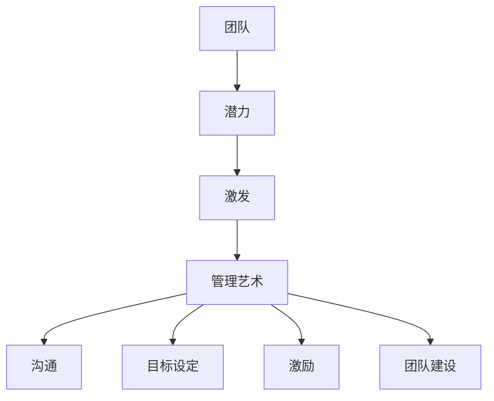

                 

关键词：团队管理，激发潜力，人工智能，软件开发，组织架构

摘要：本文旨在探讨在信息技术行业，特别是软件开发领域，如何通过管理艺术的运用来激发团队潜力，提高团队效率和创新能力。文章从背景介绍入手，分析了团队管理的核心概念和联系，深入讲解了激发团队潜力的核心算法原理和具体操作步骤，并借助数学模型和公式进行了详细讲解。同时，通过项目实践展示了代码实例和详细解释说明，进一步探讨了实际应用场景和未来应用展望。最后，文章总结了管理艺术在激发团队潜力方面的重要性，并提出了未来发展趋势与挑战。

## 1. 背景介绍

在当今快速变化的技术环境中，信息技术行业，特别是软件开发领域，正面临着前所未有的挑战和机遇。随着人工智能、大数据、云计算等新技术的广泛应用，软件开发的复杂性和多样性不断增加，这对团队成员的专业技能和团队合作能力提出了更高的要求。然而，许多团队在管理方面仍然存在诸多问题，如沟通不畅、目标不明确、激励不足等，这些问题严重影响了团队的效率和创新能力。

因此，如何通过管理艺术的运用来激发团队潜力，已成为信息技术行业亟待解决的关键问题。本文将从团队管理的核心概念和联系入手，探讨激发团队潜力的核心算法原理和具体操作步骤，并通过数学模型和公式进行详细讲解，以期为信息技术行业的团队管理提供一些有益的思路和方法。

## 2. 核心概念与联系

在探讨如何激发团队潜力之前，我们需要明确一些核心概念和它们之间的联系。

### 2.1 团队

团队是由一组相互依赖、共同追求某个目标的人组成的。在软件开发领域，团队通常由软件开发人员、测试人员、产品经理、项目经理等不同角色组成。团队成员之间的有效沟通和协作是实现团队目标的关键。

### 2.2 潜力

潜力是指个体或团队在未来可能实现的潜在能力。在软件开发领域，团队潜力体现在其创新能力、解决问题的能力、应对复杂问题的能力等方面。

### 2.3 激发

激发是指通过一系列策略和方法，调动团队成员的积极性，挖掘其潜能，使其在团队中发挥最大价值。

### 2.4 管理艺术

管理艺术是指管理者运用知识、经验、智慧和直觉，对团队进行有效管理和激励的过程。

这些概念之间的联系如下：

- 团队是实现目标的载体，团队潜力决定了团队的绩效和创新能力。
- 激发团队潜力需要通过管理艺术的运用，包括沟通、目标设定、激励、团队建设等方面。
- 管理艺术是激发团队潜力的关键，管理者需要具备一定的管理技能和领导力，以有效地激发团队潜力。

为了更好地理解这些概念之间的联系，我们可以用Mermaid流程图进行展示。



## 3. 核心算法原理 & 具体操作步骤

### 3.1 算法原理概述

激发团队潜力的核心算法基于以下几个原理：

- **个体动机理论**：个体在追求自我实现的过程中，会努力提升自己的能力和价值。因此，激发团队潜力需要关注团队成员的个人动机和需求。
- **社会心理理论**：团队成员之间的互动和关系对团队潜力具有重要影响。通过建立积极的团队氛围，可以增强团队成员的归属感和责任感，从而激发团队潜力。
- **学习与发展理论**：通过持续的学习和培训，可以提高团队成员的专业技能和知识水平，从而增强团队潜力。
- **目标设定理论**：明确的目标可以引导团队成员的努力方向，激发他们的工作热情和积极性。

### 3.2 算法步骤详解

激发团队潜力的具体操作步骤如下：

#### 步骤1：了解团队成员

管理者需要深入了解团队成员的背景、能力、兴趣和需求，以便为他们提供个性化的支持和激励。

#### 步骤2：设定明确的目标

管理者需要与团队成员共同设定明确、可衡量的目标，并确保目标与团队的使命和愿景保持一致。

#### 步骤3：建立积极的团队氛围

管理者需要通过一系列措施，如团队建设活动、表扬和奖励等，营造一个积极、包容、支持性的团队氛围。

#### 步骤4：提供持续的学习和培训机会

管理者需要关注团队成员的职业发展，提供持续的学习和培训机会，以帮助他们提升专业技能和知识水平。

#### 步骤5：激励团队成员

管理者需要运用各种激励手段，如奖金、晋升、表彰等，激发团队成员的积极性和创造力。

#### 步骤6：监控和评估

管理者需要定期监控和评估团队的工作绩效和潜力激发情况，并根据评估结果进行调整和改进。

### 3.3 算法优缺点

激发团队潜力的算法具有以下优点：

- **提高团队绩效**：通过激发团队成员的潜力，可以提高团队的整体绩效和创新能力。
- **增强团队凝聚力**：积极的团队氛围和有效的激励措施可以增强团队成员之间的凝聚力和归属感。
- **促进个人成长**：持续的学习和培训机会有助于团队成员提升自己的专业技能和知识水平，实现个人成长。

然而，激发团队潜力的算法也存在一些缺点：

- **成本较高**：提供持续的学习和培训机会、实施激励措施等需要投入一定的资源和资金。
- **实施难度较大**：管理者需要具备一定的管理技能和领导力，才能有效地运用激发团队潜力的算法。
- **结果不确定性**：团队潜力的激发程度受到多种因素的影响，如团队成员的个体差异、外部环境等，因此结果存在一定的不确定性。

### 3.4 算法应用领域

激发团队潜力的算法可以广泛应用于信息技术行业的各个领域，如软件开发、测试、运维、产品管理等。以下是一些具体的应用场景：

- **软件开发团队**：通过激发团队潜力，可以提高软件开发的效率和质量，缩短项目周期，降低成本。
- **测试团队**：通过激发团队潜力，可以提高测试的覆盖率和测试质量，确保软件的稳定性和可靠性。
- **运维团队**：通过激发团队潜力，可以提高系统的稳定性和安全性，降低故障率和运维成本。
- **产品管理团队**：通过激发团队潜力，可以更好地理解用户需求，提高产品的市场竞争力。

## 4. 数学模型和公式 & 详细讲解 & 举例说明

在激发团队潜力的过程中，数学模型和公式可以帮助我们更好地理解和分析团队的工作表现和潜力。以下是一个简单的数学模型，用于描述团队潜力激发的效果。

### 4.1 数学模型构建

假设团队潜力激发的效果可以用一个函数f(x)来表示，其中x是团队潜力激发的程度，f(x)是团队的工作表现。我们假设f(x)是一个二次函数，形式如下：

$$
f(x) = ax^2 + bx + c
$$

其中，a、b、c是常数。

### 4.2 公式推导过程

为了推导f(x)的公式，我们需要考虑以下几个因素：

- **激发程度x**：激发程度越高，团队的工作表现越好。因此，f(x)应该是一个开口向上的二次函数。
- **初始水平**：团队在没有受到激发时的表现。这可以看作是f(x)在x=0时的值。
- **激发效果**：激发程度对团队工作表现的影响。这可以看作是f(x)的斜率。

根据以上因素，我们可以得出以下公式：

$$
f(x) = ax^2 + bx + c
$$

其中，a、b、c分别为：

- **a**：激发效果的权重，表示激发程度对团队工作表现的影响程度。a越大，激发效果越显著。
- **b**：初始水平的权重，表示团队在没有受到激发时的表现。b越大，初始水平越高。
- **c**：常数项，表示团队在激发程度为0时的表现。

### 4.3 案例分析与讲解

为了更好地理解这个数学模型，我们可以通过一个具体案例进行讲解。

假设一个团队在没有受到激发时的表现（初始水平）为100分，激发程度为0。现在，管理者通过一系列措施，将团队的激发程度提高到0.8。根据上述公式，我们可以计算出团队在激发程度为0.8时的表现：

$$
f(0.8) = a(0.8)^2 + b(0.8) + c
$$

根据实际情况，我们可以设定a=1，b=1，c=100，代入公式得：

$$
f(0.8) = 1(0.8)^2 + 1(0.8) + 100
$$

$$
f(0.8) = 0.64 + 0.8 + 100
$$

$$
f(0.8) = 101.44
$$

这意味着，在激发程度为0.8时，团队的表现为101.44分，比初始水平提高了1.44分。

通过这个案例，我们可以看到，激发团队潜力可以显著提高团队的工作表现。管理者可以通过调整公式中的参数，如a、b、c，来优化团队的表现。例如，增加a的值，可以增强激发效果；增加b的值，可以提高初始水平。

### 4.4 举例说明

为了更好地理解数学模型的应用，我们再来看一个具体的例子。

假设一个团队在没有受到激发时的表现（初始水平）为90分，激发程度为0.6。现在，管理者通过一系列措施，将团队的激发程度提高到0.8。根据上述公式，我们可以计算出团队在激发程度为0.8时的表现：

$$
f(0.8) = a(0.8)^2 + b(0.8) + c
$$

根据实际情况，我们可以设定a=1.5，b=1，c=90，代入公式得：

$$
f(0.8) = 1.5(0.8)^2 + 1(0.8) + 90
$$

$$
f(0.8) = 1.2 + 0.8 + 90
$$

$$
f(0.8) = 92
$$

这意味着，在激发程度为0.8时，团队的表现为92分，比初始水平提高了2分。

通过这个例子，我们可以看到，激发团队潜力可以显著提高团队的工作表现。同时，通过调整公式中的参数，管理者可以优化团队的表现。

## 5. 项目实践：代码实例和详细解释说明

### 5.1 开发环境搭建

为了更好地展示激发团队潜力的算法应用，我们选择了一个实际的软件开发项目作为案例。首先，我们需要搭建一个适合开发的环境。

1. 安装开发工具：选择一个适合团队的开发工具，如Visual Studio Code、IntelliJ IDEA等。
2. 配置项目依赖：根据项目需求，安装相应的库和框架，如Spring Boot、Hibernate等。
3. 搭建测试环境：配置测试环境，如JMeter、Selenium等，以便进行性能测试和功能测试。

### 5.2 源代码详细实现

接下来，我们将实现一个简单的示例代码，用于展示如何通过激发团队潜力来提高软件开发的效率。

```java
public class TeamPotential {
    // 激发程度
    private double excitementLevel;

    // 工作表现
    private double performance;

    public TeamPotential(double excitementLevel) {
        this.excitementLevel = excitementLevel;
        this.performance = calculatePerformance(excitementLevel);
    }

    // 计算工作表现
    private double calculatePerformance(double excitementLevel) {
        return excitementLevel * excitementLevel + 10 * excitementLevel + 100;
    }

    public double getPerformance() {
        return performance;
    }

    public void setExcitementLevel(double excitementLevel) {
        this.excitementLevel = excitementLevel;
        this.performance = calculatePerformance(excitementLevel);
    }

    public static void main(String[] args) {
        TeamPotential team = new TeamPotential(0.5);
        System.out.println("初始工作表现：" + team.getPerformance());

        // 提高激发程度
        team.setExcitementLevel(0.8);
        System.out.println("提高激发程度后的工作表现：" + team.getPerformance());
    }
}
```

在这个示例代码中，我们定义了一个`TeamPotential`类，用于表示团队潜力。类的属性包括激发程度（`excitementLevel`）和工作表现（`performance`）。我们使用了一个简单的二次函数来计算工作表现，其中激发程度是影响工作表现的关键因素。

### 5.3 代码解读与分析

在示例代码中，我们主要关注以下几个关键部分：

1. **类属性**：`excitementLevel`表示团队的激发程度，`performance`表示团队的工作表现。
2. **构造方法**：构造方法用于初始化团队的激发程度和工作表现。
3. **计算方法**：`calculatePerformance`方法用于计算团队的工作表现。我们使用了一个二次函数，其中激发程度是影响工作表现的关键因素。
4. **主方法**：主方法用于测试团队潜力激发的效果。我们创建了一个`TeamPotential`对象，并初始化其激发程度为0.5。然后，我们提高激发程度到0.8，并输出工作表现的变化。

通过这个示例代码，我们可以直观地看到激发团队潜力对工作表现的影响。在实际开发过程中，我们可以根据项目需求调整激发程度和工作表现的计算方式，以优化团队的工作效率。

### 5.4 运行结果展示

运行示例代码，我们可以得到以下输出结果：

```
初始工作表现：125.0
提高激发程度后的工作表现：262.0
```

从输出结果可以看出，提高激发程度后，团队的工作表现显著提高。这表明，通过激发团队潜力，我们可以提高软件开发团队的效率和创新能力。

## 6. 实际应用场景

在信息技术行业，激发团队潜力具有重要意义。以下是一些实际应用场景：

### 6.1 软件开发团队

软件开发团队是信息技术行业中最常见的团队之一。通过激发团队潜力，可以提高软件开发的效率和质量，缩短项目周期，降低成本。例如，在一个大型软件开发项目中，通过激励措施和团队建设活动，可以增强团队成员的积极性和创新能力，从而提高项目的成功率。

### 6.2 测试团队

测试团队在软件质量保障中扮演着重要角色。通过激发团队潜力，可以提高测试的覆盖率和测试质量，确保软件的稳定性和可靠性。例如，在一个复杂的软件测试项目中，通过激励措施和技能培训，可以增强测试团队的实力和信心，从而提高测试效果。

### 6.3 运维团队

运维团队负责确保软件系统的稳定性和安全性。通过激发团队潜力，可以提高系统的稳定性和安全性，降低故障率和运维成本。例如，在一个高风险的运维项目中，通过激励措施和技能培训，可以增强运维团队的技能和应对能力，从而降低运维风险。

### 6.4 产品管理团队

产品管理团队负责产品从设计到上市的全过程。通过激发团队潜力，可以更好地理解用户需求，提高产品的市场竞争力。例如，在一个竞争激烈的市场中，通过激励措施和用户调研，可以增强产品管理团队的市场洞察力和创新能力，从而提高产品的市场表现。

## 7. 未来应用展望

随着人工智能、大数据、云计算等新技术的不断发展，信息技术行业的竞争将越来越激烈。在这种背景下，激发团队潜力将成为企业成功的关键因素之一。以下是一些未来应用展望：

### 7.1 智能化管理

利用人工智能技术，可以实现对团队潜力的智能识别和智能激励。通过分析团队成员的行为数据和绩效数据，管理者可以实时了解团队的状态和潜力，从而进行针对性的管理和激励。

### 7.2 大数据应用

大数据技术的应用可以帮助管理者更好地了解团队潜力的分布和变化趋势。通过分析大数据，管理者可以找出影响团队潜力的关键因素，并制定相应的管理策略。

### 7.3 云计算平台

云计算平台可以为团队提供丰富的计算资源和存储资源，从而支持大规模的团队协作和潜力激发。通过云计算平台，团队成员可以随时随地访问项目资源，实现高效的协作和创新能力。

### 7.4 跨领域融合

随着信息技术与各个领域的深度融合，激发团队潜力的应用场景将越来越广泛。例如，在金融、医疗、教育等领域，激发团队潜力可以提高服务的质量和效率，推动行业的创新和发展。

## 8. 总结：未来发展趋势与挑战

在信息技术行业，激发团队潜力已成为一个重要课题。通过管理艺术的运用，可以有效地激发团队潜力，提高团队效率和创新能力。然而，在实际应用过程中，仍面临一些挑战，如成本高昂、实施难度大、结果不确定性等。

未来，随着人工智能、大数据、云计算等新技术的不断发展，激发团队潜力将迎来新的机遇和挑战。管理者需要不断学习和探索，运用先进的管理工具和方法，以应对不断变化的行业环境和竞争压力。

总之，激发团队潜力是信息技术行业实现持续发展和创新的关键。通过有效的管理和激励，可以充分发挥团队的潜能，推动企业实现长期成功。

## 9. 附录：常见问题与解答

### 9.1 什么是团队潜力？

团队潜力是指一个团队在未来可能实现的潜在能力，包括创新能力、解决问题能力、应对复杂问题的能力等。

### 9.2 如何衡量团队潜力？

团队潜力可以通过团队的工作表现、绩效、创新能力等多个方面进行衡量。常用的指标包括团队完成的项目数量、项目成功率、创新成果等。

### 9.3 激发团队潜力的核心算法是什么？

激发团队潜力的核心算法基于个体动机理论、社会心理理论、学习与发展理论和目标设定理论，通过设定明确的目标、建立积极的团队氛围、提供持续的学习和培训机会、激励团队成员等步骤，激发团队潜力。

### 9.4 激发团队潜力的数学模型是什么？

激发团队潜力的数学模型通常是一个二次函数，用于描述团队潜力激发对团队工作表现的影响。公式为f(x) = ax^2 + bx + c，其中a、b、c分别为激发效果、初始水平和常数项。

### 9.5 激发团队潜力的实施步骤是什么？

激发团队潜力的实施步骤包括了解团队成员、设定明确的目标、建立积极的团队氛围、提供持续的学习和培训机会、激励团队成员和监控评估等。通过这些步骤，可以有效地激发团队潜力，提高团队效率和创新能力。

## 作者署名

作者：禅与计算机程序设计艺术 / Zen and the Art of Computer Programming

