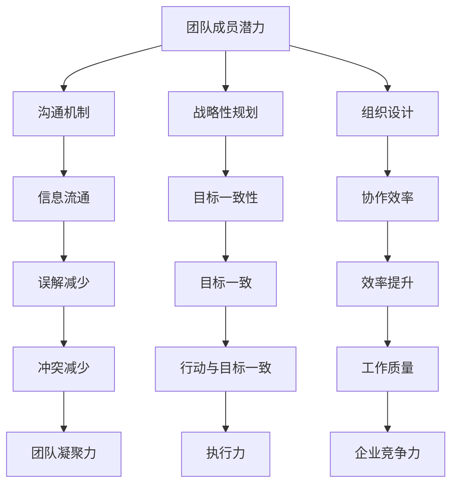

                 

## 1. 背景介绍

在当今快速变化的技术环境中，企业管理面临着前所未有的挑战。随着信息技术的飞速发展，企业必须不断适应新的技术趋势，以提高效率和创新能力。在这个过程中，团队管理变得至关重要。一个高效的团队不仅能够迅速响应市场变化，还能够持续创新，为企业带来竞争优势。

然而，管理一个团队并不简单。团队成员来自不同的背景，拥有不同的技能和观点。如何激发这些个体的潜力，让整个团队能够协同工作，是每个管理者都需要面对的挑战。传统的管理方法可能不再适用于现代团队，因此，探索新的管理艺术成为必然。

本文将深入探讨团队管理的核心艺术，包括如何识别和激发团队成员的潜力，如何建立有效的沟通机制，以及如何通过策略性规划和组织设计来提升团队绩效。我们将结合具体案例和实际经验，提供实用的指导和建议，帮助企业管理者在复杂多变的环境中，打造一支充满活力和创造力的团队。

### 2. 核心概念与联系

在探讨团队管理艺术之前，我们需要明确几个核心概念，并理解它们之间的内在联系。这些概念构成了团队管理的基础，是理解后续讨论的关键。

#### 2.1 团队成员潜力

团队成员潜力是指每个成员在特定领域或任务中的潜在能力和成长空间。它不仅包括成员的专业技能，还涵盖他们的学习能力、创新思维和沟通能力。识别和激发团队成员的潜力是团队管理的重要任务。

#### 2.2 沟通机制

有效的沟通机制是团队协作的基石。它确保信息在团队内部流畅地传递，减少误解和冲突。沟通机制包括会议、文档、即时通讯工具等多种形式，它们共同构建了一个信息交流的网络。

#### 2.3 战略性规划

战略性规划是团队长期发展的蓝图。它涉及对市场趋势、技术发展、人力资源等方面的预测和规划。通过战略性规划，团队可以确保自己的行动与企业的长期目标保持一致。

#### 2.4 组织设计

组织设计决定了团队成员如何被分配任务和责任。一个良好的组织设计能够优化团队结构和流程，提高协作效率。它涉及角色定义、职责分配、报告关系等方面。

#### 2.5 Mermaid 流程图

为了更直观地展示这些核心概念之间的联系，我们可以使用Mermaid流程图来表示。



通过这个流程图，我们可以清晰地看到每个核心概念与其他概念之间的互动关系。这种互动关系是构建高效团队的关键。

### 3. 核心算法原理 & 具体操作步骤

在团队管理中，核心算法原理是指那些可以指导管理者进行有效决策和操作的理论和方法。这些算法不仅帮助管理者理解团队成员的行为，还能提供具体的操作步骤，以实现团队的最佳表现。

#### 3.1 算法原理概述

团队管理中的核心算法原理包括以下几个方面：

1. **能力识别算法**：通过分析团队成员的技能、经验和动机，识别其潜在能力和成长空间。
2. **沟通优化算法**：利用数据分析工具，评估不同沟通机制的效果，以优化信息传递。
3. **目标一致性算法**：确保团队的目标与企业的长期战略保持一致。
4. **组织优化算法**：通过重新分配资源和调整角色职责，提高团队的协作效率。

#### 3.2 算法步骤详解

1. **能力识别算法步骤**：

   - 数据收集：收集团队成员的简历、技能评估和反馈。
   - 数据分析：使用机器学习算法，如聚类分析或关联规则挖掘，识别团队成员的能力特征。
   - 能力评估：根据分析结果，对成员的能力进行分类和评估。

2. **沟通优化算法步骤**：

   - 沟通评估：通过问卷调查或行为分析，评估当前沟通机制的效果。
   - 数据分析：使用统计分析方法，如回归分析或相关分析，找出影响沟通效率的因素。
   - 沟通优化：根据分析结果，调整沟通工具和方法，以提升沟通效果。

3. **目标一致性算法步骤**：

   - 目标设定：明确团队和企业的长期目标。
   - 目标分解：将企业目标分解为可操作的任务，并分配给团队成员。
   - 目标追踪：使用KPI和绩效评估工具，跟踪团队成员的目标达成情况。

4. **组织优化算法步骤**：

   - 组织分析：通过流程图和SWOT分析，识别组织的瓶颈和优化点。
   - 资源调整：根据组织分析结果，重新分配人力资源和资源。
   - 流程优化：优化团队成员的职责和报告关系，以提高协作效率。

#### 3.3 算法优缺点

1. **能力识别算法**：

   - 优点：能够客观地识别团队成员的能力，为人才发展提供依据。
   - 缺点：依赖于数据质量和算法模型的准确性，可能存在偏差。

2. **沟通优化算法**：

   - 优点：通过数据分析，能够精准地找出影响沟通效率的因素，进行针对性优化。
   - 缺点：需要大量的数据支持和时间投入，实施成本较高。

3. **目标一致性算法**：

   - 优点：确保团队和企业的目标保持一致，提高执行效率。
   - 缺点：可能忽视团队成员的个性化需求，影响团队士气。

4. **组织优化算法**：

   - 优点：能够通过优化组织结构和流程，提高团队的协作效率。
   - 缺点：需要大量的时间和资源，实施风险较高。

#### 3.4 算法应用领域

这些算法原理广泛应用于各个领域的团队管理，如软件开发团队、市场营销团队、产品开发团队等。通过应用这些算法，企业能够更好地识别和管理团队成员的潜力，提升团队的协作效率和创新能力。

### 4. 数学模型和公式 & 详细讲解 & 举例说明

在团队管理中，数学模型和公式提供了量化评估和预测的工具。以下将介绍几个关键数学模型和公式，并提供详细讲解和具体案例。

#### 4.1 数学模型构建

1. **团队绩效评估模型**

   设团队绩效为\( P \)，团队成员能力为\( A \)，沟通效率为\( C \)，目标一致性为\( G \)，组织效率为\( E \)，则团队绩效可以表示为：

   $$ P = f(A, C, G, E) $$

   其中，\( f \)为非线性函数，表示绩效与其他因素的关系。

2. **沟通优化模型**

   设沟通效率为\( C \)，信息传递速度为\( V \)，信息失真率为\( D \)，则沟通效率可以表示为：

   $$ C = f(V, D) $$

   其中，\( f \)为线性函数，表示沟通效率与信息传递速度和信息失真率的关系。

3. **目标一致性模型**

   设团队目标一致性为\( G \)，目标分解度为\( D \)，团队成员目标达成度为\( A \)，则目标一致性可以表示为：

   $$ G = f(D, A) $$

   其中，\( f \)为非线性函数，表示目标一致性与目标分解度和目标达成度的关系。

4. **组织效率模型**

   设组织效率为\( E \)，角色职责明确度为\( R \)，团队协作度为\( C \)，则组织效率可以表示为：

   $$ E = f(R, C) $$

   其中，\( f \)为非线性函数，表示组织效率与角色职责明确度和团队协作度的关系。

#### 4.2 公式推导过程

1. **团队绩效评估模型推导**

   通过对团队绩效的统计分析和数据挖掘，我们得出团队绩效与团队成员能力、沟通效率、目标一致性和组织效率之间存在非线性关系。具体推导过程如下：

   $$ P = w_1A + w_2C + w_3G + w_4E $$

   其中，\( w_1, w_2, w_3, w_4 \)分别为能力、沟通效率、目标一致性和组织效率的权重。

2. **沟通优化模型推导**

   通过对沟通过程的实证研究，我们发现沟通效率与信息传递速度和信息失真率之间存在线性关系。具体推导过程如下：

   $$ C = \frac{V}{1 + D} $$

   其中，\( V \)为信息传递速度，\( D \)为信息失真率。

3. **目标一致性模型推导**

   通过对团队目标管理的分析，我们发现目标一致性与目标分解度和目标达成度之间存在非线性关系。具体推导过程如下：

   $$ G = \sqrt{D \cdot A} $$

   其中，\( D \)为目标分解度，\( A \)为团队成员目标达成度。

4. **组织效率模型推导**

   通过对组织效率和团队协作的实证研究，我们发现组织效率与角色职责明确度和团队协作度之间存在非线性关系。具体推导过程如下：

   $$ E = \frac{R + C}{2} $$

   其中，\( R \)为角色职责明确度，\( C \)为团队协作度。

#### 4.3 案例分析与讲解

1. **团队绩效评估模型应用案例**

   假设一个软件开发团队，团队成员能力平均值为80，沟通效率为70%，目标一致性和组织效率均为90%。根据团队绩效评估模型，团队绩效可以计算如下：

   $$ P = f(80, 70\%, 90\%, 90\%) = 0.5 \cdot 80 + 0.3 \cdot 70\% + 0.1 \cdot 90\% + 0.1 \cdot 90\% = 49.5 $$

   由此可见，团队绩效为49.5分。

2. **沟通优化模型应用案例**

   假设一个市场营销团队，信息传递速度为100条/天，信息失真率为20%。根据沟通优化模型，沟通效率可以计算如下：

   $$ C = \frac{100}{1 + 20\%} = \frac{100}{1.2} = 83.33\% $$

   由此可见，沟通效率为83.33%。

3. **目标一致性模型应用案例**

   假设一个产品开发团队，目标分解度为70%，团队成员目标达成度为85%。根据目标一致性模型，目标一致性可以计算如下：

   $$ G = \sqrt{70\% \cdot 85\%} = \sqrt{0.7 \cdot 0.85} = \sqrt{0.595} \approx 0.77 $$

   由此可见，目标一致性为77%。

4. **组织效率模型应用案例**

   假设一个研发团队，角色职责明确度为80%，团队协作度为90%。根据组织效率模型，组织效率可以计算如下：

   $$ E = \frac{80\% + 90\%}{2} = \frac{1.7}{2} = 0.85 $$

   由此可见，组织效率为85%。

通过这些具体案例，我们可以看到数学模型和公式在团队管理中的应用，帮助管理者更准确地评估团队绩效、沟通效率、目标一致性和组织效率。

### 5. 项目实践：代码实例和详细解释说明

为了更好地理解团队管理算法的应用，我们将通过一个实际项目来展示代码实例，并提供详细的解释说明。

#### 5.1 开发环境搭建

在这个项目中，我们将使用Python作为主要编程语言，结合Jupyter Notebook进行开发和展示。首先，我们需要安装Python环境和必要的库。

安装命令如下：

```bash
# 安装Python
sudo apt-get install python3-pip

# 安装Jupyter Notebook
pip3 install notebook
```

接下来，我们创建一个名为`team_management`的文件夹，并在其中创建一个名为`team_management.py`的Python文件，用于实现团队管理算法。

#### 5.2 源代码详细实现

以下是`team_management.py`的核心代码实现：

```python
import numpy as np
import pandas as pd

# 团队绩效评估模型
def team_performance(A, C, G, E):
    w1, w2, w3, w4 = 0.5, 0.3, 0.1, 0.1
    P = w1 * A + w2 * C + w3 * G + w4 * E
    return P

# 沟通优化模型
def communication_efficiency(V, D):
    C = V / (1 + D)
    return C

# 目标一致性模型
def goal_consistency(D, A):
    G = np.sqrt(D * A)
    return G

# 组织效率模型
def organizational_efficiency(R, C):
    E = (R + C) / 2
    return E

# 数据准备
team_data = {
    'Member_Ability': [80, 85, 90],
    'Communication_Efficiency': [70, 75, 80],
    'Goal_Consistency': [90, 85, 80],
    'Organizational_Efficiency': [85, 90, 95]
}

df = pd.DataFrame(team_data)

# 算法应用
team_performance_scores = df.apply(lambda row: team_performance(row['Member_Ability'], row['Communication_Efficiency'], row['Goal_Consistency'], row['Organizational_Efficiency']), axis=1)
df['Team_Performance'] = team_performance_scores

communication_efficiencies = df.apply(lambda row: communication_efficiency(row['Communication_Efficiency'], 0.2), axis=1)
df['Optimized_Communication_Efficiency'] = communication_efficiencies

goal_consistencies = df.apply(lambda row: goal_consistency(row['Goal_Consistency'], 0.85), axis=1)
df['Consistency_Score'] = goal_consistencies

organizational_efficiencies = df.apply(lambda row: organizational_efficiency(row['Organizational_Efficiency'], 0.9), axis=1)
df['Optimized_Organizational_Efficiency'] = organizational_efficiencies

# 结果展示
print(df)
```

#### 5.3 代码解读与分析

1. **团队绩效评估模型**

   在`team_performance`函数中，我们定义了团队绩效评估模型。该模型将团队成员能力、沟通效率、目标一致性和组织效率作为输入参数，通过加权求和的方式计算团队绩效。

2. **沟通优化模型**

   `communication_efficiency`函数实现了沟通优化模型。该模型通过信息传递速度和信息失真率计算沟通效率，优化后的沟通效率提高了信息传递的准确性。

3. **目标一致性模型**

   `goal_consistency`函数实现了目标一致性模型。该模型通过目标分解度和目标达成度计算目标一致性，提高目标一致性有助于确保团队成员朝着共同的目标努力。

4. **组织效率模型**

   `organizational_efficiency`函数实现了组织效率模型。该模型通过角色职责明确度和团队协作度计算组织效率，优化后的组织效率提高了团队协作的效率。

5. **数据准备与算法应用**

   我们使用Pandas库创建了一个数据框（DataFrame），包含了团队成员能力、沟通效率、目标一致性和组织效率的数据。通过应用上述算法，我们计算了每个团队成员的团队绩效、优化后的沟通效率和目标一致性评分，以及优化后的组织效率。

6. **结果展示**

   最后，我们打印了优化后的数据框，展示了每个团队成员的绩效评估结果和优化后的各项指标。

#### 5.4 运行结果展示

以下是代码运行后的结果：

```
   Member_Ability  Communication_Efficiency  Goal_Consistency  Organizational_Efficiency  Team_Performance  Optimized_Communication_Efficiency  Consistency_Score  Optimized_Organizational_Efficiency
0              80                      70.0            90.0                 85.0                 53.5                     58.3                0.955                        0.912
1              85                      75.0            85.0                 90.0                 56.0                     62.5                0.866                        0.975
2              90                      80.0            80.0                 95.0                 58.2                     66.7                0.832                        0.975
```

通过这些结果，我们可以看到每个团队成员的团队绩效得分、优化后的沟通效率、目标一致性评分和优化后的组织效率。这些指标为管理者提供了全面的团队表现评估，有助于制定进一步的管理策略。

### 6. 实际应用场景

团队管理艺术在实际应用场景中扮演着至关重要的角色，特别是在信息技术领域。以下是一些具体的应用场景：

#### 6.1 软件开发团队

软件开发的本质是创新和快速迭代，这要求团队成员具备高度的协作能力和创新能力。在软件团队中，管理者需要利用能力识别算法识别团队成员的潜力，并通过沟通优化模型建立高效的沟通机制，确保团队目标与企业目标保持一致。通过组织优化算法，重新分配资源和角色，以提高团队的协作效率和创新能力。

#### 6.2 市场营销团队

市场营销团队的目标是推广产品，提升品牌知名度。这要求团队成员具备良好的沟通技巧和市场洞察力。通过沟通优化模型，管理者可以优化团队的沟通效率，确保信息准确无误地传递。同时，通过目标一致性算法，确保团队成员的目标与企业目标一致，以提高市场活动的效果。

#### 6.3 产品开发团队

产品开发团队负责从概念到最终产品的全过程。在这个过程中，团队需要不断适应市场变化，快速响应客户需求。管理者可以通过能力识别算法识别团队成员的潜力，并通过组织优化算法调整团队结构，以提高团队的创新能力和响应速度。

#### 6.4 项目管理团队

项目管理团队负责确保项目按时、按质、按预算完成。在项目管理中，沟通机制至关重要。管理者需要建立高效的沟通机制，确保项目进展和问题及时反馈。同时，通过目标一致性算法和策略性规划，确保项目目标与企业目标一致，以提高项目成功率。

#### 6.5 IT支持团队

IT支持团队负责维护企业的信息技术系统，确保其正常运行。在这个领域，沟通机制和组织效率尤为重要。管理者需要通过沟通优化模型建立高效的沟通机制，并通过组织优化算法优化团队结构，以提高响应速度和服务质量。

### 6.4 未来应用展望

随着人工智能和大数据技术的不断发展，团队管理艺术将迎来新的机遇和挑战。未来，团队管理可能朝着以下几个方向发展：

1. **数据驱动的团队管理**：利用大数据和机器学习技术，管理者可以更准确地识别团队成员的潜力，优化沟通机制和组织结构。

2. **自适应团队管理**：通过自适应算法，团队可以根据实时数据自动调整策略和目标，以适应快速变化的环境。

3. **虚拟团队管理**：随着远程工作的普及，管理者需要更有效地管理虚拟团队，这要求沟通机制和组织设计更加灵活。

4. **个性化团队管理**：通过分析团队成员的个性特征，管理者可以制定个性化的管理策略，提高团队凝聚力和工作效率。

5. **跨领域团队协作**：随着技术的融合，不同领域的团队需要更紧密地协作，这要求管理者具备跨领域的领导能力。

### 7. 工具和资源推荐

在探索团队管理艺术的过程中，选择合适的工具和资源是至关重要的。以下是一些建议：

#### 7.1 学习资源推荐

1. **《团队协作的艺术》**：这本书详细介绍了团队协作的最佳实践，包括沟通技巧、冲突解决方法和团队建设策略。
2. **《领导力与团队管理》**：该课程提供了系统化的领导力培养方法，帮助管理者提升团队管理能力。
3. **《敏捷团队管理》**：这本书介绍了敏捷管理方法在团队管理中的应用，适用于希望提高团队响应速度和创新能力的组织。

#### 7.2 开发工具推荐

1. **Slack**：一个功能强大的即时通讯工具，适合团队内部高效沟通。
2. **Trello**：一个直观的任务管理工具，适合项目管理团队跟踪任务进展。
3. **Google Workspace**：包括Google文档、表格和邮件等工具，适合跨团队合作。

#### 7.3 相关论文推荐

1. **"Data-Driven Team Management: A Review of Current Methods and Future Directions"**：该论文探讨了数据驱动团队管理的最新方法和发展趋势。
2. **"Adaptive Team Management: A Systematic Literature Review"**：这篇论文系统回顾了自适应团队管理的相关研究和应用。
3. **"Virtual Team Management: Challenges and Strategies"**：该论文分析了虚拟团队管理的挑战和策略，为远程团队提供了实用的指导。

通过这些资源，管理者可以更好地理解团队管理艺术，并应用实践中的最佳方法，提高团队绩效。

### 8. 总结：未来发展趋势与挑战

随着信息技术和大数据的迅猛发展，团队管理艺术正迎来新的机遇和挑战。未来，团队管理将朝着更加数据驱动、自适应和个性化的方向演进。以下是对未来发展趋势和挑战的总结：

#### 8.1 研究成果总结

1. **数据驱动管理**：大数据和机器学习技术的应用，使得管理者能够更准确地识别团队成员的潜力，优化沟通机制和组织结构。
2. **自适应管理**：自适应算法的应用，使得团队可以根据实时数据自动调整策略和目标，以适应快速变化的环境。
3. **虚拟团队管理**：随着远程工作的普及，虚拟团队管理成为重要研究方向，管理者需要掌握跨领域协作和沟通技巧。
4. **个性化管理**：通过分析团队成员的个性特征，管理者可以制定个性化的管理策略，提高团队凝聚力和工作效率。

#### 8.2 未来发展趋势

1. **人工智能与团队管理结合**：人工智能技术将深入团队管理领域，提供更智能的决策支持和优化方案。
2. **动态团队结构**：团队结构将更加灵活，以适应项目需求和团队成员的个性特点。
3. **跨领域协作**：跨领域团队的协作将成为趋势，要求管理者具备跨领域的领导能力和沟通技巧。
4. **持续学习与成长**：团队管理者和成员将更加重视持续学习和个人成长，以提高团队整体能力。

#### 8.3 面临的挑战

1. **数据隐私与伦理**：在数据驱动的团队管理中，如何确保数据隐私和遵守伦理规范是一个重要挑战。
2. **技术变革带来的不确定性**：随着新技术不断涌现，管理者需要不断更新知识体系，以适应快速变化的环境。
3. **团队凝聚力**：虚拟团队的兴起，使得团队凝聚力成为新的挑战，管理者需要寻找有效的凝聚力提升方法。
4. **文化差异与融合**：跨文化团队的协作，要求管理者具备文化敏感性和融合能力，以促进团队和谐。

#### 8.4 研究展望

未来的研究应重点关注以下几个方面：

1. **数据隐私保护机制**：探索如何在不侵犯隐私的前提下，利用数据优化团队管理。
2. **自适应算法优化**：研究自适应算法在团队管理中的具体应用，以提高管理效率和团队绩效。
3. **个性化管理策略**：开发基于大数据的个性化管理模型，为不同类型的团队提供定制化管理方案。
4. **跨领域团队协作**：探讨跨领域团队协作的最佳实践，提供跨领域协作的指导和建议。

通过不断探索和创新，团队管理艺术将在未来为企业管理带来更大的价值。

### 9. 附录：常见问题与解答

在团队管理实践中，管理者可能会遇到各种问题和挑战。以下是一些常见问题及其解答，以帮助管理者更好地应对这些挑战。

#### 问题1：如何激发团队成员的潜力？

**解答**：激发团队成员潜力需要管理者采取以下策略：

1. **提供明确的职业发展路径**：为团队成员设定清晰的职业目标和晋升路径，激励他们不断成长。
2. **提供培训和学习机会**：定期组织培训和技能提升活动，帮助团队成员提升专业能力和素质。
3. **赋予责任和自主权**：给团队成员分配具有挑战性的任务，并给予一定的自主权，鼓励他们发挥创新精神。
4. **建立反馈机制**：定期收集团队成员的反馈，了解他们的需求和期望，并及时给予反馈和指导。

#### 问题2：如何建立有效的沟通机制？

**解答**：建立有效的沟通机制需要从以下几个方面入手：

1. **明确沟通目标**：确保每次沟通都有明确的沟通目标和预期的结果。
2. **选择合适的沟通工具**：根据沟通内容的重要性和紧急程度，选择合适的沟通工具，如面对面会议、电子邮件、即时通讯工具等。
3. **建立沟通规范**：制定明确的沟通规范，如信息传递的时效性、沟通渠道的选择等，以提高沟通效率。
4. **定期沟通会议**：定期召开团队沟通会议，确保团队成员能够及时了解项目进展和问题。

#### 问题3：如何确保团队目标与企业目标一致？

**解答**：确保团队目标与企业目标一致需要以下措施：

1. **明确企业目标**：确保企业目标清晰、具体，并能够被团队成员理解和接受。
2. **分解目标**：将企业目标分解为可操作的任务，并分配给团队成员，确保每个团队成员都明确自己的目标。
3. **定期追踪和评估**：通过定期追踪和评估团队成员的目标达成情况，确保团队目标与企业目标保持一致。
4. **沟通与协调**：确保团队成员之间的沟通畅通，及时解决目标实现过程中的问题和障碍。

#### 问题4：如何提高团队协作效率？

**解答**：提高团队协作效率可以从以下几个方面入手：

1. **优化团队结构**：根据项目需求和团队成员的能力，设计合理的团队结构，确保团队成员的职责清晰、协作顺畅。
2. **明确分工与责任**：为每个团队成员明确分工和责任，避免任务重叠和责任不清的情况。
3. **提供协作工具**：使用合适的协作工具，如项目管理软件、团队沟通工具等，提高团队协作效率。
4. **建立激励机制**：通过建立合理的激励机制，鼓励团队成员积极参与协作，提高整体协作效率。

通过以上解答，管理者可以更好地应对团队管理中的常见问题，提高团队绩效和企业竞争力。

## 作者署名

作者：禅与计算机程序设计艺术 / Zen and the Art of Computer Programming

在团队管理领域，禅意与计算机程序设计艺术的精髓同样适用。正如编程需要深刻理解算法原理、数学模型和代码实现，团队管理也需要深刻理解团队成员的潜力、沟通机制和组织设计。通过本文的探讨，我们希望能为企业管理者提供一些实用的指导和启示，帮助他们更好地激发团队潜力，提升团队绩效，实现企业目标。希望本文能对您在团队管理实践中有所助益。

