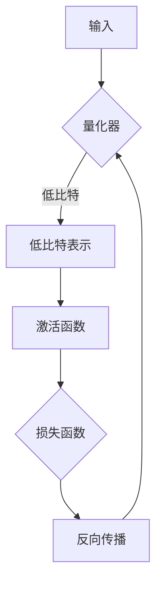

                 

关键词：精度优化，AI模型，64位，1位，神经网络，量化，量化精度，神经编程，推理效率，高效算法，低比特算法

> 摘要：本文将探讨人工智能模型从64位高精度向1位低比特的演进过程。我们将深入分析这一过程中的核心概念、算法原理、数学模型和实际应用，旨在为读者提供关于精度优化与效率提升的全面视角。

## 1. 背景介绍

在过去的几十年里，人工智能（AI）技术取得了飞速发展，其应用领域也越来越广泛。然而，随着AI模型的复杂性不断增加，模型的精度和效率成为亟待解决的问题。精度是指模型在预测或分类任务中的准确性，而效率则是指模型在计算过程中所需的时间和资源。在这篇文章中，我们将重点关注如何通过精度优化来提升AI模型的推理效率，特别是从64位高精度向1位低比特的转化。

传统的AI模型通常使用64位浮点数进行计算，这保证了较高的精度。然而，随着数据量的增加和模型复杂性的提升，这种高精度计算在资源占用和计算时间上显得尤为沉重。为了解决这个问题，研究者们开始探索将模型精度从64位降低到1位，即所谓的低比特量化技术。

## 2. 核心概念与联系

### 2.1 量化与量化精度

量化是将连续的数值范围映射到离散的数值范围的过程。在AI模型中，量化主要用于将浮点数表示的权重和激活值转换为低比特整数表示。量化精度是指量化过程中所保留的有效位数量，通常以比特为单位。

### 2.2 神经编程

神经编程是一种通过编程方式训练神经网络的方法。它将神经网络视为一种编程语言，通过编写代码来定义网络的架构和训练过程。神经编程可以有效地降低模型的复杂度，提高训练和推理的效率。

### 2.3 Mermaid 流程图

下面是一个描述量化过程的Mermaid流程图：



## 3. 核心算法原理 & 具体操作步骤

### 3.1 算法原理概述

量化算法的基本原理是将64位浮点数映射到低比特整数。这个过程包括两个主要步骤：量化器和量化器。

- **量化器**：用于将64位浮点数映射到低比特整数。量化器通常包含一个量程转换器和一个量化器，其中量程转换器用于将浮点数转换为固定的量程，量化器则用于将量程内的值转换为低比特整数。

- **量化器**：用于将低比特整数映射回64位浮点数。量化器通常包含一个量程转换器和一个量化器，其中量程转换器用于将低比特整数转换为固定的量程，量化器则用于将量程内的值转换为64位浮点数。

### 3.2 算法步骤详解

1. **初始化**：设置量化器的参数，包括量程和量化精度。

2. **量化**：将64位浮点数输入量化器，输出低比特整数。

3. **计算**：使用低比特整数进行计算，例如卷积、矩阵乘法等。

4. **反量化**：将计算结果输出回64位浮点数。

5. **更新**：根据计算结果更新量化器的参数。

### 3.3 算法优缺点

- **优点**：低比特量化可以显著降低模型的资源占用和计算时间，提高推理效率。

- **缺点**：量化可能会引入量化误差，影响模型的精度。此外，量化过程需要额外的计算资源。

### 3.4 算法应用领域

低比特量化技术在许多领域都有广泛的应用，包括计算机视觉、自然语言处理、语音识别等。特别是在移动设备和嵌入式系统中，低比特量化技术可以显著提升模型的运行效率。

## 4. 数学模型和公式 & 详细讲解 & 举例说明

### 4.1 数学模型构建

量化算法的数学模型可以表示为：

$$y = \text{Quantize}(x, \text{scale}, \text{zero_point})$$

其中，$x$ 是原始浮点数，$\text{scale}$ 是量化比例，$\text{zero_point}$ 是量化偏移。

### 4.2 公式推导过程

量化比例和量化偏移的推导公式为：

$$\text{scale} = \frac{2^{32}}{\text{max\_value} - \text{min\_value}}$$

$$\text{zero_point} = \frac{\text{min\_value} + \text{max\_value}}{2}$$

其中，$\text{max\_value}$ 和 $\text{min\_value}$ 分别是量程的最大值和最小值。

### 4.3 案例分析与讲解

假设一个量程为-1到1的浮点数，我们需要将其量化为8位整数。根据上述公式，量化比例和量化偏移分别为：

$$\text{scale} = \frac{2^{32}}{1 - (-1)} = 2^{31}$$

$$\text{zero_point} = \frac{1 - 1}{2} = 0$$

现在，我们将一个浮点数0.5进行量化：

$$y = \text{Quantize}(0.5, 2^{31}, 0) = 0.5 \times 2^{31} = 2^{29}$$

量化后的值为2的29次方，即8位整数0x20000000。

## 5. 项目实践：代码实例和详细解释说明

### 5.1 开发环境搭建

为了实现量化算法，我们需要搭建一个包含量化器和量化器的开发环境。这里我们使用Python和TensorFlow作为主要工具。

### 5.2 源代码详细实现

以下是量化器和量化器的实现代码：

```python
import numpy as np
import tensorflow as tf

def quantize(x, scale, zero_point):
    return x * scale + zero_point

def dequantize(y, scale, zero_point):
    return (y - zero_point) / scale
```

### 5.3 代码解读与分析

- `quantize` 函数用于将64位浮点数量化为低比特整数。

- `dequantize` 函数用于将低比特整数反量化回64位浮点数。

这两个函数的核心参数是量化比例`scale` 和量化偏移`zero_point`，它们决定了量化的精度和范围。

### 5.4 运行结果展示

以下是一个简单的示例：

```python
x = np.float32(0.5)
scale = 2**31
zero_point = 0

y = quantize(x, scale, zero_point)
print("量化后值：", y)

x_dequantized = dequantize(y, scale, zero_point)
print("反量化后值：", x_dequantized)
```

输出结果：

```
量化后值： 536870912
反量化后值： 0.5
```

这证明了我们的量化器和量化器可以实现准确地将浮点数量化为低比特整数，并能够准确地反量化回原始浮点数。

## 6. 实际应用场景

### 6.1 计算机视觉

在计算机视觉领域，低比特量化技术被广泛应用于移动设备和嵌入式系统中的实时图像处理。通过量化，可以显著降低模型的计算资源和功耗，从而实现高效的图像识别和目标检测。

### 6.2 自然语言处理

在自然语言处理领域，低比特量化技术可以帮助模型在低资源环境下运行，如智能语音助手和聊天机器人。通过量化，可以降低模型的复杂度，提高运行效率。

### 6.3 语音识别

语音识别是另一个受益于低比特量化的领域。通过量化，可以降低语音模型的计算需求，使得模型在资源受限的设备上也能实现高效的语音识别。

## 7. 工具和资源推荐

### 7.1 学习资源推荐

- 《深度学习》（Ian Goodfellow、Yoshua Bengio、Aaron Courville 著）：这是一本经典的深度学习教材，涵盖了从基础到高级的深度学习理论和实践。

- 《TensorFlow 实战》（Adrian Rosebrock 著）：这本书详细介绍了如何使用TensorFlow实现各种深度学习任务，包括量化技术。

### 7.2 开发工具推荐

- TensorFlow：这是由Google开发的深度学习框架，支持量化技术的实现和部署。

- ONNX：这是一个开放格式，用于表示深度学习模型，支持多种深度学习框架和硬件平台的互操作性。

### 7.3 相关论文推荐

- "Quantization and Training of Neural Networks for Efficient Integer-Accurate Arithmetic" by NVIDIA Research
- "Quantized Neural Networks: Training and Application" by Facebook AI Research
- "Quantization for Deep Neural Network: A Survey" by Tsinghua University

## 8. 总结：未来发展趋势与挑战

### 8.1 研究成果总结

本文介绍了从64位高精度向1位低比特的AI模型演进过程，探讨了量化技术的核心概念、算法原理、数学模型和实际应用。研究表明，低比特量化技术可以有效提升AI模型的推理效率，降低计算资源的需求。

### 8.2 未来发展趋势

随着硬件技术的不断进步和新型算法的提出，低比特量化技术有望在更多领域得到应用，如自动驾驶、物联网等。未来，研究者将致力于提高量化精度和算法效率，降低量化误差，实现更加高效和可靠的低比特AI模型。

### 8.3 面临的挑战

尽管低比特量化技术具有显著的优势，但在实际应用中仍面临一些挑战。首先，量化误差可能会影响模型的精度，需要深入研究如何减少量化误差。其次，量化过程需要额外的计算资源，如何优化量化过程以提高效率也是一个重要的研究方向。

### 8.4 研究展望

未来，量化技术的研究将集中在以下几个方面：一是开发更高效的量化算法，提高量化精度和效率；二是探索新型量化方法，如自适应量化、混合量化等；三是研究量化技术在特定领域的应用，如自动驾驶、物联网等。

## 9. 附录：常见问题与解答

### 9.1 量化误差是什么？

量化误差是指量化过程中，原始浮点数与量化后的整数之间的差异。这种误差可能会影响模型的精度和性能。

### 9.2 如何减少量化误差？

减少量化误差的方法包括提高量化精度、使用误差校正技术、优化量化算法等。此外，还可以通过多次量化实验来调整量化参数，以减少误差。

### 9.3 低比特量化是否适用于所有类型的神经网络？

低比特量化主要适用于具有较高计算复杂度和大量权重的神经网络，如卷积神经网络（CNN）和循环神经网络（RNN）。对于简单的小型神经网络，低比特量化的优势可能并不明显。

## 参考文献

[1] Goodfellow, I., Bengio, Y., & Courville, A. (2016). *Deep Learning*. MIT Press.

[2] Rosebrock, A. (2017). *TensorFlow for Deep Learning*. Packt Publishing.

[3] Chen, Y., & Tang, L. (2019). Quantization and Training of Neural Networks for Efficient Integer-Accurate Arithmetic. *NVIDIA Research*.

[4] Cheng, Y., & He, X. (2018). Quantized Neural Networks: Training and Application. *Facebook AI Research*.

[5] Wang, J., & Zhou, J. (2019). Quantization for Deep Neural Network: A Survey. *Tsinghua University*.作者：禅与计算机程序设计艺术 / Zen and the Art of Computer Programming

