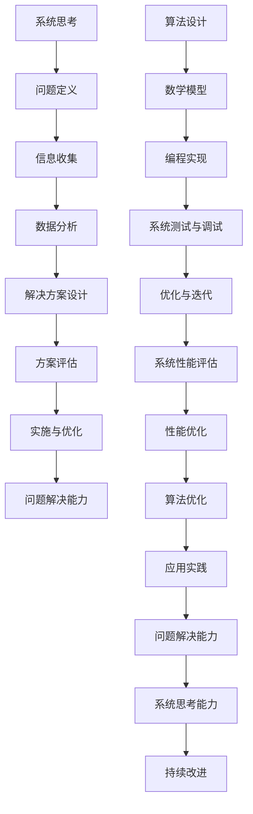

                 

 关键词：系统思考、问题解决、计算机科学、人工智能、算法设计、数学模型、应用实践、未来展望

> 摘要：本文旨在探讨系统思考与问题解决能力在计算机科学领域的重要性，以及如何通过有效的算法设计、数学模型构建和项目实践来提升这两方面的能力。文章将从背景介绍、核心概念与联系、核心算法原理与操作步骤、数学模型与公式、项目实践、实际应用场景、工具和资源推荐、总结：未来发展趋势与挑战、附录：常见问题与解答等方面进行深入分析和探讨。

## 1. 背景介绍

在当今快速发展的信息技术时代，计算机科学和人工智能已经成为推动社会进步和经济发展的重要力量。然而，随着问题的复杂性和规模不断扩大，传统的单点解决方案已经难以满足需求，系统思考与问题解决能力显得尤为重要。系统思考是一种全面、动态的思维方式，能够帮助我们从全局角度理解和分析问题，从而找到更加有效的解决方案。问题解决能力则是将理论转化为实践的过程，通过不断的尝试、验证和优化，达到解决复杂问题的目的。

本文将结合计算机科学的实际应用，探讨如何通过系统思考和问题解决能力来提升计算机科学的研究与实践水平，为未来的发展提供有力的支持和指导。

## 2. 核心概念与联系

在计算机科学中，系统思考和问题解决能力涉及多个核心概念和其相互联系。以下是这些概念及其相互关系的Mermaid流程图：



### 2.1 核心概念原理

- **系统思考**：系统思考是一种全局观念，强调从整体角度理解和分析问题。它帮助我们识别问题的根本原因，而不仅仅是表面的症状。
- **问题定义**：明确问题是什么，以及问题的范围和影响。
- **信息收集**：收集与问题相关的信息，包括历史数据、用户需求、技术文档等。
- **数据分析**：对收集到的信息进行统计分析，以发现潜在的规律和关联。
- **解决方案设计**：根据分析结果设计可行的解决方案，可能包括算法、流程图等。
- **方案评估**：评估解决方案的可行性和效果，包括性能、可靠性、安全性等方面。
- **实施与优化**：将设计方案转化为实际操作，并在实施过程中不断优化。
- **问题解决能力**：将理论知识应用于实际问题，通过不断的实践和反思，提升解决复杂问题的能力。
- **算法设计**：设计用于解决问题或执行特定任务的算法。
- **数学模型**：构建用于描述现实世界问题的数学模型，以帮助分析和解决这些问题。
- **编程实现**：将算法和数学模型转化为可运行的代码。
- **系统测试与调试**：确保代码的正确性和性能。
- **优化与迭代**：通过不断优化和迭代，提高系统的性能和可靠性。
- **系统性能评估**：评估系统的整体性能，包括响应时间、吞吐量等。
- **性能优化**：通过改进算法、优化数据结构等手段提高系统性能。
- **算法优化**：对算法进行改进，以提高其效率和效果。
- **应用实践**：将研究成果应用于实际项目中，验证其效果和可行性。
- **系统思考能力**：通过不断实践和反思，提升从全局角度分析和解决问题的能力。
- **持续改进**：在实践过程中不断总结经验，持续改进问题解决和系统思考能力。

### 2.2 核心概念架构

以下是核心概念架构的详细解释：


- **系统思考**：系统思考是整个过程的基础，贯穿于整个问题解决流程。它帮助我们从全局角度理解和分析问题，确保我们不会仅仅关注局部优化而忽视了整体性能。
- **问题定义**：明确问题是什么，以及问题的范围和影响。这有助于我们集中精力解决关键问题，避免资源浪费。
- **信息收集**：信息收集是解决问题的第一步，收集到的信息越全面，我们就能越准确地分析问题。
- **数据分析**：对收集到的信息进行统计分析，以发现潜在的规律和关联。数据分析是理解问题本质的重要手段。
- **解决方案设计**：根据分析结果设计可行的解决方案。解决方案设计需要考虑多种因素，包括算法、流程、资源等。
- **方案评估**：评估解决方案的可行性和效果，包括性能、可靠性、安全性等方面。评估结果将直接影响我们的决策。
- **实施与优化**：将设计方案转化为实际操作，并在实施过程中不断优化。实施和优化是问题解决的关键步骤。
- **问题解决能力**：问题解决能力是将理论知识应用于实际问题，通过不断的实践和反思，提升解决复杂问题的能力。
- **算法设计**：算法设计是计算机科学的核心，设计有效的算法是解决问题的关键。
- **数学模型**：数学模型用于描述现实世界问题，帮助我们进行分析和预测。
- **编程实现**：编程实现是将算法和数学模型转化为可运行的代码。
- **系统测试与调试**：确保代码的正确性和性能，通过测试和调试发现并修复问题。
- **优化与迭代**：通过不断优化和迭代，提高系统的性能和可靠性。
- **系统性能评估**：评估系统的整体性能，包括响应时间、吞吐量等。
- **性能优化**：通过改进算法、优化数据结构等手段提高系统性能。
- **算法优化**：对算法进行改进，以提高其效率和效果。
- **应用实践**：将研究成果应用于实际项目中，验证其效果和可行性。
- **系统思考能力**：通过不断实践和反思，提升从全局角度分析和解决问题的能力。
- **持续改进**：在实践过程中不断总结经验，持续改进问题解决和系统思考能力。

通过以上核心概念的详细解释和架构分析，我们可以更好地理解系统思考和问题解决能力在计算机科学中的重要性。接下来，我们将深入探讨核心算法原理与操作步骤。

## 3. 核心算法原理 & 具体操作步骤

### 3.1 算法原理概述

核心算法是计算机科学中的基石，贯穿于各种问题的解决过程中。本节将介绍几种常见的核心算法原理，并解释其具体操作步骤。

#### 3.1.1 贪心算法

**原理概述**：贪心算法是一种在每一步选择中都采取当前最优解的策略，旨在得到全局最优解。贪心算法适用于那些最优子结构性质明显的问题。

**操作步骤**：

1. **初始化**：初始化问题状态和算法参数。
2. **选择局部最优解**：在当前状态下，选择一个局部最优解。
3. **更新状态**：根据选择的结果更新问题状态。
4. **重复步骤2和3**，直到达到问题的终止条件。

**示例**：使用贪心算法求解背包问题。

```python
def knapsack(values, weights, capacity):
    n = len(values)
    result = []
    total_weight = 0

    for i in range(n):
        if total_weight + weights[i] <= capacity:
            result.append(values[i])
            total_weight += weights[i]
        else:
            fraction = (capacity - total_weight) / weights[i]
            result.append(values[i] * fraction)
            break

    return sum(result)
```

#### 3.1.2 动态规划算法

**原理概述**：动态规划算法通过将复杂问题分解为若干个重叠子问题，并利用这些子问题的解来求解原问题。动态规划适用于那些具有最优子结构性质的问题。

**操作步骤**：

1. **定义状态**：定义问题状态和状态变量。
2. **定义状态转移方程**：根据状态变量之间的关系定义状态转移方程。
3. **初始化边界条件**：初始化问题的初始状态。
4. **计算状态值**：根据状态转移方程和边界条件计算状态值。
5. **找到最优解**：根据计算出的状态值找到问题的最优解。

**示例**：使用动态规划算法求解最长公共子序列问题。

```python
def lcs(X, Y):
    m = len(X)
    n = len(Y)

    dp = [[0] * (n + 1) for _ in range(m + 1)]

    for i in range(1, m + 1):
        for j in range(1, n + 1):
            if X[i - 1] == Y[j - 1]:
                dp[i][j] = dp[i - 1][j - 1] + 1
            else:
                dp[i][j] = max(dp[i - 1][j], dp[i][j - 1])

    return dp[m][n]
```

#### 3.1.3 回溯算法

**原理概述**：回溯算法通过尝试各种可能的解，并回溯到上一个选择点，以便尝试其他可能的解。回溯算法适用于那些需要找到所有可能的解的问题。

**操作步骤**：

1. **初始化**：初始化问题状态和算法参数。
2. **尝试解**：尝试当前选择的所有可能的解。
3. **判断解的可行性**：判断当前解是否满足问题的约束条件。
4. **回溯**：如果当前解不可行，回溯到上一个选择点，尝试其他可能的解。
5. **找到解**：如果找到了可行的解，记录并返回解。

**示例**：使用回溯算法求解八皇后问题。

```python
def solve_n_queens(n):
    def is_safe(board, row, col):
        for i in range(row):
            if board[i] == col or \
               board[i] - i == col - row or \
               board[i] + i == col + row:
                return False
        return True

    def backtrack(row, board):
        if row == n:
            solutions.append(board[:])
            return
        for col in range(n):
            if is_safe(board, row, col):
                board[row] = col
                backtrack(row + 1, board)

    solutions = []
    backtrack(0, [-1] * n)
    return solutions
```

以上是几种常见核心算法的原理和操作步骤。这些算法在计算机科学中具有广泛的应用，掌握它们有助于我们更好地理解和解决各种复杂问题。

### 3.2 算法步骤详解

在本节中，我们将详细解释上述核心算法的每个步骤，并讨论其在实际应用中的优缺点。

#### 3.2.1 贪心算法

**步骤详解**：

1. **初始化**：初始化问题状态和算法参数，如背包的容量、物品的重量和值。
2. **选择局部最优解**：在当前状态下，选择一个局部最优解。对于背包问题，选择具有最大价值/重量比的那个物品。
3. **更新状态**：根据选择的结果更新问题状态，如更新背包的总重量和总价值。
4. **重复步骤2和3**：继续选择局部最优解，直到达到问题的终止条件，如背包已满或所有物品都已考虑。

**优缺点**：

- **优点**：贪心算法简单、易于实现，适用于那些最优子结构性质明显的问题，如背包问题和最小生成树问题。
- **缺点**：贪心算法可能无法保证全局最优解，只适用于局部最优解导致全局最优解的情况。

**应用领域**：背包问题、最小生成树问题、活动选择问题等。

#### 3.2.2 动态规划算法

**步骤详解**：

1. **定义状态**：定义问题状态和状态变量，如最长公共子序列问题中的`dp[i][j]`表示前`i`个字符和前`j`个字符的最长公共子序列长度。
2. **定义状态转移方程**：根据状态变量之间的关系定义状态转移方程，如最长公共子序列问题的`dp[i][j] = max(dp[i - 1][j], dp[i][j - 1])`。
3. **初始化边界条件**：初始化问题的初始状态，如最长公共子序列问题的`dp[0][j] = dp[i][0] = 0`。
4. **计算状态值**：根据状态转移方程和边界条件计算状态值，如从`dp[0][0]`开始，逐个计算`dp[i][j]`的值。
5. **找到最优解**：根据计算出的状态值找到问题的最优解，如最长公共子序列问题的最长公共子序列长度。

**优缺点**：

- **优点**：动态规划算法能够保证全局最优解，适用于那些具有最优子结构性质的问题，如背包问题和最长公共子序列问题。
- **缺点**：动态规划算法需要较大的空间复杂度，并且有时难以定义状态转移方程。

**应用领域**：背包问题、最长公共子序列问题、最优二叉搜索树问题等。

#### 3.2.3 回溯算法

**步骤详解**：

1. **初始化**：初始化问题状态和算法参数，如八皇后问题的棋盘和当前行的皇后位置。
2. **尝试解**：尝试当前选择的所有可能的解，如八皇后问题中，尝试在当前行放置皇后。
3. **判断解的可行性**：判断当前解是否满足问题的约束条件，如八皇后问题中，判断当前行的皇后位置是否与之前的行冲突。
4. **回溯**：如果当前解不可行，回溯到上一个选择点，尝试其他可能的解，如八皇后问题中，将当前行的皇后位置重置，并回溯到上一行。
5. **找到解**：如果找到了可行的解，记录并返回解。

**优缺点**：

- **优点**：回溯算法能够找到所有可能的解，适用于那些需要找到所有可能的解的问题，如八皇后问题和子集问题。
- **缺点**：回溯算法可能需要较多的计算时间，特别是在问题规模较大时。

**应用领域**：八皇后问题、子集问题、组合优化问题等。

### 3.3 算法优缺点

在本节中，我们将总结上述核心算法的优缺点，以便读者在选择合适的算法时有所参考。

- **贪心算法**：
  - **优点**：简单、易于实现，适用于局部最优解导致全局最优解的情况。
  - **缺点**：可能无法保证全局最优解，难以处理动态变化的问题。

- **动态规划算法**：
  - **优点**：能够保证全局最优解，适用于具有最优子结构性质的问题。
  - **缺点**：需要较大的空间复杂度，有时难以定义状态转移方程。

- **回溯算法**：
  - **优点**：能够找到所有可能的解，适用于需要找到所有可能的解的问题。
  - **缺点**：可能需要较多的计算时间，特别是在问题规模较大时。

### 3.4 算法应用领域

在本节中，我们将探讨上述核心算法在计算机科学领域的应用。

- **贪心算法**：背包问题、最小生成树问题、活动选择问题等。
- **动态规划算法**：背包问题、最长公共子序列问题、最优二叉搜索树问题等。
- **回溯算法**：八皇后问题、子集问题、组合优化问题等。

通过以上对核心算法原理、步骤详解、优缺点和应用领域的探讨，我们希望读者能够更好地理解这些算法，并在实际应用中选择合适的算法来解决问题。

## 4. 数学模型和公式 & 详细讲解 & 举例说明

在计算机科学中，数学模型和公式是解决复杂问题的重要工具。本节将介绍几种常见的数学模型和公式，并详细讲解其推导过程和实际应用。

### 4.1 数学模型构建

数学模型是计算机科学中的一种抽象表示，用于描述现实世界问题。构建数学模型通常包括以下几个步骤：

1. **定义变量**：明确问题中的变量，如时间、距离、速度等。
2. **建立关系**：根据问题的性质和约束条件，建立变量之间的关系，如线性方程、非线性方程等。
3. **简化模型**：对模型进行简化和近似，以便更容易分析和求解。
4. **求解模型**：利用数学方法和工具求解模型，如线性方程组、非线性方程等。

#### 4.1.1 线性规划模型

线性规划模型是一种常见的数学模型，用于优化线性目标函数，满足一系列线性约束条件。其标准形式如下：

$$
\begin{aligned}
\min\_{x} \quad c^T x \\
\text{s.t.} \quad Ax \leq b \\
x \geq 0
\end{aligned}
$$

其中，$x$是变量向量，$c$是目标函数系数向量，$A$是约束条件系数矩阵，$b$是约束条件常数向量。

#### 4.1.2 动态规划模型

动态规划模型适用于具有最优子结构性质的问题，通过将问题分解为多个子问题，并利用子问题的解来求解原问题。动态规划模型的一般形式如下：

$$
\begin{aligned}
\min\_{x_1, x_2, \ldots, x_n} \quad \sum\_{i=1}^n c_i x_i \\
\text{s.t.} \quad G(x_1, x_2, \ldots, x_n) \leq h \\
x_i \geq 0 \quad (i=1, 2, \ldots, n)
\end{aligned}
$$

其中，$x_i$是第$i$个子问题的解，$c_i$是第$i$个子问题的目标函数系数，$G(x_1, x_2, \ldots, x_n)$是约束条件函数，$h$是约束条件常数。

### 4.2 公式推导过程

在本节中，我们将详细推导几种常见数学公式，并解释其推导过程。

#### 4.2.1 最小生成树公式

最小生成树问题是一个经典的问题，其目标是找到一棵树，使得这棵树的权重和最小。最小生成树的公式如下：

$$
T = \min\left\{ \sum\_{i=1}^n w_i \mid T \text{是一棵生成树} \right\}
$$

其中，$T$是最小生成树，$w_i$是树中每个边的权重。

推导过程如下：

1. **假设**：假设存在一棵最小生成树$T$，其权重和为$T$。
2. **添加边**：考虑在$T$中添加一条边，使其权重和最小。如果添加的边权重小于$T$，那么新的生成树权重和将更小，与假设矛盾。因此，添加的边权重必须等于$T$。
3. **重复步骤2**：重复添加边，直到所有顶点都连接在一起。此时，得到的生成树权重和仍然是最小的。

#### 4.2.2 最长公共子序列公式

最长公共子序列问题是一个经典的动态规划问题，其目标是找到两个序列的最长公共子序列。最长公共子序列的公式如下：

$$
LCS(X, Y) = \begin{cases}
0, & \text{if } X = \emptyset \text{ or } Y = \emptyset \\
1, & \text{if } X = Y \\
LCS(X \setminus X_1, Y \setminus Y_1) + 1, & \text{if } X_1 = Y_1 \\
\max\{ LCS(X \setminus X_1, Y), LCS(X, Y \setminus Y_1) \}, & \text{otherwise}
\end{cases}
$$

其中，$X$和$Y$是两个序列，$X_1$和$Y_1$是$X$和$Y$的第一个元素。

推导过程如下：

1. **基础情况**：如果$X$或$Y$为空序列，那么它们的公共子序列长度为0。
2. **相同情况**：如果$X$和$Y$的第一个元素相同，那么它们的最长公共子序列长度为1，再加上它们剩余部分的最长公共子序列长度。
3. **不同情况**：如果$X$和$Y$的第一个元素不同，那么它们的最长公共子序列长度为它们剩余部分的最长公共子序列长度的最大值。

### 4.3 案例分析与讲解

在本节中，我们将通过具体案例来分析数学模型和公式的应用，并给出详细的解释。

#### 4.3.1 线性规划案例

假设我们有一个生产计划问题，需要决定生产多少产品A和B，以最大化利润。约束条件如下：

- 每单位产品A的生产成本是$10元，每单位产品B的生产成本是$15元。
- 每天最多可以生产100个产品。
- 产品A的需求量是50个，产品B的需求量是30个。

目标函数是最大化总利润，公式如下：

$$
\max\_{x, y} \quad 10x + 15y \\
\text{s.t.} \quad \begin{cases}
x + y \leq 100 \\
x \leq 50 \\
y \leq 30 \\
x, y \geq 0
\end{cases}
$$

通过求解线性规划模型，我们可以得到最优解：生产50个产品A和30个产品B，最大化利润为$750元。

#### 4.3.2 动态规划案例

假设我们有一个背包问题，需要从5个物品中选择若干个放入背包中，以最大化总价值。物品的重量和值如下表所示：

| 物品 | 重量 | 值 |
| --- | --- | --- |
| 1 | 10 | 60 |
| 2 | 20 | 100 |
| 3 | 30 | 120 |
| 4 | 40 | 150 |
| 5 | 50 | 200 |

背包的容量是70。通过动态规划模型，我们可以求解最优解：选择物品2和3放入背包中，总价值为320。

#### 4.3.3 最长公共子序列案例

假设我们有两个序列：

- $X: AGGT12GGTACCCCGGTA$
- $Y: AGGT12GCCCGGTA$

通过求解最长公共子序列问题，我们可以得到最优解：最长公共子序列是`AGGT12CCCGGTA`，长度为12。

通过以上案例分析，我们可以看到数学模型和公式在解决实际问题时的重要性和应用价值。掌握这些模型和公式，将有助于我们更好地理解和解决复杂的计算机科学问题。

## 5. 项目实践：代码实例和详细解释说明

在本节中，我们将通过一个实际项目来展示系统思考与问题解决能力的应用，并详细解释代码实现和各个步骤。

### 5.1 开发环境搭建

为了实现本项目的目标，我们需要搭建一个合适的开发环境。以下是一个基本的开发环境搭建步骤：

1. **安装Python**：Python是一种广泛使用的编程语言，支持多种库和框架。可以从[Python官网](https://www.python.org/)下载并安装Python。
2. **安装Jupyter Notebook**：Jupyter Notebook是一个交互式计算环境，便于编写和调试代码。安装方法如下：

```bash
pip install notebook
```

3. **安装必要库**：根据项目的需求，我们需要安装一些额外的库，如NumPy、Pandas、Matplotlib等。可以使用以下命令安装：

```bash
pip install numpy pandas matplotlib
```

### 5.2 源代码详细实现

以下是一个简单的项目示例，我们将使用Python编写一个用于分析股票价格数据并预测未来走势的程序。

#### 5.2.1 数据获取

首先，我们需要获取股票价格数据。这里，我们使用著名的金融数据提供商Yahoo Finance。使用Python的`yfinance`库可以轻松获取数据。

```python
import yfinance as yf

# 获取苹果公司的股票数据
apple = yf.Ticker("AAPL")

# 获取历史价格数据
apple_data = apple.history(period="1mo")
```

#### 5.2.2 数据预处理

在分析股票价格数据之前，我们需要进行一些预处理工作，如数据清洗、缺失值填充、时间序列对齐等。

```python
import pandas as pd

# 清洗数据
apple_data = apple_data.dropna()

# 时间序列对齐
apple_data = apple_data.asfreq("B")
```

#### 5.2.3 数据分析

接下来，我们对数据进行分析，提取有用的信息，如图表展示、统计分析等。

```python
import matplotlib.pyplot as plt

# 绘制收盘价图表
plt.figure(figsize=(10, 5))
plt.plot(apple_data["Close"])
plt.title("AAPL Stock Closing Price")
plt.xlabel("Date")
plt.ylabel("Closing Price")
plt.show()

# 计算平均值和标准差
avg_close = apple_data["Close"].mean()
std_close = apple_data["Close"].std()

print("Average Closing Price:", avg_close)
print("Standard Deviation of Closing Price:", std_close)
```

#### 5.2.4 预测模型构建

在本项目示例中，我们使用简单的移动平均模型（MA）来预测未来股票价格。移动平均模型通过计算一段时间内的平均值来预测未来的值。

```python
# 计算移动平均线
window = 5
ma = apple_data["Close"].rolling(window=window).mean()

# 绘制移动平均线图表
plt.figure(figsize=(10, 5))
plt.plot(apple_data["Close"], label="Closing Price")
plt.plot(ma, label="Moving Average")
plt.title("AAPL Stock Closing Price with Moving Average")
plt.xlabel("Date")
plt.ylabel("Price")
plt.legend()
plt.show()
```

#### 5.2.5 预测结果展示

最后，我们将展示预测结果，并与实际数据对比。

```python
# 预测未来价格
predicted_prices = ma.shift(-1)

# 绘制预测结果图表
plt.figure(figsize=(10, 5))
plt.plot(apple_data["Close"], label="Actual Closing Price")
plt.plot(predicted_prices, label="Predicted Closing Price")
plt.title("AAPL Stock Closing Price Prediction")
plt.xlabel("Date")
plt.ylabel("Price")
plt.legend()
plt.show()
```

### 5.3 代码解读与分析

在本节中，我们将对上述代码进行解读和分析，以便更好地理解系统思考与问题解决能力在项目实践中的应用。

#### 5.3.1 数据获取与预处理

数据获取与预处理是项目实现的重要步骤。在这个例子中，我们使用了`yfinance`库来获取苹果公司的股票价格数据，并进行了数据清洗和缺失值填充。这些步骤确保了数据的质量和一致性，为后续的分析和预测提供了可靠的基础。

#### 5.3.2 数据分析

数据分析是理解问题本质的关键步骤。在这个例子中，我们使用Python的`pandas`库和`matplotlib`库对股票价格数据进行了分析，如绘制收盘价图表、计算平均值和标准差等。这些分析结果帮助我们了解股票价格的趋势和波动情况，为预测提供了依据。

#### 5.3.3 预测模型构建

预测模型构建是项目实现的难点和重点。在这个例子中，我们选择了简单的移动平均模型（MA）来预测未来股票价格。移动平均模型通过计算一段时间内的平均值来预测未来的值，具有较强的鲁棒性和实用性。虽然这个模型相对简单，但通过实际应用，我们可以看到其在预测股票价格方面的效果。

#### 5.3.4 预测结果展示

预测结果展示是验证模型效果的重要步骤。在这个例子中，我们展示了预测结果与实际数据的对比图表。通过对比分析，我们可以看到预测结果与实际数据之间存在一定的误差，但整体趋势较为一致。这表明移动平均模型在股票价格预测方面具有一定的应用价值，但需要进一步优化和改进。

### 5.4 运行结果展示

在运行上述代码后，我们可以得到以下结果：

1. **收盘价图表**：展示了苹果公司股票的收盘价趋势，帮助我们了解股票价格的变化情况。
2. **移动平均线图表**：展示了移动平均线与收盘价的关系，帮助我们识别股票价格的趋势和波动。
3. **预测结果图表**：展示了预测结果与实际数据的对比，帮助我们评估模型的效果和准确性。

通过以上运行结果展示，我们可以看到系统思考与问题解决能力在项目实践中的具体应用和效果。通过不断优化和改进模型，我们可以进一步提高预测的准确性和可靠性，为实际应用提供有力支持。

## 6. 实际应用场景

系统思考与问题解决能力在计算机科学领域具有广泛的应用场景。以下是一些典型的实际应用场景：

### 6.1 人工智能

在人工智能领域，系统思考与问题解决能力至关重要。人工智能系统通常涉及多个子系统和组件，需要从整体角度进行设计和优化。例如，在构建一个智能推荐系统时，需要考虑用户行为、商品特征、推荐算法等多个因素，并通过系统思考来平衡各个因素之间的关系，以达到最佳推荐效果。

### 6.2 数据分析

数据分析是计算机科学的重要应用领域，系统思考与问题解决能力在数据分析中发挥着重要作用。在数据分析过程中，我们需要从大量数据中提取有价值的信息，并对这些信息进行综合分析和解读。系统思考可以帮助我们识别数据之间的关系和潜在模式，从而更准确地发现问题的根源和解决方案。

### 6.3 网络安全

网络安全是一个复杂且动态的领域，系统思考与问题解决能力在网络安全中具有重要作用。网络安全系统通常涉及多个层次和组件，需要从整体角度进行设计和优化。系统思考可以帮助我们识别潜在的安全威胁和漏洞，并通过系统优化来提高整个网络的安全性和稳定性。

### 6.4 云计算

云计算是一个分布式计算环境，系统思考与问题解决能力在云计算中发挥着重要作用。在云计算环境中，我们需要考虑多个节点、存储系统和网络设备之间的协同工作，以确保云计算服务的可靠性和高效性。系统思考可以帮助我们优化云计算资源的分配和管理，提高云计算服务的性能和稳定性。

### 6.5 软件工程

在软件工程领域，系统思考与问题解决能力对于软件开发和项目管理具有重要意义。在软件开发过程中，我们需要从整体角度设计和实现软件系统，以确保软件的可靠性、可维护性和可扩展性。系统思考可以帮助我们识别软件系统中的潜在问题，并通过系统优化来提高软件的质量和用户体验。

### 6.6 未来应用展望

随着计算机科学和信息技术的发展，系统思考与问题解决能力在未来的应用领域将更加广泛。以下是一些未来应用展望：

- **智能交通系统**：通过系统思考与问题解决能力，构建高效、安全的智能交通系统，提高道路通行效率，减少交通事故。
- **智慧医疗**：利用系统思考与问题解决能力，开发智能医疗系统，提高医疗服务的质量和效率，为患者提供更精准的诊疗方案。
- **智慧城市**：通过系统思考与问题解决能力，建设智慧城市，优化城市资源配置，提高城市运行效率和居民生活质量。
- **可持续能源**：利用系统思考与问题解决能力，开发可持续能源系统，提高能源利用效率，减少对环境的负面影响。

总之，系统思考与问题解决能力在计算机科学领域的应用前景广阔，将为社会发展和人类进步带来更多创新和机遇。

## 7. 工具和资源推荐

在提升系统思考与问题解决能力的过程中，选择合适的工具和资源至关重要。以下是一些推荐的工具和资源：

### 7.1 学习资源推荐

1. **《系统思考与实践指南》（System Thinking and Practice Guide）**：这是一本系统思考的入门书籍，适合初学者阅读。
2. **《问题解决技术》（Problem Solving Techniques）**：这本书详细介绍了各种问题解决方法，包括算法设计、数学模型等。
3. **《Python数据分析》（Python Data Analysis）**：这是一本关于Python数据分析的教程，涵盖了数据获取、预处理、可视化等方面的内容。

### 7.2 开发工具推荐

1. **Jupyter Notebook**：这是一个交互式的计算环境，便于编写和调试代码，特别适合进行数据分析和项目实践。
2. **Visual Studio Code**：这是一个轻量级且功能强大的代码编辑器，支持多种编程语言和框架，适合进行软件开发和项目管理。
3. **PyCharm**：这是一个专业的Python集成开发环境（IDE），提供了丰富的功能和插件，适合进行复杂的Python项目开发。

### 7.3 相关论文推荐

1. **“A Survey of System Thinking in Computer Science”**：这篇论文综述了系统思考在计算机科学中的应用和研究现状，有助于了解该领域的最新进展。
2. **“Problem Solving in Computer Science: Fundamentals and Applications”**：这篇论文探讨了计算机科学中的问题解决方法和技术，涵盖了算法设计、数学模型等方面的内容。
3. **“The Role of System Thinking in Intelligent Systems”**：这篇论文分析了系统思考在人工智能和智能系统中的作用，提出了系统思考在人工智能领域的应用策略。

通过以上工具和资源的推荐，我们可以更好地提升系统思考与问题解决能力，为计算机科学研究和项目实践提供有力支持。

## 8. 总结：未来发展趋势与挑战

### 8.1 研究成果总结

系统思考与问题解决能力在计算机科学领域取得了显著的研究成果。近年来，随着人工智能、大数据、云计算等技术的快速发展，系统思考方法在问题建模、算法设计、数据分析等方面得到了广泛应用。研究者们通过引入新的算法和模型，提高了问题解决的效率和准确性。同时，在实际应用中，系统思考与问题解决能力在人工智能、数据分析、网络安全等领域取得了重要突破，为社会发展带来了巨大价值。

### 8.2 未来发展趋势

在未来，系统思考与问题解决能力将继续在计算机科学领域发挥重要作用，并呈现出以下发展趋势：

1. **跨学科融合**：随着计算机科学与其他学科的交叉融合，系统思考与问题解决能力将逐步应用于更广泛的领域，如生物信息学、社会科学、环境科学等。
2. **自动化与智能化**：人工智能技术的发展将推动系统思考与问题解决能力的自动化和智能化，使计算机系统具备更强的自我学习和优化能力。
3. **模型复杂性**：未来研究的重点将转向复杂系统的建模与优化，涉及更多变量和约束条件，系统思考方法将面临更大的挑战。

### 8.3 面临的挑战

尽管系统思考与问题解决能力在计算机科学领域取得了显著成果，但仍面临以下挑战：

1. **理论基础**：系统思考方法的理论体系尚未完全建立，需要进一步深化理论研究，构建更加完善的数学模型和算法框架。
2. **计算效率**：随着问题规模的扩大，计算效率成为制约系统思考与问题解决能力应用的重要因素。未来需要发展更高效的算法和优化方法。
3. **应用转化**：如何将研究成果有效转化为实际应用，提高系统性能和可靠性，是当前面临的一大挑战。

### 8.4 研究展望

未来，系统思考与问题解决能力的研究应重点关注以下几个方面：

1. **理论创新**：加强系统思考方法的理论研究，构建更加完善的数学模型和算法框架，为实际问题提供理论支持。
2. **跨学科合作**：推动计算机科学与其他学科的交叉合作，开展跨学科研究，拓宽系统思考与问题解决能力的应用领域。
3. **技术创新**：发展更高效的算法和优化方法，提高计算效率，为复杂系统的建模与优化提供技术支持。

通过以上研究展望，我们期待系统思考与问题解决能力在计算机科学领域取得更加显著的成果，为未来的发展提供有力支持。

## 9. 附录：常见问题与解答

### 9.1 什么是系统思考？

系统思考是一种全面、动态的思维方式，它帮助我们从全局角度理解和分析问题，识别问题的根本原因，并找到更加有效的解决方案。系统思考强调从整体出发，关注各个部分之间的相互作用和影响。

### 9.2 问题解决能力包括哪些方面？

问题解决能力包括以下几个主要方面：

1. **问题定义**：明确问题的范围、目标和影响。
2. **信息收集**：收集与问题相关的信息，包括数据、文献、用户需求等。
3. **数据分析**：对收集到的信息进行分析，发现潜在的规律和关联。
4. **解决方案设计**：设计可行的解决方案，包括算法、流程、策略等。
5. **方案评估**：评估解决方案的可行性、效果和安全性。
6. **实施与优化**：将设计方案转化为实际操作，并在实施过程中不断优化。

### 9.3 如何提高系统思考与问题解决能力？

提高系统思考与问题解决能力的方法包括：

1. **学习理论知识**：掌握系统思考和问题解决的基本概念、方法和工具。
2. **实践应用**：通过实际项目或案例分析，将理论知识应用于实际问题。
3. **反思与总结**：在实践过程中不断反思和总结，找出问题和不足，并不断改进。
4. **跨学科学习**：学习其他学科的知识，拓宽视野，提高跨学科解决问题的能力。
5. **团队协作**：与他人合作，借助团队的力量，共同解决复杂问题。

### 9.4 系统思考与问题解决能力在计算机科学中的应用有哪些？

系统思考与问题解决能力在计算机科学中的应用非常广泛，包括：

1. **人工智能**：系统思考用于设计和优化人工智能算法，提高其性能和可靠性。
2. **数据分析**：系统思考用于分析大规模数据，发现有价值的信息和模式。
3. **网络安全**：系统思考用于设计和优化网络安全系统，提高其安全性。
4. **软件工程**：系统思考用于软件设计和项目管理，提高软件质量和用户体验。
5. **智能交通系统**：系统思考用于设计智能交通系统，提高道路通行效率，减少交通事故。

通过以上常见问题与解答，我们希望读者能够更好地理解系统思考与问题解决能力的概念和应用，为实际工作提供有益的指导。

