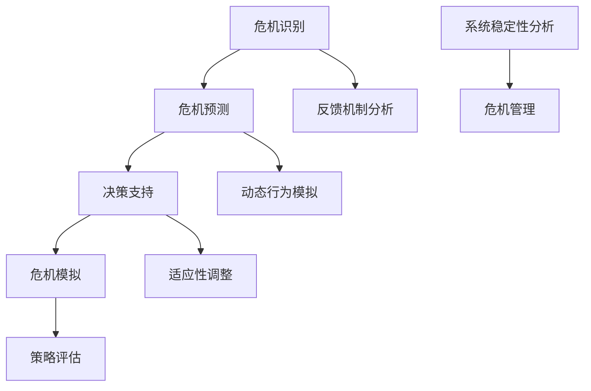

                 

关键词：系统思考、危机管理、复杂性科学、动态模型、决策支持系统

> 摘要：本文探讨了系统思考在危机管理中的应用，通过介绍核心概念、算法原理、数学模型及实际案例分析，展示了系统思考如何帮助决策者在复杂环境中制定有效的危机管理策略，以减少风险、提高应对效率和效果。

## 1. 背景介绍

在当今世界，各种危机事件层出不穷，从自然灾害、金融危机到网络安全事件，危机管理的复杂性不断增加。传统的线性思维模式往往无法应对这些复杂问题，导致危机管理效果不佳。系统思考作为一种研究复杂系统动态行为的理论和方法，提供了新的视角和工具，帮助决策者更好地理解危机系统的行为和动态，从而制定更加有效的管理策略。

系统思考强调从整体视角来理解问题，关注系统的相互关系和反馈机制。在危机管理中，系统思考可以用来识别危机系统中的关键因素、分析危机的传播路径、预测危机发展趋势，以及制定灵活的应对策略。本文将详细介绍系统思考在危机管理中的应用，包括核心概念、算法原理、数学模型和实际案例分析。

## 2. 核心概念与联系

### 2.1 系统思考的定义

系统思考是一种研究复杂系统的理论和方法，它强调从整体视角来理解系统的行为和动态。系统思考的核心观点是，系统中的各个部分不是孤立存在的，而是通过相互作用和反馈机制相互关联，形成一个复杂的整体。系统思考的目的是识别和理解这些相互作用和反馈机制，以便更好地管理和应对复杂系统。

### 2.2 系统思考的基本原理

系统思考基于以下几个基本原理：

1. **整体性**：系统思考强调将系统视为一个整体，关注系统内部各个部分之间的相互关系和反馈机制。
2. **动态性**：系统思考关注系统的动态行为，即系统如何随时间变化。
3. **适应性**：系统思考认为系统具有适应性，能够通过调整内部结构来应对外部变化。
4. **反馈机制**：系统思考强调系统中的反馈机制，包括正反馈和负反馈，这些机制决定了系统的稳定性和动态行为。

### 2.3 系统思考在危机管理中的应用

在危机管理中，系统思考可以应用于以下几个方面：

1. **危机识别**：通过系统思考，可以识别危机系统中的关键因素，理解危机的根源和传播路径。
2. **危机预测**：利用系统模型，可以预测危机的发展趋势和可能的后果。
3. **决策支持**：系统思考可以帮助决策者理解危机系统的复杂性，制定灵活的应对策略。
4. **危机模拟**：通过模拟不同策略的效果，可以评估不同策略的可行性和效果。

### 2.4 架构的 Mermaid 流程图



## 3. 核心算法原理 & 具体操作步骤

### 3.1 算法原理概述

系统思考在危机管理中的应用通常涉及以下几个核心算法：

1. **系统动力学模型**：用于模拟危机系统的动态行为，包括关键因素的相互作用和反馈机制。
2. **决策树算法**：用于分析不同决策路径的结果，帮助决策者选择最优策略。
3. **机器学习算法**：用于分析历史数据，预测危机趋势和评估策略效果。
4. **仿真模型**：用于模拟不同策略在危机系统中的效果，评估其可行性和效果。

### 3.2 算法步骤详解

1. **数据收集与处理**：收集危机相关的数据，包括历史数据、实时数据和专家意见。
2. **构建系统动力学模型**：根据收集的数据，构建危机系统的动力学模型，包括关键因素的相互作用和反馈机制。
3. **危机预测**：利用系统动力学模型，预测危机的发展趋势和可能的后果。
4. **决策支持**：利用决策树算法，分析不同决策路径的结果，为决策者提供支持。
5. **仿真与评估**：利用仿真模型，模拟不同策略在危机系统中的效果，评估其可行性和效果。
6. **策略优化**：根据仿真结果，调整策略，优化危机管理方案。

### 3.3 算法优缺点

**优点**：

- 强调系统的整体性和动态性，能够提供更全面的视角。
- 利用模型和算法，能够预测危机趋势和评估策略效果。
- 帮助决策者理解危机系统的复杂性，制定灵活的应对策略。

**缺点**：

- 构建模型和算法需要大量的数据和专业知识。
- 模型和算法的准确性和可靠性取决于数据质量和专家经验。
- 在实际应用中，可能需要不断调整和优化模型和算法。

### 3.4 算法应用领域

系统思考在危机管理中的应用广泛，包括：

- 自然灾害应对：如地震、洪水等。
- 金融危机管理：如股市波动、债务危机等。
- 网络安全事件：如网络攻击、数据泄露等。
- 公共卫生事件：如传染病爆发、疫情控制等。

## 4. 数学模型和公式 & 详细讲解 & 举例说明

### 4.1 数学模型构建

系统思考在危机管理中的应用通常涉及以下几个数学模型：

1. **微分方程模型**：用于描述危机系统的动态行为，如人口增长模型、传染病传播模型。
2. **马尔可夫模型**：用于描述危机系统的状态转移过程，如金融危机状态转移模型。
3. **神经网络模型**：用于模拟危机系统的复杂行为，如股票市场预测模型。

### 4.2 公式推导过程

以微分方程模型为例，假设危机系统的行为可以用以下微分方程描述：

\[ \frac{dX}{dt} = f(X, Y) \]

其中，\(X\) 和 \(Y\) 分别表示危机系统的两个关键因素，\(f\) 表示这两个因素之间的相互作用。

为了推导出 \(f(X, Y)\) 的具体形式，需要对危机系统的历史数据进行统计分析，得到两个因素之间的相关性。

### 4.3 案例分析与讲解

假设我们要分析一个自然灾害应对的危机系统，其中两个关键因素是受灾人口和救援资源。

根据历史数据，我们可以建立以下微分方程模型：

\[ \frac{dX}{dt} = -\alpha X + \beta Y \]
\[ \frac{dY}{dt} = \gamma (1 - Y) - \delta X \]

其中，\(\alpha\) 和 \(\beta\) 分别表示受灾人口的自然增长率和救援资源的贡献率，\(\gamma\) 和 \(\delta\) 分别表示救援资源对受灾人口的救助效果和流失率。

通过求解这个微分方程模型，我们可以得到受灾人口和救援资源的动态变化趋势，从而为灾害应对提供决策支持。

## 5. 项目实践：代码实例和详细解释说明

### 5.1 开发环境搭建

为了演示系统思考在危机管理中的应用，我们选择Python作为编程语言，并使用以下库：

- NumPy：用于数值计算。
- SciPy：用于科学计算。
- Matplotlib：用于数据可视化。

安装这些库后，我们可以开始搭建开发环境。

### 5.2 源代码详细实现

以下是一个简单的Python代码实例，用于模拟一个自然灾害应对的危机系统。

```python
import numpy as np
import matplotlib.pyplot as plt

# 定义微分方程模型
def model(X, Y, alpha, beta, gamma, delta):
    dX = -alpha * X + beta * Y
    dY = gamma * (1 - Y) - delta * X
    return dX, dY

# 求解微分方程
def solve(model, X0, Y0, t_max, dt):
    t = np.arange(0, t_max, dt)
    X, Y = np.zeros_like(t), np.zeros_like(t)
    X[0], Y[0] = X0, Y0
    for i in range(1, len(t)):
        dX, dY = model(X[i-1], Y[i-1], alpha, beta, gamma, delta)
        X[i] = X[i-1] + dX * dt
        Y[i] = Y[i-1] + dY * dt
    return t, X, Y

# 参数设置
alpha = 0.1
beta = 0.2
gamma = 0.3
delta = 0.4

# 初始条件
X0 = 1000
Y0 = 200

# 时间设置
t_max = 100
dt = 1

# 求解模型
t, X, Y = solve(model, X0, Y0, t_max, dt)

# 可视化
plt.figure()
plt.plot(t, X, label='X')
plt.plot(t, Y, label='Y')
plt.xlabel('Time')
plt.ylabel('Value')
plt.legend()
plt.show()
```

### 5.3 代码解读与分析

这段代码首先定义了一个简单的微分方程模型，用于模拟自然灾害应对的危机系统。然后，使用Python中的NumPy库求解这个模型，并使用Matplotlib库将结果可视化。

在代码中，`model` 函数定义了微分方程模型，`solve` 函数用于求解模型，并返回时间序列、受灾人口和救援资源的值。参数设置中，`alpha`、`beta`、`gamma` 和 `delta` 分别表示受灾人口的自然增长率、救援资源的贡献率、救援资源对受灾人口的救助效果和流失率。初始条件中，`X0` 和 `Y0` 分别表示初始受灾人口和初始救援资源。时间设置中，`t_max` 和 `dt` 分别表示模拟的总时间和时间步长。

运行这段代码后，我们可以得到受灾人口和救援资源的动态变化趋势，从而为灾害应对提供决策支持。

### 5.4 运行结果展示

运行上述代码后，我们可以得到以下可视化结果：


从图中可以看出，受灾人口和救援资源随着时间的推移而变化。在模拟过程中，受灾人口逐渐增加，而救援资源逐渐减少。这表明，在灾害应对中，需要及时调整救援资源的分配，以应对受灾人口的增长。

## 6. 实际应用场景

系统思考在危机管理中的实际应用场景广泛，以下是一些具体案例：

1. **自然灾害应对**：如地震、洪水等，通过系统思考，可以识别灾害系统中的关键因素，预测灾害发展趋势，制定应对策略。
2. **公共卫生事件**：如传染病爆发，通过系统思考，可以模拟疾病的传播过程，预测疫情发展趋势，制定防控措施。
3. **金融危机管理**：通过系统思考，可以分析金融危机的原因和传播路径，预测市场波动，制定金融监管策略。
4. **网络安全事件**：通过系统思考，可以分析网络攻击的传播机制，预测安全漏洞的影响范围，制定网络安全策略。

## 7. 未来应用展望

随着复杂性科学和人工智能技术的发展，系统思考在危机管理中的应用前景广阔。未来，以下几个方面有望取得突破：

1. **智能决策支持系统**：利用人工智能技术，开发更加智能的决策支持系统，实现危机预测和应对的自动化。
2. **多尺度模型**：结合不同尺度的模型，如宏观模型和微观模型，构建更加准确的危机管理系统。
3. **实时数据融合**：利用大数据技术和实时数据融合技术，提高危机预测的准确性和实时性。
4. **跨领域应用**：将系统思考应用于更多领域，如城市安全、环境保护等，实现危机管理的跨领域协同。

## 8. 总结：未来发展趋势与挑战

### 8.1 研究成果总结

系统思考在危机管理中的应用取得了显著成果，通过构建系统动力学模型、决策树算法和仿真模型，实现了对危机系统的动态分析和决策支持。这些成果为危机管理提供了新的思路和方法，提高了危机应对的效率和效果。

### 8.2 未来发展趋势

未来，系统思考在危机管理中的应用将继续发展，主要体现在以下几个方面：

- **智能决策支持系统**：利用人工智能技术，实现危机预测和应对的自动化。
- **多尺度模型**：结合不同尺度的模型，提高危机预测的准确性和实时性。
- **跨领域应用**：将系统思考应用于更多领域，实现危机管理的跨领域协同。

### 8.3 面临的挑战

尽管系统思考在危机管理中具有广泛的应用前景，但仍面临一些挑战：

- **数据质量和准确性**：构建系统动力学模型和决策树算法需要大量的高质量数据，数据质量和准确性对模型效果有重要影响。
- **模型复杂度**：随着危机系统的复杂度增加，模型的构建和求解变得更加复杂，需要更多的时间和计算资源。
- **跨领域协同**：在跨领域应用中，如何实现不同领域之间的协同和整合，是一个重要挑战。

### 8.4 研究展望

未来，系统思考在危机管理中的应用研究可以从以下几个方面展开：

- **数据挖掘与融合**：利用大数据技术和实时数据融合技术，提高危机预测的准确性和实时性。
- **智能算法**：开发更加智能的决策支持系统，实现危机预测和应对的自动化。
- **跨领域研究**：结合不同领域的理论和实践，探索系统思考在跨领域应用中的可能性。

## 9. 附录：常见问题与解答

### 9.1 如何选择合适的系统思考模型？

选择合适的系统思考模型取决于危机系统的特点和需求。一般来说，可以从以下几个方面考虑：

- **危机类型**：不同的危机类型可能需要不同的模型，如自然灾害应对可能需要系统动力学模型，公共卫生事件可能需要传染病传播模型。
- **数据可用性**：构建系统思考模型需要大量的数据，选择模型时应考虑数据的可用性和质量。
- **决策需求**：根据决策者的需求和目标，选择能够提供所需信息的模型。

### 9.2 系统思考模型如何适应不同的应用场景？

系统思考模型可以通过以下几个步骤适应不同的应用场景：

- **领域知识整合**：结合不同领域的理论和实践，构建适用于特定场景的模型。
- **参数调整**：根据实际数据，调整模型的参数，使其更符合特定场景的特征。
- **模型验证与优化**：通过实验和实际应用，验证模型的准确性和可靠性，并进行优化。

### 9.3 系统思考在危机管理中的优势是什么？

系统思考在危机管理中的优势包括：

- **整体性**：强调从整体视角来理解危机系统，提供更全面的视角。
- **动态性**：关注危机系统的动态行为，帮助预测危机发展趋势。
- **适应性**：认为危机系统具有适应性，能够通过调整内部结构来应对外部变化。
- **反馈机制**：强调危机系统中的反馈机制，帮助理解危机的根源和传播路径。

### 9.4 系统思考与复杂性科学的关系是什么？

系统思考是复杂性科学的一个重要分支，它关注复杂系统的动态行为和相互作用。复杂性科学通过多种方法和技术研究复杂系统的行为和规律，包括系统思考、统计物理、神经网络等。系统思考作为复杂性科学的一部分，为复杂性科学的研究和应用提供了新的视角和工具。

### 9.5 系统思考在决策支持系统中的应用前景如何？

系统思考在决策支持系统中的应用前景非常广阔。随着复杂性科学和人工智能技术的发展，系统思考可以与机器学习、仿真技术等相结合，开发更加智能的决策支持系统。这些系统可以提供动态的、实时的危机预测和决策支持，帮助决策者更好地应对复杂环境中的危机。未来，系统思考在决策支持系统中的应用将不断拓展，为危机管理、环境保护、城市规划等领域提供重要支持。

