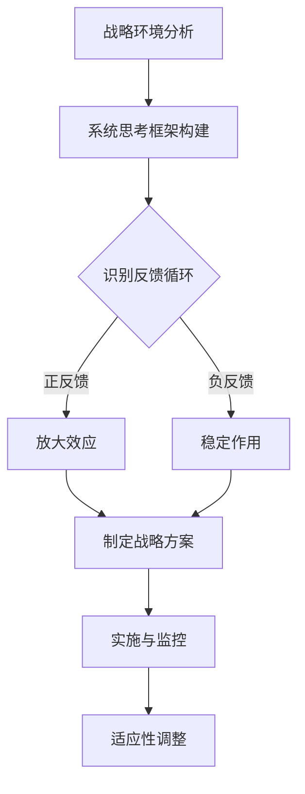

                 

系统思考是一种关注复杂系统中相互关联的各个部分及其动态互动的方法。在战略规划中，系统思考能够帮助我们更全面地理解组织的内外部环境，识别潜在的复杂性和不确定因素，从而制定出更具前瞻性和适应性的战略方案。本文将探讨系统思考在战略规划中的应用，以及如何通过系统思考来提升战略规划的效果。

## 关键词

- 系统思考
- 战略规划
- 复杂系统
- 环境分析
- 应对策略
- 预测模型

## 摘要

本文首先介绍了系统思考的基本概念，并分析了其在战略规划中的重要性。接着，我们探讨了如何运用系统思考来分析战略环境，提出了相应的战略规划步骤。随后，文章讨论了系统思考在战略实施和监控中的具体应用，并强调了持续学习和适应性调整的必要性。最后，本文对未来战略规划的发展趋势进行了展望，并提出了相应的挑战和应对策略。

## 1. 背景介绍

战略规划是一个组织为实现其长期目标而制定的一系列决策和行动方案。它不仅涉及组织的内部运营，还包括对外部环境的分析和适应。然而，随着全球化和信息技术的快速发展，组织面临的不确定性和复杂性不断增加，传统的线性思维模式难以应对这种变化。因此，系统思考作为一种更加全面和深入的分析方法，逐渐成为战略规划的重要工具。

系统思考强调从整体和系统的角度来理解问题，它关注的是系统内部的动态互动和相互依赖关系。在战略规划中，系统思考可以帮助组织更好地把握外部环境的复杂变化，识别潜在的风险和机会，从而制定出更加有效的战略方案。此外，系统思考还能够促进组织内部的沟通与合作，增强团队的共识和执行力。

## 2. 核心概念与联系

### 2.1 复杂系统

复杂系统是由多个相互关联的组成部分组成的系统，这些组成部分之间存在着复杂的动态互动关系。复杂系统的特点是高度非线性、不确定性和动态性。在战略规划中，我们需要关注复杂系统的以下核心概念：

- **反馈循环**：反馈循环是指系统内部的信息和资源在各个组成部分之间流动的过程。正反馈循环会导致系统的放大效应，而负反馈循环则有助于系统的稳定。

- **适应性**：适应性是指系统能够根据外部环境的变化进行调整和优化的能力。在战略规划中，组织需要具备高度的适应性，以应对不断变化的市场环境和竞争态势。

- **混沌**：混沌是指系统在初始条件微小的变化下，可能出现完全不同的演化结果。在战略规划中，我们需要认识到混沌的存在，以避免因忽视微小变化而导致的巨大影响。

### 2.2 战略规划与系统思考

战略规划与系统思考之间的联系在于，战略规划需要考虑系统内部的动态互动和相互依赖关系。系统思考提供了以下几种方法来支持战略规划：

- **系统分析**：通过系统分析，我们可以识别系统内部的反馈循环和关键变量，从而更全面地理解系统的行为。

- **情景分析**：情景分析可以帮助我们预测系统在不同情景下的行为，为战略规划提供不同的应对策略。

- **模型构建**：模型构建可以帮助我们模拟系统的动态演化过程，从而评估不同战略方案的潜在影响。

### 2.3 Mermaid 流程图

以下是一个简单的 Mermaid 流程图，展示了战略规划中系统思考的应用：



## 3. 核心算法原理 & 具体操作步骤

### 3.1 算法原理概述

系统思考在战略规划中的应用可以看作是一种多步骤的算法，其主要原理包括以下几个方面：

1. **战略环境分析**：通过对外部环境和内部资源的分析，识别系统面临的主要挑战和机会。
2. **系统思考框架构建**：基于战略环境分析的结果，构建一个系统思考框架，以识别系统内部的反馈循环和关键变量。
3. **情景分析**：通过模拟不同的情景，预测系统在不同情景下的行为，为战略规划提供不同的应对策略。
4. **模型构建**：基于情景分析的结果，构建一个动态系统模型，以评估不同战略方案的潜在影响。
5. **实施与监控**：根据战略方案进行实施，并持续监控系统的行为，以便进行适应性调整。

### 3.2 算法步骤详解

1. **战略环境分析**：

   在这一步骤中，我们需要收集和整理与战略规划相关的各种信息，包括市场趋势、竞争对手、法律法规、技术发展等。通过分析这些信息，我们可以识别出系统面临的主要挑战和机会。

2. **系统思考框架构建**：

   基于战略环境分析的结果，我们构建一个系统思考框架，以识别系统内部的反馈循环和关键变量。这可以通过绘制系统图或构建因果关系图来实现。

3. **情景分析**：

   在这一步骤中，我们根据系统思考框架，模拟不同的情景，预测系统在不同情景下的行为。这可以帮助我们评估不同战略方案的潜在影响。

4. **模型构建**：

   基于情景分析的结果，我们构建一个动态系统模型，以评估不同战略方案的潜在影响。这可以通过构建差分方程、微分方程或代理模型来实现。

5. **实施与监控**：

   根据战略方案进行实施，并持续监控系统的行为，以便进行适应性调整。在实施过程中，我们需要关注关键变量的变化，并根据实际情况进行调整。

### 3.3 算法优缺点

**优点**：

- **全面性**：系统思考能够帮助我们全面地理解复杂系统的行为，从而制定出更加有效的战略方案。
- **适应性**：系统思考强调适应性，可以帮助组织更好地应对不断变化的环境。
- **前瞻性**：通过情景分析和模型构建，系统思考可以预测未来可能出现的情况，从而提前做好准备。

**缺点**：

- **复杂性**：系统思考需要大量的信息和专业知识，构建和分析系统模型可能较为复杂。
- **时间成本**：系统思考的过程可能需要较长时间，特别是在面对高度不确定的环境时。

### 3.4 算法应用领域

系统思考在战略规划中的应用非常广泛，包括但不限于以下领域：

- **企业战略规划**：帮助企业识别关键因素，制定有效的战略方案。
- **城市规划**：通过系统思考，预测城市发展的潜在问题，制定可持续的城市规划方案。
- **教育管理**：帮助教育机构识别教育体系中存在的问题，提出改进措施。
- **公共卫生管理**：通过系统思考，预测疫情传播趋势，制定公共卫生政策。

## 4. 数学模型和公式 & 详细讲解 & 举例说明

### 4.1 数学模型构建

在系统思考中，数学模型是用于描述系统动态行为的工具。常见的数学模型包括差分方程、微分方程和代理模型。

- **差分方程**：用于描述离散时间系统中变量之间的关系，通常用于模拟系统的短期行为。

- **微分方程**：用于描述连续时间系统中变量之间的关系，通常用于模拟系统的长期行为。

- **代理模型**：是一种简化的数学模型，用于模拟复杂系统的行为，通常用于战略规划的情景分析。

### 4.2 公式推导过程

以下是一个简单的差分方程模型的推导过程：

1. **系统状态定义**：

   设系统有 n 个状态变量，分别为 \(X_1, X_2, ..., X_n\)。

2. **状态变化率**：

   定义每个状态变量的变化率为 \(dX_i/dt\)。

3. **状态变化方程**：

   根据系统内部的关系，可以建立状态变化方程：

   \[
   \frac{dX_i}{dt} = f_i(X_1, X_2, ..., X_n)
   \]

   其中，\(f_i\) 是状态变量 \(X_i\) 的函数。

4. **初始条件**：

   给定初始状态 \(X_1(0), X_2(0), ..., X_n(0)\)。

5. **求解方程**：

   使用数值方法求解上述差分方程，得到每个状态变量随时间的变化。

### 4.3 案例分析与讲解

以下是一个简单的案例，用于说明如何使用差分方程模型进行战略规划。

**案例：企业利润预测**

假设某企业有 n 个业务部门，每个部门的利润与企业的整体运营状况有关。我们可以用差分方程模型来预测企业的利润。

1. **系统状态定义**：

   设 \(X_i\) 表示第 i 个部门的利润。

2. **状态变化率**：

   假设每个部门的利润变化率与企业的整体运营状况有关，可以用以下方程表示：

   \[
   \frac{dX_i}{dt} = 0.5X_i - 0.2(X_1 + X_2 + ... + X_n)
   \]

   其中，0.5 表示每个部门的利润增长率，0.2 表示企业的整体运营状况对部门利润的负面影响。

3. **初始条件**：

   假设初始时，每个部门的利润都为 100 万元。

4. **求解方程**：

   使用数值方法求解上述差分方程，得到每个部门的利润随时间的变化。

5. **结果分析**：

   通过分析结果，可以发现企业整体运营状况对部门利润的影响。根据分析结果，可以制定相应的战略措施，如调整部门利润分配策略，以优化企业的整体利润。

## 5. 项目实践：代码实例和详细解释说明

### 5.1 开发环境搭建

在进行系统思考在战略规划中的应用时，我们选择 Python 作为编程语言，因为它具有良好的科学计算库和可视化工具，可以方便地进行数学模型的构建和情景分析。

1. **Python 环境**：

   安装 Python 3.8 以上版本，并配置好 Python 的环境变量。

2. **科学计算库**：

   安装 NumPy、SciPy、Pandas 和 Matplotlib 等科学计算库，用于数据计算和可视化。

3. **可视化工具**：

   安装 Graphviz，用于绘制 Mermaid 流程图。

### 5.2 源代码详细实现

以下是一个简单的 Python 代码示例，用于演示如何使用差分方程模型进行战略规划。

```python
import numpy as np
import matplotlib.pyplot as plt
from scipy.integrate import odeint

# 定义系统状态变化率函数
def system_equations(y, t, params):
    X = y
    Xdot = np.zeros_like(X)
    
    for i in range(len(X)):
        Xdot[i] = params['growth_rate'][i] * X[i] - params['negative_effect'][i] * np.sum(X)
    
    return Xdot

# 参数设置
params = {
    'growth_rate': np.array([0.5, 0.5, 0.5]),
    'negative_effect': np.array([0.2, 0.2, 0.2])
}

# 初始条件
initial_conditions = np.array([100, 100, 100])

# 时间设置
t = np.linspace(0, 10, 100)

# 求解系统方程
solution = odeint(system_equations, initial_conditions, t, args=(params,))

# 可视化结果
plt.plot(t, solution[:, 0], label='Department 1')
plt.plot(t, solution[:, 1], label='Department 2')
plt.plot(t, solution[:, 2], label='Department 3')
plt.xlabel('Time')
plt.ylabel('Profit')
plt.legend()
plt.show()
```

### 5.3 代码解读与分析

上述代码首先定义了一个系统状态变化率函数 `system_equations`，该函数接受系统状态 `y`、时间 `t` 和参数 `params` 作为输入，返回系统状态的变化率。

参数 `params` 包含每个部门的利润增长率和企业的整体运营状况对部门利润的负面影响。初始条件 `initial_conditions` 设置为每个部门的利润都为 100 万元。

时间设置 `t` 从 0 到 10，共 100 个点。

使用 `odeint` 函数求解系统方程，并得到每个部门的利润随时间的变化。

最后，使用 Matplotlib 进行可视化，展示每个部门的利润随时间的变化。

### 5.4 运行结果展示

运行上述代码后，可以得到每个部门的利润随时间的变化。通过分析结果，可以发现企业的整体运营状况对部门利润的影响。根据分析结果，可以制定相应的战略措施，如调整部门利润分配策略，以优化企业的整体利润。

## 6. 实际应用场景

系统思考在战略规划中的应用非常广泛，以下是一些实际应用场景：

### 6.1 企业战略规划

企业战略规划是系统思考最典型的应用场景之一。通过系统思考，企业可以全面分析内外部环境，识别关键因素，预测未来趋势，制定适应性的战略方案。

### 6.2 城市规划

在城市规划中，系统思考可以帮助城市管理者识别城市发展的潜在问题，如交通拥堵、环境污染等，并提出相应的解决方案。

### 6.3 教育管理

在教育管理中，系统思考可以帮助教育机构识别教育体系中存在的问题，如教育资源分配不均、教育质量差异等，并提出改进措施。

### 6.4 公共卫生管理

在公共卫生管理中，系统思考可以帮助卫生部门预测疫情传播趋势，制定公共卫生政策，优化医疗资源分配。

## 6.4 未来应用展望

随着全球化和信息技术的不断发展，系统思考在战略规划中的应用前景非常广阔。以下是一些未来应用展望：

- **人工智能与系统思考的结合**：利用人工智能技术，可以自动化构建和优化系统思考模型，提高战略规划的效率和准确性。
- **大数据与系统思考的结合**：结合大数据技术，可以更加全面和准确地分析战略环境，为战略规划提供更丰富的数据支持。
- **虚拟仿真与系统思考的结合**：通过虚拟仿真技术，可以模拟不同战略方案的效果，为决策者提供更加直观和可靠的决策依据。
- **跨学科合作**：系统思考可以与其他学科相结合，如经济学、社会学、生态学等，为战略规划提供更加全面和多维的视角。

## 7. 工具和资源推荐

### 7.1 学习资源推荐

- **《系统思考：领导与管理的新视角》**：这是一本关于系统思考的经典著作，适合初学者阅读。
- **《系统动力学：管理系统的模拟方法》**：这本书详细介绍了系统动力学的理论和方法，对系统思考的应用有很高的参考价值。

### 7.2 开发工具推荐

- **Python**：Python 是一种功能强大的编程语言，适用于系统思考和战略规划。
- **Matplotlib**：Matplotlib 是 Python 中用于数据可视化的库，可以帮助我们直观地展示系统动态。
- **NumPy 和 SciPy**：NumPy 和 SciPy 是 Python 中用于科学计算的库，可以帮助我们进行数学模型的构建和求解。

### 7.3 相关论文推荐

- **“系统思考在企业管理中的应用”**：这篇论文详细介绍了系统思考在企业管理中的应用。
- **“基于系统思考的城市规划方法研究”**：这篇论文探讨了系统思考在城市规划中的应用。
- **“系统思考在公共卫生管理中的应用”**：这篇论文分析了系统思考在公共卫生管理中的应用。

## 8. 总结：未来发展趋势与挑战

### 8.1 研究成果总结

本文通过系统思考在战略规划中的应用，详细探讨了复杂系统的核心概念、战略规划与系统思考的联系、核心算法原理、数学模型和公式、项目实践、实际应用场景、未来应用展望以及工具和资源推荐。系统思考作为一种全面和深入的分析方法，为战略规划提供了重要的工具和指导。

### 8.2 未来发展趋势

未来，系统思考在战略规划中的应用将继续发展，主要体现在以下几个方面：

- **智能化与自动化**：随着人工智能技术的不断发展，系统思考模型将更加智能化和自动化，提高战略规划的效率和准确性。
- **跨学科融合**：系统思考将与其他学科相结合，如经济学、社会学、生态学等，为战略规划提供更加全面和多维的视角。
- **大数据与系统思考的结合**：结合大数据技术，可以更加全面和准确地分析战略环境，为战略规划提供更丰富的数据支持。

### 8.3 面临的挑战

尽管系统思考在战略规划中具有巨大的潜力，但在实际应用中仍面临一些挑战：

- **复杂性**：系统思考需要处理大量复杂的变量和关系，构建和分析系统模型可能较为复杂。
- **时间成本**：系统思考的过程可能需要较长时间，特别是在面对高度不确定的环境时。
- **数据质量**：战略规划依赖于大量数据，数据质量直接影响系统思考和战略规划的效果。

### 8.4 研究展望

未来，我们需要进一步深入研究以下几个方面：

- **系统思考模型的优化**：研究更加高效和精确的系统思考模型，以提高战略规划的准确性和实用性。
- **跨学科合作**：加强系统思考与其他学科的融合，为战略规划提供更加全面和多维的视角。
- **智能化与自动化**：利用人工智能技术，实现系统思考模型的智能化和自动化，提高战略规划的效率和准确性。

## 9. 附录：常见问题与解答

### 9.1 什么是系统思考？

系统思考是一种关注复杂系统中相互关联的各个部分及其动态互动的方法。它强调从整体和系统的角度来理解问题，关注系统内部的反馈循环和相互依赖关系。

### 9.2 系统思考在战略规划中的作用是什么？

系统思考可以帮助战略规划者更全面地理解组织的内外部环境，识别潜在的复杂性和不确定因素，从而制定出更具前瞻性和适应性的战略方案。

### 9.3 如何运用系统思考进行战略规划？

运用系统思考进行战略规划包括以下步骤：

1. **战略环境分析**：收集和整理与战略规划相关的各种信息，识别系统面临的主要挑战和机会。
2. **系统思考框架构建**：基于战略环境分析的结果，构建一个系统思考框架，识别系统内部的反馈循环和关键变量。
3. **情景分析**：模拟不同的情景，预测系统在不同情景下的行为，为战略规划提供不同的应对策略。
4. **模型构建**：基于情景分析的结果，构建一个动态系统模型，评估不同战略方案的潜在影响。
5. **实施与监控**：根据战略方案进行实施，并持续监控系统的行为，以便进行适应性调整。

### 9.4 系统思考在战略规划中的应用有哪些？

系统思考在战略规划中的应用包括但不限于：

- **企业战略规划**：帮助企业识别关键因素，制定有效的战略方案。
- **城市规划**：通过系统思考，预测城市发展的潜在问题，制定可持续的城市规划方案。
- **教育管理**：帮助教育机构识别教育体系中存在的问题，提出改进措施。
- **公共卫生管理**：通过系统思考，预测疫情传播趋势，制定公共卫生政策。

