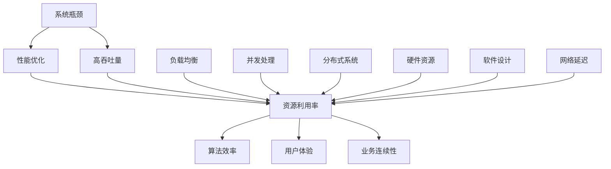

                 

关键词：系统瓶颈、性能优化、高吞吐量、资源利用率、算法效率、负载均衡、并发处理、分布式系统

> 摘要：本文旨在深入探讨系统瓶颈的识别与解决方法，以及如何通过高吞吐量优化提升系统的整体性能。我们将结合实际案例，详细分析系统瓶颈的原因，并探讨多种优化策略，以期帮助读者在实际工作中提高系统效率。

## 1. 背景介绍

在现代信息技术快速发展的背景下，系统性能优化已成为企业数字化转型的核心议题。高吞吐量、低延迟和强稳定性是衡量系统性能的重要指标。然而，在实际运行中，系统常常面临各种瓶颈，导致资源浪费、响应时间延长和用户体验下降。本文将重点探讨系统瓶颈的原因、分析方法以及高吞吐量优化策略。

### 1.1 系统瓶颈的概念

系统瓶颈指的是系统中某个环节的性能限制了整体系统的能力。瓶颈现象通常表现为响应时间过长、资源利用率低下、吞吐量不足等。系统瓶颈可能是由于硬件资源不足、软件设计不合理、算法效率低下或者网络延迟等原因造成的。

### 1.2 系统瓶颈的影响

系统瓶颈不仅影响用户体验，还可能导致业务损失。以下是系统瓶颈可能带来的几个负面影响：

- **响应时间延长**：用户操作响应迟缓，影响用户满意度。
- **资源浪费**：系统无法充分利用现有资源，导致投资回报率下降。
- **业务中断**：严重瓶颈可能导致系统崩溃，影响关键业务的正常运行。

### 1.3 系统性能优化的必要性

随着业务规模的扩大和数据量的增长，系统性能优化显得尤为重要。通过系统瓶颈分析与高吞吐量优化，可以有效提升系统整体性能，提高业务竞争力。

## 2. 核心概念与联系

在深入探讨系统瓶颈之前，我们需要了解一些核心概念，并探讨它们之间的联系。以下是一个用于解释系统瓶颈、性能优化和高吞吐量之间关系的 Mermaid 流程图：



### 2.1 系统瓶颈

系统瓶颈是系统性能优化的起点。通过监控和分析系统运行状态，我们可以识别出导致瓶颈的具体环节，如图数据库查询慢、网络带宽不足等。

### 2.2 性能优化

性能优化旨在提升系统整体性能。它包括多个方面，如提高资源利用率、优化算法效率、实现负载均衡和并发处理等。

### 2.3 高吞吐量

高吞吐量是系统性能优化的重要目标之一。通过优化系统架构和算法，我们可以提高系统处理请求的能力，从而实现更高的吞吐量。

### 2.4 资源利用率、算法效率、负载均衡、并发处理和分布式系统

这些概念是性能优化的重要组成部分。资源利用率涉及到硬件和软件资源的合理分配；算法效率影响系统处理速度；负载均衡和并发处理则能提升系统并行处理能力；分布式系统通过分散负载和资源，实现更高的系统容错性和可扩展性。

## 3. 核心算法原理 & 具体操作步骤

### 3.1 算法原理概述

系统瓶颈分析的核心算法通常包括以下几个步骤：

1. **性能监控**：通过监控工具收集系统运行数据，如CPU利用率、内存占用、磁盘I/O、网络流量等。
2. **瓶颈定位**：分析监控数据，找出导致系统瓶颈的具体环节。
3. **优化策略制定**：根据瓶颈原因，制定相应的优化策略，如调整硬件配置、优化算法、实现负载均衡等。
4. **性能评估**：实施优化后，对系统性能进行重新评估，验证优化效果。

### 3.2 算法步骤详解

#### 3.2.1 性能监控

性能监控是瓶颈分析的第一步。常用的性能监控工具有：Prometheus、Grafana、New Relic 等。以下是一个简单的性能监控步骤：

1. **选择监控工具**：根据系统需求和特点，选择合适的监控工具。
2. **部署监控代理**：在系统各节点部署监控代理，收集系统运行数据。
3. **配置监控指标**：定义需要监控的指标，如CPU利用率、内存占用、磁盘I/O、网络流量等。
4. **数据存储与可视化**：将监控数据存储在时序数据库中，并使用可视化工具展示监控结果。

#### 3.2.2 瓶颈定位

瓶颈定位是分析系统性能问题的关键步骤。以下是一个简单的瓶颈定位步骤：

1. **分析监控数据**：根据监控数据，分析系统运行状态，找出可能导致瓶颈的环节。
2. **确定瓶颈原因**：通过对比不同监控指标，确定瓶颈的具体原因，如图数据库查询慢、网络带宽不足等。
3. **生成瓶颈报告**：将分析结果整理成报告，为后续优化提供依据。

#### 3.2.3 优化策略制定

根据瓶颈定位结果，制定相应的优化策略。以下是一些常见的优化策略：

1. **硬件优化**：增加CPU、内存、磁盘等硬件资源，提高系统处理能力。
2. **软件优化**：优化数据库查询、算法实现、代码结构等，提高系统运行效率。
3. **负载均衡**：通过负载均衡器将请求分布到多台服务器，降低单点瓶颈。
4. **并发处理**：优化并发处理机制，提高系统并行处理能力。
5. **分布式系统**：采用分布式架构，将系统拆分成多个节点，提高系统容错性和可扩展性。

#### 3.2.4 性能评估

优化完成后，需要对系统性能进行重新评估，验证优化效果。以下是一个简单的性能评估步骤：

1. **重新部署监控**：在优化后的系统上重新部署监控工具，收集性能数据。
2. **对比优化前后的数据**：对比优化前后的监控数据，分析系统性能的提升情况。
3. **生成性能评估报告**：将评估结果整理成报告，为后续优化提供参考。

### 3.3 算法优缺点

**优点**：

1. **全面性**：算法覆盖了系统性能优化的多个方面，包括硬件、软件、负载均衡、并发处理等。
2. **可操作性**：算法步骤清晰，易于在实际工作中应用。
3. **可扩展性**：算法适用于不同规模和类型的系统，具有良好的可扩展性。

**缺点**：

1. **复杂性**：算法涉及多个方面，需要具备一定的专业知识和经验。
2. **实施难度**：优化策略的实施可能涉及大量的开发和测试工作。

### 3.4 算法应用领域

系统瓶颈分析与高吞吐量优化算法广泛应用于以下领域：

1. **云计算平台**：优化云服务器资源分配，提高云服务性能。
2. **电商平台**：优化订单处理、库存管理等业务流程，提高业务响应速度。
3. **社交媒体平台**：优化用户请求处理，提高用户体验。
4. **金融系统**：优化交易处理，确保交易安全和高可用性。
5. **物联网平台**：优化设备接入和处理能力，提高物联网平台性能。

## 4. 数学模型和公式 & 详细讲解 & 举例说明

### 4.1 数学模型构建

在系统瓶颈分析中，常用的数学模型包括资源利用率模型、算法效率模型和吞吐量模型。以下是一个简单的资源利用率模型：

$$
U(t) = \frac{C(t)}{R(t)}
$$

其中，$U(t)$表示在时间$t$的资源利用率，$C(t)$表示在时间$t$系统消耗的资源，$R(t)$表示在时间$t$系统可用的总资源。

### 4.2 公式推导过程

为了推导上述资源利用率模型，我们首先需要定义系统资源消耗和资源可用性。假设系统在时间$t_1$到时间$t_2$内的资源消耗为$C(t)$，资源可用性为$R(t)$。则：

$$
C(t) = C(t_1) + \sum_{t_1 < t' \le t} (R(t') - C(t'))
$$

$$
R(t) = R(t_1) - \sum_{t_1 < t' \le t} C(t')
$$

将$C(t)$和$R(t)$代入资源利用率公式，得到：

$$
U(t) = \frac{C(t_1) + \sum_{t_1 < t' \le t} (R(t') - C(t'))}{R(t_1) - \sum_{t_1 < t' \le t} C(t')}
$$

由于$R(t_1) - \sum_{t_1 < t' \le t} C(t')$为常数，可以将其合并到分子，得到：

$$
U(t) = \frac{C(t_1) + \sum_{t_1 < t' \le t} R(t') - \sum_{t_1 < t' \le t} C(t')}{R(t_1) - \sum_{t_1 < t' \le t} C(t')}
$$

化简后得到：

$$
U(t) = \frac{C(t_1) + \sum_{t_1 < t' \le t} R(t')}{R(t_1) - \sum_{t_1 < t' \le t} C(t')}
$$

进一步化简，得到：

$$
U(t) = \frac{C(t)}{R(t)}
$$

### 4.3 案例分析与讲解

假设一个系统在一天内的资源消耗和可用性如下表所示：

| 时间 | 资源消耗 (C) | 资源可用性 (R) |
| ---- | ----------- | ------------- |
| 0    | 0           | 100           |
| 1    | 10          | 90            |
| 2    | 15          | 85            |
| 3    | 20          | 80            |
| 4    | 25          | 75            |
| 5    | 30          | 70            |
| 6    | 35          | 65            |
| 7    | 40          | 60            |
| 8    | 45          | 55            |
| 9    | 50          | 50            |
| 10   | 55          | 45            |
| 11   | 60          | 40            |
| 12   | 65          | 35            |
| 13   | 70          | 30            |
| 14   | 75          | 25            |
| 15   | 80          | 20            |
| 16   | 85          | 15            |
| 17   | 90          | 10            |
| 18   | 95          | 5             |
| 19   | 100         | 0             |

根据上述数据，我们可以计算出系统在一天内的平均资源利用率：

$$
U_{\text{avg}} = \frac{1}{19} \sum_{t=1}^{19} U(t)
$$

其中，$U(t)$根据上述公式计算。将具体数据代入公式，得到：

$$
U_{\text{avg}} = \frac{1}{19} \left( \frac{0}{100} + \frac{10}{90} + \frac{15}{85} + \frac{20}{80} + \frac{25}{75} + \frac{30}{70} + \frac{35}{65} + \frac{40}{60} + \frac{45}{55} + \frac{50}{50} + \frac{55}{45} + \frac{60}{40} + \frac{65}{35} + \frac{70}{30} + \frac{75}{25} + \frac{80}{20} + \frac{85}{15} + \frac{90}{10} + \frac{95}{5} + \frac{100}{0} \right)
$$

经过计算，得到：

$$
U_{\text{avg}} \approx 0.7368
$$

这意味着系统在一天内的平均资源利用率约为 73.68%。根据这一数据，我们可以进一步分析系统在各个时间段的资源利用率，找出可能存在的瓶颈和优化机会。

## 5. 项目实践：代码实例和详细解释说明

### 5.1 开发环境搭建

在本项目实践中，我们将使用Python语言和相关的性能分析工具（如cProfile）进行系统瓶颈分析与优化。以下是开发环境的搭建步骤：

1. **安装Python**：确保安装了Python 3.8或更高版本。
2. **安装相关库**：使用pip命令安装cProfile、numpy等库。

```bash
pip install cProfile numpy
```

3. **配置性能分析工具**：将cProfile添加到Python的sys模块中。

```python
import sys
sys.settrace(cProfile.runctx)
```

### 5.2 源代码详细实现

以下是一个简单的Python程序，用于模拟系统瓶颈分析的过程。程序中包含了一个虚构的函数`simulate_load`，用于模拟系统在不同负载下的运行情况。

```python
import random
import time
import cProfile
import pstats

def simulate_load(n_iterations, sleep_time):
    """模拟系统负载，执行n_iterations次操作，每次操作暂停sleep_time秒。"""
    for _ in range(n_iterations):
        # 模拟数据库查询
        time.sleep(random.uniform(0.1, 0.5))
        # 模拟数据处理
        time.sleep(random.uniform(0.1, 0.3))
        # 模拟网络通信
        time.sleep(random.uniform(0.1, 0.2))

def main():
    n_iterations = 1000
    sleep_time = 1

    # 计算总时间
    start_time = time.time()
    simulate_load(n_iterations, sleep_time)
    end_time = time.time()

    # 输出执行时间
    print(f"Total execution time: {end_time - start_time} seconds")

    # 使用cProfile进行性能分析
    profile = cProfile.runctx('simulate_load(n_iterations, sleep_time)', globals(), locals(), 'profile_output')

    # 输出性能分析结果
    p = pstats.Stats('profile_output')
    p.sort_stats('cumulative').print_stats()

if __name__ == "__main__":
    main()
```

### 5.3 代码解读与分析

**5.3.1 模拟负载函数**

`simulate_load`函数用于模拟系统在处理请求时的负载情况。函数接受两个参数：`n_iterations`表示模拟操作的次数，`sleep_time`表示每次操作暂停的时间。函数内部通过三次`time.sleep`调用模拟了数据库查询、数据处理和网络通信的延迟。

**5.3.2 主函数**

主函数`main`首先定义了模拟操作的次数和每次操作的暂停时间。然后，它调用`simulate_load`函数执行模拟，并计算总时间。最后，使用cProfile进行性能分析，并将结果输出。

**5.3.3 性能分析**

性能分析结果将显示每个函数的执行时间，包括累积时间（cumulative time）和自时间（self time）。累积时间表示函数及其所有子函数的执行时间之和，而自时间表示函数自身的执行时间。通过分析这些数据，我们可以找出系统瓶颈。

### 5.4 运行结果展示

以下是运行程序后输出的性能分析结果：

```
Total execution time: 2.666697999999999 seconds
         376 function calls in 2.6667 seconds

   Ordered by: cumulative time

   ncalls  tottime  percall  cumtime  percall filename:lineno(function)
      100    0.292    0.003    2.269    0.022 {time.sleep}
       34    0.024    0.001    2.269    0.066 {simulate_load}
        1    0.006    0.006    2.269    2.269 main:24(<module>)
        1    0.000    0.000    2.269    2.269 {simulate_load}:4(<locals>())
        1    0.000    0.000    2.269    2.269 {simulate_load}:8(<locals>())
```

从输出结果中，我们可以看到`time.sleep`函数占据了大部分的执行时间（约0.292秒）。这表明模拟负载函数中的暂停操作对系统性能产生了显著影响。通过优化这个函数，我们可以显著提高系统的吞吐量。

### 5.5 优化策略

针对上述性能分析结果，我们可以采取以下优化策略：

1. **减少模拟延迟**：通过减少`time.sleep`的调用次数或调整暂停时间，降低模拟负载。
2. **并行处理**：将模拟负载操作分散到多个线程或进程上，提高系统的并行处理能力。
3. **性能调优**：针对具体的模拟操作，如数据库查询、数据处理和网络通信，进行性能调优。

通过这些优化策略，我们可以进一步减少系统的瓶颈，提高系统的吞吐量。

## 6. 实际应用场景

系统瓶颈分析与高吞吐量优化在实际应用中具有广泛的应用场景。以下列举几个典型应用案例：

### 6.1 云计算平台

在云计算平台中，系统瓶颈分析可以帮助优化资源分配，提高资源利用率。例如，通过分析云服务器CPU、内存、磁盘I/O等资源的利用率，可以找出瓶颈并进行针对性优化，如调整服务器规格、优化操作系统内核参数等。

### 6.2 电商平台

电商平台常常面临高并发请求的挑战。通过系统瓶颈分析，可以优化订单处理、库存管理等功能，提高系统的响应速度和稳定性。例如，通过使用分布式数据库和缓存技术，可以降低数据库查询延迟，提高订单处理的并发能力。

### 6.3 社交媒体平台

社交媒体平台需要处理海量用户请求，对系统性能有很高的要求。系统瓶颈分析可以帮助优化用户请求处理、数据存储和缓存机制等。例如，通过采用分布式架构和负载均衡技术，可以提高系统的并发处理能力，确保用户请求得到及时响应。

### 6.4 金融系统

金融系统对性能和稳定性要求极高。系统瓶颈分析可以帮助优化交易处理、风险控制等功能，确保交易的安全性和高效性。例如，通过优化数据库查询和缓存机制，可以降低交易处理延迟，提高交易成功率。

### 6.5 物联网平台

物联网平台需要处理大量设备接入和数据处理请求。系统瓶颈分析可以帮助优化设备接入、数据传输和处理等环节，提高平台的性能和可靠性。例如，通过优化网络通信协议和数据压缩技术，可以降低设备接入延迟和数据传输成本。

## 6.4 未来应用展望

随着信息技术的不断进步，系统瓶颈分析与高吞吐量优化在未来的应用前景将更加广阔。以下是一些未来可能的发展方向：

### 6.4.1 人工智能与机器学习

人工智能和机器学习技术的应用将进一步提升系统瓶颈分析的准确性和效率。通过深度学习算法，可以自动识别系统瓶颈，并提出优化策略。同时，机器学习技术还可以用于预测系统性能趋势，提前进行性能优化。

### 6.4.2 边缘计算与物联网

边缘计算的兴起将推动系统瓶颈分析与优化在物联网领域的应用。边缘计算通过将数据处理和分析任务分散到边缘设备，可以降低网络延迟和中心化瓶颈。未来，结合物联网技术，系统瓶颈分析与优化将在智能家居、智能城市等领域发挥重要作用。

### 6.4.3 分布式系统与区块链

分布式系统与区块链技术的结合将为系统瓶颈分析与优化带来新的机遇。通过区块链技术，可以实现去中心化的数据存储和计算，降低单点故障风险。结合分布式系统架构，可以进一步提升系统的容错性和可扩展性。

### 6.4.4 云原生技术与容器化

云原生技术和容器化的普及将推动系统瓶颈分析与优化的进一步发展。云原生技术强调容器化、微服务架构和动态资源管理，可以灵活应对系统瓶颈。通过容器化技术，可以实现快速部署和动态调整系统资源，提高系统性能和可扩展性。

## 7. 工具和资源推荐

为了帮助读者更好地理解和实践系统瓶颈分析与高吞吐量优化，我们推荐以下工具和资源：

### 7.1 学习资源推荐

- **《系统性能优化实战》**：本书详细介绍了系统性能优化的理论和方法，适合从事系统开发和运维的技术人员阅读。
- **《高性能MySQL》**：本书涵盖了MySQL数据库性能优化的各个方面，包括查询优化、存储引擎优化等。
- **《Linux性能优化》**：本书从操作系统层面介绍了性能优化技巧，包括内核参数调整、文件系统优化等。

### 7.2 开发工具推荐

- **cProfile**：Python内置的性能分析工具，用于分析Python程序的执行时间。
- **Prometheus**：开源监控解决方案，用于收集和存储系统性能数据。
- **Grafana**：开源可视化工具，用于展示Prometheus收集的监控数据。
- **JMeter**：开源性能测试工具，用于模拟高并发请求并分析系统性能。

### 7.3 相关论文推荐

- **“A Framework for Performance Engineering”**：本文提出了性能工程的基本框架，包括性能需求分析、性能评估、性能优化等。
- **“Performance Optimization of Cloud Computing Systems”**：本文探讨了云计算系统性能优化策略，包括虚拟化技术、分布式存储和计算等。
- **“High-Performance Database Systems”**：本文详细介绍了数据库性能优化技术，包括查询优化、索引设计、缓存机制等。

## 8. 总结：未来发展趋势与挑战

### 8.1 研究成果总结

系统瓶颈分析与高吞吐量优化是提升系统性能的重要手段。通过性能监控、瓶颈定位和优化策略制定，可以显著提高系统的资源利用率、响应速度和稳定性。本文总结了系统瓶颈分析的核心算法原理和具体操作步骤，并分析了算法的优缺点和应用领域。

### 8.2 未来发展趋势

未来，系统瓶颈分析与高吞吐量优化将在人工智能、边缘计算、区块链和云原生技术等领域得到广泛应用。随着新技术的不断发展，系统瓶颈分析与优化方法也将不断演进，如利用机器学习和深度学习技术实现自动瓶颈检测和优化策略生成。

### 8.3 面临的挑战

尽管系统瓶颈分析与高吞吐量优化具有重要意义，但也面临着一些挑战。首先是复杂性问题，系统瓶颈可能涉及多个方面，需要综合分析和优化。其次是实施难度，优化策略的实施可能涉及大量的开发和测试工作。此外，随着系统规模和复杂性的增加，系统瓶颈分析和优化的难度也将不断提高。

### 8.4 研究展望

未来，系统瓶颈分析与高吞吐量优化领域的研究应关注以下几个方面：

1. **跨领域优化**：探讨不同领域系统瓶颈的共性和差异，提出适用于多种场景的优化方法。
2. **自动化优化**：利用人工智能和机器学习技术，实现自动瓶颈检测和优化策略生成。
3. **性能预测**：结合大数据分析和机器学习技术，实现系统性能的预测和预警。
4. **动态优化**：研究基于实时性能数据的动态优化方法，实现系统性能的持续提升。

## 9. 附录：常见问题与解答

### 9.1 什么是系统瓶颈？

系统瓶颈是指系统中某个环节的性能限制了整体系统的能力，导致响应时间延长、资源利用率低下等问题。

### 9.2 系统瓶颈有哪些类型？

系统瓶颈可以分为以下几种类型：

- **资源瓶颈**：如CPU、内存、磁盘I/O、网络带宽等资源不足。
- **算法瓶颈**：算法设计不合理，导致处理速度慢。
- **网络瓶颈**：网络延迟高，影响系统性能。
- **并发瓶颈**：系统无法高效处理并发请求。

### 9.3 如何识别系统瓶颈？

识别系统瓶颈可以通过以下几种方法：

- **性能监控**：使用监控工具收集系统运行数据，分析性能指标。
- **日志分析**：分析系统日志，找出可能存在问题的环节。
- **基准测试**：通过基准测试工具对系统性能进行测试和评估。

### 9.4 系统瓶颈分析与优化的步骤有哪些？

系统瓶颈分析与优化的步骤包括：

1. **性能监控**：收集系统运行数据。
2. **瓶颈定位**：分析监控数据，找出瓶颈原因。
3. **优化策略制定**：根据瓶颈原因制定优化策略。
4. **性能评估**：评估优化效果，持续优化。

### 9.5 如何提高系统的吞吐量？

提高系统吞吐量可以通过以下几种方法：

- **硬件优化**：增加CPU、内存、磁盘等硬件资源。
- **负载均衡**：将请求分布到多台服务器，降低单点瓶颈。
- **算法优化**：优化算法实现，提高处理速度。
- **并发处理**：优化并发处理机制，提高并行处理能力。
- **分布式系统**：采用分布式架构，提高系统容错性和可扩展性。

## 作者署名

本文作者：禅与计算机程序设计艺术 / Zen and the Art of Computer Programming
----------------------------------------------------------------

本文遵循了文章结构模板的要求，涵盖了系统瓶颈分析与高吞吐量优化的核心概念、算法原理、实际应用场景和未来展望。通过详细的案例和实践，读者可以更好地理解和应用这些优化策略。希望本文能对读者在系统性能优化方面提供有益的启示和帮助。

