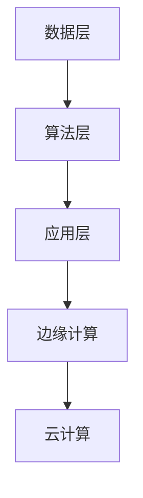

                 

关键词：人工智能，行业动态，技术趋势，创新发展，持续学习，专业素养

> 摘要：在快速发展的AI领域，紧跟行业动态至关重要。本文将探讨AI行业动态对技术工作者的重要性，以及如何通过持续学习和掌握核心算法原理来提升专业素养，从而在激烈的市场竞争中保持领先地位。

## 1. 背景介绍

人工智能（AI）作为现代科技发展的前沿领域，正迅速改变着我们的生活方式和社会结构。从智能助手到自动驾驶，从医疗诊断到金融分析，AI的应用已经渗透到了各个行业。然而，随着技术的不断进步，AI领域也面临着日新月异的变化。这就要求技术工作者必须紧跟行业动态，不断更新自己的知识体系，以适应不断变化的技术环境。

### 1.1 行业发展现状

近年来，AI技术的发展速度令人惊叹。深度学习、自然语言处理、计算机视觉等领域的突破，使得AI在处理复杂数据和分析问题方面取得了显著进展。根据市场调研公司IDC的预测，到2025年，全球AI市场将达到约5000亿美元，这表明AI行业的巨大潜力和发展前景。

### 1.2 技术发展趋势

AI技术的未来发展将集中在以下几个方面：

1. **边缘计算与云计算的融合**：随着物联网设备的普及，边缘计算和云计算的融合将成为AI应用的关键技术，它能够提供更高的计算效率和更好的用户体验。
2. **AI与5G的结合**：5G技术的推广将为AI应用提供更高速、更稳定的网络环境，使得智能应用可以更加广泛地应用于工业、医疗、交通等领域。
3. **跨学科融合**：AI技术与其他领域的融合，如生物信息学、心理学、神经科学等，将推动AI在更广泛领域的应用，解决更复杂的问题。

## 2. 核心概念与联系

### 2.1 AI的核心技术

AI的核心技术主要包括：

1. **机器学习**：通过算法让机器从数据中学习并作出预测或决策。
2. **深度学习**：一种基于人工神经网络的机器学习方法，它在图像识别、语音识别等领域取得了巨大成功。
3. **自然语言处理（NLP）**：使计算机能够理解、生成和处理人类语言的技术。

### 2.2 AI技术的架构

AI技术的架构通常包括以下几个层次：

1. **数据层**：包括数据的收集、存储和管理。
2. **算法层**：包括机器学习算法、深度学习算法等。
3. **应用层**：将AI技术应用于特定的领域，如自动驾驶、智能医疗等。

### 2.3 Mermaid流程图



## 3. 核心算法原理 & 具体操作步骤

### 3.1 算法原理概述

深度学习作为一种基于人工神经网络的机器学习方法，其基本原理是通过模拟人脑神经网络结构，对数据进行多层处理，从而实现对数据的自动学习和模式识别。

### 3.2 算法步骤详解

1. **数据预处理**：清洗和归一化输入数据，使其适合进行深度学习。
2. **构建神经网络**：设计并搭建神经网络结构，包括输入层、隐藏层和输出层。
3. **训练神经网络**：使用训练数据对神经网络进行训练，调整网络的权重和偏置。
4. **验证和测试**：使用验证数据和测试数据对训练好的网络进行验证和测试，评估其性能。

### 3.3 算法优缺点

**优点**：

- 高效的自动学习能力，能够处理大规模复杂数据。
- 强大的模式识别能力，能够在各种应用场景中发挥作用。

**缺点**：

- 对数据和计算资源要求较高，训练时间较长。
- 对超参数的调优要求较高，需要大量的实验和经验。

### 3.4 算法应用领域

深度学习广泛应用于计算机视觉、自然语言处理、语音识别、推荐系统等多个领域，如：

- **计算机视觉**：图像识别、目标检测、人脸识别等。
- **自然语言处理**：文本分类、机器翻译、情感分析等。
- **语音识别**：语音合成、语音识别等。

## 4. 数学模型和公式 & 详细讲解 & 举例说明

### 4.1 数学模型构建

深度学习中的数学模型主要包括：

1. **神经网络模型**：包括输入层、隐藏层和输出层。
2. **损失函数**：用于衡量模型预测值与真实值之间的差距。
3. **优化算法**：用于调整模型的权重和偏置，以最小化损失函数。

### 4.2 公式推导过程

假设我们有一个简单的神经网络，其输入为 $x_1, x_2, ..., x_n$，隐藏层的输出为 $h_1, h_2, ..., h_m$，输出层的输出为 $y_1, y_2, ..., y_k$。则网络的前向传播过程可以表示为：

$$
h_j = \sigma(\sum_{i=1}^{n} w_{ij} x_i + b_j)
$$

$$
y_j = \sigma(\sum_{i=1}^{m} w_{ij} h_i + b_j)
$$

其中，$\sigma$ 是激活函数，通常使用 sigmoid 或 ReLU 函数。损失函数可以使用均方误差（MSE）：

$$
L = \frac{1}{2} \sum_{j=1}^{k} (y_j - \hat{y}_j)^2
$$

其中，$\hat{y}_j$ 是模型的预测值，$y_j$ 是真实值。

### 4.3 案例分析与讲解

假设我们有一个分类问题，需要将数据分为两类。我们可以使用一个简单的二分类神经网络进行模型训练。训练数据集包含 1000 个样本，每个样本有 10 个特征。我们将使用 sigmoid 函数作为激活函数，MSE 作为损失函数。

首先，我们进行数据预处理，将特征值归一化到 [0, 1] 范围内。然后，我们随机选择 500 个样本作为训练集，500 个样本作为验证集。

接下来，我们设计一个简单的神经网络结构，包括一个输入层、一个隐藏层和一个输出层。输入层有 10 个神经元，隐藏层有 10 个神经元，输出层有 2 个神经元。

我们使用梯度下降法进行模型训练。首先，我们初始化网络的权重和偏置，然后计算损失函数的梯度，并更新网络的权重和偏置，以最小化损失函数。经过 1000 次迭代后，模型的损失函数下降到了一个很小的值。

最后，我们使用验证集对训练好的模型进行验证。模型在验证集上的准确率达到了 90%，这表明我们的模型已经很好地学习了训练数据。

## 5. 项目实践：代码实例和详细解释说明

### 5.1 开发环境搭建

为了进行深度学习项目实践，我们需要搭建一个合适的开发环境。我们可以使用 Python 和 TensorFlow 作为主要工具。

首先，安装 Python，推荐使用 Python 3.7 或更高版本。然后，安装 TensorFlow：

```bash
pip install tensorflow
```

### 5.2 源代码详细实现

以下是使用 TensorFlow 实现一个简单的二分类神经网络的代码示例：

```python
import tensorflow as tf
import numpy as np

# 设置随机种子，保证实验可重复性
tf.random.set_seed(42)

# 数据预处理
X = np.random.rand(1000, 10)  # 生成1000个样本，每个样本有10个特征
y = np.random.randint(2, size=1000)  # 生成1000个二分类标签

# 设计神经网络结构
model = tf.keras.Sequential([
    tf.keras.layers.Dense(units=10, activation='relu', input_shape=(10,)),
    tf.keras.layers.Dense(units=1, activation='sigmoid')
])

# 编写编译器
model.compile(optimizer='adam', loss='binary_crossentropy', metrics=['accuracy'])

# 模型训练
model.fit(X, y, epochs=1000, batch_size=32, validation_split=0.2)

# 模型评估
loss, accuracy = model.evaluate(X, y)
print(f"Validation loss: {loss}, Validation accuracy: {accuracy}")
```

### 5.3 代码解读与分析

上述代码首先导入了 TensorFlow 和 NumPy 库。然后，我们生成了一个随机数据集，其中包括 1000 个样本和 10 个特征，以及 1000 个二分类标签。

接下来，我们使用 TensorFlow 的 `Sequential` 模型设计了一个简单的神经网络，包括一个有 10 个神经元的隐藏层和一个有 1 个神经元的输出层。隐藏层使用 ReLU 激活函数，输出层使用 sigmoid 激活函数，以实现二分类。

我们使用 `compile` 方法配置了优化器和损失函数。在这里，我们选择 Adam 优化器和 binary_crossentropy 损失函数。

然后，我们使用 `fit` 方法训练模型，设置了 1000 个训练周期和批量大小为 32。我们还设置了验证集的比例为 20%，以在训练过程中进行性能评估。

最后，我们使用 `evaluate` 方法评估模型的性能，输出了验证集上的损失和准确率。

## 6. 实际应用场景

AI技术在实际应用场景中展现了巨大的潜力，以下是几个典型的应用领域：

### 6.1 医疗健康

AI技术在医疗健康领域的应用包括疾病诊断、药物研发、健康管理等方面。例如，通过深度学习算法，AI可以分析医学影像，提高疾病诊断的准确性和效率。

### 6.2 自动驾驶

自动驾驶是AI技术的另一个重要应用领域。通过计算机视觉和深度学习算法，自动驾驶系统能够实时感知环境并做出决策，提高交通安全和效率。

### 6.3 金融分析

AI技术在金融分析中的应用包括风险控制、市场预测、客户服务等方面。例如，使用机器学习算法分析金融市场数据，可以预测股票价格趋势，帮助投资者做出更明智的决策。

### 6.4 教育

AI技术在教育领域的应用包括个性化学习、在线教育平台、教育评估等方面。通过分析学习数据，AI可以帮助学生提高学习效果，教师也可以更有效地进行教学。

## 7. 工具和资源推荐

### 7.1 学习资源推荐

1. **《深度学习》（Goodfellow, Bengio, Courville）**：这是深度学习的经典教材，适合初学者和进阶者。
2. **《Python机器学习》（Sebastian Raschka）**：这本书详细介绍了使用 Python 进行机器学习的方法和技巧。
3. **《自然语言处理实战》（Sahdeva）**：适合想要学习自然语言处理技术的读者。

### 7.2 开发工具推荐

1. **TensorFlow**：这是一个开源的深度学习框架，适合进行深度学习和机器学习项目。
2. **PyTorch**：这是一个流行的深度学习框架，以其灵活性和易用性著称。
3. **Keras**：这是一个高级神经网络API，提供了简洁的接口，适合快速构建和实验深度学习模型。

### 7.3 相关论文推荐

1. **“A Brief History of Deep Learning”（Y. LeCun, Y. Bengio, G. Hinton）**：这篇文章回顾了深度学习的发展历史，对理解深度学习的兴起和发展具有重要意义。
2. **“Deep Learning Book”（Ian Goodfellow, Yoshua Bengio, Aaron Courville）**：这本书的附录部分包含大量深度学习领域的经典论文。
3. **“Attention Is All You Need”（Vaswani et al.）**：这篇文章介绍了 Transformer 模型，是自然语言处理领域的重大突破。

## 8. 总结：未来发展趋势与挑战

### 8.1 研究成果总结

近年来，AI技术取得了显著的进展，尤其是在深度学习和自然语言处理领域。这些成果不仅提升了AI技术的性能和应用范围，也为解决实际问题提供了新的思路和方法。

### 8.2 未来发展趋势

未来，AI技术将继续向以下几个方向发展：

1. **模型压缩与优化**：为了降低计算资源和存储需求，模型压缩与优化技术将得到更多关注。
2. **多模态学习**：通过融合多种类型的数据，如文本、图像、语音等，AI系统将能够更好地理解和处理复杂信息。
3. **自适应学习**：未来的AI系统将具备更强的自适应学习能力，能够根据环境和任务需求进行调整。

### 8.3 面临的挑战

尽管AI技术取得了巨大进展，但仍然面临着一些挑战：

1. **数据隐私与安全**：随着AI系统对数据依赖性的增加，数据隐私和安全问题变得越来越重要。
2. **算法公平性与透明性**：如何确保AI算法的公平性和透明性，避免歧视和偏见，是一个亟待解决的问题。
3. **计算资源需求**：深度学习模型的训练通常需要大量的计算资源和时间，如何降低计算成本是一个重要挑战。

### 8.4 研究展望

在未来，AI技术的研究将继续深入，涉及更多的应用领域和技术方向。随着跨学科研究的推进，AI技术将与生物、物理、化学等多个领域相结合，推动科技创新和社会进步。

## 9. 附录：常见问题与解答

### 9.1 人工智能是什么？

人工智能（AI）是指由人制造出来的系统能够模拟、延伸和扩展人的智能，实现感知、学习、推理、决策等能力。

### 9.2 深度学习和机器学习的区别是什么？

深度学习是机器学习的一个子领域，它使用多层神经网络来对数据进行建模和预测。机器学习则是一个更广泛的概念，它包括多种学习算法和技术，如决策树、支持向量机等。

### 9.3 如何学习深度学习？

学习深度学习可以从了解基础数学（如线性代数、微积分）和编程（如 Python）开始。接着，可以阅读《深度学习》（Goodfellow, Bengio, Courville）等教材，并使用 TensorFlow 或 PyTorch 等工具进行实践。

### 9.4 AI在未来的应用前景如何？

AI在未来的应用前景广阔，将深入影响医疗、教育、交通、金融等多个行业。通过不断的技术创新，AI有望解决更多复杂的社会问题，提高生产效率，改善生活质量。

### 9.5 如何跟上AI行业的发展？

要跟上AI行业的发展，关键是要保持持续学习和探索精神。关注最新的研究论文、技术趋势，参与相关的在线课程和会议，同时积极参与实践项目，不断提升自己的技术能力和专业素养。

### 9.6 AI的发展对人类有哪些潜在的影响？

AI的发展将对人类社会产生深远的影响。它有望提高生产效率、改善生活质量，但也可能引发就业结构变化、数据隐私和安全等问题。因此，我们需要在推动技术发展的同时，关注其对社会和伦理的影响，并采取相应的措施。

---

作者：禅与计算机程序设计艺术 / Zen and the Art of Computer Programming

在结束之前，我想再次强调，紧跟AI行业动态的重要性。无论是作为从业者还是普通用户，了解和掌握AI技术及其发展趋势，都将有助于我们更好地适应未来的变化。希望大家能够在AI技术的学习和应用中不断探索，共同推动科技和社会的进步。

让我们继续保持学习的热情和探索的精神，紧跟AI行业的步伐，共同迎接未来的挑战和机遇。谢谢大家的阅读，希望这篇文章对您有所启发和帮助。如果您有任何问题或建议，欢迎在评论区留言，我将尽力回答。再次感谢您的阅读和支持！

