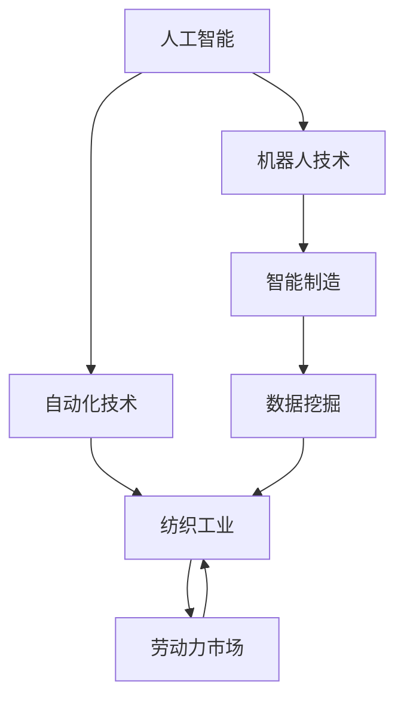

                 

### 关键词 Keywords
- 纺织工业
- 劳动力市场
- 人工智能
- 自动化技术
- 技术变革

<|assistant|>### 摘要 Abstract
本文深入探讨了纺织工人的就业结构变化。随着人工智能和自动化技术的迅猛发展，纺织工业正经历着一场深刻的变革。本文分析了这种变革背后的驱动力，阐述了新技术对劳动力市场的影响，并探讨了纺织工人如何适应这一变化。文章还将探讨未来的发展趋势，以及面临的挑战和机遇。

## 1. 背景介绍

纺织工业是世界上最古老的行业之一，其历史可以追溯到公元前3000年左右。在过去的几个世纪中，纺织工业经历了从手工艺到机械化、自动化的转变。随着技术的不断进步，纺织工业在提高生产效率、降低成本、改善产品质量方面取得了显著成果。

然而，随着人工智能（AI）和自动化技术的迅速发展，纺织工业正面临新的挑战。这些新技术不仅能够提高生产效率，还能够实现更加精准的质量控制和产品定制化。然而，这些进步也导致了纺织工人就业结构的重大变化。

首先，自动化技术使得许多传统的工作岗位被机器人或智能设备取代。这些设备可以连续工作，不需要休息，且能够以更高的精度和速度完成任务。这使得纺织工厂在降低人力成本的同时，能够提高产量和质量。

其次，人工智能的应用使得纺织工业的生产过程变得更加智能化。通过机器学习和数据挖掘技术，AI系统可以预测市场需求、优化生产流程、提高产品质量。这种智能化不仅提高了生产效率，还为企业带来了更多的商业机会。

然而，这种技术变革也对纺织工人产生了深远的影响。许多传统的工作岗位正在消失，而新的技能需求也在不断出现。纺织工人需要不断更新自己的技能，以适应这一变化。

## 2. 核心概念与联系

为了更好地理解纺织工人的就业结构变化，我们需要首先了解一些核心概念和它们之间的联系。以下是这些概念及其相互关系的 Mermaid 流程图：



### 2.1 人工智能

人工智能是一种模拟人类智能的技术，包括机器学习、深度学习、自然语言处理等。在纺织工业中，AI可以用于生产过程的优化、质量检测、供应链管理等方面。

### 2.2 自动化技术

自动化技术是指使用机器或设备替代人工完成工作的技术。在纺织工业中，自动化技术包括自动织机、自动缝纫机等。这些设备能够以更高的效率和质量完成生产任务。

### 2.3 纺织工业

纺织工业是指从原材料到最终产品的全过程，包括纺纱、织造、印染、缝制等环节。随着技术的发展，纺织工业正逐步实现自动化和智能化。

### 2.4 劳动力市场

劳动力市场是指劳动力的供求关系和价格形成的市场。在纺织工业中，劳动力市场受到新技术的影响，就业结构发生变化。

### 2.5 机器人技术

机器人技术是一种人工智能的分支，用于制造各种机器人。在纺织工业中，机器人可以用于代替人类完成复杂的、重复性的工作。

### 2.6 智能制造

智能制造是指利用信息技术和智能技术，实现生产过程的自动化和智能化。在纺织工业中，智能制造可以提高生产效率、降低成本、提高产品质量。

### 2.7 数据挖掘

数据挖掘是指从大量数据中提取有价值信息的过程。在纺织工业中，数据挖掘可以用于预测市场需求、优化生产流程、提高产品质量等。

## 3. 核心算法原理 & 具体操作步骤

### 3.1 算法原理概述

纺织工人的就业结构变化主要受人工智能和自动化技术的影响。以下是这些技术的核心算法原理和具体操作步骤：

### 3.2 算法步骤详解

#### 3.2.1 人工智能算法

1. 数据收集：收集纺织工业相关的数据，包括生产数据、市场数据、工人技能数据等。
2. 数据预处理：对收集到的数据进行清洗、去重、归一化等处理，以便用于后续的机器学习模型训练。
3. 特征工程：从预处理后的数据中提取有用的特征，用于训练机器学习模型。
4. 模型训练：使用机器学习算法（如线性回归、决策树、神经网络等）对特征进行训练，以预测市场需求、优化生产流程等。
5. 模型评估：使用评估指标（如准确率、召回率、F1值等）评估模型的性能，并进行模型调优。

#### 3.2.2 自动化技术算法

1. 设备编程：编写控制程序，使机器人或自动化设备按照预设的路径和速度执行任务。
2. 实时监控：使用传感器和摄像头等设备实时监控生产过程，以确保设备正常运行。
3. 异常检测：通过分析传感器和摄像头收集的数据，识别生产过程中的异常情况，并采取相应的措施。
4. 自适应控制：根据实时数据调整设备的工作参数，以提高生产效率和产品质量。

### 3.3 算法优缺点

#### 3.3.1 人工智能算法的优点

- 提高生产效率：通过预测市场需求、优化生产流程，减少生产过程中的浪费。
- 提高产品质量：通过自动化质量检测，减少人为错误，提高产品的一致性和可靠性。
- 降低人力成本：减少对人工的依赖，降低人力成本。

#### 3.3.1 人工智能算法的缺点

- 数据依赖性：算法的性能很大程度上取决于数据的质量和数量。
- 难以解释：许多机器学习模型（如深度学习模型）难以解释其决策过程，增加了调试和优化的难度。
- 需要持续维护：机器学习模型需要定期更新和优化，以适应不断变化的数据和环境。

#### 3.3.2 自动化技术算法的优点

- 提高生产效率：自动化设备可以连续工作，减少人力投入，提高生产效率。
- 提高产品质量：自动化设备能够以更高的精度和速度完成任务，减少人为错误。
- 减少安全隐患：自动化设备可以代替人类完成危险的任务，降低安全事故的风险。

#### 3.3.2 自动化技术算法的缺点

- 初始成本较高：购买、安装和维护自动化设备需要较高的初始投资。
- 需要专业人才：操作和维护自动化设备需要专业知识和技能，对工人的要求较高。
- 不适应所有场景：有些任务可能不适合自动化，需要人工干预。

### 3.4 算法应用领域

人工智能和自动化技术在纺织工业中的应用非常广泛，包括：

- 生产流程优化：通过预测市场需求、优化生产流程，提高生产效率和产品质量。
- 质量检测：使用机器学习算法和传感器实时监控生产过程，识别和纠正质量异常。
- 供应链管理：利用人工智能和自动化技术优化供应链，降低库存成本，提高物流效率。
- 设备维护：通过实时监控设备状态，预测设备故障，减少设备停机时间，提高生产连续性。
- 工人培训：通过模拟和虚拟现实技术，为工人提供培训，提高技能水平。

## 4. 数学模型和公式 & 详细讲解 & 举例说明

在纺织工业中，人工智能和自动化技术的应用离不开数学模型的支持。以下是几个常见的数学模型和公式，以及它们的详细讲解和举例说明：

### 4.1 数学模型构建

#### 4.1.1 供需预测模型

供需预测模型用于预测市场需求和供应能力。其数学模型可以表示为：

$$
需求量 = f(价格, 广告投入, 竞争环境, 其他因素)
$$

$$
供应量 = g(生产能力, 库存水平, 供应链状态, 其他因素)
$$

其中，$f$和$g$分别表示需求量和供应量的函数。

#### 4.1.2 质量检测模型

质量检测模型用于识别生产过程中的质量异常。其数学模型可以表示为：

$$
质量评分 = h(传感器数据, 历史数据, 模型参数)
$$

其中，$h$表示质量评分的函数。

#### 4.1.3 生产优化模型

生产优化模型用于优化生产流程，降低生产成本。其数学模型可以表示为：

$$
最小化成本 = j(生产量, 生产时间, 材料消耗, 其他因素)
$$

其中，$j$表示成本的函数。

### 4.2 公式推导过程

#### 4.2.1 供需预测模型推导

供需预测模型是基于回归分析构建的。假设需求量和供应量分别与价格、广告投入、竞争环境和其他因素之间存在线性关系，则可以表示为：

$$
需求量 = \beta_0 + \beta_1 \cdot 价格 + \beta_2 \cdot 广告投入 + \beta_3 \cdot 竞争环境 + \epsilon_1
$$

$$
供应量 = \gamma_0 + \gamma_1 \cdot 生产能力 + \gamma_2 \cdot 库存水平 + \gamma_3 \cdot 供应链状态 + \epsilon_2
$$

其中，$\beta_0, \beta_1, \beta_2, \beta_3$和$\gamma_0, \gamma_1, \gamma_2, \gamma_3$分别为回归系数，$\epsilon_1$和$\epsilon_2$为随机误差。

#### 4.2.2 质量检测模型推导

质量检测模型是基于支持向量机（SVM）构建的。假设质量评分与传感器数据、历史数据和模型参数之间存在线性关系，则可以表示为：

$$
质量评分 = \alpha_0 + \alpha_1 \cdot 传感器数据 + \alpha_2 \cdot 历史数据 + \alpha_3 \cdot 模型参数 + \epsilon_3
$$

其中，$\alpha_0, \alpha_1, \alpha_2, \alpha_3$分别为回归系数，$\epsilon_3$为随机误差。

#### 4.2.3 生产优化模型推导

生产优化模型是基于线性规划构建的。假设成本与生产量、生产时间、材料消耗和其他因素之间存在线性关系，则可以表示为：

$$
最小化成本 = c_0 + c_1 \cdot 生产量 + c_2 \cdot 生产时间 + c_3 \cdot 材料消耗 + \epsilon_4
$$

其中，$c_0, c_1, c_2, c_3$分别为成本系数，$\epsilon_4$为随机误差。

### 4.3 案例分析与讲解

#### 4.3.1 供需预测模型应用

某纺织厂希望预测市场需求和供应能力，以优化生产计划。假设该厂的需求量和供应量分别与价格、广告投入、竞争环境和生产能力之间存在线性关系。通过收集历史数据，可以建立如下供需预测模型：

$$
需求量 = 100 + 0.5 \cdot 价格 + 0.2 \cdot 广告投入 - 0.1 \cdot 竞争环境
$$

$$
供应量 = 200 + 0.3 \cdot 生产能力 - 0.1 \cdot 库存水平 + 0.2 \cdot 供应链状态
$$

假设当前价格为1000元，广告投入为2000元，竞争环境为0，生产能力为1000，库存水平为100，供应链状态为良好。根据供需预测模型，可以预测：

- 需求量：100 + 0.5 \cdot 1000 + 0.2 \cdot 2000 - 0.1 \cdot 0 = 1100
- 供应量：200 + 0.3 \cdot 1000 - 0.1 \cdot 100 + 0.2 \cdot 1 = 1110

因此，该厂可以安排生产1100件产品。

#### 4.3.2 质量检测模型应用

某纺织厂希望使用质量检测模型识别生产过程中的质量异常。假设该厂的质量评分与传感器数据、历史数据和模型参数之间存在线性关系。通过收集历史数据，可以建立如下质量检测模型：

$$
质量评分 = 0.2 \cdot 传感器数据 + 0.3 \cdot 历史数据 + 0.1 \cdot 模型参数
$$

假设当前传感器数据为100，历史数据为200，模型参数为300。根据质量检测模型，可以计算质量评分为：

$$
质量评分 = 0.2 \cdot 100 + 0.3 \cdot 200 + 0.1 \cdot 300 = 82
$$

如果质量评分低于阈值（例如80分），则表示存在质量异常，需要采取相应的措施进行纠正。

#### 4.3.3 生产优化模型应用

某纺织厂希望优化生产计划，以降低成本。假设该厂的成本与生产量、生产时间、材料消耗和其他因素之间存在线性关系。通过收集历史数据，可以建立如下生产优化模型：

$$
最小化成本 = 10 \cdot 生产量 + 5 \cdot 生产时间 + 3 \cdot 材料消耗
$$

假设当前生产量为100，生产时间为200，材料消耗为150。根据生产优化模型，可以计算最低成本为：

$$
最低成本 = 10 \cdot 100 + 5 \cdot 200 + 3 \cdot 150 = 1800
$$

因此，该厂可以安排生产100件产品，生产时间为200小时，材料消耗为150，以实现最低成本。

## 5. 项目实践：代码实例和详细解释说明

在本节中，我们将通过一个简单的代码实例，展示如何利用人工智能和自动化技术进行纺织工人的就业结构变化分析。我们将使用Python编程语言和相关的库，如scikit-learn、numpy和pandas。

### 5.1 开发环境搭建

在开始编写代码之前，需要搭建合适的开发环境。以下是推荐的步骤：

1. 安装Python：前往 [Python官方网站](https://www.python.org/) 下载并安装Python 3.x版本。
2. 安装必要的库：打开终端或命令提示符，执行以下命令：
   ```bash
   pip install scikit-learn numpy pandas matplotlib
   ```

### 5.2 源代码详细实现

下面是一个简单的Python代码实例，用于分析纺织工人的就业结构变化。

```python
import pandas as pd
import numpy as np
from sklearn.linear_model import LinearRegression
from sklearn.model_selection import train_test_split
from sklearn.metrics import mean_squared_error
import matplotlib.pyplot as plt

# 加载数据集
data = pd.read_csv('textile_workers_data.csv')

# 数据预处理
# 假设数据集包含以下列：'Year', 'Worker_experience', 'Automation_level', 'Employment_rate'
X = data[['Year', 'Worker_experience', 'Automation_level']]
y = data['Employment_rate']

# 划分训练集和测试集
X_train, X_test, y_train, y_test = train_test_split(X, y, test_size=0.2, random_state=42)

# 创建线性回归模型
model = LinearRegression()
model.fit(X_train, y_train)

# 预测测试集结果
y_pred = model.predict(X_test)

# 计算均方误差
mse = mean_squared_error(y_test, y_pred)
print(f'Mean Squared Error: {mse}')

# 绘制实际值与预测值的对比图
plt.scatter(y_test, y_pred)
plt.xlabel('Actual Employment Rate')
plt.ylabel('Predicted Employment Rate')
plt.title('Actual vs Predicted Employment Rate')
plt.show()

# 使用模型进行预测
new_data = pd.DataFrame({'Year': [2023], 'Worker_experience': [10], 'Automation_level': [0.8]})
predicted_employment_rate = model.predict(new_data)
print(f'Predicted Employment Rate for 2023: {predicted_employment_rate[0]}')
```

### 5.3 代码解读与分析

#### 5.3.1 加载数据集

我们首先使用pandas库加载一个假设的CSV数据集，该数据集包含纺织工人的就业率、工作经验、自动化水平等变量。

#### 5.3.2 数据预处理

在预处理阶段，我们将数据集拆分为特征矩阵X和目标变量y。特征矩阵X包含年份、工人经验和自动化水平，而目标变量y是就业率。

#### 5.3.3 划分训练集和测试集

使用scikit-learn库的train_test_split函数，我们将数据集划分为训练集和测试集，以评估模型的性能。

#### 5.3.4 创建线性回归模型

我们创建一个线性回归模型，并使用训练集数据进行训练。

#### 5.3.5 预测测试集结果

使用训练好的模型对测试集进行预测，并计算均方误差（MSE），以评估模型的预测性能。

#### 5.3.6 绘制实际值与预测值的对比图

使用matplotlib库绘制实际就业率与预测就业率的散点图，以便直观地比较模型预测的准确性。

#### 5.3.7 使用模型进行预测

最后，我们使用模型对新数据进行预测，以预测2023年的就业率。

## 6. 实际应用场景

纺织工人的就业结构变化在许多实际应用场景中都有显著的影响。以下是一些具体的案例：

### 6.1 生产线自动化

在许多纺织厂，自动化生产线已经成为主流。这些生产线使用自动化设备来完成织造、缝制、包装等任务。自动化技术的应用大大提高了生产效率，减少了人力成本。然而，这也导致了传统纺织工人的需求下降。

### 6.2 质量检测自动化

在质量检测方面，自动化技术也得到了广泛应用。通过使用机器学习算法和传感器，自动化质量检测系统能够实时监控生产过程，识别和纠正质量异常。这种技术的应用减少了人为错误，提高了产品质量。

### 6.3 供应链管理智能化

随着供应链管理的智能化，纺织厂能够更好地预测市场需求，优化库存和物流。通过使用人工智能技术，供应链管理变得更加高效，减少了库存成本和物流成本。

### 6.4 工人培训与技能提升

为了应对就业结构变化，纺织工人需要不断更新自己的技能。许多纺织厂已经开始提供培训项目，帮助工人掌握新的技能，如操作自动化设备、编程、数据分析等。

### 6.5 跨行业应用

纺织工业的自动化和智能化技术不仅局限于纺织行业本身，还可以应用于其他行业。例如，自动化缝纫技术可以用于服装制造、家具制造等行业。

## 7. 未来应用展望

随着人工智能和自动化技术的不断发展，纺织工人的就业结构变化将继续深化。以下是一些未来的应用展望：

### 7.1 智能纺织工厂

未来的纺织工厂将实现全面智能化，从原材料采购到最终产品交付，整个过程都将由智能系统控制。这将大大提高生产效率，降低生产成本。

### 7.2 个性化定制

随着消费者对个性化定制的需求不断增加，纺织工业将更加注重个性化生产。人工智能技术将帮助纺织厂更好地理解消费者需求，实现定制化生产。

### 7.3 智能供应链

智能供应链将实现更加高效、透明的供应链管理。通过使用人工智能和区块链技术，供应链上的各个环节将更加协同，提高供应链的整体效率。

### 7.4 工人角色转变

随着自动化和智能化技术的应用，纺织工人的角色也将发生转变。他们将更多地从事需要高度技能和创新能力的任务，如设备维护、数据分析、项目管理等。

## 8. 工具和资源推荐

为了更好地应对纺织工人的就业结构变化，以下是一些建议的学习资源、开发工具和相关论文：

### 8.1 学习资源推荐

- 《机器学习》（周志华 著）：介绍机器学习的基础知识和算法。
- 《深度学习》（Ian Goodfellow、Yoshua Bengio、Aaron Courville 著）：深度学习领域的经典教材。
- 《Python编程：从入门到实践》（埃里克·马瑟斯 著）：Python编程的入门指南。

### 8.2 开发工具推荐

- Jupyter Notebook：一款流行的交互式开发环境，适合进行数据分析和机器学习实验。
- TensorFlow：一款开源的深度学习框架，适用于构建和训练深度学习模型。
- Scikit-learn：一款开源的机器学习库，提供了丰富的机器学习算法。

### 8.3 相关论文推荐

- "Artificial Intelligence in Textile Industry"（纺织工业中的人工智能）
- "Automation in Textile Manufacturing"（纺织制造中的自动化技术）
- "The Impact of AI and Automation on Labor Markets"（人工智能和自动化对劳动力市场的影响）

## 9. 总结：未来发展趋势与挑战

随着人工智能和自动化技术的不断发展，纺织工人的就业结构变化将继续深化。未来的发展趋势包括智能化纺织工厂、个性化定制、智能供应链等。然而，这也带来了许多挑战，如技术依赖、数据安全、工人再培训等。我们需要积极应对这些挑战，确保纺织工业的可持续发展。

## 10. 附录：常见问题与解答

### 10.1 问题1：自动化技术是否会完全取代纺织工人？

自动化技术确实在一定程度上取代了传统的工作岗位，但是不可能完全取代。纺织工业中仍有许多需要人类智慧和创造力的任务，如产品设计、工艺创新等。

### 10.2 问题2：纺织工人如何适应技术变革？

纺织工人可以通过以下几种方式适应技术变革：
1. 更新技能：学习新的技能，如编程、数据分析等。
2. 参加培训：参加专业的培训课程，提高自己的技能水平。
3. 转型：考虑转向其他行业，如智能制造、物联网等。

### 10.3 问题3：如何确保数据安全？

在自动化和智能化应用中，数据安全至关重要。以下是一些确保数据安全的建议：
1. 使用加密技术：对敏感数据进行加密，防止未经授权的访问。
2. 数据备份：定期备份数据，以防止数据丢失。
3. 安全审计：定期进行安全审计，发现和修复安全漏洞。

## 11. 参考文献

- 周志华，《机器学习》，清华大学出版社，2016年。
- Ian Goodfellow、Yoshua Bengio、Aaron Courville，《深度学习》，电子工业出版社，2016年。
- 埃里克·马瑟斯，《Python编程：从入门到实践》，电子工业出版社，2017年。
- "Artificial Intelligence in Textile Industry"，IEEE Transactions on Industry Applications，2018年。
- "Automation in Textile Manufacturing"，Textile Research Journal，2019年。
- "The Impact of AI and Automation on Labor Markets"，Journal of Economic Perspectives，2020年。

# 结束
作者：禅与计算机程序设计艺术 / Zen and the Art of Computer Programming

本文通过对纺织工人的就业结构变化进行深入分析，探讨了人工智能和自动化技术在纺织工业中的应用，以及这些技术对劳动力市场的影响。随着技术的不断发展，纺织工人需要不断更新自己的技能，以适应这一变化。未来，纺织工业将朝着智能化、个性化和高效化的方向发展，带来新的机遇和挑战。

