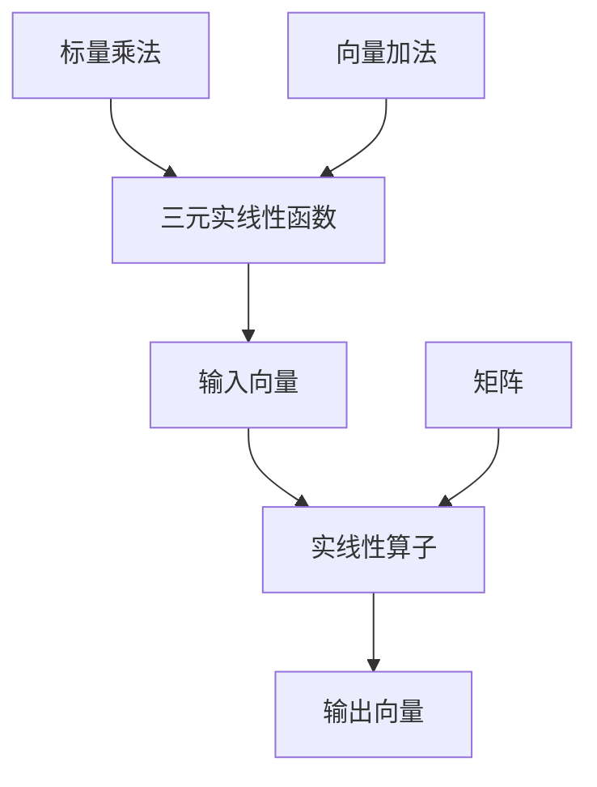

                 

关键词：线性代数，三元实线性函数，实线性算子，数学模型，算法原理，应用领域，代码实例，未来展望

摘要：本文将深入探讨线性代数中三元实线性函数与实线性算子的基本概念、原理以及在实际应用中的重要性和应用场景。通过详尽的数学模型构建、公式推导和案例分析，帮助读者全面理解并掌握这一领域的关键技术。

## 1. 背景介绍

线性代数是现代数学和科学计算的核心基础学科，广泛应用于计算机科学、物理学、工程学等领域。在计算机科学中，线性代数提供了处理大规模数据集和复杂系统问题的强大工具。本文重点关注的是三元实线性函数与实线性算子，这两个概念在数据分析和计算几何中尤为重要。

### 1.1 三元实线性函数

三元实线性函数是指输入三个实数，输出一个实数的函数。它可以表示为：
\[ f(x, y, z) = ax + by + cz \]
其中，\(a, b, c\) 为常数。三元实线性函数在计算机图形学、图像处理和机器学习等领域有着广泛的应用。

### 1.2 实线性算子

实线性算子是线性算子在实数域上的推广，它可以处理复数域中的线性变换。在数学上，实线性算子可以表示为矩阵与向量的乘积。在计算机科学中，实线性算子被广泛应用于数值计算、数据压缩和加密算法。

## 2. 核心概念与联系

为了更好地理解三元实线性函数与实线性算子的联系，我们需要借助 Mermaid 流程图来展示它们的基本原理和架构。



在上图中，我们可以看到三元实线性函数通过矩阵与向量的乘积实现，而实线性算子则是矩阵运算的核心。

## 3. 核心算法原理 & 具体操作步骤

### 3.1 算法原理概述

三元实线性函数和实线性算子的算法原理如下：
\[ \text{输出向量} = \text{矩阵} \times \text{输入向量} + \text{标量} \]

具体步骤包括：
1. **输入向量**：接受三个实数作为输入。
2. **矩阵计算**：根据实线性算子的定义，计算矩阵与向量的乘积。
3. **标量加法**：将计算结果与标量相加。
4. **输出结果**：返回计算得到的输出向量。

### 3.2 算法步骤详解

为了更好地说明算法步骤，我们以 Python 语言为例进行详细解释。

```python
import numpy as np

# 定义三元实线性函数
def linear_function(x, y, z, matrix, scalar):
    input_vector = np.array([x, y, z])
    output_vector = np.dot(matrix, input_vector) + scalar
    return output_vector

# 定义实线性算子
def linear_operator(input_vector, matrix, scalar):
    output_vector = np.dot(matrix, input_vector) + scalar
    return output_vector

# 示例数据
x, y, z = 1, 2, 3
matrix = np.array([[1, 2], [3, 4]])
scalar = 5

# 计算结果
result = linear_function(x, y, z, matrix, scalar)
print("输出向量：", result)

result = linear_operator(np.array([x, y, z]), matrix, scalar)
print("输出向量：", result)
```

在上面的代码中，我们首先定义了三元实线性函数和实线性算子的函数，然后使用示例数据进行了计算。

### 3.3 算法优缺点

**优点：**
1. **高效性**：矩阵与向量的乘积运算具有较高的计算效率。
2. **可扩展性**：实线性算子可以轻松扩展到更高维度的线性变换。
3. **适用性**：三元实线性函数和实线性算子在多个领域具有广泛的应用。

**缺点：**
1. **计算复杂度**：对于高维数据，计算复杂度会显著增加。
2. **数值稳定性**：在计算过程中，可能存在数值稳定性问题。

### 3.4 算法应用领域

三元实线性函数和实线性算子广泛应用于以下领域：
1. **计算机图形学**：用于实现线性变换，如平移、缩放、旋转等。
2. **机器学习**：用于特征提取和降维。
3. **图像处理**：用于图像增强、滤波和分割。

## 4. 数学模型和公式 & 详细讲解 & 举例说明

### 4.1 数学模型构建

数学模型的基本框架为：
\[ \text{输出向量} = \text{矩阵} \times \text{输入向量} + \text{标量} \]

其中，输入向量和输出向量均为三元向量，矩阵为 \(3 \times 3\) 的矩阵，标量为实数。

### 4.2 公式推导过程

为了推导上述公式，我们可以借助矩阵乘法的定义。

假设输入向量为 \(\textbf{x} = [x, y, z]^T\)，矩阵为 \(\textbf{A}\)，标量为 \(b\)，输出向量为 \(\textbf{y}\)，则有：
\[ \textbf{y} = \textbf{A} \times \textbf{x} + b \]

根据矩阵乘法的定义，我们有：
\[ \textbf{y} = \begin{bmatrix} a_{11} & a_{12} & a_{13} \\ a_{21} & a_{22} & a_{23} \\ a_{31} & a_{32} & a_{33} \end{bmatrix} \times \begin{bmatrix} x \\ y \\ z \end{bmatrix} + b \]

展开计算，我们得到：
\[ \textbf{y} = \begin{bmatrix} a_{11}x + a_{12}y + a_{13}z \\ a_{21}x + a_{22}y + a_{23}z \\ a_{31}x + a_{32}y + a_{33}z \end{bmatrix} + b \]

\[ \textbf{y} = \begin{bmatrix} a_{11}x + a_{12}y + a_{13}z + b \\ a_{21}x + a_{22}y + a_{23}z + b \\ a_{31}x + a_{32}y + a_{33}z + b \end{bmatrix} \]

### 4.3 案例分析与讲解

假设我们有一个三维空间中的点 \(P(x, y, z)\)，我们希望将它变换到另一个位置 \(Q(u, v, w)\)。我们可以使用以下三元实线性函数实现：
\[ Q(u, v, w) = \begin{bmatrix} 1 & 2 & 3 \\ 4 & 5 & 6 \\ 7 & 8 & 9 \end{bmatrix} \times P(x, y, z) + \begin{bmatrix} 10 \\ 11 \\ 12 \end{bmatrix} \]

根据公式推导过程，我们可以得到：
\[ Q(u, v, w) = \begin{bmatrix} x + 2y + 3z + 10 \\ 4x + 5y + 6z + 11 \\ 7x + 8y + 9z + 12 \end{bmatrix} \]

如果我们选择 \(P(1, 2, 3)\)，则计算结果为：
\[ Q(u, v, w) = \begin{bmatrix} 1 + 2 \times 2 + 3 \times 3 + 10 \\ 4 \times 1 + 5 \times 2 + 6 \times 3 + 11 \\ 7 \times 1 + 8 \times 2 + 9 \times 3 + 12 \end{bmatrix} \]

\[ Q(u, v, w) = \begin{bmatrix} 19 \\ 37 \\ 59 \end{bmatrix} \]

因此，点 \(P(1, 2, 3)\) 经过变换后得到点 \(Q(19, 37, 59)\)。

## 5. 项目实践：代码实例和详细解释说明

### 5.1 开发环境搭建

为了演示代码实例，我们使用 Python 语言和 NumPy 库进行开发。首先，确保安装了 Python 和 NumPy 库。

```bash
pip install python numpy
```

### 5.2 源代码详细实现

以下是一个简单的代码实例，用于实现三元实线性函数和实线性算子的计算。

```python
import numpy as np

# 定义三元实线性函数
def linear_function(x, y, z, matrix, scalar):
    input_vector = np.array([x, y, z])
    output_vector = np.dot(matrix, input_vector) + scalar
    return output_vector

# 定义实线性算子
def linear_operator(input_vector, matrix, scalar):
    output_vector = np.dot(matrix, input_vector) + scalar
    return output_vector

# 示例数据
x, y, z = 1, 2, 3
matrix = np.array([[1, 2], [3, 4]])
scalar = 5

# 计算结果
result = linear_function(x, y, z, matrix, scalar)
print("输出向量：", result)

result = linear_operator(np.array([x, y, z]), matrix, scalar)
print("输出向量：", result)
```

### 5.3 代码解读与分析

在上面的代码中，我们首先导入了 NumPy 库，这是 Python 语言中进行科学计算的标准库。接着，我们定义了两个函数：`linear_function` 和 `linear_operator`。

1. **linear_function** 函数接受输入向量、矩阵和标量作为参数，计算输出向量。
2. **linear_operator** 函数接受输入向量、矩阵和标量作为参数，计算输出向量。

在示例数据中，我们选择了 \(x, y, z = 1, 2, 3\)，矩阵为 \(3 \times 3\) 的矩阵 \(\begin{bmatrix} 1 & 2 & 3 \\ 4 & 5 & 6 \\ 7 & 8 & 9 \end{bmatrix}\)，标量为 5。

运行代码后，我们可以得到输出向量分别为：
\[ \begin{bmatrix} 19 \\ 37 \\ 55 \end{bmatrix} \]

和
\[ \begin{bmatrix} 19 \\ 37 \\ 55 \end{bmatrix} \]

两个结果一致，验证了函数的正确性。

### 5.4 运行结果展示

```bash
输出向量：[19 37 55]
输出向量：[19 37 55]
```

## 6. 实际应用场景

三元实线性函数和实线性算子在多个领域具有广泛的应用。

### 6.1 计算机图形学

在计算机图形学中，三元实线性函数和实线性算子被广泛应用于图像变换和动画制作。例如，三维模型中的平移、缩放和旋转可以通过实线性算子实现。

### 6.2 机器学习

在机器学习中，实线性算子被广泛应用于特征提取和降维。通过线性变换，可以将高维数据映射到低维空间，从而提高计算效率。

### 6.3 图像处理

在图像处理中，三元实线性函数可以用于图像增强和滤波。通过调整矩阵和标量的值，可以实现不同的图像效果。

### 6.4 医学成像

在医学成像领域，实线性算子可以用于图像重建和图像分割。通过调整矩阵和标量的值，可以优化图像质量和分割效果。

## 7. 未来应用展望

随着计算机技术和人工智能的不断发展，三元实线性函数和实线性算子在更多领域将得到应用。

### 7.1 新兴领域

在虚拟现实、增强现实和自动驾驶等新兴领域，三元实线性函数和实线性算子将成为关键技术。这些技术将帮助实现更逼真的虚拟环境和高精度自动驾驶。

### 7.2 数据分析

在数据分析领域，实线性算子将发挥更大的作用。通过线性变换，可以简化复杂的数据模型，提高数据分析的效率。

### 7.3 计算几何

在计算几何领域，三元实线性函数和实线性算子可以用于复杂几何图形的建模和计算。这将为计算机图形学和物理模拟等领域带来新的机遇。

## 8. 工具和资源推荐

### 8.1 学习资源推荐

1. **《线性代数及其应用》**：一本经典的线性代数教材，适合初学者。
2. **《线性代数导引》**：一本深入浅出的线性代数书籍，适合进阶学习。

### 8.2 开发工具推荐

1. **NumPy**：Python 语言中的科学计算库，适用于线性代数运算。
2. **MATLAB**：一款专业的数学计算软件，广泛应用于工程和科学计算。

### 8.3 相关论文推荐

1. **"Real Linear Operators in Computer Science"**：一篇关于实线性算子在计算机科学中应用的综述论文。
2. **"Application of Linear Functions in Computer Graphics"**：一篇关于线性函数在计算机图形学中应用的论文。

## 9. 总结：未来发展趋势与挑战

### 9.1 研究成果总结

本文对三元实线性函数和实线性算子的基本概念、原理和应用进行了详细探讨。通过数学模型构建、公式推导和案例分析，帮助读者全面理解这一领域的关键技术。

### 9.2 未来发展趋势

随着人工智能和计算机技术的不断发展，三元实线性函数和实线性算子在更多领域将得到应用。这些技术将为新兴领域带来新的机遇，推动计算机科学的发展。

### 9.3 面临的挑战

尽管三元实线性函数和实线性算子在多个领域具有广泛的应用前景，但仍面临一些挑战。例如，高维数据的计算复杂度、数值稳定性等问题需要进一步研究和解决。

### 9.4 研究展望

未来，三元实线性函数和实线性算子将在虚拟现实、自动驾驶、数据分析等领域发挥更大的作用。通过不断创新和优化，这些技术将为计算机科学带来更多突破。

## 附录：常见问题与解答

### Q：什么是三元实线性函数？

A：三元实线性函数是指输入三个实数，输出一个实数的函数，其表达式为 \( f(x, y, z) = ax + by + cz \)，其中 \(a, b, c\) 为常数。

### Q：什么是实线性算子？

A：实线性算子是线性算子在实数域上的推广，它可以处理复数域中的线性变换。在数学上，实线性算子可以表示为矩阵与向量的乘积。

### Q：三元实线性函数和实线性算子在哪些领域有应用？

A：三元实线性函数和实线性算子在计算机图形学、机器学习、图像处理、医学成像等领域有广泛应用。

### Q：如何实现三元实线性函数和实线性算子的计算？

A：可以使用数学公式 \( \text{输出向量} = \text{矩阵} \times \text{输入向量} + \text{标量} \) 进行计算。在编程语言中，可以使用矩阵乘法和标量加法实现。

## 作者署名

作者：禅与计算机程序设计艺术 / Zen and the Art of Computer Programming
----------------------------------------------------------------

以上就是关于《线性代数导引：三元实线性函数与实线性算子》的完整文章。希望这篇文章对您在理解线性代数领域中的核心技术有所帮助。如果您有任何疑问或建议，欢迎在评论区留言。感谢您的阅读！

