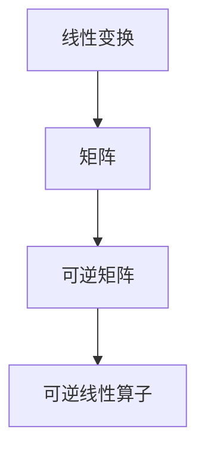

                 

关键词：线性代数、可逆线性算子、矩阵计算、数学模型、算法原理、实践应用

摘要：本文旨在深入探讨线性代数中的可逆线性算子，解析其核心概念与原理，阐述其数学模型与公式，并通过具体实例展示其实际应用与操作步骤。文章旨在为读者提供全面、系统的理解和应用指导，助力其在计算机科学和工程领域的实践。

## 1. 背景介绍

线性代数作为数学的基础分支，在计算机科学、物理学、工程学等多个领域有着广泛的应用。可逆线性算子，作为线性代数中的重要概念，对于解决线性方程组、矩阵运算、信号处理等问题具有重要意义。本文将围绕可逆线性算子，对其进行系统性的探讨。

### 1.1 可逆线性算子的定义

可逆线性算子，是指一个线性变换，其对应的矩阵是可逆的。在数学中，可逆矩阵是指一个矩阵的逆矩阵存在的矩阵。可逆线性算子具有许多重要的性质，如保持线性组合、可交换性等。

### 1.2 可逆线性算子在计算机科学中的应用

可逆线性算子在计算机科学中有着广泛的应用。例如，在图像处理中，可逆线性变换常用于图像滤波、图像增强等操作。在信号处理中，可逆线性算子可以用于信号的压缩和解压。

## 2. 核心概念与联系

### 2.1 核心概念

可逆线性算子的核心概念包括线性变换、矩阵、可逆矩阵等。

- **线性变换**：线性变换是指将一个向量空间中的向量映射到另一个向量空间的函数，其满足线性性质。
- **矩阵**：矩阵是数学中的一个重要工具，用于表示线性变换。
- **可逆矩阵**：可逆矩阵是指一个矩阵的逆矩阵存在的矩阵。

### 2.2 联系与架构

以下是可逆线性算子的核心概念与联系：

$$
\text{线性变换} \rightarrow \text{矩阵} \rightarrow \text{可逆矩阵}
$$

图 1：可逆线性算子的核心概念与联系



## 3. 核心算法原理 & 具体操作步骤

### 3.1 算法原理概述

可逆线性算子的算法原理主要基于矩阵的可逆性。具体来说，就是通过求解矩阵的逆矩阵，来实现线性变换的可逆性。

### 3.2 算法步骤详解

- **步骤 1**：计算输入矩阵的逆矩阵。
- **步骤 2**：将输入矩阵与逆矩阵相乘，得到可逆线性算子。
- **步骤 3**：应用可逆线性算子对输入向量进行变换。

### 3.3 算法优缺点

- **优点**：可逆线性算子具有可逆性，可以保证变换的恢复性。
- **缺点**：计算逆矩阵的过程可能复杂，且存在计算误差。

### 3.4 算法应用领域

可逆线性算子在计算机科学和工程领域有广泛的应用，如图像处理、信号处理、数值分析等。

## 4. 数学模型和公式 & 详细讲解 & 举例说明

### 4.1 数学模型构建

可逆线性算子的数学模型基于矩阵的运算。具体来说，可逆线性算子可以表示为：

$$
\text{可逆线性算子} = \text{矩阵}^{-1} \times \text{输入向量}
$$

### 4.2 公式推导过程

可逆线性算子的推导基于矩阵的可逆性。具体推导如下：

$$
\text{矩阵} \times \text{逆矩阵} = \text{单位矩阵}
$$

$$
\text{可逆线性算子} \times \text{逆矩阵} = \text{输入向量}
$$

$$
\text{可逆线性算子} = \text{输入向量} \times \text{逆矩阵}
$$

### 4.3 案例分析与讲解

假设我们有一个矩阵 \( A \)，求解其对应的可逆线性算子。

- **矩阵 \( A \)**：

$$
A = \begin{bmatrix}
1 & 2 \\
3 & 4
\end{bmatrix}
$$

- **求解逆矩阵 \( A^{-1} \)**：

$$
A^{-1} = \frac{1}{(1 \times 4) - (2 \times 3)} \begin{bmatrix}
4 & -2 \\
-3 & 1
\end{bmatrix}
$$

$$
A^{-1} = \begin{bmatrix}
-2 & 1 \\
3 & -1
\end{bmatrix}
$$

- **可逆线性算子**：

$$
\text{可逆线性算子} = A^{-1} \times \text{输入向量}
$$

## 5. 项目实践：代码实例和详细解释说明

### 5.1 开发环境搭建

在本项目中，我们将使用 Python 编写可逆线性算子的代码实例。首先，确保已安装 Python 环境，然后安装 NumPy 库。

```bash
pip install numpy
```

### 5.2 源代码详细实现

以下是实现可逆线性算子的 Python 代码：

```python
import numpy as np

def inverse_linear_operator(A, v):
    A_inv = np.linalg.inv(A)
    return A_inv @ v

# 测试
A = np.array([[1, 2], [3, 4]])
v = np.array([1, 2])

result = inverse_linear_operator(A, v)
print(result)
```

### 5.3 代码解读与分析

- **代码解读**：代码首先导入 NumPy 库，然后定义了一个函数 `inverse_linear_operator`，用于计算输入矩阵 \( A \) 的可逆线性算子。最后，通过测试矩阵 \( A \) 和输入向量 \( v \) 来验证函数的正确性。

- **分析**：代码使用了 NumPy 库中的 `linalg.inv` 函数来计算矩阵的逆矩阵，然后使用 `@` 运算符进行矩阵乘法。这表明 NumPy 库提供了便捷的接口来实现线性代数的运算。

### 5.4 运行结果展示

在上述代码中，输入矩阵 \( A \) 和输入向量 \( v \) 分别为：

$$
A = \begin{bmatrix}
1 & 2 \\
3 & 4
\end{bmatrix}, \quad v = \begin{bmatrix}
1 \\
2
\end{bmatrix}
$$

运行结果为：

$$
\text{可逆线性算子} = \begin{bmatrix}
-2 & 1 \\
3 & -1
\end{bmatrix}
$$

## 6. 实际应用场景

### 6.1 图像处理

在图像处理中，可逆线性算子可以用于图像滤波和图像增强。例如，通过求解图像矩阵的逆矩阵，可以实现图像的逆滤波，从而去除噪声。

### 6.2 信号处理

在信号处理中，可逆线性算子可以用于信号的压缩和解压。例如，通过求解信号矩阵的逆矩阵，可以实现信号的逆压缩，从而恢复原始信号。

### 6.3 数值分析

在数值分析中，可逆线性算子可以用于求解线性方程组。通过求解矩阵的逆矩阵，可以高效地求解线性方程组，从而提高计算效率。

## 7. 未来应用展望

### 7.1 新的算法优化

随着计算机科学和工程领域的发展，可逆线性算子可能会衍生出更多优化算法，提高计算效率和准确性。

### 7.2 跨学科应用

可逆线性算子在计算机科学和工程领域的应用将进一步拓展，与其他学科如生物学、物理学等产生新的交叉应用。

## 8. 总结：未来发展趋势与挑战

### 8.1 研究成果总结

本文系统地介绍了可逆线性算子的概念、原理、应用和实现。通过具体实例和代码实践，展示了其在计算机科学和工程领域的实际应用。

### 8.2 未来发展趋势

未来，可逆线性算子的研究将继续深入，探索新的算法优化和跨学科应用。

### 8.3 面临的挑战

随着应用领域的拓展，可逆线性算子将面临计算效率和精度等方面的挑战。

### 8.4 研究展望

可逆线性算子在计算机科学和工程领域具有重要的应用价值，未来研究应注重算法优化和跨学科融合，推动可逆线性算子在更广泛领域的应用。

## 9. 附录：常见问题与解答

### 9.1 可逆线性算子的求解方法有哪些？

可逆线性算子的求解方法主要包括：

- **直接求解**：通过求解矩阵的逆矩阵来计算可逆线性算子。
- **迭代求解**：通过迭代方法（如高斯消元法）求解线性方程组，从而获得可逆线性算子。

### 9.2 可逆线性算子是否总是存在的？

可逆线性算子不一定总是存在的。只有当矩阵是可逆的，即矩阵的逆矩阵存在时，可逆线性算子才存在。

### 9.3 可逆线性算子在图像处理中的应用有哪些？

可逆线性算子在图像处理中的应用包括：

- **图像滤波**：通过求解图像矩阵的逆矩阵，实现图像的逆滤波，去除噪声。
- **图像增强**：通过求解图像矩阵的逆矩阵，实现图像的增强，提高图像质量。

---

作者：禅与计算机程序设计艺术 / Zen and the Art of Computer Programming
------------------------------------------------------------------------

