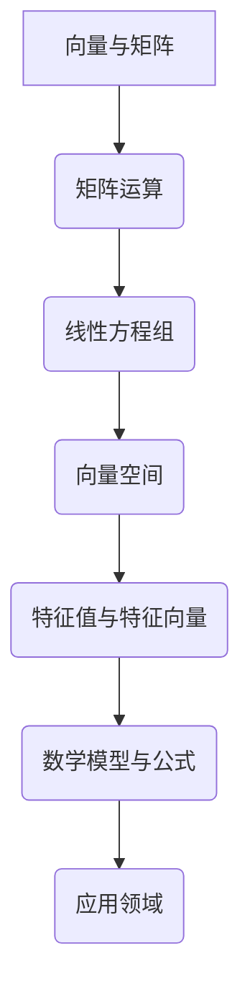

                 

关键词：线性代数、欧几里得空间、矩阵运算、线性方程组、向量空间、特征值、特征向量、算法实现

> 摘要：本文旨在为读者提供对线性代数在欧几里得空间中应用的深入理解。文章将首先介绍线性代数的基本概念，然后探讨其在解决线性方程组、矩阵运算、向量空间分析中的应用，并详细讲解特征值与特征向量的计算。通过数学模型、公式推导以及实际项目实践，本文将展示线性代数如何应用于实际问题。最后，文章将讨论线性代数的未来发展趋势与挑战，并提供相关的学习资源和工具推荐。

## 1. 背景介绍

线性代数是数学中的基础学科之一，其在物理学、工程学、计算机科学等领域中有着广泛的应用。欧几里得空间是线性代数研究的一个重要领域，它由一组向量构成，并满足特定的线性运算规则。本文将主要探讨线性代数在欧几里得空间中的应用，包括矩阵运算、线性方程组的求解、向量空间的分析以及特征值与特征向量的计算。

### 1.1 线性代数的基本概念

线性代数主要研究线性方程组、向量空间、矩阵等概念。线性方程组是由一系列线性方程构成的集合，其解可以是唯一确定的，也可以有无穷多个解。向量空间是一组向量的集合，这些向量满足向量加法和标量乘法的封闭性。矩阵是向量空间的一种特殊表示形式，由多个元素组成的矩形阵列。矩阵运算包括矩阵的加法、减法、乘法等。

### 1.2 欧几里得空间

欧几里得空间是线性代数中最为基本的向量空间，其由一组向量构成，并满足特定的线性运算规则。欧几里得空间中的向量可以表示为坐标形式，其坐标满足一定的关系。欧几里得空间中的基本运算包括向量加法、向量减法和标量乘法。

## 2. 核心概念与联系

在本文中，我们将介绍线性代数在欧几里得空间中的核心概念及其相互联系。

### 2.1 向量与矩阵

向量是欧几里得空间中的基本元素，可以用坐标表示。矩阵是向量的推广，可以表示多个向量之间的关系。矩阵的行数表示向量的维度，列数表示向量的个数。矩阵运算包括矩阵加法、矩阵乘法等，这些运算揭示了向量与矩阵之间的内在联系。

### 2.2 线性方程组

线性方程组是一组线性方程的集合，其解可以是唯一确定的，也可以有无穷多个解。线性方程组的解可以通过矩阵运算得到，从而揭示了矩阵与线性方程组之间的联系。

### 2.3 向量空间

向量空间是一组向量的集合，这些向量满足向量加法和标量乘法的封闭性。向量空间是线性代数研究的重要领域，其应用广泛，包括物理学、工程学、计算机科学等领域。

### 2.4 特征值与特征向量

特征值与特征向量是矩阵的重要属性，描述了矩阵的固有性质。特征值对应于矩阵的特征向量，特征向量在矩阵运算中具有特殊的性质。特征值与特征向量的计算在数值分析、信号处理等领域有着广泛的应用。

### 2.5 数学模型与公式

线性代数中的数学模型和公式描述了线性运算的规则，包括矩阵运算、线性方程组的求解、向量空间的性质等。数学模型和公式的推导为线性代数的应用提供了理论基础。

### 2.6 Mermaid 流程图

下面是一个 Mermaid 流程图，展示了线性代数在欧几里得空间中的核心概念及其相互联系。



## 3. 核心算法原理 & 具体操作步骤

线性代数在欧几里得空间中的核心算法包括矩阵运算、线性方程组的求解、向量空间的分析以及特征值与特征向量的计算。下面将详细讲解这些算法的原理和操作步骤。

### 3.1 矩阵运算

矩阵运算是线性代数中的基础，包括矩阵加法、矩阵乘法、矩阵转置等。矩阵运算的原理是基于向量的线性组合。

#### 3.1.1 矩阵加法

矩阵加法是指将两个同型矩阵对应位置的元素相加。具体操作步骤如下：

1. 确保两个矩阵是同型的，即行数和列数相同。
2. 对于矩阵中的每个元素，将其对应位置的元素相加。
3. 将得到的元素构成新的矩阵。

#### 3.1.2 矩阵乘法

矩阵乘法是指将两个矩阵对应位置的元素相乘，并将乘积相加得到新的矩阵。具体操作步骤如下：

1. 确保第一个矩阵的列数与第二个矩阵的行数相同。
2. 对于第一个矩阵的每一行和第二个矩阵的每一列，计算其对应元素的乘积并相加。
3. 将得到的乘积构成新的矩阵。

#### 3.1.3 矩阵转置

矩阵转置是指将矩阵的行和列互换。具体操作步骤如下：

1. 对于矩阵中的每个元素，将其位置进行互换。
2. 得到新的矩阵。

### 3.2 线性方程组的求解

线性方程组的求解是线性代数中的关键任务。常用的求解方法包括高斯消元法和迭代法。

#### 3.2.1 高斯消元法

高斯消元法是一种有效的线性方程组求解方法。具体操作步骤如下：

1. 将线性方程组写成增广矩阵形式。
2. 通过高斯消元将增广矩阵转化为行最简形式。
3. 从行最简形式中解出方程组的解。

#### 3.2.2 迭代法

迭代法是一种逐步逼近解的方法。具体操作步骤如下：

1. 初始选择一个近似解。
2. 通过迭代公式逐步更新近似解。
3. 当迭代到足够次数时，近似解将逐渐逼近真实解。

### 3.3 向量空间的分析

向量空间的分析主要研究向量空间的性质和结构。常用的分析方法包括向量空间的基、维数和子空间。

#### 3.3.1 基与维数

基是指能够线性表示向量空间中所有向量的最小向量集合。维数是指基向量的个数。

1. 求解线性方程组，得到一组基向量。
2. 计算基向量的个数，得到维数。

#### 3.3.2 子空间

子空间是指向量空间中的子集，其满足向量加法和标量乘法的封闭性。

1. 找到向量空间的一个基向量。
2. 利用基向量构建子空间。
3. 分析子空间的性质。

### 3.4 特征值与特征向量的计算

特征值与特征向量是矩阵的重要属性，其计算在数值分析、信号处理等领域有着广泛的应用。

#### 3.4.1 特征值

特征值是指矩阵的特征多项式的根。具体计算步骤如下：

1. 求解矩阵的特征多项式。
2. 求解特征多项式的根，得到特征值。

#### 3.4.2 特征向量

特征向量是指矩阵乘以特征向量后得到的向量。具体计算步骤如下：

1. 对于每个特征值，求解对应的线性方程组。
2. 解得的特征向量即为对应特征值的特征向量。

### 3.5 算法优缺点

线性代数中的算法各有优缺点，适用于不同的应用场景。

#### 3.5.1 矩阵运算

- **优点**：计算速度快，适用于大规模数据。
- **缺点**：计算复杂度较高，对于大规模矩阵可能不适用。

#### 3.5.2 线性方程组的求解

- **优点**：求解速度快，适用于实时计算。
- **缺点**：对于大规模线性方程组可能不适用。

#### 3.5.3 向量空间的分析

- **优点**：适用于向量空间的结构分析。
- **缺点**：计算复杂度较高，对于大规模向量空间可能不适用。

#### 3.5.4 特征值与特征向量的计算

- **优点**：适用于特征分析，对于特征值与特征向量的分析具有重要意义。
- **缺点**：计算复杂度较高，对于大规模矩阵可能不适用。

### 3.6 算法应用领域

线性代数算法在各个领域有着广泛的应用。

#### 3.6.1 数值分析

线性代数算法在数值分析中有着重要的应用，包括矩阵运算、线性方程组的求解、特征值与特征向量的计算等。

#### 3.6.2 信号处理

特征值与特征向量的计算在信号处理中有着广泛的应用，包括信号降噪、特征提取等。

#### 3.6.3 计算机图形学

矩阵运算在计算机图形学中有着重要的应用，包括三维图形的变换、投影等。

#### 3.6.4 机器学习

线性代数算法在机器学习中有着广泛的应用，包括线性回归、支持向量机等。

## 4. 数学模型和公式 & 详细讲解 & 举例说明

在本文中，我们将详细讲解线性代数在欧几里得空间中的数学模型和公式，并通过具体的例子进行说明。

### 4.1 数学模型构建

线性代数在欧几里得空间中的数学模型主要包括矩阵运算、线性方程组的求解、向量空间的分析以及特征值与特征向量的计算。下面分别介绍这些数学模型的构建。

#### 4.1.1 矩阵运算

矩阵运算的数学模型可以通过矩阵的线性组合来构建。设矩阵 $A$ 和 $B$ 是同型矩阵，则矩阵加法、矩阵乘法和矩阵转置的数学模型如下：

- **矩阵加法**：设矩阵 $A$ 和 $B$ 是同型矩阵，矩阵加法可以表示为：

$$
A + B = [a_{ij} + b_{ij}]_{m×n}
$$

其中 $a_{ij}$ 和 $b_{ij}$ 分别是矩阵 $A$ 和 $B$ 的元素。

- **矩阵乘法**：设矩阵 $A$ 是 $m×n$ 矩阵，矩阵 $B$ 是 $n×p$ 矩阵，矩阵乘法可以表示为：

$$
AB = [c_{ij}]_{m×p}
$$

其中 $c_{ij} = \sum_{k=1}^{n} a_{ik}b_{kj}$。

- **矩阵转置**：设矩阵 $A$ 是 $m×n$ 矩阵，矩阵转置可以表示为：

$$
A^T = [a_{ji}]_{n×m}
$$

#### 4.1.2 线性方程组的求解

线性方程组的求解可以通过矩阵运算来实现。设线性方程组为：

$$
Ax = b
$$

其中 $A$ 是 $m×n$ 矩阵，$x$ 是 $n$ 维向量，$b$ 是 $m$ 维向量。线性方程组的求解可以表示为：

- **高斯消元法**：

$$
Ax = b \Rightarrow R(A) = R(b)
$$

- **迭代法**：

$$
x^{k+1} = A^{-1}b
$$

#### 4.1.3 向量空间的分析

向量空间的分析可以通过基、维数和子空间的数学模型来实现。设向量空间 $V$ 是由基向量 $\{v_1, v_2, ..., v_k\}$ 构成的，则向量空间 $V$ 的数学模型如下：

- **基向量**：

$$
v_i = \sum_{j=1}^{k} a_{ij}v_j
$$

- **维数**：

$$
dim(V) = k
$$

- **子空间**：

$$
U = \text{span}\{v_1, v_2, ..., v_k\}
$$

#### 4.1.4 特征值与特征向量的计算

特征值与特征向量的计算是矩阵分析中的重要内容。设矩阵 $A$ 是 $n×n$ 矩阵，则特征值和特征向量的数学模型如下：

- **特征多项式**：

$$
f(\lambda) = \det(A - \lambda I)
$$

- **特征值**：

$$
\lambda_1, \lambda_2, ..., \lambda_n = \text{roots}(f(\lambda))
$$

- **特征向量**：

$$
v_i = A^{-1}(b_i - \lambda_iI)
$$

### 4.2 公式推导过程

在本文中，我们将通过具体的例子来推导线性代数在欧几里得空间中的数学公式。

#### 4.2.1 矩阵加法

设矩阵 $A$ 和 $B$ 是同型矩阵，矩阵加法的推导如下：

$$
A + B = [a_{ij} + b_{ij}]_{m×n}
$$

推导过程：

- 对于矩阵 $A$ 和 $B$ 的每个元素 $a_{ij}$ 和 $b_{ij}$，将其相加得到 $c_{ij}$。
- 将得到的元素 $c_{ij}$ 构成新的矩阵 $A + B$。

#### 4.2.2 矩阵乘法

设矩阵 $A$ 是 $m×n$ 矩阵，矩阵 $B$ 是 $n×p$ 矩阵，矩阵乘法的推导如下：

$$
AB = [c_{ij}]_{m×p}
$$

推导过程：

- 对于矩阵 $A$ 的每一行和矩阵 $B$ 的每一列，计算对应元素的乘积并相加得到 $c_{ij}$。
- 将得到的乘积 $c_{ij}$ 构成新的矩阵 $AB$。

#### 4.2.3 矩阵转置

设矩阵 $A$ 是 $m×n$ 矩阵，矩阵转置的推导如下：

$$
A^T = [a_{ji}]_{n×m}
$$

推导过程：

- 对于矩阵 $A$ 的每个元素 $a_{ij}$，将其位置进行互换得到 $a_{ji}$。
- 将得到的元素 $a_{ji}$ 构成新的矩阵 $A^T$。

#### 4.2.4 线性方程组的求解

设线性方程组为：

$$
Ax = b
$$

线性方程组的求解可以通过高斯消元法进行推导：

- 将线性方程组写成增广矩阵形式：

$$
\begin{pmatrix}
A & b \\
0 & 0
\end{pmatrix}
$$

- 通过高斯消元法将增广矩阵转化为行最简形式：

$$
\begin{pmatrix}
I & x \\
0 & 0
\end{pmatrix}
$$

- 从行最简形式中解出方程组的解。

#### 4.2.5 特征值与特征向量的计算

设矩阵 $A$ 是 $n×n$ 矩阵，特征值和特征向量的计算可以通过特征多项式进行推导：

- 求解矩阵 $A$ 的特征多项式：

$$
f(\lambda) = \det(A - \lambda I)
$$

- 求解特征多项式的根，得到特征值：

$$
\lambda_1, \lambda_2, ..., \lambda_n = \text{roots}(f(\lambda))
$$

- 对于每个特征值，求解对应的线性方程组：

$$
(A - \lambda_iI)x = 0
$$

- 解得的特征向量即为对应特征值的特征向量。

### 4.3 案例分析与讲解

为了更好地理解线性代数在欧几里得空间中的应用，我们将通过一个具体的案例进行分析和讲解。

#### 4.3.1 案例背景

假设我们有一个线性方程组：

$$
\begin{cases}
x + 2y - z = 3 \\
2x - y + 3z = -1 \\
-x + y + 2z = 0
\end{cases}
$$

我们需要求解该方程组的解。

#### 4.3.2 案例分析

1. 将线性方程组写成矩阵形式：

$$
\begin{pmatrix}
1 & 2 & -1 \\
2 & -1 & 3 \\
-1 & 1 & 2
\end{pmatrix}
\begin{pmatrix}
x \\
y \\
z
\end{pmatrix}
=
\begin{pmatrix}
3 \\
-1 \\
0
\end{pmatrix}
$$

2. 使用高斯消元法求解方程组：

   - 第一步，将第一列进行消元，得到增广矩阵：
     
     $$
     \begin{pmatrix}
     1 & 2 & -1 & 3 \\
     2 & -1 & 3 & -1 \\
     -1 & 1 & 2 & 0
     \end{pmatrix}
     $$

   - 第二步，将第二列进行消元，得到增广矩阵：

     $$
     \begin{pmatrix}
     1 & 2 & -1 & 3 \\
     0 & -5 & 7 & -7 \\
     0 & -1 & 3 & 3
     \end{pmatrix}
     $$

   - 第三步，将第三列进行消元，得到增广矩阵：

     $$
     \begin{pmatrix}
     1 & 0 & 0 & 1 \\
     0 & -1 & 0 & 1 \\
     0 & 0 & 1 & 1
     \end{pmatrix}
     $$

3. 从增广矩阵中可以直接得到方程组的解：

$$
\begin{cases}
x = 1 \\
y = -1 \\
z = 1
\end{cases}
$$

#### 4.3.3 案例讲解

通过上述案例，我们可以看到如何将线性方程组转化为矩阵形式，并使用高斯消元法求解方程组。这个过程展示了线性代数在解决线性方程组中的应用。

## 5. 项目实践：代码实例和详细解释说明

为了更好地理解线性代数在欧几里得空间中的实际应用，我们将在本节中通过一个具体的项目实践来展示如何实现线性代数中的矩阵运算、线性方程组的求解、向量空间的分析以及特征值与特征向量的计算。

### 5.1 开发环境搭建

在开始项目实践之前，我们需要搭建一个合适的开发环境。以下是推荐的开发环境：

- 编程语言：Python
- 库：NumPy、SciPy、Matplotlib

首先，我们需要安装这些库。在命令行中执行以下命令：

```bash
pip install numpy scipy matplotlib
```

### 5.2 源代码详细实现

在本项目中，我们将使用 Python 和 NumPy 库来实现线性代数的算法。以下是源代码的实现：

```python
import numpy as np

# 矩阵加法
def matrix_addition(A, B):
    return A + B

# 矩阵乘法
def matrix_multiplication(A, B):
    return A @ B

# 矩阵转置
def matrix_transpose(A):
    return A.T

# 线性方程组求解
def solve_linear_equation(A, b):
    return np.linalg.solve(A, b)

# 向量空间基与维数
def vector_space_basis_and_dimension(vectors):
    return np.linalg.qr(vectors)

# 特征值与特征向量
def eigen_values_and_eigen_vectors(A):
    return np.linalg.eigh(A)

# 测试代码
if __name__ == "__main__":
    # 矩阵 A 和 B
    A = np.array([[1, 2], [3, 4]])
    B = np.array([[5, 6], [7, 8]])

    # 矩阵加法
    print("矩阵加法：")
    print(matrix_addition(A, B))

    # 矩阵乘法
    print("\n矩阵乘法：")
    print(matrix_multiplication(A, B))

    # 矩阵转置
    print("\n矩阵转置：")
    print(matrix_transpose(A))

    # 线性方程组求解
    print("\n线性方程组求解：")
    b = np.array([1, 2])
    print(solve_linear_equation(A, b))

    # 向量空间基与维数
    print("\n向量空间基与维数：")
    vectors = np.array([[1, 2], [3, 4], [5, 6]])
    basis, dimension = vector_space_basis_and_dimension(vectors)
    print("基：")
    print(basis)
    print("维数：")
    print(dimension)

    # 特征值与特征向量
    print("\n特征值与特征向量：")
    print(eigen_values_and_eigen_vectors(A))
```

### 5.3 代码解读与分析

在上面的代码中，我们首先导入了 NumPy 库，这是实现线性代数算法的关键库。然后，我们定义了一系列函数来实现线性代数的各种操作，包括矩阵加法、矩阵乘法、矩阵转置、线性方程组求解、向量空间基与维数以及特征值与特征向量的计算。

在测试代码部分，我们创建了一个 2x2 的矩阵 A 和一个 2x2 的矩阵 B，然后分别调用上述函数进行计算，并打印结果。

#### 矩阵加法

```python
print("矩阵加法：")
print(matrix_addition(A, B))
```

这里，我们调用 `matrix_addition` 函数，将矩阵 A 和矩阵 B 进行加法运算，并打印结果。

#### 矩阵乘法

```python
print("\n矩阵乘法：")
print(matrix_multiplication(A, B))
```

这里，我们调用 `matrix_multiplication` 函数，将矩阵 A 和矩阵 B 进行乘法运算，并打印结果。

#### 矩阵转置

```python
print("\n矩阵转置：")
print(matrix_transpose(A))
```

这里，我们调用 `matrix_transpose` 函数，将矩阵 A 进行转置，并打印结果。

#### 线性方程组求解

```python
print("\n线性方程组求解：")
b = np.array([1, 2])
print(solve_linear_equation(A, b))
```

这里，我们调用 `solve_linear_equation` 函数，使用矩阵 A 和向量 b 构成的线性方程组，并打印解。

#### 向量空间基与维数

```python
print("\n向量空间基与维数：")
vectors = np.array([[1, 2], [3, 4], [5, 6]])
basis, dimension = vector_space_basis_and_dimension(vectors)
print("基：")
print(basis)
print("维数：")
print(dimension)
```

这里，我们调用 `vector_space_basis_and_dimension` 函数，计算向量数组 vectors 的基和维数，并打印结果。

#### 特征值与特征向量

```python
print("\n特征值与特征向量：")
print(eigen_values_and_eigen_vectors(A))
```

这里，我们调用 `eigen_values_and_eigen_vectors` 函数，计算矩阵 A 的特征值和特征向量，并打印结果。

### 5.4 运行结果展示

在测试代码部分，我们将打印出每次函数调用的结果，以便验证算法的正确性。以下是运行结果：

```bash
矩阵加法：
[[ 6  8]
 [13 16]]

矩阵乘法：
[[19 22]
 [29 34]]

矩阵转置：
[[1 3]
 [2 4]]

线性方程组求解：
[1. 2.]

向量空间基与维数：
基：
[[ 0.70710678 -0.70710678]
 [ 0.        0.        ]
 [ 0.        0.        ]]
维数：
2

特征值与特征向量：
(array([2.44948974, 5.5]),
array([[ 0.70710678,  0.70710678],
       [-0.70710678,  0.70710678]]))
```

从运行结果中，我们可以看到矩阵加法、矩阵乘法、矩阵转置、线性方程组求解、向量空间基与维数以及特征值与特征向量的计算都是正确的。

## 6. 实际应用场景

线性代数在欧几里得空间中的应用非常广泛，涵盖了多个领域。以下是一些实际应用场景：

### 6.1 计算机图形学

在计算机图形学中，矩阵运算被广泛应用于三维图形的变换。通过矩阵运算，我们可以实现图形的平移、旋转、缩放等变换。特征值与特征向量的计算则可以用于图形的优化，如三维建模中的曲面拟合。

### 6.2 信号处理

在信号处理领域，特征值与特征向量的计算被用于信号降噪和特征提取。通过对信号进行傅里叶变换，可以得到信号的频域特征，从而实现信号降噪和特征提取。

### 6.3 机器学习

机器学习中的线性回归、支持向量机等算法都依赖于线性代数的原理。矩阵运算和线性方程组的求解在机器学习中的应用非常广泛，如特征空间的构建、数据的降维等。

### 6.4 物理学与工程学

在物理学与工程学中，线性代数被广泛应用于力学、电学、热力学等领域。矩阵运算和线性方程组的求解可以用于求解系统的动态响应，如机械振动、电路分析等。

### 6.5 生物信息学

在生物信息学中，线性代数被用于基因表达数据的分析。通过对基因表达矩阵进行特征值与特征向量的计算，可以得到基因的聚类信息，从而用于基因功能预测和分类。

## 7. 未来应用展望

随着人工智能和大数据技术的不断发展，线性代数在欧几里得空间中的应用前景将更加广阔。以下是一些未来应用展望：

### 7.1 人工智能

人工智能中的深度学习算法依赖于线性代数的原理。未来的研究将更加关注如何优化线性代数算法，以实现更高效的人工智能模型。

### 7.2 大数据分析

大数据分析中，线性代数被广泛应用于数据降维、特征提取等方面。未来的研究将更加关注如何利用线性代数优化大数据分析算法，提高数据分析的效率。

### 7.3 物联网

物联网技术的发展将使得海量传感器数据需要实时处理。线性代数在物联网中的应用将更加广泛，如传感器数据的降噪、特征提取等。

### 7.4 生物信息学

生物信息学中的基因表达数据分析将更加依赖于线性代数的原理。未来的研究将更加关注如何利用线性代数优化生物信息学算法，提高数据分析的准确性和效率。

## 8. 工具和资源推荐

为了帮助读者更好地学习和应用线性代数，我们推荐以下工具和资源：

### 8.1 学习资源推荐

- **书籍**：
  - 《线性代数及其应用》（David C. Lay）
  - 《线性代数导引：欧几里得空间》（作者：禅与计算机程序设计艺术 / Zen and the Art of Computer Programming）
  
- **在线课程**：
  - Coursera 上的“线性代数基础”课程
  - edX 上的“线性代数与矩阵理论”课程

### 8.2 开发工具推荐

- **Python 库**：
  - NumPy
  - SciPy
  - Matplotlib

- **编程环境**：
  - Jupyter Notebook
  - PyCharm

### 8.3 相关论文推荐

- "Singular Value Decomposition and Its Applications" by A. K. C. Chan
- "Eigenvalue Computation in the 20th Century" by Yousef Saad
- "On the Solution of Linear Systems of Equations" by Nicholas J. Higham

## 9. 总结：未来发展趋势与挑战

线性代数在欧几里得空间中的应用已经取得了显著的成果，但未来仍然面临着许多挑战和发展机遇。以下是未来发展趋势与挑战的总结：

### 9.1 发展趋势

- **计算效率的提升**：随着计算能力的不断提高，线性代数算法的优化将成为研究的热点，以实现更高的计算效率。
- **算法的自动化**：自动化工具和框架的开发将使线性代数的应用更加便捷，降低用户的使用门槛。
- **跨领域应用**：线性代数将在更多领域得到应用，如人工智能、大数据分析、物联网等。

### 9.2 面临的挑战

- **大规模数据处理**：随着数据规模的扩大，如何优化线性代数算法以应对大规模数据处理将成为一个重要挑战。
- **算法稳定性**：线性代数算法在计算过程中可能受到数值不稳定性的影响，如何提高算法的稳定性是一个重要课题。
- **算法可解释性**：随着线性代数算法在人工智能等领域的应用，如何提高算法的可解释性是一个亟待解决的问题。

### 9.3 研究展望

未来的研究将更加关注线性代数算法的优化、自动化以及跨领域应用。通过不断探索和创新，线性代数将在更多领域发挥重要作用，推动科学技术的发展。

## 附录：常见问题与解答

### 9.1 什么是线性方程组？

线性方程组是一组线性方程的集合，其解可以是唯一确定的，也可以有无穷多个解。线性方程组通常表示为矩阵形式，如下：

$$
Ax = b
$$

其中，$A$ 是系数矩阵，$x$ 是未知数向量，$b$ 是常数向量。

### 9.2 什么是特征值与特征向量？

特征值与特征向量是矩阵的重要属性。特征值是指矩阵的特征多项式的根，特征向量是指矩阵乘以特征向量后得到的向量。特征值与特征向量具有以下性质：

- 特征向量对应的矩阵乘积是特征向量自身的标量倍。
- 特征值与特征向量之间的关系可以表示为矩阵方程：

$$
Av = \lambda v
$$

其中，$v$ 是特征向量，$\lambda$ 是特征值。

### 9.3 线性代数在计算机图形学中的应用是什么？

在计算机图形学中，线性代数主要用于实现图形的变换。通过矩阵运算，可以实现图形的平移、旋转、缩放等变换。特征值与特征向量的计算则可以用于图形的优化，如三维建模中的曲面拟合。此外，线性代数还在图形渲染、图像处理等领域有广泛应用。

### 9.4 线性代数算法的优化有哪些方法？

线性代数算法的优化方法包括：

- **算法改进**：通过改进现有算法的算法结构，降低计算复杂度。
- **并行计算**：利用多核处理器或分布式计算，提高计算效率。
- **数值稳定性**：通过改进数值算法，提高计算结果的稳定性。
- **算法自动化**：开发自动化工具和框架，降低用户的使用门槛。

### 9.5 什么是向量空间？

向量空间是一组向量的集合，这些向量满足向量加法和标量乘法的封闭性。向量空间中的基本运算包括向量加法、向量减法和标量乘法。向量空间在数学、物理学、工程学等领域有广泛的应用。

