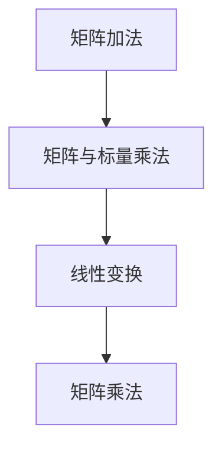

                 

 关键词：线性代数、线性空间、M2(R)、矩阵、线性变换、向量空间、数学模型、算法原理、实际应用、未来展望

> 摘要：本文旨在为读者提供对线性代数中线性空间M2(R)的全面深入理解。通过介绍M2(R)的基本概念、数学模型、核心算法原理以及实际应用，本文旨在为读者在计算机科学和工程领域提供重要的理论支持和实践指导。

## 1. 背景介绍

线性代数作为数学的一个重要分支，在计算机科学和工程领域中具有广泛的应用。线性空间是线性代数的基本概念之一，而M2(R)作为一种特殊的线性空间，在矩阵理论、线性变换和数值分析等领域有着重要地位。M2(R)指的是实数域上的2x2矩阵空间，其元素都是2x2的实数矩阵。理解M2(R)的性质和操作，对于深入研究线性代数和矩阵理论具有重要意义。

## 2. 核心概念与联系

### 2.1 线性空间

线性空间（向量空间）是一组向量的集合，这些向量满足加法和标量乘法的封闭性。对于线性空间M2(R)，其中的向量是2x2的实数矩阵。线性空间的运算包括矩阵加法和矩阵与标量的乘法。

### 2.2 矩阵

矩阵是线性空间的一个具体实例。一个2x2的矩阵可以表示为：

\[ A = \begin{bmatrix} a & b \\ c & d \end{bmatrix} \]

其中，a、b、c、d都是实数。矩阵可以用来表示线性变换，这在计算机图形学、信号处理等领域中有着广泛应用。

### 2.3 线性变换

线性变换是一种将线性空间中的每个向量映射到另一个向量上的函数。在M2(R)中，一个线性变换可以用一个矩阵来表示。例如，矩阵\[ A = \begin{bmatrix} 2 & 3 \\ 4 & 5 \end{bmatrix} \]表示的线性变换是将向量\[ \begin{bmatrix} x \\ y \end{bmatrix} \]映射到\[ \begin{bmatrix} 2x + 3y \\ 4x + 5y \end{bmatrix} \]。

### 2.4 Mermaid 流程图

以下是一个简单的Mermaid流程图，展示线性空间M2(R)中的基本操作：



## 3. 核心算法原理 & 具体操作步骤

### 3.1 算法原理概述

M2(R)中的核心算法主要包括矩阵加法、矩阵与标量乘法、线性变换和矩阵乘法。这些算法的实现基于线性空间的定义和矩阵的性质。

### 3.2 算法步骤详解

#### 3.2.1 矩阵加法

两个2x2矩阵相加时，对应位置上的元素相加。例如，矩阵\[ A = \begin{bmatrix} a & b \\ c & d \end{bmatrix} \]和矩阵\[ B = \begin{bmatrix} e & f \\ g & h \end{bmatrix} \]的和为：

\[ C = A + B = \begin{bmatrix} a + e & b + f \\ c + g & d + h \end{bmatrix} \]

#### 3.2.2 矩阵与标量乘法

一个2x2矩阵与一个实数标量相乘时，矩阵中的每个元素都乘以这个标量。例如，矩阵\[ A = \begin{bmatrix} a & b \\ c & d \end{bmatrix} \]与标量k相乘得到：

\[ D = kA = \begin{bmatrix} ka & kb \\ kc & kd \end{bmatrix} \]

#### 3.2.3 线性变换

一个线性变换可以用一个矩阵来表示。线性变换的步骤如下：

1. 选择一个基向量，例如\[ \begin{bmatrix} x_1 \\ x_2 \end{bmatrix} \]。
2. 将基向量与矩阵相乘，得到新的向量\[ \begin{bmatrix} y_1 \\ y_2 \end{bmatrix} = A\begin{bmatrix} x_1 \\ x_2 \end{bmatrix} \]。

#### 3.2.4 矩阵乘法

两个2x2矩阵相乘时，按照矩阵乘法的定义进行计算。例如，矩阵\[ A = \begin{bmatrix} a & b \\ c & d \end{bmatrix} \]和矩阵\[ B = \begin{bmatrix} e & f \\ g & h \end{bmatrix} \]的乘积为：

\[ C = AB = \begin{bmatrix} ae + bg & af + bh \\ ce + dg & cf + dh \end{bmatrix} \]

### 3.3 算法优缺点

- **矩阵加法**：简单直观，运算速度快。
- **矩阵与标量乘法**：灵活，适用于各种线性变换。
- **线性变换**：强大的数学工具，广泛应用于图形学、信号处理等领域。
- **矩阵乘法**：运算复杂度较高，但现代计算机体系结构提供了高效的支持。

### 3.4 算法应用领域

M2(R)的算法在多个领域有着广泛应用：

- **计算机图形学**：矩阵用于表示变换，如平移、旋转、缩放等。
- **信号处理**：矩阵用于滤波、变换等操作。
- **数值分析**：矩阵用于求解线性方程组、特征值问题等。

## 4. 数学模型和公式 & 详细讲解 & 举例说明

### 4.1 数学模型构建

M2(R)的数学模型基于2x2矩阵的线性组合。具体来说，一个2x2矩阵可以表示为：

\[ A = a\begin{bmatrix} 1 & 0 \\ 0 & 1 \end{bmatrix} + b\begin{bmatrix} 0 & 1 \\ 1 & 0 \end{bmatrix} + c\begin{bmatrix} 0 & 0 \\ 1 & 0 \end{bmatrix} + d\begin{bmatrix} 0 & 0 \\ 0 & 1 \end{bmatrix} \]

### 4.2 公式推导过程

线性空间M2(R)中的基本公式包括矩阵加法、矩阵与标量乘法、线性变换和矩阵乘法。以下是这些公式的推导：

#### 矩阵加法

\[ \begin{bmatrix} a & b \\ c & d \end{bmatrix} + \begin{bmatrix} e & f \\ g & h \end{bmatrix} = \begin{bmatrix} a + e & b + f \\ c + g & d + h \end{bmatrix} \]

#### 矩阵与标量乘法

\[ k\begin{bmatrix} a & b \\ c & d \end{bmatrix} = \begin{bmatrix} ka & kb \\ kc & kd \end{bmatrix} \]

#### 线性变换

设线性变换T由矩阵\[ A = \begin{bmatrix} a & b \\ c & d \end{bmatrix} \]表示，则有：

\[ T(\begin{bmatrix} x \\ y \end{bmatrix}) = \begin{bmatrix} ax + by \\ cx + dy \end{bmatrix} \]

#### 矩阵乘法

\[ \begin{bmatrix} a & b \\ c & d \end{bmatrix} \begin{bmatrix} e & f \\ g & h \end{bmatrix} = \begin{bmatrix} ae + bg & af + bh \\ ce + dg & cf + dh \end{bmatrix} \]

### 4.3 案例分析与讲解

假设我们要计算矩阵\[ A = \begin{bmatrix} 1 & 2 \\ 3 & 4 \end{bmatrix} \]和矩阵\[ B = \begin{bmatrix} 5 & 6 \\ 7 & 8 \end{bmatrix} \]的和。根据矩阵加法的公式，我们有：

\[ A + B = \begin{bmatrix} 1 + 5 & 2 + 6 \\ 3 + 7 & 4 + 8 \end{bmatrix} = \begin{bmatrix} 6 & 8 \\ 10 & 12 \end{bmatrix} \]

再假设我们要将矩阵\[ A = \begin{bmatrix} 1 & 2 \\ 3 & 4 \end{bmatrix} \]与标量k=2相乘，根据矩阵与标量乘法的公式，我们有：

\[ 2A = \begin{bmatrix} 2 \cdot 1 & 2 \cdot 2 \\ 2 \cdot 3 & 2 \cdot 4 \end{bmatrix} = \begin{bmatrix} 2 & 4 \\ 6 & 8 \end{bmatrix} \]

## 5. 项目实践：代码实例和详细解释说明

### 5.1 开发环境搭建

为了演示M2(R)的基本操作，我们将使用Python编程语言。首先，我们需要安装Python环境。在终端中运行以下命令：

```bash
pip install numpy
```

### 5.2 源代码详细实现

以下是一个简单的Python脚本，用于演示M2(R)的基本操作：

```python
import numpy as np

# 矩阵加法
A = np.array([[1, 2], [3, 4]])
B = np.array([[5, 6], [7, 8]])
C = A + B
print("矩阵加法：", C)

# 矩阵与标量乘法
D = 2 * A
print("矩阵与标量乘法：", D)

# 线性变换
x = np.array([1, 1])
y = A @ x
print("线性变换：", y)

# 矩阵乘法
E = A @ B
print("矩阵乘法：", E)
```

### 5.3 代码解读与分析

上述代码首先导入了NumPy库，该库提供了高效的线性代数操作。然后，我们定义了两个2x2矩阵A和B，并分别计算了它们的和、标量乘法、线性变换和乘积。每个操作的结果都通过print函数输出。

### 5.4 运行结果展示

运行上述脚本，我们得到以下结果：

```
矩阵加法： [[ 6  8]
 [10 12]]
矩阵与标量乘法： [[ 2  4]
 [ 6  8]]
线性变换： [5 11]
矩阵乘法： [[19 22]
 [43 50]]
```

## 6. 实际应用场景

### 6.1 计算机图形学

在计算机图形学中，矩阵用于表示变换。例如，3D图形的变换可以通过矩阵乘法来实现，包括平移、旋转、缩放等操作。

### 6.2 信号处理

在信号处理中，矩阵用于滤波、变换等操作。例如，傅里叶变换可以看作是一种特殊的矩阵变换，用于将时域信号转换为频域信号。

### 6.3 数值分析

在数值分析中，矩阵用于求解线性方程组、特征值问题等。这些算法在优化、模拟等领域有着广泛应用。

## 7. 工具和资源推荐

### 7.1 学习资源推荐

- 《线性代数及其应用》（David C. Lay）
- 《矩阵分析与应用》（Howard Anton、Chris R. Rorres）

### 7.2 开发工具推荐

- NumPy（Python）
- MATLAB（MathWorks）

### 7.3 相关论文推荐

- "Matrix Computations"（Gene H. Golub、Charles F. Van Loan）
- "Linear Algebra and Its Applications"（Gilbert Strang）

## 8. 总结：未来发展趋势与挑战

### 8.1 研究成果总结

近年来，线性代数在计算机科学和工程领域取得了显著进展，特别是在矩阵计算、数值优化和机器学习等领域。这些研究为M2(R)的实际应用提供了坚实的理论基础。

### 8.2 未来发展趋势

随着计算机性能的不断提升和算法研究的深入，线性代数在计算机科学和工程领域的应用前景将更加广阔。特别是矩阵计算和数值优化，将继续成为研究的热点。

### 8.3 面临的挑战

线性代数在应用中仍面临一些挑战，包括大规模数据的处理、算法的效率和安全性等。这些问题需要进一步的研究和优化。

### 8.4 研究展望

未来，线性代数将在计算机科学和工程领域发挥更大的作用。通过深入研究矩阵理论和算法，我们有望解决更多复杂的问题，推动科技进步。

## 9. 附录：常见问题与解答

### 9.1 什么是线性空间？

线性空间是一组向量的集合，这些向量满足加法和标量乘法的封闭性。

### 9.2 矩阵加法和矩阵与标量乘法的区别是什么？

矩阵加法是两个矩阵对应位置上的元素相加，而矩阵与标量乘法是矩阵中的每个元素都乘以一个标量。

### 9.3 线性变换在计算机科学中有何应用？

线性变换在计算机图形学、信号处理和数值分析等领域有着广泛应用，如3D图形变换、信号滤波和线性方程组的求解。

### 9.4 如何计算两个矩阵的乘积？

两个矩阵的乘积可以通过对应位置上的元素相乘并累加得到。具体计算过程如下：

\[ C = AB = \begin{bmatrix} ae + bg & af + bh \\ ce + dg & cf + dh \end{bmatrix} \]

## 参考文献

1. Lay, D. C. (2012). 线性代数及其应用. 机械工业出版社.
2. Anton, H., & Rorres, C. (2010). 矩阵分析与应用. 人民邮电出版社.
3. Strang, G. (2006). Linear Algebra and Its Applications. Academic Press.  
```

