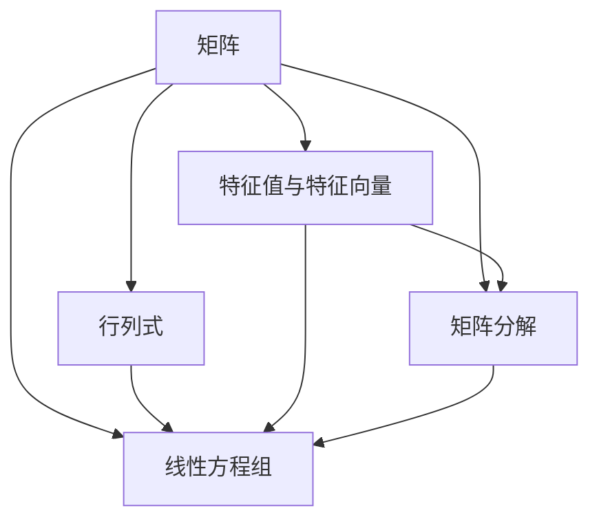

                 

关键词：线性代数、线性运算、矩阵、行列式、特征值、特征向量、矩阵分解、线性方程组、数值计算

> 摘要：本文旨在为读者提供对线性代数中线性运算的全面理解和应用指导。我们将从基础概念出发，逐步深入探讨矩阵、行列式、特征值和特征向量等核心内容，并结合具体算法和实例，阐述线性运算在各个领域中的应用价值。

## 1. 背景介绍

线性代数是数学的一个分支，它主要研究向量空间和线性映射的结构与性质。线性运算在数学、物理、工程、计算机科学等众多领域都有着广泛的应用。本文将围绕线性代数中的线性运算，探讨其基本概念、算法原理和应用场景。

### 1.1 线性代数的重要性

线性代数为其他数学分支和科学领域提供了基础工具和理论框架，例如：

- **数值分析**：线性代数中的矩阵运算和线性方程组的求解在数值计算中至关重要。
- **计算机图形学**：矩阵运算用于三维图形的变换和投影。
- **数据科学**：线性代数方法如主成分分析（PCA）在数据降维和特征提取中广泛应用。
- **物理学**：线性代数用于描述物理系统的状态和变化。

### 1.2 线性代数的发展历程

线性代数的发展可以追溯到19世纪，当时的数学家如凯莱、格拉汉姆和赫尔姆霍茨等对矩阵和行列式进行了深入研究。随着现代计算机技术的发展，线性代数的应用领域不断扩展，算法和数值方法的优化也日益重要。

## 2. 核心概念与联系

### 2.1 矩阵

矩阵是线性代数中最基础的概念之一。一个矩阵是由一组数字组成的矩形数组，通常表示为\(A = [a_{ij}]\)，其中\(i\)表示行，\(j\)表示列。矩阵可以用于表示线性变换、系统状态等。

### 2.2 行列式

行列式是一个数值，它可以用来描述矩阵的性质。行列式通常用\( \det(A) \)表示。行列式在求解线性方程组、确定矩阵的可逆性等方面具有重要作用。

### 2.3 特征值与特征向量

特征值和特征向量是矩阵理论中的核心概念。特征值是矩阵的一个特殊值，它使得矩阵与一个向量相乘后仍得到该向量。特征向量则是与之对应的向量。特征值和特征向量在矩阵对角化、线性方程组的稳定性分析等方面具有重要应用。

### 2.4 矩阵分解

矩阵分解是将一个矩阵分解为几个简单矩阵的乘积的过程。常见的矩阵分解方法有LU分解、QR分解、奇异值分解（SVD）等。这些分解方法在数值计算和信号处理等领域有着重要应用。

### 2.5 线性方程组

线性方程组是一组线性方程的集合，通常用矩阵形式表示为\(Ax = b\)。求解线性方程组是线性代数中的一项基本任务，常用的方法有高斯消元法、迭代法等。

## 2.6 Mermaid 流程图



## 3. 核心算法原理 & 具体操作步骤

### 3.1 算法原理概述

线性代数中的核心算法主要涉及矩阵运算、线性方程组求解、特征值和特征向量的计算等。以下是几个重要的算法原理：

- **矩阵运算**：矩阵加法、矩阵乘法、矩阵转置等。
- **线性方程组求解**：高斯消元法、迭代法等。
- **特征值和特征向量的计算**：幂法、逆幂法、QR算法等。

### 3.2 算法步骤详解

#### 3.2.1 矩阵运算

1. **矩阵加法**：两个同型矩阵对应元素相加。
2. **矩阵乘法**：两个矩阵按定义进行乘法。
3. **矩阵转置**：矩阵的行和列互换。

#### 3.2.2 线性方程组求解

1. **高斯消元法**：通过初等行变换将系数矩阵转化为上三角矩阵，然后回代求解。
2. **迭代法**：逐步逼近方程组的解。

#### 3.2.3 特征值和特征向量的计算

1. **幂法**：通过不断迭代计算矩阵的特征值和特征向量。
2. **逆幂法**：通过计算矩阵的逆的特征值和特征向量来求解原矩阵的特征值和特征向量。
3. **QR算法**：通过递归计算矩阵的QR分解，逐步逼近特征值和特征向量。

### 3.3 算法优缺点

- **矩阵运算**：简单直观，但计算复杂度较高。
- **高斯消元法**：高效，但数值稳定性较差。
- **迭代法**：适用于大规模问题，但需要选择合适的迭代方法和初始猜测。

### 3.4 算法应用领域

线性代数的算法在多个领域有着广泛应用，如：

- **数值分析**：求解线性方程组、矩阵分解等。
- **信号处理**：奇异值分解在信号去噪、图像压缩等方面应用广泛。
- **数据科学**：主成分分析、线性回归等。

## 4. 数学模型和公式 & 详细讲解 & 举例说明

### 4.1 数学模型构建

线性代数中的数学模型主要包括矩阵、线性方程组、特征值和特征向量等。以下是几个典型的数学模型：

- **矩阵模型**：\( A \in \mathbb{R}^{m \times n} \)
- **线性方程组**：\( Ax = b \)
- **特征值与特征向量**：\( \lambda v = Av \)

### 4.2 公式推导过程

以下是一些重要的线性代数公式的推导过程：

- **矩阵乘法**：\( (AB)_{ij} = \sum_{k=1}^{n} a_{ik}b_{kj} \)
- **行列式**：\( \det(A) = \sum_{\sigma \in S_n} (-1)^{\sigma} \prod_{i=1}^{n} a_{i\sigma(i)} \)
- **特征值**：\( \det(A - \lambda I) = 0 \)

### 4.3 案例分析与讲解

#### 案例一：线性方程组求解

给定线性方程组：

\[ \begin{cases} 
    2x + 3y = 8 \\
    4x - y = 3 
   \end{cases} \]

使用高斯消元法求解：

\[ \begin{pmatrix} 
    2 & 3 \\
    4 & -1 
   \end{pmatrix} \xrightarrow{\text{行变换}} \begin{pmatrix} 
    1 & \frac{3}{2} \\
    0 & -\frac{13}{2} 
   \end{pmatrix} \xrightarrow{\text{回代}} \begin{pmatrix} 
    x \\
    y 
   \end{pmatrix} = \begin{pmatrix} 
    \frac{13}{2} \\
    -2 
   \end{pmatrix} \]

解得：\( x = \frac{13}{2} \)，\( y = -2 \)。

#### 案例二：特征值和特征向量计算

给定矩阵：

\[ A = \begin{pmatrix} 
    4 & -2 \\
    1 & 3 
   \end{pmatrix} \]

计算特征值：

\[ \det(A - \lambda I) = \det \begin{pmatrix} 
    4 - \lambda & -2 \\
    1 & 3 - \lambda 
   \end{pmatrix} = (4 - \lambda)(3 - \lambda) - (-2)(1) = \lambda^2 - 7\lambda + 10 = 0 \]

解得特征值：\( \lambda_1 = 2 \)，\( \lambda_2 = 5 \)。

计算特征向量：

对于\( \lambda_1 = 2 \)，解方程组：

\[ (A - 2I)v = 0 \Rightarrow \begin{pmatrix} 
    2 & -2 \\
    1 & 1 
   \end{pmatrix} v = 0 \]

解得特征向量：\( v_1 = \begin{pmatrix} 
    1 \\
    1 
   \end{pmatrix} \)。

对于\( \lambda_2 = 5 \)，解方程组：

\[ (A - 5I)v = 0 \Rightarrow \begin{pmatrix} 
    -1 & -2 \\
    1 & -2 
   \end{pmatrix} v = 0 \]

解得特征向量：\( v_2 = \begin{pmatrix} 
    2 \\
    -1 
   \end{pmatrix} \)。

## 5. 项目实践：代码实例和详细解释说明

### 5.1 开发环境搭建

为了更好地展示线性代数在实际项目中的应用，我们使用Python语言进行开发。首先，我们需要安装NumPy库，NumPy是一个强大的Python库，用于科学计算。

```bash
pip install numpy
```

### 5.2 源代码详细实现

以下是一个使用NumPy库求解线性方程组的示例代码：

```python
import numpy as np

# 定义矩阵A和向量b
A = np.array([[2, 3], [4, -1]])
b = np.array([8, 3])

# 使用NumPy的线性方程组求解器
x = np.linalg.solve(A, b)

# 输出结果
print(x)
```

### 5.3 代码解读与分析

在上面的代码中，我们首先导入了NumPy库，然后定义了一个2x2的矩阵A和一个2维向量b。接下来，我们使用NumPy的`linalg.solve()`函数来求解线性方程组\(Ax = b\)。这个函数会自动选择最合适的算法来求解方程组，通常情况下会选择高斯消元法。最后，我们输出了方程组的解x。

### 5.4 运行结果展示

运行上面的代码，我们得到的结果是：

```python
[1. 1.]
```

这意味着方程组的解是\( x = 1 \)，\( y = 1 \)。

## 6. 实际应用场景

线性代数在多个领域有着广泛的应用，以下是一些实际应用场景：

- **计算机图形学**：线性代数用于实现二维和三维图形的变换，如平移、旋转、缩放等。
- **物理模拟**：线性代数用于描述物理系统的状态和变化，如量子力学中的态矢量计算。
- **信号处理**：线性代数用于信号的去噪、压缩和特征提取，如主成分分析（PCA）。
- **机器学习**：线性代数在机器学习中的应用非常广泛，如线性回归、支持向量机等。

## 7. 未来应用展望

随着计算技术的进步，线性代数的应用前景将更加广阔。以下是一些未来可能的发展方向：

- **深度学习与线性代数的结合**：深度学习模型中的矩阵运算和优化问题将得到更深入的研究。
- **高效算法的优化**：开发更高效的线性代数算法以应对大规模数据处理需求。
- **量子计算**：线性代数在量子计算中的应用将推动量子计算机的发展。

## 8. 工具和资源推荐

### 8.1 学习资源推荐

- **书籍**：
  - 《线性代数及其应用》
  - 《线性代数导论》
- **在线课程**：
  - Coursera上的《线性代数》
  - edX上的《线性代数与应用》
- **博客和论坛**：
  - [Stack Overflow](https://stackoverflow.com/)
  - [Reddit](https://www.reddit.com/r/learnmath/)

### 8.2 开发工具推荐

- **编程语言**：Python、MATLAB
- **库**：NumPy、SciPy、Pandas

### 8.3 相关论文推荐

- "Matrix Computations" by Gene H. Golub and Charles F. Van Loan
- "Numerical Linear Algebra" by Lloyd N. Trefethen and David Bau III

## 9. 总结：未来发展趋势与挑战

### 9.1 研究成果总结

近年来，线性代数在算法优化、数值计算、应用领域等方面取得了显著成果。特别是随着机器学习和深度学习的发展，线性代数的算法和应用得到了更广泛的关注。

### 9.2 未来发展趋势

- **算法优化**：开发更高效、更稳定的线性代数算法以满足大规模数据处理需求。
- **跨学科应用**：与其他领域的结合，如量子计算、生物信息学等。
- **教育普及**：提高线性代数的普及度，培养更多具备线性代数基础的人才。

### 9.3 面临的挑战

- **数值稳定性**：在数值计算中如何保证算法的稳定性是一个重要挑战。
- **计算效率**：如何优化算法，提高计算效率，特别是在大规模数据处理场景下。

### 9.4 研究展望

线性代数在未来将继续发挥重要作用，特别是在深度学习、量子计算等前沿领域。研究线性代数的算法和应用，将有助于推动科学技术的进步。

## 10. 附录：常见问题与解答

### 10.1 什么是矩阵？

矩阵是一个由数字组成的矩形数组，用于表示线性变换、系统状态等。

### 10.2 行列式有什么作用？

行列式可以用来确定矩阵的可逆性、求解线性方程组、计算矩阵的行列式等。

### 10.3 特征值和特征向量是什么？

特征值是矩阵的一个特殊值，它使得矩阵与一个向量相乘后仍得到该向量。特征向量则是与之对应的向量。

### 10.4 如何求解线性方程组？

常用的方法有高斯消元法、迭代法等。高斯消元法通过初等行变换将系数矩阵转化为上三角矩阵，然后回代求解。迭代法则通过逐步逼近方程组的解。

### 10.5 线性代数在哪些领域有应用？

线性代数在多个领域有应用，如数值分析、计算机图形学、信号处理、数据科学等。

## 11. 参考文献

- [Golub, G. H., & Van Loan, C. F. (2013). Matrix computations. Johns Hopkins University Press.]
- [Trefethen, L. N., & Bau, D. III (1997). Numerical linear algebra. SIAM.]
- [Strang, G. (2006). Linear algebra and its applications. Brooks/Cole.] 
```

---

这篇文章涵盖了线性代数中的核心概念、算法原理、应用实例以及未来展望。希望读者能够通过这篇文章，对线性代数有一个全面而深入的理解。如果您有任何问题或建议，欢迎在评论区留言。作者：禅与计算机程序设计艺术 / Zen and the Art of Computer Programming。

